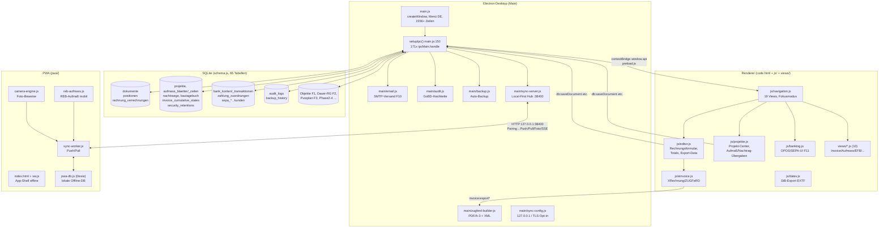
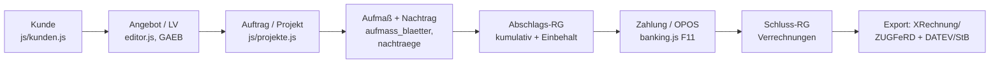

# 00 — Gesamtübersicht W-Link ERP

**Version:** 1.0.5 (`package.json:2-5`) · **App-ID:** `com.wlink.erp` · **Start:** `electron .` (`package.json:7`), Fenster 1400×900 lädt `code.html` (`main.js:21-35,94`) · **Build:** `electron-builder`, NSIS oneClick perMachine (`package.json:13-29`) · **DB:** `better-sqlite3`, WAL + FK (`db.js:23-34`), Pfad `userData/database.sqlite` bzw. Repo-`database.sqlite` als Fallback (`db.js:5-21`).

## Architektur-Graph

## Kern-Flow (Zielbild Plan: Kunde → … → StB-Export)

Datei:Zeile-Anker pro Schritt stehen in [02-rechnungskern-flow.md](02-rechnungskern-flow.md).

## Modulstatus (freigegeben / experimentell / geparkt)

Quelle Fokusmodus: `js/navigation.js:168-180` (`CORE_VIEWS` / `EXPERIMENTAL_VIEWS`, Flag `experimental_module`, Standard **aus**).

| Status | Module (Views) | Bemerkung |
|---|---|---|
| **CORE = Pilot-Kern** | dashboard, kunden, angebote, projekte (+projekt-details), rechnungen, banking (OPOS-Anteil), berichte (StB-Export), einstellungen | Kern-Flow; aber: Prüfbericht-Urteil **FREIGABE NEIN** (7 P0-Lücken, s. 05) |
| **EXPERIMENTAL (Opt-in, Standard aus)** | objekte (F1), dauerrechnungen (F2), putzplan (F3), artikel, maengel, zeiterfassung, sync, grosshandel (IDS), sokabau | Produktiv vorhanden, aber „nicht pilotiert" (Plan P0.6) |
| **Geparkt (Pläne, nicht eingebaut)** | `plans/objektverwaltung-plan.md`, `daurerchnungen-plan.md`, `bankimport-opos-sepa-plan.md`, Phasen 1–5 u. a. | Dürfen nicht als Scope in P0/P1 einfließen (Plan, Anhang B) |
| **Explizit Nicht-Ziele** | FiBu/Lohn/Lager-Neubau, Frameworkwechsel, Multi-User/File-Share, E-Rechnungs-Empfang | Plan Stop-Regeln P0 |

**UNKLAR:** Ob `banking`-View intern zwischen freigegebenem OPOS-Kern und experimentellen SEPA/Banking-Erweiterungen trennt — `navigation.js` kennt nur View-Ebene, keine Teil-Flags.

## Datei-Verantwortung (Top-Level)

| Datei / Ordner | Verantwortung | Status | Prüfhinweis |
|---|---|---|---|
| `main.js` | Fenster, Menü, alle IPC-Handler, ZUGFeRD/XRechnung-Export, Sync-Autostart, Quit-Backup | Kern, aktiv | Export-Gates `main.js:1058-1066,1160-1166` prüfen (B-3) |
| `preload.js` | `window.api`-Brücke (contextIsolation an) | Kern, aktiv | Kongruenz zu `main.js`-Handles (Modulaudit: 0 fehlend) |
| `db.js` (~4900 Zeilen) | DB-Pfad, `dbAPI`, GoBD-Schreibschutz `applyDocumentWrite`, Transaktionen | Kern, aktiv | Guard nur bei `isLocked` (`db.js:106-118`) — B-6 |
| `schema.js` | 65 Tabellen + Migrationen + Seeds | Kern, aktiv | Sync-Migration setzt `auto_start=false` (Plan 0.2) |
| `controllers/` (22) | Fachlogik: Totals, Einbehalt, Banking, SEPA, EFB, GAEB, Mängel … | Gemischt | Doppelpfad Einbehalt (B-4): `InvoiceController` vs `CumulativeBillingController` |
| `views/` (10) + `js/` (22) | Rendering + Formularlogik | Gemischt | `InvoiceView.getFormData` kennt keinen `retentionMode` (B-4) |
| `main/` (10) | Sync-Server, Audit, Backup, Mail, ZUGFeRD-Builder, IDS, Mängel-PDF | Kern + experimental | Sync-Auth-Matrix OK (Prüfbericht O-2) |
| `pwa/` (11 js + Root-Shell + CSS) | Offline-Shell, Dexie-DB, Sync-Worker, REB-Aufmaß, Kamera | Experimental | SW-Cache-Risiko n. Update (Plan P0.1) |
| `tests/` (52 Suites) | Unit/Integration/Negativmatrix | Teilweise Mock-basiert | Übergabe-Tests nur String-Checks (B-7) |
