# 01 — Navigation & Views

**Quelle:** `js/navigation.js` (360 Zeilen). Router = `switchView(viewName)` (`:217-297`), zeigt `view-<name>`-Container, setzt Header aus `viewConfig`, Autofokus + ESC-/Strg+S-Shortcuts (`:299-356`).

## Fokusmodus (P0.6)

- `CORE_VIEWS` (`:172-175`): `dashboard, kunden, angebote, projekte, projekt-details, rechnungen, banking, berichte, einstellungen`
- `EXPERIMENTAL_VIEWS` (`:177-180`): `objekte, objekt-details, dauerrechnungen, putzplan, maengel, zeiterfassung, grosshandel, sokabau, sync, artikel`
- Flag: `experimental_module` in `state.einstellungen` (`:182-191`); **kein Setter/keine Checkbox im Code gefunden** → B-13 (P1).
- `applyFocusMode()` (`:198-215`) blendet nur per `display:none` aus, löscht nichts (OK-Vermerk O-4).
- `views`-Array (`:147-150`): 19 Einträge. `viewConfig` (`:3-145`): 18 Einträge — **`projekt-details` hat keinen eigenen `viewConfig`-Eintrag** (Rendern via `renderProjekte`, UNKLAR ob beabsichtigt).

## Mermaid-Graph (Menü → View → Renderer)

```mermaid
graph TD
    subgraph CORE["CORE (Standard sichtbar)"]
        N_DASH["nav-dashboard"]
        N_KUND["nav-kunden"]
        N_ANGE["nav-angebote"]
        N_PROJ["nav-projekte<br/>+ projekt-details"]
        N_RECH["nav-rechnungen"]
        N_BANK["nav-banking<br/>F11"]
        N_BER["nav-berichte"]
        N_EIN["nav-einstellungen"]
    end
    subgraph EXP["EXPERIMENTAL (Flag aus = versteckt)"]
        N_OBJ["nav-objekte F1<br/>+ objekt-details"]
        N_DAU["nav-dauerrechnungen F2"]
        N_PUTZ["nav-putzplan F3"]
        N_ART["nav-artikel"]
        N_MAE["nav-maengel"]
        N_ZEIT["nav-zeiterfassung"]
        N_SYNC["nav-sync"]
        N_GROSS["nav-grosshandel IDS"]
        N_SOKA["nav-sokabau"]
    end
    N_DASH --> V_DASH["renderDashboard<br/>js/dashboard.js"]
    N_KUND --> V_KUND["renderKunden<br/>js/kunden.js"]
    N_ANGE --> V_ANGE["renderAngebote<br/>js/dashboard.js:725"]
    N_PROJ --> V_PROJ["renderProjekte<br/>js/projekte.js"]
    N_RECH --> V_RECH["renderRechnungen<br/>js/dashboard.js:129 + InvoiceView"]
    N_BANK --> V_BANK["renderBanking<br/>js/banking.js"]
    N_BER --> V_BER["initBerichte<br/>js/berichte.js + datev.js"]
    N_EIN --> V_EIN["loadEinstellungenToForm<br/>js/einstellungen.js"]
    N_OBJ --> V_OBJ["renderObjekte<br/>js/objekte.js"]
    N_DAU --> V_DAU["renderDauerrechnungen<br/>js/dauerrechnungen.js"]
    N_PUTZ --> V_PUTZ["renderPutzplan<br/>js/putzplan.js"]
    N_ART --> V_ART["renderArtikel<br/>js/artikel.js"]
    N_MAE --> V_MAE["MaengelView<br/>views/MaengelView.js"]
    N_ZEIT --> V_ZEIT["ZeiterfassungView<br/>views/ZeiterfassungView.js"]
    N_SYNC --> V_SYNC["SyncView<br/>views/SyncView.js"]
    N_GROSS --> V_GROSS["GrosshandelView<br/>views/GrosshandelView.js"]
    N_SOKA --> V_SOKA["SokaBauView<br/>views/SokaBauView.js"]
```

**Geklärt (Audit 10.09.2026):** `renderAngebote` (`js/dashboard.js:725`) und `renderRechnungen` (`js/dashboard.js:129`) sind Listen-Renderer; das Rechnungs-Modal selbst liegt in `js/editor.js` + `views/InvoiceView.js`. Angebotsliste und Rechnungsliste teilen sich das Rechnungs-Modal (`#rechnung-modal`, s. ESC-Liste `:309`).

## Volltabelle: View → Menüpunkt → Fokus → Renderer → Status

| # | Route (`view-`/`nav-`) | Menüpunkt (Titel — Untertitel) | Fokus | Renderer (Datei) | Status | Prüfhinweis |
|---|---|---|---|---|---|---|
| 1 | `dashboard` | Dashboard-Übersicht — Startseite | CORE | `js/dashboard.js` | freigegeben | — |
| 2 | `rechnungen` | Ausgangsrechnungen — Alle Rechnungen | CORE | `js/dashboard.js:129` (Liste) + `views/InvoiceView.js` + `js/editor.js` (Modal) | freigegeben* | *mit 7 P0-Lücken (s. 05) |
| 3 | `artikel` | Artikel & Bestand — Artikelverwaltung | EXPERIMENTAL | `js/artikel.js` | experimentell | Bestand wird bei RG-Speichern fortgeschrieben (`db.js:137-186`) |
| 4 | `kunden` | Kundenadressbuch — Kundenverwaltung | CORE | `js/kunden.js` | freigegeben | §48b-/13b-Felder, SEPA-Mandate |
| 5 | `angebote` | Angebote — Alle offenen Angebote | CORE | `js/dashboard.js:725` (Liste) + `js/editor.js` (Modal) | freigegeben* | Typ `angebot` in `dokumente`; Vorgänger-Filter B-5 zieht Angebote fälschlich ein |
| 6 | `projekte` | Projektmanagement — Rentabilitätsübersicht | CORE | `js/projekte.js` (~2600 Zeilen) | freigegeben* | Übergabe-Sperrlücke B-6, Persistenzlücke B-7 |
| 7 | `projekt-details` | (kein `viewConfig`-Eintrag) | CORE | `js/projekte.js` | freigegeben* | UNKLAR: kein eigener Titel |
| 8 | `objekte` | Objektverwaltung — Liegenschaften & Gebäude | EXPERIMENTAL | `js/objekte.js` | experimentell | F1-Hierarchie L→G→E→R |
| 9 | `objekt-details` | Objekt-Detail — Struktur & Historie | EXPERIMENTAL | `js/objekte.js` (`refreshObjektDetails`) | experimentell | — |
| 10 | `dauerrechnungen` | Dauerrechnungen — Abrechnungspläne & Läufe | EXPERIMENTAL | `js/dauerrechnungen.js` | experimentell | F2: `abrechnungsplaene`, `dauerrechnung_laeufe` |
| 11 | `putzplan` | Putzplan & LV — Flächen, Turni, Zuschläge | EXPERIMENTAL | `js/putzplan.js` | experimentell | F3: `lv_bereiche/_positionen` |
| 12 | `banking` | Banking & OPOS-Abgleich — … & SEPA (F11) | CORE | `js/banking.js` | freigegeben* | OPOS-Matcher 4-stufig; SEPA-Anteil UNKLAR (s. 00) |
| 13 | `maengel` | Mängelkataster & Fristenradar — VOB/B §13 & BGB §641(3) | EXPERIMENTAL | `views/MaengelView.js` | experimentell | `maengelkataster`, Fristen |
| 14 | `zeiterfassung` | Zeiterfassung & VOB/B Bautagebuch — BAG/ArbZG | EXPERIMENTAL | `views/ZeiterfassungView.js` | experimentell | `zeiterfassung`, `bedenken_behinderungen` |
| 15 | `sync` | Local-First P2P Sync & Mobile Hub — QR-Pairing & Quarantäne | EXPERIMENTAL | `views/SyncView.js` | experimentell | Auth-Matrix OK (O-2), Testhärtung offen (B-12) |
| 16 | `grosshandel` | Großhandels-Center & IDS Connect 2.5 | EXPERIMENTAL | `views/GrosshandelView.js` | experimentell | `ids:cartReceived`-Push |
| 17 | `sokabau` | SOKA-BAU & Lohn-Compliance — BRTV, DTA-Bau, §14 AEntG | EXPERIMENTAL | `views/SokaBauView.js` | experimentell | `soka_*`-Tabellen |
| 18 | `berichte` | Umsatzsteuerberechnung — Berichte | CORE | `js/berichte.js` + `js/datev.js` | freigegeben | DATEV EXTF 700 |
| 19 | `einstellungen` | Systemeinstellungen — Konfiguration | CORE | `js/einstellungen.js` (~113 kB) | freigegeben | `experimental_module`-Flag ohne UI (B-13) |

Zusatz-Views ohne `views/`-Klasse: `AufmassView.js`, `DatanormView.js`, `EFBView.js`, `KalkulationView.js` (in Projekt-/Modal-Kontext eingebettet, UNKLAR exakt welcher Menüpunkt sie öffnet — vermutlich Projekt-Details/Aufmaß-Modal).
