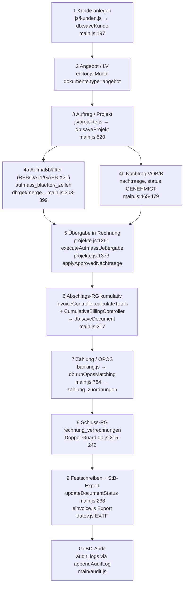

# 02 — Rechnungskern-Flow (Kunde → StB-Export)

**Plan-Referenz:** `plans/w-link-bau-rechnungskern-stabilisierung-plan.md` P0.2–P0.4 · **Prüf-Referenz:** Prüfbericht §§ 1–3.

## Flowchart mit Datei:Zeile-Ankern

## Schritt-Tabelle: Was passiert, wo, mit welchem Risiko

| Schritt | Aktion (UI) | Rechen-/Speicher-Ort (Datei:Zeile) | Tabellen | Status | Prüfhinweis (P0-Lücke) |
|---|---|---|---|---|---|
| 1 | Kunde anlegen/pflegen | `js/kunden.js` → `db:saveKunde` (`main.js:197-202`) | `kunden` | freigegeben | 13b-/B2B-Gates in `InvoiceController.validateSaveDocument` |
| 2 | Angebot schreiben, LV-Positionen | `js/editor.js` Rechnungs-Modal, `views/InvoiceView.js:142-171` `getFormData` | `dokumente` (`type=angebot`), `positionen` | freigegeben* | B-5: Angebote werden fälschlich als Vorgänger-Rechnungen eingerechnet |
| 3 | Auftrag/Projekt anlegen | `js/projekte.js` → `db:saveProjekt` (`main.js:520-525`) | `projekte` | freigegeben | — |
| 4a | Aufmaß erfassen (Blätter/REB, DA11-/X31-Ex-/Import) | `db:getAufmassBlaetter/saveAufmassBlatt/mergeSchlussaufmass` (`main.js:303-317`), `aufmass:exportDA11` (`:319-345`), `exportGAEBX31` (`:348-371`), `importGAEBX31` (`:373-399`) | `aufmass`, `aufmass_positionen`, `aufmass_blaetter`, `aufmass_zeilen` | freigegeben* | B-6/B-7: Übergabe-Sperre + Persistenz |
| 4b | Nachtrag einreichen → genehmigen | `db:getNachtraege/saveNachtrag/updateNachtragStatus` (`main.js:465-479`), `controllers/NachtragController.js` (`extractApprovedPositionsForInvoice`) | `nachtraege`, `nachtrag_positionen` | freigegeben* | B-7: ohne Rechnungs-ID keine Persistenz; Idempotenz-Key-Kollision (P1 B-10) |
| 5 | Übergabe Aufmaß/Nachtrag → Rechnung | `js/projekte.js:1261-1321` (`executeAufmassUebergabe`, `applyApprovedNachtraegeToCurrentInvoice`) → `db:saveDocument` (`main.js:217`) | `dokumente`, `positionen` | **P0-offen** | **B-6** Sperrlücke (kein `Festgeschrieben`-Check, kein Main-Guard); **B-7** kein Reload-Nachweis |
| 6 | Abschlags-RG kumulativ + Einbehalt | `js/editor.js:1497-1543` (`calculateRechnungTotals`) → `controllers/InvoiceController.js:91-226` (`calculateTotals`); kumulativ: `controllers/CumulativeBillingController.js:46-76` | `dokumente`, `invoice_cumulative_states`, `security_retentions` | **P0-offen** | **B-4** Formular übergibt nur `previousInvoices` (`editor.js:1542`), kein `retentionMode/contractTotalNet`; **B-5** Vorgänger-Filter ohne Typ/Status (`editor.js:1527-1530`); Steuer trotz Einbehalt korrekt (OK O-1) |
| 7 | Zahlung erfassen, OPOS-Abgleich | `js/banking.js` → `db:runOposMatching` (`main.js:784`), `db:applyPaymentMatching` (`:788`), CAMT/CSV-Import (`db:importBankTransactions` `:775`) | `bank_konten`, `bank_transaktionen`, `zahlung_zuordnungen` | freigegeben* | P1 B-8: `computeProjectBalance`-Formel (`InvoiceController.js:268-276`) fragwürdig |
| 8 | Schluss-RG mit Verrechnungen, Storno per Gutschrift | `db:saveDocument` → `applyDocumentWrite` (`db.js:92-208`), Doppel-Guard `insertVerrechnungenGuarded` (`db.js:215-242`), `db:storniereRechnung` (`main.js:253`) atomar | `dokumente`, `positionen`, `rechnung_verrechnungen` | freigegeben | GoBD-Löschsperre `db.js:807-856` (OK O-3); schmaler Statuspfad `updateDocumentStatus` (`main.js:238`) |
| 9a | E-Rechnung: XRechnung-XML / ZUGFeRD-PDF | `js/editor.js:951-1009` (`collectERechnungExportData`) → `invoice:exportXRechnungXml` (`main.js:1152-1216`) / `invoice:exportZugferdPdf` (`:1050-1149`) via `js/einvoice.js` + `main/zugferd-builder.js` | `dokumente` (Soll: DB-Beleg), `audit_logs` (`ZUGFERD_EXPORT`/`XRECHNUNG_EXPORT`) | **P0-offen** | **B-1** falsche 3.0-URN (`einvoice.js:6,320,339`); **B-2** kein KoSIT-/veraPDF-Nachweis; **B-3** Export aus DOM statt DB (`editor.js:985-996`) |
| 9b | StB-Export DATEV EXTF 700, E-Mail-Versand | `js/datev.js`, `js/berichte.js`; `smtp:sendBeleg` (`main.js:730`) via `main/email.js` | `email_versandhistorie` | freigegeben | DATEV-Vorzeichenfix laut Modulaudit behoben |
| 10 | GoBD: Sperre, Entsperren mit Grund, Audit-Kette | `db:unlockDocument` (`main.js:247`), `entsperreBeleg` (`db.js`), `audit:verify` (`main.js:264`), `main/audit.js` | `audit_logs` | freigegeben | Kette verifizierbar; Lücke nur Status-ohne-Lock (B-6) |

## Abnahme-Rechenbeispiel (Referenz, aus Prüfbericht § 1 — Implementierung korrekt, Planwert 109 € falsch)

Auftrag 1.000 € netto, 19 % USt, 5 % Einbehalt EXECUTION: AR1 (L=100) → Einbehalt 5, Zahlbetrag **114** · Teilzahlung 50 · AR2 (L=200) → Perioden-Einbehalt **5** (nicht 9!), Zahlbetrag **114** · Nachtrag +100 (L=300) → Einbehalt 5, Zahlbetrag **114**. Σ Einbehalt = 15 (5+5+5). Tests: `tests/cumulative_retention_chain.test.js`, `tests/retention_vob_rules.test.js`, `tests/invoice_controller.test.js`.
