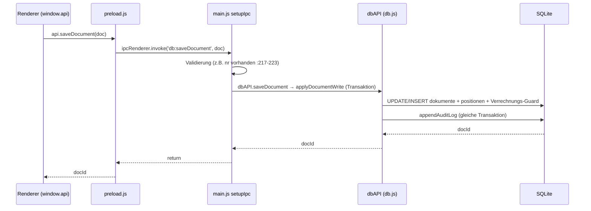

# 03 — Daten, IPC & Sync-Technik

## 3.1 SQLite-Tabellen (65 eindeutig, `schema.js`)

Kerntabellen fett. Migrationsblock in `schema.js` (~ab `:1400`) wiederholt Create-Statements (idempotent) — hier einmal gezählt (Audit 10.09.2026: 65 eindeutige Namen; die Zeilen 5 und 64 der Tabelle enthalten je zwei Namen, #32 ist Platzhalter).

```mermaid
erDiagram
    kunden ||--o{ dokumente : "kundeId"
    projekte ||--o{ dokumente : "projektId"
    dokumente ||--o{ positionen : "dokumentId"
    dokumente ||--o{ rechnung_verrechnungen : "aktuell/vorherig"
    projekte ||--o{ invoice_cumulative_states : "project_id"
    projekte ||--o{ security_retentions : "project_id"
    projekte ||--o{ aufmass_blaetter : "project_id"
    aufmass_blaetter ||--o{ aufmass_zeilen : "blatt_id"
    projekte ||--o{ nachtraege : "project_id"
    nachtraege ||--o{ nachtrag_positionen : "nachtrag_id"
    projekte ||--o{ bautagebuch : "project_id"
    projekte ||--o{ abnahmeprotokolle : "project_id"
    projekte ||--o{ eingangsrechnungen : "project_id"
    bank_konten ||--o{ bank_transaktionen : "konto"
    bank_transaktionen ||--o{ zahlung_zuordnungen : "transaktion"
    dokumente ||--o{ zahlung_zuordnungen : "dokument"
    kunden ||--o{ kunden_sepa_mandate : "kunde"
    sepa_lastschrift_laeufe ||--o{ sepa_lastschrift_positionen : "lauf"
    liegenschaften ||--o{ gebaeude : "liegenschaft"
    gebaeude ||--o{ etagen : "gebaeude"
    etagen ||--o{ raeume : "etage"
    abrechnungsplaene ||--o{ abrechnungsplan_positionen : "plan"
    abrechnungsplaene ||--o{ dauerrechnung_laeufe : "plan"
    dokumente ||--o{ dauerrechnung_laeufe : "dokument"
    projekte ||--o{ maengelkataster : "projekt"
    maengelkataster ||--o{ maengel_fotos : "mangel"
    maengelkataster ||--o{ maengel_historie : "mangel"
    mitarbeiter ||--o{ zeiterfassung : "mitarbeiter"
```

| # | Tabelle | Domäne | # | Tabelle | Domäne |
|---|---|---|---|---|---|
| 1 | **artikel** | Stamm | 33 | **kunden_sepa_mandate** | SEPA |
| 2 | **kunden** | Stamm | 34 | **sepa_lastschrift_laeufe** | SEPA |
| 3 | **dokumente** (`rechnung`/`angebot`) | **Kern** | 35 | **sepa_lastschrift_positionen** | SEPA |
| 4 | **positionen** | **Kern** | 36 | efb_profile | EFB/VHB |
| 5 | aufmass + aufmass_positionen (legacy) | Aufmaß | 37 | **audit_logs** | GoBD |
| 6 | **rechnung_verrechnungen** | **Kern** | 38 | **backup_history** | Backup |
| 7 | **invoice_cumulative_states** | Einbehalt | 39 | zuschlagskalkulation_stamm | Phase 2 |
| 8 | **security_retentions** | Einbehalt | 40 | zuschlagskalkulation_projekte | Phase 2 |
| 9 | projekte | Bau | 41 | datanorm_kataloge | Phase 2 |
| 10 | **aufmass_blaetter** | Bau | 42 | datanorm_warengruppen | Phase 2 |
| 11 | **aufmass_zeilen** | Bau | 43 | datanorm_rabattgruppen | Phase 2 |
| 12 | **nachtraege** | Bau | 44 | maengelkataster | Phase 2 |
| 13 | **nachtrag_positionen** | Bau | 45 | maengel_fotos | Phase 2 |
| 14 | bautagebuch | Bau | 46 | maengel_historie | Phase 2 |
| 15 | abnahmeprotokolle | Bau | 47 | mitarbeiter | Phase 3 |
| 16 | eingangsrechnungen | Controlling | 48 | zeiterfassung | Phase 3 |
| 17 | einstellungen (KV-Store, inkl. Sync-Keys) | System | 49 | sync_processed_mutations | Sync |
| 18 | liegenschaften | F1 Objekte | 50 | bedenken_behinderungen | VOB |
| 19 | gebaeude | F1 | 51 | sync_conflicts | Sync |
| 20 | etagen | F1 | 52 | ids_connect_konten | Phase 4 |
| 21 | raeume | F1 | 53 | ids_warenkoerbe | Phase 4 |
| 22 | abrechnungsplaene | F2 | 54 | ids_artikel_dokumente | Phase 4 |
| 23 | abrechnungsplan_positionen | F2 | 55 | soka_beitragssaetze | Phase 4 |
| 24 | dauerrechnung_laeufe | F2 | 56 | soka_bau_meldungen | Phase 4 |
| 25 | lv_bereiche | F3 | 57 | soka_bau_arbeitnehmer_monat | Phase 4 |
| 26 | lv_positionen | F3 | 58 | soka_bau_ausfallzeiten | Phase 4 |
| 27 | putzplan_eintraege | F3 | 59 | subcontractor_compliance_nachweise | Phase 4 |
| 28 | email_versandhistorie | F10 Mail | 60 | kolonnen | Phase 5 UNKLAR* |
| 29 | **bank_konten** | F11 | 61 | kolonnen_mitarbeiter | Phase 5 UNKLAR* |
| 30 | **bank_transaktionen** | F11 | 62 | bauplaene | Phase 5 UNKLAR* |
| 31 | **zahlung_zuordnungen** | F11 OPOS | 63 | geraete_buchungen | Phase 5 UNKLAR* |
| 32 | — | — | 64 | lieferscheine_digital + maengel (legacy?) | UNKLAR* |

\* **UNKLAR:** `kolonnen*`, `bauplaene`, `geraete_buchungen`, `lieferscheine_digital`, zweites `maengel` (neben `maengelkataster`) — kein zugehöriger Controller/IPC in `main.js` gefunden; vermutlich Phase-5-Vorrat ohne Verdrahtung.

## 3.2 IPC-Kanäle (171× `ipcMain.handle` in `main.js:181-1508`, Brücke `preload.js` → `window.api`)

Jeder Kanal ist in `wrapHandler` (Fehlerdurchreichung, `main.js:172-179`) gehüllt. Push-Kanäle Main→Renderer: `datanorm:progress` (`main.js:1250-1254`), `ids:cartReceived` (`:1413-1417`, Empfang `preload.js:203-205`).

**Kanal-Gruppen (vollständig, namentlich):**

| Gruppe | Kanäle (`ipcMain.handle`-Name) | Handler-Zeilen |
|---|---|---|
| State/Stamm | `db:getFullState`, `db:saveArtikel`, `db:deleteArtikel`, `db:saveKunde`, `db:deleteKunde`, `db:bulkSaveKunden`, `db:saveProjekt`, `db:saveEinstellung` | `main.js:181-209,520,846` |
| Dokumente/GoBD | `db:saveDocument`, `db:bulkSaveDocuments`, `db:deleteDocument`, `db:updateDocumentStatus`, `db:unlockDocument`, `db:storniereRechnung`, `audit:verify` | `main.js:217-267` |
| Aufmaß/GAEB | `db:saveAufmass`, `db:deleteAufmass`, `db:getAufmassById`, `db:getAufmassByPositionId`, `db:saveAufmassForPosition`, `db:getAufmasseByRechnungId`, `db:getAufmasseByProjektId`, `db:getAufmassBlaetter`, `db:saveAufmassBlatt`, `db:deleteAufmassBlatt`, `db:mergeSchlussaufmass`, `aufmass:exportDA11`, `aufmass:exportGAEBX31`, `aufmass:importGAEBX31` | `main.js:269-399` |
| EFB | `efb:getKalkulation`, `efb:saveProfil`, `efb:generatePdf` | `main.js:402-462` |
| Nachtrag/Bautagebuch/Controlling | `db:getNachtraege`, `db:saveNachtrag`, `db:updateNachtragStatus`, `db:deleteNachtrag`, `db:getBautagebuch`, `db:saveBautagebuch`, `db:deleteBautagebuch`, `db:getAbnahmeprotokolle`, `db:saveAbnahmeprotokoll`, `db:getEingangsrechnungen`, `db:saveEingangsrechnung`, `db:deleteEingangsrechnung`, `db:getControllingStats` | `main.js:465-517` |
| Objekte F1 | `db:getObjektBaum`, `db:saveLiegenschaft`, `db:deleteLiegenschaft`, `db:saveGebaeude`, `db:deleteGebaeude`, `db:saveEtage`, `db:deleteEtage`, `db:saveRaum`, `db:deleteRaum`, `db:getObjektDetails`, `db:getObjektHistorie` | `main.js:530-604` |
| Dauer-RG F2 | `db:getAbrechnungsplaene`, `db:saveAbrechnungsplan`, `db:deleteAbrechnungsplan`, `db:updateAbrechnungsplanStatus`, `db:getPlanLaeufe`, `db:dauerrechnungenVorschau`, `db:generiereFaelligeRechnungen`, `db:generiereSammelrechnung`, `db:storniereLauf`, `db:autoRunDauerrechnungen` | `main.js:607-664` |
| Putzplan F3 | `db:getPutzplan`, `db:saveLvBereich`, `db:deleteLvBereich`, `db:saveLvPosition`, `db:deleteLvPosition`, `db:getZuschlagsProfil`, `db:saveZuschlagsProfil`, `db:uebernehmeLvInAbrechnungsplan` | `main.js:667-708` |
| Mail F10 | `smtp:getKonten`, `smtp:saveKonto`, `smtp:deleteKonto`, `smtp:testConnection`, `smtp:sendBeleg`, `smtp:wiederholeVersand`, `smtp:getVersandhistorie` | `main.js:711-759` |
| Banking/SEPA F11 | `db:getBankKonten`, `db:saveBankKonto`, `db:deleteBankKonto`, `db:importBankTransactions`, `db:getBankTransaktionen`, `db:runOposMatching`, `db:applyPaymentMatching`, `db:unmatchTransaction`, `db:getKundenMandate`, `db:saveSepaMandat`, `db:deleteSepaMandat`, `db:getOffeneRechnungenFuerSepa`, `db:createSepaRun`, `db:getSepaLaeufe`, `db:getSepaLaufDetails`, `db:exportSepaRunXml`, `db:storniereSepaLauf`, `db:markiereRuecklastschrift` | `main.js:761-843` |
| Backup/Dialog/Druck | `backup:create`, `backup:getHistory`, `backup:verify`, `backup:restore`, `db:backup`, `db:restore`, `qr:generate`, `app:focusWindow`, `dialog:confirm`, `dialog:alert`, `app:printDocument`, `save:pdf`, `invoice:exportZugferdPdf`, `invoice:exportXRechnungXml` | `main.js:882-1216` |
| Kalkulation/Datanorm/Mängel (Ph.2) | `kalkulation:getStammProfil`, `kalkulation:getAllStammProfile`, `kalkulation:saveStammProfil`, `kalkulation:deleteStammProfil`, `kalkulation:getProjectKalkulation`, `kalkulation:saveProjectProfil`, `datanorm:startImport`, `datanorm:getKataloge`, `datanorm:deleteKatalog`, `maengel:getKataster`, `maengel:getDetails`, `maengel:saveMangel`, `maengel:updateStatus`, `maengel:deleteMangel`, `maengel:generateMahnschreiben`, `maengel:generateProtokoll`, `maengel:executeErsatzvornahme` | `main.js:1223-1297` |
| Personal/VOB/Sync (Ph.3) | `mitarbeiter:getAll`, `mitarbeiter:save`, `mitarbeiter:delete`, `zeiterfassung:getAll`, `zeiterfassung:save`, `zeiterfassung:delete`, `zeiterfassung:getMonatsauswertung`, `vob:getAll`, `vob:save`, `vob:delete`, `vob:generatePdf`, `sync:getStatus`, `sync:configure`, `sync:startServer`, `sync:stopServer`, `sync:getPairingPayload`, `sync:getConflicts`, `sync:resolveConflict` | `main.js:1300-1391` |
| IDS/SOKA/Sub (Ph.4) | `ids:getKonten`, `ids:getKonto`, `ids:saveKonto`, `ids:deleteKonto`, `ids:launchShop`, `ids:getWarenkoerbe`, `ids:getWarenkorbDetails`, `ids:deleteWarenkorb`, `ids:importCartToDocument`, `ids:queryPriceAvailability`, `soka:getBeitragssaetze`, `soka:saveBeitragssatz`, `soka:getMeldungen`, `soka:getMeldungDetails`, `soka:calculateMeldung`, `soka:saveMeldung`, `soka:deleteMeldung`, `soka:exportFiles`, `subcontractor:getCompliance`, `subcontractor:auditAll`, `subcontractor:saveNachweis`, `subcontractor:deleteNachweis`, `subcontractor:getNachweise` | `main.js:1394-1508` |

## 3.3 Controller (22 Dateien, `controllers/`)

| Datei | Verantwortung | Status | Prüfhinweis |
|---|---|---|---|
| `InvoiceController.js` | `calculateTotals`, Steuer, Einbehalt (eigener Pfad), `validateSaveDocument`, Storno-Daten, `computeProjectBalance` | Kern, aktiv | Doppelpfad B-4/B-5/B-8 |
| `CumulativeBillingController.js` | Kumulative Kette (`Ziel − bereits einbehalten`) | Kern, aber im Formular ungenutzt | Soll einzige Einbehalt-Quelle werden (Plan P0.2) |
| `AufmassController.js` | Aufmaß-Fachlogik | Kern | — |
| `NachtragController.js` | `extractApprovedPositionsForInvoice` | Kern | — |
| `BautagebuchController.js` / `BautagebuchMobileController.js` | Bautagebuch Desktop/Mobil | Experimental | XSS-Fix verifiziert (Plan 0.3) |
| `ControllingController.js` | Soll/Ist, Controlling-Stats | Kern-nah | — |
| `BankingController.js` | CAMT/CSV-Parser, Hash-Dedupe, 4-stufiger OPOS-Matcher | Kern (F11) | — |
| `SepaController.js` | IBAN/BIC/Gläubiger-ID, pain.008, TARGET2-Tage | Kern (F11) | — |
| `DauerrechnungController.js` | Pläne, Rhythmen, Generierung, Sammel-RG | Experimental (F2) | — |
| `ReinigungController.js` | LV-Kalkulation, Turnus, Zuschläge, Mindestlohn | Experimental (F3) | — |
| `ObjektController.js` | Objekthierarchie F1 | Experimental | — |
| `EFBController.js` | Formblatt 221/223, Mittellohn | Experimental | — |
| `KalkulationController.js` | Zuschlagskalkulation Stamm/Projekt | Experimental (Ph.2) | — |
| `DatanormParser.js` | DATANORM 4/5 Streaming-Import | Experimental (Ph.2) | — |
| `MaengelController.js` | Mängelkataster, Fristen, Ersatzvornahme | Experimental (Ph.2) | — |
| `ZeiterfassungController.js` | Arbeitszeit BAG/ArbZG/BRTV, Monatsauswertung | Experimental (Ph.3) | — |
| `VobCorrespondenceController.js` | Bedenken-/Behinderungsanzeigen, PDF | Experimental (Ph.3) | — |
| `IDSConnectController.js` | IDS Connect 2.5, Warenkörbe | Experimental (Ph.4) | Preis-Mock in `main.js:1446-1453` (!) |
| `SokaBauController.js` | SOKA-Meldungen, Beitragssätze, Export | Experimental (Ph.4) | — |
| `SubcontractorController.js` / `SubcontractorComplianceController.js` | NU-Stamm / §14-AEntG-Nachweise | Experimental (Ph.4) | — |
