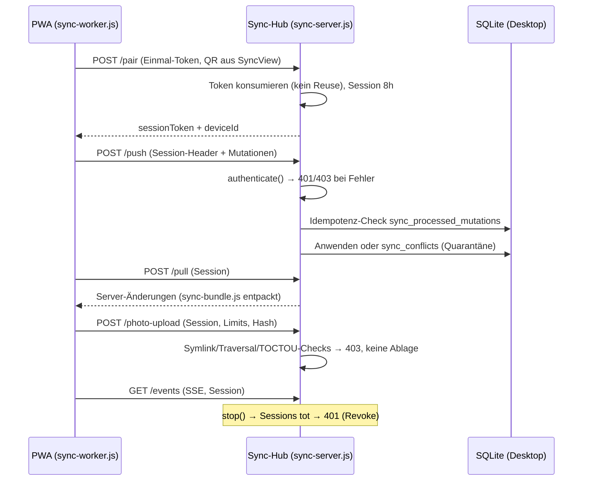

# 04 — Sync & PWA-Map

**Quellen:** `main/sync-server.js` (Routen `:574-630`, Auth `:303-314`, Foto-Härtung `:981-1092`), `main/sync-config.js` (Validierung), `main.js:1346-1391` (IPC) + `:1522-1530` (Autostart), `pwa/**`, `views/SyncView.js`, `doc/sync-security.md`, Tests `sync_server_security`, `sync_client_security`, `sync_p0_negativmatrix`.

## 4.1 Sync-Server: Routen + Auth-Matrix

Basis: `main/sync-server.js`. **Alle `/api/v1/sync/*`-Routen außer `/ping`, `/info` und `/pair` laufen durch `authenticate()` vor Body/DB/File** (`:593`), 401 ohne Token/Device-ID vs. 403 bei Geräte-Mismatch (`:303-314`). Token-Einmalverbrauch vor Session-Erstellung, Foto-Härtung (Symlink/TOCTOU/No-Replace/Hash), WS-Auth, TLS-Opt-in-Validierung (OK-Vermerk O-2).

| Route | Methode | Auth | Zweck |
|---|---|---|---|
| `/api/v1/sync/ping`, `/api/v1/sync/info` | GET | kein Auth (returnen vor Auth-Block, `:574-583`; offener Healthcheck) | Erreichbarkeits-/Info-Probe |
| `/api/v1/sync/pair` | POST | Einmal-Token + TTL, Rate-Limit | QR-Pairing, stellt 8h-Session aus |
| `/api/v1/sync/push` | POST | Session (`authenticate`), `bindBodyIdentity` inkl. Mutations-Identitätsbindung (`:377-402`) | Mutationen hochladen (idempotent via `sync_processed_mutations`) |
| `/api/v1/sync/pull` | POST | Session | Änderungen abholen |
| `/api/v1/sync/unpair` | POST | Session | Sitzung widerrufen |
| `/api/v1/sync/photo-upload` (Alias `/upload-photo`) | POST | Session + Upload-Limits + Symlink-/Traversal-Abwehr | Foto-Beweise |
| `/api/v1/sync/events` (SSE) | GET | Session (`:622`) | Live-Events; ≥ 8 offene Kanäle → 429 beim 9. Stream (`:623`, Plan P0.1, Test offen B-12) |
| WS | UNKLAR | WS-Auth (`:407-413`) | UNKLAR: eigene WS-Route vs. SSE — im Code nur Auth-Fundstelle verifiziert |

IPC-Steuerung (`main.js:1346-1391`): `sync:getStatus`, `sync:configure` (stoppt Server nach Speichern), `sync:startServer`, `sync:stopServer` (revoked Sessions), `sync:getPairingPayload` (nur wenn laufend), `sync:getConflicts`, `sync:resolveConflict` (Quarantäne-Center, Tabelle `sync_conflicts`).

## 4.2 Sequenz: Pairing → Push/Pull (+Foto, +SSE)

## 4.3 TLS-Opt-in & Autostart (Default: aus)

`main/sync-config.js:12-34` `validateSyncConfig`: Host nur `127.0.0.1`/`0.0.0.0`; LAN (`0.0.0.0`) ohne TLS → Validierungsfehler, kein HTTP-Fallback; TLS braucht Cert+Key (PEM). `main.js:1522-1530`: Autostart nur bei `loadSyncConfig(db).autoStart`; Schema-Migration resettet Alt-Profile auf `auto_start=false` + `127.0.0.1` (Plan 0.2).

## 4.4 PWA-Module (`pwa/`)

| Datei | Verantwortung | Status |
|---|---|---|
| `index.html`, `manifest.webmanifest`, `sw.js` | App-Shell, Installierbarkeit, Offline-Cache | experimental |
| `js/pwa-app.js` | Shell-Logik | experimental |
| `js/pwa-db.js` + `js/dexie.min.js` | Lokale Offline-DB (Dexie/IndexedDB) | experimental |
| `js/sync-worker.js` | Push/Pull-Loop gegen Hub | experimental |
| `js/sync-bundle.js` + `js/crypto-sync-bundle.js` | Bundle-Serien-/Verschlüsselung (Desktop-Gegenstück: `main/sync-bundle-importer.js`) | experimental |
| `js/reb-aufmass.js` | REB-Aufmaß mobil | experimental |
| `js/plan-viewer.js` | Plan-Ansicht | experimental |
| `js/camera-engine.js` | Foto-Beweise | experimental |
| `js/barcode-scanner.js`, `js/bluetooth-laser.js` | Scanner/Laser-Distanz | experimental |
| `css/pwa.css` | PWA-Styles | experimental |

## 4.5 Negativfälle (Teststand)

- Abgedeckt (Code + Suites grün unter Electron-Runtime): Push/Pull/Foto/SSE ohne Auth → 401; falsche Device-ID → 403; Token-Reuse → 403; Fremd-Device-Write ändert keine DB-Zeilen; Hub-Stopp → 401 (`tests/sync_p0_negativmatrix.test.js` 6/6, Prüfbericht § 4).
- **Offen (P1 B-12):** kein Symlink-Upload-Root-/Dotfile-/Limit-Test, kein `≥8 Kanäle → 429`-Test, kein WS-Handshake-Negativtest, kein TLS-Opt-in-Negativtest in neuer Suite; kein statischer Router-Check „neue Route fällt default durch Auth". Unter System-Node sind Sync-Suites ABI-rot (`better-sqlite3` Electron-Build, `openssl` fehlt) — vorbestehend, keine P0-Regression (Prüfbericht § 4).
- Risiko: PWA-SW-Cache nach Update (alte Shell mit altem Token-Flow) → Doku-Schritt „PWA online öffnen, Update abwarten" (`doc/sync-security.md`).
