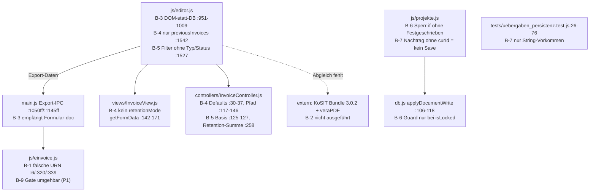

# 05 — Risiken & Prüfpunkte (7 P0-Lücken verortet)

**Quelle:** `doc/pruefbericht_2026-09-10_rechnungskern-p0.md` § 2.1 (Urteil: FREIGABE NEIN). Jede Lücke ist hier im Map-Graph verortet — Datei:Zeile öffnen, Befund nachvollziehen.

## Lage-Graph: Wo die Lücken im Kern-Flow sitzen

## Befund-Tabelle (alle 7, mit Map-Verweis)

| # | Befund (Kurz) | Datei:Zeile | Liegt in Map-Datei | Plan-Verstoß |
|---|---|---|---|---|
| **B-1** | XRechnung-3.0-URN nutzt 2.x-Namensraum (`…xoev-de…xrechnung_3.0` statt `…xeinkauf.de…`) → jede 3.0-RG ungültig (BR-DE-21); Tests prüfen nur Substring | `js/einvoice.js:6`, `:320`, `:339`; `tests/erechnung_belegfixierung.test.js:11-15,45-47` | 02 Schritt 9a, 03 IPC `invoice:exportXRechnungXml` | P0.4.2 („kein reiner String-Tausch") |
| **B-2** | Kein externer KoSIT-/veraPDF-Nachweis (nur Checkliste, „hier nicht ausgeführt") | `doc/session_summary_2026-09-10_rechnungskern-stabilisierung-p0.md:46`; `doc/release/checklist.md:23-27` | 04 § 4.5 analog; 02 Schritt 9a | P0.4 Acceptance (Bundle 3.0.2 + Berichte im Release-Archiv) |
| **B-3** | Export nicht belegfixiert: Gate prüft ID/Status (`editor.js:954-965`), Zahlen kommen aus DOM + `state.currentRechnungTotals` (`:966-1006`); Main-IPC empfängt Formular-`doc` (`main.js:1055-1061,1160-1166`) | `js/editor.js:951-1009`; `main.js:1050ff,1145ff` | 02 Schritt 9a, 03 IPC-Tabelle | P0.4.1 (Beleg aus DB laden; `PDF == XML == DB`) |
| **B-4** | EXECUTION-Deckel wirkungslos: `calculateRechnungTotals` übergibt nur `previousInvoices` (`:1542`); `getFormData` kennt `retentionMode/contractTotalNet/totalPerformanceNet` nicht; Controller fällt auf Defaults zurück (`WARRANTY/0/null`) | `js/editor.js:1520-1543`; `views/InvoiceView.js:159-171`; `controllers/InvoiceController.js:30-37,117-146` | 02 Schritt 6 | P0.2.1/2.2 (ein Einbehalt-Pfad inkl. Deckel, `previousRetentionTotal` aus gespeicherten Belegen) |
| **B-5** | Vorgänger-Filter `projektId-Match && id != curId` zieht Angebote/Schluss-RG/Stornos/Gutschriften/Folge-Abschläge ein → kumulative Basis + `sumPreviousRetention` verfälscht | `js/editor.js:1525-1530`; `controllers/InvoiceController.js:42-44,125-127,258-262` | 02 Schritte 2→6, 03 ER (dokumente.type) | P0.2.2 (nur Vorgänger-Abschläge); BauGrid-Logik |
| **B-6** | Sperrlücke Übergabe: Renderer blockt nur `isLocked/Storniert/Bezahlt`, nicht `Festgeschrieben` ohne Lock; `applyDocumentWrite` nur bei `existingWasLocked`; kein Main-/IPC-Guard für Übergabe | `js/projekte.js` (`executeAufmassUebergabe` Sperr-`if`); `db.js:106-118` | 02 Schritt 5, 01 View `projekte` | P0.3.3 (Renderer **und** Main/IPC; Entsperren nur mit Grund + Audit) |
| **B-7** | Kein Persistenz-/Reload-Nachweis: Test prüft String-Vorkommen + Dedupe-Simulation statt IPC-`save→get→reload`; `applyApprovedNachtraege…` ohne Rechnungs-ID persistiert nichts (nur `getFullState`-Read) | `tests/uebergaben_persistenz.test.js:26-76`; `js/projekte.js` (`applyApproved…`) | 02 Schritt 5, 03 Sequenz | P0.3 Acceptance (SELECT-Nachweis, Reload nach Neustart) |

## P1-Anschluss (6, Kurzverortung — kein P0, aber Freigabepfad § 3 Punkt 5)

| # | Kurz | Datei:Zeile |
|---|---|---|
| B-8 | `computeProjectBalance` subtrahiert freigegebene Einbehalte (Forderungslogik ungeklärt) | `controllers/InvoiceController.js:268-276`; `tests/cumulative_retention_chain.test.js:61-70` |
| B-9 | `assertExportfaehigerBeleg` wird von `generateXRechnungXML`/`buildCII` nie aufgerufen | `js/einvoice.js:338-361` |
| B-10 | Nachtrag-Idempotenz-Key `N:id:name` kollidiert bei Namensdopplung; kein Lock-Check vor Push | `js/projekte.js` (`existingKeys`-Block) |
| B-11 | `CREATE_NEW`-Entwurf mit `kundeId:null`, `preis:0`-Fallback wird gespeichert statt validiert | `js/projekte.js` (`CREATE_NEW`-Zweig) |
| B-12 | Negativmatrix unvollständig (Symlink-Root, 429, WS, TLS, Router-Check) | `tests/sync_p0_negativmatrix.test.js:126-158`; `main/sync-server.js:623,413` |
| B-13 | `experimental_module`-Flag ohne UI/Setter/Doku auffindbar | `js/navigation.js:168-216`; `tests/ui_fokusmodus.test.js` |

## Hinweise (3) + OK (4) — zur Einordnung

- H-1: Einbehalt-Basis fix netto, keine Vertrags-Option (`InvoiceController.js:122-128`) — P1-Kandidat bei Brutto-Verträgen.
- H-2: Dead Code `void finalStatus` (`einvoice.js:355-359`) — Regel `locked || Festgeschrieben` klären.
- H-3: Planwert AR2 109 € falsch, Implementierung 114 € korrekt — **kein Code-Mangel**.
- O-1…O-4 (abgenommen): Steuer trotz Einbehalt; Sync-Auth-Matrix; DB-GoBD-Guard bei `isLocked`; Fokusmodus löscht nichts.
