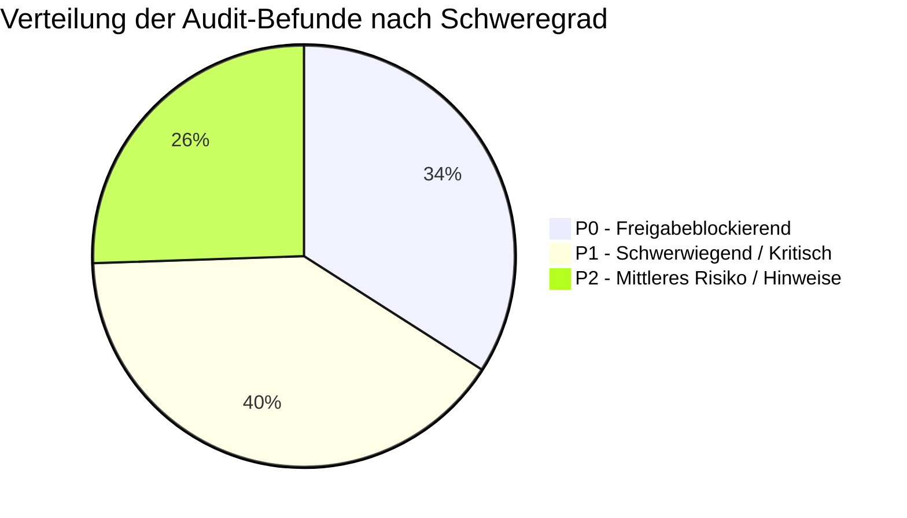
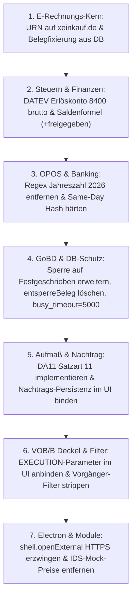

# Umfassender Audit- und Sicherheits-Gesamtbericht: W-Link ERP

**System:** W-Link ERP (`com.wlink.erp`, v1.0.5)  
**Repository:** `F:\server\Rechnungsprogramm_Geb_V2`  
**Prüfdatum:** 11. September 2026  
**Auditor-Team:** 6 spezialisierte Audit-Subagents (Rechnungskern, Electron/DB, Aufmaß/GAEB, Banking/DATEV, Sync/PWA, Frontend)  
**Grundlagen:** `doc/app-map/` (00–05, `PRUEFUNG.md`), `doc/pruefbericht_2026-09-10_rechnungskern-p0.md`, `plans/w-link-bau-rechnungskern-stabilisierung-plan.md`

---

## 0. Gesamt-Urteil & Management Summary

# FREIGABE: STRIKT VERWEIGERT (FREIGABE NEIN)

Die Gesamtanalyse des Systems über alle Schichten (Electron Desktop, IPC-Kommunikation, SQLite-Datenbank, VOB/B-Fachlogik, Schnittstellen und mobile PWA-Synchronisation) ergab **16 P0-Blocker**, **19 P1-Schwachstellen** sowie **12 P2-Hinweise**.



### Die gravierendsten Risiken im Überblick:

1. **Behördliche Totalabweisung aller E-Rechnungen (P0):**
   XRechnung 3.0 verwendet den veralteten 2.x-Namensraum (`xoev-de` statt `xeinkauf.de`). Jede generierte Rechnung wird durch offizielle Behördenportale (ZRE, OZG-RE) und Peppol-Prüfpunkte aufgrund der Schematron-Regel **BR-DE-21** unverzüglich abgewiesen.
2. **Steuerstrafrechtliche & Liquiditätsrisiken (§ 14c UStG / DATEV) (P0):** 
   - Im DATEV EXTF 700 Export wird bei Rechnungen mit Sicherheitseinbehalt der geminderte `zahlbetrag` statt des Bruttoerlöses an das Automatikkonto 8400 übergeben. Dies führt zur **systematischen Steuerunterdeckung in der USt-Voranmeldung** und entlastet den Kunden doppelt.
   - 7 % Mehrwertsteuer wird ignoriert und zwingend als 19 % verbucht.
   - Bei Abschlagsverrechnungen berechnen `InvoiceController.js` und `einvoice.js` unterschiedliche Steuerbeträge: `PDF != XML != DB`.
3. **Massive OPOS-Fehlbuchungen im Zahlungsverkehr (P0):**
   Der reguläre Ausdruck im OPOS-Matching filtert Rechnungsnummern auf die isolierte Jahreszahl `2026`. Jede Überweisung mit "2026" im Verwendungszweck wird offenen Rechnungen zugeordnet und im UI standardmäßig zur Verbuchung vorselektiert.
4. **Verlust von offenen Werklohnforderungen (P0):**
   Wird ein Sicherheitseinbehalt freigegeben, subtrahiert die Saldenformel in `computeProjectBalance` den Betrag von der Kundenschuld, anstatt ihn als fällig einzufordern.
5. **Datenverlust bei externen Aufmaßen & Nachträgen (P0):**
   - Der DA11-Export (REB 23.003) erzeugt Satzart 12 statt 11; der Import verwirft 100 % aller Aufmaßzeilen externer AVA-Dateien.
   - Werden genehmigte Nachträge ohne gespeicherte Rechnungs-ID übernommen, verbleiben sie im flüchtigen RAM; beim Neuladen gehen sie spurlos verloren. Vorhandene Unit-Tests prüften dies lediglich über Quelltext-Strings (`body.includes(...)`).
6. **Remote Code Execution (RCE) & Desktop-XSS (P0):**
   - `shell.openExternal` öffnet beliebige Protokoll-Handler (`file:`, `ms-msdt:`) ohne URL-Prüfung.
   - Der lokale IDS-Connect Server erlaubt über `Access-Control-Allow-Origin: *` und CSRF-Bypass das Einschleusen bösartiger XML-/HTML-Payloads in den Renderer.
7. **Datenbank-Absturz & Restore-Zerstörung (P0):**
   SQLite läuft ohne `PRAGMA busy_timeout` (sofortiger Crash bei Concurrency). Ein Restore überschreibt die SQLite-Datei bei aktiver WAL/mmap-Verbindung.

---

## 1. Teilbereich 1: Rechnungskern, VOB/B § 17 & E-Rechnung

### 1.1 Normwidrige XRechnung-3.0-Kennung (B-1, P0)
- **Dateien:** `js/einvoice.js:6`, `:320`, `:339`; `tests/erechnung_belegfixierung.test.js:11-15, 45-47`
- **Befund:** Der Code verwendet:
  ```javascript
  static GUIDELINE_XRECHNUNG_30 = 'urn:cen.eu:en16931:2017#compliant#urn:xoev-de:kosit:standard:xrechnung_3.0';
  ```
  Seit dem 01.02.2024 lautet der offizielle CIUS-Identifier nach KoSIT / xeinkauf.de:
  `urn:cen.eu:en16931:2017#compliant#urn:xeinkauf.de:kosit:xrechnung_3.0`
- **Rechtsfolge:** Die Schematron-Regel `BR-DE-21` führt bei allen öffentlichen Auftraggebern zur Zurückweisung. Die vorhandene Testsuite maskiert den Fehler, da sie lediglich auf den Substring `'xrechnung_3.0'` prüft.

### 1.2 Verletzung der Belegfixierung `PDF == XML == DB` (B-3, P0)
- **Dateien:** `js/editor.js:951-1009`; `main.js:1050-1066, 1145-1166`
- **Befund:** `collectERechnungExportData()` prüft zwar die Existenz einer `belegId`, lädt den Beleg jedoch nicht per SQL aus der Datenbank. Die Daten für Netto, Steuer, Brutto und Positionen stammen aus dem aktiven DOM (`state.currentRechnungTotals`, `state.currentRechnungPositionen`).
- **Folge:** Ändert ein Benutzer Werte im Formular einer festgeschriebenen Rechnung, exportiert das System ungespeicherte Fantasiewerte unter der ID eines festgeschriebenen Belegs.

### 1.3 Steuerbasis-Diskrepanz bei Verrechnungen (§ 14c UStG) (B-14, P0)
- **Dateien:** `controllers/InvoiceController.js:156-179`; `js/einvoice.js:139-178, 265-269`
- **Befund:**
  - `InvoiceController.js` zieht Verrechnungen vor der Steuerberechnung ab: `steuerpflichtigesNetto = netto - verrechnungen`. Die USt wird nur auf den Differenzbetrag berechnet.
  - `einvoice.js` berechnet die USt auf die volle Gesamtleistung vor Verrechnungen (`taxBasis = lineNettoSum - abzug`) und zieht Verrechnungen erst in BT-113 (`prepaid`) ab.
- **Folge:** PDF und XML weisen abweichende Steuerbeträge aus. Nach § 14c UStG schuldet der Aussteller die in der XML zu hoch ausgewiesene Steuer.

### 1.4 Wirkungsloser EXECUTION-Deckel im Formular (B-4, P0)
- **Dateien:** `js/editor.js:1520-1543`; `views/InvoiceView.js:142-171`; `controllers/InvoiceController.js:30-37, 117-146`
- **Befund:** `calculateRechnungTotals()` übergibt an `handleInputEvent()` ausschließlich `{ previousInvoices }`. `InvoiceView.getFormData()` liest weder `retentionMode` noch `contractTotalNet` aus. Der Controller fällt auf Standardwerte zurück (`WARRANTY`, `contractTotalNet = 0`).
- **Folge:** Der gesetzliche und vertragliche Deckel (max. 5 % der Auftragssumme gem. VOB/A § 9c) wird im Formular nie aktiv. Einbehalte werden unbegrenzt weiter abgezogen.

### 1.5 Ungefilterter Vorgänger-Bezug (B-5, P0)
- **Dateien:** `js/editor.js:1525-1530`; `controllers/InvoiceController.js:125-127, 258-262`
- **Befund:** `previousInvoices = docs.filter(d => projektId-Match && id != curId)` filtert nicht nach `type === 'rechnung'` und schließt weder `Storniert` noch `Entwurf` aus.
- **Folge:** Angebote, Gutschriften und Stornos fließen in die kumulierte Abrechnungsbasis ein und verfälschen Netto- und Einbehaltssummen dramatisch.

---

## 2. Teilbereich 2: Electron, IPC, GoBD-Audit & SQLite-Architektur

### 2.1 Remote Code Execution über `shell.openExternal` (SEC-1, P0)
- **Dateien:** `main/ids-connect-service.js:318-321`; `controllers/IDSConnectController.js:18-47`
- **Befund:** URLs werden ohne Prüfung des Protokolls an `shell.openExternal` übergeben. Übergibt ein manipuliertes Großhandelskonto oder ein externer Server `file:///` oder Windows-spezifische URI-Handler (`ms-msdt:`, `cmd:`), wird Schadcode direkt auf OS-Ebene ausgeführt.

### 2.2 GoBD-Sperrlücke in `applyDocumentWrite` (GOBD-1, P0 / B-6)
- **Dateien:** `db.js:106-118`
- **Befund:** Die Änderungssperre prüft ausschließlich `existing.isLocked === 1`. Ein Beleg im Status `Festgeschrieben`, `Bezahlt` oder `Storniert`, bei dem `isLocked` nicht gesetzt ist, wird ungeprüft überschrieben:
  ```sql
  DELETE FROM positionen WHERE dokumentId = ?;
  DELETE FROM rechnung_verrechnungen WHERE aktuelle_rechnung_id = ?;
  ```
- **Folge:** Schwerer Verstoß gegen GoBD Rz. 100ff (Unveränderbarkeit von Grundbuch- und Journalbuchungen).

### 2.3 GoBD-Widerruf durch `entsperreBeleg` (GOBD-2, P0)
- **Dateien:** `main.js:247-250`; `db.js:896-910`
- **Befund:** Über den IPC-Handler `db:unlockDocument` kann `isLocked` wieder auf `0` gesetzt werden. Dies erlaubt das nachträgliche Manipulieren und Löschen von Belegpositionen. GoBD verlangt zwingend die Generalumkehr über Storno/Gutschrift.

### 2.4 SQLite Concurrency-Crash & Restore-Korruption (DB-1, DB-2, P0)
- **Dateien:** `db.js:27-34`; `main/backup.js:395-408`
- **Befund:**
  1. `PRAGMA busy_timeout` fehlt komplett (Default: 0 ms). Parallele Zugriffe durch PWA-Sync-Server, Auto-Backup und Desktop-IPC führen zu sofortigen `SQLITE_BUSY`-Abstürzen.
  2. `BackupService.restoreBackup` überschreibt die aktive SQLite-Datei im laufenden Betrieb bei geöffneten Handles (30 GB Memory Mapping) und triggert danach `wal_checkpoint`. Dies führt zur irreparablen Zerstörung der Datenbank.

### 2.5 Unindizierte Kern-Tabelle `positionen` (DB-4, P0)
- **Dateien:** `schema.js:58-71`
- **Befund:** Die Tabelle `positionen` besitzt weder einen Index auf `dokumentId` noch auf `artikelId`. Jeder Belegaufruf (`SELECT * FROM positionen WHERE dokumentId=?`) und jede Kaskadenprüfung erzwingt einen Full Table Scan (O(N)).

---

## 3. Teilbereich 3: Projektmanagement, Aufmaßwesen & Nachträge

### 3.1 Invertierte DA11-Satzarten & Import-Ausfall (BUG-01, P0)
- **Dateien:** `js/da11.js:47-64, 109-120`
- **Befund:** Nach REB 23.003 müssen Aufmaßzeilen die Satzart **11** und der Vorlaufsatz die Satzart **00** (mit OZ-Maske) tragen. Der Code exportiert Aufmaßzeilen mit Satzart **12**. Beim Import behandelt `parseDA11` alle Zeilen mit Satzart 11 als Projektkopf.
- **Folge:** DA11-Dateien aus marktüblicher AVA-Software (RIB iTWO, Nevaris, California) verlieren beim Import **100 % ihrer Aufmaßzeilen**.

### 3.2 Schein-Persistenz & Datenverlust bei Nachträgen (BUG-03, P0 / B-7)
- **Dateien:** `js/projekte.js:1400-1407`; `tests/uebergaben_persistenz.test.js:1-76`
- **Befund:**
  - Wird `applyApprovedNachtraegeToCurrentInvoice` aufgerufen, wenn noch keine `curId` vorliegt, werden Nachträge nur im RAM-State abgelegt; der anschließende `getFullState()`-Aufruf wird per `void full;` verworfen. Es erfolgt kein Datenbank-Schreibaufruf. Beim Neuladen sind alle Nachträge verloren.
  - Die Testsuite `tests/uebergaben_persistenz.test.js` prüft dies lediglich über Quelltext-Strings (`body.includes(...)`) und eine testinterne Hilfsschleife.

### 3.3 Idempotenz-Key-Kollision (BUG-05, P1 / B-10)
- **Dateien:** `js/projekte.js:1387-1392`; `controllers/NachtragController.js:107`
- **Befund:** Der Key `N:${p.nachtrag_id}:${p.name}` basiert auf dem Textnamen der Position. Zwei legitime Regie- oder Erschwernispositionen mit gleichem Namen innerhalb desselben Nachtrags führen dazu, dass die zweite Position als Duplikat stillschweigend verworfen wird.

### 3.4 Fehlberechnung von Projektumsatz & Rentabilität (BUG-09, P1)
- **Dateien:** `js/projekte.js:342-367`; `db.js:1251-1340`
- **Befund:** Kumulierte Abschlagsrechnungen nach VOB/B § 16 werden stumpf addiert ($10.000 € + 25.000 € + 30.000 € = 65.000 €$ statt $30.000 €$). Zudem wird Brutto-Umsatz mit Netto-Budget verglichen.

---

## 4. Teilbereich 4: Banking, OPOS, SEPA & DATEV EXTF 700

### 4.1 DATEV: Steuerverkürzung & Doppelabzug Einbehalt (DAT-1, DAT-2, P0)
- **Dateien:** `js/datev.js:25, 46, 70-74`
- **Befund:**
  - Der Export bucht `r.zahlbetrag` an das Automatikkonto 8400 (SKR03). DATEV berechnet die Steuer auf das geminderte Entgelt. In Zeile 70 wird der Einbehalt zusätzlich nochmals per `1540 an Debitor` ausgebucht.
  - Erlöskonto `konto7` (8300) für 7 % USt wird im Code definiert, aber nie angesprochen. Alle Erlöse landen auf 19 %.
- **Folge:** Falsche Umsatzsteuererklärung gegenüber dem Finanzamt; Debitor wird um 200 % des Einbehalts entlastet.

### 4.2 OPOS-Matching: Regex-Jahreszahlenkollision (OPOS-1, P0)
- **Dateien:** `controllers/BankingController.js:584-589`
- **Befund:** `upperDoc.match(/\d{3,}/)` liefert bei Rechnungsnummern wie `RE-2026-0042` immer die Ziffernfolge `2026`. Der nachfolgende Regex `(?:\b|...)2026(?:\b|...)` matcht jede beliebige Zahlung, die die Jahreszahl `2026` im Text enthält.
- **Folge:** Wahlloses Fehlmatching von Miet-, Lohn- oder Beitragszahlungen auf offene Rechnungen.

### 4.3 Falsche Saldenformel bei Einbehalt-Freigabe (SAL-1, P0 / B-8)
- **Dateien:** `controllers/InvoiceController.js:268-276`
- **Befund:** `offenerSaldo = Math.max(0, fakturiert - gezahlt - freigegeben)`.
- **Folge:** Die Freigabe eines Sicherheitseinbehalts begründet eine fällige Forderung. Durch das Minuszeichen mindert die Freigabe jedoch die Kundenschuld rechnerisch wie ein Rabatt. Der Betrieb verliert den Anspruch auf die Werklohnzahlung.

### 4.4 Fehlende strukturierte Adressen in SEPA pain.008 (SEP-1, P1)
- **Dateien:** `controllers/SepaController.js:334-341`
- **Befund:** Im XML fehlt `<PstlAdr>` vollständig. Gemäß EPC/DK-Standard wird Version `pain.008.001.02` zum 15.11.2026 abgeschaltet; `pain.008.001.08` verlangt zwingend strukturierte Adressdaten.

---

## 5. Teilbereich 5: Local-First Sync-Server & PWA Mobile

### 5.1 MIME-Type- & Magic-Bytes-Blindheit beim Foto-Upload (SYNC-1, P0)
- **Dateien:** `main/sync-server.js:972-1050`
- **Befund:** Der Upload akzeptiert beliebige Rohdaten (`application/octet-stream`) und speichert sie ohne Prüfung von Headern oder Magic Bytes als `.webp` auf dem Desktop-Rechner ab. Schadsoftware kann als Foto getarnt eingeschleust werden.

### 5.2 Stiller Datenverlust bei Offline-Aufmaßen (SYNC-2, P0)
- **Dateien:** `main/sync-server.js:767-927`
- **Befund:** Quarantäne (`sync_conflicts`) greift nur für Zeiterfassung und Bautagebuch. Für Aufmaßzeilen und Mängel gilt unbarmherziges Last-Write-Wins via `ON CONFLICT DO UPDATE`. Erfassen zwei Mitarbeiter offline Maße zum selben Raum, überschreibt der letzte Upload den früheren unbemerkt.

### 5.3 Schein-Lamport-Uhren (SYNC-5, P2)
- **Dateien:** `pwa/js/sync-worker.js:81`; `main/sync-server.js:768`
- **Befund:** Der PWA-Worker sendet `Date.now()` als angeblichen `lamport_timestamp`. Der Server destrukturiert das Feld, ignoriert es im gesamten weiteren Code jedoch vollständig. Es existiert keine kausale Ordnungslogik.

---

## 6. Teilbereich 6: Frontend, Navigation & Experimentelle Module

### 6.1 Unkontrollierter Loopback-Server & Remote XSS (SEC-2, P0)
- **Dateien:** `main/ids-connect-service.js:114-128`; `views/GrosshandelView.js:170, 355`
- **Befund:** Der lokale Callback-Server setzt `Access-Control-Allow-Origin: *` und besitzt einen CSRF-Bypass (fehlendes Token liefert `true`). Bösartige Websites können per POST manipuliertes XML mit JavaScript einspeisen, das in `GrosshandelView.js` ungesichert per `innerHTML` ausgeführt wird.

### 6.2 Gefährliche Fake-Preise in IDS Connect 2.5 (MOCK-1, P0)
- **Dateien:** `main.js:1446-1453`
- **Befund:** Die Schnittstelle liefert für jede Artikelanfrage hartcodierte Mock-Preise (45,00 € Netto, 75,00 € Brutto, sofort lieferbar). Angebote werden mit Fantasiepreisen kalkuliert.

### 6.3 Fokusmodus im Normalbetrieb wirkungslos (NAV-1, P1 / B-13)
- **Dateien:** `js/navigation.js:168-216`
- **Befund:** `applyFocusMode()` wird im gesamten produktiven App-Lifecycle nie aufgerufen. Alle 19 Menüpunkte (inklusive unfertiger/experimenteller Module) sind standardmäßig sichtbar. Eine Checkbox im UI fehlt.

### 6.4 Gesetzeswidriges Hard-Delete bei Zeiterfassung (COMP-1, P1)
- **Dateien:** `controllers/ZeiterfassungController.js:479-499`; `views/ZeiterfassungView.js:91`
- **Befund:** Zeiteinträge werden physisch aus SQLite gelöscht (`DELETE FROM zeiterfassung`). Verstoß gegen die EuGH-Arbeitszeiterfassungspflicht (C-55/18), BAG 1 ABR 22/21 und § 17 MiLoG (mind. 2 Jahre Aufbewahrung).

---

## 7. Vollständige Befund- und Risikomatrix

| Prio | ID | Modul / Bereich | Fundstelle (Datei:Zeile) | Befund-Zusammenfassung |
| :---: | :---: | :--- | :--- | :--- |
| **P0** | **B-1** | E-Rechnung | `js/einvoice.js:6` | Falscher URN-Namensraum (`xoev-de` statt `xeinkauf.de`); BR-DE-21 Abweisung. |
| **P0** | **B-3** | E-Rechnung | `js/editor.js:951` | Export nicht belegfixiert; Daten stammen aus DOM statt DB (`PDF != XML != DB`). |
| **P0** | **B-14**| Steuerrecht | `InvoiceController.js:156` | Steuerdiskrepanz bei Verrechnungen (§ 14c UStG Steuerschuld). |
| **P0** | **B-4** | VOB/B | `editor.js:1542` | EXECUTION-Deckel im Formular wirkungslos; Parameterverlust im UI-Pfad. |
| **P0** | **B-5** | VOB/B | `editor.js:1525` | Vorgänger-Filter zieht Angebote, Stornos und Schlussrechnungen ein. |
| **P0** | **B-2** | E-Rechnung | `doc/session_summary:46` | Kein echter Validierungsnachweis (KoSIT Bundle 3.0.2 / veraPDF). |
| **P0** | **SEC-1**| Security | `main/ids-connect-service.js:318`| RCE via unvalidiertem `shell.openExternal` (keine Protokollprüfung). |
| **P0** | **GOBD-1**| GoBD / DB | `db.js:106` | Sperrlücke `applyDocumentWrite`: Status `Festgeschrieben` ohne Lock überschreibbar. |
| **P0** | **GOBD-2**| GoBD | `main.js:247` | GoBD-widriges `entsperreBeleg`: Hebt Sperre für nachträgliche Inhaltsmutation auf. |
| **P0** | **DB-1** | SQLite | `db.js:27` | Fehlendes `PRAGMA busy_timeout`; sofortige Crashes bei Concurrency. |
| **P0** | **DB-2** | SQLite | `main/backup.js:395` | Korruption bei Restore: Überschreibt aktive DB bei geöffneten Handles. |
| **P0** | **DB-4** | SQLite | `schema.js:58` | Tabelle `positionen` unindiziert; O(N) Table Scans bei allen Belegen. |
| **P0** | **BUG-01**| Aufmaß | `js/da11.js:64` | Invertierte DA11-Satzarten (12 statt 11); 100 % Import-Ausfall bei realen AVA-Dateien. |
| **P0** | **BUG-03**| Nachträge | `js/projekte.js:1400` | Schein-Persistenz ohne Rechnungs-ID; Datenverlust nach Neuladen (B-7). |
| **P0** | **DAT-1** | DATEV | `js/datev.js:46` | Doppelabzug Einbehalt & Steuerunterdeckung auf Automatikkonto 8400. |
| **P0** | **OPOS-1**| Banking | `BankingController.js:584` | Regex matcht isolierte Jahreszahl `2026`; Fehlverbuchung fremder Zahlungen. |
| **P1** | **SAL-1** | Finanzen | `InvoiceController.js:274` | Einbehalt-Freigabe subtrahiert vom Saldo statt Forderung einzufordern (B-8). |
| **P1** | **DAT-2** | DATEV | `js/datev.js:25` | 7 % USt wird ignoriert und als 19 % Erlös exportiert. |
| **P1** | **DAT-3** | DATEV | `js/datev.js:33` | Header 700 defekt: Mandantennummer mit 14-stelligem Timestamp belegt. |
| **P1** | **SEP-1** | SEPA | `SepaController.js:334` | Fehlende strukturierte Adressen in `pain.008.001.08` (Pflicht ab 15.11.2026). |
| **P1** | **BUG-05**| Nachträge | `js/projekte.js:1390` | Idempotenz-Key kollidiert bei gleichen Positionsnamen im selben Nachtrag (B-10). |
| **P1** | **BUG-06**| Aufmaß | `js/projekte.js:1342` | `CREATE_NEW` speichert unvollständige Belege mit `kundeId: null` (B-11). |
| **P1** | **BUG-08**| GAEB X31 | `js/gaeb-x31.js:153` | X31 plättet alle Blätter in `X31-01`; Regex tilgt Zeilenadressen (`A0`). |
| **P1** | **BUG-09**| Finanzen | `js/projekte.js:342` | Mehrfachzählung kumulierter Abschlagsrechnungen bei Projektumsatz. |
| **P1** | **SEC-2** | Frontend | `ids-connect-service.js:128` | CORS `*` & CSRF-Bypass führt zu Remote XSS im Desktop-Fenster. |
| **P1** | **MOCK-1**| Großhandel | `main.js:1446` | IDS Connect 2.5 liefert hartcodierte 45 € / 75 € Mock-Preise. |
| **P1** | **NAV-1** | Navigation | `js/navigation.js:168` | Fokusmodus wird beim App-Start nie aufgerufen (B-13). |
| **P1** | **COMP-1**| Compliance | `ZeiterfassungController.js:479`| Physisches SQL-Delete bei Zeiterfassung ohne Revisionssperre. |
| **P1** | **COMP-2**| SOKA-BAU | `SokaBauController.js:345` | Invalide DTA-Bau Satzlängen führen zu Abweisung durch Meldeserver. |
| **P1** | **SYNC-1**| Sync | `main/sync-server.js:972` | Foto-Upload ohne MIME-Type- und Magic-Bytes-Prüfung. |
| **P1** | **SYNC-2**| Sync | `main/sync-server.js:767` | Last-Write-Wins führt zu Datenverlust bei parallelen Offline-Aufmaßen. |
| **P1** | **SYNC-3**| Sync | `main/sync-server.js:1185` | Unvollständiger Konflikt-Resolver (Bautagebuch wird verworfen). |
| **P1** | **SYNC-4**| PWA | `pwa/sw.js:63` | Cache-Drift im Service Worker verhindert Updates der mobilen Shell. |
| **P1** | **B-9**   | E-Rechnung | `js/einvoice.js:338` | `assertExportfaehigerBeleg` wird bei XML-Generierung umgangen. |
| **P1** | **DB-3**  | Electron | `main.js:1534` | Shutdown-Backup bricht asynchron ab (`preventDefault` fehlt). |
| **P2** | **H-1**   | VOB/B | `InvoiceController.js:128` | Starre Netto-Einbehaltsbasis; keine Option für Brutto-Verträge. |
| **P2** | **H-2**   | Codehygiene | `js/einvoice.js:359` | Toter Code `void finalStatus;` in Beleg-Gate. |
| **P2** | **SYNC-5**| Sync | `sync-worker.js:81` | Schein-Lamport-Uhren (`Date.now()` wird serverseitig ignoriert). |
| **P2** | **NAV-3** | Navigation | `navigation.js:3` | `projekt-details` fehlt in `viewConfig` (Header-Titel aktualisiert nicht). |

---

## 8. Priorisierter Sanierungs-Fahrplan (Top-7 Maßnahmen)



### Maßnahme 1: E-Rechnung reparieren & belegfixierten Export erzwingen (B-1, B-3, B-14)
1. In `js/einvoice.js:6` URN korrigieren:
   ```javascript
   static GUIDELINE_XRECHNUNG_30 = 'urn:cen.eu:en16931:2017#compliant#urn:xeinkauf.de:kosit:xrechnung_3.0';
   ```
2. In `main.js:1050ff, 1145ff` die Export-IPC-Handler so umbauen, dass sie nur noch `{ docId }` empfangen und den Beleg atomar via `dbAPI.getDocumentById(docId)` aus SQLite laden. Weicht der Beleg im Formular ab oder ist er nicht festgeschrieben, Export verweigern.
3. Steuerberechnung bei Abschlagsverrechnungen harmonisieren, sodass `PDF == XML == DB` mathematisch garantiert ist.

### Maßnahme 2: DATEV-Umsatzsteuer & Saldenrechnung korrigieren (DAT-1, DAT-2, SAL-1)
1. In `js/datev.js:46` dem Erlöskonto 8400 den vollen Bruttobetrag übergeben (da Automatikkonto) und Doppelentlastung des Debitors entfernen.
2. In `js/datev.js:44` 7%-Positionen auf `konto7` (8300) mappen.
3. In `controllers/InvoiceController.js:274` die kaufmännisch korrekte Saldenformel einsetzen:
   ```javascript
   const offenerSaldo = r2(Math.max(0, (fakturiert + freigegeben) - gezahlt));
   ```

### Maßnahme 3: OPOS-Matching von Jahreszahlen befreien (OPOS-1)
In `controllers/BankingController.js:584-589` die fehlerhafte Jahreszahl-Extraktion entfernen:
```javascript
// Statt blindem \d{3,} gezielt das Rechnungspräfix mit vollständiger Nummer matchen:
const docPattern = new RegExp(`\\b${escapeRegex(docNr)}\\b`, 'i');
if (docPattern.test(upperText)) return true;
```

### Maßnahme 4: GoBD-Schreibschutz & SQLite-Stabilität absichern (GOBD-1, GOBD-2, DB-1, DB-4)
1. In `db.js:106` Schreibsperre erweitern:
   ```javascript
   const PROTECTED_STATUSES = ['Festgeschrieben', 'Bezahlt', 'Storniert'];
   if (existing.isLocked === 1 || PROTECTED_STATUSES.includes(existing.status)) {
       throw new Error(`Beleg ${existing.nr} ist festgeschrieben/gesperrt (GoBD). Änderungen müssen über Storno erfolgen.`);
   }
   ```
2. `entsperreBeleg` aus `db.js` und `main.js` entfernen.
3. In `db.js:27` `PRAGMA busy_timeout = 5000;` setzen.
4. In `schema.js` Indizes ergänzen:
   ```sql
   CREATE INDEX IF NOT EXISTS idx_positionen_dokumentId ON positionen(dokumentId);
   CREATE INDEX IF NOT EXISTS idx_positionen_artikelId ON positionen(artikelId);
   ```

### Maßnahme 5: DA11-Engine sanieren & Nachtragsübernahme binden (BUG-01, BUG-03)
1. In `js/da11.js:64` Satzart auf `'11'` setzen, Satzart 00 für Projektkopf generieren und `parseDA11` auf das Einlesen von Satzart 11 umstellen.
2. In `js/projekte.js:1400` bei Fehlen von `curId` vor der Nachtragsübernahme zwingend einen Beleg per `saveDocument()` anlegen und persistieren.

### Maßnahme 6: VOB/B-Einbehaltsdeckel & Filter korrigieren (B-4, B-5)
1. In `views/InvoiceView.js:142` und `js/editor.js:1542` Felder für `retentionMode` (`EXECUTION`/`WARRANTY`) und `contractTotalNet` aus dem Projektstamm an `handleInputEvent` durchreichen.
2. In `js/editor.js:1525` den Filter bereinigen:
   ```javascript
   previousInvoices = docs.filter(d => {
       const pid = d.projektId !== undefined ? d.projektId : d.projekt_id;
       return parseInt(pid) === parseInt(currentProjekt.id) &&
              d.type === 'rechnung' &&
              d.status !== 'Storniert' && d.status !== 'Entwurf' &&
              (curId == null || parseInt(d.id) !== curId);
   });
   ```

### Maßnahme 7: Electron-Härtung & Mock-Preise entfernen (SEC-1, SEC-2, MOCK-1)
1. In `controllers/IDSConnectController.js` vor `shell.openExternal` strikt prüfen: `url.protocol === 'https:''`.
2. Im lokalen IDS-Connect Loopback-Server `Access-Control-Allow-Origin: *` entfernen und strikte Origin-Prüfung aktivieren.
3. In `main.js:1446` gefälschte 45€-Preise entfernen und Fehler werfen, bis eine echte Webservice-Anbindung existiert.

---
*Ende des Berichts. Erstellt am 11.09.2026.*
