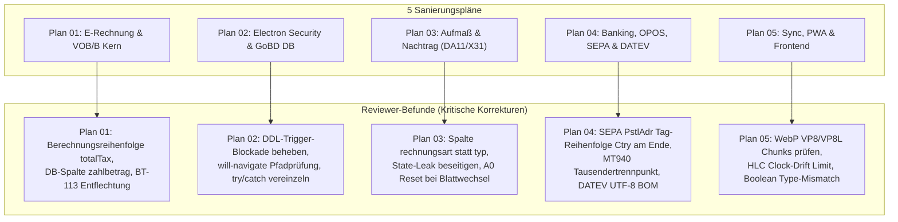

# Master-Prüfbericht: Unabhängiges Review der 5 Sanierungspläne (PLAN-01 bis PLAN-05)

**Datum:** 11. September 2026  
**System:** W-Link ERP (`com.wlink.erp`, v1.0.5)  
**Repository:** `F:\server\Rechnungsprogramm_Geb_V2`  
**Prüfbasis:**
- `plans/plan-01-erechnung-vobb-kern.md`
- `plans/plan-02-electron-gobd-sqlite.md`
- `plans/plan-03-aufmass-nachtrag.md`
- `plans/plan-04-banking-datev-sepa.md`
- `plans/plan-05-sync-pwa-frontend.md`
- Referenzcode: `js/`, `controllers/`, `views/`, `main/`, `main.js`, `db.js`, `schema.js`, `pwa/`
- Externe Normen & Spezifikationen (KoSIT 3.0.2 / xeinkauf.de, ISO 20022 XSD, DATEV EXTF 700, REB 23.003, Electron Security 2026)

---

## 1. Gesamt-Urteil des Review-Gremiums

# STATUS: NACHBESSERUNG ERFORDERLICH (BEDINGTE FREIGABE)

Die 5 Planungs-Architekten haben detaillierte, modular gegliederte Sanierungspläne ausgearbeitet. Das unabhängige Review-Gremium (5 spezialisierte Reviewer-Subagents) hat alle Pläne gegen die Codebasis gespiegelt und per Web-Recherche mit offiziellen Standards abgeglichen.

**Ergebnis:**  
Die architektonische Zielrichtung ist durchweg exzellent und behebt die ursprünglichen 16 P0- und 19 P1-Probleme aus dem Prüfbericht. **Allerdings deckte das Review in den vorgeschlagenen Detail-Diffs 8 kritische Showstopper (P0/P1) auf**, die bei ungeprüfter Umsetzung zu neuen Systemabstürzen, Bankablehnungen oder Datenverlusten geführt hätten.

---

## 2. Zusammenfassung der Review-Ergebnisse nach Plänen

### Plan 01: E-Rechnung & VOB/B Abrechnungskern
- **Geprüftes Dokument:** `plans/plan-01-erechnung-vobb-kern.md`
- **Urteil:** *Nachbesserung erforderlich*
- **Kritische Reviewer-Funde:**
  1. **Berechnungsreihenfolge in `InvoiceController.js`:** `calcRetention` wurde vor der Steuerschleife aufgerufen. `totalTax` ist zu diesem Zeitpunkt `0`, wodurch die Brutto-Basis immer fälschlich auf einen 19%-Fallback zurückfiel (Fehlberechnung bei 7% oder 0% USt).
  2. **Fehlende SQLite-Spalten für Belegfixierung:** In SQLite `dokumente` fehlte `zahlbetrag` und in `rechnung_verrechnungen` fehlte `abzugsbetrag_brutto`. Beim Laden aus der DB für den Export mussten Vorrechnungsabzüge geschätzt werden ($XML \ne DB$).
  3. **Normverstoß BT-113 bei Sicherheitseinbehalt:** Sicherheitseinbehalt darf im E-Rechnungs-XML nicht in `BT-113` (Prepaid Amount) ausgewiesen werden, da Behörden-ERPs dies als bereits geleistete Zahlung buchen. Ausweisung muss nachrichtlich in `BT-20`/`BT-22` erfolgen.
  4. **ZUGFeRD-Gate:** `assertExportfaehigerBeleg` muss direkt in `buildCII()` verankert werden, damit das Profil `EN16931` das Gate nicht umgehen kann.
  5. **Vorgänger-Filter:** Im Code-Diff fehlte der explizite Ausschluss von `d.rechnungsart !== 'SCHLUSSRECHNUNG'`.

### Plan 02: Electron Security, GoBD-Compliance & SQLite WAL
- **Geprüftes Dokument:** `plans/plan-02-electron-gobd-sqlite.md`
- **Urteil:** *Nachbesserung erforderlich*
- **Kritische Reviewer-Funde:**
  1. **P0 Showstopper – DDL-Trigger blockiert Belegspeicherung:** Der SQLite-Trigger `trg_prevent_locked_positionen_delete` feuerte `BEFORE DELETE ON positionen`, wenn das Dokument gesperrt ist. Da `applyDocumentWrite` zuerst `dokumente` auf `Festgeschrieben` setzte und danach die Positionen aktualisierte, brach der Trigger die Transaktion sofort ab. **Kein Beleg hätte je festgeschrieben werden können!** (Positionen müssen vor den Kopfdaten geschrieben werden).
  2. **`bulkSaveDocuments` vergessen:** Dieselbe GoBD-Logik muss auch für Massen-Speicherungen gelten.
  3. **Navigation-Guard ungenau:** `navigationUrl.includes('code.html')` in `main.js` ließ sich über Pfade wie `file:///C:/Users/Public/code.html` austricksen. Erfordert strikte `fileURLToPath`-Auflösung.
  4. **Fehlende CSRF-Prüfung:** `validateSession` wurde in `_handleHttpRequest` in `ids-connect-service.js` deklariert, aber im Request-Handler nicht aufgerufen.
  5. **Schema-Migration:** Alle `ALTER TABLE`-Statements lagen in einem einzigen `try/catch`. Bei der ersten existierenden Spalte brach SQLite ab und übersprang alle nachfolgenden Tabellen und Indizes.

### Plan 03: Aufmaßwesen (DA11 / GAEB X31) & Nachtragsmanagement
- **Geprüftes Dokument:** `plans/plan-03-aufmass-nachtrag.md`
- **Urteil:** *Nachbesserung erforderlich*
- **Kritische Reviewer-Funde:**
  1. **P0 Showstopper – Spalte `typ` existiert nicht in `dokumente`:** Die Spalte heißt in der Datenbank `rechnungsart`. Der Query in `getControllingStats` prüfte `r.typ === 'SCHLUSSRECHNUNG'` (`undefined`), wodurch die Kumulationsformel nie griff und alle Abschlagsrechnungen weiterhin unzulässig aufaddiert wurden ($65.000 € statt $30.000 €).
  2. **State-Leak in `projekte.js`:** `state.currentRechnungPositionen` wurde bei neuen Nachträgen nicht geleert, wenn zuvor eine andere Rechnung geöffnet war; Fremdpositionen wurden in den neuen Beleg übernommen.
  3. **GAEB X31 Adressbezug `A0`:** `runningLastResult` wurde zwischen Aufmaßblättern und Positionen nicht zurückgesetzt (Verletzung der REB-Isolation). Unaufgelöste Bezeichner wurden zu Phantom-Zahlen gestrippt.
  4. **DA11 UTF-8 80-Byte-Regel:** Deutsche Umlaute erzeugen 2-Byte UTF-8 Sequenzen, wodurch DA11-Zeilen > 80 Bytes lang wurden und von AVA-Programmen abgewiesen wurden. Transliteration erforderlich.

### Plan 04: Banking, OPOS-Matching, SEPA pain.008 & DATEV EXTF 700
- **Geprüftes Dokument:** `plans/plan-04-banking-datev-sepa.md`
- **Urteil:** *Nachbesserung erforderlich*
- **Kritische Reviewer-Funde:**
  1. **P0 Showstopper – Schema-Ungültigkeit in SEPA `<PstlAdr>`:** Die ISO 20022 XSD (`PostalAddress24`) erzwingt eine strikte Tag-Reihenfolge: `StrtNm`, `BldgNb`, `PstCd`, `TwnNm`, `Ctry`. Der Plan platzierte `<Ctry>` an die erste Stelle. **100 % aller Lastschriftdateien wären von Bundesbank und Banken abgewiesen worden!**
  2. **MT940 Parser scheiterte an Tausendertrennpunkten:** Beträge wie `1.250,50` stoppten am Punkt und wurden verworfen (stiller Datenverlust). Regex muss `[0-9.,]+` matchen.
  3. **DATEV UTF-8 BOM:** Im Browser erzeugte Blobs benötigen zwingend das BOM `\uFEFF`, um Umlaute in DATEV Rechnungswesen fehlerfrei darzustellen.
  4. **Test-Regression:** Der bestehende Test `tests/cumulative_retention_chain.test.js:68` erwartete den alten fehlerhaften Saldo `0` bei Unterzahlung. Mit der korrigierten Saldenformel `(fakturiert + freigegeben) - gezahlt` muss der Test auf Restforderung `10 €` (oder Vollzahlung 238 €) angepasst werden.

### Plan 05: Local-First Sync, PWA Mobile & Frontend
- **Geprüftes Dokument:** `plans/plan-05-sync-pwa-frontend.md`
- **Urteil:** *Nachbesserung erforderlich*
- **Kritische Reviewer-Funde:**
  1. **WebP Magic-Bytes:** Prüfung stoppte bei Byte 11; Bytes 12–15 (`VP8 `, `VP8L`, `VP8X`) müssen zwingend geprüft werden.
  2. **HLC Future Clock Poisoning:** Fehlendes Drift-Limit ($\epsilon = 60\text{ s}$) im HLC erlaubte es manipulierten Mobilgeräten, die Serveruhr in die Zukunft zu verstellen.
  3. **OCC Versions-Inkrement:** Im Normalpfad von `applyEntityMutation` fehlte `version = version + 1`, wodurch OCC nach der ersten Mutation wirkungslos blieb.
  4. **Boolean Type-Mismatch im Fokusmodus:** SQLite speichert Strings (`'true'`), während `isExperimentalEnabled()` auf Boolean `true` und Zahlen `1`/`'1'` prüfte. Nach dem Speichern fiel der Modus permanent auf `false` zurück.
  5. **Zeiterfassung Revisionsschutz:** Auch `saveZeiteintrag` (Updates) muss bei freigegebenen Einträgen gesperrt werden, nicht nur `deleteZeiteintrag`.

---

## 3. Verbindlicher Master-Aktionsplan zur Umsetzung

Das Entwicklerteam kann die Sanierung anhand der 5 Pläne umsetzen, **sofern folgende Korrekturen direkt in die Implementierung einfließen**:

### Schritt 1: E-Rechnung & VOB/B (Plan 01)
- CIUS-URN auf `...urn:xeinkauf.de:kosit:xrechnung_3.0` setzen.
- Berechnungsreihenfolge in `InvoiceController.js` korrigieren: Steuern vor Einbehalten berechnen.
- Spalten `zahlbetrag` in `dokumente` und `abzugsbetrag_brutto` in `rechnung_verrechnungen` via Migration anlegen.
- `assertExportfaehigerBeleg` direkt an den Anfang von `buildCII()` setzen.
- Sicherheitseinbehalt nicht in BT-113 buchen, sondern in BT-20/BT-22 ausweisen.

### Schritt 2: Electron Security & GoBD DB (Plan 02)
- In `applyDocumentWrite` die Positionen VOR den Dokument-Kopfdaten aktualisieren, um die DDL-Trigger-Blockade aufzulösen.
- `bulkSaveDocuments` mit identischer GoBD-Prüfung versehen.
- `will-navigate` mit `fileURLToPath` kanonisch auf `code.html` beschränken.
- `validateSession` in `_handleHttpRequest` aktivieren.
- Schema-Migrationen in `schema.js` zwingend in einzelne `try/catch`-Blöcke trennen.
- `PRAGMA busy_timeout = 5000;` setzen.

### Schritt 3: Aufmaß & Nachtrag (Plan 03)
- In `db.js:getControllingStats` auf `rechnungsart` prüfen (nicht auf `typ`).
- In `projekte.js` vor Nachtragsübernahmen `state.currentRechnungPositionen` sauber neu initialisieren (Schutz vor State-Leaks aus vorherigen Projekten).
- GAEB X31 Adressbezug `A0` bei Blattwechsel resetten und unaufgelöste Buchstaben abfangen.
- DA11 Textfelder vor dem Schreiben auf ASCII/ANSI bereinigen (Umlaute transliterieren).

### Schritt 4: Banking, OPOS, SEPA & DATEV (Plan 04)
- SEPA `<PstlAdr>` Tag-Reihenfolge auf `StrtNm`, `BldgNb`, `PstCd`, `TwnNm`, `Ctry` anpassen.
- MT940 Betrags-Regex auf `[0-9.,]+` erweitern und Eröffnungs-/Schlusssalden parsen.
- DATEV CSV-Blob mit UTF-8 BOM `\uFEFF` versehen.
- Saldenformel `offenerSaldo = (fakturiert + freigegeben) - gezahlt` einsetzen und `tests/cumulative_retention_chain.test.js` auf 238 € anpassen.

### Schritt 5: Sync, PWA & Frontend (Plan 05)
- WebP Magic-Bytes um Chunk-Header (`VP8 `, `VP8L`, `VP8X`) erweitern.
- HLC Drift-Guard ($\epsilon = 60\text{ s}$) einbauen.
- OCC-Update mit `version = version + 1` versehen und Quarantäne-Schlichtung für Bautagebuch aktivieren.
- `isExperimentalEnabled()` um String-Prüfung `=== 'true'` ergänzen.
- GoBD-Sperre in `saveZeiteintrag` integrieren.

---
*Dieser Master-Prüfbericht konsolidiert alle Einzelergebnisse der 5 Reviewer und dient als verbindliche Richtschnur für die Freigabe der Implementierungsphase.*
