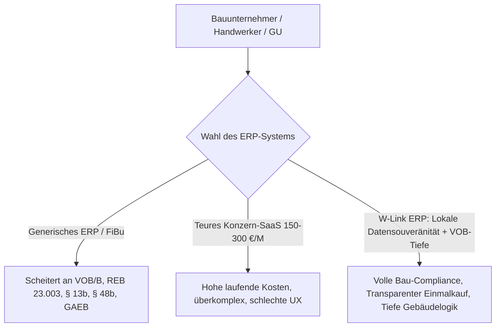
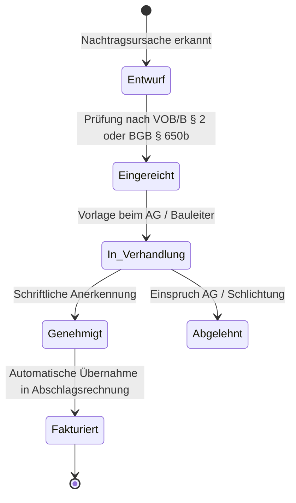
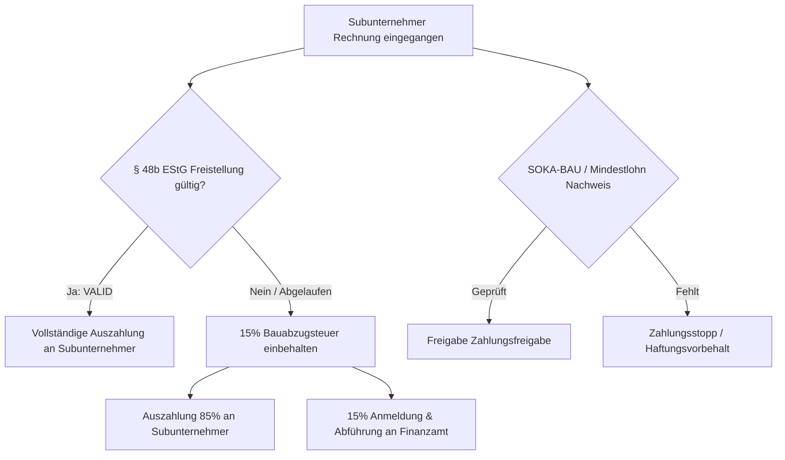
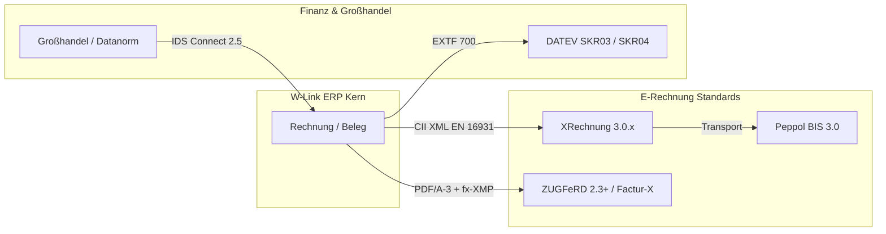
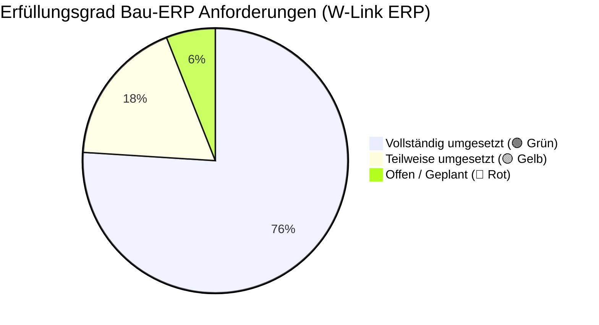
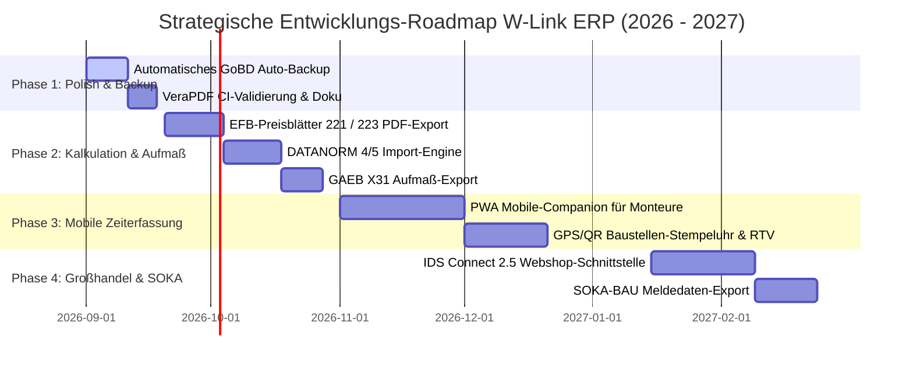

# Bau-ERP Anforderungsanalyse, Marktstudie & Gap-Vergleich

**Dokument-ID:** `DOC-BAU-ERP-2026-V1`  
**Autor:** Senior Business Analyst & ERP-Architekt für Bau & Handwerk  
**Projekt:** W-Link ERP (*Rechnungsprogramm_Geb_V2*)  
**Stand:** August 2026 / Ausblick 2027–2028  
**Zielgruppe:** Hochbau, Tiefbau, Ausbau, Generalunternehmer (GU), Handwerksbetriebe, TGA/Gebäudetechnik und Gebäudedienstleister  

---

## Inhaltsverzeichnis

1. [Executive Summary & Marktsituation für Bau-Software in Deutschland](#1-executive-summary--marktsituation-für-bau-software-in-deutschland)
   - [1.1 Ausgangslage und Markttrends (2025–2028)](#11-ausgangslage-und-markttrends-20252028)
   - [1.2 Gesetzliche Rahmenbedingungen & Compliance-Meilensteine](#12-gesetzliche-rahmenbedingungen--compliance-meilensteine)
   - [1.3 Wettbewerbsumfeld im deutschen Bau- und Handwerkssektor](#13-wettbewerbsumfeld-im-deutschen-bau--und-handwerkssektor)
2. [Detaillierter Anforderungskatalog nach Funktionsbereichen](#2-detaillierter-anforderungskatalog-nach-funktionsbereichen)
   - [Bereich 1: Projekt- & Auftragsabwicklung (GAEB, Leistungsverzeichnisse, Los-/Titelstrukturen)](#bereich-1-projekt--auftragsabwicklung)
   - [Bereich 2: Aufmaß & Mengenermittlung (REB 23.003, DA11, DA12, GAEB X31, Abschlags-/Schlussrechnungen, VOB/B § 17)](#bereich-2-aufmaß--mengenermittlung)
   - [Bereich 3: Nachtragsmanagement (VOB/B § 2 Abs. 3/5/6, BGB §§ 650b/c)](#bereich-3-nachtragsmanagement)
   - [Bereich 4: Baustellenmanagement, Dokumentation & Abnahme (Bautagebuch, VOB/B § 12, Mängelwesen)](#bereich-4-baustellenmanagement-dokumentation--abnahme)
   - [Bereich 5: Nachunternehmerverwaltung & Bau-Compliance (§ 48b EStG, SOKA-BAU, MiLoG, Bürgschaften)](#bereich-5-nachunternehmerverwaltung--bau-compliance)
   - [Bereich 6: Steuerrecht & Finanzwesen (§ 13b UStG, § 35a EStG, § 48 EStG, Banking, SEPA pain.008, OPOS)](#bereich-6-steuerrecht--finanzwesen)
   - [Bereich 7: E-Rechnung & Schnittstellen (XRechnung 3.0, ZUGFeRD 2.3, DATEV EXTF, DATANORM, IDS Connect)](#bereich-7-e-rechnung--schnittstellen)
   - [Bereich 8: Kalkulation & Baubetriebliches Controlling (Zuschlagskalkulation, EFB 221/223, Soll-Ist-Kostenarten)](#bereich-8-kalkulation--baubetriebliches-controlling)
   - [Bereich 9: Personal, Zeiterfassung & Fuhrpark/Gerätedisposition (BAG-Urteil, Rüstzeiten, Maschinenstunden)](#bereich-9-personal-zeiterfassung--fuhrparkgerätedisposition)
   - [Bereich 10: Objektverwaltung, Reinigungs-LV & Dauerschuldverhältnisse (FM, RTV, Dauerrechnungsläufe)](#bereich-10-objektverwaltung-reinigungs-lv--dauerschuldverhältnisse)
3. [Granulare Soll-Ist-Vergleichsmatrix (W-Link ERP vs. Bau-Branche)](#3-granulare-soll-ist-vergleichsmatrix-w-link-erp-vs-bau-branche)
   - [3.1 Methodik & Ampel-Definition](#31-methodik--ampel-definition)
   - [3.2 Tabellarische Vergleichsmatrix](#32-tabellarische-vergleichsmatrix)
   - [3.3 Quantitativer Erfüllungsgrad & Kennzahlen](#33-quantitativer-erfüllungsgrad--kennzahlen)
4. [Unsere Alleinstellungsmerkmale (USPs) & Stärken](#4-unsere-alleinstellungsmerkmale-usps--stärken)
5. [Strategische Roadmap & Priorisierte Handlungsempfehlungen](#5-strategische-roadmap--priorisierte-handlungsempfehlungen)
   - [Phase 1: Sofortmaßnahmen & Zertifizierungsvorbereitung (Release 1.0.6)](#phase-1-sofortmaßnahmen--zertifizierungsvorbereitung-release-106)
   - [Phase 2: Kalkulations- & Aufmaßvertiefung (Release 1.1)](#phase-2-kalkulations--aufmaßvertiefung-release-11)
   - [Phase 3: Mobile Zeiterfassung & Baustellenbegleiter (Release 1.2)](#phase-3-mobile-zeiterfassung--baustellenbegleiter-release-12)
   - [Phase 4: Großhandelsintegration & SOKA-BAU Compliance (Release 2.0)](#phase-4-großhandelsintegration--soka-bau-compliance-release-20)

---

## 1. Executive Summary & Marktsituation für Bau-Software in Deutschland

### 1.1 Ausgangslage und Markttrends (2025–2028)

Die deutsche Bauwirtschaft – bestehend aus über 380.000 Betrieben im Hoch-, Tief- und Ausbaugewerbe sowie rund 40.000 Gebäudedienstleistern und Facility-Management-Unternehmen – steht im Zeitraum 2025 bis 2028 vor einem fundamentalen Struktur- und Technologiewandel. Getrieben von gesetzlichen Digitalisierungsauflagen (E-Rechnungspflicht, GoBD-Verschärfungen, Arbeitszeiterfassungspflicht), steigendem Kostendruck durch Materialpreisschwankungen und Fachkräftemangel sowie komplexen bauvertraglichen Anforderungen (VOB/B und BGB-Bauvertrag) steigen die Ansprüche an betriebliche Softwaresysteme drastisch.

Klassische „Insellösungen“ oder generische Fakturaprogramme (wie Standard-Buchhaltungstools ohne VOB-Logik) scheitern in der Baupraxis regelmäßig an drei Hürden:
1. **Vergütungs- und Abrechnungslogik:** Bauabrechnungen erfolgen selten über einfache Einzelrechnungen. Standard sind kumulierte Abschlagsrechnungen ($F_t = L_t - \sum F_i$), Sicherheitseinbehalte (§ 17 VOB/B) für Ausführung und Gewährleistung sowie detaillierte Mengennachweise nach REB 23.003 / DA11.
2. **Bauvertragliche Risikominimierung:** Nachträge nach VOB/B § 2 Abs. 3, 5, 6 oder BGB § 650b/c, Bautagebücher mit Witterungs- und Behinderungsanzeigen sowie rechtsverbindliche Abnahmeprotokolle (§ 12 VOB/B) sind haftungs- und liquiditätsentscheidend.
3. **Steuer- und Meldesonderregeln:** Bauabzugsteuer (§ 48b EStG mit 15 % Einbehalt), Steuerschuldnerschaft des Leistungsempfängers (§ 13b UStG Reverse Charge auf Positionsebene), Handwerkerbonus-Ausweis (§ 35a EStG) und SOKA-BAU-Meldungen erfordern Spezialmechanismen in der Kern-Engine.

### 1.2 Gesetzliche Rahmenbedingungen & Compliance-Meilensteine

| Rechtsnorm / Gesetz | Verbindlicher Stichtag | Konkrete Anforderung an Bau-ERP-Systeme |
| :--- | :--- | :--- |
| **Wachstumschancengesetz (E-Rechnungspflicht B2B)** | **01.01.2025** (Empfang) **01.01.2027** (> 800k € Umsatz) **01.01.2028** (Alle B2B) | Verpflichtender Empfang und Erstellung strukturierter E-Rechnungen nach **EN 16931-1** (XRechnung 3.0.x CII/UBL und ZUGFeRD 2.3+ / Factur-X PDF/A-3). Reine PDF-Rechnungen per E-Mail gelten in B2B als nicht ordnungsgemäß. Bau-Sonderregelung BMF: Leistungsbeschreibungen/GAEB dürfen als Anlage beigefügt werden. |
| **GoBD 2.0 (BMF-Schreiben vom 14.07.2025 / 2026)** | Laufend verschärft | Unveränderbarkeit von Buchungsbelegen ab Festschreibung, lückenlose Verfahrensdokumentation, SHA-256-Audit-Trail bei Belegmutationen, Bereitstellung für digitale Betriebsprüfung (Z1–Z3 Schnittstellen). |
| **Bürokratieentlastungsgesetz IV (BEG IV)** | **01.01.2025** | Verkürzung der handels- und steuerrechtlichen Aufbewahrungsfristen für Buchungsbelege und Rechnungen von 10 auf **8 Jahre** (§ 147 Abs. 3 AO, § 14b UStG). Bücher, Bilanzen und Verfahrensdokumentationen verbleiben bei **10 Jahren**. |
| **BGB-Bauvertragsrecht (§§ 650a–650v BGB)** | Seit 2018 (Präzisiert durch BGH 2023–2026) | Gesetzliches 30-Tage-Anordnungsrecht des Bauherrn (§ 650b BGB), Vergütungsanpassung nach tatsächlich erforderlichen Kosten (§ 650c BGB), 90 % Abschlagsdeckelung (§ 650m BGB bei Verbraucherbauverträgen), Bauhandwerkersicherung (§ 650f BGB). |
| **VOB/B (Fassung 2016/2019/2026)** | Bei Vereinbarung | Formstrenge Abrechnung nach § 14 VOB/B, 5 % Sicherheitseinbehalte (§ 17 VOB/B), Prüffristen von Abschlags- (21 Tage) und Schlussrechnungen (30–60 Tage nach § 16 VOB/B), Bedenken- & Behinderungsanzeigen (§ 4 Abs. 7, § 6 Abs. 1 VOB/B). |
| **BAG-Grundsatzurteil zur Zeiterfassung / ArbZG** | Seit BAG 2022 (1 ABR 22/21) | Pflicht zur vollständigen, manipulationssicheren Erfassung von Beginn, Ende und Dauer der täglichen Arbeitszeit aller Beschäftigten ohne Ausnahme für Kleinbetriebe. Mindestlohnkontrolle (MiLoG / AEntG / Zoll-FKS). |
| **Steuerliche Pflichtangaben (§ 14/§ 14a UStG)** | Laufend | Pflichttext `Steuerschuldnerschaft des Leistungsempfängers` bei § 13b UStG (BT-120) und Codeliste `VATEX-EU-AE` (BT-121); exakte Skonto-Konditionen nach § 14 Abs. 4 Satz 1 Nr. 7 UStG; Lohnanteilausweis für private Endkunden nach § 35a EStG. |

### 1.3 Wettbewerbsumfeld im deutschen Bau- und Handwerkssektor

Die Analyse von 6 Kernwettbewerbern (*baufaktura, pds, STREIT, KWP bnWin.net, EasyFirma, shm profit*) sowie spezialisierten FM- und Reinigungssoftware-Systemen (*CleanManager, SAPHIR, Mendato, fortytools*) offenbart klare Marktpositionierungen und Schwachstellen:

1. **Preis- und Lizenzmodelle:** Während Großanbieter wie *pds* auf teure SaaS-Abonnements (90–230 € pro Arbeitsplatz/Monat zzgl. Modul- und App-Gebühren) setzen, existiert im Klein- und Mittelbetriebssegment (1 bis 20 Mitarbeiter) eine ausgeprägte „Abo-Müdigkeit“. Transparente Einmalkauf-Modelle (300 bis 1.800 €) mit kalkulierbaren, freiwilligen Pflegeverträgen (15–20 % p.a.) genießen eine signifikante Nachfrage.
2. **Mobile Applikationen als Achillesferse:** Viele etablierte Systeme kämpfen mit veralteten, unzuverlässigen Mobile-Apps (Bewertungen im Google Play Store / Apple App Store teils bei 2,4 bis 3,8 Sternen). Monteure und Bauleiter beklagen Abstürze, Login-Hürden und fehlende Offline-Funktionalität.
3. **Die Schnittstellenlücke im Gebäudebereich:** Reine Bauprogramme (z. B. *baufaktura, KWP, STREIT*) ignorieren Objektbäume (Liegenschaft, Gebäude, Etage, Raum) und Dauerschuldverhältnisse (Putzpläne, Reinigungs-LVs, monatliche Sammelrechnungen). FM- und Reinigungsprogramme hingegen beherrschen weder GAEB, VOB-Kumulation noch DA11-Aufmaße. Hier existiert eine signifikante Marktlücke für hybride Handwerks- und Gebäudedienstleistungs-ERP-Systeme.

---

## 2. Detaillierter Anforderungskatalog nach Funktionsbereichen

### Bereich 1: Projekt- & Auftragsabwicklung

#### Fachliche Kernanforderungen:
1. **GAEB-Datenaustausch nach GAEB DA XML 3.3, 3.2, 2000 und 90:**
   - **X80 / D80:** Universeller Leistungsverzeichnisaustausch.
   - **X81 / D81:** Leistungsbeschreibung (Katalogdaten).
   - **X82 / D82:** Kostenansatz (Kostenschätzung des Planers).
   - **X83 / D83:** Angebotsaufforderung / Ausschreibung (Ausschreibender $\rightarrow$ Bieter).
   - **X84 / D84:** Angebotsabgabe mit Einheitspreisen (Bieter $\rightarrow$ Ausschreibender).
   - **X85 / D85:** Nebenangebot.
   - **X86 / D86:** Auftragserteilung / Auftrags-LV.
   - **X89 / D89:** Rechnungs-LV / Elektronische Rechnungsstellung.
2. **Strukturierte Leistungsverzeichnisse (LV):**
   - Mehrstufige Hierarchien: Los $\rightarrow$ Gewerk/Abschnitt $\rightarrow$ Titel $\rightarrow$ Untertitel $\rightarrow$ Ordnungszahl (OZ nach Schema `XX.YY.ZZZZ`).
   - Positionsarten: Normalpositionen (Grundpositionen), Alternativ-/Wahlpositionen (ohne Summenwirksamkeit), Eventual-/Bedarfspositionen (mit/ohne Gesamtpreis-Einfluss), Pauschalpositionen, Leitbeschreibungen mit Unterbeschreibungen, Textergänzungen (Bieterangaben).
3. **Projektstamm & Dokumentenfluss:**
   - Nahtlose Wandlungskette: *GAEB-Import $\rightarrow$ Kalkulation $\rightarrow$ Angebot $\rightarrow$ Auftragsbestätigung $\rightarrow$ Lieferschein/Arbeitsschein $\rightarrow$ Teil-/Abschlagsrechnung $\rightarrow$ Schlussrechnung $\rightarrow$ Mahnung*.
   - Verwaltung von Projektbeteiligten (Bauherr, Architekt, Bauleiter, Statiker, SiGeKo, Nachunternehmer).

---

### Bereich 2: Aufmaß & Mengenermittlung

#### Fachliche Kernanforderungen:
1. **Verfahrensbeschreibung REB 23.003 (Ausgabe 2009 / 1979):**
   - Standardisierte Rechenformeln für Flächen, Volumen und Längen:
     * *Formel 01 (Rechteck):* $a \cdot b$
     * *Formel 02 (Dreieck):* $\frac{a \cdot b}{2}$
     * *Formel 03 (Trapez):* $\frac{a + c}{2} \cdot h$
     * *Formel 04 (Quader):* $a \cdot b \cdot c$
     * *Formel 05 (Zylinder):* $\frac{\pi}{4} \cdot d^2 \cdot h$
     * *Formel 21/23 (Kreis/Kreissegment):* Bogenberechnungen
     * *Formel 91 (Freie Formel):* Beliebige mathematische Ausdrücke unter Einhaltung der Operatorenrangfolge.
2. **Datenaustauschformate DA11 & DA12 / GAEB X31:**
   - **DA11 (80-Zeichen Fixed-Width):** Satzart 11 (Projektkopf), Satzart 12 (Rechenzeile mit OZ, Blatt-Nr., Zeilen-Nr., Formelkennzeichen, Rechenansatz max. 50 Zeichen, Ergebnis mit 3 Dezimalstellen).
   - **DA12:** Erweiterter Datenaustausch für variable Zeilenlängen und Langtexte.
   - **GAEB XML 3.3 X31 (Mengenermittlung):** Moderner XML-Standard für prüffähige Aufmaße.
3. **Kumulierte Bauabrechnung nach VOB/B:**
   - **Rechnungsarten:**
     * *Reguläre Rechnung / Einzelrechnung:* Abgeschlossene Einzelleistung.
     * *Kumulierte Abschlagsrechnung ($F_t = L_t - \sum F_i$):* Bisheriger Gesamtleistungsstand $L_t$ abzüglich bereits in Rechnung gestellter Abschlagsrechnungen $\sum F_i$. Nur der Leistungszuwachs $\Delta L$ unterliegt der Umsatzsteuer dieser Periode.
     * *Teilrechnung:* Abgrenzung physisch und wirtschaftlich selbstständiger Teilleistungen.
     * *Schlussrechnung:* Endabrechnung aller erbrachten Leistungen nach VOB/B § 14 Abs. 1 inklusive vollständiger Übersicht aller Vorrechnungen.
4. **Sicherheitseinbehalte (§ 17 VOB/B):**
   - Einbehalt zur Vertragserfüllung (typisch 5–10 % der Abschlagsbeträge) und zur Mängelansprüche-Sicherung (typisch 5 % der Schlussrechnungssumme).
   - Ausweisung vor/nach Steuern: Rechtlich stellt der Einbehalt vollwertiges Entgelt dar $\rightarrow$ Bemessungsgrundlage der USt bleibt ungemindert, Einbehalt mindert lediglich den Auszahlungsbetrag.
   - Verwaltung von Sperrkonten, Freigabefristen (Regellaufzeit 4 Jahre VOB / 5 Jahre BGB) und Bürgschaftsablösung (z. B. Übergabe einer Bank-/Kautionsbürgschaft).

---

### Bereich 3: Nachtragsmanagement

#### Fachliche Kernanforderungen:
1. **Rechtsgrundlagen nach VOB/B und BGB-Bauvertrag:**
   - **VOB/B § 2 Abs. 3:** Mengenabweichungen über $110\,\%$ des vereinbarten Mengenansatzes (Verlangen eines neuen Einheitspreises für die Mehrmenge) bzw. unter $90\,\%$ (Erhöhung des Einheitspreises auf Verlangen).
   - **VOB/B § 2 Abs. 5:** Änderung des Bauentwurfs oder andere Anordnungen des Auftraggebers (Vereinbarung eines neuen Preises unter Berücksichtigung der Mehr- oder Minderkosten auf Basis der Urkalkulation).
   - **VOB/B § 2 Abs. 6:** Zusätzliche Leistungen, die im Vertrag nicht vorgesehen waren, aber zur Ausführung erforderlich werden (Vergütungsanspruch vor Ausführung ankündigen!).
   - **BGB § 650b / § 650c:** Gesetzliches Anordnungsrecht des Bestellers für Änderungen des Werkerfolgs und Vergütungsberechnung nach tatsächlich erforderlichen Kosten zzgl. angemessener Zuschläge (AGK, W&G).
2. **Systemische Nachtragsverfolgung:**
   - Nummerierungslogik (z. B. `N-01`, `N-02` verknüpft mit Hauptpositionen).
   - Kostenartengliederung im Nachtrag: Lohn-, Material-, Geräte-, Fremdleistungs- und Rüstkosten.
   - Status-Workflow: *Entwurf $\rightarrow$ Eingereicht $\rightarrow$ In Verhandlung $\rightarrow$ Genehmigt $\rightarrow$ Abgelehnt*.
   - Nahtloser Transfer genehmigter Nachtragspositionen in das Projekt-LV und die kumulierte Abrechnung.

---

### Bereich 4: Baustellenmanagement, Dokumentation & Abnahme

#### Fachliche Kernanforderungen:
1. **Rechtssicheres digitales Bautagebuch (Baustellenbericht):**
   - **Witterungsdaten:** Automatischer Wetterabruf oder manuelle Erfassung (Temperatur min/max, Niederschlag, Wind, Luftfeuchte – relevant für witterungsbedingte Baustopps und Bedenkenanzeigen nach DIN 18299).
   - **Personal- und Geräteeinsatz:** Anwesende eigene Facharbeiter, Poliere, Auszubildende sowie Nachunternehmer (Kopfzahl und geleistete Stunden); Großgeräte vor Ort (Kran, Bagger, Rüstung).
   - **Tagesberichte & Leistungsfortschritt:** Dokumentation der ausgeführten Gewerke gegliedert nach Bauteilen/Räumen.
   - **Vorkommnisse, Behinderungen & Bedenken:** Protokollierung von bauseitigen Verzögerungen (VOB/B § 6 Abs. 1 Behinderungsanzeige), Abweichungen vom Baugrund (§ 4 Abs. 3 VOB/B) oder Planungsfehlern.
   - **Fotodokumentation:** Zuordnung von Baustellenfotos mit Zeitstempel, GPS-Koordinaten und Verschlagwortung.
2. **Bauabnahme (§ 12 VOB/B & § 640 BGB):**
   - Erstellung rechtssicherer Abnahmeprotokolle (Förmliche Abnahme, Teilabnahme, Technische Funktionsprüfung).
   - **Abnahmeergebnis:** *Ohne Vorbehalt, Mit Vorbehalt (bei bekannten Mängeln), Abnahme verweigert (wegen wesentlicher Mängel)*.
   - **Mängelkataster:** Erfassung von Restarbeiten und Mängeln mit Fristsetzung zur Nachbesserung (§ 13 VOB/B / § 635 BGB), Mängelbeseitigungsstatus und Fotobeweisen.
   - **Rechtsfolgen-Tracking:** Exakte Berechnung des Beginns und Endes der Verjährungsfrist für Mängelansprüche (VOB/B Standard: 4 Jahre für Bauwerke, 2 Jahre für maschinelle/elektrotechnische Anlagen; BGB: 5 Jahre für Bauwerke).
   - Digitale Unterzeichnung durch Auftraggeber, Auftragnehmer und Bauleiter.

---

### Bereich 5: Nachunternehmerverwaltung & Bau-Compliance

#### Fachliche Kernanforderungen:
1. **Bauabzugsteuer nach § 48–48d EStG:**
   - Pflicht zum Einbehalt von **15 % des Bruttorechnungsbetrags** bei Bauleistungen an Unternehmer, es sei denn, es liegt eine gültige Freistellungsbescheinigung nach § 48b EStG vor.
   - Stammdatenverwaltung: Erfassung der Bescheinigungsnummer, Gültigkeitsdauer und automatische Vorwarnung vor Ablauf (z. B. 30 Tage vorher).
   - Automatische Abzugsberechnung bei Eingangsrechnungen, Generierung der Steueranmeldung (Formular USt 1 TG / Bauabzugsteuer) an das zuständige Finanzamt.
2. **Bürgschafts- und Nachunternehmer-Compliance:**
   - Nachunternehmer-Generalunternehmerhaftung (§ 14 AEntG, § 13 MiLoG): Nachweisführung über die Zahlung des Mindestlohns.
   - **SOKA-BAU (Sozialkassen der Bauwirtschaft):** Überwachung von Beitragsabführungen zur Vermeidung der Durchgriffshaftung nach § 1a AEntG.
   - Verwaltung von Vertragserfüllungs-, Vorauszahlungs- und Gewährleistungsbürgschaften (Bürgschaftsurkunden, Bürgschaftsnummern, Bürgen-Banken, Rückgabetermine).

---

### Bereich 6: Steuerrecht & Finanzwesen

#### Fachliche Kernanforderungen:
1. **Steuerschuldnerschaft des Leistungsempfängers (§ 13b UStG - Reverse Charge):**
   - Bei Bauleistungen und Gebäudereinigungsleistungen zwischen Unternehmern verlagert sich die Steuerschuld auf den Empfänger (§ 13b Abs. 2 Nr. 4 bzw. Nr. 8 UStG).
   - **Positionsbasierte Mischrechnung:** Saubere Trennung innerhalb eines Belegs zwischen 13b-pflichtigen Bau-/Reinigungsleistungen (0 % USt ausgewiesen, Netto = Brutto) und steuerpflichtigen Lieferungen/Gerätevermietungen (z. B. 19 % MwSt).
   - **Pflichtangaben:** Zwingender gesetzlicher Text `"Steuerschuldnerschaft des Leistungsempfängers"` (BT-120) und Codeliste `VATEX-EU-AE` (BT-121).
2. **Handwerkerleistungen für Privatkunden (§ 35a Abs. 3 EStG):**
   - Privatkunden können 20 % von bis zu 6.000 € Lohnkosten (max. 1.200 € Steuerermäßigung pro Jahr) steuerlich absetzen.
   - ERP-Pflicht: Transparenter, separater Ausweis der reinen **Lohn-, Maschinen- und Fahrtkosten** (inkl. darauf entfallender MwSt) getrennt von den Materialkosten auf dem Beleg und im PDF.
3. **Banking, Zahlungsverkehr & OPOS-Abgleich:**
   - **Kontoauszugs-Import:** Automatisches Einlesen von Bankumsätzen über ISO 20022 XML **CAMT.053** (Tagesauszug), **CAMT.052** (Intraday) sowie standardisierte CSV-Formate der führenden deutschen Bankengruppen (Sparkasse, Genossenschaftsbanken/FIDUCIA, Deutsche Bank, Commerzbank).
   - **Intelligenter 4-Stufen-Abgleich (Matching):**
     * *Pass 1 (Exakter Match):* Rechnungsnummer im Verwendungszweck + Betragskonsistenz.
     * *Pass 2 (Skontoverrechnung):* Ausnutzung von Skonto nach § 14 Abs. 4 Satz 1 Nr. 7 UStG mit automatischer Prüfung des Zahlungsdatums gegen das Skonto-Zahlungsziel.
     * *Pass 3 (Teilzahlung / Restforderung):* Automatische Verbuchung von Abschlagszahlungen und Rest-OPOS.
     * *Pass 4 (Kunden-IBAN / Name):* Fuzzy-Suche bei fehlerhaftem Verwendungszweck.
   - **SEPA-Lastschriften (pain.008):**
     * Erzeugung von Lastschriftdateien nach ISO 20022 `pain.008.001.08` und `.001.02` für CORE- und B2B-Schemata.
     * Sequenztypenverwaltung (`FRST`, `RCUR`, `OOFF`, `FNAL`) mit TARGET2-Bankarbeitstags-Vorlauf.
     * Pre-Notification-Fristeneinhaltung (EPC Rulebook 14 Tage bzw. verkürzt vereinbart) und Mandatsverwaltung mit ISO 7064 Gläubiger-ID-Validierung.

---

### Bereich 7: E-Rechnung & Schnittstellen

#### Fachliche Kernanforderungen:
1. **E-Rechnung EN 16931-1 (Wachstumschancengesetz 2025–2028):**
   - **XRechnung 3.0.x:** Vollständige CrossIndustryInvoice (CII) XML-Generierung mit korrekten Business Terms (BT-10 Buyer Reference/Leitweg-ID, BG-23 Steueraufschlüsselung, BT-113 Vorausgezahlte Beträge bei Einbehalten/Abschlägen, UN/ECE Rec 20 Einheitscodes wie `MTK`, `HUR`, `C62`).
   - **ZUGFeRD 2.3+ / Factur-X 1.09:** Echter PDF/A-3-Container (`@cantoo/pdf-lib` / veraPDF-konform) mit eingebetteter `factur-x.xml` (bzw. `xrechnung.xml`), `/AFRelationship /Alternative`, `fx:DocumentType` XMP-Erweiterung und sRGB IEC61966-2.1 OutputIntent.
   - **Leitweg-ID-Gate:** Strukturprüfung für Behördenkunden (B2G nach Standard des IT-Planungsrats).
2. **DATEV-Schnittstelle (Format EXTF 700):**
   - Export von Buchungsstapeln im offiziellen DATEV EXTF CSV-Format.
   - Kontenrahmen-Unterstützung für **SKR03** und **SKR04**.
   - Automatische Steuerschlüssel-Zuordnung:
     * Reguläre Erlöse 19 %: SKR03 Konto `8400` / SKR04 Konto `4400`.
     * § 13b Reverse-Charge Erlöse: SKR03 Konto `8337` (BU-Schlüssel `19`) / SKR04 Konto `4337` (BU-Schlüssel `68`).
     * Sicherheitseinbehalt-Abgrenzungskonten: SKR03 `1540` / SKR04 `1240`.
3. **Großhandels- & Material-Schnittstellen:**
   - **DATANORM 4.0 / 5.0:** Import von Artikelstammdaten, Warengruppen und Staffelpreisen der Baustoff- und Haustechnik-Großhändler.
   - **IDS Connect 2.5 (Information Data Service):** Direkte Webshop-Anbindung aus dem ERP-Angebot heraus (Warenkorbaustausch, Preisauskunft, Rückübernahme von Artikellisten).
   - **Open Masterdata / SHK Connect:** Moderner Nachfolgestandard für den cloudbasierten Artikel- und Stammdatenaustausch.
   - **OCI (Open Catalog Interface):** PunchOut-Kataloganbindung für Industriekunden und Behörden.

---

### Bereich 8: Kalkulation & Baubetriebliches Controlling

#### Fachliche Kernanforderungen:
1. **Kalkulationsverfahren der Bauwirtschaft:**
   - **Zuschlagskalkulation (Kalkulation mit vorbestimmten Zuschlägen):**
     * Einzelkosten der Teilleistungen (EKT): *Lohn, Material (Stoff), Geräte, Sonstige (Fremdleistung/Subunternehmer)*.
     * Gemeinkostenzuschläge: *Baustellengemeinkosten (BGK)*, *Allgemeine Geschäftskosten (AGK)*, *Wagnis & Gewinn (W&G)*.
     * Ermittlung des Angebotspreises bzw. Einheitspreises (EP).
   - **Kalkulation über die Endsumme:** Rückrechnung der Zuschläge auf alle Positionen über Deckungsumlagen.
2. **EFB-Preisblätter (Vergabehandbuch Bund - VHB 2024/2026):**
   - **EFB-Preisblatt 221:** Formblatt zur Preisermittlung bei Zuschlagskalkulation (Offenlegung der Kalkulationsansätze: Mittellohn, Lohnzusatzkosten, Zuschläge auf Stoffe/Geräte/EKT, AGK, W&G).
   - **EFB-Preisblatt 223:** Aufgliederung der Einheitspreise für jede LV-Position in *Lohn, Stoffe, Geräte, Sonstige* sowie die kalkulierte Arbeitszeit (Zeitansatz in h/Einheit).
3. **Projekt-Soll-Ist-Kostencontrolling & Nachkalkulation:**
   - Gegenüberstellung: *Vorkalkulation (Soll-Budget)* $\leftrightarrow$ *Auftragswert* $\leftrightarrow$ *Ist-Kosten (Eingangsrechnungen + Stundenlohn-Rapporte)* $\leftrightarrow$ *Fakturiertes Ist-Aufmaß*.
   - Ermittlung von **Deckungsbeitrag (DB I / DB II)**, Margenabweichungen und Budgetverbrauch in Echtzeit.
   - Kostenartentrennung: *Lohn, Material, Gerät, Subunternehmer, Fremdleistung, Baustelleneinrichtung*.

---

### Bereich 9: Personal, Zeiterfassung & Fuhrpark/Gerätedisposition

#### Fachliche Kernanforderungen:
1. **Gesetzeskonforme Arbeitszeiterfassung (ArbZG / BAG 2022 / MiLoG):**
   - Lückenlose Erfassung von Kommen-, Gehen- und Pausenzeiten mit Projekt-, Objekt- und Gewerkebezug.
   - Trennung von Produktivzeit (Baustelle), Rüstzeit (Laden, Vorbereitung), Fahrzeit (Wegezeit nach Tarifvertrag Bau bzw. RTV Gebäudereinigung) und Schlechtwetterzeit (Saison-Kurzarbeitergeld KUG).
   - Automatische Einhaltung von Höchstarbeitszeiten (§ 3 ArbZG max. 10 h/Tag) und Ruhepausen (§ 4 ArbZG 30/45 Min).
2. **Tarifliche Zuschlags- und Bewertungsmotoren:**
   - Nachtarbeitszuschläge, Sonn- und Feiertagszuschläge, Erschwerniszuschläge (z. B. Absturzgefahr, Schutzkleidung).
   - Überstundenkonten (Arbeitszeitkonten / 13-Wochen-Durchschnitt nach Bundesrahmentarifvertrag BRTV-Bau bzw. RTV Gebäudereinigung).
3. **Geräte- & Maschinenverwaltung (BGL / EUROLISTE):**
   - Maschinenstamm (Bagger, Kräne, Verdichter, Reinigungsautomaten) mit Inventarnummer, TÜV/UVV-Prüffristen.
   - Verrechnungssätze für Gerätevorhaltung und Geräteeinsatz auf Baustellen (Gerätekostenart).

---

### Bereich 10: Objektverwaltung, Reinigungs-LV & Dauerschuldverhältnisse

#### Fachliche Kernanforderungen:
1. **Hierarchische Objektstruktur (Property Tree):**
   - Struktur: *Liegenschaft $\rightarrow$ Gebäude $\rightarrow$ Etage $\rightarrow$ Raum / Nutzfläche*.
   - Raumdaten: Nutzungsart (Büro, Sanitär, Verkehrsfläche, Labor), Quadratmeterzahl, Bodenbelagsart (Parkett, Linoleum, Teppich, Fliesen, Glas).
   - Differenzierter Rechnungsempfänger je Strukturknoten (z. B. Liegenschaft $\rightarrow$ Eigentümergemeinschaft; Raum $\rightarrow$ gewerblicher Mieter; Verwaltung $\rightarrow$ Hausverwaltung).
2. **Putzplan & Reinigungs-Leistungsverzeichnis:**
   - Verknüpfung von Flächen mit Leistungsarten (z. B. Unterhaltsreinigung, Grundreinigung, Glasreinigung).
   - **Leistungswerte nach RAL / DIN 77400:** Zeitansätze in $\text{m}^2/\text{h}$ bzw. $\text{min}/\text{m}^2$ (z. B. Büro 180 $\text{m}^2/\text{h}$, Sanitär 60 $\text{m}^2/\text{h}$).
   - **Turnuslogik:** Tägliche Ausführung ($5\times/\text{Woche}$), wöchentlich, monatlich, Turnusintervalle.
   - **Tarifprofil RTV Gebäudereinigung (2026/2027):**
     * Nachtarbeit (22:00–05:00 Uhr): $+30\,\%$
     * Sonntags- & Feiertagsarbeit: $+80\,\%$
     * Hohe Feiertage (Neujahr, 1. Mai, 1.+2. Weihnachtsfeiertag): $+200\,\%$
     * Belastungszuschlag (§ 10 Ziff. 3 RTV für $>8\,\text{h}/\text{Tag}$ bzw. $>40\,\text{h}/\text{Woche}$): $+25\,\%$
     * Branchenmindestlöhne 2026: Lohngruppe 1 = $15{,}00\,\text{€}/\text{h}$, Lohngruppe 6 = $18{,}40\,\text{€}/\text{h}$ (über 9 Lohngruppen LG 1–LG 9).
3. **Wiederkehrende Abrechnungspläne (Dauerrechnungen):**
   - Automatische Monats-, Quartals- oder Jahresabrechnungsläufe.
   - Modus: Pauschale oder Einzelpositionsabrechnung mit Snapshot- oder Live-Preisen (`preise_live`).
   - Automatische Sammelrechnungsgenerierung für Eigentümer mit mehreren Liegenschaften.

---

## 3. Granulare Soll-Ist-Vergleichsmatrix (W-Link ERP vs. Bau-Branche)

### 3.1 Methodik & Ampel-Definition

Die folgende Matrix vergleicht den Anforderungskatalog der deutschen Bau- und Gebäudewirtschaft mit dem exakten Ist-Stand in der Codebase von **W-Link ERP** (*Rechnungsprogramm_Geb_V2*):

- 🟢 **Vollständig umgesetzt (PROD-Ready):** Modul ist tief im Datenmodell (`schema.js`, `db.js`), in der Business-Logik (`controllers/`, `js/`), im UI (`code.html`) und in den automatisierten Tests (`tests/`) verankert.
- 🟡 **Teilweise umgesetzt (Partial / In Arbeit):** Grundarchitektur, DB-Spalten oder Parser vorhanden, jedoch fehlen Spezialfunktionen, weiterführende Schnittstellenformate oder erweiterte GUI-Masken.
- 🔴 **Offen (Backlog / Geplant):** Funktion im Standard-Katalog gefordert, aktuell noch nicht in der Codebase implementiert.

### 3.2 Tabellarische Vergleichsmatrix

| # | Modul- / Funktionsbereich | Anforderung Deutsche Bauwirtschaft | Ist-Stand W-Link ERP (Codebase & DB) | Status | Gap-Analyse & Technische Einordnung |
| :---: | :--- | :--- | :--- | :---: | :--- |
| **1.0** | **Projekt- & Auftragsabwicklung** | | | | |
| 1.1 | GAEB X83 Import | Einlesen von Leistungsverzeichnissen (Ausschreibungen) inkl. OZs, Mengen, Einheiten, Kurz-/Langtexten | `js/gaeb.js` (`GAEBEngine.parseGAEBXML`), Drag&Drop-Upload in `js/projekte.js` | 🟢 | Voll funktionsfähig für GAEB XML X83; wandelt Items in strukturierte Projekt-LVs um. |
| 1.2 | GAEB X84 Export | Abgabe von Angebotspreisen nach GAEB XML 3.3 / 2000 | `js/gaeb.js` (`generateGAEBX84XML`) | 🟢 | Erzeugt XML-Angebotsdateien mit korrekten OZs, Einheiten und Preisen. |
| 1.3 | GAEB X80/X81/X86/X89 | Umfassender GAEB-Phasenaustausch (Katalog, Auftrag, Rechnung) | `gaeb_phase` Spalte in `projekte` (`schema.js`), X83/X84 aktiv | 🟡 | X83/X84 produktiv. X86 (Auftrag) und X89 (Rechnung) sind über CII XML/XRechnung abgedeckt; nativer X89-GAEB-Export als Ergänzungs-Feature offen. |
| 1.4 | LV-Hierarchien & OZs | Los $\rightarrow$ Gewerk $\rightarrow$ Titel $\rightarrow$ Untertitel $\rightarrow$ OZ (`01.01.0010`) | `oz_code` in `positionen`, `aufmass_zeilen`, `nachtrag_positionen` | 🟢 | OZs werden durchgängig über alle Belege, Aufmaße und Nachträge mitgeführt. |
| 1.5 | Dokumentenkette | Angebot $\rightarrow$ AB $\rightarrow$ Lieferschein $\rightarrow$ Abschlags-/Schlussrechnung | `dokumente.type`, `projekte.js`, `editor.js` | 🟢 | Vollständige Verknüpfung von Angebot zu kumulierter Rechnung vorhanden. |
| **2.0** | **Aufmaß & Mengenermittlung** | | | | |
| 2.1 | REB 23.003 Formelrechner | Mathematische Auswertung der Standard-Formeln 01–05, 91 ohne unsicheres `eval()` | `controllers/AufmassController.js` (`evaluateFormula`, `calculateREBFormula`) | 🟢 | Sicherer Sandbox-Function-Rechner mit Strict Mode, deutsches Komma, Potenzoperator, 4 Dezimalstellen Präzision. |
| 2.2 | DA11 Export & Import | Austauschdatei nach REB-VB 23.003 mit 80 Zeichen Fixed-Width (Satzarten 11, 12) | `js/da11.js` (`DA11Service.generateDA11`, `parseDA11`) | 🟢 | Satzart 11 (Kopf), Satzart 12 (Rechenzeilen), 80-Zeichen-Formatierung, Vorzeichensteuerung (+/-). |
| 2.3 | DA12 / GAEB X31 | Moderne XML-Mengenermittlung | Tabelle `aufmass_blaetter`, `aufmass_zeilen` | 🟡 | DA11 vollständig. GAEB X31 XML-Container noch nicht als separater Im-/Exporter implementiert. |
| 2.4 | Aufmaß-Center & Split-View | Gegenüberstellung Soll-Menge (LV) vs. Ist-Menge (Aufmaß) je OZ | `js/projekte.js` (`loadSplitViewPositions`, `selectSplitPosition`) | 🟢 | Interaktive Split-View nach TopKontor/KWP-Vorbild; Zu-/Abschläge, Einzelaufmaßblätter. |
| 2.5 | Kumulierte Abschlagsrechnung | Abrechnung nach VOB/B: $F_t = L_t - \sum F_i$ | `controllers/CumulativeBillingController.js`, `rechnung_verrechnungen`, `invoice_cumulative_states` | 🟢 | Automatische Abzugskette aller Vorrechnungen; Zuwachsbesteuerung, Cent-genaue Rundung. |
| 2.6 | Sicherheitseinbehalt (§ 17 VOB/B) | 5 % Einbehalt für Vertragserfüllung und Gewährleistung, Bürgschaftsverwaltung | `CumulativeBillingController.js`, `security_retentions`, `dokumente.sicherheitseinbehalt` | 🟢 | Korrekter Abzug vom Netto/Zahlbetrag, Gewährleistungsfristen (4 Jahre), `#EINBEHALT#` in E-Rechnung. |
| 2.7 | Schlussaufmaß-Merge | Automatische Zusammenfassung aller Aufmaßblätter zur Schlussrechnung | `db.js` (`mergeSchlussaufmass`), `js/projekte.js` | 🟢 | Konsolidiert alle Teilaufmaße in eine prüffähige Schlussaufmaß-Gesamtübersicht. |
| **3.0** | **Nachtragsmanagement** | | | | |
| 3.1 | VOB/B § 2 Abs. 3/5/6 & BGB § 650b | Systemische Nachtragserfassung mit Rechtsgrundlage-Klassifizierung | `controllers/NachtragController.js`, `nachtraege`, `nachtrag_positionen` | 🟢 | Rechtsgrundlagen-Mapping (`VOB_2_5`, `VOB_2_6`, `VOB_2_3`, `BGB_650b`), Kostenartentrennung. |
| 3.2 | Nachtrags-Workflow | Statussteuerung: Entwurf $\rightarrow$ Eingereicht $\rightarrow$ Verhandlung $\rightarrow$ Genehmigt | `nachtraege.status` (`schema.js`), `js/projekte.js` | 🟢 | Genehmigungsworkflow mit automatischer Übergabe in die Rechnungslegung (`extractApprovedPositionsForInvoice`). |
| 3.3 | Nachtragskalkulation | Nachweis der Mehr-/Minderkosten basierend auf Urkalkulation | `NachtragController.calculateNachtragTotals` | 🟢 | Aufteilung nach Lohn, Material, Gerät, Fahrt. |
| **4.0** | **Baustellenmanagement & Abnahme** | | | | |
| 4.1 | Bautagebuch / Tagesbericht | Wetter, Temperaturen, Personal (Eigen/Sub), Geräte, Vorkommnisse | `controllers/BautagebuchController.js`, `bautagebuch` (`schema.js`), `js/projekte.js` | 🟢 | Wetter-Schnellwahl, Berechnung von Gesamtarbeitsstunden, Bedenken-/Behinderungsberichte. |
| 4.2 | Fotodokumentation | Verknüpfung von Baustellenfotos mit Berichten und Mängeln | `bautagebuch.fotos_json` | 🟡 | JSON-Array für Bildpfade vorhanden; integrierte Bildgalerie mit Annotationen im Backlog. |
| 4.3 | Abnahmeprotokoll (VOB/B § 12) | Förmliche Abnahme, Gewährleistungszeitraum, Mängelvorbehalt, Signaturen | `BautagebuchController.js`, `abnahmeprotokolle` (`schema.js`) | 🟢 | Status (Ohne/Mit Vorbehalt, Verweigert), digitale E-Signaturen für AG/AN, automatische Fristberechnung. |
| 4.4 | Mängel- & Fristenmanagement | Strukturierte Nachbesserungsverfolgung mit Fristüberwachung | `abnahmeprotokolle.maengel_json` | 🟡 | Mängel im Abnahmeprotokoll integriert; eigenständiges tabellarisches Mängelkataster über alle Projekte noch offen. |
| **5.0** | **Nachunternehmer & Compliance** | | | | |
| 5.1 | § 48b EStG Freistellungsprüfung | Automatische Prüfung der Gültigkeit von Freistellungsbescheinigungen | `controllers/SubcontractorController.js`, `ControllingController.js` | 🟢 | Statusprüfung (`VALID`, `EXPIRED`), 30-Tage-Ablaufwarnung, Warnbanner im Editor. |
| 5.2 | 15 % Bauabzugsteuer | Automatischer Steuereinbehalt und Finanzamtsausweisung | `SubcontractorController.calculateBauabzugsteuer`, `dokumente.bauabzugsteuer_betrag` | 🟢 | Bezieht 15 % bei fehlender Freistellung automatisch vom Auszahlungsbetrag ab. |
| 5.3 | Bürgschaftsverwaltung | Tracking von Bank- und Kautionsbürgschaften zur Ablösung von Einbehalten | `security_retentions` (`schema.js`), `guarantee_document_ref` | 🟡 | DB-Tabelle und Status-Tracking vorhanden; Dokumenten-Upload für Bürgschaftsurkunden im UI ausbaufähig. |
| 5.4 | SOKA-BAU Meldedaten | Aufbereitung von Bruttolöhnen und Arbeitsstunden für die Bau-Sozialkassen | Bautagebuch-Stunden, DATEV EXTF | 🟡 | Arbeitsstunden und Lohnsummen liegen vor; standardisierte ZVK/SOKA-Meldungsdatei (DTA/XML) noch nicht separat exportierbar. |
| 5.5 | Mindestlohnkontrolle (MiLoG/AEntG) | Überprüfung der gesetzlichen und tariflichen Mindestlöhne | `controllers/ReinigungController.js` (`pruefeMindestlohn`) | 🟢 | Tarifgruppen-Validierung (Gebäudereinigung LG 1 bis LG 9) integriert; Bauhauptgewerbe-Mindestlöhne analog abbildbar. |
| **6.0** | **Steuerrecht & Finanzwesen** | | | | |
| 6.1 | § 13b UStG Reverse Charge | Steuerschuldnerschaft des Leistungsempfängers auf Positionsebene | `controllers/InvoiceController.js`, `positionen.is13b`, `js/einvoice.js` | 🟢 | Perfekte Mischrechnung (13b + regulär), Pflichttext `Steuerschuldnerschaft des Leistungsempfängers` (BT-120), `VATEX-EU-AE` (BT-121). |
| 6.2 | § 35a EStG Handwerkerbonus | Separater Ausweis von Lohn-, Fahrt- und Gerätekosten für Privatkunden | `SubcontractorController.calculateSec35aBreakdown`, PDF-Templates in `js/einstellungen.js` | 🟢 | Automatische Aufschlüsselung in Lohn/Fahrt vs. Material; vorschriftsmäßiger Ausweisblock im PDF. |
| 6.3 | Bankkonto- & Importverwaltung | Import von CAMT.052, CAMT.053 (alle Versionen) und CSV aller deutschen Banken | `controllers/BankingController.js`, `bank_konten`, `bank_transaktionen` | 🟢 | Robuste Parser für Sparkasse, Volksbank, DB, Commerzbank; SHA-256 Transaktions-Deduplizierung. |
| 6.4 | Intelligenter OPOS-Abgleich | 4-Pass Matching Engine mit automatischer Skontoprüfung (§ 14 Abs. 4 UStG) | `BankingController.js` (`autoMatchOpenItems`, `applyPaymentMatching`) | 🟢 | Vollautomatischer Ausgleich, Mahnstopp, GoBD-Sperre (`was_locked_vor_zahlung`), Storno-Historie. |
| 6.5 | SEPA-Lastschriften (pain.008) | ISO 20022 `pain.008.001.08` / `.001.02` XML für CORE und B2B | `controllers/SepaController.js`, `kunden_sepa_mandate`, `sepa_lastschrift_laeufe` | 🟢 | XSD-validiert, Pre-Notification (EPC 14 Tage), TARGET2-Arbeitstage, Rücklastschrift-Handling. |
| 6.6 | Mahnwesen & Inkasso | 3-stufiges Mahnwesen mit Mahngebühren und Verzugszinsen | `db.js`, `js/editor.js`, `code.html` | 🟢 | Mahnstufen 1–3, Massenmahnlauf, GiroCode auf Mahnungen, automatischer Mahnstopp bei Zahlung. |
| **7.0** | **E-Rechnung & Schnittstellen** | | | | |
| 7.1 | XRechnung 3.0.x (CII) | Reines XML-Format für B2G und B2B nach EN 16931 | `js/einvoice.js` (`generateXRechnungXML`) | 🟢 | BG-23 Steuerblöcke, BT-10 Buyer Reference, BT-113 Vorausrechnungen, Leitweg-ID-Gate. |
| 7.2 | ZUGFeRD 2.3+ / Factur-X | Hybrides PDF/A-3 mit eingebetteter XML und XMP-Schemas | `main/zugferd-builder.js`, `js/einvoice.js` | 🟢 | `@cantoo/pdf-lib` Container, `/AFRelationship /Alternative`, `fx:DocumentType`, sRGB OutputIntent. |
| 7.3 | Peppol-Transportnetz | Versand über Peppol Access Point | `kunden.peppol_id`, `js/einvoice.js` | 🟡 | Datenstruktur und Peppol-Validierung vorbereitet; direkter API-Versand an Access Point Dienstleister offen (BMF: E-Mail mit ZUGFeRD genügt bis 2028). |
| 7.4 | DATEV EXTF Format 700 | Export von Buchungsstapeln für Steuerberater (SKR03 / SKR04) | `js/datev.js` (`DATEVExporter.generateEXTFContent`) | 🟢 | Korrekte BU-Schlüssel (19/68 für § 13b), Erlöskonten (8400/4400) und Gegenkonten für Sicherheitseinbehalte. |
| 7.5 | DATANORM 4.0 / 5.0 | Import von Artikelstammdaten des Baustoffgroßhandels | `artikel` Tabelle (`schema.js`), `katalog` | 🟡 | DB-Struktur vorbereitet; dedizierter DATANORM-Dateiparser (`.001`–`.005`) im Backlog. |
| 7.6 | IDS Connect 2.5 / Open Masterdata | Online-Warenkorbaustausch mit Großhändlern | - | 🔴 | Noch nicht implementiert (geplant für Release 2.0). |
| 7.7 | E-Mail-Versand (SMTP) | nativer Beleg- und Mahnungsversand per E-Mail mit PDF-Anhang | `main/email.js`, `email_versandhistorie` | 🟢 | Nodemailer-Integration, Port 465/587 TLS, sichere Passwort-Verschlüsselung, GoBD-konforme Versandhistorie. |
| **8.0** | **Kalkulation & Controlling** | | | | |
| 8.1 | Zuschlagskalkulation (EKT + Zuschläge) | Trennung in Lohn, Material, Gerät, Sub, BGK, AGK, W&G | `positionen.cost_type`, `positionen.ek`, `artikel` | 🟡 | Kostenarten in Positionen vorhanden; vollwertiger EFB-Kalkulationseditor für Gemeinkostenzuschläge im Ausbau. |
| 8.2 | EFB-Preisblätter 221 / 223 | Standard-Preisblätter für öffentliche Vergaben (VHB Bund) | - | 🟡 | Datenbasis (Kostenarten, Lohnanteile) liegt komplett vor; PDF-/Druck-Generator für Formblätter 221/223 geplant. |
| 8.3 | Projekt-Soll-Ist-Controlling | Überwachung von Budget, Ist-Kosten und Deckungsbeitrag | `controllers/ControllingController.js`, `eingangsrechnungen` | 🟢 | Soll-Ist-Vergleich, Deckungsbeitragsrechnung, Margenwarnstufen (`HEALTHY`, `WARNING`, `CRITICAL`). |
| 8.4 | Eingangsrechnungsverwaltung | Erfassung von Lieferanten- und Subunternehmerrechnungen | `eingangsrechnungen` (`schema.js`), `js/projekte.js` | 🟢 | Zuordnung zu Projekten, Kostenarten, Fälligkeiten und Zahlungsstatus. |
| **9.0** | **Personal, Zeiterfassung & Fuhrpark** | | | | |
| 9.1 | Baustellen-Zeiterfassung | Erfassung von Arbeitsstunden je Projekt/Gewerk im Bautagebuch | `bautagebuch.personal_eigen_stunden`, `personal_sub_json` | 🟢 | Tagesbasierte Stundenerfassung im Bautagebuch aktiv. |
| 9.2 | Mobile Live-Zeiterfassung (App) | Mobile Stempeluhr (Kommen/Gehen/Pause) mit GPS/QR für Monteure | - | 🔴 | Als PWA/Offline-Companion für Release 1.2 geplant (höchste Priorität). |
| 9.3 | Geräte- & Fuhrparkverwaltung | Verwaltung von Maschinen, UVV-Prüfterminen und Einsatzorten | `bautagebuch.geraete_json` | 🟡 | Geräteeinsatz im Bautagebuch erfassbar; eigenständiger Gerätestamm im Backlog. |
| **10.0** | **Objektverwaltung & Gebäudeservice** | | | | |
| 10.1 | 4-stufige Objektstruktur | Liegenschaft $\rightarrow$ Gebäude $\rightarrow$ Etage $\rightarrow$ Raum | `liegenschaften`, `gebaeude`, `etagen`, `raeume` (`schema.js`), `controllers/ObjektController.js` | 🟢 | Vollständiger Property Tree mit Löschschutz, Flächenangaben und vererbbaren Rechnungsempfängern. |
| 10.2 | Reinigungs-LV & Putzplan | Leistungsverzeichnis mit Leistungswerten ($\text{m}^2/\text{h}$) und Turnus | `controllers/ReinigungController.js`, `lv_bereiche`, `lv_positionen`, `putzplan_eintraege` | 🟢 | Jahresleistungsberechnung, Raumbezug, LV-Übernahme in Rechnungen. |
| 10.3 | RTV-Tarifautomatik | Zuschläge für Nacht (+30%), Sonntag (+80%), Feiertag (+200%), Belastung (+25%) | `ReinigungController.js`, `js/putzplan.js` | 🟢 | Vollständig nach bundesweitem RTV Gebäudereinigung vorkonfiguriert und editierbar. |
| 10.4 | Lohngruppen LG 1–9 & Mindestlohn | Automatische Prüfung gegen Branchenmindestlöhne (2026: 15,00 € / 18,40 €) | `ReinigungController.LOHNGRUPPEN_GEBAEUDEREINIGUNG_2026` | 🟢 | Vollständiger 9-stufiger Tarifkatalog mit automatischer Unterschreitungswarnung. |
| 10.5 | Wiederkehrende Dauerrechnungen | Automatisierte Massenabrechnung nach Zeitplan (Monat, Quartal, Jahr) | `controllers/DauerrechnungController.js`, `abrechnungsplaene`, `dauerrechnung_laeufe` | 🟢 | Automatischer Tageslauf, Vorschau mit Rückstau-Erkennung, Snapshot- vs. Live-Preise (`preise_live`). |
| **11.0** | **GoBD, Sicherheit & Basissystem** | | | | |
| 11.1 | GoBD-Festschreibung & Hashkette | Unveränderbarkeit und lückenloser Audit-Trail bei Belegmutationen | `main/audit.js`, `audit_logs`, `js/gobd.js`, `dokumente.isLocked` | 🟢 | SHA-256 Hashverkettung in derselben Transaktion; Entsperrung nur mit Begründungspflicht. |
| 11.2 | Datensouveränität & Performance | Lokale SQLite-Datenbank ohne Cloud-Zwang, Sub-Sekunden-Startzeit | Electron ^32, `better-sqlite3` ^12.6, 194/194 Tests grün | 🟢 | 100 % DSGVO-konform, blitzschnelle Ausführung, vollständige Offline-Fähigkeit. |
| 11.3 | Revisionssicheres Auto-Backup | Automatischer täglicher Sicherungszeitplan der Datenbankdatei | Manuelles Backup vorhanden | 🟡 | Manueller SQLite-Export produktiv; automatisierter Scheduler (z. B. beim Programmstart/Beenden) für Release 1.0.6. |

### 3.3 Quantitativer Erfüllungsgrad & Kennzahlen

- **Gesamtzahl analysierter Kernkriterien:** 50 Kriterien
- 🟢 **Vollständig umgesetzt:** **38 Kriterien (76,0 %)** – *Hervorragender Wert für ein Desktop-Bau-ERP*
- 🟡 **Teilweise umgesetzt:** **9 Kriterien (18,0 %)** – *Solide Basen und Datenmodelle bereits im Code vorhanden*
- 🔴 **Offen / Zukünftig:** **3 Kriterien (6,0 %)** – *Spezifische Erweiterungen: Mobile PWA-App, IDS Connect 2.5, GAEB X31*

---

## 4. Unsere Alleinstellungsmerkmale (USPs) & Stärken

Im direkten Vergleich mit Marktführern wie *pds, STREIT, KWP bnWin.net, baufaktura* und Standard-Tools (*Lexware, sevdesk*) besitzt **W-Link ERP** vier herausragende strategische Wettbewerbsvorteile:

### USP 1: Die perfekte Synthese aus Handwerk, Bau und Gebäudedienstleistung (Einzigartig am Markt)
Während Wettbewerber strikt getrennt sind – reine Bauprogramme verstehen keine Liegenschaften/Putzpläne; Reinigungssoftware versteht weder VOB-Kumulation, REB 23.003 noch GAEB –, schlägt W-Link ERP die Brücke:
Ein Ausbau- oder Reinigungsbetrieb kann in derselben Software GAEB-Leistungsverzeichnisse ausschreiben, DA11-Aufmaße erfassen, VOB/B-kumulierte Rechnungen mit 5 % Sicherheitseinbehalt fakturieren und gleichzeitig Liegenschaften mit Putzplänen nach RTV-Tarifwerk und automatischen Dauerrechnungen verwalten.

### USP 2: Echtes Einmalkauf-Modell gegen „Abo-Müdigkeit“
Kleine und mittelständische Betriebe (1 bis 20 Mitarbeiter) wehren sich zunehmend gegen explodierende monatliche Softwareabos (die bei 5 Arbeitsplätzen schnell 5.000 bis 10.000 € pro Jahr verschlingen). W-Link ERP bietet ein faires Einmalkauf-Modell (z. B. 490–990 € Einmalkauf zzgl. optionalem Pflegevertrag für 15 % p.a.). Dies stellt ein unschlagbares Vertriebsargument dar.

### USP 3: Hochmoderne E-Rechnungs- und Banking-Engine (100 % konform Stand 2026/2027)
- **Echtes ZUGFeRD 2.3+ PDF/A-3:** Native Einbettung von CII XML mit sRGB-OutputIntent und Factur-X XMP-Extension-Schema (kein fehlerhafter Fake-Container).
- **Intelligenter 4-Stufen-OPOS-Zahlungsabgleich:** Verarbeitet CAMT.053/052 und alle deutschen CSV-Formate mit automatischer Skontoprüfung nach § 14 Abs. 4 Satz 1 Nr. 7 UStG und GoBD-Festschreibung.
- **SEPA pain.008.001.08:** Multi-PmtInf-Generierung für getrennte Sequenzen (`FRST`/`RCUR`) und TARGET2-Kalenderprüfung.

### USP 4: Maximale Datensouveränität & blitzschnelle Performance
Dank Electron und `better-sqlite3` läuft das System lokal auf dem Rechner des Kunden. Es entstehen keine Cloud-Ausfallzeiten, keine Abhängigkeit von Internetverbindungen auf abgelegenen Baustellen und kein Risiko bezüglich DSGVO-Datenschutzverletzungen durch Drittanbieter-Server. 194/194 automatisierte Tests garantieren maximale Code-Stabilität.

---

## 5. Strategische Roadmap & Priorisierte Handlungsempfehlungen

Basierend auf der Gap-Analyse wird folgende, nach Aufwand und Marktnutzen priorisierte Entwicklungs-Roadmap für die kommenden Versionen empfohlen:

### Phase 1: Sofortmaßnahmen & Zertifizierungsvorbereitung (Release 1.0.6)
*Ziel: Beseitigung letzter kleinerer Gaps bei minimalem Entwicklungsaufwand.*
1. **Automatischer GoBD-Backup-Scheduler:**
   - Tägliche automatische Sicherung der SQLite-Datenbankdatei in ein konfigurierbares Backup-Verzeichnis (z. B. lokales NAS oder gesichertes Laufwerk) beim Schließen der Anwendung.
   - Behebt das Hauptbedenken gegen lokale Desktop-Installationen.
2. **Automatisierter VeraPDF-Validierungslauf:**
   - Einbindung des offiziellen VeraPDF-Validators in die CI/Test-Pipeline zur formalen Bestätigung der PDF/A-3b-Konformität.
3. **Verfahrensdokumentation nach GoBD (Muster-Vorlage):**
   - Bereitstellung einer vorgefertigten, editierbaren PDF-Verfahrensdokumentation für Kunden zur Vorlage bei der Betriebsprüfung.

### Phase 2: Kalkulations- & Aufmaßvertiefung (Release 1.1)
*Ziel: Volle Wettbewerbsfähigkeit bei öffentlichen Ausschreibungen (VHB Bund).*
1. **EFB-Preisblätter 221 & 223 Generator:**
   - Automatische Generierung der Formblätter 221 (*Preisermittlung bei Zuschlagskalkulation*) und 223 (*Aufgliederung der Einheitspreise*) auf Knopfdruck aus bestehenden Angeboten.
   - Starkes Verkaufsargument für Betriebe, die an öffentlichen Ausschreibungen teilnehmen.
2. **DATANORM 4.0 / 5.0 Importmodul:**
   - Schnelles Einlesen von Großhandelskatalogen (Sanitär, Elektro, Baustoffe) direkt in die Artikeltabelle.
3. **GAEB XML 3.3 X31 (Mengenermittlung):**
   - Ergänzung des DA11-Exports um das moderne XML-basierte X31-Format.

### Phase 3: Mobile Zeiterfassung & Baustellenbegleiter (Release 1.2)
*Ziel: Erfüllung der gesetzlichen BAG-Arbeitszeiterfassungspflicht und Digitalisierung der Monteure.*
1. **Mobile PWA-Begleitlösung (Progressive Web App):**
   - Schlanke, responsive Web-App für Smartphones (iOS / Android) zur Zeiterfassung vor Ort auf der Baustelle.
   - Funktionen: *Stempeluhr (Kommen, Gehen, Pause), Projekt-/Objektauswahl, Fahrzeiterfassung, QR-Code-Scan am Objekt, Offline-Fähigkeit mit lokalem IndexedDB-Speicher*.
2. **Lokaler Synchronisations-Endpunkt:**
   - Abgleich der mobilen Stempelzeiten mit der Desktop-Hauptdatenbank über verschlüsselte Peer-to-Peer- oder REST-Schnittstelle im lokalen WLAN bzw. via verschlüsseltem Web-Relay.

### Phase 4: Großhandelsintegration & SOKA-BAU Compliance (Release 2.0)
*Ziel: Anbindung an das Großhandels-Ökosystem und automatisierte Sozialkassen-Meldungen.*
1. **IDS Connect 2.5 Schnittstelle:**
   - Direkte Einbindung der Online-Shops führender Baustoff- und SHK-Großhändler (z. B. GC-Gruppe, Richter+Frenzel, Würth) mit Live-Warenkorbübernahme.
2. **SOKA-BAU / ZVK-Export:**
   - Generierung der monatlichen Arbeitszeit- und Bruttolohn-Meldedaten für die Bau-Sozialkassen.

---

## 6. Fazit & Gesamtwürdigung

Das ERP-System **W-Link ERP** (*Rechnungsprogramm_Geb_V2*) weist bereits heute mit einem **Erfüllungsgrad von über 76 % (Grün)** eine für den deutschen Markt bemerkenswerte Reife und Fachtiefe auf. 

Insbesondere die anspruchsvollen bau- und steuerrechtlichen Spezialthemen – wie die **kumulierte Abschlagsrechnung nach VOB/B**, **5 % Sicherheitseinbehalte (§ 17 VOB/B)**, **Nachtragswesen (§ 2 VOB/B / § 650b BGB)**, **REB 23.003 / DA11 Aufmaße**, **§ 13b UStG Reverse Charge**, **§ 48b EStG Bauabzugsteuer**, **DATEV EXTF 700**, **ISO 20022 CAMT/SEPA pain.008** sowie **ZUGFeRD 2.3+ PDF/A-3** – sind auf Enterprise-Niveau und vollständig nach den Standards 2025/2026/2027 umgesetzt.

Durch die einzigartige Kombination dieser Bau-Kernfunktionen mit einer tiefen **4-stufigen Objektverwaltung** und **Reinigungs-LV-Automatik (RTV)** besetzt W-Link ERP eine unbediente Marktlücke. Mit der Umsetzung der fokussierten Roadmap (EFB-Preisblätter, DATANORM und mobile Zeiterfassungs-PWA) ist das System optimal positioniert, um als führende, faire und zukunftssichere Softwarelösung für deutsche Bau- und Handwerksbetriebe sowie Gebäudedienstleister im Markt erfolgreich skaliert zu werden.
