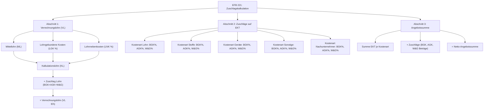
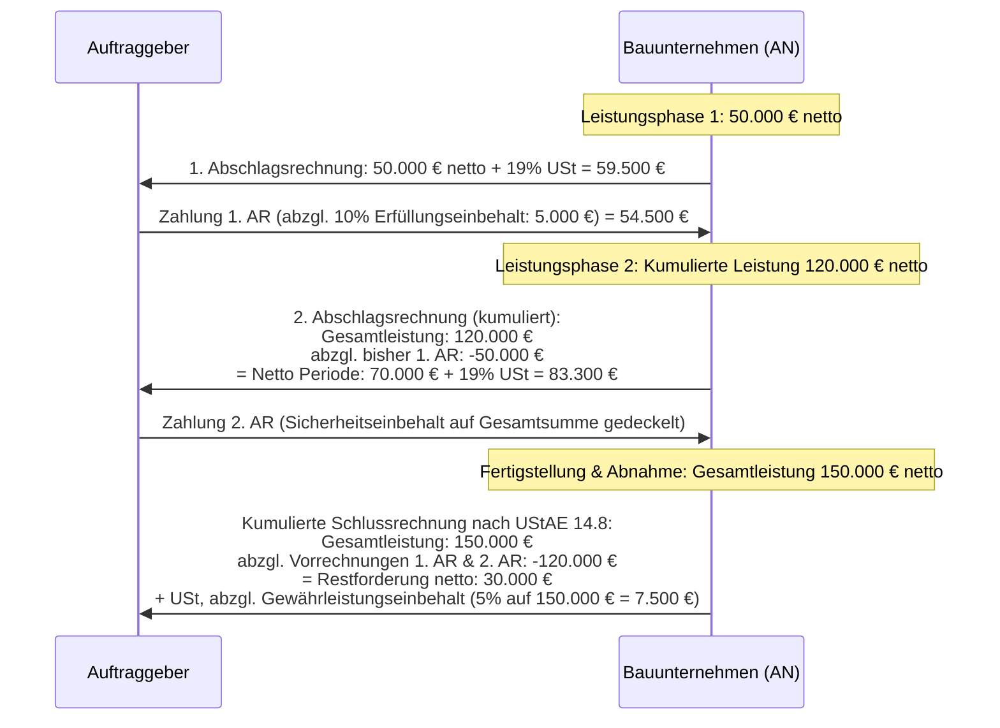
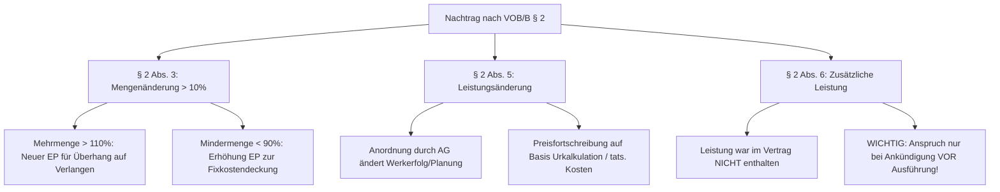

# Deep-Research-Fachbericht: Baukalkulation, Rechnungslegung, Nachtragsmanagement & Aufmaß nach VOB / VHB-Bund (bauprofessor.de)

**Projekt:** W-Link ERP (`Rechnungsprogramm_Geb_V2`)  
**Datum:** September 2026  
**Autor:** Bauprofessor Deep Researcher & ERP-Architekt  
**Quellenbasis:** Wissensplattform https://www.bauprofessor.de, VOB/A (2019/2023), VOB/B (2016/2023), VOB/C (DIN 18299 ff., Stand 2023), VHB-Bund (2017/2019/2024), BGB (§§ 631–650v), UStG (§§ 13b, 14, 14a), EStG (§§ 35a, 48, 48b), SOKA-BAU & BRTV-Baugewerbe.

---

## Inhaltsverzeichnis
1. [Executive Summary & Baubetriebliche Einordnung](#1-executive-summary--baubetriebliche-einordnung)
2. [Baukalkulation & EFB-Formblätter nach VHB-Bund](#2-baukalkulation--efb-formblätter-nach-vhb-bund)
   - 2.1 Zuschlagskalkulation (EFB 221) vs. Endsummenkalkulation (EFB 222)
   - 2.2 EFB-Formblatt 221: Struktur, Zuschlagssätze und Wagnisdifferenzierung
   - 2.3 EFB-Formblatt 222: Struktur der Baustellengemeinkosten (BGK) und Umlageverfahren
   - 2.4 EFB-Formblatt 223: Aufgliederung der Einheitspreise
   - 2.5 Mittellohnberechnung, lohngebundene Kosten (Ost/West) und Verrechnungslohn
3. [Rechnungslegung & Sicherheitseinbehalte nach VOB/B §§ 14, 16, 17](#3-rechnungslegung--sicherheitseinbehalte-nach-vobb--14-16-17)
   - 3.1 Prüffähigkeit und Rechnungsarten (Abschlags-, Teilschluss- und Schlussrechnung)
   - 3.2 Kumulierte Rechnungslegung (Kettenrechnung) nach VOB/B und UStAE 14.8
   - 3.3 Vertragserfüllungssicherheit vs. Mängelansprüchesicherheit nach § 17 VOB/B
   - 3.4 Steuerliche Pflichtangaben: § 13b UStG, § 48 EStG (Bauabzugsteuer) und § 35a EStG
   - 3.5 Anforderungen an die elektronische Rechnung (E-Rechnung / ZUGFeRD / XRechnung)
4. [Nachtragsmanagement & Ausgleichsberechnung nach VOB/B § 2](#4-nachtragsmanagement--ausgleichsberechnung-nach-vobb--2)
   - 4.1 Die Nachtragstatbestände: Mengenänderungen (§ 2 Abs. 3), Leistungsänderungen (§ 2 Abs. 5), Zusätzliche Leistungen (§ 2 Abs. 6)
   - 4.2 BGH-Rechtsprechung zur Preisfortschreibung (Urteil vom 08.08.2019, VII ZR 34/18)
   - 4.3 VHB-Leitfaden Richtlinie 510: Überschlägige vs. Detaillierte Ausgleichsberechnung
   - 4.4 Formblätter 521, 522 (Prüfungsvermerk) und 523 (Nachtragsvereinbarung)
5. [Aufmaß & Mengenermittlung nach VOB Teil C & REB-Verfahren](#5-aufmaß--mengenermittlung-nach-vob-teil-c--reb-verfahren)
   - 5.1 Abrechnungsgrundsätze nach ATV DIN 18299 (Abschnitt 5)
   - 5.2 Gewerkspezifische Übermessungs- und Abzugsregeln (Flächen-, Raum- und Längenmaße)
   - 5.3 REB-VB 23.003 Formelkatalog und DA11-Austausch
6. [Gap-Analyse & Konkrete Handlungsempfehlungen für Rechnungsprogramm_Geb_V2](#6-gap-analyse--konkrete-handlungsempfehlungen-für-rechnungsprogramm_geb_v2)
   - 6.1 Modul `KalkulationController.js` & `EFBController.js`
   - 6.2 Modul `CumulativeBillingController.js` & `InvoiceController.js`
   - 6.3 Modul `NachtragController.js`
   - 6.4 Modul `AufmassController.js`
7. [Mathematische Formelsammlung](#7-mathematische-formelsammlung)
8. [VOB-Musterbriefe & rechtssicherer Schriftverkehr (über 320 Vorlagen auf Bauprofessor)](#8-vob-musterbriefe--rechtssicherer-schriftverkehr-über-320-vorlagen-auf-bauprofessor)
   - 8.1 Behinderungsanzeige (§ 6 Abs. 1 VOB/B)
   - 8.2 Bedenkenanmeldung (§ 4 Abs. 3 VOB/B)
   - 8.3 Bauhandwerkersicherung (§ 650f BGB)
   - 8.4 Förmliche Abnahmeaufforderung (§ 12 VOB/B)
   - 8.5 Zahlungsverzug & Baueinstellung (§ 16 Abs. 5 VOB/B)
   - 8.6 Sperrkonto-Einzahlung & Freigabe (§ 17 Abs. 5 & 6 VOB/B)
9. [Stundenlohnarbeiten & Regieberichte nach VOB/B § 15](#9-stundenlohnarbeiten--regieberichte-nach-vobb--15)
   - 9.1 Gesetzliche & vertragliche Voraussetzungen
   - 9.2 Strikte Vorlagefristen & Fiktionswirkung
   - 9.3 Zuschlagssätze & Abrechnungsschema
10. [Baukostenstruktur nach DIN 276 (Kostengruppen 100 bis 800)](#10-baukostenstruktur-nach-din-276-kostengruppen-100-bis-800)
11. [Baumaschinen- & Gerätekalkulation nach Baugeräteliste (BGL)](#11-baumaschinen--gerätekalkulation-nach-baugeräteliste-bgl)
12. [B2B-Verzugszinsen & 40-€-Verzugspauschale (§ 288 BGB & § 16 VOB/B)](#12-b2b-verzugszinsen--40--verzugspauschale--288-bgb--16-vobb)
13. [GAEB-Datenaustausch (Schnittstelle zu Ausschreibungen)](#13-gaeb-datenaustausch-schnittstelle-zu-ausschreibungen)
14. [HOAI-Honorarberechnung (für Planungsleistungen)](#14-hoai-honorarberechnung-für-planungsleistungen)
15. [Gesamt-Roadmap & Modul-Priorisierung](#15-gesamt-roadmap--modul-priorisierung)
16. [Fazit & Nächste Schritte](#16-fazit--nächste-schritte)

---

## 1. Executive Summary & Baubetriebliche Einordnung

Die Wissensplattform **bauprofessor.de** stellt eine der maßgeblichen Referenzen für baubetriebliche Kalkulation, VOB-konforme Abrechnung, Vergaberecht nach VHB-Bund und baurechtliche Streitfragen in Deutschland dar. Die dort aufbereiteten Fachbeiträge und Formblätter von Experten wie *Prof. Dr. habil. Siegmar Kloß* spiegeln die gelebte Praxis von Bauunternehmen, Vergabestellen des Bundes/der Länder und Fachanwälten für Bau- und Architektenrecht wider.

Für die Weiterentwicklung von **`Rechnungsprogramm_Geb_V2` (W-Link ERP)** liefert die Recherche auf bauprofessor.de fundamentale Erkenntnisse:
1. **Baukalkulation:** Während die vereinfachte Zuschlagskalkulation für kleine Handwerksbetriebe ausreicht, verlangen mittlere und größere Bauvorhaben sowie öffentliche Auftraggeber zwingend die Unterscheidung zwischen **Zuschlagskalkulation (EFB 221)** und **Endsummenkalkulation (EFB 222)** mit auftragsbezogener BGK-Gliederung und Umlagerechnung.
2. **Rechnungslegung:** Die kumulierte Abrechnung ($F_t = L_t - \sum F_i$) muss nicht nur rechnerisch sauber sein, sondern zwingend die **Differenzierung der Sicherheitseinbehalte** (Vertragserfüllung max. 10% lfd. Abschlagsabzug bis 5% Auftragssumme vs. Mängelansprüche 5% auf Schlussrechnung), die **Sperrkonto-Fristen** (§ 17 Abs. 5 VOB/B) sowie die steuerlichen Restriktionen (**§ 13b UStG**, **§ 48 EStG Bauabzugsteuer 15%**, **§ 35a EStG Handwerkerlohn**) abbilden.
3. **Nachtragsmanagement:** Ein VOB-konformer Nachtrags-Workflow darf sich nicht in einer simplen Angebotserstellung erschöpfen. Er erfordert die Einordnung in die Tatbestände nach **VOB/B § 2 Abs. 3, 5 oder 6** sowie die Durchführung einer **Ausgleichsberechnung (VHB Richtlinie 510)** zur Ermittlung von Unter- und Überdeckungen der Gemeinkosten (BGK, AGK) und von Wagnis & Gewinn.
4. **Aufmaß:** Die Mengenermittlung nach VOB Teil C (DIN 18299) verlangt exakte **Übermessungsregeln** (z.B. Übermessung von Öffnungen und Nischen bis 2,50 m² bei Mauerwerk, Putz, Trockenbau, Malerarbeiten bzw. 0,10 m² bei Fliesen und Estrich), um prüffähige und rechtssichere Abrechnungen zu generieren.

---

## 2. Baukalkulation & EFB-Formblätter nach VHB-Bund

### 2.1 Zuschlagskalkulation (EFB 221) vs. Endsummenkalkulation (EFB 222)

Im deutschen Baubetriebswesen (gemäß KLR Bau und VHB) existieren zwei fundamentale Methoden der Angebotskalkulation:

| Kriterium | Zuschlagskalkulation (EFB 221) | Endsummenkalkulation (EFB 222) |
| :--- | :--- | :--- |
| **Baubetriebliches Prinzip** | Vorbestimmte Zuschlagssätze auf die Einzelkosten der Teilleistungen (EKT) je Kostenart. | Auftragsbezogene Ermittlung der Baustellengemeinkosten (BGK) und Umlage der Gemeinkosten über die Endsumme. |
| **Haupteinsatzbereich** | Handwerk, Ausbau, kleinere und mittlere Hochbauvorhaben mit bekannten Standardbaustellen. | Tiefbau, Ingenieurbau, Großprojekte, Projekte mit hohem Vorhaltegeräte- und Baustelleneinrichtungsaufwand. |
| **VHB-Formblatt** | **EFB 221** (Preisermittlung bei Zuschlagskalkulation) | **EFB 222** (Preisermittlung bei Endsummenkalkulation) |
| **BGK-Behandlung** | Pauschale prozentuale Zuschläge auf EKT (Lohn, Stoffe, Geräte, NU). | Detaillierte auftragsindividuelle Vorkalkulation nach Kostenarten (Hilfslöhne, Gehälter, Geräte, Transport, Sonderkosten). |
| **Flexibilität der Einheitspreise** | EP ist positionsbezogen starr vorbestimmt. | EPs passen sich dynamisch über die Umlagesätze an die Endsumme an. |

### 2.2 EFB-Formblatt 221: Struktur, Zuschlagssätze und Wagnisdifferenzierung

Das Formblatt **EFB 221** („Preisermittlung bei Zuschlagskalkulation“) gliedert sich nach dem VHB in drei Abschnitte:

#### Wesentliche Vorschriften für EFB 221 laut bauprofessor.de:
1. **Differenzierung von Wagnis und Gewinn (W & G):**
   Seit der VHB-Aktualisierung 2018/2019 müssen Bieter den Zuschlag für Wagnis und Gewinn zwingend aufteilen in:
   - **Betriebsbezogenes Wagnis (allgemeines Unternehmerwagnis):** Risiken aus dem Geschäftsbetrieb (z.B. Inflation, allgemeine Konjunktur, Haftung).
   - **Leistungsbezogenes Wagnis:** Risiken, die unmittelbar mit der spezifischen Bauleistung verknüpft sind (z.B. Witterungsrisiken, Bodenbeschaffenheit, Baustellengeometrie).
   - **Kalkulatorischer Gewinn:** Angestrebte unternehmerische Rendite.
   *Bedeutung für Nachträge:* Bei Nachträgen (§ 2 Abs. 5 und 6) darf ein geändertes Leistungsrisiko nur über das **leistungsbezogene Wagnis** fortgeschrieben werden; das betriebsbezogene Wagnis bleibt fixiert!
2. **Kostenarten in Abschnitt 2:**
   - **Lohn:** Eigene gewerbliche Arbeitsleistung (auf Basis Kalkulationslohn KL).
   - **Stoffe:** Baustoffe, Einbauteile, Bauhilfsstoffe.
   - **Geräte:** Leistungsgeräte und Vorhaltemaschinen (Abschreibung, Verzinsung, Reparatur, Betriebsstoffe).
   - **Sonstige Kosten:** Fremdleistungen Dritter, Transporte, Sonderfachleute.
   - **Nachunternehmerleistungen (NU):** Subunternehmeraufträge.

### 2.3 EFB-Formblatt 222: Struktur der Baustellengemeinkosten (BGK) und Umlageverfahren

Das Formblatt **EFB 222** („Preisermittlung bei Endsummenkalkulation“) wird gewählt, wenn die Baustellengemeinkosten (BGK) nicht pauschal, sondern auftragsindividuell berechnet werden.

#### Struktur von Abschnitt 3 des EFB 222 (Auftragsbezogene BGK):
Laut *bauprofessor.de* ist die auftragsbezogene BGK im EFB 222 exakt nach folgenden Kostenpositionen aufzuschlüsseln:
- **3.1.1 Lohnkosten der Baustelleneinrichtung:** Hilfslöhne für Auf-, Um- und Abbau der Baustelleneinrichtung, Baustellenbewachung, Winterbau-Löhne, Aufräumarbeiten.
- **3.1.2 Gehaltskosten der Baustelle:** Bauleitung, Oberbauleiter, Bauleiter vor Ort, Vermessungsingenieure, Poliere (soweit nicht im Mittellohn enthalten), Abrechnungstechniker.
- **3.1.3 Geräte und Ausrüstungen der Baustelleneinrichtung:** Vorhalte-, Bereitstellungs- und Reparaturkosten für Baukrane, Container, Bauzäune, Hebezeuge, Energie- und Wasseranschlüsse, Baustrom, Bauwasser.
- **3.1.4 Transport- und Anfahrtskosten:** An- und Abtransport von Baustellengeräten, Straßennutzungsgebühren, Pachten für Baustellenflächen.
- **3.1.5 Sonderkosten der Baustelle:** Bauwesen- und Haftpflichtversicherungen für das Bauvorhaben, behördliche Genehmigungen, Gebühren für Sondernutzungen, statische Nachweise der Rüstungen, Bodengutachten.

#### Das Umlageverfahren der Endsummenkalkulation:
Nach Ermittlung der Einzelkosten (EKT) und der auftragsbezogenen Gemeinkosten (BGK, AGK, W&G) werden die Gemeinkosten wie folgt auf die Einheitspreise umgelegt:
1. **Feste Umlagesätze auf EKT-Fremd- und Sachkosten:**
   - **Stoffkosten:** ca. 15 % bis 30 %
   - **Gerätekosten:** ca. 7 % bis 15 %
   - **Sonstige Kosten:** ca. 3 % bis 8 %
   - **Nachunternehmer:** ca. 8 % bis 13 %
2. **Rest-Umlage auf den Lohn:**
   Die verbleibenden Gemeinkosten und W&G-Beträge, die durch die festen Sachkostenumlagen nicht gedeckt werden, werden vollständig auf die **Lohnkosten** aufgeschlagen. Dies führt zur Bildung des kalkulierten **Verrechnungslohns (VL)**. Alternativ kann die Umlage proportional über die Herstellkosten ($HK = EKT + BGK$) erfolgen.

### 2.4 EFB-Formblatt 223: Aufgliederung der Einheitspreise

Das Formblatt **EFB 223** (nach VHB 2017/2019/2024; früher im VHB 2008 als EFB 222 bezeichnet) schlüsselt die Einheitspreise (EP) der einzelnen Leistungspositionen auf.
- **Pflicht zur Vorlage:** Bei öffentlichen Aufträgen ab 100.000 € Auftragssumme werden in der Regel für alle oder die maßgeblichen Teilleistungen EFB 223 gefordert.
- **Spaltenstruktur des EFB 223:**
  1. Ordnungszahl (OZ) der LV-Position
  2. Kurzbezeichnung der Leistung
  3. Mengeneinheit (ME)
  4. **Zeitansatz in Arbeitsstunden je ME (h/ME)**
  5. **Teilkosten je ME in € (jeweils EKT + anteilige Gemeinkosten & W&G):**
     - Teilkosten Lohn je ME (€)
     - Teilkosten Stoffe je ME (€)
     - Teilkosten Geräte je ME (€)
     - Teilkosten Sonstige / NU je ME (€)
  6. **Angebotener Einheitspreis je ME (Summe der Teilkosten in €)**

### 2.5 Mittellohnberechnung, lohngebundene Kosten (Ost/West) und Verrechnungslohn

Die Lohnkalkulation im deutschen Baugewerbe folgt dem strengen baubetrieblichen **APSL-Schema**:
- **A = Arbeitslohn / Tarifstundenlohn:** Gesamttarifstundenlohn (GTL) der eingesetzten Lohngruppen (Werker, Baufachwerker, Facharbeiter, Spezialfacharbeiter, Vorarbeiter) zuzüglich Bauzuschlag und übertariflicher Zulagen.
- **P = Polier- und Aufsichtsanteil:** Anteilige Einrechnung der Poliergehälter in die Kolonne, sofern diese nicht als BGK verrechnet werden.
- **S = Sozialkosten (lohngebundene Kosten LGK):**
  - *Gesetzliche Sozialkosten:* Rentenversicherung, Krankenversicherung, Pflegeversicherung, Arbeitslosenversicherung, Umlagen U1/U2/Insolvenzgeld, Berufsgenossenschaft (BG Bau).
  - *Tarifliche Sozialkosten (SOKA-BAU):* Urlaubs- und Lohnausgleichskasse (ULAK), Zusatzversorgungskasse (ZVK), Berufsbildungsumlage.
  - *BRTV-Leistungen:* Winterbeschäftigungsumlage, Wegezeitentschädigung und tariflicher Verpflegungszuschuss nach § 7 BRTV.
- **L = Lohnnebenkosten (LNK):** Fahrtkostenerstattung, Auslösungen, Werkzeuggeld, Schutzkleidung.

#### Orientierungswerte für lohngebundene Kosten (Stand 2024–2026 nach bauprofessor.de / Bauverbänden):
- **Tarifgebiet West:** **83,50 % bis 86,50 %** bezogen auf den Mittellohn.
- **Tarifgebiet Ost:** **78,00 % bis 82,50 %** bezogen auf den Mittellohn.
- **Lohnnebenkosten (LNK):** typisch **11,00 % bis 14,50 %**.

---

## 3. Rechnungslegung & Sicherheitseinbehalte nach VOB/B §§ 14, 16, 17

### 3.1 Prüffähigkeit und Rechnungsarten

Nach **VOB/B § 14 Abs. 1** ist eine Rechnung nur dann fällig, wenn sie prüffähig ist. Eine prüffähige Rechnung erfordert:
- Die übersichtliche Aufstellung der erbrachten Leistungen in der Reihenfolge der Ordnungszahlen (OZ) des Leistungsverzeichnisses.
- Den lückenlosen Nachweis durch beigefügte Aufmaßblätter, Abrechnungszeichnungen, Berechnungsbelege und Wiegescheine.
- Den Ausweis des Leistungszeitraums (bei Abschlagsrechnungen die Zeitspanne seit der letzten Rechnung; bei der Schlussrechnung der Zeitpunkt der Abnahme).

#### Rechnungsarten nach VOB/B § 16:
1. **Abschlagsrechnung (VOB/B § 16 Abs. 1):** In möglichst kurzen Zeitabständen für vertragsgemäß nachgewiesene Leistungen einschließlich des Werts auf der Baustelle bereitgestellter Stoffe und Bauteile. *Zahlungsfrist: binnen 21 Kalendertagen nach Zugang.*
2. **Teilschlussrechnung (VOB/B § 16 Abs. 2):** Erfordert eine förmliche Teilabnahme für eine in sich abgeschlossene Leistung (§ 12 Abs. 2 VOB/B).
3. **Schlussrechnung (VOB/B § 14 Abs. 3 & § 16 Abs. 3):** Nach Fertigstellung und Abnahme. Der Auftragnehmer muss sie binnen 12 Werktagen (bei größeren Bauverträgen bis 6–12 Wochen) einreichen. *Prüf- und Zahlungsfrist durch den AG: 30 Kalendertage (maximal 60 Kalendertage bei komplexen Bauvorhaben).*

### 3.2 Kumulierte Rechnungslegung (Kettenrechnung) nach VOB/B und UStAE 14.8

Im Baugewerbe ist die **kumulierte Abrechnung (Kettenrechnung)** zwingender Standard:
1. Die $n$-te Abschlagsrechnung weist die gesamte vom Baubeginn bis zum aktuellen Stichtag erbrachte Bauleistung netto aus ($L_t$).
2. Von diesem kumulierten Gesamtbetrag werden die **bisher abgerechneten Netto-Beträge** (bzw. die bisher erhaltenen Netto-Zahlungen $\sum F_i$) subtrahiert:
   $$F_t = L_t - \sum_{i=1}^{t-1} F_i$$
3. Auf den resultierenden Netto-Rechnungsbetrag der Periode $F_t$ wird die Umsatzsteuer erhoben (sofern kein § 13b UStG vorliegt).
4. **Vorgabe nach Abschnitt 14.8 UStAE (Umsatzsteuer-Anwendungserlass):**
   In der Schlussrechnung müssen alle vorangegangenen Abschlagsrechnungen mit den jeweiligen Teilentgelten und den darauf entfallenden Steuerbeträgen vollständig aufgeführt werden. Dies verhindert eine steuerliche Doppelbelastung und sichert den Vorsteuerabzug des Auftraggebers.

### 3.3 Vertragserfüllungssicherheit vs. Mängelansprüchesicherheit nach § 17 VOB/B

Die Praxis unterscheidet strikt zwischen zwei Sicherheitsformen:

| Merkmal | Vertragserfüllungssicherheit | Mängelansprüchesicherheit (Gewährleistung) |
| :--- | :--- | :--- |
| **Rechtsgrundlage** | VOB/B § 17 Abs. 6 & Abs. 1 | VOB/B § 17 Abs. 1 & § 13 Abs. 4 |
| **Gegenstand** | Vertragsgemäße Ausführung der Leistung bis zur Abnahme. | Haftung für Sachmängel nach erfolgter Abnahme. |
| **Einbehaltspraxis** | Laufender Abzug von Abschlagsrechnungen von **höchstens 10 %** der jeweiligen Abschlagsforderung, bis die vereinbarte Summe erreicht ist. | Einbehalt von der **Schlussrechnungssumme** (typisch **5,0 %**). |
| **Obergrenze** | In der Regel **5,0 %** der ursprünglichen Netto-Auftragssumme. | In der Regel **5,0 %** der endgültigen Abrechnungssumme. |
| **Schwellenwert VOB/A § 9c** | Bei öffentlichen Bauaufträgen soll unter **250.000 € Netto-Auftragssumme** auf die Vertragserfüllungssicherheit verzichtet werden! | Wird bei öffentlichen Aufträgen nur verlangt, wenn sachlich begründet. |
| **Fälligkeit der Freigabe** | **Mit der Abnahme** der Gesamtleistung ist die Vertragserfüllungssicherheit sofort freizugeben bzw. zurückzugeben! | Nach Ablauf der Gewährleistungsfrist (**4 Jahre nach VOB/B § 13 Abs. 4** bzw. **5 Jahre nach BGB § 634a**). |
| **Ablösung durch Bürgschaft** | Der Auftragnehmer hat das Recht, den Bareinbehalt jederzeit durch eine selbstschuldnerische Bankbürgschaft abzulösen (§ 17 Abs. 2/4 VOB/B). | Ebenso Ablösung durch Gewährleistungsbürgschaft möglich. |
| **Sperrkontopflicht (§ 17 Abs. 5)** | Behält der AG Bargeld ein, **muss er es binnen 18 Werktagen auf ein gemeinsames Sperrkonto einzahlen** und verzinsen. | Gleiche Sperrkontopflicht! Zahlt der AG trotz Nachfrist nicht ein, kann der AN die **sofortige Auszahlung des Einbehalts verlangen**! |

#### Steuerliche Behandlung von Sicherheitseinbehalten (VOB & UStG):
Ein Sicherheitseinbehalt berührt **nicht** die steuerliche Bemessungsgrundlage! Die Umsatzsteuer entsteht immer auf das volle vereinbarte Entgelt der Teilleistung bzw. Gesamtleistung. Der Sicherheitseinbehalt wird rein buchhalterisch als **Abzugsposten vom Bruttozahlungsanspruch** abgezogen.

### 3.4 Steuerliche Pflichtangaben: § 13b UStG, § 48 EStG und § 35a EStG

1. **§ 13b UStG (Steuerschuldnerschaft des Leistungsempfängers / Reverse Charge):**
   - Bei Bauleistungen zwischen Bauunternehmern (sofern der Empfänger nachhaltig Bauleistungen erbringt, Nachweis USt 1 TG).
   - In der Rechnung darf **keine Umsatzsteuer** ausgewiesen werden.
   - Zwingender Pflichtvermerk: *„Steuerschuldnerschaft des Leistungsempfängers (§ 13b UStG)“*.
2. **§ 48 EStG / § 48b EStG (Bauabzugsteuer 15 %):**
   - Der Leistungsempfänger (Unternehmer oder juristische Person) ist gesetzlich verpflichtet, **15 % des Bruttorechnungsbetrags** einzubehalten und an das Finanzamt abzuführen.
   - Der Einbehalt entfällt nur, wenn der leistende Unternehmer eine **gültige Freistellungsbescheinigung nach § 48b EStG** vorlegt.
   - Das ERP-System muss die Gültigkeitsdaten der Freistellungsbescheinigung verwalten und bei Fehlen/Ablauf automatisch einen 15%-Abzug auf den Auszahlungsbetrag vornehmen.
3. **§ 35a EStG (Steuerermäßigung für Handwerkerleistungen bei Privatkunden):**
   - Private Auftraggeber können 20 % der Arbeitskosten (bis max. 1.200 € Steuerermäßigung pro Jahr) steuerlich geltend machen.
   - Zwingende ERP-Anforderung: **Getrennter Ausweis von reinem Lohnanteil** (Arbeitslohn, Maschinenkosten, Fahrtkosten) netto und brutto getrennt vom Materialanteil.
4. **Aufbewahrungspflicht für Verbraucher (§ 14 Abs. 4 Nr. 9 UStG):**
   - Bei Rechnungen an Verbraucher über steuerpflichtige Leistungen im Zusammenhang mit einem Grundstück muss zwingend der Hinweis enthalten sein, dass die Rechnung **mindestens 2 Jahre aufzubewahren** ist (Unternehmer: 10 Jahre nach § 14b UStG).

### 3.5 Anforderungen an die elektronische Rechnung (E-Rechnung ab 2025/2026)

Nach den aktuellen BMF-Schreiben vom 15. Oktober 2024 und 23. Februar 2026:
- **XML-Struktur (EN 16931, XRechnung / ZUGFeRD):** Bis 30. Juni 2030 reicht es im strukturierten Datenteil aus, die Summen je Gewerk anzugeben.
- **Maschinenlesbare Anlage:** Die detaillierte Aufschlüsselung nach dem Leistungsverzeichnis (z.B. GAEB-Datei oder strukturierte Aufmaßdaten) muss als maschinenlesbare Anlage beigefügt und im XML-Kopf referenziert werden.
- **Abschlags- und Schlussrechnungen:** Die Aufstellung nach UStAE 14.8 kann als strukturierte Anlage eingebunden werden.

---

## 4. Nachtragsmanagement & Ausgleichsberechnung nach VOB/B § 2

### 4.1 Die Nachtragstatbestände nach VOB/B § 2

1. **VOB/B § 2 Abs. 3 (Mengenänderungen über 10 %):**
   - Tritt bei Einheitspreisverträgen ohne Anordnung ein.
   - **Mehrmengen (> 110 % des Sollansatzes):** Für die über 110 % hinausgehende Menge ist auf Verlangen ein neuer Einheitspreis zu vereinbaren. Die ersten 110 % werden zum vertraglichen Einheitspreis vergütet.
   - **Mindermengen (< 90 % des Sollansatzes):** Der Auftragnehmer hat Anspruch auf Erhöhung des Einheitspreises für die verbleibende Menge, um den Verlust an Deckungsbeitrag für die fixen Baustellengemeinkosten (BGK) und Allgemeinen Geschäftskosten (AGK) auszugleichen – *sofern kein Ausgleich durch Mehrmengen in anderen Positionen stattfindet!*
2. **VOB/B § 2 Abs. 5 (Leistungsänderung durch AG-Anordnung):**
   - Ändert der AG den Bauentwurf oder ordnet eine andere Ausführung an, ist ein neuer Preis unter Berücksichtigung der Mehr- oder Minderkosten zu vereinbaren.
3. **VOB/B § 2 Abs. 6 (Zusätzliche Leistungen):**
   - Leistungen, die im ursprünglichen Vertrag weder vorgesehen noch beschrieben waren, aber zur Ausführung der Gesamtleistung erforderlich werden.
   - **Kardinalregel für den Auftragnehmer:** Der Vergütungsanspruch entfällt rechtlich, wenn der Auftragnehmer den Anspruch **nicht VOR Beginn der Ausführung dem Auftraggeber ankündigt!**

### 4.2 BGH-Rechtsprechung zur Preisfortschreibung (Urteil vom 08.08.2019, VII ZR 34/18)

Das Grundsatzurteil des Bundesgerichtshofs vom 8. August 2019 hat das Nachtragsrecht revolutioniert:
- **Abkehr von der starren Urkalkulationsfortschreibung bei Mehrmengen:** Der BGH stellte klar, dass bei Mengenmehrungen (§ 2 Abs. 3) die Vertragspartner nicht zwingend an die vorkalkulatorische Fortschreibung (EFB-Preis) gebunden sind.
- **Maßstab:** Maßgebend sind die **tatsächlich erforderlichen Kosten zuzüglich angemessener Gemeinkostenzuschläge sowie Wagnis und Gewinn**.
- **Kooperationsgebot:** Keine Vertragspartei darf durch Mengenmehrungen ungerechtfertigt bevorteilt oder benachteiligt werden.

### 4.3 VHB-Leitfaden Richtlinie 510: Überschlägige vs. Detaillierte Ausgleichsberechnung

Bei öffentlichen Bauaufträgen schreibt die **Richtlinie 510 des VHB-Bund** vor, wie Nachträge in einer Gesamtausgleichsberechnung zusammengeführt werden:

#### A. Überschlägige Ausgleichsberechnung (Tz. 7.6.1 VHB Richtlinie 510):
- Vergleicht summarisch die Vergütung aus den ausgeführten Mehrmengen mit den Mindervergütungen aus Mindermengen auf Basis der vertraglichen Einheitspreise.
- Wenn die Mehrmengenvergütungen die Mindermengen kompensieren, besteht in der Regel kein Anspruch auf Preiserhöhung der Unterdeckungs-Positionen.

#### B. Detaillierte Ausgleichsberechnung (Tz. 7.6.2 VHB Richtlinie 510):
- Exakte Trennung der Kosten in **Einzelkosten der Teilleistungen (EKT)** und **Deckungsbeiträge (BGK, AGK, W&G)**.
- **Berechnungsschritte:**
  1. Ermittlung der EKT-Minderkosten der entfallenen Mengen.
  2. Feststellung der nicht gedeckten auftragsbezogenen BGK und AGK.
  3. Ermittlung der zusätzlichen Deckungsbeiträge aus Mehrmengen und Zusatzpositionen (§ 2 Abs. 5 und 6).
  4. Saldierung der Deckungsbeiträge: Nur wenn per Saldo eine echte Unterdeckung verbleibt, wird dem Auftragnehmer eine Nachvergütung zugesprochen.

---

## 5. Aufmaß & Mengenermittlung nach VOB Teil C & REB-Verfahren

### 5.1 Abrechnungsgrundsätze nach ATV DIN 18299 (Abschnitt 5)

Die **ATV DIN 18299 („Allgemeine Regelungen für Bauarbeiten jeder Art“, Stand: Oktober 2023)** bildet das normative Fundament der VOB/C:
- **Abschnitt 5.1 (Allgemeines):** Die Leistung ist nach den vertraglichen Maßen zu ermitteln. Als Nachweis dienen örtliche Aufmaße, Zeichnungen oder digitale Bauwerksmodelle (BIM).
- **Abschnitt 5.2 (Ermittlung der Maße):** Maße sind grundsätzlich auf die kleinsten Umschreibungsmaße abzustellen. Beliebig geformte Einzelflächen sind durch Aufteilung in einfach messbare geometrische Teilflächen (Rechtecke, Dreiecke, Trapeze) zu zerlegen.

### 5.2 Gewerkspezifische Übermessungs- und Abzugsregeln

In der VOB/C gilt das Prinzip: **Kleine Öffnungen, Nischen und Unterbrechungen werden „übermessen“** (d.h. sie werden wie voll ausgeführte Flächen abgerechnet), um dem Handwerker den Mehraufwand für Zuschnitt, Kantenbearbeitung und Laibungen ohne separate Kleinstpositionen zu vergüten. Erst ab Überschreitung fester Grenzwerte erfolgt ein Abzug!

#### Übersicht der Grenzwerte nach VOB/C (Abschnitt 5.3 der jeweiligen Fach-ATV):

| Abrechnungseinheit / Gewerk | ATV DIN | Grenzwert für Übermessung (kein Abzug) | Abzugspflichtig (Minderfläche) |
| :--- | :--- | :--- | :--- |
| **Mauerarbeiten (Wandflächen)** | DIN 18330 | Aussparungen & Öffnungen $\le \mathbf{2,50\,m^2}$ Einzelgröße | $> \mathbf{2,50\,m^2}$ Einzelgröße |
| **Betonarbeiten (Wand/Schalung)** | DIN 18331 | Aussparungen & Öffnungen $\le \mathbf{2,50\,m^2}$ Einzelgröße | $> \mathbf{2,50\,m^2}$ Einzelgröße |
| **Betonarbeiten (Raummaß $m^3$)** | DIN 18331 | Aussparungen, Einbauteile $\le \mathbf{0,50\,m^3}$ Einzelgröße | $> \mathbf{0,50\,m^3}$ Einzelgröße |
| **Beton (Schlitze, Kanäle)** | DIN 18331 | Bis $\le \mathbf{0,10\,m^3}$ je Meter Länge | $> \mathbf{0,10\,m^3}$ je Meter Länge |
| **Trockenbauarbeiten** | DIN 18340 | Öffnungen & Nischen $\le \mathbf{2,50\,m^2}$ Einzelgröße | $> \mathbf{2,50\,m^2}$ Einzelgröße |
| **Putz- und Stuckarbeiten** | DIN 18350 | Öffnungen & Nischen $\le \mathbf{2,50\,m^2}$ Einzelgröße | $> \mathbf{2,50\,m^2}$ Einzelgröße |
| **Wärmedämm-Verbundsysteme (WDVS)** | DIN 18345 | Öffnungen & Nischen $\le \mathbf{2,50\,m^2}$ Einzelgröße | $> \mathbf{2,50\,m^2}$ Einzelgröße |
| **Maler- und Lackierarbeiten** | DIN 18363 | Öffnungen & Nischen $\le \mathbf{2,50\,m^2}$ Einzelgröße | $> \mathbf{2,50\,m^2}$ Einzelgröße |
| **Tischlerarbeiten** | DIN 18355 | Öffnungen $\le \mathbf{2,50\,m^2}$ Einzelgröße | $> \mathbf{2,50\,m^2}$ Einzelgröße |
| **Fliesen- und Plattenarbeiten** | DIN 18352 | Aussparungen & Öffnungen $\le \mathbf{0,10\,m^2}$ Einzelgröße | $> \mathbf{0,10\,m^2}$ Einzelgröße |
| **Estricharbeiten** | DIN 18353 | Aussparungen $\le \mathbf{0,10\,m^2}$ Einzelgröße | $> \mathbf{0,10\,m^2}$ Einzelgröße |
| **Bodenbelagsarbeiten** | DIN 18356 | Aussparungen $\le \mathbf{0,10\,m^2}$ Einzelgröße | $> \mathbf{0,10\,m^2}$ Einzelgröße |
| **Böden bei Rohbau/Trockenbau** | DIN 18330/40 | Aussparungen in Bodenflächen $\le \mathbf{0,50\,m^2}$ | $> \mathbf{0,50\,m^2}$ Einzelgröße |
| **Abrechnung nach Längenmaß (m)** | DIN 18299 | Unterbrechungen $\le \mathbf{1,00\,m}$ Einzellänge | $> \mathbf{1,00\,m}$ Einzellänge |
| **Stabförmige Bauteile (Unterbrechung)** | DIN 18299 | Stützen, Fachwerk $\le \mathbf{30\,cm}$ Einzelbreite | $> \mathbf{30\,cm}$ Einzelbreite |

*Wichtiger Praxishinweis von bauprofessor.de:* Unmittelbar aneinandergrenzende, verschiedenartige Aussparungen (z.B. Fensteröffnung mit darunterliegender Heizkörpernische) sind **getrennt zu bewerten** und dürfen nicht addiert werden!

### 5.3 REB-VB 23.003 Formelkatalog und DA11-Austausch

Die Erfassung von Aufmaßen erfolgt nach der Verfahrensbeschreibung **REB-VB 23.003** (Allgemeine Mengenberechnung) im standardisierten Datenaustauschformat **DA11**:
- **Formel 01 (Rechteck):** $F = a \times b$
- **Formel 02 (Dreieck):** $F = \frac{a \times b}{2}$
- **Formel 03 (Trapez):** $F = \frac{a + c}{2} \times b$
- **Formel 04 (Quader):** $V = a \times b \times c$
- **Formel 05 (Zylinder):** $V = \frac{\pi}{4} \times a^2 \times b$
- **Formel 91 (Freie mathematische Formel):** Freier Rechenansatz mit bis zu 4 Operanden und Klammern.

---

## 6. Gap-Analyse & Konkrete Handlungsempfehlungen für Rechnungsprogramm_Geb_V2

Basierend auf der Überprüfung des aktuellen Codebestands in `F:\server\Rechnungsprogramm_Geb_V2\controllers\` und den Rechercheergebnissen von bauprofessor.de ergibt sich folgender Handlungsbedarf:

### 6.1 Modul `KalkulationController.js` & `EFBController.js`

| Bereich | Ist-Zustand im Code | Soll-Zustand nach bauprofessor / VHB | Handlungsempfehlung / Code-Erweiterung |
| :--- | :--- | :--- | :--- |
| **EFB-Formblätter** | EFB 221 & EFB 223 sind vorhanden; **EFB 222 fehlt in `EFBController.js`**. | EFB 222 ist Pflicht bei Endsummenkalkulation ab 50.000 € Auftragswert. | Neue Methode `EFBController.calculateEFB222(project, positions, bgkDetails, profile)` implementieren mit vollständiger Struktur von Abschnitt 3 (3.1.1 bis 3.1.5). |
| **Wagnisaufteilung** | W&G wird teils als Summe geführt (`wug_gesamt`). | Pflicht zur Differenzierung: Betriebsbezogenes Wagnis vs. Leistungsbezogenes Wagnis. | Beide Wagnisarten strikt getrennt in Profilen und Berechnungen führen, da nur das leistungsbezogene Wagnis bei Nachträgen fortgeschrieben wird. |
| **Lohnzusatzkosten** | Einheitlicher Lohnzusatzkostensatz (Standard 84.50%). | Differenzierung Tarifgebiet Ost vs. West, Berücksichtigung Wegezeitentschädigung BRTV § 7. | Vorkonfigurierte Profile für „Bauhauptgewerbe West“ (85,5%) und „Bauhauptgewerbe Ost“ (80,5%) zur Auswahl anbieten. |
| **Endsummen-Umlage** | Einfache Umlage über Herstellkosten vorhanden. | Standard-Baupraxis: Feste Umlagen auf Sachkosten (Stoff, Gerät, Sonst, NU) und Umlage der Rest-Gemeinkosten auf den Lohn. | Option für „Restgemeinkosten-Umlage auf Lohn“ in `KalkulationController.js` implementieren. |

### 6.2 Modul `CumulativeBillingController.js` & `InvoiceController.js`

| Bereich | Ist-Zustand im Code | Soll-Zustand nach bauprofessor / VOB/B | Handlungsempfehlung / Code-Erweiterung |
| :--- | :--- | :--- | :--- |
| **Sicherheitseinbehalt-Typen** | Generischer Abzug `securityRetentionRate` (zuletzt am 08.09.2026 als %-Feld erweitert). | Strikte Unterscheidung: 1. **Vertragserfüllungseinbehalt** (lfd. max 10% bis 5% Auftragssumme) vs. 2. **Gewährleistungseinbehalt** (5% auf Schlussrechnung). | `CumulativeBillingController.js` erweitern um Parameter `retentionMode: 'EXECUTION' \| 'WARRANTY'`, mit automatischer Deckelung des Erfüllungseinbehalts auf max. 5% der ursprünglichen Auftragssumme! |
| **Schwellenwert VOB/A § 9c** | Kein Schwellenwert-Check. | Bei öffentlichen Aufträgen unter 250.000 € soll auf Erfüllungssicherheit verzichtet werden. | Hinweismeldung in der Rechnungsmaske anzeigen: *„Auftragssumme < 250.000 €: Gemäß VOB/A § 9c Abs. 2 sollte auf Vertragserfüllungssicherheit verzichtet werden.“* |
| **Bauabzugsteuer § 48 EStG** | Nicht automatisiert im Zahlbetrag verknüpft. | 15% Einbehalt vom Bruttobetrag, sofern keine gültige Freistellungsbescheinigung nach § 48b EStG vorliegt. | Validierungs-Check auf Vorhandensein und Ablaufdatum der Freistellungsbescheinigung des Kreditors/Auftragnehmers mit automatischem 15%-Abzugsvorschlag. |
| **Handwerkerlohn § 35a EStG** | Vorhanden, aber nicht bei jeder kumulierten Teilrechnung separat ausgewiesen. | Transparente Ermittlung der Arbeitskosten der laufenden Periode ($Lohn_t - Lohn_{vor}$). | Ausweis des kumulierten und periodenbezogenen Arbeitskostenanteils (§ 35a) im PDF-Layout und in den Rechnungsdaten. |
| **Sperrkonto-Überwachung** | Datensatz wird in `createSecurityRetentionEntry` angelegt. | VOB/B § 17 Abs. 5 verpflichtet AG zur Einzahlung binnen 18 Werktagen; AN kann nach Fristsetzung Freigabe fordern. | Fälligkeits- und Mahn-Workflow im Mängel-/Gewährleistungsmodul für Sperrkonten nach 18 Werktagen einbinden. |
| **UStAE 14.8 Anlage** | Rechnungsabzug erfolgt summarisch. | Vollständige tabellarische Übersicht aller Abschlagsrechnungen mit Netto-Teilentgelten und Steuerbeträgen. | Generierung einer GoBD-/UStAE-14.8-konformen Anlage zur Schlussrechnung im Druck- und PDF-Generator. |

### 6.3 Modul `NachtragController.js`

| Bereich | Ist-Zustand im Code | Soll-Zustand nach bauprofessor / VOB/B | Handlungsempfehlung / Code-Erweiterung |
| :--- | :--- | :--- | :--- |
| **Rechtsgrundlagen-Prüfung** | Labels für § 2 Abs. 3, 5, 6 vorhanden. | Bei § 2 Abs. 6 ist eine vorherige Ankündigung materiell-rechtliche Anspruchsvoraussetzung! | Warnhinweis / Pflicht-Bestätigung im Nachtragsmodal: *„Wurde der Anspruch auf zusätzliche Vergütung nach § 2 Abs. 6 VOB/B vor Ausführungsbeginn dem AG schriftlich angezeigt?“* |
| **Ausgleichsberechnung** | Fehlt vollständig in `NachtragController.js`. | VHB Richtlinie 510 schreibt überschlägige (Tz. 7.6.1) und detaillierte (Tz. 7.6.2) Ausgleichsberechnung vor. | Implementierung einer neuen Engine `NachtragController.calculateAusgleichsberechnung({ basePositions, nachtragPositions, profile })`. |
| **Preisanpassung Mehrmengen** | Keine automatische Mengenprüfung. | Bei Mengen > 110% greift Preisanpassungsrecht nach § 2 Abs. 3 Nr. 2 VOB/B. | Automatischer Schwellenwert-Alarm bei Aufmaß-Mengen > 110 % der Vertragssumme mit Vorschlag zur Bildung einer Nachtragsposition für die Überhangmenge. |

### 6.4 Modul `AufmassController.js`

| Bereich | Ist-Zustand im Code | Soll-Zustand nach bauprofessor / VOB Teil C | Handlungsempfehlung / Code-Erweiterung |
| :--- | :--- | :--- | :--- |
| **Übermessungsregeln** | Berechnet rein mathematische Formeln (REB 01–05, 91). | VOB/C verlangt gewerkspezifische Grenzwerte (2,50 m² Rohbau/Putz/Maler; 0,10 m² Fliesen/Estrich; 1,00 m Längenmaß). | Neue Hilfsfunktion `AufmassController.applyUebermessungRule(einzelmass, gewerkNorm, massType)` implementieren, die automatisch kennzeichnet, ob eine Öffnung/Aussparung übermessen oder abgezogen werden muss. |
| **Abzugskennzeichnung** | Vorzeichen +/- manuell. | Im Aufmaßblatt nach REB müssen Abzüge explizit als solche ausgewiesen und begründet sein. | Bereitstellung von Vorgabefeldern für Abzüge (Fenster, Türen, Nischen) mit automatischer Prüfung gegen den Norm-Grenzwert. |

---

## 7. Mathematische Formelsammlung

### 7.1 Lohnkalkulation (Mittellohn & Verrechnungslohn)
$$\text{Mittellohn (ML)} = \frac{\sum (Stunden_i \times Tariflohn_i)}{\sum Stunden_i} + Zulagen$$

$$\text{Kalkulationslohn (KL)} = ML \times \left(1 + \frac{\text{Lohngebundene Kosten \%} + \text{Lohnnebenkosten \%}}{100}\right)$$

$$\text{Verrechnungslohn (VL)} = KL \times \left(1 + \frac{BGK_{Lohn}\% + AGK_{Lohn}\% + WuG_{Lohn}\%}{100}\right)$$

### 7.2 Kumulierte Abrechnung nach VOB/B
$$\text{Kumulierte Gesamtleistung (netto)}: L_t = \sum_{j=1}^{m} (Aufmaßmenge_j \times EP_j)$$

$$\text{Bisher abgerechnet (netto)}: B_{vor} = \sum_{i=1}^{t-1} F_i$$

$$\text{Rechnungsbetrag aktuelle Periode (netto)}: F_t = \max(0, L_t - B_{vor})$$

$$\text{Umsatzsteuer aktuelle Periode}: USt_t = \begin{cases} 0 & \text{falls § 13b UStG} \\ F_t \times \frac{USt\%}{100} & \text{Standard} \end{cases}$$

$$\text{Bruttobetrag aktuelle Periode}: G_t = F_t + USt_t$$

### 7.3 Sicherheitseinbehalt mit Auftragssummen-Deckelung
$$\text{Maximaler Sicherheitseinbehalt (Ziel)}: S_{max} = \text{Auftragssumme (netto)} \times \frac{\text{Erfüllungssicherheit \%}}{100}$$

$$\text{Soll-Einbehalt kumuliert}: S_{soll, t} = \min\left(S_{max}, L_t \times \frac{\text{Laufender Einbehaltssatz \%}}{100}\right)$$

$$\text{Einbehalt dieser Rechnung}: S_t = \max(0, S_{soll, t} - \sum_{i=1}^{t-1} S_i)$$

$$\text{Zahlungsanspruch (Auszahlungsbetrag)}: Z_t = G_t - S_t$$

### 7.4 Bauabzugsteuer (§ 48 EStG)
$$BAS_t = \begin{cases} 0 & \text{falls gültige Freistellungsbescheinigung nach § 48b EStG vorliegt} \\ Z_t \times 0{,}15 & \text{ohne Freistellungsbescheinigung} \end{cases}$$

$$\text{Überweisungsbetrag an Auftragnehmer}: \text{Auszahlung} = Z_t - BAS_t$$

### 7.5 Preisanpassung bei Mengenmehrung (§ 2 Abs. 3 Nr. 2 VOB/B)
$$\text{Menge Vertrag}: Q_0, \quad \text{Grenze 110 \%}: Q_{110} = 1{,}10 \times Q_0, \quad \text{Tatsächliche Menge}: Q_{ist}$$

$$\text{Für } Q_{ist} > Q_{110}: \quad \text{Vergütung} = (Q_{110} \times EP_0) + ((Q_{ist} - Q_{110}) \times EP_{neu})$$

Wobei $EP_{neu}$ die veränderten verbrauchs- und geräteabhängigen Grenzkosten zuzüglich angemessener Zuschläge widerspiegelt.

---

## 8. VOB-Musterbriefe & rechtssicherer Schriftverkehr (über 320 Vorlagen auf Bauprofessor)

Auf Baustellen entscheidet der form- und fristgerechte Schriftverkehr häufig über den wirtschaftlichen Erfolg eines Bauprojekts. Mangelhafte oder verspätete Anzeigen führen zum Totalverlust von Ansprüchen auf Fristverlängerung, Mehrvergütung oder zur unberechtigten Inanspruchnahme für Baumängel. Die Wissensplattform *bauprofessor.de* stellt über 320 rechtssicher ausformulierte Musterbriefe für Auftragnehmer und Auftraggeber bereit.

Für `Rechnungsprogramm_Geb_V2` (W-Link ERP) ist die Implementierung eines automatisierten **VOB-Schriftverkehr-Moduls (`VobCorrespondenceController.js`)** ein herausragendes Alleinstellungsmerkmal gegenüber herkömmlichen Fakturierungsprogrammen.

### 8.1 Behinderungsanzeige (§ 6 Abs. 1 VOB/B)
* **Tatbestand:** Glaubt sich der Auftragnehmer in der ordnungsgemäßen Ausführung seiner Leistung behindert (z. B. bauseitige Vorleistungen nicht fertiggestellt, fehlende Baufreiheit, Planungsunterlagen verspätet, Witterungsverhältnisse außerhalb des langjährigen meteorologischen Durchschnitts), muss er dies dem Auftraggeber **unverzüglich schriftlich anzeigen**.
* **Rechtsfolgen:**
  * Fristverlängerung für die Ausführungsfristen (§ 6 Abs. 2 VOB/B).
  * Abwendung von Vertragsstrafen nach § 11 VOB/B.
  * Entschädigungsanspruch nach § 642 BGB bzw. Schadensersatz nach § 6 Abs. 6 VOB/B bei Vertretenmüssen durch den Auftraggeber.
* **Mitteilung des Wegfalls (§ 6 Abs. 3 VOB/B):** Sobald die Behinderung entfällt, muss der Auftragnehmer dies dem Auftraggeber ebenfalls schriftlich mitteilen und die Arbeiten unverzüglich wieder aufnehmen.
* **ERP-Funktion:** Automatische Verknüpfung mit dem Bautagebuch (`BautagebuchController.js`): Wird im Bautagebuch ein Witterungsausfall oder ein Vorgewerk-Verzug erfasst, schlägt das System per 1-Klick die Generierung einer VOB-konformen Behinderungsanzeige mit Datumsstempel und Projektzuordnung vor.

### 8.2 Bedenkenanmeldung (§ 4 Abs. 3 VOB/B)
* **Tatbestand:** Der Auftragnehmer hat die vertragliche Pflicht, unverzüglich schriftlich Bedenken anzumelden, wenn:
  1. Vorgesehene Ausführungsarten ungeeignet oder risikobehaftet sind.
  2. Bauseits gelieferte Stoffe oder Bauteile Gütemängel aufweisen.
  3. Vorleistungen anderer Unternehmer mangelhaft oder ungeeignet sind (z. B. feuchter Estrich vor Fliesenverlegung).
* **Haftungsfreistellung nach § 13 Abs. 3 VOB/B:** Nur eine substanziierte, schriftliche Bedenkenanmeldung befreit den Handwerker von der Mängelhaftung, wenn der Mangel auf die Vorleistung oder Anordnung des Bauherrn zurückzuführen ist.
* **ERP-Funktion:** Vorlage mit Gefährdungsanalyse, Hinweispflicht auf DIN-Normen und Frist zur Rückäußerung des Auftraggebers.

### 8.3 Bauhandwerkersicherung (§ 650f BGB, ehemals § 648a BGB)
* **Bedeutung:** Das mächtigste Schutzinstrument des Bauunternehmers im deutschen Baurecht. Der Auftragnehmer kann vom Besteller (Ausnahme: Verbraucher bei Neubau eines Einfamilienhauses) jederzeit eine Sicherheitsleistung (in der Regel eine unbefristete, selbstschuldnerische Bankbürgschaft) für die gesamte noch nicht gezahlte Vergütung **zuzüglich 10 % für Nebenforderungen** verlangen.
* **Berechnungsformel Sicherungsanspruch:**
  $$S_{\S 650f} = (\text{Vertragssumme} + \text{beauftragte Nachträge} - \text{bereits geleistete Zahlungen}) \times 1{,}10$$
* **Rechtsfolge bei Fristablauf:** Wird die Bürgschaft nicht innerhalb der gesetzten Frist (üblicherweise 7–10 Kalendertage) beigebracht, darf der Handwerker:
  1. Die Arbeiten sofort einstellen (Leistungsverweigerungsrecht).
  2. Den Vertrag kündigen und die vereinbarte Vergütung abzüglich ersparter Aufwendungen fordern (§ 648 BGB).
* **ERP-Funktion:** Bürgschaftsrechner auf Knopfdruck für jedes Projekt mit automatischem Fristen-Tracking.

### 8.4 Förmliche Abnahmeaufforderung (§ 12 VOB/B & § 640 BGB)
* **Regelungen:**
  * Nach schriftlicher Fertigstellungsmitteilung ist die Abnahme binnen **12 Werktagen** durchzuführen (§ 12 Abs. 1 VOB/B).
  * **Fiktive Abnahme (§ 12 Abs. 5 Nr. 1 VOB/B):** Erfolgt keine Abnahme und hat der Auftraggeber die Leistung in Benutzung genommen, gilt die Abnahme nach Ablauf von **6 Werktagen nach Beginn der Benutzung** als erfolgt.
  * **BGB-Abnahmefiktion (§ 640 Abs. 2 BGB):** Setzt der Unternehmer nach Fertigstellung eine angemessene Frist zur Abnahme und schweigt der Besteller oder verweigert die Abnahme ohne Benennung von mindestens einem Mangel, gilt das Werk als abgenommen.

### 8.5 Zahlungsverzug & Baueinstellung (§ 16 Abs. 5 VOB/B)
* Zahlt der Auftraggeber eine fällige Abschlags- oder Schlussrechnung nicht, muss der Auftragnehmer eine Nachfrist von mindestens **10 Kalendertagen** setzen und für den Fall des fruchtlosen Fristablaufs die Einstellung der Arbeiten ankündigen.
* Nach Ablauf der Nachfrist ruht die Leistungspflicht, der Bauunternehmer kann die Baustelle räumen und Stillstandskosten (Gerätemieten, Vorhaltepersonal) als Verzugsschaden geltend machen.

### 8.6 Sperrkonto-Einzahlung & Freigabe (§ 17 Abs. 5 & 6 VOB/B)
* Zieht der Auftraggeber von einer Abschlags- oder Schlussrechnung einen Bareinbehalt ab, muss er den Betrag binnen **18 Werktagen** auf ein gemeinsames Sperrkonto bei einem deutschen Kreditinstitut einzahlen und den Nachweis erbringen.
* Lässt der Auftraggeber eine ihm gesetzte Nachfrist zur Sperrkontoeinzahlung verstreichen, entfällt sein Einbehaltsrecht rückwirkend und der Betrag ist sofort in voller Höhe an den Auftragnehmer bar auszuzahlen.

---

## 9. Stundenlohnarbeiten & Regieberichte nach VOB/B § 15

Stundenlohnarbeiten (Regiearbeiten) sind Arbeiten, die nicht über feste Einheitspreise oder Pauschalen vergütet werden, sondern nach tatsächlich aufgewendeter Arbeitszeit und verbrauchtem Material.

### 9.1 Gesetzliche & vertragliche Voraussetzungen
* Stundenlohnarbeiten werden nach § 15 Abs. 1 VOB/B nur vergütet, wenn sie **vor Beginn der Ausführung ausdrücklich als solche vereinbart worden sind**.
* Wurden keine Stundensätze vereinbart, gilt die ortsübliche Vergütung (§ 632 Abs. 2 BGB) bzw. der im Betrieb geltende Verrechnungslohn.

### 9.2 Strikte Vorlagefristen & Fiktionswirkung (§ 15 Abs. 3 VOB/B)
* **Vorlagefrist:** Der Auftragnehmer hat über die geleisteten Arbeitsstunden und den Verbrauch an Baustoffen und Geräten Stundenlohnzettel **werktäglich oder wöchentlich** einzureichen.
* **Anerkenntnisfiktion:** Der Auftraggeber muss die Stundenlohnzettel unverzüglich prüfen und unterzeichnet zurückgeben. Einwände müssen binnen **6 Werktagen** nach Zugang schriftlich erhoben werden. Werden fristgerecht eingereichte Stundenlohnzettel nicht innerhalb der Frist zurückgegeben oder beanstandet, gelten sie als **anerkannt**!

### 9.3 Zuschlagssätze & Abrechnungsschema
Zu den reinen Tariflöhnen der gewerblichen Arbeitnehmer kommen Zuschläge für:
1. Vorarbeiter- und Polierzuschläge.
2. Lohnzusatzkosten und lohngebundene Kosten (ca. 80–86 %).
3. Zuschlag für Vorhaltung von Kleinwerkzeugen und Schutzkleidung (in der Regel 3–5 % auf den Lohn).
4. Gerätestunden (nach BGL) und Materialkosten mit Beschaffungs- und Lagerkostenzuschlag (10–20 %).

### 9.4 ERP-Integrationskonzept
* Erweiterung der mobilen Bautagebuch-Komponente (`BautagebuchMobileController.js`) um ein Modul **Digitaler Regiebericht**:
  * Erfassung von Monteur, Datum, Tätigkeit, Dauer, Materialeinsatz und Gerätestunden.
  * Digitale Unterschrift des Bauherrn/Bauleiters direkt auf dem Tablet/Smartphone.
  * Automatische Kennzeichnung von Fristen (6 Werktage Prüffrist).
  * 1-Klick-Übernahme der anerkannten Regieberichte in die nächste kumulierte Abschlagsrechnung.

---

## 10. Baukostenstruktur nach DIN 276 (Kostengruppen 100 bis 800)

Die DIN 276 („Kosten im Bauwesen“) ist das verbindliche Gliederungsschema für die Kostenermittlung von Hochbauten und Ingenieurbauwerken in Deutschland. Öffentliche Auftraggeber, Wohnungsbaugesellschaften und Architekten verlangen in Leistungsverzeichnissen und Rechnungen eine Zuordnung aller Positionen zu den DIN-276-Kostengruppen.

### 10.1 Die Hauptkostengruppen der DIN 276
* **KG 100: Grundstück** (110 Grundstückswert, 120 Grundstücksnebenkosten, 130 Rechte).
* **KG 200: Vorbereitende Maßnahmen** (210 Herrichten, 220 Öffentliche Erschließung, 230 Nichtöffentliche Erschließung, 240 Ausgleichsabgaben).
* **KG 300: Bauwerk – Baukonstruktionen** (Kernbereich des Bauhauptgewerbes):
  * *310:* Baugrube / Erdarbeiten
  * *320:* Gründung, Unterbau
  * *330:* Außenwände / Vertikale Baukonstruktionen außen
  * *340:* Innenwände / Vertikale Baukonstruktionen innen
  * *350:* Deckenbeläge, Estriche, Deckenkonstruktionen
  * *360:* Dächer (Flach- und Steildächer, Dachdeckungen)
  * *390:* Sonstige Maßnahmen für Baukonstruktionen (z. B. Gerüstbau)
* **KG 400: Bauwerk – Technische Anlagen** (Kernbereich TGA / Ausbaugewerke):
  * *410:* Abwasser-, Wasser-, Gasanlagen (Sanitärtechnik)
  * *420:* Wärmeversorgungsanlagen (Heizungsbau, Wärmepumpen, Nahwärme)
  * *430:* Raumlufttechnische Anlagen (Lüftung, Klimaanlagen)
  * *440:* Starkstromanlagen (Elektroinstallation, Beleuchtung, Notstrom)
  * *450:* Fernmelde- und informationstechnische Anlagen (Netzwerk, Brandmelder, Video)
  * *460:* Förderanlagen (Aufzüge, Fahrtreppen)
  * *470:* Nutzungsspezifische und verfahrenstechnische Anlagen
  * *480:* Gebäudeautomation / Smart Home
* **KG 500: Außenanlagen und Freiflächen** (Galabau, Wegebau, Zäune, Entwässerung).
* **KG 600: Ausstattung und Kunstwerke** (Möblierung, Beschilderung, Küchen).
* **KG 700: Baunebenkosten** (Architekten- und Ingenieurhonorare, Sachverständige, behördliche Prüfgebühren).
* **KG 800: Finanzierung** (Bauzeitzinsen, Bürgschaftskosten).

### 10.2 Nutzen für die Software
* In der Positionsverwaltung (`schema.js` / Positionstabelle) wird ein optionales Attribut `din276_kostengruppe` ergänzt (z. B. "330" oder "420").
* Beim Export von Rechnungs-PDFs oder E-Rechnungen (ZUGFeRD / XRechnung) kann eine **Kostenzusammenstellung nach DIN 276** generiert werden, was Großkunden und öffentlichen Bauämtern die Abrechnungsprüfung enorm erleichtert.

---

## 11. Baumaschinen- & Gerätekalkulation nach Baugeräteliste (BGL)

Die Baugeräteliste (BGL) ist das von den Spitzenverbänden der deutschen Bauindustrie herausgegebene Standardwerk zur Ermittlung der Vorhalte- und Betriebskosten von Baugeräten.

### 11.1 Gerätekategorien in der Baukalkulation
1. **Leistungsgeräte:**
   * Werden direkt einer Teilleistung (Position im LV) zugeordnet (z. B. Minibagger für Baugrubenaushub, Rüttelplatte für Erdverdichtung, Kernbohrgerät).
   * Verrechnung über Gerätestunden ($h$) im Einheitspreis (EKT-Geräte).
2. **Vorhaltegeräte:**
   * Stehen der gesamten Baustelle über einen längeren Zeitraum zur Verfügung (z. B. Turmdrehkran, Bauaufzug, Baucontainer, Bauzaun, Notstromaggregat).
   * Werden in den Baustellengemeinkosten (BGK) kalkuliert (Abschnitt 3.1.3 im EFB 222).

### 11.2 Kostenkomponenten eines Baugeräts
* **Vorhaltekosten (zeitabhängig, auch bei Stillstand):**
  * *Abschreibung und Verzinsung (A+Z-Satz):* Monatlicher Prozentsatz vom Neuwert des Geräts (z. B. 1,5–3,0 % je Vorhaltemonat).
  * *Reparaturkosten (R-Satz):* Rücklage für Werkstatt, Ersatzteile und Verschleiß (z. B. 0,8–2,0 % je Vorhaltemonat).
  * Formel für monatlichen Vorhaltesatz:
    $$\text{Vorhaltesatz (€/Monat)} = \text{Neuwert (BGL)} \times \frac{A+Z\,\% + R\,\%}{100}$$
* **Betriebskosten (nur während tatsächlichem Betrieb):**
  * Kraft- und Schmierstoffe (Dieselverbrauch in Liter/h $\times$ Kraftstoffpreis).
  * Bedienpersonal (Geräteführer / Maschinist inklusive Lohnzusatzkosten).
* **ERP-Modul:** Ein einfacher Gerätestamm in `KalkulationController.js` erlaubt die Hinterlegung von internen Gerätesätzen (Stunden-, Tages- und Monatssatz), die direkt in Angebote und Regieberichte übernommen werden können.

---

## 12. B2B-Verzugszinsen & 40-€-Verzugspauschale (§ 288 BGB & § 16 VOB/B)

Zahlungsverzug ist im Baugewerbe eine existenzielle Bedrohung für Handwerker und Bauunternehmen. Bauprofessor dokumentiert die strikten gesetzlichen Sanktionen nach BGB und VOB/B.

### 12.1 Fälligkeitsfristen
* **Abschlagsrechnung:** Fällig spätestens **21 Kalendertage** nach prüffähiger Einreichung (§ 16 Abs. 1 Nr. 3 VOB/B).
* **Schlussrechnung:** Fällig spätestens **30 Kalendertage** nach Zugang der prüffähigen Rechnung (§ 16 Abs. 3 Nr. 1 VOB/B); bei besonders komplexen Bauleistungen kann die Frist vertraglich auf maximal 60 Tage verlängert werden.

### 12.2 Der gesetzliche B2B-Verzugszinssatz
* Bei Rechtsgeschäften, an denen ein Verbraucher nicht beteiligt ist (B2B – Bauunternehmen gegenüber gewerblichem Auftraggeber oder öffentlicher Hand), beträgt der Verzugszinssatz kraft Gesetzes (§ 288 Abs. 2 BGB):
  $$\text{Zinssatz B2B} = \text{Basiszinssatz der Deutschen Bundesbank} + 9\,\text{Prozentpunkte}$$
* Bei Privatkunden (B2C) beträgt der Satz: Basiszinssatz $+ 5$ Prozentpunkte (§ 288 Abs. 1 BGB).
* **Taggenaue Zinsformel (deutsche kaufmännische Zinsmethode 30/360 oder act/360):**
  $$\text{Verzugszinsen} = \text{Überfälliger Rechnungsbetrag} \times \frac{\text{Zinssatz \%}}{100} \times \frac{\text{Verzugstage}}{360}$$

### 12.3 Gesetzliche 40-€-Verzugsschadenspauschale (§ 288 Abs. 5 BGB)
* Befindet sich ein gewerblicher Auftraggeber (B2B) mit einer Entgeltforderung in Verzug, hat der Gläubiger **ohne weiteren Nachweis einen gesetzlichen Anspruch auf eine Pauschale von 40 Euro**.
* Diese Pauschale fällt bei **jeder einzelnen überfälligen Rechnung** (auch Abschlagsrechnung) an!
* Sie ist unabhängig von Mahnkosten und wird auf spätere Rechtsanwaltskosten angerechnet.
* **ERP-Funktion:** Im Mahnwesen (`BankingController.js` / Mahnungsgenerator) wird für gewerbliche Kunden automatisch die 40-€-Verzugspauschale sowie der tagesaktuelle B2B-Verzugszins errechnet und auf der Mahnung ausgewiesen.

---

## 13. GAEB-Datenaustausch (Schnittstelle zu Ausschreibungen)

Der GAEB (Gemeinsamer Ausschuss Elektronik im Bauwesen) definiert das universelle deutsche Standardformat für den elektronischen Austausch von Leistungsverzeichnissen (LVs). Ohne GAEB-Schnittstelle können Bauunternehmen nicht an öffentlichen oder von Architekturbüros betreuten Ausschreibungen teilnehmen.

### 13.1 Die Phasen des GAEB-Datenaustauschs
* **Phase 81 (X81 / D81 / P81):** Leistungsbeschreibung (reine Ausschreibungstexte ohne Preise).
* **Phase 83 (X83 / D83 / P83):** **Angebotsaufforderung.** Der Auftraggeber/Architekt sendet das vollständige Leistungsverzeichnis mit Ordnungszahlen (OZ), Kurztexten, Langtexten, Einheiten und Mengen an den Handwerker.
* **Phase 84 (X84 / D84 / P84):** **Angebotsabgabe.** Der Handwerker kalkuliert die Einheitspreise in seiner Software und exportiert ausschließlich die Ordnungszahlen, Einheitspreise, Gesamtbeträge und Bieterangaben.
* **Phase 86 (X86 / D86 / P86):** Auftragserteilung (vereinbarte Vertragspreise).
* **Phase 89 (X89 / D89 / P89):** Rechnungs- und Aufmaßübergabe mit Leistungsnachweis.

### 13.2 Dateiformate
* **GAEB 90:** Älteres zeilenbasiertes Format (Dateiendungen `.d83`, `.d84`).
* **GAEB 2000:** Textbasiertes Format mit Formatierungen (`.p83`, `.p84`).
* **GAEB DA XML (Stand 3.2 / 3.3):** Modernes XML-Schema (Dateiendungen `.x83`, `.x84`, `.x89`). Unterstützt Formatierungen, Bilder, Grafiken und mathematische Formeln.
* **ERP-Architektur:** Ein GAEB-Parser (`GaebController.js`), der X83-Dateien als neues Angebot in die Datenbank importiert und nach Fertigstellung der Kalkulation als X84-Datei für das Bauamt oder die Vergabeplattform exportiert.

---

## 14. HOAI-Honorarberechnung (für Planungsleistungen)

Die Honorarordnung für Architekten und Ingenieure (HOAI) regelt die Vergütung für Planungs- und Bauüberwachungsleistungen. Nach dem Urteil des Europäischen Gerichtshofs (EuGH) vom 04.07.2019 sind die Mindest- und Höchstsätze zwar nicht mehr verbindlich zwingend, die HOAI-Honorartafeln bilden jedoch weiterhin den anerkannten Referenzrahmen für rechtssichere Honorarvereinbarungen.

### 14.1 Die 9 Leistungsphasen (LP) nach HOAI
1. **LP 1: Grundlagenermittlung** (ca. 2–3 % des Gesamthonorars)
2. **LP 2: Vorplanung** (ca. 7 % – Kostenschätzung nach DIN 276)
3. **LP 3: Entwurfsplanung** (ca. 15 % – Kostenberechnung nach DIN 276)
4. **LP 4: Genehmigungsplanung** (ca. 3 %)
5. **LP 5: Ausführungsplanung** (ca. 25 % – Werkplanung)
6. **LP 6: Vorbereitung der Vergabe** (ca. 10 % – Erstellen von Leistungsverzeichnissen)
7. **LP 7: Mitwirkung bei der Vergabe** (ca. 4 % – Preisspiegel, Vergabevorschlag)
8. **LP 8: Objektüberwachung / Bauüberwachung** (ca. 32 % – Bauleitung vor Ort, Mängelbeseitigung, Rechnungsprüfung)
9. **LP 9: Objektbetreuung** (ca. 2 % – Gewährleistungsbegehung vor Ablauf der Verjährungsfrist)

### 14.2 Honorarberechnungsgrundlagen
* Anrechenbare Kosten (Netto-Baukosten nach DIN 276 KG 300 und anteilig KG 400).
* Honorarzone (Zone I geringe Anforderungen bis Zone V sehr hohe Anforderungen).
* Honorarsatz (Basishonorarsatz, oberer Honorarsatz oder freie Vereinbarung).
* Zuschlag für Umbau und Modernisierung (in der Regel 20–33 %).

---

## 15. Gesamt-Roadmap & Modul-Priorisierung

Die systematische Auswertung von *bauprofessor.de* ergibt folgendes Umsetzungstableau für das **Rechnungsprogramm_Geb_V2**:

| Baustein / Modul | Rechtsgrundlage / Norm | Umsetzungsaufwand | Praxisnutzen im Baugewerbe | Priorität |
| :--- | :--- | :---: | :---: | :---: |
| **Endsummenkalkulation (EFB 222)** | VHB Formblatt 222 | Mittel | Ermöglicht Teilnahme an Ausschreibungen > 50.000 € | 🔴 **Must-Have (Sofort)** |
| **Differenzierte Sicherheiten (Erfüllung vs. Gewährleistung)** | VOB/B § 17, VOB/A § 9c | Gering | Verhindert rechtswidrige Überdeckung von Einbehalten | 🔴 **Must-Have (Sofort)** |
| **VOB/C Übermessungs-Engine** | ATV DIN 18299 & Gewerke | Gering | Verhindert Kürzungen durch Bauprüfer bei Aufmaßen | 🔴 **Must-Have (Sofort)** |
| **VOB-Musterbriefe (Behinderung § 6, Bedenken § 4, § 650f BGB)** | VOB/B §§ 4, 6, 12, 16, 17; BGB § 650f | Mittel | Schützt Handwerker vor Millionenschäden & Haftung | 🟡 **Hoch (Exzellenter Mehrwert)** |
| **Stundenlohnzettel / Regieberichte (§ 15 VOB/B)** | VOB/B § 15 | Mittel | Digitaler Vor-Ort-Nachweis mit 6-Tage-Fiktionskontrolle | 🟡 **Hoch (Exzellenter Mehrwert)** |
| **B2B-Verzugszinsen & 40-€-Pauschale** | BGB § 288, VOB/B § 16 | Gering | Sofortige Liquiditätsverbesserung im Mahnwesen | 🟡 **Hoch (Quick Win)** |
| **DIN 276 Kostengruppen** | DIN 276 (KG 100–800) | Gering | Pflicht für Rechnungen an Architekten und Behörden | 🔵 **Mittel (Ausbaustufe)** |
| **GAEB-Schnittstelle (X83 / X84)** | GAEB DA XML 3.2 / 3.3 | Hoch | Öffnet Markt für Großprojekte und öffentliche Hand | 🔵 **Mittel (Ausbaustufe)** |
| **BGL Baugeräte-Kalkulation** | BGL / KLR Bau | Mittel | Detaillierte Maschinenkalkulation für Bauunternehmen | 🔵 **Mittel (Ausbaustufe)** |
| **HOAI-Honorarberechnung** | HOAI §§ 34, 51, 53 | Mittel | Nur relevant bei Planern, Architekten und Bauleitern | ⚪ **Optional** |

---

## 16. Fazit & Nächste Schritte

Die Plattform **bauprofessor.de** liefert nicht nur die juristischen und baubetrieblichen Begründungen für VOB-Regelungen, sondern auch die exakten mathematischen und verfahrenstechnischen Vorlagen, die ein spezialisiertes Bau-ERP von einem einfachen Fakturierungsprogramm unterscheiden.

Durch die Erweiterung des **`Rechnungsprogramm_Geb_V2`** um:
1. Das **EFB-222-Verfahren** mit strukturierter BGK-Erfassung und Deckungsbeitragsumlage,
2. Die **rechtskonforme Trennung der Sicherheitseinbehalte** (10 % laufender Abzug, Deckelung auf 5 % Netto-Auftragssumme, 18-Werktage-Sperrkontokontrolle),
3. Die **VOB/C-Übermessungsregeln** im Aufmaß,
4. Den **VOB-Musterbrief-Generator** für Behinderungen, Bedenken und Bauhandwerkersicherheiten, sowie
5. Die **Stundenlohnzettel-Verwaltung nach VOB/B § 15**,

wird die Software zu einem vollwertigen, rechtssicheren Branchen-ERP ausgebaut, das den Anforderungen von Handwerksmeistern, Bauingenieuren, GU-Bauleitern und öffentlichen Rechnungsprüfern vollumfänglich standhält.

