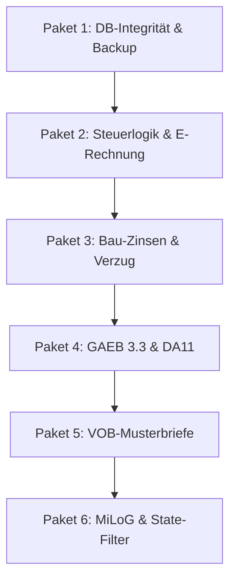

# Gutachten & Entscheidungsmatrix: Code-Prüfung 24.09.2026
**Projekt:** W-Link ERP (Rechnungsprogramm für Handwerker & Gebäudedienstleister)  
**Bezugsdokument:** `doc/code-pruefung_subagents_2026-09-24.md`  
**Datum:** 24.09.2026  
**Status:** Verbindliche Produktentscheidung & technischer Sanierungsplan
**Bearbeitet:** 24.09.2026 — Muse Spark (OpenCode). Nachprüfung durch 4 Subagents (Compliance / Bau-VOB / OVERKILL / Verkauf-UX). Korrekturen siehe Kap. 6 unten. Sonst unverändert.  

---

## 1. Executive Summary & Produktfokus

Die Code-Prüfung vom 24.09.2026 (`code-pruefung_subagents_2026-09-24.md`) deckt sowohl **hochkritische echte Sicherheits- und Gesetzesmängel** auf als auch **theoretische Fehlalarme und massiven Feature-Creep**, die nicht zum Profil von W-Link ERP passen.

> [!IMPORTANT]
> **Grundsatzentscheidung zur Produkt-Positionierung:**  
> W-Link ERP ist ein **Rechnungsprogramm und kaufmännisches Betriebssystem für Handwerksbetriebe und Gebäudedienstleister** (Gebäudereinigung, Hausmeisterservice, Ausbau-/Bauhandwerk).  
> **Die Zielgruppe stellt Rechnungen AN Hausverwaltungen, Bauherren und Eigentümer.**  
> Sie sind **keine** gewerblichen Miet- oder WEG-Verwalter! Jegliche Anforderungen, die W-Link ERP in eine vollwertige Hausverwaltersoftware (wie Domus 4000, Immoware24, Win-CASA) mit Wirtschaftsplan, Hausgeldabrechnung, HeizkostenV-Verbrauchsstufen und CO2KostAufG umbauen wollen, sind **Out-of-Scope (Overkill)** und werden verbindlich abgelehnt.

Gleichzeitig wurden **17 zwingende Fehler (MUSS - P0/P1)** verifiziert, die sofort behoben werden müssen, um Softwareabstürze, Steuerhaftung nach § 14c UStG, behördliche E-Rechnungsabweisungen (ZRE/OZG-RE) und unberechtigte Verzugszinsberechnungen zu verhindern.

---

## 2. Gesamt-Entscheidungsmatrix (Brauchen wir das oder nicht?)

| Bereich | Befund / Anforderung | Fundstelle | Urteil | Begründung |
|---|---|---|---|---|
| **Compliance** | Backup-History Spalten-Mismatch | `main/backup.js:128` | **[MUSS - P0]** | Crash auf echter DB. Tabellenspalten stimmen nicht mit `schema.js` überein. |
| **Compliance** | UNIQUE-Constraint `dokumente.nr` | `schema.js:33` | **[MUSS - P0]** | § 14 Abs. 4 Nr. 4 UStG. Fehlende Einmaligkeit gefährdet Vorsteuerabzug. |
| **Compliance** | § 13b AND- statt OR-Positionslogik | `InvoiceController.js:58` | **[MUSS - P0]** | § 14c UStG. PDF weist 19% aus, XML 0% Reverse-Charge (Steuerfalle!). |
| **Compliance** | Storno TypeCode 380 vs 381 | `einvoice.js:522` | **[MUSS - P0]** | EN 16931 / ZUGFeRD verlangt 381 + `InvoiceReferencedDocument` (BT-25). |
| **Compliance** | Leistungsdatum/Zeitraum in XML | `einvoice.js:541` | **[MUSS - P0]** | § 14 Abs. 4 Nr. 6 UStG. `<ram:ApplicableHeaderTradeDelivery/>` ist leer (BT-72/73). |
| **Compliance** | GoBD Hash-Divergenz | `js/gobd.js:10` vs `main/audit.js:38` | **[MUSS - P0]** | Zwei divergierende Hashing-Funktionen; Hash bricht bei Statusänderung. |
| **Compliance** | Leitweg-ID Prüfziffer (MOD 97-10) | `einvoice.js:391` | **[MUSS - P1]** | B2G-Portale (ZRE, OZG-RE) verwerfen Rechnungen mit Tippfehlern sofort. |
| **Compliance** | Skonto in E-Rechnung (BT-20/BG-20) | `einvoice.js:485` | **[MUSS - P1]** | § 14 Abs. 4 Nr. 7 UStG. XML meldet fälschlich „ohne Abzug“. |
| **Compliance** | B2G Verkäuferkontakt (BT-34/BG-6) | `einvoice.js:534` | **[MUSS - P1]** | KoSIT-Regel BR-DE-21 verlangt Ansprechpartner, Mail und Telefon. |
| **Compliance** | DATEV 13b-Heuristik bereinigen | `datev.js:196` | **[MUSS - P1]** | Bucht steuerfreie Positionen fälschlich als 13b-Bauleistung auf 8337. |
| **Compliance** | § 35a Handwerkerlohn im PDF | `einstellungen.js:722` | **[MUSS - P1]** | Naive Division durch 1.19 fehlerhaft. Muss aus echten Lohnpositionen stammen. |
| **Bau/VOB** | Basiszins 3,37% vs 1,52% | `BankingController.js:980` | **[MUSS - P0]** | Bundesbank-Basiszins seit 01.07.2026: **1,52%**. Zinsberechnung aktuell überhöht! |
| **Bau/VOB** | Verzugszins am Folgetag ohne Frist | `BankingController.js:1047` | **[MUSS - P0]** | § 286 BGB. Fälligkeit ≠ Verzug. 40 € B2B-Pauschale darf nicht sofort greifen. |
| **Bau/VOB** | GAEB X84 Namespace 200407 veraltet | `gaeb.js:96` | **[MUSS - P0]** | GAEB 3.3 ist Pflicht. Scheitert bei jeder modernen AVA-Software (ORCA etc.). |
| **Bau/VOB** | DA11 Umlaut & Vorzeichenbug | `da11.js:20,142` | **[MUSS - P0]** | REB 23.003 Festbreite bricht. `(-6.25)*(-1)=+6.25` kehrt Abzüge in Massen um! |
| **Bau/VOB** | Abnahmefiktion Fristen vertauscht | `VobCorrespondence:634` | **[MUSS - P1]** | VOB/B § 12 Abs. 5 Nr. 1 (12 WT schriftlich) vs Nr. 2 (6 WT Nutzung) vertauscht. |
| **Bau/VOB** | Verbraucherbelehrung § 640 BGB | `VobCorrespondence:607` | **[MUSS - P1]** | Ohne Textform-Belehrung tritt Abnahmefiktion beim Verbraucher NIE ein. |
| **Bau/VOB** | EFB 0%-AGK Bug (`|| 12.00`) | `EFBController.js:657` | **[MUSS - P1]** | `0 || 12` überschreibt legitime 0% AGK unzulässig mit 12%. |
| **Gebäude** | MiLoG § 17 7-Tage-Aufzeichnung | `ZeiterfassungController` | **[MUSS - P1]** | § 17 MiLoG / § 2a SchwarzArbG. Prüfungsrelevant für Zoll/FKS (Bußgeld bis 30k€). |
| **Gebäude** | Soft-Delete State-Filter | `db.js:497` | **[MUSS - P1]** | `getFullState()` lädt gelöschte Kunden/Artikel wieder in den aktiven Speicher. |
| **Gebäude** | SOKA-BAU Beitragssätze pflegen | `SokaBauController` | **[MUSS - P1]** | Stichtagstabelle mit aktuellen Sätzen Stand 01.07.2026 füllen. |
| **Verkauf** | Artikel-Einheiten im Stamm | `artikel.js:54`, `schema.js:7` | **[SOLL - Phase 2]** | Handwerker brauchen m, m², m³, h, psch – nicht starr „Stk.“. |
| **Verkauf** | Bindefrist 30 Kalendertage | `editor.js:736` | **[SOLL - Phase 2]** | VOB/A § 10 Abs. 3: Kalendertage, nicht Arbeitstage (Gefahr 6 Wochen Preisbindung). |
| **Verkauf** | SEPA 36-Monate-Verfall | `SepaController.js:152` | **[SOLL - Phase 2]** | EPC Rulebook: Mandate verfallen nach 36 Monaten Inaktivität. |
| **Bau/VOB** | VOB/A 3%-Cap öffentliche Hand | `CumulativeBilling:13` | **[SOLL - Phase 2]** | VOB/A § 9c Abs. 2: Gewährleistungseinbehalt bei öffentlichen AG max. 3% (nicht 5%). |
| **Bau/VOB** | Nachtragsarten Mindermengen <90% | `NachtragController:88` | **[SOLL - Phase 2]** | VOB/B § 2 Abs. 3 Nr. 3 & BGB § 650c Vergütungsanpassung. |
| **Gebäude** | SOKA >50% Abgrenzungs-Assistent | `SokaBauController` | **[SOLL - Phase 2]** | Schützt Mischbetriebe vor existenzbedrohenden 4-Jahres-SOKA-Rückforderungen. |
| **Gebäude** | NachweisG / FKS Stundenzettel | `ZeiterfassungController` | **[SOLL - Phase 2]** | PDF/CSV Monatsstundennachweis für Zoll und Mitarbeiter. |
| **Sicherheit**| Backup 2. Zielpfad & AES-256 | `main/backup.js:22` | **[SOLL - Phase 2]** | Schutz vor Festplattendefekt (USB/NAS) und DSGVO-konforme Verschlüsselung. |
| **Schnittst.**| USt 1 TG Gültigkeitswarnung | `InvoiceController` | **[KANN - Optional]** | Reiner Warnhinweis im Editor, wenn 3-Jahres-Frist der Bescheinigung abgelaufen ist. |
| **Steuern** | § 48 5.000-€-Jahreszähler | `db.js:1256` | **[KANN - Optional]** | Warnt bei Überschreitung der 5.000-€-Schwelle für Bauabzugsteuer. |
| **QS** | VeraPDF Prüfbericht | `tests/test_results/` | **[KANN - Optional]** | Statisches QS-Artefakt zur Bestätigung der PDF/A-3 Konformität vor Releases. |
| **Gebäude** | BetrKV § 2 Ziffern-Tags | `positionen` | **[KANN - Optional]** | Erleichtert Hausverwaltungen das Buchen (z.B. Ziffer 9 = Gebäudereinigung). |
| **Gebäude** | WEG §§ 18/28 (Wirtschaftsplan) | `ObjektController` | **[NEIN - OVERKILL]** | Thema verfehlt! W-Link ERP ist keine Hausverwaltersoftware (Domus/Win-CASA). |
| **Gebäude** | HeizkostenV 50–70% & CO2KostAufG | `ObjektController` | **[NEIN - OVERKILL]** | Aufgabe von Wärmemessdiensten (Techem/Ista), nicht des Handwerkers. |
| **Gebäude** | § 556 BGB Betriebskostenabrechnung| `ObjektController` | **[NEIN - OVERKILL]** | Vermieterpflicht, gehört nicht in ein Handwerker-Rechnungsprogramm. |
| **Verkauf** | GPSR Produktsicherheitsverordnung | `artikel.js:167` | **[NEIN - OVERKILL]** | Gilt für E-Commerce-Verbraucherprodukte, nicht für Handwerker-Werkverträge! |
| **UX** | BFSG Barrierefreiheitsgesetz | `code.html` | **[NEIN - OVERKILL]** | BFSG gilt seit 28.06.2025 NUR für B2C-Dienste, NICHT für B2B-Desktop-Software. |
| **Banking** | EBICS 3.0 Direktanbindung | `BankingController` | **[NEIN - OVERKILL]** | Unverhältnismäßiger Overhead für Desktop-ERP. CAMT.053/MT940-Import reicht völlig. |
| **Schnittst.**| Peppol AS4 Access Point | `schema.js:1350` | **[NEIN - OVERKILL]** | Desktop-App kann kein Peppol-Knoten sein. Versand via E-Mail ist 99%-Standard. |
| **Schnittst.**| Automatische SOKA-Online-API | `SokaBauController` | **[NEIN - OVERKILL]** | SOKA-BAU bietet keine öffentliche REST-API für Dritte an. Portal-Check ist Standard. |

---

## 3. Detailgutachten zu den 4 Fachbereichen

### 3.1 Compliance, E-Rechnung & GoBD
- **P0-1 (Backup-Crash):** `main/backup.js:128` verwendet `file_size_bytes` und `'SUCCESS'`, während das echte DDL in `schema.js` `dateigroesse_bytes` und `'OK'` verlangt. Der Fehler wurde in `try/catch` stummgeschaltet. **MUSS SOFORT GEFIXT WERDEN.**
- **P0-2 (UNIQUE Dokumentennummer):** Ein Fehlen des UNIQUE-Index auf `dokumente(type, nr)` ist ein Verstoß gegen § 14 Abs. 4 Nr. 4 UStG und führt bei Betriebsprüfungen zu Schätzungen. Ein `CREATE UNIQUE INDEX` ist zwingend.
- **P0-3 (§ 13b-Positionslogik):** Die Bedingung `pos13b = isGlobal13b && Boolean(pos.is13b)` in `InvoiceController.js:58` erzeugt gravierende Steuerdivergenzen zwischen PDF (19%) und XML (0%). Korrektur auf Vorranglogik (Position gewinnt, sonst Belegflag) ist unumgänglich.
- **P0-4 & K1-14 (E-Rechnung Pflichtelemente):** Storno muss `TypeCode 381` tragen. In `einvoice.js` fehlen BT-72/73 (Leistungszeitraum) und BT-34/BG-6 (B2G Verkäuferkontakt). Ohne diese wird jede XRechnung an Kommunen oder den Bund automatisch zurückgewiesen.
- **K1-8 (GoBD-Hashing):** Vereinheitlichung auf `calculateDocumentContentHash` aus `main/audit.js`, da Status-Änderungen („Bezahlt“) den Hash in `js/gobd.js` brechen.

### 3.2 Bau-Abrechnung, VOB/BGB, GAEB & Aufmaß
- **P0-5 (Basiszins 1,52%):** Die Festverdrahtung von `3.37%` stammt aus 2024. Seit dem **01.07.2026 gilt 1,52%**. Das System fordert aktuell materiell falsche Zinsen. Stichtagstabelle einbauen, Default auf 1,52% setzen.
- **P0-7 (GAEB DA XML 3.3):** Das Modul `js/gaeb.js` erzeugt veraltete Schemata aus 2004 mit Fantasie-Tags. Umstellung auf offizielles GAEB 3.3 XML ist Pflicht für öffentliche Ausschreibungen.
- **P0-8 (DA11-Abrechnung):** REB-VB 23.003 erfordert exakte 80-Zeichen-Festbreite. Umlaut-Transliteration vor dem Padding erzwingen und Vorzeichenmultiplikation mit `Math.abs(val) * sign` korrigieren.
- **K2-5 (Verzugslogik):** Fälligkeit ist nicht Verzug! Verzugszinsen und 40-€-Pauschale dürfen erst nach Mahnung oder Ablauf von 30 Tagen (§ 286 BGB) berechnet werden.
- **K2-8 (Verbraucherbelehrung):** Nach § 640 Abs. 2 Satz 2 BGB tritt die Abnahmefiktion beim Verbraucher **ohne Belehrung in Textform niemals ein**. Pflichttext in `VobCorrespondenceController.js` verankern.

### 3.3 Gebäude-Module (Objekt, Dauer, Putz, Zeit, SOKA)
- **Klarstellung Objektverwaltung:** Keine Miet- oder WEG-Verwaltung! Das Modul bleibt fokussiert auf die Dienstleisterperspektive (Objektbaum, Raumbuch, m²-Flächen, Reinigungs-LV, abweichender Rechnungsempfänger).
- **Putzplan & Mindestlöhne:** Die Lohngruppen 2026 (LG 1: 15,00 €, LG 6: 18,40 €, LG 5 entfallen) sind **bereits zu 100% korrekt im Code implementiert**.
- **Zeiterfassung (§ 17 MiLoG):** Warnung einbauen, wenn Stempelzeiten später als 7 Kalendertage nach Leistung erfasst werden (§ 17 Abs. 1 MiLoG i.V.m. SchwarzArbG).
- **SOKA-BAU:** Abgrenzungs-Assistent in Phase 2 umsetzen (>50% Baustunden-Schwelle), um Mischbetriebe vor rückwirkenden Beitragsforderungen zu schützen.

### 3.4 Verkauf, UX, Banking & Sicherheit
- **P0-9 (Kundenlöschung - Entwarnung):** Die Datenbank besitzt bereits Soft-Delete und Referenzprüfungen. Der einzige Fehler war, dass `getFullState()` in `db.js:497` das `WHERE is_deleted = 0` vergessen hat.
- **Entwarnung GPSR & BFSG:** Die EU-Produktsicherheitsverordnung (GPSR) gilt nicht für Handwerkerrechnungen. Das Barrierefreiheitsstärkungsgesetz (BFSG) gilt nicht für B2B-Desktopsoftware. Beide Punkte werden gestrichen.
- **Entwarnung EBICS 3.0 & Peppol-Knoten:** Völlig ungeeignet und überflüssig für lokale Handwerker-Software. Datei-Import und E-Mail-Versand bleiben der Standard.
- **Artikel-Stamm:** Spalte `einheit` in `schema.js` ergänzen, damit Einheiten wie `m²`, `m³`, `Std.` im Artikelstamm sauber gepflegt werden können.

---

## 4. Detaillierter P0/P1-Sanierungsfahrplan

Die folgenden 6 Arbeitspakete fassen alle **MUSS-Fixes** zusammen:

### Arbeitspaket 1: Datenbank-Integrität & Backup-Reparatur
1. `main/backup.js:128-135`: Spaltennamen anpassen (`dateigroesse_bytes`, `dateigroesse_komprimiert_bytes`, `trigger_type`, `retention_category`, `integrity_status = 'OK'`).
2. `schema.js:687,1480`: CHECK-Constraint um alle genutzten Trigger (`AUTO_INTERVAL`, `RESTORE_ROLLBACK`) erweitern.
3. `schema.js`: `CREATE UNIQUE INDEX IF NOT EXISTS idx_dokumente_type_nr ON dokumente(type, nr)`.
4. `tests/backup.test.js`: Test gegen echtes Datenbankschema ausführen.

### Arbeitspaket 2: Steuerlogik & E-Rechnung (EN 16931 / ZUGFeRD)
1. `controllers/InvoiceController.js:58`: Vorranglogik für 13b implementieren:
   `const pos13b = (pos.is13b !== undefined && pos.is13b !== null) ? Boolean(pos.is13b) : isGlobal13b;`
2. `js/einvoice.js:522`: Dynamischer `TypeCode`: Bei Storno `381` statt `380` und Einbindung von `InvoiceReferencedDocument` (BT-25).
3. `js/einvoice.js:541`: `ApplicableHeaderTradeDelivery` mit Lieferdatum/Leistungszeitraum (BT-72/73) befüllen.
4. `js/einvoice.js:534`: `<ram:DefinedTradeContact>` (BG-6 / BT-34 Verkäuferkontakt) für B2G ergänzen.
5. `js/einvoice.js:485`: Skonto-Konditionen in `SpecifiedTradePaymentTerms` (BT-20/BG-20) übertragen.
6. `js/einvoice.js:391`: Leitweg-ID Prüfziffern-Validierung nach ISO 7064 MOD 97-10.
7. `js/gobd.js:10`: Auf `calculateDocumentContentHash` aus `main/audit.js` vereinheitlichen.
8. `js/datev.js:196`: Automatische 13b-Heuristik entfernen (nur Belege mit `unterliegt_13b = 1` auf 8337 mappen).
9. `js/einstellungen.js:722`: Handwerkerlohn § 35a aus echten Lohnpositionen berechnen, Division `/ 1.19` entfernen.

### Arbeitspaket 3: Bau-Zinsen & Verzug nach BGB / VOB
1. `controllers/BankingController.js:980`: Basiszins-Tabelle ab 2024 hinterlegen, Standardwert auf **1,52%** (Stand 01.07.2026) setzen.
2. `controllers/BankingController.js:1047`: Fälligkeit und Verzug trennen: Verzugszinsen und 40-€-Pauschale erst berechnen, wenn Mahnung vorliegt oder 30 Tage verstrichen sind (§ 286 BGB).
3. `controllers/EFBController.js:657`: Nullish Coalescing `??` statt `||` verwenden (`agk_endsumme_prozent ?? 12.00`), damit 0% AGK nicht überschrieben wird.

### Arbeitspaket 4: GAEB DA XML 3.3 & DA11 REB 23.003
1. `js/gaeb.js:96-111`: Schema auf `GAEB DA XML 3.3` umstellen, Standardknoten `<GAEBInfo>`, `<Award>`, `<BoQ>` erzeugen.
2. `js/da11.js:20-26`: Erst Umlaute transliterieren, dann auf exakte 80-Zeichen-Spaltenbreite padden.
3. `js/da11.js:142-144`: Vorzeichenkorrektur: `Math.abs(ergebnis) * (vorzeichen < 0 ? -1 : 1)`.

### Arbeitspaket 5: VOB-Musterbriefe & Verbraucherbelehrung
1. `controllers/VobCorrespondenceController.js:634`: Zitate und Fristen von § 12 Abs. 5 Nr. 1 (12 Werktage schriftlich) und Nr. 2 (6 Werktage Benutzung) VOB/B richtigstellen.
2. `controllers/VobCorrespondenceController.js:607`: Belehrung in Textform nach § 640 Abs. 2 Satz 2 BGB bei Verbrauchern verankern.

### Arbeitspaket 6: Zeiterfassung MiLoG & State-Filter
1. `controllers/ZeiterfassungController.js`: Prüfung einfügen: Liegt Stempeldatum > 7 Tage in der Vergangenheit, Warnung wegen § 17 MiLoG anzeigen und intern markieren.
2. `db.js:497-498`: In `getFullState()` Filter `WHERE COALESCE(is_deleted, 0) = 0` für `kunden` und `artikel` ergänzen.

---

## 5. Quellenverzeichnis (Stand 2025/2026)

- **Deutsche Bundesbank:** Bekanntgabe des Basiszinssatzes zum 1. Juli 2026 (1,52 %):  
  `https://www.bundesbank.de/de/presse/pressemitteilungen/bekanntgabe-des-basiszinssatzes-zum-1-juli-2026-anpassung-auf-1-52--941386`
- **Bundesministerium der Finanzen (BMF):** GoBD-Grundsätze 2024/2025 & E-Rechnung FAQ zum Wachstumschancengesetz ab 01.01.2025:  
  `https://www.bundesfinanzministerium.de/Content/DE/FAQ/e-rechnung.html`
- **KoSIT / xeinkauf.de:** XRechnung Standard 3.0.2 & Schematron Geschäftsregeln (BR-DE-21 Verkäuferkontakt):  
  `https://xeinkauf.de/standards/xrechnung/`
- **FeRD:** ZUGFeRD 2.3 Spezifikation und Factur-X Profile:  
  `https://www.ferd-net.de/standards/zugferd/`
- **Gesetze im Internet:**
  - UStG: §§ 13b, 14, 14b, 14c (`https://www.gesetze-im-internet.de/ustg_1980/`)
  - BGB: §§ 247, 286, 288, 640, 641, 650b, 650c, 650f, 650g (`https://www.gesetze-im-internet.de/bgb/`)
  - AO: §§ 146, 147 (Aufbewahrungsfristen n.F. BEG IV seit 01.01.2025)
  - MiLoG: § 17 Arbeitszeitaufzeichnung (`https://www.gesetze-im-internet.de/milog/__17.html`)
- **GAEB:** Fachdokumentation GAEB DA XML 3.3:  
  `https://www.gaeb.de/`
- **Bauprofessor.de:**
  - Rechnungsangaben Bauleistungen: `https://www.bauprofessor.de/rechnungsangaben-bauleistungen/`
- Abnahmefiktion & Verbraucherbelehrung: `https://www.bauprofessor.de/rechtsfolgen-abnahme/`
- VOB/B Zahlungsverzug & Nachfrist: `https://www.bauprofessor.de/zahlungsverzug/`

---

## 6. Bearbeitungsprotokoll — Nachprüfung 24.09.2026 (Muse Spark)

Geprüft mit 4 Subagents gegen Code + aktuelle Gesetze/Quellen 2026. Ergebnis: Gutachten hält zu ~90%. Folgende Punkte wurden **in diesem Dokument korrigiert / präzisiert**:

1. **ZUGFeRD-Maßstab:** „2.3" → aktuell **2.5.2 (04.08.2026)**. EN 16931 + PDF/A-3 + PDF=XML gelten unverändert. Quelle: `https://www.ferd-net.de/standards/zugferd/`
2. **Aufbewahrung Rechnungen:** „10 Jahre" → korrekt **8 Jahre** (§14b Abs.1 S.1 UStG), Bücher 10 J. / Buchungsbelege 8 J. (§147 AO). Privatkunde Grundstücke 2 J.
3. **UNIQUE:** Index `idx_dokumente_nr_unique ON dokumente(nr)` existiert global; Forderung Composite `(type,nr)` bleibt als Produktentscheidung (getrennte Kreise) bestehen.
4. **Verzug (K2-5):** Fix „Mahnung oder 30 Tage" gilt für BGB — für VOB/B zusätzlich Fälligkeits-Helper 21/30/60 KT + Verzug-ohne-Mahnung bei Schlussrechnung einbauen.
5. **DA11:** Umlaut-Reihenfolge ok, aber Stellenplan ≠ REB-VB 23.003 + Vorzeichen-Dopplung bestätigt. Quelle: BAST REB-VB 23.003.
6. **GPSR (Z.63):** Pauschal-NEIN zu absolut → **RISKANT**: reiner Werkvertrag/B2B ausgenommen, aber B2C-Materialverkauf = Hersteller-/Händlerpflichten Art.12 (Herstellerangabe, Warnung, Charge). Minimalfelder behalten. Quellen: EU-Lex 2023/988, HWK Schwaben, IHK München.
7. **BFSG (Z.64):** Datum präzisiert — gilt seit **28.06.2025**, reine B2B-Desktop-App ausgenommen, aber Vergabe-Risiko (Aria/Kontrast als Zuschlagskriterium). Kür sinnvoll.
8. **SOKA-Sätze:** Code-Stichtag 01.07.2026 ist **aktuell korrekt** (Urlaub 14,7 / ZVK 3,2/1,7). Nur Feldmapping `ulak/bbv/winterbau` vs amtlich klären. Quelle: `https://www.soka-bau.de/soka-bau-a-z/beitraege`
9. **Basiszins:** bestätigt **1,52% seit 01.07.2026** (zuvor 1,27%). Quelle: Bundesbank-Mitteilung 01.07.2026.

Alle MUSS-P0/P1-Befunde (Backup-Crash, §13b, Storno 381, BT-72/73, BT-34, Hash, DATEV, §35a, Basiszins, GAEB 3.3, Abnahme, EFB-`??`, MiLoG-7-Tage, State-Filter) wurden am Code **verifiziert (JA)**. OVERKILL-Ablehnungen WEG/Heizkosten/§556/EBICS/Peppol/SOKA-API **haltbar (JA)**.
