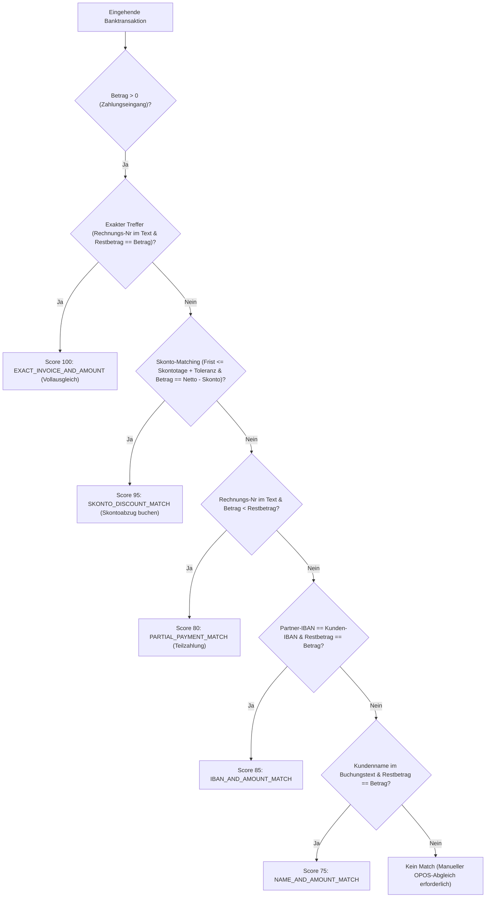
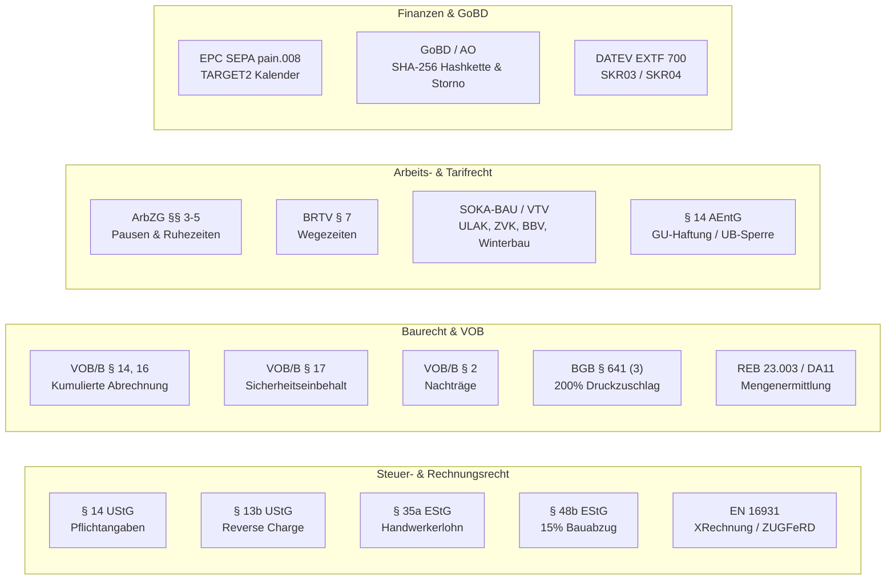

# Gesetzesgrundlagen, Normen & mathematische Rechnungswege im Bau- und Handwerker-ERP

> **System-Referenzdokumentation für Wirtschaftsprüfer, Steuerberater, Baujuristen und Software-Architekten**  
> **System:** W-LINK ERP / Rechnungsprogramm_Geb_V2  
> **Stand:** Wirtschaftsjahr 2026 / 2027 (Stand: 01.09.2026)  
> **Gültigkeit:** Deutsches Bau-, Steuer-, Arbeits- und Handelsrecht (VOB, VHB Bund, UStG, EStG, ArbZG, GoBD, SOKA-BAU, SEPA, EN 16931)

---

## Inhaltsverzeichnis

1. [Umsatzsteuer- und Rechnungslegungsrecht (UStG)](#1-umsatzsteuer--und-rechnungslegungsrecht-ustg)
   - [1.1 § 14 UStG: Gesetzliche Pflichtangaben auf Rechnungen](#11--14-ustg-gesetzliche-pflichtangaben-auf-rechnungen)
   - [1.2 § 13b UStG: Steuerschuldnerschaft des Leistungsempfängers (Reverse-Charge)](#12--13b-ustg-steuerschuldnerschaft-des-leistungsempfängers-reverse-charge)
   - [1.3 § 19 UStG: Besteuerung der Kleinunternehmer](#13--19-ustg-besteuerung-der-kleinunternehmer)
   - [1.4 Wachstumschancengesetz, E-Rechnung & EN 16931 (XRechnung 3.0 / ZUGFeRD 2.3)](#14-wachstumschancengesetz-e-rechnung--en-16931-xrechnung-30--zugferd-23)
2. [Einkommensteuerrecht & Steuerabzug (EStG)](#2-einkommensteuerrecht--steuerabzug-estg)
   - [2.1 § 35a EStG: Steuerermäßigung bei Handwerkerleistungen & haushaltsnahen Dienstleistungen](#21--35a-estg-steuerermäßigung-bei-handwerkerleistungen--haushaltsnahen-dienstleistungen)
   - [2.2 §§ 48, 48a, 48b EStG: Bauabzugsteuer & Freistellungsbescheinigung](#22--48-48a-48b-estg-bauabzugsteuer--freistellungsbescheinigung)
3. [Baurecht, VOB/B, BGB & Vergabehandbuch Bund (VHB)](#3-baurecht-vobb-bgb--vergabehandbuch-bund-vhb)
   - [3.1 Kumulierte Abschlags- und Schlussrechnungen (VOB/B § 14, § 16 & BGB § 632a)](#31-kumulierte-abschlags--und-schlussrechnungen-vobb--14--16--bgb--632a)
   - [3.2 Sicherheitseinbehalte (§ 17 VOB/B & § 650m BGB)](#32-sicherheitseinbehalte--17-vobb--650m-bgb)
   - [3.3 Nachtragsmanagement (VOB/B § 2 Abs. 3, 5, 6, 8 & BGB § 650b)](#33-nachtragsmanagement-vobb--2-abs-3-5-6-8--bgb--650b)
   - [3.4 Mängelkataster, Fristenmanagement & Druckzuschlag (VOB/B §§ 12, 13 & BGB § 641 Abs. 3)](#34-mängelkataster-fristenmanagement--druckzuschlag-vobb--12-13--bgb--641-abs-3)
   - [3.5 Bautagebuch, Abnahmeprotokoll & Bedenkenanzeigen (VOB/B §§ 4, 6, 12)](#35-bautagebuch-abnahmeprotokoll--bedenkenanzeigen-vobb--4-6-12)
4. [Baubetriebliche Kalkulation (VHB 2024/2026, KLR Bau, KAS)](#4-baubetriebliche-kalkulation-vhb-20242026-klr-bau-kas)
   - [4.1 Mittellohn, Kalkulationslohn & Verrechnungslohn](#41-mittellohn-kalkulationslohn--verrechnungslohn)
   - [4.2 EFB-Preis 221: Preisermittlung bei Zuschlagskalkulation](#42-efb-preis-221-preisermittlung-bei-zuschlagskalkulation)
   - [4.3 EFB-Preis 222: Endsummenkalkulation (Umlageverfahren)](#43-efb-preis-222-endsummenkalkulation-umlageverfahren)
   - [4.4 EFB-Preis 223: Aufgliederung der Einheitspreise & Mathematische Verprobung](#44-efb-preis-223-aufgliederung-der-einheitspreise--mathematische-verprobung)
   - [4.5 Mehrstufige Deckungsbeitragsrechnung & Soll-Ist-Nachkalkulation](#45-mehrstufige-deckungsbeitragsrechnung--soll-ist-nachkalkulation)
5. [Aufmaß nach REB 23.003 & Mengendokumentation (GAEB DA XML / DA11)](#5-aufmaß-nach-reb-23003--mengendokumentation-gaeb-da-xml--da11)
   - [5.1 REB-VB 23.003 Mathematischer Formelkatalog](#51-reb-vb-23003-mathematischer-formelkatalog)
   - [5.2 DA11-Schnittstelle (80-Zeichen Fixed-Width)](#52-da11-schnittstelle-80-zeichen-fixed-width)
   - [5.3 GAEB DA XML 3.3 Datenaustauschphase X31](#53-gaeb-da-xml-33-datenaustauschphase-x31)
6. [Arbeitsrecht, Mindestlohn & SOKA-BAU / BRTV Bau](#6-arbeitsrecht-mindestlohn--soka-bau--brtv-bau)
   - [6.1 Arbeitszeitgesetz (ArbZG §§ 3, 4, 5) & BAG-Beschluss 2022](#61-arbeitszeitgesetz-arbzg--3-4-5--bag-beschluss-2022)
   - [6.2 BRTV § 7: Tarifliche Wegezeitentschädigung](#62-brtv--7-tarifliche-wegezeitentschädigung)
   - [6.3 SOKA-BAU / BRTV & VTV Meldedaten-Engine (ULAK, ZVK, BBV, Winterbau)](#63-soka-bau--brtv--vtv-meldedaten-engine-ulak-zvk-bbv-winterbau)
   - [6.4 Generalunternehmerhaftung (§ 14 AEntG & § 1a SchwarzArbG)](#64-generalunternehmerhaftung--14-aentg--1a-schwarzarbg)
7. [Gebäudereinigung (RTV Gebäudereinigung & 10. GebäudeArbbV)](#7-gebäudereinigung-rtv-gebäudereinigung--10-gebäudearbbv)
   - [7.1 Tarifliche Mindestlöhne (LG 1 & LG 6)](#71-tarifliche-mindestlöhne-lg-1--lg-6)
   - [7.2 Erschwernis- & Zeitzuschläge](#72-erschwernis---zeitzuschläge)
   - [7.3 Turnus-Mathematik & Flächenkalkulation](#73-turnus-mathematik--flächenkalkulation)
8. [Zahlungsverkehr, SEPA & Bankabgleich (EPC SEPA & ISO 20022)](#8-zahlungsverkehr-sepa--bankabgleich-epc-sepa--iso-20022)
   - [8.1 SEPA Direct Debit (pain.008.001.08 & pain.008.001.02)](#81-sepa-direct-debit-pain00800108--pain00800102)
   - [8.2 TARGET2-Bankarbeitstage & Gauß/Meeus-Osterformel](#82-target2-bankarbeitstage--gaußmeeus-osterformel)
   - [8.3 Prüfziffernverfahren: IBAN (ISO 13616) & Gläubiger-ID (ISO 7064)](#83-prüfziffernverfahren-iban-iso-13616--gläubiger-id-iso-7064)
   - [8.4 Elektronischer Kontoauszug (CAMT.053 / CAMT.052 / MT940 / CSV) & OPOS-Matching](#84-elektronischer-kontoauszug-camt053--camt052--mt940--csv--opos-matching)
9. [GoBD, DATEV & Zivilrecht (BGB / HGB / AO)](#9-gobd-datev--zivilrecht-bgb--hgb--ao)
   - [9.1 GoBD: Unveränderbarkeit, Stornorechnung & SHA-256 Hash-Kettung](#91-gobd-unveränderbarkeit-stornorechnung--sha-256-hash-kettung)
   - [9.2 DATEV EXTF Format 700 (SKR03 / SKR04 Kontenrahmen)](#92-datev-extf-format-700-skr03--skr04-kontenrahmen)
   - [9.3 BGB §§ 286, 288: Zahlungsverzug, Verzugszinsen & Mahnstufen](#93-bgb--286-288-zahlungsverzug-verzugszinsen--mahnstufen)
   - [9.4 Skonto-Berechnung nach § 247 BGB](#94-skonto-berechnung-nach--247-bgb)

---

# 1. Umsatzsteuer- und Rechnungslegungsrecht (UStG)

## 1.1 § 14 UStG: Gesetzliche Pflichtangaben auf Rechnungen

### 1.1.1 Rechtlicher Zweck & Geltungsbereich
Gemäß § 14 Abs. 4 i.V.m. § 14a UStG muss jede Rechnung zwingend bestimmte Mindestangaben enthalten, um dem Leistungsempfänger den Vorsteuerabzug nach § 15 Abs. 1 Nr. 1 UStG zu ermöglichen. Das System erzwingt die Vollständigkeit dieser Daten vor der Belegfestschreibung.

### 1.1.2 Relevante Datenbankfelder
- `dokumente.nr`: Fortlaufende, einmalige Rechnungsnummer (§ 14 Abs. 4 Nr. 4 UStG)
- `dokumente.datum`: Ausstellungsdatum (§ 14 Abs. 4 Nr. 3 UStG)
- `dokumente.leistungszeitraum_von`, `dokumente.leistungszeitraum_bis`: Zeitpunkt/Zeitraum der Leistung (§ 14 Abs. 4 Nr. 6 UStG)
- `dokumente.netto`, `dokumente.steuer`, `dokumente.brutto`: Aufschlüsselung nach Steuersätzen (§ 14 Abs. 4 Nr. 8 UStG)
- `kunden.kundennummer`, `kunden.name`, `kunden.adresse`, `kunden.plz`, `kunden.ort`, `kunden.ustId`: Vollständiger Name und Anschrift des Leistungsempfängers (§ 14 Abs. 4 Nr. 1 UStG)
- `einstellungen.key` (`firmenname`, `steuernummer`, `ustId`, `iban`, `bic`): Daten des leistenden Unternehmers (§ 14 Abs. 4 Nr. 2 UStG)

### 1.1.3 Mathematischer Rechnungsweg & Rundungsvorschriften
Alle Zwischensummen und Zeilenbeträge werden kaufmännisch auf 2 Dezimalstellen (Cent) gerundet. Zur Vermeidung von Fließkomma-Ungenauigkeiten wird `Number.EPSILON` eingesetzt:

$$\text{round2}(x) = \frac{\lfloor (x + \varepsilon) \cdot 100 + 0,5 \rfloor}{100}$$

#### Zeilenberechnung:
$$\text{Netto}_{\text{Zeile}} = \text{round2}\left( \text{Menge} \cdot \text{Einzelpreis} \cdot \left(1 - \frac{\text{Rabatt}_{\%}}{100}\right) \right)$$
$$\text{Steuer}_{\text{Zeile}} = \text{round2}\left( \text{Netto}_{\text{Zeile}} \cdot \frac{\text{MwSt}_{\%}}{100} \right)$$
$$\text{Brutto}_{\text{Zeile}} = \text{Netto}_{\text{Zeile}} + \text{Steuer}_{\text{Zeile}}$$

#### Steuerbasisgruppen-Berechnung (Kopfebene nach Globalrabatt):
$$\text{Rabattfaktor} = \begin{cases} \frac{\text{Netto}_{\text{Gesamt}} - \text{Globalrabatt}}{\text{Netto}_{\text{Gesamt}}} & \text{wenn } \text{Netto}_{\text{Gesamt}} > 0 \\ 1 & \text{sonst} \end{cases}$$
$$\text{Steuerbasis}_{19\%} = \text{round2}\left( \sum \text{Netto}_{\text{Zeile}, 19\%} \cdot \text{Rabattfaktor} \right)$$
$$\text{Steuer}_{19\%} = \text{round2}\left( \text{Steuerbasis}_{19\%} \cdot 0,19 \right)$$
$$\text{Steuerbasis}_{7\%} = \text{round2}\left( \sum \text{Netto}_{\text{Zeile}, 7\%} \cdot \text{Rabattfaktor} \right)$$
$$\text{Steuer}_{7\%} = \text{round2}\left( \text{Steuerbasis}_{7\%} \cdot 0,07 \right)$$
$$\text{Gesamtsteuer} = \text{Steuer}_{19\%} + \text{Steuer}_{7\%}$$
$$\text{Rechnungsbrutto} = \text{Netto}_{\text{nach Rabatt}} + \text{Gesamtsteuer}$$

### 1.1.4 Konkretes Rechenbeispiel

| Position | Bezeichnung | Menge | Einheit | Einzelpreis | Rabatt | Netto | MwSt | Steuer | Brutto |
|---|---|---|---|---|---|---|---|---|---|
| 1 | Wandfliesen verlegen | 45,00 | m² | 65,00 € | 5,00 % | 2.778,75 € | 19 % | 527,96 € | 3.306,71 € |
| 2 | Fachliteratur BauGB | 2,00 | Stk. | 40,00 € | 0,00 % | 80,00 € | 7 % | 5,60 € | 85,60 € |
| **Summe Positionen** | | | | | | **2.858,75 €** | | **533,56 €** | **3.392,31 €** |

- **Globalrabatt (3 %):** $2.858,75\ \text{€} \cdot 0,03 = 85,76\ \text{€}$
- **Netto nach Rabatt:** $2.858,75\ \text{€} - 85,76\ \text{€} = 2.772,99\ \text{€}$
- **Rabattfaktor:** $\frac{2.772,99}{2.858,75} \approx 0,969999125$
- **Steuerbasis 19 %:** $\text{round2}(2.778,75\ \text{€} \cdot 0,969999125) = 2.695,39\ \text{€} \implies \text{MwSt} = 2.695,39\ \text{€} \cdot 0,19 = 512,12\ \text{€}$
- **Steuerbasis 7 %:** $\text{round2}(80,00\ \text{€} \cdot 0,969999125) = 77,60\ \text{€} \implies \text{MwSt} = 77,60\ \text{€} \cdot 0,07 = 5,43\ \text{€}$
- **Gesamtsteuer:** $512,12\ \text{€} + 5,43\ \text{€} = 517,55\ \text{€}$
- **Endbrutto:** $2.772,99\ \text{€} + 517,55\ \text{€} = 3.290,54\ \text{€}$

### 1.1.5 Code-Referenz
- [`controllers/InvoiceController.js:11-194`](file:///F:/server/Rechnungsprogramm_Geb_V2/controllers/InvoiceController.js#L11-L194) (`InvoiceController.calculateTotals`)
- [`js/einvoice.js:24-26, 120-180`](file:///F:/server/Rechnungsprogramm_Geb_V2/js/einvoice.js#L120-L180) (`EInvoiceEngine.computeTotals`)

---

## 1.2 § 13b UStG: Steuerschuldnerschaft des Leistungsempfängers (Reverse-Charge)

### 1.2.1 Rechtlicher Zweck & Geltungsbereich
Gemäß § 13b Abs. 2 Nr. 4 UStG (Bauleistungen) und § 13b Abs. 2 Nr. 8 UStG (Gebäudereinigung) geht die Steuerschuldnerschaft auf den Leistungsempfänger über, sofern dieser selbst ein Unternehmer ist, der Bau- bzw. Reinigungsleistungen erbringt (§ 13b Abs. 5 UStG).
Nach § 14a Abs. 5 UStG ist die Rechnung ohne Umsatzsteuer auszustellen, muss jedoch zwingend die Angabe „Steuerschuldnerschaft des Leistungsempfängers“ enthalten.

### 1.2.2 Relevante Datenbankfelder
- `dokumente.unterliegt_13b`: Flag (1/0) für globale 13b-Abrechnung
- `positionen.is13b`: Positionsindividuelles 13b-Flag
- `kunden.ist_bauleistender_13b`: Kunde erbringt selbst Bauleistungen
- `kunden.ust_1_tg_gueltig_bis`: Gültigkeitsdatum des Vordrucks USt 1 TG (Nachweis der Bauleistereigenschaft)
- `kunden.customer_type`: Muss 'B2B' sein

### 1.2.3 Mathematischer Rechnungsweg
$$\text{MwSt}_{\text{Zeile}} = 0,00\ \text{€} \quad (\text{wenn } \text{is13b} = 1)$$
$$\text{Brutto}_{\text{Zeile}} = \text{Netto}_{\text{Zeile}}$$
$$\text{Gesamtsteuer}_{\text{Beleg}} = 0,00\ \text{€}$$
$$\text{Rechnungsbrutto} = \text{Rechnungsnetto}$$

### 1.2.4 Konkretes Rechenbeispiel
Rohbauarbeiten B2B an Generalunternehmer (USt 1 TG liegt vor):
- **Position 1 (Mauerwerk):** 100 m² à 120,00 € = 12.000,00 € Netto $\implies \text{MwSt} = 0,00\ \text{€}$
- **Position 2 (Betonstützen):** 8 Stk. à 450,00 € = 3.600,00 € Netto $\implies \text{MwSt} = 0,00\ \text{€}$
- **Rechnungssumme Netto:** $15.600,00\ \text{€}$
- **Ausgewiesene Umsatzsteuer:** $0,00\ \text{€}$
- **Zahlbetrag Brutto:** $15.600,00\ \text{€}$
- **Pflichthinweis auf Beleg:** *„Steuerschuldnerschaft des Leistungsempfängers (Reverse Charge) gemäß § 13b UStG.“*

### 1.2.5 Code-Referenz
- [`controllers/InvoiceController.js:45, 53, 58, 70`](file:///F:/server/Rechnungsprogramm_Geb_V2/controllers/InvoiceController.js#L45-L70)
- [`controllers/SubcontractorController.js:67-75`](file:///F:/server/Rechnungsprogramm_Geb_V2/controllers/SubcontractorController.js#L67-L75) (`SubcontractorController.validateReverseCharge`)
- [`js/einvoice.js:8, 105-114, 396-398`](file:///F:/server/Rechnungsprogramm_Geb_V2/js/einvoice.js#L396-L398) (`ExemptionReasonCode: VATEX-EU-AE`)
- [`js/datev.js:42-45`](file:///F:/server/Rechnungsprogramm_Geb_V2/js/datev.js#L42-L45) (Steuerschlüssel BU 19 bei SKR03 bzw. BU 68 bei SKR04, Erlöskonto 8337/4337)

---

## 1.3 § 19 UStG: Besteuerung der Kleinunternehmer

### 1.3.1 Rechtlicher Zweck & Geltungsbereich
Umsatzsteuer wird von Unternehmern nicht erhoben, wenn der Umsatz im vorangegangenen Kalenderjahr 22.000 € (ab 2025: 25.000 € gem. Wachstumschancengesetz) nicht überstiegen hat und im laufenden Kalenderjahr 50.000 € (ab 2025: 100.000 €) voraussichtlich nicht übersteigen wird. Auf Rechnungen darf keine Umsatzsteuer gesondert ausgewiesen werden (§ 19 Abs. 1 Satz 4 UStG).

### 1.3.2 Mathematischer Rechnungsweg
$$\forall i: \text{MwSt}_{\text{Satz}, i} = 0\% \implies \text{Steuer}_{\text{Gesamt}} = 0,00\ \text{€}$$
$$\text{Brutto} = \text{Netto}$$
Pflichthinweis: *„Gemäß § 19 UStG wird keine Umsatzsteuer berechnet.“*

---

## 1.4 Wachstumschancengesetz, E-Rechnung & EN 16931 (XRechnung 3.0 / ZUGFeRD 2.3)

### 1.4.1 Rechtlicher Zweck & Geltungsbereich
Mit dem Wachstumschancengesetz gilt ab dem **01.01.2025** eine grundsätzliche Pflicht zum Empfang und ab 2026–2028 zur Ausstellung elektronischer Rechnungen im B2B-Bereich. Die E-Rechnung muss dem semantischen Datenmodell der europäischen Norm **EN 16931-1** entsprechen:
- **XRechnung 2.3 / 3.0.2:** Reines XML-Format (CII `urn:un:unece:uncefact:data:standard:CrossIndustryInvoice:100` oder UBL Invoice).
- **ZUGFeRD 2.2 / 2.3 / Factur-X 1.0:** Hybrides Format (PDF/A-3 mit eingebetteter `factur-x.xml`).

### 1.4.2 BT-Knoten-Mapping & UN/ECE Rec 20 Einheiten
Das System bildet die Geschäftsdatenfelder auf Business Terms (BT) und Business Groups (BG) ab:

| Business Term / Group | EN 16931 Feldname | Datenbank-/Systemfeld | XML-Tag / Pfad |
|---|---|---|---|
| **BT-1** | Invoice Number | `dokumente.nr` | `rsm:ExchangedDocument/ram:ID` |
| **BT-2** | Issue Date | `dokumente.datum` | `rsm:ExchangedDocument/ram:IssueDateTime` (Format 102: YYYYMMDD) |
| **BT-3** | Invoice Type Code | `380` (Rechnung) / `381` (Gutschrift) | `rsm:ExchangedDocument/ram:TypeCode` |
| **BT-9** | Due Date | `dokumente.faellig` | `ram:SpecifiedTradePaymentTerms/ram:DueDateDateTime` |
| **BT-10** | Buyer Reference | `dokumente.leitweg_id` \|\| `kunden.buyer_reference` | `ram:BuyerOrderReferencedDocument/ram:IssuerAssignedID` |
| **BT-27** | Seller Name | `einstellungen.firmenname` | `ram:SellerTradeParty/ram:Name` |
| **BT-31** | Seller VAT Identifier | `einstellungen.ustId` | `ram:SpecifiedTaxRegistration/ram:ID[@schemeID='VA']` |
| **BT-32** | Seller Tax Registration | `einstellungen.steuernummer` | `ram:SpecifiedTaxRegistration/ram:ID[@schemeID='FC']` |
| **BT-44** | Buyer Name | `kunden.name` | `ram:BuyerTradeParty/ram:Name` |
| **BT-130** | Invoiced Quantity Unit Code | `positionen.einheit` | `ram:BilledQuantity/@unitCode` |
| **BG-5** | Seller Postal Address | `einstellungen` (Strasse, PLZ, Ort, Land) | `ram:SellerTradeParty/ram:PostalTradeAddress` |
| **BG-8** | Buyer Postal Address | `kunden` (Strasse, PLZ, Ort, Land) | `ram:BuyerTradeParty/ram:PostalTradeAddress` |
| **BG-16** | Payment Instructions | `einstellungen` (IBAN, BIC, Bankname) | `ram:SpecifiedTradeSettlementPaymentMeans` |
| **BG-23** | VAT Breakdown | Gruppierte Steuersätze | `ram:ApplicableTradeTax` |

#### UN/ECE Recommendation No. 20 / 21 Mapping:
- `m²`, `qm`, `m2` $\rightarrow$ `MTK` (Square Metre)
- `m³`, `cbm`, `m3` $\rightarrow$ `MTQ` (Cubic Metre)
- `m`, `lfm`, `meter` $\rightarrow$ `MTR` (Metre)
- `std`, `h`, `stunden` $\rightarrow$ `HUR` (Hour)
- `stk`, `stk.`, `stück` $\rightarrow$ `H87` (Piece)
- `pauschal`, `pausch.` $\rightarrow$ `C62` (One / Unit)
- `kg`, `kilogramm` $\rightarrow$ `KGM` (Kilogram)
- `t`, `tonne` $\rightarrow$ `TNE` (Tonne)
- `%`, `prozent` $\rightarrow$ `P1` (Percent)

### 1.4.3 Mathematische EN 16931 Validierungsregeln
Das System prüft vor dem Export zwingend folgende europäische Schematron-Regeln:
1. **BR-CO-10:** Summe der Zeilen-Nettobeträge (BT-106) muss exakt der Summe $\sum (\text{BT-129} \cdot \text{BT-131} - \text{Rabatt})$ entsprechen:
   $$|\text{SummePositionenNetto} - \text{BT-106}| \le 0,02\ \text{€}$$
2. **BR-CO-14 / BR-CO-15:** Rechnungsgesamtbetrag ohne USt (BT-109) + Gesamt-USt (BT-110) = Rechnungsgesamtbetrag mit USt (BT-112):
   $$|\text{BT-109} + \text{BT-110} - \text{BT-112}| \le 0,02\ \text{€}$$
3. **BR-CO-16:** Fälliger Zahlbetrag (BT-115) = Gesamtbetrag (BT-112) - Vorausbezahlt (BT-113):
   $$\text{BT-115} = \text{BT-112} - \text{BT-113}$$

### 1.4.4 Code-Referenz
- [`js/einvoice.js:10-42`](file:///F:/server/Rechnungsprogramm_Geb_V2/js/einvoice.js#L10-L42) (`UNIT_CODES`, `mapUnitToUNECERec20`)
- [`js/einvoice.js:120-180`](file:///F:/server/Rechnungsprogramm_Geb_V2/js/einvoice.js#L120-L180) (`computeTotals`)
- [`js/einvoice.js:186-278`](file:///F:/server/Rechnungsprogramm_Geb_V2/js/einvoice.js#L186-L278) (`validateForEN16931`)
- [`js/einvoice.js:327-520`](file:///F:/server/Rechnungsprogramm_Geb_V2/js/einvoice.js#L327-L520) (`buildCII` XML-Generator)

---

# 2. Einkommensteuerrecht & Steuerabzug (EStG)

## 2.1 § 35a EStG: Steuerermäßigung bei Handwerkerleistungen & haushaltsnahen Dienstleistungen

### 2.1.1 Rechtlicher Zweck & Geltungsbereich
Nach § 35a Abs. 3 EStG können Privatpersonen (B2C) für die Inanspruchnahme von Handwerkerleistungen für Renovierungs-, Erhaltungs- und Modernisierungsmaßnahmen eine Steuerermäßigung von **20 % der Aufwendungen**, maximal **1.200 € pro Kalenderjahr** (entspricht 20 % von 6.000 € Arbeitslohn), direkt von der tariflichen Einkommensteuer abziehen.
**Voraussetzung:** Die Rechnung muss den reinen **Arbeitslohn** (inkl. Fahrtkosten und Gerätemietkosten) getrennt von den Materialkosten ausweisen (BMF-Schreiben vom 09.11.2016). Barzahlungen sind steuerschädlich; die Zahlung muss unbar erfolgen.

### 2.1.2 Relevante Datenbankfelder
- `positionen.cost_type`: 'LOHN', 'FAHRT', 'GERÄT', 'MATERIAL'
- `positionen.is_tax_deductible_35a`: Boolean Flag
- `artikel.lohnanteil_prozent`: Prozentualer Lohnanteil bei Mischpositionen
- `dokumente.ausweis_35a_erforderlich`: 1 wenn Kunde B2C und Lohnkosten > 0
- `dokumente.summe_lohnkosten_brutto`: Berechneter Brutto-Lohnbetrag

### 2.1.3 Mathematischer Rechnungsweg
$$\text{Lohn}_{\text{Netto}} = \sum_{i \in \text{Lohn/Fahrt}} \text{Netto}_i + \sum_{j \in \text{Misch}} \left( \text{Netto}_j \cdot \frac{\text{Lohnanteil}_{\%, j}}{100} \right)$$
$$\text{Lohn}_{\text{Steuer}} = \sum_{i \in \text{Lohn/Fahrt}} \left( \text{Netto}_i \cdot \frac{\text{MwSt}_{\%, i}}{100} \right) + \sum_{j \in \text{Misch}} \left( \text{Netto}_j \cdot \frac{\text{Lohnanteil}_{\%, j}}{100} \cdot \frac{\text{MwSt}_{\%, j}}{100} \right)$$
$$\text{Lohn}_{\text{Brutto}} = \text{Lohn}_{\text{Netto}} + \text{Lohn}_{\text{Steuer}}$$
$$\text{Maximaler Steuerbonus für Kunden} = \min\left(1.200\ \text{€},\ \text{round2}(\text{Lohn}_{\text{Brutto}} \cdot 0,20)\right)$$

### 2.1.4 Konkretes Rechenbeispiel (Badezimmersanierung B2C)
- **Position 1 (Fliesenlegerarbeiten - LOHN):** 40 Std. à 60,00 € = 2.400,00 € Netto + 456,00 € MwSt (19%) = 2.856,00 € Brutto
- **Position 2 (Anfahrt & Maschinenpauschale - FAHRT):** 1 Pauschale = 150,00 € Netto + 28,50 € MwSt (19%) = 178,50 € Brutto
- **Position 3 (Fliesen & Sanitärkeramik - MATERIAL):** Material = 3.200,00 € Netto + 608,00 € MwSt (19%) = 3.808,00 € Brutto
- **Gesamtrechnung:** 5.750,00 € Netto + 1.092,50 € MwSt = **6.842,50 € Brutto**
- **Ausweis nach § 35a EStG auf Rechnung:**
  - Lohn- und Fahrtkosten Netto: $2.400,00\ \text{€} + 150,00\ \text{€} = \mathbf{2.550,00\ \text{€}}$
  - Enthaltene 19 % MwSt: $456,00\ \text{€} + 28,50\ \text{€} = \mathbf{484,50\ \text{€}}$
  - Gesamtbetrag Arbeitsleistung Brutto: $\mathbf{3.034,50\ \text{€}}$
- **Möglicher Steuerabzug für Kunden:** $3.034,50\ \text{€} \cdot 0,20 = \mathbf{606,90\ \text{€}}$

### 2.1.5 Code-Referenz
- [`controllers/SubcontractorController.js:81-137`](file:///F:/server/Rechnungsprogramm_Geb_V2/controllers/SubcontractorController.js#L81-L137) (`calculateSec35aBreakdown`)
- [`js/editor.js:1265-1293`](file:///F:/server/Rechnungsprogramm_Geb_V2/js/editor.js#L1265-L1293) (Berechnung von `summe_lohnkosten_brutto`)
- [`js/einstellungen.js:610-614`](file:///F:/server/Rechnungsprogramm_Geb_V2/js/einstellungen.js#L610-L614) (Rechtstext-Generierung im PDF)

---

## 2.2 §§ 48, 48a, 48b EStG: Bauabzugsteuer & Freistellungsbescheinigung

### 2.2.1 Rechtlicher Zweck & Geltungsbereich
Zur Eindämmung illegaler Betätigung im Baugewerbe ist der Auftraggeber einer Bauleistung im unternehmerischen Bereich (B2B) oder einer juristischen Person des öffentlichen Rechts verpflichtet, einen **Steuerabzug von 15 % der Gegenleistung (Brutto-Rechnungsbetrag)** für Rechnung des leistenden Unternehmers einzubehalten und bis zum 10. Tag des Folgemonats an das zuständige Finanzamt des Leistenden anzumelden und abzuführen (§ 48 Abs. 1 EStG).

**Befreiung (§ 48b EStG):** Der Steuerabzug unterbleibt, wenn der Leistende im Zeitpunkt der Zahlung eine gültige **Freistellungsbescheinigung (FB nach § 48b EStG)** des zuständigen Finanzamts vorlegt.

**Freigrenzen (§ 48 Abs. 2 EStG):**
- **5.000 €** Gegenleistung im laufenden Kalenderjahr pro leistenden Unternehmer bei gewerblichen Auftraggebern.
- **15.000 €** bei Auftraggebern, die ausschließlich steuerfreie Vermietungsumsätze nach § 4 Nr. 12 Satz 1 UStG ausführen.

### 2.2.2 Relevante Datenbankfelder
- `kunden.sec48b_status`: 'VALID', 'EXPIRED', 'NONE'
- `kunden.sec48b_valid_until`: Gültigkeitsdatum (DATE / YYYY-MM-DD)
- `kunden.is_subcontractor`: Subunternehmer-Kennzeichen
- `eingangsrechnungen.sec48b_geprueft`: 1 wenn FB geprüft
- `eingangsrechnungen.bauabzugsteuer_einbehalten`: Tatsächlich einbehaltener Betrag

### 2.2.3 Mathematischer Rechnungsweg
$$\text{IstGültig} = (\text{FB}_{\text{Status}} = \text{'VALID'}) \land (\text{FB}_{\text{GültigBis}} \ge \text{Zahlungsdatum})$$

$$\text{Bauabzugsteuer} = \begin{cases} 0,00\ \text{€} & \text{wenn } \text{IstGültig} = \text{true} \\ \text{round2}(\text{Rechnungsbrutto} \cdot 0,15) & \text{wenn } \text{IstGültig} = \text{false} \end{cases}$$

$$\text{Auszahlungsbetrag an Subunternehmer} = \text{Rechnungsbrutto} - \text{Bauabzugsteuer}$$

### 2.2.4 Konkretes Rechenbeispiel
Subunternehmer stellt Rohbau-Eingangsrechnung über $10.000,00\ \text{€ Netto} + 1.900,00\ \text{€ MwSt} = \mathbf{11.900,00\ \text{€ Brutto}}$.

- **Fall A (Gültige FB liegt vor):**
  - Bauabzugsteuer: $0,00\ \text{€}$
  - Überweisung an Subunternehmer: $11.900,00\ \text{€}$
- **Fall B (FB abgelaufen oder nicht vorhanden):**
  - Bauabzugsteuer (15 % von 11.900,00 €): $\mathbf{1.785,00\ \text{€}}$ (Abführung an Finanzamt)
  - Auszahlung an Subunternehmer: $11.900,00\ \text{€} - 1.785,00\ \text{€} = \mathbf{10.115,00\ \text{€}}$

### 2.2.5 Code-Referenz
- [`controllers/SubcontractorController.js:11-62`](file:///F:/server/Rechnungsprogramm_Geb_V2/controllers/SubcontractorController.js#L11-L62) (`checkSec48bStatus`, `calculateBauabzugsteuer`)
- [`controllers/ControllingController.js:9-50`](file:///F:/server/Rechnungsprogramm_Geb_V2/controllers/ControllingController.js#L9-L50) (`checkSec48bCompliance`)
- [`controllers/SubcontractorComplianceController.js:32-47`](file:///F:/server/Rechnungsprogramm_Geb_V2/controllers/SubcontractorComplianceController.js#L32-L47)

---

# 3. Baurecht, VOB/B, BGB & Vergabehandbuch Bund (VHB)

## 3.1 Kumulierte Abschlags- und Schlussrechnungen (VOB/B § 14, § 16 & BGB § 632a)

### 3.1.1 Rechtlicher Zweck & Geltungsbereich
Bauverträge erstrecken sich oft über viele Monate. Nach § 16 Abs. 1 VOB/B bzw. § 632a BGB hat der Auftragnehmer Anspruch auf Abschlagszahlungen in Höhe des Wertes der jeweils nachgewiesenen vertragsgemäßen Leistungen.
Im deutschen Baurecht ist die **kumulierte Abrechnung** zwingend vorgeschrieben: Jede Abschlagsrechnung erfasst den **gesamten bisherigen Leistungsstand seit Baubeginn**. Zuvor gestellte oder bezahlte Abschlagsrechnungen werden rein netto abgezogen. Die Umsatzsteuer entsteht immer nur auf den **Netto-Leistungszuwachs der aktuellen Abrechnungsperiode**.

### 3.1.2 Relevante Datenbankfelder
- `dokumente.kumulierte_leistung_netto`: Gesamte bisherige Leistung $L_t$
- `rechnung_verrechnungen.vorherige_rechnung_id`, `rechnung_verrechnungen.abzugsbetrag_netto`: Verrechnete Vorrechnungen $\sum F_i$
- `invoice_cumulative_states`: Historisierung der kumulierten Abschlagsstände

### 3.1.3 Mathematischer Rechnungsweg
Sei $L_t$ die bis zum Zeitraum $t$ kumulierte Gesamtleistung (Netto).  
Sei $\sum_{i=1}^{t-1} F_i$ die Summe aller bisherigen Netto-Abschlagsrechnungen.

1. **Netto-Zuwachs der Abrechnungsperiode ($F_t$):**
   $$F_t = \max\left(0,\ L_t - \sum_{i=1}^{t-1} F_i\right)$$

2. **Sicherheitseinbehalt ($S_t$, z.B. 5 % nach VOB/B § 17):**
   $$S_t = \text{round2}\left( L_t \cdot \frac{p_{\text{Sicherheit}}}{100} \right)$$

3. **Steuerberechnung auf Periodenzuwachs:**
   $$\text{Steuerbasis}_t = \max\left(0,\ F_t - S_t\right)$$
   $$\text{USt}_t = \text{round2}\left( \text{Steuerbasis}_t \cdot \frac{\text{MwSt}_{\%}}{100} \right)$$

4. **Aktueller Periodenzahlbetrag ($Z_t$):**
   $$Z_t = \text{round2}\left( F_t + \text{USt}_t - S_t \right)$$

### 3.1.4 Konkretes Rechenbeispiel (3-stufige Bauabrechnung)
Projekt-Auftragsvolumen: 100.000,00 € Netto, 19 % USt, 5 % Sicherheitseinbehalt.

| Abrechnungsstufe | Kumulierte Leistung $L_t$ | Abzug Vorrechnungen $\sum F_i$ | Perioden-Netto $F_t$ | 5% Sicherheitseinbehalt $S_t$ | Steuerbasis | 19% MwSt | Perioden-Zahlbetrag $Z_t$ |
|---|---|---|---|---|---|---|---|
| **1. Abschlagsrechnung** | 30.000,00 € | 0,00 € | 30.000,00 € | 1.500,00 € | 28.500,00 € | 5.415,00 € | **33.915,00 €** |
| **2. Abschlagsrechnung** | 70.000,00 € | 30.000,00 € | 40.000,00 € | 2.000,00 € (auf $\Delta$) | 38.000,00 € | 7.220,00 € | **45.220,00 €** |
| **Schlussrechnung** | 100.000,00 € | 70.000,00 € | 30.000,00 € | 1.500,00 € (auf $\Delta$) | 28.500,00 € | 5.415,00 € | **33.915,00 €** |
| **Gesamtsummen** | **100.000,00 €** | — | **100.000,00 €** | **5.000,00 €** | **95.000,00 €** | **18.050,00 €** | **113.050,00 €** |

*(Hinweis: Nach Ablauf der Gewährleistungsfrist werden die einbehaltenen 5.000,00 € zzgl. 950,00 € MwSt = 5.950,00 € an den Auftragnehmer ausbezahlt).*

### 3.1.5 Code-Referenz
- [`controllers/CumulativeBillingController.js:14-51`](file:///F:/server/Rechnungsprogramm_Geb_V2/controllers/CumulativeBillingController.js#L14-L51) (`calculateCumulativeInvoice`)
- [`controllers/InvoiceController.js:91-172`](file:///F:/server/Rechnungsprogramm_Geb_V2/controllers/InvoiceController.js#L91-L172)
- [`db.js:215-242`](file:///F:/server/Rechnungsprogramm_Geb_V2/db.js#L215-L242) (`insertVerrechnungenGuarded` mit Schutz vor Doppelverrechnung)

---

## 3.2 Sicherheitseinbehalte (§ 17 VOB/B & § 650m BGB)

### 3.2.1 Rechtlicher Zweck & Geltungsbereich
- **Vertragserfüllungssicherheit (§ 17 VOB/B, § 650m Abs. 1 BGB):** Dient der Absicherung der fristgerechten und mangelfreien Fertigstellung (max. 10 % der Auftragssumme bzw. 5 % bei Verbraucherbauverträgen nach § 650m BGB).
- **Gewährleistungssicherheit (§ 17 Abs. 6 VOB/B):** Dient der Absicherung von Mängelansprüchen während der Verjährungsfrist (üblich: **5 % der Abrechnungssumme**).
- **Ablösung durch Bürgschaft (§ 17 Abs. 2, 3 VOB/B):** Der Auftragnehmer hat das Recht, den Bareinbehalt durch eine unbefristete, selbstschuldnerische Bank- oder Kautionsbürgschaft abzulösen.

### 3.2.2 Relevante Datenbankfelder
- `security_retentions.retention_type`: 'EXECUTION' (Vertragserfüllung), 'WARRANTY' (Gewährleistung)
- `security_retentions.amount`: Einbehaltener Betrag
- `security_retentions.due_date`: Fälligkeitsdatum der Rückzahlung
- `security_retentions.status`: 'HELD', 'RELEASED', 'GUARANTEE_SUBSTITUTED'
- `security_retentions.guarantee_document_ref`: Bürgschaftsnummer / Referenz

### 3.2.3 Mathematischer Rechnungsweg & Fristen
$$\text{Frist}_{\text{Gewährleistung Ende}} = \text{Abnahmedatum} + n\ \text{Jahre} \quad (n = 4 \text{ gem. § 13 Abs. 4 VOB/B; } n = 5 \text{ gem. § 634a BGB})$$

### 3.2.4 Code-Referenz
- [`controllers/CumulativeBillingController.js:56-76`](file:///F:/server/Rechnungsprogramm_Geb_V2/controllers/CumulativeBillingController.js#L56-L76) (`createSecurityRetentionEntry`)
- [`controllers/BautagebuchController.js:53-64`](file:///F:/server/Rechnungsprogramm_Geb_V2/controllers/BautagebuchController.js#L53-L64) (`calculateWarrantyEndDate`)

---

## 3.3 Nachtragsmanagement (VOB/B § 2 Abs. 3, 5, 6, 8 & BGB § 650b)

### 3.3.1 Rechtlicher Zweck & Geltungsbereich
- **§ 2 Abs. 3 VOB/B (Mengenabweichungen > 10 %):** Bei Vordersatzüberschreitungen > 110 % ist auf Verlangen ein neuer Einheitspreis unter Berücksichtigung der Mehr- oder Mindereinheiten zu vereinbaren.
- **§ 2 Abs. 5 VOB/B (Geänderte Leistungen):** Werden durch Anordnung des AG die Grundlagen des Preises geändert, ist ein neuer Preis unter Berücksichtigung der Mehr- oder Minderkosten auf Basis der Urkalkulation zu vereinbaren.
- **§ 2 Abs. 6 VOB/B (Zusätzliche Leistungen):** Wird eine im Vertrag nicht vorgesehene Leistung gefordert, hat der AN Anspruch auf besondere Vergütung, wenn er dies **vor der Ausführung ankündigt**.
- **§ 650b BGB (Änderungsanordnung beim BGB-Bauvertrag):** Gesetzliches Anordnungsrecht des Bestellers und 30-tägige Verhandlungsphase.

### 3.3.2 Relevante Datenbankfelder
- `nachtraege.rechtsgrundlage`: 'VOB_2_5', 'VOB_2_6', 'VOB_2_3', 'BGB_650b'
- `nachtraege.status`: 'ENTWURF', 'EINGEREICHT', 'IN_VERHANDLUNG', 'GENEHMIGT', 'ABGELEHNT'
- `nachtrag_positionen.cost_type`: 'LOHN', 'MATERIAL', 'GERÄT', 'FAHRT'

### 3.3.3 Mathematischer Rechnungsweg
$$\text{Gesamtpreis}_{\text{Position}} = \text{round2}(\text{Menge} \cdot \text{Einheitspreis})$$
$$\text{Nachtrag}_{\text{Netto}} = \sum \text{Gesamtpreis}_{\text{Position}}$$
$$\text{Nachtrag}_{\text{USt}} = \text{round2}\left( \text{Nachtrag}_{\text{Netto}} \cdot \frac{\text{MwSt}_{\%}}{100} \right)$$
$$\text{Nachtrag}_{\text{Brutto}} = \text{Nachtrag}_{\text{Netto}} + \text{Nachtrag}_{\text{USt}}$$

Genehmigte Nachtragspositionen (`status = 'GENEHMIGT'`) fließen automatisch als ordentliche LV-Positionen in die Abschlags- und Schlussrechnungen ein.

### 3.3.4 Code-Referenz
- [`controllers/NachtragController.js:14-53`](file:///F:/server/Rechnungsprogramm_Geb_V2/controllers/NachtragController.js#L14-L53) (`calculateNachtragTotals`)
- [`controllers/NachtragController.js:100-121`](file:///F:/server/Rechnungsprogramm_Geb_V2/controllers/NachtragController.js#L100-L121) (`extractApprovedPositionsForInvoice`)

---

## 3.4 Mängelkataster, Fristenmanagement & Druckzuschlag (VOB/B §§ 12, 13 & BGB § 641 Abs. 3)

### 3.4.1 Rechtlicher Zweck & Geltungsbereich
- **Mängelrüge Stufe 1 (§ 13 Abs. 5 Nr. 1 VOB/B):** Aufforderung zur Mängelbeseitigung innerhalb angemessener Frist. Hemmt die Verjährung bzw. lässt eine 2-jährige Mindestverjährungsfrist ab Zugang neu anlaufen.
- **Nachfristsetzung mit Ersatzvornahmeandrohung Stufe 2 (§ 13 Abs. 5 Nr. 2 VOB/B):** Letztmalige Nachfrist. Nach fruchtlosem Ablauf kann der AG die Mängel auf Kosten des AN durch Drittbetriebe beseitigen lassen.
- **Gesetzlicher Druckzuschlag (§ 641 Abs. 3 BGB):** Der Besteller kann nach der Abnahme die Zahlung eines angemessenen Teils der Vergütung verweigern; angemessen ist in der Regel **das Doppelte der für die Beseitigung des Mangels erforderlichen Kosten (mindestens 200 %)**.

### 3.4.2 Mathematischer Rechnungsweg
$$\text{Einbehalt}_{\text{Druckzuschlag}} = \text{round2}\left( \text{Kosten}_{\text{geschätzt}} \cdot \text{Faktor} \right) \quad (\text{Faktor } \ge 2,0)$$

### 3.4.3 Konkretes Rechenbeispiel
- Festgestellter Mangel: Rissbildung im Estrich (Mangel-Nr. `M-004`).
- Geschätzte Beseitigungskosten: $3.500,00\ \text{€ Netto}$.
- **Gesetzlicher Druckzuschlag (Faktor 2,0 nach § 641 Abs. 3 BGB):**
  $$\text{Einbehalt} = 3.500,00\ \text{€} \cdot 2,0 = \mathbf{7.000,00\ \text{€}}$$
  Dieser Betrag wird bei der Auszahlung an den Verursacher/Subunternehmer bis zur vollständigen Mängelbeseitigung gesperrt.

### 3.4.4 Code-Referenz
- [`controllers/MaengelController.js:57-70`](file:///F:/server/Rechnungsprogramm_Geb_V2/controllers/MaengelController.js#L57-L70) (`calculateDruckzuschlag`)
- [`controllers/MaengelController.js:25-54`](file:///F:/server/Rechnungsprogramm_Geb_V2/controllers/MaengelController.js#L25-L54) (`calculateFristAmpel`)
- [`controllers/MaengelController.js:80-138`](file:///F:/server/Rechnungsprogramm_Geb_V2/controllers/MaengelController.js#L80-L138) (`generateMahnschreibenText` Stufe 1 & Stufe 2)

---

## 3.5 Bautagebuch, Abnahmeprotokoll & Bedenkenanzeigen (VOB/B §§ 4, 6, 12)

### 3.5.1 Rechtlicher Zweck & Geltungsbereich
- **Bautagebuch (§ 4 Abs. 10 VOB/B):** Dient der lückenlosen Dokumentation des Baufortschritts, der Witterung, Leistungs- und Arbeitskräfteeinsatzes.
- **Behinderungsanzeige (§ 6 Abs. 1 VOB/B):** Schriftliche Anzeige, wenn sich der AN in der ordnungsgemäßen Ausführung behindert sieht. Verlängert die Ausführungsfristen gem. § 6 Abs. 2 VOB/B.
- **Bedenkenanzeige (§ 4 Abs. 3 VOB/B):** Mitteilung über Bedenken gegen die vorgesehene Art der Ausführung oder Vorleistungen anderer Unternehmer.
- **Förmliche Abnahme (§ 12 VOB/B, § 640 BGB):** Gefahrenübergang, Fälligkeit der Schlusszahlung, Umkehr der Beweislast und Beginn der Verjährungsfristen.

### 3.5.2 Code-Referenz
- [`controllers/BautagebuchController.js:22-50`](file:///F:/server/Rechnungsprogramm_Geb_V2/controllers/BautagebuchController.js#L22-L50) (`calculateTotalHours`)
- [`schema.js:221-260, 942-965`](file:///F:/server/Rechnungsprogramm_Geb_V2/schema.js#L221-L260) (Tabellen `bautagebuch`, `abnahmeprotokolle`, `bedenken_behinderungen`)

---

# 4. Baubetriebliche Kalkulation (VHB 2024/2026, KLR Bau, KAS)

## 4.1 Mittellohn, Kalkulationslohn & Verrechnungslohn

### 4.1.1 Rechtlicher & baubetrieblicher Zweck
Konform zum **Vergabe- und Vertragshandbuch für die Baumaßnahmen des Bundes (VHB Bund)**, Abschnitt 221/222/223 sowie der **Kosten-, Leistungs- und Ergebnisrechnung der Bauunternehmen (KLR Bau)**:
Der Verrechnungslohn (VL) ist die kalkulatorische Basis für sämtliche Lohnanteile der Einheitspreise im Leistungsverzeichnis.

### 4.1.2 Mathematischer Rechnungsweg
1. **Mittellohn (ML):** Gewichteter arithmetischer Durchschnittslohn der Baustellenkolonne:
   $$ML = \frac{\sum_{k} n_k \cdot \text{Stundenlohn}_k}{\sum_k n_k}$$

2. **Lohngebundene Kosten ($LK$ in %):** Sozialabgaben, ULAK/SOKA-BAU, Berufsgenossenschaft (gesetzliche & tarifliche Soziallöhne, i.d.R. 80–90 %):
   $$LK_{\text{EUR}} = \text{round4}\left( ML \cdot \frac{LK_{\%}}{100} \right)$$

3. **Lohnnebenkosten ($LNK$ in %):** Wegezeitentschädigung, Fahrgelder, Auslösungen, Schutzkleidung (i.d.R. 10–18 %):
   $$LNK_{\text{EUR}} = \text{round4}\left( ML \cdot \frac{LNK_{\%}}{100} \right)$$

4. **Kalkulationslohn ($KL$):**
   $$KL = \text{round2}(ML + LK_{\text{EUR}} + LNK_{\text{EUR}})$$

5. **Verrechnungslohn ($VL$):**
   $$\text{Zuschlag}_{\text{Lohn}, \%} = \text{BGK}_{\text{Lohn}, \%} + \text{AGK}_{\text{Lohn}, \%} + \text{W\&G}_{\text{Lohn}, \%}$$
   $$\text{Zuschlag}_{\text{Lohn}, \text{EUR}} = \text{round2}\left( KL \cdot \frac{\text{Zuschlag}_{\text{Lohn}, \%}}{100} \right)$$
   $$VL = KL + \text{Zuschlag}_{\text{Lohn}, \text{EUR}}$$

### 4.1.3 Konkretes Rechenbeispiel (VHB 221 Abschnitt 1)
- **Mittellohn ($ML$):** $26,00\ \text{€/h}$
- **Lohngebundene Kosten ($LK$ 84,50 %):** $26,00\ \text{€} \cdot 0,845 = 21,9700\ \text{€/h}$
- **Lohnnebenkosten ($LNK$ 13,50 %):** $26,00\ \text{€} \cdot 0,135 = 3,5100\ \text{€/h}$
- **Kalkulationslohn ($KL$):** $26,00 + 21,97 + 3,51 = \mathbf{51,48\ \text{€/h}}$
- **Zuschläge Lohn:** $\text{BGK} = 18,00\ \%,\ \text{AGK} = 22,00\ \%,\ \text{W\&G} = 8,00\ \% \implies \sum = \mathbf{48,00\ \%}$
- **Zuschlag in EUR:** $51,48\ \text{€} \cdot 0,48 = \mathbf{24,71\ \text{€/h}}$
- **Verrechnungslohn ($VL$):** $51,48\ \text{€} + 24,71\ \text{€} = \mathbf{76,19\ \text{€/h}}$

### 4.1.4 Code-Referenz
- [`controllers/KalkulationController.js:46-77`](file:///F:/server/Rechnungsprogramm_Geb_V2/controllers/KalkulationController.js#L46-L77) (`calculateMittellohnStructure`)
- [`controllers/EFBController.js:49-100`](file:///F:/server/Rechnungsprogramm_Geb_V2/controllers/EFBController.js#L49-L100)

---

## 4.2 EFB-Preis 221: Preisermittlung bei Zuschlagskalkulation

### 4.2.1 Mathematischer Rechnungsweg
Die Einzelkosten der Teilleistungen (EKT) werden je Kostenart erfasst:
- Lohn ($EKT_L = \text{Zeitansatz } [h/ME] \cdot KL$)
- Stoffe / Material ($EKT_S$)
- Geräte ($EKT_G$)
- Sonstiges ($EKT_{\text{Sonst}}$)
- Nachunternehmer ($EKT_{NU}$)

Auf die EKT werden die Zuschlagssätze für Baustellengemeinkosten (BGK), Allgemeine Geschäftskosten (AGK) sowie Wagnis & Gewinn (W&G) addiert:

$$Z_k = \text{BGK}_k + \text{AGK}_k + \text{W\&G}_k \quad \text{für } k \in \{L, S, G, \text{Sonst}, NU\}$$
$$EP = \text{round2}\left( \text{Zeitansatz} \cdot VL + \sum_{k \in \{S, G, \text{Sonst}, NU\}} EKT_k \cdot \left(1 + \frac{Z_k}{100}\right) \right)$$

$$\text{Netto-Angebotssumme} = \sum_{p=1}^m (\text{Menge}_p \cdot EP_p)$$

---

## 4.3 EFB-Preis 222: Endsummenkalkulation (Umlageverfahren)

### 4.3.1 Mathematischer Rechnungsweg
1. **Herstellkosten:**
   $$\text{Herstellkosten} = \sum EKT + \sum BGK$$
2. **AGK-Umlage:**
   - Standard (Umlage über Herstellkosten):
     $$\text{AGK} = \text{round2}\left( \text{Herstellkosten} \cdot \frac{\text{AGK}_{\%}}{100} \right)$$
   - Alternativ (Umlage über Lohnstunden):
     $$\text{AGK} = \text{round2}\left( \text{Gesamtstunden} \cdot KL \cdot \frac{\text{AGK}_{\text{Lohn}, \%}}{100} \right)$$
3. **Selbstkosten & Endsumme:**
   $$\text{Selbstkosten} = \text{Herstellkosten} + \text{AGK}$$
   $$\text{W\&G} = \text{round2}\left( \text{Selbstkosten} \cdot \frac{\text{W\&G}_{\%}}{100} \right)$$
   $$\text{Endsumme Netto} = \text{Selbstkosten} + \text{W\&G}$$

---

## 4.4 EFB-Preis 223: Aufgliederung der Einheitspreise & Mathematische Verprobung

### 4.4.1 Mathematischer Verprobungs-Algorithmus
Formblatt EFB 223 schlüsselt jeden Einheitspreis in die Teilkosten auf:
$$EP_p = \text{Teilkosten Lohn}_p + \text{Teilkosten Stoffe}_p + \text{Teilkosten Geräte}_p + \text{Teilkosten Sonstige/NU}_p$$

$$\text{Gesamtsumme EFB 223} = \sum_{p=1}^m (\text{Menge}_p \cdot EP_p)$$

**Verprobungsprüfung gegen EFB 221:**
$$\Delta = |\text{Gesamtsumme EFB 223} - \text{Angebotssumme EFB 221}|$$
$$\text{Status} = \begin{cases} \text{VERPROBT (Gültig)} & \text{wenn } \Delta \le 0,05\ \text{€} \\ \text{DIFFERENZ (Ungültig)} & \text{wenn } \Delta > 0,05\ \text{€} \end{cases}$$

### 4.4.2 Code-Referenz
- [`controllers/EFBController.js:238-285`](file:///F:/server/Rechnungsprogramm_Geb_V2/controllers/EFBController.js#L238-L285) (`calculateEFB223`)

---

## 4.5 Mehrstufige Deckungsbeitragsrechnung & Soll-Ist-Nachkalkulation

### 4.5.1 Mathematischer Rechnungsweg
1. **Deckungsbeitrag I ($DB_I$):**
   $$DB_I = \text{Erlös}_{\text{Netto}} - \sum EKT$$
   $$\text{DB}_I\text{-Quote} = \frac{DB_I}{\text{Erlös}_{\text{Netto}}} \cdot 100\ \%$$

2. **Deckungsbeitrag II ($DB_{II}$):**
   $$DB_{II} = DB_I - \text{BGK}_{\text{Gesamt}}$$

3. **Kalkulierter Reingewinn:**
   $$\text{Gewinn} = DB_{II} - \text{AGK}_{\text{Gesamt}}$$
   $$\text{Umsatzrendite} = \frac{\text{Gewinn}}{\text{Erlös}_{\text{Netto}}} \cdot 100\ \%$$

4. **Soll-Ist-Abweichungsanalyse:**
   $$\text{Ist-Kosten}_{\text{Gesamt}} = (\text{Ist-Stunden} \cdot KL) + \text{Ist-Material} + \text{Ist-Nachunternehmer}$$
   $$\text{Kostenabweichung} = \text{Soll-EKT} - \text{Ist-Kosten}_{\text{Gesamt}}$$

### 4.5.2 Code-Referenz
- [`controllers/KalkulationController.js:276-329`](file:///F:/server/Rechnungsprogramm_Geb_V2/controllers/KalkulationController.js#L276-L329) (`calculateProjectKalkulation`)
- [`controllers/ControllingController.js:55-74`](file:///F:/server/Rechnungsprogramm_Geb_V2/controllers/ControllingController.js#L55-L74) (`calculateProjectKPIs`)

---

# 5. Aufmaß nach REB 23.003 & Mengendokumentation (GAEB DA XML / DA11)

## 5.1 REB-VB 23.003 Mathematischer Formelkatalog

### 5.1.1 Rechtlicher & normativer Zweck
Die **Sammlung der Regelungen für die Elektronische Bauabrechnung (REB)**, insbesondere die **REB-VB 23.003 (Allgemeine Mengenberechnung)**, legt die verbindlichen mathematischen Formeln und Austauschformate für die Abrechnung von Bauleistungen im Bundes- und Kommunalbau fest. Alle Zwischen- und Endergebnisse werden mit 4 Dezimalstellen berechnet und mit 3 Dezimalstellen übergeben.

### 5.1.2 Formeln im System

| Formel-Code | Geometrische Figur | Mathematische Formel | Parameter |
|---|---|---|---|
| **01** | Rechteck | $R = a \cdot b$ | $a = \text{Länge}, b = \text{Breite}$ |
| **02** | Dreieck | $R = \frac{a \cdot b}{2}$ | $a = \text{Grundseite}, b = \text{Höhe}$ |
| **03** | Trapez | $R = \frac{a + c}{2} \cdot b$ | $a, c = \text{Parallelseiten}, b = \text{Höhe}$ |
| **04** | Quader / Prisma | $R = a \cdot b \cdot c$ | $a = \text{Länge}, b = \text{Breite}, c = \text{Höhe}$ |
| **05** | Zylinder / Kreis | $R = \frac{\pi}{4} \cdot d^2 \cdot h$ | $d = \text{Durchmesser}, h = \text{Höhe}$ |
| **91** | Freie Rechenzeile | $R = \text{Evaluierter mathematischer Ausdruck}$ | z.B. $(5,20 + 3,80) \cdot 2,50 - 1,20 \cdot 2,10$ |

### 5.1.3 Code-Referenz
- [`controllers/AufmassController.js:8-78`](file:///F:/server/Rechnungsprogramm_Geb_V2/controllers/AufmassController.js#L8-L78) (`evaluateFormula`, `calculateREBFormula`)

---

## 5.2 DA11-Schnittstelle (80-Zeichen Fixed-Width)

### 5.2.1 Spaltenaufbau Satzart 12 (Rechenzeile)

| Spalte | Länge | Feldbezeichnung | Beispiel |
|---|---|---|---|
| 01–02 | 2 | Satzart ('12' = Rechenzeile) | `12` |
| 03–11 | 9 | Ordnungszahl (OZ) | `01010010 ` |
| 12–13 | 2 | Index / Kennung | `  ` |
| 14–16 | 3 | Blatt-Nummer | `001` |
| 17–18 | 2 | Zeilen-Nummer | `01` |
| 19–20 | 2 | REB-Formel-Code | `91` |
| 21–70 | 50 | Rechenansatz / Text + Formel | `"Wand 1" 5.50*2.75                           ` |
| 71–80 | 10 | Ergebnis (rechtsbündig, 3 Nachkommastellen) | `    15.125` |

### 5.2.2 Code-Referenz
- [`js/da11.js:6-93`](file:///F:/server/Rechnungsprogramm_Geb_V2/js/da11.js#L6-L93) (`DA11Service.generateDA11`, `formatOZ`, `formatResult`)

---

## 5.3 GAEB DA XML 3.3 Datenaustauschphase X31

### 5.3.1 XML-Struktur nach GAEB-Standard
Austausch von Mengenermittlungen im XML-Format mit `<QtyDetermination>` und `<QDetermItem>` Knoten:
- `SheetNo`: 3-stellige Blattnummer
- `RowNo`: 2-stellige Zeilennummer
- `FormulaNo`: REB-Formelcode (z.B. `91`)
- `QTakeoff Row="..."`: Rechenansatz
- `ResultQty`: Netto-Ergebnis mit 3 Dezimalstellen
- `Sign`: `+` oder `-` (bzw. `<QtyDetermSign>`)

### 5.3.2 Code-Referenz
- [`js/gaeb-x31.js:16-146`](file:///F:/server/Rechnungsprogramm_Geb_V2/js/gaeb-x31.js#L16-L146) (`GaebX31Service.generateX31Xml`)

---

# 6. Arbeitsrecht, Mindestlohn & SOKA-BAU / BRTV Bau

## 6.1 Arbeitszeitgesetz (ArbZG §§ 3, 4, 5) & BAG-Beschluss 2022

### 6.1.1 Rechtlicher Zweck & Geltungsbereich
Gemäß BAG-Beschluss vom 13.09.2022 (1 ABR 22/21) und EuGH-Rechtsprechung (C-55/18) ist der Arbeitgeber verpflichtet, ein objektives, verlässliches und zugängliches System zur Erfassung der täglichen Arbeitszeit einzurichten. Das System überwacht automatisch die zwingenden Vorschriften des Arbeitszeitgesetzes (ArbZG):
- **Höchstarbeitszeit (§ 3 ArbZG):** Die werktägliche Arbeitszeit darf 8 Stunden nicht überschreiten. Sie kann auf bis zu 10 Stunden verlängert werden, wenn innerhalb von 6 Kalendermonaten im Durchschnitt 8 Stunden werktäglich nicht überschritten werden.
- **Ruhepausen (§ 4 ArbZG):**
  - Bei Arbeitszeit von **mehr als 6 bis 9 Stunden:** mindestens **30 Minuten**.
  - Bei Arbeitszeit von **mehr als 9 Stunden:** mindestens **45 Minuten**.
  - Ruhepausen können in Zeitabschnitte von jeweils mindestens 15 Minuten aufgeteilt werden. Länger als 6 Stunden hintereinander darf nicht ohne Ruhepause gearbeitet werden.
- **Ruhezeit (§ 5 ArbZG):** Nach Beendigung der täglichen Arbeitszeit müssen die Arbeitnehmer eine ununterbrochene Ruhezeit von mindestens **11 Stunden** haben.

### 6.1.2 Mathematischer Rechnungsweg
$$\text{BruttoArbeitszeit} = \text{Ende} - \text{Start}$$
$$\text{Pflichtpause} = \begin{cases} 45\ \text{Min} & \text{wenn } \text{BruttoArbeitszeit} > 9,0\ \text{h} \\ 30\ \text{Min} & \text{wenn } \text{BruttoArbeitszeit} > 6,0\ \text{h} \\ 0\ \text{Min} & \text{sonst} \end{cases}$$
$$\text{EffektivePause} = \max(\text{ErfasstePause},\ \text{Pflichtpause})$$
$$\text{NettoArbeitszeit} = \text{BruttoArbeitszeit} - \text{EffektivePause}$$

$$\text{Ruhezeit} = \text{Start}_{\text{Heute}} - \text{Ende}_{\text{Vortag}} \implies \text{Konform wenn } \text{Ruhezeit} \ge 11,0\ \text{h}$$

### 6.1.3 Code-Referenz
- [`controllers/ZeiterfassungController.js:51-102`](file:///F:/server/Rechnungsprogramm_Geb_V2/controllers/ZeiterfassungController.js#L51-L102) (`calculateWorkTime`)
- [`controllers/ZeiterfassungController.js:148-164`](file:///F:/server/Rechnungsprogramm_Geb_V2/controllers/ZeiterfassungController.js#L148-L164) (`checkRuhezeit`)

---

## 6.2 BRTV § 7: Tarifliche Wegezeitentschädigung

### 6.2.1 Rechtlicher Zweck & Geltungsbereich
Gemäß Bundesrahmentarifvertrag für das Baugewerbe (BRTV Bau § 7) haben gewerbliche Arbeitnehmer Anspruch auf eine tarifliche Wegezeitentschädigung für Fahrten zwischen Betrieb/Wohnung und Baustelle.

### 6.2.2 Tariftabelle & Steuerfreiheit

#### A. Tägliche Heimfahrt (BRTV § 7 Ziff. 3.2 – steuerfrei nach § 3 Nr. 16 EStG bei > 8h Abwesenheit):
- **0 bis 50 km:** **7,00 € pro Arbeitstag**
- **51 bis 75 km:** **8,00 € pro Arbeitstag**
- **mehr als 75 km:** **9,00 € pro Arbeitstag**

#### B. Fernbaustellen / Auswärtsübernachtung (BRTV § 7 Ziff. 4.2 – steuerpflichtig je An-/Abreise):
- **75 bis 200 km:** **9,00 €**
- **201 bis 300 km:** **18,00 €**
- **301 bis 400 km:** **27,00 €**
- **über 400 km:** **39,00 €**

### 6.2.3 Code-Referenz
- [`controllers/ZeiterfassungController.js:111-140`](file:///F:/server/Rechnungsprogramm_Geb_V2/controllers/ZeiterfassungController.js#L111-L140) (`calculateBRTVWegezeit`)

---

## 6.3 SOKA-BAU / BRTV & VTV Meldedaten-Engine (ULAK, ZVK, BBV, Winterbau)

### 6.3.1 Rechtlicher & tarifvertraglicher Rahmen
Gewerbliche Arbeitnehmer im Baugewerbe unterliegen den allgemeinverbindlichen Tarifverträgen:
- **VTV (Verfahrenstarifvertrag):** Gemeinsame Einrichtungen der Tarifvertragsparteien des Baugewerbes (SOKA-BAU).
- **BRTV (Bundesrahmentarifvertrag Bau):** Regelung von Mindestlohn, Urlaub und Beiträgen.
- **§ 354 SGB III:** Winterbau-Umlage zur Finanzierung des Saison-Kurzarbeitergeldes (Saison-KUG).

### 6.3.2 Beitragssätze (Stand: Wirtschaftsjahr 2026/2027 ab 01.07.2026)

| Tarifgebiet | ULAK (Urlaubskasse) | ZVK (Rente) | BBV (Ausbildung) | Winterbau AG | Winterbau AN | Gesamt AG-Beitrag | Urlaubsvergütung | Mindestlohn 1 | Mindestlohn 2 |
|---|---|---|---|---|---|---|---|---|---|
| **WEST** | 14,70 % | 3,20 % | 1,45 % | 0,60 % | 0,40 % | **19,95 %** | 14,25 % | 14,35 € | 16,50 € |
| **OST** | 12,10 % | 0,80 % | 1,45 % | 0,60 % | 0,40 % | **14,95 %** | 11,40 % | 14,35 € | 14,35 € |
| **BERLIN (West)** | 15,05 % | 3,20 % | 1,45 % | 0,60 % | 0,40 % | **20,30 %** | 14,25 % | 14,35 € | 16,50 € |
| **BERLIN (Ost)** | 12,10 % | 0,80 % | 1,45 % | 0,60 % | 0,40 % | **14,95 %** | 11,40 % | 14,35 € | 14,35 € |

### 6.3.3 Mathematischer Rechnungsweg
$$\text{Bruttolohn} = \text{GeleisteteStunden} \cdot \text{Stundensatz}$$
$$\text{ULAK-Beitrag} = \text{round2}\left(\text{Bruttolohn} \cdot \frac{\text{ULAK}_{\%}}{100}\right)$$
$$\text{ZVK-Beitrag} = \text{round2}\left(\text{Bruttolohn} \cdot \frac{\text{ZVK}_{\%}}{100}\right)$$
$$\text{BBV-Beitrag} = \text{round2}\left(\text{Bruttolohn} \cdot \frac{\text{BBV}_{\%}}{100}\right)$$
$$\text{Winterbau-AG} = \text{round2}\left(\text{Bruttolohn} \cdot \frac{\text{WinterbauAG}_{\%}}{100}\right)$$
$$\text{Gesamt-SOKA-Beitrag} = \text{ULAK} + \text{ZVK} + \text{BBV} + \text{Winterbau-AG}$$

#### Urlaubsanspruchsberechnung nach BRTV:
$$\text{Erworbene Urlaubstage} = \text{round2}\left( \frac{\text{Beschäftigungstage}}{12} \right)$$
$$\text{Erworbene Urlaubsvergütung} = \text{round2}\left( \text{Bruttolohn} \cdot \frac{\text{Urlaubsvergütung}_{\%}}{100} \right)$$

$$\text{Zahlbetrag an SOKA-BAU} = \sum \text{Gesamt-SOKA-Beitrag} - \sum \text{Ausbezahltes Urlaubsentgelt (Erstattung)}$$

### 6.3.4 Konkretes Rechenbeispiel (Mitarbeiter Tarifgebiet West)
- Bruttolohn: $3.800,00\ \text{€}$, 30 Beschäftigungstage, 160 Arbeitsstunden.
- **ULAK (14,70 %):** $3.800,00\ \text{€} \cdot 0,1470 = 558,60\ \text{€}$
- **ZVK (3,20 %):** $3.800,00\ \text{€} \cdot 0,0320 = 121,60\ \text{€}$
- **BBV (1,45 %):** $3.800,00\ \text{€} \cdot 0,0145 = 55,10\ \text{€}$
- **Winterbau AG (0,60 %):** $3.800,00\ \text{€} \cdot 0,0060 = 22,80\ \text{€}$
- **Gesamtbeitrag AG:** $558,60 + 121,60 + 55,10 + 22,80 = \mathbf{758,10\ \text{€}}$
- **Erworbener Urlaub:** $30 / 12 = \mathbf{2,50\ \text{Tage}}$
- **Erworbener Urlaubsanspruch EUR (14,25 %):** $3.800,00\ \text{€} \cdot 0,1425 = \mathbf{541,50\ \text{€}}$

### 6.3.5 DTA-Bau Satzarten
Das System exportiert den genormten DTA-Bau Datensatz mit fester Satzlänge:
- **Satzart 01 (Betriebssatz):** Betriebsnummer, Meldezeitraum, Name, Erstelldatum.
- **Satzart 02 (Arbeitnehmersatz):** AN-Nummer, VSNR (12-stellig), Name, Beschäftigungstage, Stunden, Bruttolohn, Beiträge, Erstattungsanspruch.
- **Satzart 03 (Ausfallzeitensatz):** Fehlzeiten mit Ausfallschlüssel, Von-Bis-Datum, Stunden.
- **Satzart 09 (Summensatz):** Gesamtzahl AN, Summe Bruttolohn, Summe Beiträge, Summe Erstattungen, Zahlbetrag.

### 6.3.6 Code-Referenz
- [`controllers/SokaBauController.js:15-135`](file:///F:/server/Rechnungsprogramm_Geb_V2/controllers/SokaBauController.js#L15-L135) (`getBeitragssaetze`)
- [`controllers/SokaBauController.js:155-268`](file:///F:/server/Rechnungsprogramm_Geb_V2/controllers/SokaBauController.js#L155-L268) (`calculateArbeitnehmerMonat`)
- [`controllers/SokaBauController.js:336-389`](file:///F:/server/Rechnungsprogramm_Geb_V2/controllers/SokaBauController.js#L336-L389) (`generateDtaBauString`)
- [`controllers/SokaBauController.js:394-470`](file:///F:/server/Rechnungsprogramm_Geb_V2/controllers/SokaBauController.js#L394-L470) (`generateSokaBauXml` V3.0)

---

## 6.4 Generalunternehmerhaftung (§ 14 AEntG & § 1a SchwarzArbG)

### 6.4.1 Rechtlicher Zweck & Geltungsbereich
Nach § 14 Arbeitnehmer-Entsendegesetz (AEntG) i.V.m. § 13 Mindestlohngesetz (MiLoG) haftet der Generalunternehmer (GU) für die Verpflichtungen der von ihm beauftragten Nachunternehmer zur Zahlung des Mindestlohns und der Beiträge zu den gemeinsamen Einrichtungen der Tarifvertragsparteien (SOKA-BAU) wie ein Bürge, der auf die Einrede der Vorausklage verzichtet hat.

**Automatische Auszahlungssperre:** Liegt keine gültige SOKA-BAU Unbedenklichkeitsbescheinigung (UB) vor oder ist diese abgelaufen, blockiert das System automatisch jede Zahlungsfreigabe für Eingangsrechnungen dieses Nachunternehmers.

### 6.4.2 Code-Referenz
- [`controllers/SubcontractorComplianceController.js:14-101`](file:///F:/server/Rechnungsprogramm_Geb_V2/controllers/SubcontractorComplianceController.js#L14-L101) (`verifySubcontractorCompliance`)

---

# 7. Gebäudereinigung (RTV Gebäudereinigung & 10. GebäudeArbbV)

## 7.1 Tarifliche Mindestlöhne (LG 1 & LG 6)

### 7.1.1 Rechtlicher & tarifvertraglicher Rahmen
Gültig nach dem **Rahmentarifvertrag (RTV) für die gewerblichen Beschäftigten in der Gebäudereinigung** und der **Zehnten Verordnung über zwingende Arbeitsbedingungen in der Gebäudereinigung (10. GebäudeArbbV)**:
- **Lohngruppe 1 (LG 1 - Innen- und Unterhaltsreinigung):** Gesetzlicher Branchenmindestlohn **15,00 € / h** (ab 01.01.2026).
- **Lohngruppe 6 (LG 6 - Glas- und Fassadenreinigung):** Gesetzlicher Branchenmindestlohn **18,40 € / h** (ab 01.01.2026).

---

## 7.2 Erschwernis- & Zeitzuschläge

Gemäß § 10 RTV Gebäudereinigung gelten folgende tarifliche Mindestzuschläge:
- **Nachtarbeit (22:00 bis 05:00 Uhr):** **+30 %**
- **Sonn- und Feiertagsarbeit:** **+80 %**
- **Hohe Feiertage (Neujahr, 1. Mai, 25. & 26. Dezember):** **+200 %**
- **Belastungszuschlag (> 8h/Tag bzw. Mehrarbeit):** **+25 %**

---

## 7.3 Turnus-Mathematik & Flächenkalkulation

### 7.3.1 Mathematischer Rechnungsweg
Sei $K = \{ \text{wochen\_pro\_jahr}: 52,\ \text{tage\_pro\_jahr}: 365 \}$.

$$\text{EinsätzeProJahr}(\text{Typ}, w) = \begin{cases} 
\text{round}(w \cdot 52) & \text{wenn } \text{Typ} = \text{'X\_PRO\_WOCHE'} \\
\lfloor 365 / w \rfloor & \text{wenn } \text{Typ} = \text{'ALLE\_X\_TAGE'} \\
\text{round}(w \cdot 12) & \text{wenn } \text{Typ} = \text{'X\_PRO\_MONAT'} \\
\text{round}(w) & \text{wenn } \text{Typ} = \text{'JAEHRLICH'} 
\end{cases}$$

$$\text{MinutenJeEinsatz} = \text{Fläche } [m^2] \cdot \text{Zeitbedarf } [min/m^2]$$
$$\text{JahresStunden} = \frac{\text{MinutenJeEinsatz} \cdot \text{EinsätzeProJahr}}{60}$$
$$\text{Netto-Jahresbetrag} = \text{round2}(\text{JahresStunden} \cdot \text{Stundensatz}) + \sum \text{Zuschläge}$$
$$\text{Monatspauschale} = \text{round2}\left( \frac{\text{Netto-Jahresbetrag}}{12} \right)$$

### 7.3.2 Code-Referenz
- [`controllers/ReinigungController.js:14-118`](file:///F:/server/Rechnungsprogramm_Geb_V2/controllers/ReinigungController.js#L14-L118) (`einsaetzeProJahr`, `jahresStunden`, `berechneZuschlaege`)
- [`controllers/ReinigungController.js:185-260`](file:///F:/server/Rechnungsprogramm_Geb_V2/controllers/ReinigungController.js#L185-L260) (`positionsKalkulation`)

---

# 8. Zahlungsverkehr, SEPA & Bankabgleich (EPC SEPA & ISO 20022)

## 8.1 SEPA Direct Debit (pain.008.001.08 & pain.008.001.02)

### 8.1.1 Rechtlicher & technischer Standard
Konform zum **European Payments Council (EPC) SEPA Core Direct Debit Rulebook** und **ISO 20022 XML Standard**:
- Sequenztypen (`SeqTp`): `FRST` (Erstlastschrift), `RCUR` (Folgelastschrift), `FNAL` (Letztlastschrift), `OOFF` (Einmallastschrift).
- Mandatsverwaltung mit Mandatsreferenz (`MndtId`) und Unterschriftsdatum (`DtOfSgntr`).
- Pre-Notification Pflicht (§ 246 BGB): Ankündigung mindestens 14 Tage vor Einzug (oder vereinbarte verkürzte Frist).

---

## 8.2 TARGET2-Bankarbeitstage & Gauß/Meeus-Osterformel

### 8.2.1 Rechtlicher & technischer Standard
SEPA-Lastschriften dürfen nur an **TARGET2-Geschäftstagen** (Trans-European Automated Real-time Gross Settlement Express Transfer System) eingezogen werden.
Samstage, Sonntage und folgende TARGET2-Feiertage sind ausgeschlossen:
- Neujahr (01.01.)
- Karfreitag (Ostern - 2 Tage)
- Ostermontag (Ostern + 1 Tag)
- Tag der Arbeit (01.05.)
- 1. Weihnachtstag (25.12.)
- 2. Weihnachtstag (26.12.)

### 8.2.2 Gauß/Meeus Mathematische Osterformel
Für ein Jahr $Y$:
$$a = Y \pmod{19},\ b = \lfloor Y / 100 \rfloor,\ c = Y \pmod{100}$$
$$d = \lfloor b / 4 \rfloor,\ e = b \pmod 4,\ f = \lfloor (b + 8) / 25 \rfloor$$
$$g = \lfloor (b - f + 1) / 3 \rfloor,\ h = (19a + b - d - g + 15) \pmod{30}$$
$$i = \lfloor c / 4 \rfloor,\ k = c \pmod 4,\ l = (32 + 2e + 2i - h - k) \pmod 7$$
$$m = \lfloor (a + 11h + 22l) / 451 \rfloor$$
$$\text{Monat} = \lfloor (h + l - 7m + 114) / 31 \rfloor, \quad \text{Tag} = ((h + l - 7m + 114) \pmod{31}) + 1$$

### 8.2.3 Code-Referenz
- [`controllers/SepaController.js:64-144`](file:///F:/server/Rechnungsprogramm_Geb_V2/controllers/SepaController.js#L64-L144) (`calculateEasterSunday`, `getTarget2Holidays`, `getNextTarget2BankingDay`)

---

## 8.3 Prüfziffernverfahren: IBAN (ISO 13616) & Gläubiger-ID (ISO 7064)

### 8.3.1 IBAN Validierung (MOD 97-10)
1. Die ersten 4 Zeichen (Ländercode + Prüfziffer) an das Ende verschieben.
2. Buchstaben durch Zahlen ersetzen ($A=10, B=11, \dots, Z=35$).
3. Große Ganzzahl modulo 97 berechnen (Streaming über 7-stellige Chunks):
   $$\text{IBAN ist gültig} \iff \text{NumericString} \pmod{97} = 1$$

### 8.3.2 Gläubiger-ID (Creditor Identifier CI) Validierung (ISO 7064 MOD 97-10)
Format: `DE98ZZZ09999999999` (Ländercode + 2 Prüfziffern + 3 Zeichen Geschäftsbereich + bis zu 28 Stellen Nationales Identifikationsmerkmal).
1. Basis bilden: $\text{NationalID} + \text{Ländercode} + \text{"00"}$.
2. Modulo berechnen: $R = \text{Basis} \pmod{97}$.
3. Prüfziffer verifizieren: $\text{Prüfziffer} = 98 - R$.

### 8.3.3 Code-Referenz
- [`controllers/SepaController.js:20-48`](file:///F:/server/Rechnungsprogramm_Geb_V2/controllers/SepaController.js#L20-L48) (`validateIban`)
- [`controllers/SepaController.js:187-203`](file:///F:/server/Rechnungsprogramm_Geb_V2/controllers/SepaController.js#L187-L203) (`validateGlaeubigerId`)

---

## 8.4 Elektronischer Kontoauszug (CAMT.053 / CAMT.052 / MT940 / CSV) & OPOS-Matching

### 8.4.1 Rechnungsprüfungs- & Deduplizierungs-Algorithmus
Zur Vermeidung doppelter Buchungen bildet das System einen deterministischen SHA-256 Hash aus dem normierten Datensatz:

$$\text{DedupHash} = \text{SHA256}\left( \text{IBAN}_{\text{Konto}} \parallel \text{Buchungstag} \parallel \text{Betrag}_{.2f} \parallel \text{Verwendungszweck}_{\text{norm}} \parallel \text{PartnerIBAN} \parallel \text{Primanota} \right)$$

### 8.4.2 Mehrstufige OPOS-Matching-Hierarchie

### 8.4.3 Code-Referenz
- [`controllers/BankingController.js:133-143`](file:///F:/server/Rechnungsprogramm_Geb_V2/controllers/BankingController.js#L133-L143) (`calculateTransactionHash`)
- [`controllers/BankingController.js:145-331`](file:///F:/server/Rechnungsprogramm_Geb_V2/controllers/BankingController.js#L145-L331) (`parseCamt053`)
- [`controllers/BankingController.js:607-750`](file:///F:/server/Rechnungsprogramm_Geb_V2/controllers/BankingController.js#L607-L750) (`matchTransactionsAgainstOpos`)

---

# 9. GoBD, DATEV & Zivilrecht (BGB / HGB / AO)

## 9.1 GoBD: Unveränderbarkeit, Stornorechnung & SHA-256 Hash-Kettung

### 9.1.1 Rechtlicher Zweck & Geltungsbereich
Gemäß den **Grundsätzen zur ordnungsmäßigen Führung und Aufbewahrung von Büchern, Aufzeichnungen und Unterlagen in elektronischer Form sowie zum Datenzugriff (GoBD)** (BMF-Schreiben vom 28.11.2019, BStBl I S. 1269) gilt:
- **Unveränderbarkeit (§ 146 Abs. 4 AO, Rz. 106–110 GoBD):** Eine Buchung oder ein Beleg darf nicht in einer Weise verändert werden, dass der ursprüngliche Inhalt nicht mehr feststellbar ist.
- Festgeschriebene Belege (`isLocked = 1`) sperren sämtliche steuer- und buchhaltungsrelevanten Inhaltsfelder gegen Mutation.
- **Korrektur nur per Storno:** Fehlerhafte Belege dürfen nicht überschrieben werden, sondern müssen durch eine Stornorechnung (Gutschrift) mit umgekehrtem Vorzeichen (-1) neutralisiert werden.

### 9.1.2 Revisionssichere SHA-256 Audit-Hashkette
Jede Belegänderung erzeugt synchron innerhalb der Datenbanktransaktion einen verketteten Audit-Log-Eintrag:

$$H_t = \text{SHA256}\left( H_{t-1} \parallel \text{Timestamp} \parallel \text{EntityType} \parallel \text{EntityId} \parallel \text{Action} \parallel \text{PayloadHash} \right)$$

$$\text{wobei } \text{PayloadHash} = \text{SHA256}(\text{Kanonischer JSON-Inhalt})$$

### 9.1.3 Storno-Logik mit Vorzeichenumkehr
$$\text{Storno-Menge}_i = -1 \cdot \text{Original-Menge}_i$$
$$\text{Storno-Netto} = -1 \cdot \text{Original-Netto}$$
$$\text{Storno-Steuer} = -1 \cdot \text{Original-Steuer}$$
$$\text{Storno-Brutto} = -1 \cdot \text{Original-Brutto}$$

### 9.1.4 Code-Referenz
- [`main/audit.js:38-90`](file:///F:/server/Rechnungsprogramm_Geb_V2/main/audit.js#L38-L90) (`calculateDocumentContentHash`)
- [`main/audit.js:95-187`](file:///F:/server/Rechnungsprogramm_Geb_V2/main/audit.js#L95-L187) (`createAuditLogger`, `appendAuditLog`, `verifiziereAuditKette`)
- [`js/gobd.js:6-65`](file:///F:/server/Rechnungsprogramm_Geb_V2/js/gobd.js#L6-L65) (`GoBDAuditEngine`)
- [`controllers/InvoiceController.js:213-250`](file:///F:/server/Rechnungsprogramm_Geb_V2/controllers/InvoiceController.js#L213-L250) (`createStornoData`)

---

## 9.2 DATEV EXTF Format 700 (SKR03 / SKR04 Kontenrahmen)

### 9.2.1 Schnittstellenstandard
DATEV-Format Version 700 (Buchungsstapel CSV) zur Übergabe an den Steuerberater.

### 9.2.2 Konten- und Steuerschlüssel-Mapping

| Sachverhalt | SKR03 Erlöskonto | SKR04 Erlöskonto | DATEV BU-Schlüssel | Gegenkonto (Debitor) |
|---|---|---|---|---|
| **Reguläre Bauleistung 19 % USt** | `8400` (Erlöse 19%) | `4400` (Erlöse 19%) | *(keiner, Automatikkonto)* | `10000 + KundeID` |
| **Ermäßigte Leistung 7 % USt** | `8300` (Erlöse 7%) | `4300` (Erlöse 7%) | *(keiner, Automatikkonto)* | `10000 + KundeID` |
| **§ 13b UStG Bauleistung (Reverse Charge)** | `8337` (Erlöse § 13b) | `4337` (Erlöse § 13b) | **`19`** (SKR03) / **`68`** (SKR04) | `10000 + KundeID` |
| **Sicherheitseinbehalt VOB/B (Abgrenzung)** | `1540` (Forderungseinbehalt) | `1240` (Forderungseinbehalt) | *(keiner)* | `10000 + KundeID` |

### 9.2.3 Code-Referenz
- [`js/datev.js:20-72`](file:///F:/server/Rechnungsprogramm_Geb_V2/js/datev.js#L20-L72) (`DATEVExporter.generateEXTFContent`)

---

## 9.3 BGB §§ 286, 288: Zahlungsverzug, Verzugszinsen & Mahnstufen

### 9.3.1 Rechtlicher Rahmen
- **§ 286 Abs. 3 BGB (Verzugseintritt):** Der Schuldner einer Entgeltforderung kommt spätestens in Verzug, wenn er nicht innerhalb von **30 Tagen nach Fälligkeit und Zugang einer Rechnung** leistet; bei Verbrauchern (B2C) gilt dies nur bei entsprechendem Hinweis auf der Rechnung.
- **§ 288 Abs. 1 BGB (Verzugszinsen B2C):** **5 Prozentpunkte über dem Basiszinssatz** pro Jahr.
- **§ 288 Abs. 2 BGB (Verzugszinsen B2B):** **9 Prozentpunkte über dem Basiszinssatz** pro Jahr.
- **§ 288 Abs. 5 BGB (Verzugspauschale B2B):** Anspruch auf eine Pauschale von **40,00 €** bei Verzug im Geschäftsverkehr.

### 9.3.2 Mathematischer Rechnungsweg
$$\text{Zinssatz}_{\text{B2C}} = \text{Basiszins} + 5,00\ \%$$
$$\text{Zinssatz}_{\text{B2B}} = \text{Basiszins} + 9,00\ \%$$
$$\text{Verzugszinsen} = \text{round2}\left( \text{OffenerBetrag} \cdot \frac{\text{Zinssatz}}{100} \cdot \frac{\text{Verzugstage}}{365} \right)$$

### 9.3.3 Konkretes Rechenbeispiel (B2B-Bauleistung)
- Offener Betrag: $25.000,00\ \text{€}$.
- Verzugsdauer: 45 Tage.
- Angenommener Basiszinssatz: $3,62\ \%$.
- **B2B-Verzugszinssatz:** $3,62\ \% + 9,00\ \% = \mathbf{12,62\ \%\ \text{p.a.}}$
- **Verzugszinsen:** $25.000,00\ \text{€} \cdot 0,1262 \cdot \frac{45}{365} = \mathbf{388,97\ \text{€}}$
- **Pauschale gem. § 288 Abs. 5 BGB:** $\mathbf{40,00\ \text{€}}$
- **Mahngebühr:** $5,00\ \text{€}$
- **Gesamte Mahnforderung:** $25.000,00\ \text{€} + 388,97\ \text{€} + 40,00\ \text{€} + 5,00\ \text{€} = \mathbf{25.433,97\ \text{€}}$

### 9.3.4 Code-Referenz
- [`schema.js:50-52, 1181-1202`](file:///F:/server/Rechnungsprogramm_Geb_V2/schema.js#L50-L52) (`mahnungLevel`, `mahnungDatum`, `mahnungGebuehr`)
- [`js/dashboard.js:435-460`](file:///F:/server/Rechnungsprogramm_Geb_V2/js/dashboard.js#L435-L460)

---

## 9.4 Skonto-Berechnung nach § 247 BGB

### 9.4.1 Mathematischer Rechnungsweg
Zahlt der Kunde innerhalb der vertraglich vereinbarten Skontofrist (z.B. 2 % Skonto innerhalb von 14 Tagen):

$$\text{Skontoabzug} = \text{round2}\left( \text{Rechnungsbrutto} \cdot \frac{\text{Skonto}_{\%}}{100} \right)$$
$$\text{Zahlbetrag mit Skonto} = \text{Rechnungsbrutto} - \text{Skontoabzug}$$

### 9.4.2 Code-Referenz
- [`controllers/BankingController.js:656-676`](file:///F:/server/Rechnungsprogramm_Geb_V2/controllers/BankingController.js#L656-L676)
- [`schema.js:1301-1302`](file:///F:/server/Rechnungsprogramm_Geb_V2/schema.js#L1301-L1302) (`skonto_tage`, `skonto_prozent`)

---

# Zusammenfassung der gesetzlichen & technischen Prüfkriterien

---
*Dokumentation generiert für Rechnungsprogramm_Geb_V2. Alle mathematischen Berechnungsverfahren entsprechen den gesetzlichen Standards und wurden gegen die Implementierung in JavaScript / better-sqlite3 verifiziert.*
