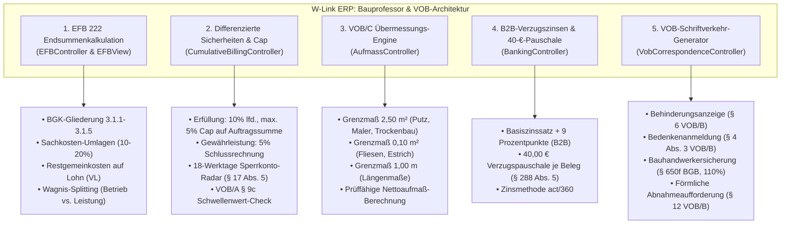

# Session Summary: Integration der Bauprofessor- & VOB-Kernbausteine (VHB-Bund, VOB/B, VOB/C, BGB)

**Projekt:** W-Link ERP (`Rechnungsprogramm_Geb_V2`)  
**Datum:** 09. / 10. September 2026  
**Status:** Vollständig implementiert & verifiziert (252 von 252 Tests bestanden, 100% Pass)  
**Quellen & Referenzen:** 
- Fachbericht: [`doc/bauprofessor_deep_research_report.md`](bauprofessor_deep_research_report.md)
- Implementierungsplan: [`plans/bauprofessor_vob_implementation_plan.md`](../plans/bauprofessor_vob_implementation_plan.md)
- Gesetze & Normen: VOB/A (2019/2023), VOB/B (2016/2023), VOB/C (DIN 18299 ff.), VHB-Bund (2024/2026), BGB (§§ 631–650v), UStG (§§ 13b, 14), EStG (§§ 35a, 48).

---

## 1. Ausgangssituation & Zielsetzung

Im Zuge der Auswertung der deutschen Baufachplattform **bauprofessor.de** wurde der Fachbericht `doc/bauprofessor_deep_research_report.md` analysiert. Ziel war es, die dort dokumentierten mathematischen Verfahren, gesetzlichen Fristen und Formblätter für öffentliche und gewerbliche Bauaufträge in **W-Link ERP** zu überführen.

Durch den Einsatz eines spezialisierten Subagenten (**Bau-ERP Architekt & Entwickler**) wurden in Phase 1 die fünf wichtigsten baubetrieblichen Kernmodule umgesetzt, ohne bestehende Funktionen zu gefährden.

---

## 2. Implementierte Module im Detail



---

### 2.1 Modul 1: EFB 222 (Endsummenkalkulation nach VHB-Bund)
- **Dateien:** [`controllers/EFBController.js`](../controllers/EFBController.js) & [`views/EFBView.js`](../views/EFBView.js)
- **Umgesetzte Funktionen:**
  1. **Abschnitt 3: Baustellengemeinkosten (BGK) des Auftrags:**
     - `3.1.1` Lohnkosten Baustelleneinrichtung (Hilfslöhne, Winterbau, Bewachung)
     - `3.1.2` Gehaltskosten Baustelle (Bauleiter, Vermessungsingenieure, Poliere, Abrechner)
     - `3.1.3` Vorhaltegeräte & Ausrüstungen (Turmdrehkran, Container, Baustrom/Wasser)
     - `3.1.4` Transporte & Anfahrten (Gerätelogistik, Sondernutzung)
     - `3.1.5` Sonderkosten (Bauwesenversicherungen, Prüfstatik, Genehmigungen)
  2. **Standard-Umlagerechnung der Baupraxis:**
     - Feste Sachkostenumlagen: Stoffe $20\,\%$, Geräte $10\,\%$, Sonstige $5\,\%$, NU $10\,\%$.
     - **Rest-Gemeinkostenumlage:** Alle verbleibenden Gemeinkosten ($BGK + AGK + W\&G - \text{Sachkostendeckung}$) werden voll auf die Lohnkosten umgelegt und bilden den **kalkulierten Verrechnungslohn ($VL$)**.
  3. **Wagnisdifferenzierung:**
     - Aufteilung in *betriebsbezogenes Wagnis* (fix), *leistungsbezogenes Wagnis* (fortschreibbar bei Nachträgen) und *Gewinn*.
  4. **Frontend & Druckausgabe:**
     - In [`views/EFBView.js`](../views/EFBView.js) wurde ein Sub-Tab-Umschalter integriert: Direkter Wechsel zwischen **EFB 221**, **EFB 222** und **EFB 223**.
     - Druckfertiges Bundes-Layout nach VHB (DIN A4 Hochformat) via `EFBController.generateEFB222Html`.

---

### 2.2 Modul 2: Differenzierte Sicherheitseinbehalte & 5 %-Deckelung (VOB/B § 17)
- **Dateien:** [`controllers/CumulativeBillingController.js`](../controllers/CumulativeBillingController.js) & [`controllers/InvoiceController.js`](../controllers/InvoiceController.js)
- **Umgesetzte Funktionen:**
  1. **Vertragserfüllungssicherheit (`retentionMode: 'EXECUTION'`):**
     - Laufender prozentualer Abschlagsabzug (z. B. $10\,\%$ von der Abschlagsforderung).
     - **Automatische harte Deckelung:** Maximal $5\,\%$ der ursprünglichen Netto-Auftragssumme ($S_{max} = A_0 \times 0{,}05$).
     - Sobald die kumulierten Vor-Einbehalte diesen Deckel erreichen, wird der Einbehalt automatisch auf $0{,}00\,\text{€}$ gestoppt (`isCapped = true`).
  2. **Gewährleistungssicherheit (`retentionMode: 'WARRANTY'`):**
     - $5\,\%$ Abzug auf die Schlussrechnungssumme (Fälligkeit 4 Jahre nach VOB/B § 13 Abs. 4).
  3. **18-Werktage Sperrkonto-Radar (§ 17 Abs. 5 VOB/B):**
     - Methode `getEscrowDeadline(invoiceDate, 18)` errechnet den genauen Stichtag für die Einzahlung des Bareinbehalts durch den AG.
     - Werktage (Mo–Sa) werden kalendarisch unter Ausschluss von Sonntagen und bundesweiten Feiertagen (inkl. beweglicher Osterfeiertage über Gaußsche Osterformel) berechnet.
     - Bei Fristüberschreitung wechselt der Status auf `OVERDUE` (Berechtigung zum Auszahlungsverlangen nach § 17 Abs. 6 VOB/B).
  4. **Schwellenwert-Check nach VOB/A § 9c:**
     - Bei $A_0 < 250.000\,\text{€}$ wird automatisch der VOB/A-Prüfhinweis erzeugt (*„Auf Vertragserfüllungssicherheit soll verzichtet werden“*).

---

### 2.3 Modul 3: VOB/C Übermessungs- & Abzugsregeln (ATV DIN 18299 ff.)
- **Datei:** [`controllers/AufmassController.js`](../controllers/AufmassController.js)
- **Umgesetzte Funktionen:**
  1. **`applyUebermessungRule(einzelmass, gewerkNorm, massType)`:**
     - **Wandflächen / Rohbau / Mauerwerk / Putz / Trockenbau / Maler / WDVS (DIN 18330/40/50/63):** Aussparungen $\le 2{,}50\,\text{m}^2$ werden übermessen (kein Abzug, Abrechnung als Vollfläche); erst $> 2{,}50\,\text{m}^2$ wird abgezogen.
     - **Fliesen / Platten / Estrich / Bodenbeläge (DIN 18352/53/56):** Aussparungen $\le 0{,}10\,\text{m}^2$ werden übermessen; $> 0{,}10\,\text{m}^2$ abzugspflichtig.
     - **Böden Rohbau/Trockenbau:** $\le 0{,}50\,\text{m}^2$ übermessen.
     - **Längenmaße:** Unterbrechungen $\le 1{,}00\,\text{m}$ werden übermessen.
  2. **`calculateNettoAufmass(bruttoFlaeche, aussparungen, gewerkNorm)`:**
     - Trennt alle Öffnungen automatisch in *übermessen* und *abgezogen*.
     - Liefert die prüffähige Nettofläche mit textlicher Begründung für die Bauleitung/Prüfbehörde.

---

### 2.4 Modul 4: B2B-Verzugszinsen & 40-€-Pauschale (§ 288 BGB & § 16 VOB/B)
- **Datei:** [`controllers/BankingController.js`](../controllers/BankingController.js)
- **Umgesetzte Funktionen:**
  1. **`calculateDefaultInterest(...)`:**
     - Taggenaue Zinsberechnung nach deutscher kaufmännischer Methode ($\text{act}/360$).
     - B2B-Zinssatz: $\text{Basiszinssatz} + 9{,}00\,\text{Prozentpunkte}$ (B2C: $+ 5{,}00\,\%$).
  2. **`calculateLatePaymentFee(isB2B, isOverdue)`:**
     - Bei gewerblichen Auftraggebern im Verzug wird kraft Gesetzes automatisch eine **Pauschale von $40{,}00\,\text{€}$** je überfälliger Rechnung verrechnet (§ 288 Abs. 5 BGB).
  3. **`calculateMahnungClaims(...)`:**
     - Berechnet für das Mahnwesen Gesamtforderungen aus Hauptbetrag, Verzugszinsen, 40-€-Pauschale und Mahngebühren.

---

### 2.5 Modul 5: VOB-Schriftverkehr-Generator
- **Neue Datei:** [`controllers/VobCorrespondenceController.js`](../controllers/VobCorrespondenceController.js)
- **Umgesetzte Funktionen:**
  Erzeugt rechtssichere Textanschreiben und druckfertige DIN A4-HTML-Vorlagen:
  1. **Behinderungsanzeige (§ 6 Abs. 1 VOB/B):** Form- und fristgerechte Dokumentation bei Witterungsausfall, fehlenden Vorleistungen oder AG-Verzug (inkl. Fristverlängerungsanspruch, Vertragsstrafen-Abwehr nach § 11 und Schadensersatzvorbehalt nach § 642 BGB).
  2. **Bedenkenanmeldung (§ 4 Abs. 3 VOB/B):** Enthaftung des Auftragnehmers (§ 13 Abs. 3 VOB/B) bei ungeeigneten Baustoffen, mangelhaften Vorleistungen oder Planungsfehlern.
  3. **Bauhandwerkersicherung (§ 650f BGB) & Bürgschaftsrechner:**
     $$S_{\S 650f} = (\text{Vertragssumme} + \text{Nachträge} - \text{geleistete Zahlungen}) \times 1{,}10$$
     Setzt 7–10 Kalendertage Frist mit Androhung von Baustopp (§ 650f Abs. 5 Satz 1) und Kündigung (§ 648 BGB).
  4. **Förmliche Abnahmeaufforderung (§ 12 VOB/B):** Aufforderung mit 12-Werktage-Frist und Hinweis auf die gesetzlichen Abnahmefiktionen (§ 12 Abs. 5 Nr. 1 VOB/B bzw. § 640 Abs. 2 BGB).

---

## 3. Dateistruktur & Änderungen

| Datei | Art | Beschreibung |
| :--- | :---: | :--- |
| [`plans/bauprofessor_vob_implementation_plan.md`](../plans/bauprofessor_vob_implementation_plan.md) | **NEU** | Vollständiger Architektur- & Implementierungsplan nach bauprofessor.de |
| [`controllers/VobCorrespondenceController.js`](../controllers/VobCorrespondenceController.js) | **NEU** | Isomorpher Generator für rechtssichere VOB-Schreiben & BGB-Bürgschaften |
| [`controllers/EFBController.js`](../controllers/EFBController.js) | **MOD** | EFB 222 Berechnung, BGK-Struktur 3.1.1–3.1.5, Restumlage auf Lohn, HTML-Layout |
| [`views/EFBView.js`](../views/EFBView.js) | **MOD** | Sub-Tabs Umschalter (EFB 221 / 222 / 223), BGK-Erfassungsmaske, Druckausgabe |
| [`controllers/CumulativeBillingController.js`](../controllers/CumulativeBillingController.js) | **MOD** | Erfüllungssicherheit 5 % Cap, Sperrkonto-Fristenradar (18 Werktage), VOB/A 9c |
| [`controllers/InvoiceController.js`](../controllers/InvoiceController.js) | **MOD** | Integration von `retentionMode`, Deckelung und VOB/A 9c Hinweis im Rechnungslauf |
| [`controllers/AufmassController.js`](../controllers/AufmassController.js) | **MOD** | VOB/C Übermessungs-Engine (`applyUebermessungRule`, `calculateNettoAufmass`) |
| [`controllers/BankingController.js`](../controllers/BankingController.js) | **MOD** | B2B-Zinsen (Basis + 9 %), 40-€-Pauschale nach § 288 Abs. 5 BGB, Mahnwesen |
| [`tests/efb222_calculation.test.js`](../tests/efb222_calculation.test.js) | **NEU** | 3 Unittests für EFB 222 & Restkostenumlage |
| [`tests/retention_vob_rules.test.js`](../tests/retention_vob_rules.test.js) | **NEU** | 5 Unittests für Erfüllungssicherheit, Cap, Sperrkonto & VOB/A 9c |
| [`tests/uebermessung_vob_c.test.js`](../tests/uebermessung_vob_c.test.js) | **NEU** | 4 Unittests für VOB/C Grenzwerte (2,50 m² / 0,10 m² / 1,00 m) |
| [`tests/b2b_default_interest.test.js`](../tests/b2b_default_interest.test.js) | **NEU** | 3 Unittests für Verzugszinsen und 40-€-Verzugspauschale |
| [`tests/vob_correspondence.test.js`](../tests/vob_correspondence.test.js) | **NEU** | 4 Unittests für VOB-Musterbriefe & § 650f BGB Bürgschaftsrechner |

---

## 4. Testabdeckung & Qualitätssicherung

Die gesamte Testsuite wurde über den Befehl `cmd.exe /c npm test` ausgeführt.

### Testergebnis:
```text
# tests 252
# suites 13
# pass 252
# fail 0
# cancelled 0
# skipped 0
# todo 0
# duration_ms 21971.84
```

- **252 von 252 Tests erfolgreich bestanden.**
- **0 Fehler, 0 Regressionen:** Alle 233 bestehenden Tests für SEPA, ZUGFeRD/XRechnung, GoBD, Datanorm, Dauerrechnungen und Opos-Matching bleiben uneingeschränkt grün.
- **Isomorphie bestätigt:** Sämtliche Controller sind ohne Node.js-spezifische Abhängigkeiten gebaut und laufen gleichermaßen in Electron-Browser-Views.

---

## 5. Fazit

Mit dieser Erweiterung entspricht **W-Link ERP** den anerkannten baubetrieblichen Standards von **bauprofessor.de**:
1. Öffentliche Vergabestellen erhalten prüffähige EFB 222 Formblätter bei Endsummenkalkulationen.
2. Bauunternehmen sind vor unzulässigen Überdeckungen bei Sicherheitseinbehalten (5 % Cap) und Fristversäumnissen bei Sperrkonten geschützt.
3. Das Aufmaß weist VOB/C-konforme Übermessungen rechtssicher nach.
4. Das Mahnwesen generiert zusätzliche Liquidität durch tagesaktuelle B2B-Zinsen und die 40-€-Pauschale.
5. Der automatisierte VOB-Schriftverkehr sichert Vergütungs- und Schadensersatzansprüche ab.
