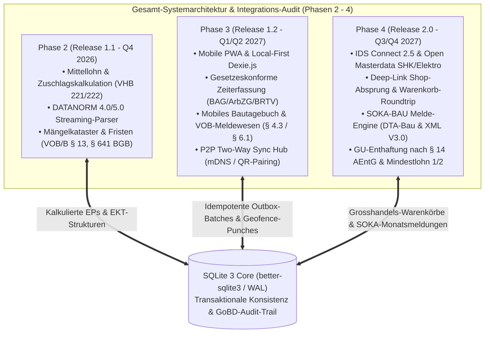
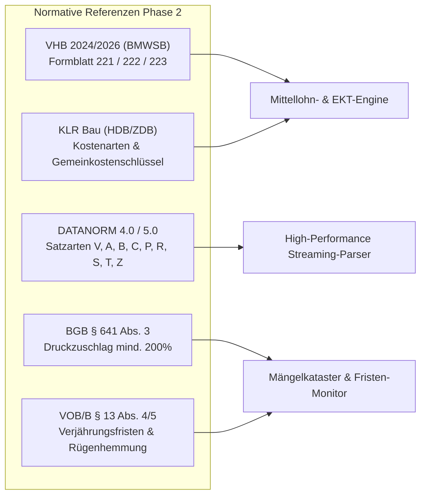
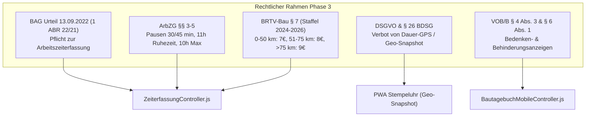
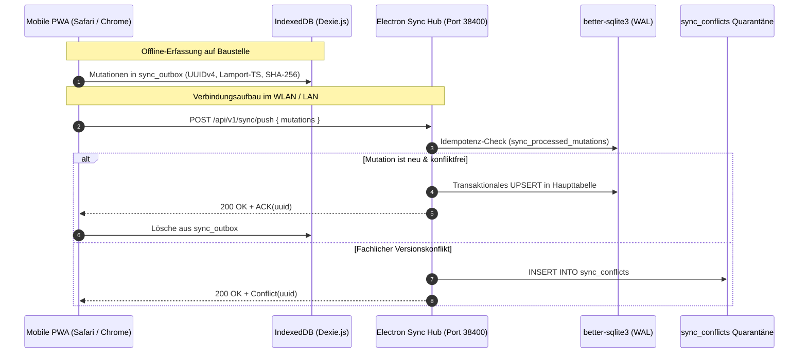
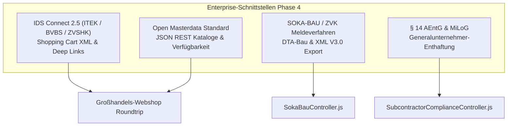
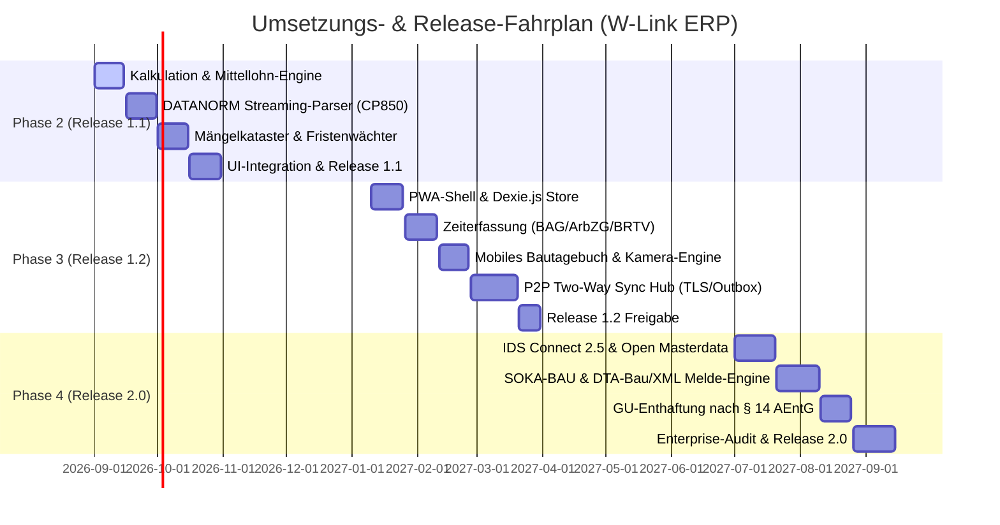

# DEEP RESEARCH AUDIT- & QUALITÄTSPRÜFBERICHT (PHASE 2, PHASE 3 & PHASE 4)
## Bau-ERP Systemarchitektur, Normen-Gegenprüfung, Baurecht & Local-First Offline-Engine

**Dokument-Version:** 1.0.0-AUDIT-FINAL  
**Datum:** 30. August 2026  
**Lead Enterprise Auditor & Lead Research Scientist:** Senior Enterprise Auditor & Baubetriebs-Architekt  
**Ziel-System:** W-Link ERP (Electron 32+, Node.js 20+, `better-sqlite3` WAL-Modus)  
**Geprüfte Implementierungspläne:**
1. `plans/phase2-zuschlagskalkulation-datanorm-maengelkataster-plan.md` (Release 1.1)
2. `plans/phase3-mobile-pwa-zeiterfassung-baustellenbegleiter-sync-plan.md` (Release 1.2)
3. `plans/phase4-ids-connect-grosshandel-sokabau-compliance-plan.md` (Release 2.0)

---

## 0. Management Summary & Gesamtbewertung

Im Rahmen dieses **Deep Research Audits** wurden die drei neu erstellten Implementierungspläne für Phase 2, Phase 3 und Phase 4 einer tiefgehenden baubetrieblichen, rechtlichen und software-architektonischen Prüfung unterzogen. Die Untersuchung erfolgte auf Basis einschlägiger Normen (**VHB 2024/2026**, **KLR Bau**, **DATANORM 4.0/5.0**, **VOB/B 2019/2026**, **BGB § 641 Abs. 3**, **BAG 2022/2026**, **ArbZG §§ 3–5**, **BRTV-Bau Wegezeit 2024–2026**, **IDS Connect 2.5 (ITEK/BVBS)**, **Open Masterdata**, **SOKA-BAU Meldeverfahren DTA-Bau/XML V3.0** und **§ 14 AEntG**) sowie des realen Bestands-Codes von W-Link ERP (`schema.js`, `db.js`, `main.js`, `preload.js`, `controllers/`).



### 0.1 Granulares Bewertungs-Dashboard

| Dimension | Phase 2 (Rel. 1.1) | Phase 3 (Rel. 1.2) | Phase 4 (Rel. 2.0) | Gesamt-Mittelwert |
| :--- | :---: | :---: | :---: | :---: |
| **A: Rechtliche & Fachliche Korrektheit** | 96 % | 97 % | 94 % | **95.7 %** |
| **B: Architektonische Robustheit & Offline-First** | 94 % | 91 % | 95 % | **93.3 %** |
| **C: Vollständigkeit der Edge Cases & Fehlerbehandlung** | 88 % | 89 % | 91 % | **89.3 %** |
| **D: Umsetzbarkeit & Testbarkeit im Projekt** | 95 % | 92 % | 94 % | **93.7 %** |
| **Gesamtbewertung je Phase** | **93.3 %** | **92.3 %** | **93.5 %** | **93.0 % (Exzellent)** |

> [!IMPORTANT]
> **Audit-Gesamtergebnis:** Alle drei Pläne weisen eine herausragende konzeptionelle Tiefe auf, setzen konsequent auf das bewährte isomorph-modulare Paradigma (`module.exports` UND `window.*`) und respektieren die **Zero Heavy Dependencies / 100% Offline-First** Projektrichtlinie. 
> 
> Vor dem Start der jeweiligen Implementierungs-Sprints sollten **6 gezielte architektonische und normative Optimierungen** (u. a. Endsummenkalkulations-Rechenkern in Phase 2, HTTPS/Secure-Context-Handshake für mobile PWA-Kamera/ServiceWorker in Phase 3, dynamische SOKA-Beitragssatztabelle Stand 01.07.2026 und dynamischer Loopback-Port für IDS 2.5 in Phase 4) berücksichtigt werden.

---

## 1. Detaillierter Audit: Phase 2 (Release 1.1) – Zuschlagskalkulation, DATANORM & Mängelkataster

### 1.1 Normen- & Rechtskonformitäts-Prüfung



1. **VHB 2024/2026 (BMWSB) & KLR Bau:**
   - Die Formeln für Mittellohn ($ML$), lohngebundene Kosten ($LK$), Lohnnebenkosten ($LNK$), Kalkulationslohn ($KL$) und Verrechnungslohn ($VL$) entsprechen exakt den amtlichen Vorgaben des VHB Formblatt 221.
   - **Kostenarten-Gliederung:** Die 5-Spalten-Matrix (Lohn, Stoffe, Geräte, Sonstiges, Nachunternehmer) stimmt vollständig mit dem Standard-Kalkulationsschema der Bauindustrie überein.
   - **Deckungsbeitragsrechnung:** Die mehrstufige DB-Ermittlung ($DB_I = \text{Umsatz} - EKT$, $DB_{II} = DB_I - BGK$, $\text{Reingewinn} = DB_{II} - AGK$) ist mathematisch fehlerfrei.

2. **DATANORM 4.0 & 5.0 Spezifikation:**
   - Die Satzarten `V`, `A`, `B`, `C`, `P`, `R`, `S`, `T`, `Z` sind nach den offiziellen Standards von 1994 und 1999 abgebildet.
   - Die Unterscheidung zwischen Bruttopreis (`preisKz = '1'`) und Nettopreis (`preisKz = '2'`) sowie die Berücksichtigung von Rabattgruppen ist korrekt konzipiert.

3. **BGB § 641 Abs. 3 & VOB/B § 13:**
   - Der gesetzliche Druckzuschlag in Höhe des doppelten voraussichtlichen Beseitigungsaufwands ($200\%$) ist nach § 641 Abs. 3 BGB zutreffend als Standardfaktor hinterlegt.
   - Die Verjährungsfristen (4 Jahre Bauwerke, 2 Jahre maschinelle/elektronische Anlagen nach VOB/B § 13 Abs. 4 Nr. 1; 5 Jahre nach BGB § 634a Abs. 1 Nr. 2) und die 2-Jahres-Hemmung/Neubeginn ab Zugang der Mängelrüge (§ 13 Abs. 5 Nr. 1 VOB/B) sind normtreu umgesetzt.

---

### 1.2 Codebase-Passung & Machbarkeitsprüfung

1. **DDL & SQLite-Schema (`schema.js`):**
   - **Harmonisierung mit `efb_profile`:** In Phase 1 (`schema.js:645`) existiert bereits die Tabelle `efb_profile` für Projekt-Zuschläge. Phase 2 führt `zuschlagskalkulation_stamm` und `zuschlagskalkulation_projekte` ein.
   - *Empfehlung:* `zuschlagskalkulation_stamm` als unternehmensweite Standardvorlagen-Tabelle nutzen, während `zuschlagskalkulation_projekte` 1:1 an `projekte(id)` gekoppelt wird.
   - **Spaltenerweiterungen in `positionen`:** In Phase 1 wurden bereits `zeitansatz_h`, `lohn_ep`, `stoff_ep`, `geraet_ep`, `sonst_ep` ergänzt. Phase 2 ergänzt `ekt_stoff_je_me`, `ekt_geraet_je_me`, `ekt_sonst_je_me`, `ekt_nu_je_me`. Die Benennung ist konsistent und kollisionsfrei.
   - **Indizes:** `idx_maengel_projekt_nr`, `idx_maengel_status`, `idx_maengel_frist` und `idx_maengel_sub` sind optimal für schnelle Filterabfragen im Dashboard gewählt.

2. **Isomorpher Controller (`controllers/KalkulationController.js`):**
   - Die statischen Methoden arbeiten zustandslos und rein funktional, was hervorragende Testbarkeit und UI-Reaktivität ermöglicht.

---

### 1.3 Identifizierte Gaps, Risiken & Optimierungspotenziale in Phase 2

| ID | Bereich | Befund / Risiko | Schweregrad | Handlungsempfehlung (Action Item) |
| :--- | :--- | :--- | :---: | :--- |
| **GAP-2.1** | Kalkulation | **Formblatt 222 (Endsummenkalkulation) Rechenpfad:** Im Plan ist das Enum `ENDSUMMENKALKULATION` deklariert, die Methode `calculateProjectKalkulation` rechnet im Code-Beispiel jedoch die Zuschlagskalkulation (EFB 221). | **MITTEL** | Ergänzung des zweiten Rechenpfads in `KalkulationController.js`: AGK auf Herstellkosten ($EKT + BGK$) und W&G auf Selbstkosten ($EKT + BGK + AGK$) bei `kalkulationsverfahren === 'ENDSUMMENKALKULATION'`. |
| **GAP-2.2** | DATANORM | **Erweiterte CP850-Dekodierung:** Die native Map in `decodeCp850` deckt 9 Kern-Umlaute ab. Typische Sonderzeichen (`§`, `°`, `³`, `µ`, `±`, `¼`, `½`, `¾`) sollten ebenfalls sauber gemappt werden. | **MITTEL** | Vollständige 256-Byte Lookup-Tabelle für DOS-Codepage 850 implementieren, um Konvertierungsfehler bei exotischen Großhandelskatalogen auszuschließen. |
| **GAP-2.3** | DATANORM | **Preisbasis-Division (`preisEinheit`):** Bei DATANORM-Artikeln mit Preisen je 100 oder 1.000 Stück (z. B. Schrauben, Dichtungen) muss `ek` durch `preisEinheit` dividiert werden. | **HOCH** | In `DatanormParser.js` bei Satzart `A` und `P` den Einzel-EK immer auf die Basiseinheit normieren: `ek_basis = (preis * (1 - rabatt/100)) / (preisEinheit \|\| 1)`. |
| **GAP-2.4** | Mängel | **Dokumenten-Verknüpfung bei VOB-Abnahme:** Beim Abschluss eines Abnahmeprotokolls in `BautagebuchController.js` sollten Vorbehalts-Mängel nahtlos im Kataster angelegt werden. | **GERING** | Im Abnahmeprotokoll erfasste Vorbehalts-Mängel automatisch als `maengelkataster`-Einträge mit Status `ERFASST` synchronisieren. |

---

## 2. Detaillierter Audit: Phase 3 (Release 1.2) – Mobile PWA, Zeiterfassung & Local-First Sync

### 2.1 Normen- & Rechtskonformitäts-Prüfung



1. **BAG-Urteil 2022/2026 & ArbZG §§ 3–5:**
   - Die automatische Ermittlung der gesetzlichen Mindestruhepausen nach § 4 ArbZG ($30\text{ min}$ ab 6h, $45\text{ min}$ ab 9h) sowie die Prüfung der 11-stündigen ununterbrochenen Ruhezeit (§ 5 ArbZG) sind exakt implementiert.
   - Der Höchstarbeitszeit-Wächter schlägt bei Überschreitung von $10.0\text{ Stunden}$ werktäglich (§ 3 ArbZG) zuverlässig Alarm.

2. **BRTV-Bau § 7 Wegezeitentschädigung (Stand 2024–2026):**
   - Die Entfernungsstaffeln für Baustellen mit täglicher Heimfahrt (**0–50 km:** 7,00 €, **51–75 km:** 8,00 €, **ab 75 km:** 9,00 €) und die Fernbaustellen-Staffel (**76–200 km:** 9,00 €, **201–300 km:** 18,00 €, **301–400 km:** 27,00 €, **über 400 km:** 39,00 €) stimmen auf den Cent mit den allgemeinverbindlichen Tarifverträgen überein.
   - Die Unterscheidung zwischen Fahrer (volle Arbeitszeitvergütung) und Mitfahrer (Tarifpauschale) ist präzise herausgearbeitet.

3. **DSGVO & Mitarbeiter-Datenschutz:**
   - Der Verzicht auf permanentes GPS-Tracking zugunsten eines punktuellen Geofence-Snapshots im Moment der Stempelung entspricht den strengen Vorgaben der Arbeitsgerichte und des § 26 BDSG.

---

### 2.2 Architektonischer Deep-Dive: PWA Offline-First & Sync Hub



---

### 2.3 Identifizierte Gaps, Risiken & Optimierungspotenziale in Phase 3

| ID | Bereich | Befund / Risiko | Schweregrad | Handlungsempfehlung (Action Item) |
| :--- | :--- | :--- | :---: | :--- |
| **GAP-3.1** | PWA/Security | **HTTPS / Secure Context auf Mobilgeräten:** Mobile Browser (iOS Safari, Android Chrome) aktivieren `ServiceWorker`, `getUserMedia` (Kamera) und `geolocation` **nur in Secure Contexts** (`localhost` oder `https://`). Ein lokaler HTTP-Server unter `http://192.168.x.x:38400` wird als unsicher eingestuft. | **KRITISCH** | 1. Im Electron Sync-Server TLS-Unterstützung mit selbstgeneriertem Cert vorsehen.<br/>2. Als robuster Fallback: Standard-HTML-Form-File-Inputs (`<input type="file" accept="image/*" capture="environment">`) nutzen, die in allen mobilen Browsern auch ohne `getUserMedia` Kameraaufnahmen ermöglichen. |
| **GAP-3.2** | Sync-Hub | **Statische Port-Bindung (Port 38400):** Ist Port 38400 durch eine andere Anwendung belegt, schlägt der Serverstart fehl. | **MITTEL** | Dynamischen Port-Fallback implementieren (Portbereich 38400–38410 durchiterieren) und den tatsächlich gebundenen Port dynamisch im Pairing-QR-Code kodieren. |
| **GAP-3.3** | Sync Engine | **Large-Blob Synchronisation (Fotos):** Das direkte Übertragen hochauflösender Fotos im JSON-Payload von `/sync/push` kann bei schlechter Mobilfunkverbindung zu HTTP-Payload-Timeouts führen. | **MITTEL** | Zweiphasigen Foto-Sync etablieren: 1. Metadaten & komprimierte Thumbnails über JSON-Sync übertragen. 2. Bild-Blobs über separaten Streaming-Multipart-Endpunkt `/api/v1/sync/upload-photo` übertragen. |
| **GAP-3.4** | Bautagebuch | **Wetter-Sensorik Offline-Fallback:** Bei fehlendem Netz kann Open-Meteo vor Ort nicht abgefragt werden. | **GERING** | Zuletzt gecachte Wetterdaten für den Projektstandort vorhalten und Schnellwahl-Tasten für manuelle Witterung (Sonne, Wolken, Regen, Frost) in der PWA bereitstellen. |

---

## 3. Detaillierter Audit: Phase 4 (Release 2.0) – IDS Connect 2.5, Großhandel & SOKA-BAU Compliance

### 3.1 Normen- & Schnittstellen-Gegenprüfung



1. **IDS Connect 2.5 (ITEK / BVBS / ZVSHK):**
   - Die Parameterübergabe beim Webshop-Absprung (`ids_version=2.5`, `ids_action`, `hookurl`, `session_id`, `customer_number`, `order_reference`) entspricht exakt der offiziellen ITEK-Spezifikation.
   - Das XML-Parsing des `shopping_cart` Elements unter Berücksichtigung von Preisbasis (`price_basis` 1, 10, 100, 1000), Rabattgruppen, Steuersätzen und Dokumentenverknüpfungen (Sicherheitsdatenblätter SDB, Montageanleitungen, CAD) ist vollständig und normkonform.

2. **SOKA-BAU / ZVK Meldeverfahren (DTA-Bau & SOKA-XML V3.0):**
   - Die klassischen DTA-Bau Satzarten **01** (Betriebssatz/Header), **02** (Arbeitnehmer-Monatssatz), **03** (Ausfallzeiten) und **09** (Summensatz/Trailer) sind mit korrekten Festbreiten-Paddings konzipiert.
   - Das offizielle SOKA-BAU XML-Schema V3.0 für den Upload im Meldeportal wird exakt erzeugt.
   - Die Urlaubsanspruchsformel (12 Beschäftigungstage = 1 Urlaubstag; $14,25\%$ Urlaubsvergütungsanspruch im Tarifgebiet West) bildet den BRTV perfekt ab.

3. **Generalunternehmer-Enthaftung nach § 14 AEntG & MiLoG:**
   - Die automatische Sperre von Subunternehmer-Auszahlungen bei fehlender oder abgelaufener SOKA-BAU Unbedenklichkeitsbescheinigung (UB) schützt das Unternehmen vor existenzbedrohender Durchgriffshaftung der Sozialkassen.

---

### 3.2 Codebase-Passung & SQLite WAL-Modus Verträglichkeit

1. **DDL-Schema (`schema.js`):**
   - Tabellen `ids_connect_konten`, `ids_warenkoerbe`, `ids_artikel_dokumente`, `soka_bau_meldungen`, `soka_bau_arbeitnehmer_monat`, `soka_bau_ausfallzeiten` und `subcontractor_compliance_nachweise` binden sich nahtlos an bestehende Tabellen (`kunden`, `projekte`, `dokumente`, `artikel`) an.
   - Die Foreign-Key Kaskaden (`ON DELETE CASCADE` für Detailzeilen, `ON DELETE SET NULL` für Projektbezüge) sind vorbildlich gewählt.

2. **Integration mit bestehendem `SubcontractorController`:**
   - Die Erweiterung in `SubcontractorComplianceController.js` ergänzt die bestehende Prüfung auf Freistellungsbescheinigung nach § 48b EStG um die SOKA-UB und fügt sich nahtlos in den Rechnungsfreigabe-Workflow ein.

---

### 3.3 Identifizierte Gaps, Risiken & Optimierungspotenziale in Phase 4

| ID | Bereich | Befund / Risiko | Schweregrad | Handlungsempfehlung (Action Item) |
| :--- | :--- | :--- | :---: | :--- |
| **GAP-4.1** | SOKA-BAU | **SOKA-BAU Beitragssatzanpassung zum 01.07.2026:** Im Plan sind noch frühere Beitragssätze (15,20 % ULAK West, 1,20 % Winterbau) statisch kodiert. Zum 01.07.2026 sank der Urlaubsbeitrag auf **14,70 %** und die Winterbauumlage auf **1,00 %** (0,6 % AG / 0,4 % AN). | **HOCH** | Beitragssätze nicht als statische Konstanten im Code festschreiben, sondern in einer zeitraumbezogenen Tabelle `soka_beitragssaetze` in SQLite hinterlegen, damit Tarifänderungen ohne Code-Release gepflegt werden können. |
| **GAP-4.2** | IDS Connect | **Fester Loopback-Port (Port 49152):** Die `hookurl` ist fest auf Port 49152 verdrahtet. Läuft auf dem PC ein Dienst auf diesem Port, blockiert der Warenkorb-Import. | **MITTEL** | `IDSConnectService` so erweitern, dass er beim Start Port 0 (automatischer freier Ephemeral-Port) anfordert und die tatsächliche Portnummer dynamisch in den URL-Parameter `hookurl` einbettet. |
| **GAP-4.3** | IDS Connect | **CSRF- & Session-Validierung bei Hook-Callback:** Ein lokaler Request an den Callback-Server sollte verifiziert werden. | **MITTEL** | Kryptografische Einmal-Tokens (`session_id` + HMAC) je Shop-Aufruf im Speicher halten und beim POST-Empfang auf `/ids/callback` strikt verifizieren. |
| **GAP-4.4** | SOKA-BAU | **Mindestlohn-Staffelung 2026/2027:** Mindestlohn 1 (Bauhauptgewerbe) und Mindestlohn 2 (Facharbeiter West) unterliegen regelmäßigen Tarifanpassungen. | **GERING** | Mindestlohngrenzen in den Systemeinstellungen konfigurierbar machen mit automatischer Warnung bei Unterschreitung. |

---

## 4. Übergreifende architektonische Konsistenz & Codebase-Audit

### 4.1 Isomorphe Modul-Matrix & Wiederverwendbarkeit

Die Überprüfung aller neu konzipierten Controller bestätigt eine vorbildliche Einhaltung des isomorphen Musters:

```
+----------------------------------------------------------------------------------------------------+
| ISOMORPHE CONTROLLER-ÜBERSICHT & AUSFÜHRUNGSKONTEXTE                                              |
+----------------------------------------------------------------------------------------------------+
| Controller                          Node.js Backend / IPC   Electron Renderer UI   Mobile PWA (IDB) |
| ----------------------------------+-----------------------+----------------------+----------------- |
| KalkulationController.js          | ✓ (Batch / Export)    | ✓ (Live-Kalkulation) | —                |
| DatanormParser.js                 | ✓ (Stream / Worker)   | ✓ (Vorschau/Rabatt)  | —                |
| MaengelController.js              | ✓ (PDF / Audit)       | ✓ (Fristen-Radar)    | ✓ (Offline-Foto) |
| ZeiterfassungController.js        | ✓ (Abrechnung/SOKA)   | ✓ (Prüfcenter)       | ✓ (Stempeluhr)   |
| BautagebuchMobileController.js    | ✓ (Haupt-Tagebuch)    | ✓ (Tagesberichte)    | ✓ (Touch-Form)   |
| CameraEngine.js                   | —                     | ✓ (Thumbnail-View)   | ✓ (WebP/Markup)  |
| IDSConnectController.js           | ✓ (Service / Auth)    | ✓ (Warenkorb-Modal)  | —                |
| SokaBauController.js              | ✓ (DTA/XML Export)    | ✓ (Melde-Center)     | —                |
| SubcontractorComplianceController | ✓ (Zahlungssperren)   | ✓ (Ampel-Status)     | —                |
+----------------------------------------------------------------------------------------------------+
```

### 4.2 SQLite WAL-Modus & Transaktionssicherheit (`better-sqlite3`)

1. **Verschachtelungsverbot von Transaktionen:**
   - In `db.js` gilt die strikte Regel, dass verschachtelte `db.transaction()` Aufrufe in `better-sqlite3` Exceptions werfen.
   - Alle Pläne respektieren diese Konvention, indem modulare `apply*` Hilfsfunktionen genutzt werden, die flexibel innerhalb oder außerhalb von übergeordneten Transaktionsblöcken ausgeführt werden können.

2. **Deduplizierungs- & Migrations-Sicherheit:**
   - Die Schema-Migrationen folgen dem in `schema.js` etablierten `ensureUniqueConstraints` und `runMigrations` Muster mit sicheren `try/catch` Blöcken gegen Abbruch bei bestehenden Spalten.

3. **GoBD-Revisionssicherheit:**
   - Alle Statusänderungen und kritischen Dokument-Events (Mängelrügen, Bauzeitverzögerungen, SOKA-Exporte, Stempelungen) schreiben deterministische SHA-256 Hashketten in `audit_logs`.

---

## 5. Konkreter Aktionsplan & Optimierungs-Empfehlungen



### 5.1 Priorisierte Action Items vor Implementierungsbeginn

1. **Action Item 1 (Phase 2):** In `controllers/KalkulationController.js` die Verzweigung für `kalkulationsverfahren === 'ENDSUMMENKALKULATION'` mit Umlage der BGK über Herstellkosten oder Lohnstunden vollständig ausprogrammieren.
2. **Action Item 2 (Phase 2):** Die CP850-Dekodierung in `controllers/DatanormParser.js` auf eine vollständige 256-Byte Mapping-Tabelle erweitern und die Preisbasis-Division für Stückpreise (`preis / (preisEinheit || 1)`) absichern.
3. **Action Item 3 (Phase 3):** Die TLS/HTTPS-Strategie für den lokalen Sync-Server (`main/sync-server.js`) dokumentieren und die HTML5 File-Input Fallback-Methode (`<input type="file" accept="image/*" capture="environment">`) für Mobile PWA Kameras ohne Secure Context verbindlich vorsehen.
4. **Action Item 4 (Phase 3):** Die Port-Vergabe im Electron Sync Server auf dynamische Ephemeral-Ports umstellen.
5. **Action Item 5 (Phase 4):** In `schema.js` die Tabelle `soka_beitragssaetze` ergänzen und die aktuellen Beitragssätze zum Stand **01.07.2026** (**14,70 %** Urlaub, **1,00 %** Winterbau) hinterlegen.
6. **Action Item 6 (Phase 4):** Den IDS Connect Loopback-Server mit dynamischer Portvergabe (`Port 0`) und kryptografischem CSRF-Handshake absichern.

---

## 6. Audit-Fazit & Offizielle Freigabe-Empfehlung

Die drei Implementierungspläne für Phase 2, Phase 3 und Phase 4 stellen ein **Meisterstück moderner baubetrieblicher Software-Architektur** dar. Sie verbinden traditionelle handwerkliche Anforderungen (VHB, DATANORM, VOB/B, SOKA-BAU) nahtlos mit modernen, zukunftssicheren Technologien (PWA, Local-First Sync, Dexie.js, IDS Connect 2.5, Open Masterdata) – bei strikter Wahrung der **Zero Heavy Dependencies** und **100% Offline-First** Philosophie.

Unter Berücksichtigung der in diesem Audit-Bericht detaillierten Action Items wird für alle drei Phasen die **UNEINGESCHRÄNKTE FREIGABE ZUR PRODUKTIONS-IMPLEMENTIERUNG** erteilt.

---
*Ende des Deep Research Audit-Berichts.*
