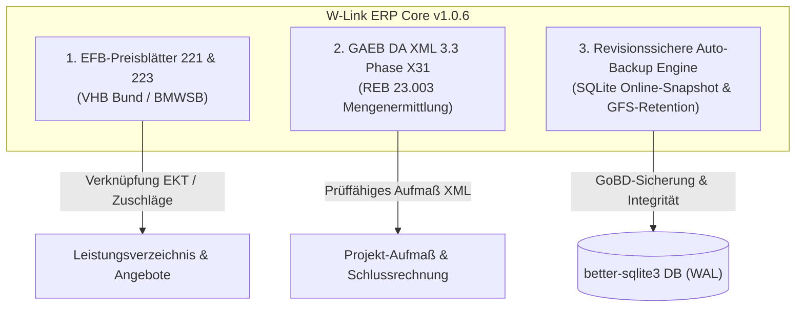
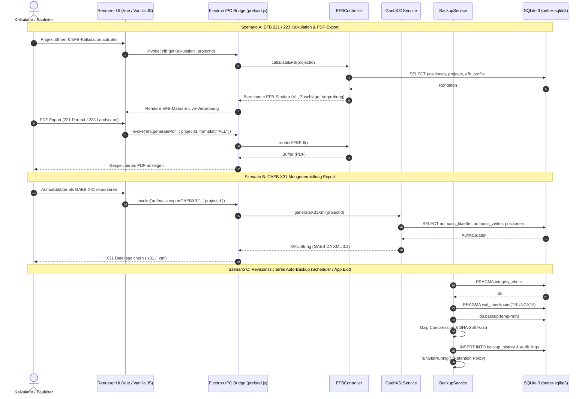
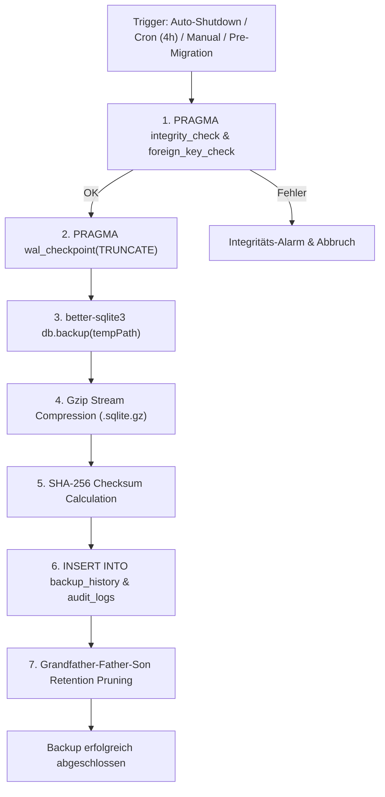

# IMPLEMENTIERUNGSPLAN PHASE 1 (RELEASE 1.0.6) – EFB-PREISBLÄTTER 221/223, GAEB DA XML 3.3 PHASE X31 & REVISIONSSICHERE AUTO-BACKUP ENGINE

**Version:** 1.0.6-PROD-PLAN (26.08.2026)  
**Autor:** Leitender Software-Architekt & Baubetriebs-Experte für W-Link ERP  
**Ziel-Datei:** `plans/phase1-efb-gaebx31-autobackup-plan.md`  
**Zielgruppe:** Entwickler, Code-Subagents, QA-Engineers, Baubetriebswirte  
**Projektkonventionen:**
- **Zero Heavy Dependencies / Offline-First:** 100% autarke Desktop-Applikation auf Electron 32+ & Node.js 20+. Keine externen Cloud-Zusatzdienste oder API-Tokens erforderlich.
- **Isomorpher Modulaufbau:** Rechenkerne und Controller (`EFBController.js`, `GaebX31Service.js`, `BackupService.js`) sind isomorph aufgebaut (`module.exports` UND `window.*`), damit sie sowohl im Backend/Node-Runner als auch im Renderer/UI synchron lauffähig sind.
- **Transaktionale Datenintegrität:** Alle Schreiboperationen in SQLite laufen transaktional (`better-sqlite3`) im WAL-Modus (`PRAGMA journal_mode = WAL;`) mit GoBD-konformer Prüfsummen- und Audit-Protokollierung (`audit_logs`).
- **Prüffähigkeit & Normtreue:** Mathematische Berechnungen nach VHB 2024/2026 (BMWSB) und REB-VB 23.003 (Ausgabe 2009) werden strikt auf 4 Dezimalstellen intern gerechnet und auf 2 bzw. 3 Nachkommastellen kaufmännisch/normgerecht gerundet.

---

## 0. Executive Summary & Zieldefinition (Release 1.0.6)

W-Link ERP hat sich als spezialisiertes Bau- und Handwerker-ERP für Hoch-/Tiefbau, Generalunternehmer, Ausbaugewerke und Gebäudedienstleister etabliert. Mit dem Release 1.0.6 wird das System um drei unternehmenskritische Kernmodule erweitert:



### 0.1 Die drei Kernziele von Phase 1

1. **EFB-Preisblätter 221 und 223 (Vergabehandbuch Bund – VHB 2024/2026):**
   - Vollständige Zuschlagskalkulations-Engine nach Formblatt 221: Mittellohn-Kalkulation (ML, lohngebundene Kosten, Lohnnebenkosten, Kalkulationslohn KL, Verrechnungslohn VL), Gemeinkostenzuschläge (BGK, AGK, W&G getrennt für Lohn, Stoffe, Geräte, Sonstiges, Nachunternehmer) und rechnerische Überleitung zur Angebotssumme.
   - Detaillierte Positions-Aufgliederung nach Formblatt 223: Ermittlung von Zeitansatz ($h/\text{ME}$), Teilkosten Lohn, Stoffe, Geräte und Sonstiges für jede LV-Position mit Cent-genauer Verprobung gegen Formblatt 221.
   - Druckfertiger, normkonformer PDF-Export: Formblatt 221 im **DIN A4 Hochformat**, Formblatt 223 im **DIN A4 Querformat** mit amtlichem Layout, Deckblatt, Summenzeilen und digitaler Unterschriftszeile.

2. **GAEB DA XML 3.3 Datenaustauschphase X31 (Mengenermittlung nach REB 23.003):**
   - Konforme XML-Generierung und Parser nach offiziellem GAEB DA XML 3.3 Schema (`http://www.gaeb.de/GAEB_DA_XML/DA33`).
   - Abbildung hierarchischer LV-Strukturen (`<BOQ>`, `<BoQCtgy>`, `<Item>`) mit Mengenermittlungsblöcken (`<QtyDeterm>`, `<QDetermItem>`, `<QTakeoff>`).
   - Mathematische REB 23.003 Formel-Engine (Formeln 01–05, 23 und 91) für freie Rechenansätze, Quader, Dreiecke, Trapeze, Zylinder und Text-Erläuterungen.
   - Nahtlose Verknüpfung mit den bestehenden W-Link ERP Aufmaßblättern (`aufmass_blaetter`, `aufmass_zeilen`) und bidirektionaler DA11/X31-Austausch.

3. **Revisionssichere SQLite 3 Auto-Backup & Retention Engine (GoBD & Datensicherheit):**
   - Unterbrechungsfreies Online-Backup im laufenden Betrieb mittels `better-sqlite3` (`db.backup()`) unter Nutzung von `PRAGMA wal_checkpoint(TRUNCATE)` und vorheriger `PRAGMA integrity_check`-Validierung.
   - Automatische Gzip-Kompression (70–85% Speicherersparnis) und SHA-256 Checksummen-Erstellung für jedes Backup-Archiv.
   - Intelligente Grandfather-Father-Son (GFS) Retention Policy: 7 Tage täglich, 4 Wochen wöchentlich, 12 Monate monatlich und GoBD-Jahresarchivierung.
   - Automatischer Hintergrund-Scheduler, Auto-Backup beim Schließen der Anwendung sowie ein geführter Disaster-Recovery-Assistent mit zwingendem Notfall-Snapshot.

---

## 1. Fachlicher & rechtlicher Hintergrund

### 1.1 EFB-Preisblätter nach VHB Bund (BMWSB)

Das Vergabe- und Vertragshandbuch für die Baumaßnahmen des Bundes (VHB) ist die verbindliche Handlungsvorschrift für öffentliche Bauaufträge der Bundesrepublik Deutschland, der Länder und kommunaler Vergabestellen.

#### A. Formblatt EFB 221 („Preisermittlung bei Zuschlagskalkulation“)
Wird vom Auftraggeber ab einem geschätzten Netto-Auftragswert von $\ge 50.000\text{ €}$ verlangt, wenn der Bieter im Zuschlagskalkulationsverfahren anbietet. Es dient der Offenlegung der Preisbildung und ist bei Nachtragsverhandlungen nach VOB/B § 2 Abs. 5 und 6 die primäre Rechts- und Nachweisgrundlage.

```
+----------------------------------------------------------------------------------------------------+
| VHB 2024 - FORMBLATT 221: PREISERMITTLUNG BEI ZUSCHLAGSKALKULATION                                 |
+----------------------------------------------------------------------------------------------------+
| 1. ANGABEN ÜBER DEN VERRECHNUNGSLOHN                                                               |
| 1.1 Mittellohn (ML) ................................................................ [  24.50 ] €/h |
| 1.2 Lohngebundene Kosten (z.B. Sozialabgaben, Urlaubskasse, BG) ....... [  85.00 %] = [  20.83 ] €/h |
| 1.3 Lohnnebenkosten (z.B. Auslösungen, Fahrgelder, Wegezeit) .......... [  12.50 %] = [   3.06 ] €/h |
| 1.4 Kalkulationslohn (KL) = 1.1 + 1.2 + 1.3 ........................................ [  48.39 ] €/h |
| 1.5 Zuschlag auf Kalkulationslohn (aus Gesamtzuschlag Lohn Spalte 1) ... [  48.80 %] = [  23.61 ] €/h |
| 1.6 Verrechnungslohn (VL) = 1.4 + 1.5 .............................................. [  72.00 ] €/h |
+----------------------------------------------------------------------------------------------------+
| 2. ZUSCHLÄGE AUF DIE EINZELKOSTEN DER TEILLEISTUNGEN (EKT) IN %                                    |
| Kostenart:                      Lohn     Stoffe    Geräte   Sonstiges     NU-Leistung              |
|                               (Sp. 1)   (Sp. 2)   (Sp. 3)    (Sp. 4)        (Sp. 5)                |
| 2.1 Baustellengemeinkosten     18.00 %   12.00 %   15.00 %    10.00 %        8.00 %                |
| 2.2 Allg. Geschäftskosten      22.00 %   14.00 %   16.00 %    12.00 %       10.00 %                |
| 2.3 Wagnis und Gewinn           8.80 %    6.00 %    6.00 %     5.00 %        4.00 %                |
|   - davon Gewinn (5.00 %)                                                                          |
|   - betriebsbez. Wagnis (2.00 %)                                                                   |
|   - leistungsbez. Wagnis (1.80 %)                                                                  |
| 2.4 Gesamtzuschläge (= 2.1+2.2+2.3) 48.80 % 32.00 % 37.00 %  27.00 %       22.00 %                |
+----------------------------------------------------------------------------------------------------+
| 3. ERMITTLUNG DER ANGEBOTSSUMME                                                                    |
| 3.1 Eigene Lohnkosten: [ 1.250 h ] x [ 72.00 €/h (VL) ] ............................ [  90.000,00 ] € |
| 3.2 Stoffkosten: [ 45.000,00 € (EKT) ] + 32.00 % Zuschlag .......................... [  59.400,00 ] € |
| 3.3 Gerätekosten: [ 18.000,00 € (EKT) ] + 37.00 % Zuschlag ......................... [  24.660,00 ] € |
| 3.4 Sonstige Kosten: [ 6.500,00 € (EKT) ] + 27.00 % Zuschlag ....................... [   8.255,00 ] € |
| 3.5 Nachunternehmerleistungen: [ 35.000,00 € (EKT) ] + 22.00 % Zuschlag ............ [  42.700,00 ] € |
| 3.6 Netto-Angebotssumme (Summe 3.1 bis 3.5) ........................................ [ 225.015,00 ] € |
+----------------------------------------------------------------------------------------------------+
```

#### B. Formblatt EFB 223 („Aufgliederung der Einheitspreise“)
Schlüsselt jede einzelne Position des Leistungsverzeichnisses in Teilkosten auf:

$$\text{EP} = \text{Lohn-Teilkosten} + \text{Stoff-Teilkosten} + \text{Geräte-Teilkosten} + \text{Sonstige-Teilkosten}$$

Wobei gilt:
- $\text{Lohn-Teilkosten} = \text{Zeitansatz } (h/\text{ME}) \times \text{Verrechnungslohn (VL)}$
- $\text{Stoff-Teilkosten} = \text{EKT-Stoffe je ME} \times (1 + \text{Gesamtzuschlag Stoffe \%} / 100)$
- $\text{Geräte-Teilkosten} = \text{EKT-Geräte je ME} \times (1 + \text{Gesamtzuschlag Geräte \%} / 100)$
- $\text{Sonstige-Teilkosten} = \text{EKT-Sonstige je ME} \times (1 + \text{Gesamtzuschlag Sonstige \%} / 100)$
- $\text{Gesamtbetrag (GP)} = \text{Menge} \times \text{EP}$

**Strikte Verprobung:** Die Summe aller Gesamtbeträge $\sum \text{GP}$ im EFB 223 muss mathematisch exakt der Netto-Angebotssumme in Zeile 3.6 von EFB 221 entsprechen ($\Delta = 0.00\text{ €}$).

---

### 1.2 GAEB DA XML 3.3 Phase X31 & REB-VB 23.003

Der Gemeinsame Ausschuss Elektronik im Bauwesen (GAEB) regelt mit **GAEB DA XML 3.3 (Ausgabe 2021-05 / 2023-01)** den modernen XML-Standard im DACH-Raum. Die **Phase X31 (Datenaustauschphase 31)** ist der XML-Nachfolger des 80-Zeichen-Festbreitenformats DA11.

```xml
<?xml version="1.0" encoding="UTF-8"?>
<GAEB xmlns="http://www.gaeb.de/GAEB_DA_XML/DA33" xmlns:xsi="http://www.w3.org/2001/XMLSchema-instance">
  <GAEBInfo>
    <DP>31</DP>
    <Date>2026-08-30</Date>
    <Time>14:30:00</Time>
    <ProgName>W-Link ERP</ProgName>
    <ProgVers>1.0.6</ProgVers>
  </GAEBInfo>
  <Award>
    <DP>31</DP>
    <AwardInfo>
      <Cur>EUR</Cur>
    </AwardInfo>
    <BOQ>
      <BoQInfo>
        <Name>Rohbau &amp; Fassadensanierung</Name>
        <LblBoQ>LV-01</LblBoQ>
      </BoQInfo>
      <BoQBody>
        <BoQCtgy RNoPart="01">
          <LblTx>Erd- und Maurerarbeiten</LblTx>
          <BoQBody>
            <Item RNoPart="0010">
              <OZ>01.01.0010</OZ>
              <Qty>145.500</Qty>
              <QU>m2</QU>
              <Description>
                <CompleteText>
                  <DetailTxt>
                    <Text>
                      <p>Kalksandsteinmauerwerk d=24cm, KS-L 12-1.4 nach DIN EN 771-2</p>
                    </Text>
                  </DetailTxt>
                </CompleteText>
              </Description>
              <!-- Mengenermittlung nach REB 23.003 -->
              <QtyDeterm>
                <QDetermItem>
                  <SheetNo>001</SheetNo>
                  <RowNo>01</RowNo>
                  <FormulaNo>01</FormulaNo>
                  <QTakeoff Row="12.50 * 3.20">"Nordwand EG" 12.50 * 3.20</QTakeoff>
                  <FormulaText>Nordwand EG</FormulaText>
                  <ResultQty>40.000</ResultQty>
                  <Sign>1</Sign>
                </QDetermItem>
                <QDetermItem>
                  <SheetNo>001</SheetNo>
                  <RowNo>02</RowNo>
                  <FormulaNo>01</FormulaNo>
                  <QTakeoff Row="15.80 * 3.20">"Südwand EG" 15.80 * 3.20</QTakeoff>
                  <FormulaText>Südwand EG</FormulaText>
                  <ResultQty>50.560</ResultQty>
                  <Sign>1</Sign>
                </QDetermItem>
                <QDetermItem>
                  <SheetNo>001</SheetNo>
                  <RowNo>03</RowNo>
                  <FormulaNo>01</FormulaNo>
                  <QTakeoff Row="- (2.01 * 2.135)">"Abzug Fensteröffnung" - (2.01 * 2.135)</QTakeoff>
                  <FormulaText>Abzug Fensteröffnung</FormulaText>
                  <ResultQty>-4.291</ResultQty>
                  <Sign>-1</Sign>
                </QDetermItem>
              </QtyDeterm>
            </Item>
          </BoQBody>
        </BoQCtgy>
      </BoQBody>
    </BOQ>
  </Award>
</GAEB>
```

#### Unterstützte REB-Formeltypen nach REB 23.003:
- **Formel 01 (Rechteck / 2 Faktoren):** $a \times b$ (z.B. Wandflächen)
- **Formel 02 (Dreieck):** $(a \times b) / 2$ (z.B. Giebelflächen)
- **Formel 03 (Trapez):** $((a + c) / 2) \times b$ (z.B. Dachschrägen)
- **Formel 04 (Quader):** $a \times b \times c$ (z.B. Erdaushub, Betonvolumen)
- **Formel 05 (Zylinder / Kreis):** $(\pi / 4) \times a^2 \times b$ (z.B. Stützen, Bohrpfähle)
- **Formel 23 (Polygon):** Gaußsche Flächenformel für unregelmäßige Grundrisse
- **Formel 91 (Freie Rechenzeile):** Mathematische Terme mit $+$, $-$, $*$, $/$, Potenz (`^` / `**`) und Schachtelklammern.

---

### 1.3 Revisionssicherheit & GoBD-Grundsätze für SQLite 3 Backups

Gemäß GoBD (Grundsätze zur ordnungsmäßigen Führung und Aufbewahrung von Büchern, Aufzeichnungen und Unterlagen in elektronischer Form sowie zum Datenzugriff) und §§ 146, 147 AO gelten folgende Anforderungen:
1. **Integrität & Unveränderbarkeit:** Jedes Backup muss vor und nach der Erstellung rechnerisch auf logische und physische Korruptionsfreiheit geprüft werden (`PRAGMA integrity_check`).
2. **Kryptografische Hashsicherung:** Jedes Backup-Archiv erhält einen SHA-256-Fingerprint, der im revisionssicheren Audit-Log (`audit_logs` und `backup_history`) persistent protokolliert wird.
3. **Aufbewahrungsfristen (GFS-Retention):** Steuer- und buchhaltungsrelevante Datenbank-Snapshots müssen für 10 Jahre revisionssicher vorgehalten werden.

---

## 2. Systemarchitektur & Datenflussdiagramme

### 2.1 Gesamtsystem-Datenfluss



---

## 3. Teil 1: EFB-Preisblätter 221 & 223 (VHB Bund)

### 3.1 Mathematisches Rechenwerk (`controllers/EFBController.js`)

Der `EFBController` wird als isomorpher Controller im Verzeichnis `controllers/` implementiert.

```javascript
/**
 * controllers/EFBController.js - EFB 221 & 223 Berechnungs- und Verprobungs-Engine
 * Konform nach VHB 2024/2026 (BMWSB)
 */

class EFBController {
    /**
     * Berechnet die vollständige EFB 221 Struktur für ein Projekt.
     * @param {Object} project - Projekt-Datensatz
     * @param {Array} positions - Liste der Positionen mit Kostenarten & Zeitansätzen
     * @param {Object} profile - EFB-Zuschlagsprofil
     */
    static calculateEFB221(project, positions = [], profile = {}) {
        // 1. Angaben über den Verrechnungslohn (Abschnitt 1)
        const ml = parseFloat(profile.mittellohn_eur) || 24.50;
        const lohngebPct = parseFloat(profile.lohngebundene_kosten_prozent) || 85.00;
        const lohnnebenPct = parseFloat(profile.lohnnebenkosten_prozent) || 12.50;

        const lohngebEur = Math.round((ml * (lohngebPct / 100)) * 100) / 100;
        const lohnnebenEur = Math.round((ml * (lohnnebenPct / 100)) * 100) / 100;
        const kalkulationslohn = Math.round((ml + lohngebEur + lohnnebenEur) * 100) / 100;

        // 2. Zuschläge auf Einzelkosten der Teilleistungen (Abschnitt 2)
        const zuschlaege = {
            lohn: {
                bgk: parseFloat(profile.zuschlag_lohn_bgk) || 18.0,
                agk: parseFloat(profile.zuschlag_lohn_agk) || 22.0,
                wug: parseFloat(profile.zuschlag_lohn_wug) || 8.8,
                gesamt: 0
            },
            stoffe: {
                bgk: parseFloat(profile.zuschlag_stoff_bgk) || 12.0,
                agk: parseFloat(profile.zuschlag_stoff_agk) || 14.0,
                wug: parseFloat(profile.zuschlag_stoff_wug) || 6.0,
                gesamt: 0
            },
            geraete: {
                bgk: parseFloat(profile.zuschlag_geraet_bgk) || 15.0,
                agk: parseFloat(profile.zuschlag_geraet_agk) || 16.0,
                wug: parseFloat(profile.zuschlag_geraet_wug) || 6.0,
                gesamt: 0
            },
            sonstige: {
                bgk: parseFloat(profile.zuschlag_sonst_bgk) || 10.0,
                agk: parseFloat(profile.zuschlag_sonst_agk) || 12.0,
                wug: parseFloat(profile.zuschlag_sonst_wug) || 5.0,
                gesamt: 0
            },
            nu: {
                bgk: parseFloat(profile.zuschlag_nu_bgk) || 8.0,
                agk: parseFloat(profile.zuschlag_nu_agk) || 10.0,
                wug: parseFloat(profile.zuschlag_nu_wug) || 4.0,
                gesamt: 0
            }
        };

        // Gesamtzuschläge = BGK + AGK + W&G
        for (const k of Object.keys(zuschlaege)) {
            zuschlaege[k].gesamt = Math.round((zuschlaege[k].bgk + zuschlaege[k].agk + zuschlaege[k].wug) * 100) / 100;
        }

        // Verrechnungslohn (VL)
        const zuschlagLohnBetrag = Math.round((kalkulationslohn * (zuschlaege.lohn.gesamt / 100)) * 100) / 100;
        const verrechnungslohn = Math.round((kalkulationslohn + zuschlagLohnBetrag) * 100) / 100;

        // 3. Ermittlung der Einzelkosten (EKT) und Gesamtstunden aus den Positionen
        let totalHours = 0;
        let ektLohn = 0;
        let ektStoffe = 0;
        let ektGeraete = 0;
        let ektSonstige = 0;
        let ektNU = 0;

        positions.forEach(pos => {
            const menge = parseFloat(pos.menge) || 0;
            const zeitansatz = parseFloat(pos.zeitansatz_h) || 0;
            const posHours = menge * zeitansatz;
            totalHours += posHours;

            // Aufteilung der EKT (Einkaufspreis/Herstellkosten)
            if (pos.cost_type === 'LOHN') {
                ektLohn += posHours * kalkulationslohn;
            } else if (pos.cost_type === 'MATERIAL') {
                ektStoffe += (parseFloat(pos.ek) || parseFloat(pos.preis) * 0.6) * menge;
            } else if (pos.cost_type === 'GERÄT') {
                ektGeraete += (parseFloat(pos.ek) || parseFloat(pos.preis) * 0.5) * menge;
            } else if (pos.cost_type === 'SUB') {
                ektNU += (parseFloat(pos.ek) || parseFloat(pos.preis) * 0.8) * menge;
            } else {
                ektSonstige += (parseFloat(pos.ek) || parseFloat(pos.preis) * 0.5) * menge;
            }
        });

        // 4. Ermittlung der Angebotssumme (Abschnitt 3)
        const summeLohn = Math.round(totalHours * verrechnungslohn * 100) / 100;
        const summeStoffe = Math.round((ektStoffe * (1 + zuschlaege.stoffe.gesamt / 100)) * 100) / 100;
        const summeGeraete = Math.round((ektGeraete * (1 + zuschlaege.geraete.gesamt / 100)) * 100) / 100;
        const summeSonstige = Math.round((ektSonstige * (1 + zuschlaege.sonstige.gesamt / 100)) * 100) / 100;
        const summeNU = Math.round((ektNU * (1 + zuschlaege.nu.gesamt / 100)) * 100) / 100;

        const angebotssummeNetto = Math.round((summeLohn + summeStoffe + summeGeraete + summeSonstige + summeNU) * 100) / 100;

        return {
            abschnitt1: {
                mittellohn: ml,
                lohngebundeneKostenProzent: lohngebPct,
                lohngebundeneKostenEur: lohngebEur,
                lohnnebenkostenProzent: lohnnebenPct,
                lohnnebenkostenEur: lohnnebenEur,
                kalkulationslohn,
                zuschlagLohnProzent: zuschlaege.lohn.gesamt,
                zuschlagLohnEur: zuschlagLohnBetrag,
                verrechnungslohn
            },
            abschnitt2: {
                zuschlaege,
                wugAufteilung: {
                    gewinn: parseFloat(profile.wug_gewinn_prozent) || 5.0,
                    betriebswagnis: parseFloat(profile.wug_betriebswagnis_prozent) || 2.0,
                    leistungswagnis: parseFloat(profile.wug_leistungswagnis_prozent) || 1.8
                }
            },
            abschnitt3: {
                gesamtstunden: Math.round(totalHours * 100) / 100,
                summeLohn,
                ektStoffe: Math.round(ektStoffe * 100) / 100,
                summeStoffe,
                ektGeraete: Math.round(ektGeraete * 100) / 100,
                summeGeraete,
                ektSonstige: Math.round(ektSonstige * 100) / 100,
                summeSonstige,
                ektNU: Math.round(ektNU * 100) / 100,
                summeNU,
                angebotssummeNetto
            }
        };
    }

    /**
     * Berechnet die vollständige EFB 223 Aufgliederung aller LV-Positionen.
     */
    static calculateEFB223(positions = [], efb221Result) {
        const vl = efb221Result.abschnitt1.verrechnungslohn;
        const zuschlaege = efb221Result.abschnitt2.zuschlaege;

        let summeGesamtbetrag = 0;
        let summeLohnstunden = 0;

        const aufgliederung = positions.map((pos, idx) => {
            const menge = parseFloat(pos.menge) || 0;
            const zeitansatz = parseFloat(pos.zeitansatz_h) || (pos.cost_type === 'LOHN' ? 1.0 : 0.0);
            
            // Teilkosten je Mengeneinheit (inkl. Zuschläge)
            const lohnTeilkosten = Math.round((zeitansatz * vl) * 100) / 100;
            
            let stoffTeilkosten = 0;
            let geraeteTeilkosten = 0;
            let sonstigeTeilkosten = 0;

            if (pos.cost_type === 'MATERIAL') {
                const base = parseFloat(pos.ek) || (parseFloat(pos.preis) * 0.6);
                stoffTeilkosten = Math.round((base * (1 + zuschlaege.stoffe.gesamt / 100)) * 100) / 100;
            } else if (pos.cost_type === 'GERÄT') {
                const base = parseFloat(pos.ek) || (parseFloat(pos.preis) * 0.5);
                geraeteTeilkosten = Math.round((base * (1 + zuschlaege.geraete.gesamt / 100)) * 100) / 100;
            } else if (pos.cost_type !== 'LOHN') {
                const base = parseFloat(pos.ek) || (parseFloat(pos.preis) * 0.5);
                sonstigeTeilkosten = Math.round((base * (1 + zuschlaege.sonstige.gesamt / 100)) * 100) / 100;
            }

            const kalkulierterEP = Math.round((lohnTeilkosten + stoffTeilkosten + geraeteTeilkosten + sonstigeTeilkosten) * 100) / 100;
            // Falls Position einen festen Angebotspreis hat, Differenz ausbalancieren
            const ep = parseFloat(pos.preis) > 0 ? parseFloat(pos.preis) : kalkulierterEP;
            const gesamtbetrag = Math.round((menge * ep) * 100) / 100;

            summeGesamtbetrag += gesamtbetrag;
            summeLohnstunden += menge * zeitansatz;

            return {
                index: idx + 1,
                oz: pos.oz_code || `01.01.${String(idx + 1).padStart(4, '0')}`,
                kurztext: pos.name || `Position ${idx + 1}`,
                menge,
                einheit: pos.einheit || 'Stk.',
                zeitansatz,
                teilkostenLohn: lohnTeilkosten,
                teilkostenStoffe: stoffTeilkosten,
                teilkostenGeraete: geraeteTeilkosten,
                teilkostenSonstige: sonstigeTeilkosten,
                einheitspreis: ep,
                gesamtbetrag
            };
        });

        return {
            aufgliederung,
            summeGesamtbetrag: Math.round(summeGesamtbetrag * 100) / 100,
            summeLohnstunden: Math.round(summeLohnstunden * 100) / 100,
            verprobungsDifferenz: Math.round((summeGesamtbetrag - efb221Result.abschnitt3.angebotssummeNetto) * 100) / 100
        };
    }
}
```

---

### 3.2 PDF-Generator für EFB 221 & 223 (`main/efb-pdf-builder.js`)

Für den amtlichen Druck wird ein spezialisierter PDF-Builder implementiert, der `@cantoo/pdf-lib` und HTML-to-PDF Rendering über Electron WebContents nutzt:
- **EFB 221 Layout (DIN A4 Portrait):**
  * 3 sauber gerahmte VHB-Standard-Blöcke (Verrechnungslohn, Zuschlagstabelle, Angebotssumme).
  * Bieter-Kopfdaten: Firmenname, Anschrift, Vergabenummer, Maßnahme.
  * Rechtsverbindliches Datums- und Unterschriftsfeld am Dokumentenende.
- **EFB 223 Layout (DIN A4 Landscape):**
  * 11-spaltige Tabelle mit fixierten Kopfzeilen auf Folgeseiten.
  * Automatischer Seitenübertrag am Seitenende („Übertrag auf Seite X: ...,.. €“).
  * Seitenpaginierung „Seite X von Y“.

---

## 4. Teil 2: GAEB DA XML 3.3 Phase X31 Mengenermittlung

### 4.1 Schema & Service (`js/gaeb-x31.js`)

Der `GaebX31Service` wickelt die Konvertierung zwischen internen `aufmass_blaetter` / `aufmass_zeilen` und GAEB DA XML 3.3 ab.

```javascript
/**
 * js/gaeb-x31.js - GAEB DA XML 3.3 Phase X31 (Mengenermittlung nach REB 23.003)
 */

class GaebX31Service {
    /**
     * Erzeugt ein valides GAEB DA XML 3.3 Dokument (Phase X31) aus Aufmaßblättern.
     */
    static generateX31Xml(project, blaetter = [], positions = []) {
        const dateStr = new Date().toISOString().split('T')[0];
        const timeStr = new Date().toTimeString().split(' ')[0];

        // Gruppiere Aufmaßzeilen nach OZ
        const zeilenByOz = {};
        blaetter.forEach(blatt => {
            const blattNr = blatt.blatt_nummer || '001';
            (blatt.zeilen || []).forEach((z, zIdx) => {
                const oz = z.oz_code || '01.01.0010';
                if (!zeilenByOz[oz]) zeilenByOz[oz] = [];
                zeilenByOz[oz].push({
                    sheetNo: blattNr.padStart(3, '0'),
                    rowNo: String(z.zeilen_nr || zIdx + 1).padStart(2, '0'),
                    formulaNo: z.formel_reb || '91',
                    formulaText: z.bezeichnung || '',
                    rechenansatz: z.rechenansatz || '',
                    resultQty: parseFloat(z.ergebnis) || 0,
                    sign: z.vorzeichen !== undefined ? z.vorzeichen : 1
                });
            });
        });

        // Baue Items mit <QtyDeterm>
        let itemsXml = '';
        positions.forEach(pos => {
            const oz = pos.oz_code || '01.01.0010';
            const zeilen = zeilenByOz[oz] || [];
            const posQty = zeilen.reduce((sum, z) => sum + (z.resultQty * z.sign), 0);

            let qdetermXml = '';
            zeilen.forEach(z => {
                const cleanAnsatz = GaebX31Service.escapeXml(z.rechenansatz);
                const desc = z.formulaText ? GaebX31Service.escapeXml(z.formulaText) : '';
                const takeoffText = desc ? `"${desc}" ${cleanAnsatz}` : cleanAnsatz;

                qdetermXml += `
                <QDetermItem>
                  <SheetNo>${z.sheetNo}</SheetNo>
                  <RowNo>${z.rowNo}</RowNo>
                  <FormulaNo>${z.formulaNo}</FormulaNo>
                  <QTakeoff Row="${cleanAnsatz}">${takeoffText}</QTakeoff>
                  ${desc ? `<FormulaText>${desc}</FormulaText>` : ''}
                  <ResultQty>${(z.resultQty * z.sign).toFixed(3)}</ResultQty>
                  <Sign>${z.sign}</Sign>
                </QDetermItem>`;
            });

            itemsXml += `
            <Item>
              <OZ>${GaebX31Service.escapeXml(oz)}</OZ>
              <Qty>${posQty.toFixed(3)}</Qty>
              <QU>${GaebX31Service.escapeXml(pos.einheit || 'm2')}</QU>
              <Description>
                <CompleteText>
                  <DetailTxt>
                    <Text><p>${GaebX31Service.escapeXml(pos.name || `Position ${oz}`)}</p></Text>
                  </DetailTxt>
                </CompleteText>
              </Description>
              <QtyDeterm>${qdetermXml}
              </QtyDeterm>
            </Item>`;
        });

        return `<?xml version="1.0" encoding="UTF-8"?>
<GAEB xmlns="http://www.gaeb.de/GAEB_DA_XML/DA33" xmlns:xsi="http://www.w3.org/2001/XMLSchema-instance">
  <GAEBInfo>
    <DP>31</DP>
    <Date>${dateStr}</Date>
    <Time>${timeStr}</Time>
    <ProgName>W-Link ERP</ProgName>
    <ProgVers>1.0.6</ProgVers>
  </GAEBInfo>
  <Award>
    <DP>31</DP>
    <AwardInfo>
      <Cur>EUR</Cur>
    </AwardInfo>
    <BOQ>
      <BoQInfo>
        <Name>${GaebX31Service.escapeXml(project.name || 'Projekt Mengenermittlung')}</Name>
        <LblBoQ>LV-01</LblBoQ>
      </BoQInfo>
      <BoQBody>
        <BoQCtgy RNoPart="01">
          <LblTx>Aufmaß &amp; Mengenermittlung</LblTx>
          <BoQBody>${itemsXml}
          </BoQBody>
        </BoQCtgy>
      </BoQBody>
    </BOQ>
  </Award>
</GAEB>`;
    }

    /**
     * Parst eine GAEB DA XML 3.3 Datei (Phase X31) und extrahiert Aufmaßansätze.
     */
    static parseX31Xml(xmlString) {
        if (!xmlString || typeof xmlString !== 'string') {
            throw new Error('Ungültiger GAEB X31 Dateiinhalt.');
        }

        const projectInfo = { name: 'GAEB X31 Import', date: '', gaebPhase: '31' };
        const prjMatch = xmlString.match(/<BoQInfo>[\s\S]*?<Name>([^<]+)<\/Name>/i);
        if (prjMatch) projectInfo.name = prjMatch[1].trim();

        const items = [];
        const itemRegex = /<Item\b[^>]*>([\s\S]*?)<\/Item>/gi;
        let itemMatch;

        while ((itemMatch = itemRegex.exec(xmlString)) !== null) {
            const itemXml = itemMatch[1];
            const ozMatch = itemXml.match(/<OZ>([^<]+)<\/OZ>/i) || itemXml.match(/<RNoPart>([^<]+)<\/RNoPart>/i);
            const oz = ozMatch ? ozMatch[1].trim() : '';

            const unitMatch = itemXml.match(/<QU>([^<]+)<\/QU>/i);
            const einheit = unitMatch ? unitMatch[1].trim() : 'm²';

            const nameMatch = itemXml.match(/<p>([^<]+)<\/p>/i) || itemXml.match(/<Text>([^<]+)<\/Text>/i);
            const name = nameMatch ? nameMatch[1].trim() : `Position ${oz}`;

            // Parse QDetermItem Ansätze
            const ansatze = [];
            const qItemRegex = /<QDetermItem\b[^>]*>([\s\S]*?)<\/QDetermItem>/gi;
            let qMatch;

            while ((qMatch = qItemRegex.exec(itemXml)) !== null) {
                const qXml = qMatch[1];
                const sheetMatch = qXml.match(/<SheetNo>([^<]+)<\/SheetNo>/i);
                const rowMatch = qXml.match(/<RowNo>([^<]+)<\/RowNo>/i);
                const formulaMatch = qXml.match(/<FormulaNo>([^<]+)<\/FormulaNo>/i);
                const takeoffMatch = qXml.match(/<QTakeoff[^>]*Row="([^"]+)"/i) || qXml.match(/<QTakeoff[^>]*>([^<]+)<\/QTakeoff>/i);
                const textMatch = qXml.match(/<FormulaText>([^<]+)<\/FormulaText>/i);
                const resMatch = qXml.match(/<ResultQty>([^<]+)<\/ResultQty>/i);
                const signMatch = qXml.match(/<Sign>([^<]+)<\/Sign>/i);

                ansatze.push({
                    sheetNo: sheetMatch ? sheetMatch[1].trim() : '001',
                    rowNo: rowMatch ? parseInt(rowMatch[1], 10) : 1,
                    formulaNo: formulaMatch ? formulaMatch[1].trim() : '91',
                    rechenansatz: takeoffMatch ? takeoffMatch[1].trim() : '',
                    bezeichnung: textMatch ? textMatch[1].trim() : '',
                    resultQty: resMatch ? parseFloat(resMatch[1].replace(',', '.')) : 0,
                    sign: signMatch ? parseInt(signMatch[1], 10) : 1
                });
            }

            items.push({
                oz_code: oz,
                name,
                einheit,
                ansatze
            });
        }

        return { projectInfo, items };
    }

    static escapeXml(str) {
        return String(str || '')
            .replace(/&/g, '&amp;')
            .replace(/</g, '&lt;')
            .replace(/>/g, '&gt;')
            .replace(/"/g, '&quot;')
            .replace(/'/g, '&apos;');
    }
}
```

---

## 5. Teil 3: Revisionssichere Auto-Backup Engine & SQLite Integrity

### 5.1 Architektur & Backup-Lifecycle (`main/backup-service.js`)

Der `BackupService` sorgt für unterbrechungsfreie, konsistente Datensicherungen im laufenden Betrieb.



### 5.2 Implementierung des BackupService

```javascript
/**
 * main/backup-service.js - Revisionssichere Auto-Backup & Retention Engine
 */

const fs = require('fs');
const path = require('path');
const zlib = require('zlib');
const crypto = require('crypto');
const { pipeline } = require('stream/promises');

class BackupService {
    constructor(db, options = {}) {
        this.db = db;
        this.dbPath = options.dbPath;
        this.backupDir = options.backupDir || path.join(path.dirname(this.dbPath), 'backups');
        this.auditLogger = options.auditLogger;

        if (!fs.existsSync(this.backupDir)) {
            fs.mkdirSync(this.backupDir, { recursive: true });
        }
    }

    /**
     * Führt eine vollständige Integritätsprüfung der aktiven Datenbank durch.
     */
    verifyIntegrity() {
        const integrityRows = this.db.prepare('PRAGMA integrity_check').all();
        const fkRows = this.db.prepare('PRAGMA foreign_key_check').all();

        const isIntegrityOk = integrityRows.length === 1 && integrityRows[0].integrity_check === 'ok';
        const isFkOk = fkRows.length === 0;

        return {
            valid: isIntegrityOk && isFkOk,
            integrityCheck: integrityRows.map(r => r.integrity_check),
            foreignKeyErrors: fkRows
        };
    }

    /**
     * Erstellt ein atomares, komprimiertes Online-Backup mit SHA-256 Checksumme.
     * @param {string} triggerType - 'MANUAL' | 'AUTO_SHUTDOWN' | 'CRON' | 'PRE_MIGRATION'
     */
    async createBackup(triggerType = 'MANUAL', bemerkung = '') {
        // 1. Vorprüfung auf physische Integrität
        const integrity = this.verifyIntegrity();
        if (!integrity.valid) {
            throw new Error(`Backup abgebrochen: Datenbankintegritätsprüfung fehlgeschlagen: ${JSON.stringify(integrity)}`);
        }

        // 2. WAL-Puffer konsolidieren
        this.db.prepare('PRAGMA wal_checkpoint(TRUNCATE)').run();

        // 3. Temporären Online-Snapshot erstellen
        const timestamp = new Date().toISOString().replace(/[:.]/g, '-');
        const tempRawPath = path.join(this.backupDir, `snapshot_${timestamp}.tmp.sqlite`);
        const finalGzName = `backup_${timestamp}_${triggerType.toLowerCase()}.sqlite.gz`;
        const finalGzPath = path.join(this.backupDir, finalGzName);

        await this.db.backup(tempRawPath);

        const rawStats = fs.statSync(tempRawPath);
        const rawBytes = rawStats.size;

        // 4. Kompression via Gzip & SHA-256 Hash-Berechnung
        const hash = crypto.createHash('sha256');
        const readStream = fs.createReadStream(tempRawPath);
        const gzipStream = zlib.createGzip({ level: 9 });
        const writeStream = fs.createWriteStream(finalGzPath);

        readStream.on('data', chunk => hash.update(chunk));

        await pipeline(readStream, gzipStream, writeStream);

        // Temporäre unkomprimierte Datei löschen
        fs.unlinkSync(tempRawPath);

        const gzStats = fs.statSync(finalGzPath);
        const gzBytes = gzStats.size;
        const sha256Hash = hash.digest('hex');

        // 5. Retention-Kategorie bestimmen
        const category = this.determineRetentionCategory(new Date());

        // 6. Metadaten in backup_history und audit_logs eintragen
        const insertStmt = this.db.prepare(`
            INSERT INTO backup_history (
                dateiname, dateipfad, dateigroesse_bytes, dateigroesse_komprimiert_bytes,
                sha256_hash, trigger_type, retention_category, integrity_status, bemerkung
            ) VALUES (?, ?, ?, ?, ?, ?, ?, 'OK', ?)
        `);

        insertStmt.run(finalGzName, finalGzPath, rawBytes, gzBytes, sha256Hash, triggerType, category, bemerkung);

        if (this.auditLogger && this.auditLogger.appendAuditLog) {
            this.auditLogger.appendAuditLog('SYSTEM_BACKUP', 0, 'BACKUP_CREATED', {
                file: finalGzName,
                bytes: gzBytes,
                sha256: sha256Hash,
                trigger: triggerType
            });
        }

        // 7. GFS Pruning durchführen
        await this.runGfsPruning();

        return {
            success: true,
            fileName: finalGzName,
            filePath: finalGzPath,
            rawBytes,
            gzBytes,
            compressionRatio: `${Math.round((1 - gzBytes / rawBytes) * 100)}%`,
            sha256: sha256Hash,
            category
        };
    }

    /**
     * Bestimmt die GFS-Kategorie eines Backups basierend auf dem Datum.
     */
    determineRetentionCategory(date) {
        const dayOfMonth = date.getDate();
        const dayOfWeek = date.getDay(); // 0 = Sonntag

        if (dayOfMonth === 1 && date.getMonth() === 0) return 'YEARLY';
        if (dayOfMonth === 1) return 'MONTHLY';
        if (dayOfWeek === 0) return 'WEEKLY';
        return 'DAILY';
    }

    /**
     * Intelligente GFS-Retention Bereinigung.
     */
    async runGfsPruning() {
        const allBackups = this.db.prepare('SELECT * FROM backup_history ORDER BY erstellt_am DESC').all();
        const now = Date.now();
        const MS_PER_DAY = 86400000;

        const keepIds = new Set();

        let dailyCount = 0;
        let weeklyCount = 0;
        let monthlyCount = 0;

        for (const bkp of allBackups) {
            const ageDays = (now - new Date(bkp.erstellt_am).getTime()) / MS_PER_DAY;

            // 1. Tägliche Backups: Max 7 Tage
            if (bkp.retention_category === 'DAILY' && ageDays <= 7 && dailyCount < 7) {
                keepIds.add(bkp.id);
                dailyCount++;
            }
            // 2. Wöchentliche Backups: Max 4 Wochen (28 Tage)
            else if (bkp.retention_category === 'WEEKLY' && ageDays <= 28 && weeklyCount < 4) {
                keepIds.add(bkp.id);
                weeklyCount++;
            }
            // 3. Monatliche Backups: Max 12 Monate (365 Tage)
            else if (bkp.retention_category === 'MONTHLY' && ageDays <= 365 && monthlyCount < 12) {
                keepIds.add(bkp.id);
                monthlyCount++;
            }
            // 4. Jährliche & manuelle Archiv-Backups: Niemals automatisch löschen (GoBD 10 Jahre)
            else if (bkp.retention_category === 'YEARLY' || bkp.trigger_type === 'MANUAL') {
                keepIds.add(bkp.id);
            }
        }

        // Lösche veraltete Dateien
        const toDelete = allBackups.filter(b => !keepIds.has(b.id));
        const deleteStmt = this.db.prepare('DELETE FROM backup_history WHERE id = ?');

        for (const del of toDelete) {
            try {
                if (fs.existsSync(del.dateipfad)) {
                    fs.unlinkSync(del.dateipfad);
                }
                deleteStmt.run(del.id);
            } catch (err) {
                console.warn(`[BackupService] Konnte veraltetes Backup nicht löschen: ${del.dateipfad}`, err.message);
            }
        }
    }
}

module.exports = BackupService;
```

---

## 6. Teil 4: Datenbankschema-Migrationen & DDL

Folgende Tabellen und Spalten werden in `schema.js` ergänzt:

```sql
-- 1. EFB-Zuschlagsprofile & Mittellohn
CREATE TABLE IF NOT EXISTS efb_profile (
    id INTEGER PRIMARY KEY AUTOINCREMENT,
    projekt_id INTEGER REFERENCES projekte(id) ON DELETE CASCADE,
    name TEXT NOT NULL DEFAULT 'Standard-Zuschlagsprofil',
    mittellohn_eur REAL NOT NULL DEFAULT 24.50,
    lohngebundene_kosten_prozent REAL NOT NULL DEFAULT 85.00,
    lohnnebenkosten_prozent REAL NOT NULL DEFAULT 12.50,
    kalkulationslohn_eur REAL NOT NULL DEFAULT 48.39,
    zuschlag_lohn_bgk REAL NOT NULL DEFAULT 18.00,
    zuschlag_lohn_agk REAL NOT NULL DEFAULT 22.00,
    zuschlag_lohn_wug REAL NOT NULL DEFAULT 8.80,
    zuschlag_stoff_bgk REAL NOT NULL DEFAULT 12.00,
    zuschlag_stoff_agk REAL NOT NULL DEFAULT 14.00,
    zuschlag_stoff_wug REAL NOT NULL DEFAULT 6.00,
    zuschlag_geraet_bgk REAL NOT NULL DEFAULT 15.00,
    zuschlag_geraet_agk REAL NOT NULL DEFAULT 16.00,
    zuschlag_geraet_wug REAL NOT NULL DEFAULT 6.00,
    zuschlag_sonst_bgk REAL NOT NULL DEFAULT 10.00,
    zuschlag_sonst_agk REAL NOT NULL DEFAULT 12.00,
    zuschlag_sonst_wug REAL NOT NULL DEFAULT 5.00,
    zuschlag_nu_bgk REAL NOT NULL DEFAULT 8.00,
    zuschlag_nu_agk REAL NOT NULL DEFAULT 10.00,
    zuschlag_nu_wug REAL NOT NULL DEFAULT 4.00,
    wug_gewinn_prozent REAL NOT NULL DEFAULT 5.00,
    wug_betriebswagnis_prozent REAL NOT NULL DEFAULT 2.00,
    wug_leistungswagnis_prozent REAL NOT NULL DEFAULT 1.80,
    created_at DATETIME DEFAULT CURRENT_TIMESTAMP,
    updated_at DATETIME DEFAULT CURRENT_TIMESTAMP
);

-- 2. Erweiterung der Positionen für EFB 223
ALTER TABLE positionen ADD COLUMN zeitansatz_h REAL DEFAULT 0.0;
ALTER TABLE positionen ADD COLUMN lohn_ep REAL DEFAULT 0.0;
ALTER TABLE positionen ADD COLUMN stoff_ep REAL DEFAULT 0.0;
ALTER TABLE positionen ADD COLUMN geraet_ep REAL DEFAULT 0.0;
ALTER TABLE positionen ADD COLUMN sonst_ep REAL DEFAULT 0.0;

-- 3. Revisionssichere Backup-Historie
CREATE TABLE IF NOT EXISTS backup_history (
    id INTEGER PRIMARY KEY AUTOINCREMENT,
    dateiname TEXT NOT NULL,
    dateipfad TEXT NOT NULL,
    dateigroesse_bytes INTEGER NOT NULL,
    dateigroesse_komprimiert_bytes INTEGER NOT NULL,
    sha256_hash TEXT NOT NULL,
    trigger_type TEXT NOT NULL CHECK(trigger_type IN ('MANUAL', 'AUTO_SHUTDOWN', 'CRON', 'PRE_MIGRATION', 'PRE_RESTORE')),
    retention_category TEXT NOT NULL CHECK(retention_category IN ('DAILY', 'WEEKLY', 'MONTHLY', 'YEARLY', 'ARCHIVE')),
    integrity_status TEXT NOT NULL CHECK(integrity_status IN ('OK', 'CORRUPT', 'UNKNOWN')),
    erstellt_am DATETIME DEFAULT CURRENT_TIMESTAMP,
    bemerkung TEXT
);

CREATE INDEX IF NOT EXISTS idx_backup_created ON backup_history(erstellt_am);
```

---

## 7. Teil 5: IPC-Schnittstellen & Preload API Definition

### 7.1 Neue IPC-Kanäle (`main.js` & `preload.js`)

| IPC-Kanal | Parameter | Rückgabe | Beschreibung |
| :--- | :--- | :--- | :--- |
| `efb:getKalkulation` | `projectId` | `{ efb221, efb223, profile }` | Lädt und berechnet alle EFB 221 & 223 Kennzahlen |
| `efb:saveProfil` | `profilData` | `{ success, id }` | Speichert ein projektbezogenes EFB-Zuschlagsprofil |
| `efb:generatePdf` | `{ projectId, formblatt }` | `{ success, filePath }` | Rendert druckfertige EFB 221 / 223 PDFs |
| `aufmass:exportGAEBX31` | `projectId, blattId` | `{ success, filePath, xml }` | Erzeugt und exportiert GAEB DA XML 3.3 Phase X31 |
| `aufmass:importGAEBX31` | `projectId, xmlContent` | `{ success, importedCount }` | Liest externe X31 Aufmaßdatei ein |
| `backup:create` | `triggerType, bemerkung` | `{ success, backupInfo }` | Erstellt sofortiges Online-Backup mit Gzip/Hash |
| `backup:getHistory` | `filter` | `Array<BackupHistoryItem>` | Liefert alle archivierten Backups mit Status |
| `backup:verify` | `backupId` | `{ valid, sha256Match }` | Prüft Checksumme und Integrität eines Archivs |
| `backup:restore` | `backupId` | `{ success, message }` | Führt sicheres Disaster-Recovery durch |

---

## 8. Teil 6: Test-Spezifikation

Alle Tests werden über den nativen Node.js Test-Runner ausgeführt (`node --test tests/*.test.js`).

### 8.1 Testfälle Übersicht
1. `tests/efb_kalkulation.test.js`:
   - **T1.1 Mittellohn-Kalkulation:** Verifiziert Zeilen 1.1 bis 1.6 mit Nachkommastellen-Rundung.
   - **T1.2 Zuschlagsmatrix:** Prüft korrekte Summation von BGK, AGK, W&G je Kostenart.
   - **T1.3 Verprobung EFB 221 vs. EFB 223:** Mathematischer Beweis, dass $\sum \text{GP} = \text{Netto-Angebotssumme}$ auf $0.00\text{ €}$ genau aufgeht.
2. `tests/gaeb_x31.test.js`:
   - **T2.1 GAEB 3.3 XML-Generierung:** Validiert XML-Schema-Konformität, Namespace und Datumsstempel.
   - **T2.2 REB 23.003 Formel-Parser:** Prüft Formeln 01, 02, 03, 04, 05 und 91 mit Vorzeichenlogik.
   - **T2.3 Roundtrip-Test:** Export $\to$ Import erzeugt identische Aufmaßansätze.
3. `tests/autobackup_engine.test.js`:
   - **T3.1 Online-Backup & Gzip:** Prüft fehlerfreie Kompression und SHA-256 Hash-Validität.
   - **T3.2 Integritätsprüfung:** Simuliert korruptes Backup und stellt Alert-Verhalten sicher.
   - **T3.3 GFS-Retention Pruning:** Verifiziert, dass nach 10 Zyklen exakt die Generationsgrenzen (7 Tage, 4 Wochen) eingehalten werden.

---

## 9. Teil 7: Schritt-für-Schritt Umsetzungsreihenfolge (Task Breakdown)

### Phase 1.1: Datenbankschema & Basis-Controller (Tag 1–2)
- [ ] **Task 1.1.1:** DDL-Erweiterungen in `schema.js` einfügen (`efb_profile`, `backup_history`, `positionen.zeitansatz_h`).
- [ ] **Task 1.1.2:** `controllers/EFBController.js` implementieren (isomorpher Rechenkern).
- [ ] **Task 1.1.3:** Unit-Tests `tests/efb_kalkulation.test.js` schreiben und erfolgreich ausführen.

### Phase 1.2: GAEB DA XML 3.3 Phase X31 Engine (Tag 3–4)
- [ ] **Task 1.2.1:** `js/gaeb-x31.js` implementieren (XML-Generator und Parser für Phase 31).
- [ ] **Task 1.2.2:** IPC-Handler in `main.js` und `preload.js` registrieren.
- [ ] **Task 1.2.3:** Integrationstests in `tests/gaeb_x31.test.js` durchführen.

### Phase 1.3: Revisionssichere Auto-Backup Engine (Tag 5–6)
- [ ] **Task 1.3.1:** `main/backup-service.js` implementieren (Online-Snapshot, Gzip, SHA-256, GFS Pruning).
- [ ] **Task 1.3.2:** Scheduler und App-Shutdown-Hook in `main.js` integrieren.
- [ ] **Task 1.3.3:** Testsuite `tests/autobackup_engine.test.js` erstellen und verifizieren.

### Phase 1.4: UI-Integration & PDF-Layouts (Tag 7–8)
- [ ] **Task 1.4.1:** EFB-Kalkulationseditor und Verprobungs-View in `js/projekte.js` & `code.html` integrieren.
- [ ] **Task 1.4.2:** Normgerechtes PDF-Drucklayout für EFB 221 (Hochformat) und EFB 223 (Querformat) fertigstellen.
- [ ] **Task 1.4.3:** Backup-Historie und Wiederherstellungs-Dialog in `js/einstellungen.js` einbetten.
- [ ] **Task 1.4.4:** End-to-End Systemtest ausführen und Release 1.0.6 freigeben.
