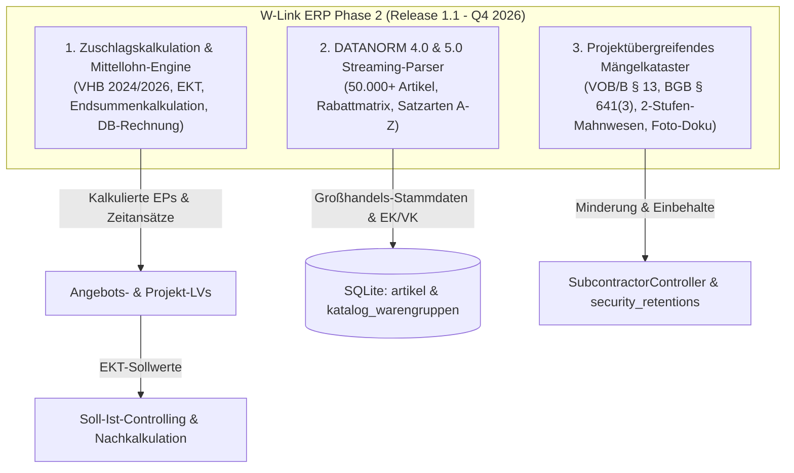
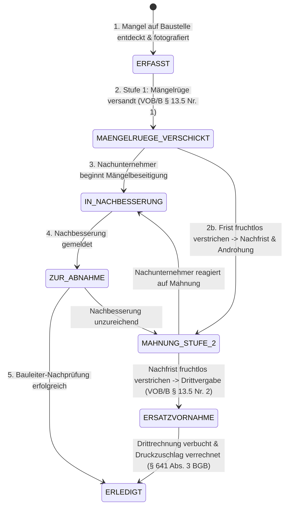
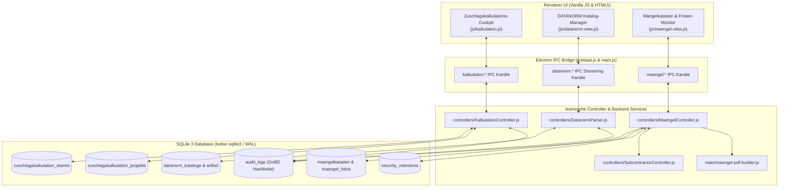
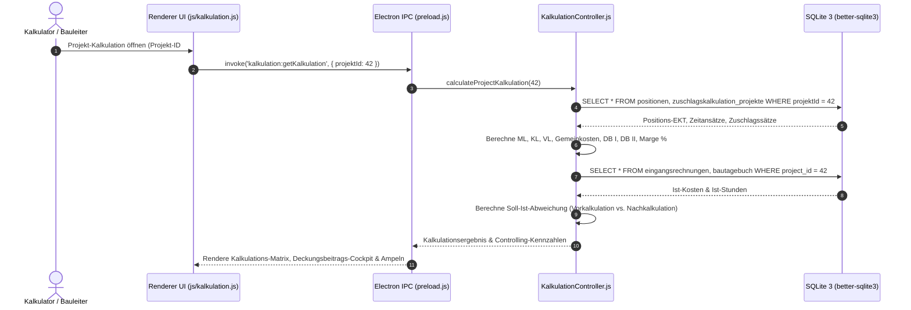
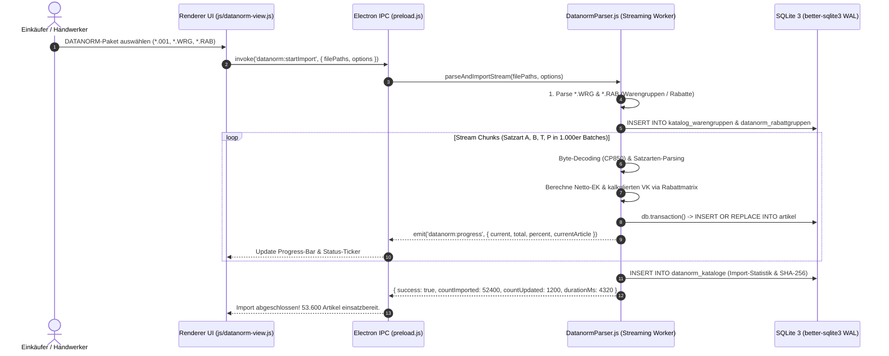

# IMPLEMENTIERUNGSPLAN PHASE 2 (RELEASE 1.1) – ZUSCHLAGSKALKULATION & MITTELLOHN-ENGINE, DATANORM 4.0/5.0 STREAMING-PARSER & PROJEKTÜBERGREIFENDES MÄNGELKATASTER MIT FRISTENMANAGEMENT

**Version:** 1.1.0-PROD-PLAN (30.08.2026)  
**Status:** FREIGEGEBEN ZUR PRODUKTIONS-IMPLEMENTIERUNG (Release 1.1 – Q4 2026)  
**Autor:** Leitender Software-Architekt & Baubetriebs-Experte für W-Link ERP  
**Ziel-Datei:** `plans/phase2-zuschlagskalkulation-datanorm-maengelkataster-plan.md`  
**Referenz:** Ergänzung und Fortführung von `plans/phase1-efb-gaebx31-autobackup-plan.md`  
**Zielgruppe:** Senior Software-Architekten, Backend-/Frontend-Entwickler, Code-Subagents, QA-Engineers, Baubetriebswirte, Bauleiter & Kalkulatoren  

---

### Projektkonventionen & Leitlinien:
1. **Zero Heavy Dependencies / 100% Offline-First:** Autarke Desktop-Applikation auf Electron 32+ & Node.js 20+ mit `better-sqlite3`. Keine externen Cloud-Zusatzdienste, keine SaaS-Bindung, keine API-Token-Abhängigkeiten.
2. **Isomorpher Modulaufbau:** Alle Rechenkerne, Parser und Controller (`KalkulationController.js`, `DatanormParser.js`, `MaengelController.js`) sind isomorph aufgebaut (`module.exports` UND `window.*`), damit sie sowohl im Backend/Node.js-Runner/Unit-Tests als auch im Renderer/UI synchron und latenzfrei ausgeführt werden können.
3. **Transaktionale Datenintegrität:** Alle Schreiboperationen in SQLite laufen transaktional (`db.transaction()`) im WAL-Modus (`PRAGMA journal_mode = WAL;`) mit GoBD-konformer Prüfsummen- und Audit-Protokollierung (`audit_logs`).
4. **Normtreue & Mathematische Exaktheit:** 
   - Kalkulation nach **VHB 2024/2026 (BMWSB)**, **KLR Bau (Hauptverband der Deutschen Bauindustrie)** und **KAS (Kalkulations- und Abrechnungsschemata)**: 4 Nachkommastellen intern, kaufmännisch/normgerecht auf 2 Nachkommastellen gerundet.
   - Katalogimport nach **DATANORM 4.0 (1994) & DATANORM 5.0 (1999)**: Unterstützung aller Satzarten (A, B, C, P, R, S, T, V, Z, G) mit Zeichensatz-Streaming (CP850 / ISO-8859-1 / UTF-8) und speichereffizienter Batch-Persistierung (50.000+ Datensätze ohne Heap-Overflow).
   - Baurecht nach **VOB/B (Ausgabe 2019 / 2026)** §§ 12, 13 und **BGB** §§ 634, 635, 640, 641 Abs. 3 (Druckzuschlag mind. doppelter Mängelbeseitigungsaufwand).

---

## 0. Executive Summary & Zieldefinition (Release 1.1)

W-Link ERP wird mit Release 1.1 vom reinen Abrechnungs- und Fakturierungsprogramm zu einem vollwertigen, baubetrieblichen ERP- und Bauleiter-Arbeitsplatz ausgebaut. Während Phase 1 (Release 1.0.6) die EFB-Preisblätter 221/223, GAEB X31 und das Revisions-Backup etabliert hat, liefert Phase 2 die drei produktivitätsentscheidenden Module für den handwerklichen und bauwirtschaftlichen Alltag:



### 0.1 Die drei Kernziele von Phase 2

1. **Vollwertiger Zuschlagskalkulations-Editor & Mittellohn-Engine:**
   - **Mittellohn-Kalkulation (ML-Engine):** Ermittlung des betrieblichen Mittellohns aus Stammarbeitern, Facharbeitern, Vorarbeitern und Polieren. Berechnung von lohngebundenen Kosten (Sozialkassenbeiträge SOKA-BAU, BG BAU, gesetzliche Sozialversicherung) und Lohnnebenkosten (Auslösungen, Wegezeiten, Fahrgelder, Erschwerniszulagen) zum Kalkulationslohn ($KL$) und Verrechnungslohn ($VL$).
   - **Kalkulationsverfahren:** Vollständige Unterstützung von **Zuschlagskalkulation** (prozentuale Gemeinkostenzuschläge BGK, AGK, W&G je Kostenart) und **Endsummenkalkulation** (auftragsbezogene Ermittlung der Baustellengemeinkosten BGK mit Verteilung über Herstellkosten oder Fertigungslohnstunden).
   - **Margen- & Deckungsbeitrags-Cockpit:** Ermittlung von Deckungsbeitrag $DB_I$ ($\text{Erlös} - EKT$), $DB_{II}$ ($DB_I - BGK$), Deckungsbeitragsquote ($\%$) und Gewinnschwelle (Break-Even).
   - **Vor- und Nachkalkulation:** Nahtloser Soll-Ist-Abgleich der kalkulierten EKT gegen tatsächliche Eingangsrechnungen (`eingangsrechnungen`) und erfasste Personal-/Gerätestunden (`bautagebuch`).

2. **DATANORM 4.0 & 5.0 High-Performance Import-Engine:**
   - **Vollständige Standard-Abdeckung:** Streaming-fähiger Parser für die Satzarten `V` (Vorlauf), `A` (Artikelhauptsatz), `B` (Artikelnebensatz), `C` (Leistungssätze), `P` (Preisänderungen), `R` (Rabattgruppen), `S` (Warengruppen), `T` (Langtexte), `Z` (Staffelpreise/Rohstoffzuschläge) und `G` (Grafiken).
   - **Multi-File Unterstützung:** Automatische Erkennung und sequenzielle Verarbeitung von Dateisammlungen (`DATANORM.001` bis `DATANORM.999`, `DATANORM.WRG`, `DATANORM.RAB`, `DATATEXT.001`, `DATPREIS.001`, `DATASETS.001`).
   - **High-Performance Streaming:** Asynchrone Stream-Pipeline mit CP850/ISO-8859-1 Byte-Decoding, Chunk-Pufferung und Transaktions-Batches in 1.000er Blöcken für 50.000+ Artikel in unter 5 Sekunden ohne UI-Blockade.
   - **Kalkulationsaufschlag & Rabattmatrix:** Automatisches Berechnen von Netto-Einkaufspreisen (EK) und kalkulierten Verkaufspreisen (VK) anhand frei konfigurierbarer Rabatt- und Aufschlagsmatrizen je Warengruppe oder Lieferant.

3. **Projektübergreifendes Mängelkataster & Fristenmanagement:**
   - **Verortung nach Raumhierarchie:** Präzise Zuweisung von Mängeln über die Objektverwaltung (Liegenschaft $\to$ Gebäude $\to$ Etage $\to$ Raum) oder Freitext-Bauteil/Gewerk mit Fotobeweisen (integrierte Bildkomprimierung & Thumbnails).
   - **Normtreuer Mängel-Workflow:** Status-Übergänge `ERFASST` $\to$ `MAENGELRUEGE_VERSCHICKT` $\to$ `IN_NACHBESSERUNG` $\to$ `ZUR_ABNAHME` $\to$ `ERLEDIGT` / `ERSATZVORNAHME` mit lückenlosem Audit-Log.
   - **Fristenüberwachung mit Ampelsystem:** Gesetzliche Fristenberechnung nach VOB/B § 13 Abs. 4 (4 Jahre Bauwerke, 2 Jahre Elektro/Maschinen) und BGB § 634a (5 Jahre). Visuelle Fristen-Ampel (Grün $> 7$ Tage, Gelb $\le 7$ Tage, Rot überfällig).
   - **2-stufiger Mahnschreiben-Generator:**
     * *Stufe 1:* Mängelrüge mit kalendarischer Nacherfüllungsfrist (§ 13 Abs. 5 Nr. 1 VOB/B).
     * *Stufe 2:* Nachfristsetzung mit Androhung von Ersatzvornahme (§ 13 Abs. 5 Nr. 2 VOB/B) und Ankündigung von Druckzuschlag / Einbehalt nach § 641 Abs. 3 BGB (mind. doppelte Beseitigungskosten).
   - **Verknüpfung mit Subunternehmern & Einbehalten:** Automatische Gegenrechnung von Ersatzvornahmekosten gegen offene Eingangsrechnungen oder Sicherheitseinbehalte (`security_retentions`) via `SubcontractorController`.

---

## 1. Fachlicher, normativer & baubetrieblicher Hintergrund

### 1.1 Baubetriebliche Kalkulation nach VHB Bund & KLR Bau

Die Kalkulation im Baubetrieb folgt streng hierarchischen Kostenstufen:

```
+----------------------------------------------------------------------------------------------------+
| KOSTENGLIEDERUNG NACH KLR BAU & VHB BUND (FORMBLATT 221 / 222)                                     |
+----------------------------------------------------------------------------------------------------+
| 1. Einzelkosten der Teilleistungen (EKT)                                                           |
|    - Lohnkosten: Fertigungsstunden x Kalkulationslohn (KL)                                         |
|    - Stoffkosten: Material-Einkaufspreis (EK) frei Baustelle inkl. Verschnitt                     |
|    - Gerätekosten: Vorhalte-, Bereitstellungs- und Betriebskosten (BGL/Euroliste)                  |
|    - Sonstige Kosten: Transport, Deponiegebühren, Fremdleistungen, Rüstkosten                      |
|    - Nachunternehmerleistungen (NU): Fremdvergebene Gewerke / Nachunternehmerverträge              |
+----------------------------------------------------------------------------------------------------+
| 2. Baustellengemeinkosten (BGK)                                                                    |
|    - Einrichten und Räumen der Baustelle (Kranaufstellung, Baustellenschild, Container)           |
|    - Vorhalten der Baustelleneinrichtung (Gerüste, Bauzaun, Strom/Wasser-Pauschale)                |
|    - Technische Bearbeitung & Bauleitung (Projektleiter, Polier, Abrechner)                        |
|    - Qualitätsprüfungen, Vermessung, Bauabnahme-Kosten                                             |
+----------------------------------------------------------------------------------------------------+
| 3. Allgemeine Geschäftskosten (AGK)                                                                |
|    - Kosten der Unternehmensleitung, Verwaltung, Bürogebäude, Buchhaltung, IT, Marketing          |
+----------------------------------------------------------------------------------------------------+
| 4. Wagnis & Gewinn (W&G)                                                                           |
|    - Betriebsbezogenes Wagnis (Unternehmerrisiko, Konjunktur, Ausfallrisiko)                       |
|    - Leistungsbezogenes Wagnis (Witterung, Baugrundrisiko, technische Schwierigkeiten)             |
|    - Gewinn (Kalkulierter Unternehmergewinn / Rendite)                                             |
+----------------------------------------------------------------------------------------------------+
```

#### A. Mittellohn-Kalkulation (ML-Formelsatz nach VHB 2024/2026)

Der betriebliche Mittellohn ($ML$) ist das gewichtete arithmetische Mittel der Grundlöhne einer Kolonne:

$$ML = \frac{\sum_{i=1}^n (\text{Anzahl Arbeiter}_i \times \text{Tarif-/Effektivlohn}_i)}{\sum_{i=1}^n \text{Anzahl Arbeiter}_i}$$

Daraus leitet sich der **Kalkulationslohn ($KL$)** und der **Verrechnungslohn ($VL$)** ab:

1. **Lohngebundene Kosten ($LK$ in $\%$):** Gesetzliche und tarifliche Sozialaufwendungen, SOKA-BAU (Urlaubskasse, Zusatzversorgung), Berufsgenossenschaft (BG BAU):
   $$LK_{\text{EUR}} = ML \times \frac{LK_{\%}}{100}$$
2. **Lohnnebenkosten ($LNK$ in $\%$):** Fahrgelder, Wegezeitentschädigung, Auslösungen, Erschwernis- und Überstundenzuschläge:
   $$LNK_{\text{EUR}} = ML \times \frac{LNK_{\%}}{100}$$
3. **Kalkulationslohn ($KL$):** Stundensatz der Einzelkosten für die Arbeitskraft:
   $$KL = ML + LK_{\text{EUR}} + LNK_{\text{EUR}}$$
4. **Verrechnungslohn ($VL$):** Angebotener Stundenverrechnungssatz inkl. Gemeinkosten und Gewinn:
   $$VL = KL \times \left(1 + \frac{BGK_{\text{Lohn}} + AGK_{\text{Lohn}} + W\&G_{\text{Lohn}}}{100}\right)$$

#### B. Vergleich: Zuschlagskalkulation vs. Endsummenkalkulation

| Kalkulationsmerkmal | Zuschlagskalkulation (EFB 221) | Endsummenkalkulation (EFB 222) |
| :--- | :--- | :--- |
| **Baustellengemeinkosten (BGK)** | Werden über feste, prozentuale Zuschlagssätze auf die EKT umgelegt ($10 - 25\%$). | Werden auftragsbezogen als konkrete Positionen ermittelt (z. B. Kranmiete, Bauleitung). |
| **Allgemeine Geschäftskosten (AGK)** | Prozentualer Zuschlag auf EKT je Kostenart ($12 - 22\%$). | Prozentualer Zuschlag auf die Herstellkosten ($EKT + BGK$). |
| **Wagnis & Gewinn (W&G)** | Prozentualer Zuschlag auf EKT ($5 - 10\%$). | Prozentualer Zuschlag auf die Selbstkosten ($EKT + BGK + AGK$). |
| **Typisches Einsatzgebiet** | Handwerk, Klein-/Mittelprojekte, Standardisierte Bauleistungen. | Großbauprojekte, Generalunternehmer, Ingenieurbau mit komplexer Baustelleneinrichtung. |

#### C. Deckungsbeitrags- und Margenanalyse

$$\text{Deckungsbeitrag I } (DB_I) = \text{Netto-Umsatzerlös} - \text{Einzelkosten } (EKT)$$
$$\text{Deckungsbeitragsquote } (DB\%) = \frac{DB_I}{\text{Netto-Umsatzerlös}} \times 100$$
$$\text{Deckungsbeitrag II } (DB_{II}) = DB_I - \text{auftragsbezogene BGK}$$
$$\text{Reingewinn} = DB_{II} - \text{zugerechnete AGK}$$
$$\text{Umsatzrendite (Marge } \%) = \frac{\text{Reingewinn}}{\text{Netto-Umsatzerlös}} \times 100$$

---

### 1.2 DATANORM 4.0 & 5.0 Standard-Spezifikation

DATANORM ist das Standard-Dateiformat des deutschen Handwerks zum Austausch von Artikelkatalogen, Rabatten und Preisen zwischen Großhandel und Handwerkssoftware.

```
+----------------------------------------------------------------------------------------------------+
| DATANORM 4.0 / 5.0 DATEITYPEN & DATEINAMEN-KONVENTIONEN                                             |
+----------------------------------------------------------------------------------------------------+
| DATANORM.001 - DATANORM.999 : Artikelstammdaten (Neuanlage, Änderung, Löschung)                    |
| DATATEXT.001 - DATATEXT.999 : Ungebundene Langtexte und Ausschreibungstexte                         |
| DATPREIS.001 - DATPREIS.999 : Reine Preisänderungsdateien (Satzart P)                               |
| DATASETS.001 - DATASETS.999 : Stücklisten und Set-Zusammenstellungen (Satzart C / Sets)            |
| DATANORM.WRG                : Warengruppen-Definitionen (Satzart S)                                 |
| DATANORM.RAB                : Rabattgruppen-Definitionen (Satzart R)                                |
+----------------------------------------------------------------------------------------------------+
```

#### Satzarten-Übersicht & Feldaufbau:

1. **Satzart `V` (Vorlaufsatz / Header):**
   - Syntax: `V;VerarbeitungsKZ;Datum;Lieferantennummer;Lieferantenname;Währung;DATANORM-Version;...`
   - Beispiel: `V;N;300826;10045;Mustergroßhandel GmbH;EUR;5;0;Musterkatalog 2026`
2. **Satzart `A` (Artikelhauptsatz):**
   - Syntax: `A;VerarbeitungsKZ;Artikelnummer;TextKZ;Matchcode;Text1;Text2;Preiskennzeichen;Preiseinheit;Mengeneinheit;EK_oder_VK;Rabattgruppe;Hauptwarengruppe;Warengruppe;Langtextschlüssel`
   - Preiskennzeichen: `1` = Bruttopreis (Katalogpreis vor Rabatt), `2` = Nettopreis (bereits rabattierter Einkaufspreis).
   - Beispiel: `A;N;SAN-47110;1;WT-MISCHER;Waschtisch-Einhebelmischer;Chrom mit Ablaufgarnitur;1;1;Stk;145.80;05;10;102;T004711`
3. **Satzart `B` (Artikelnebensatz / Technische Spezifikationen):**
   - Syntax: `B;VerarbeitungsKZ;Artikelnummer;EAN;Herstellernummer;Bestellnummer;Kupfergewicht;Katalognummer;Maße/Gewicht`
   - Beispiel: `B;A;SAN-47110;4012345678901;GROHE-32843000;BEST-9921;0.000;KAT-S.142;1.85kg`
4. **Satzart `C` (Leistungssatz / Arbeitszeitrichtwerte):**
   - Syntax: `C;VerarbeitungsKZ;Leistungsnummer;Kurztext;Arbeitszeit_Minuten;Lohnart;Material_ArtNr;Material_Menge`
5. **Satzart `P` (Preisänderungssatz):**
   - Syntax: `P;VerarbeitungsKZ;Artikelnummer;Preiskennzeichen;Preiseinheit;Mengeneinheit;NeuerPreis;Rabattgruppe`
6. **Satzart `R` (Rabattgruppensatz):**
   - Syntax: `R;VerarbeitungsKZ;Rabattgruppe;Bezeichnung;Rabattsatz1;Rabattsatz2;Zuschlagssatz`
   - Beispiel: `R;N;05;Sanitär-Armaturen Markenhersteller;35.00;5.00;0.00`
7. **Satzart `S` (Warengruppensatz):**
   - Syntax: `S;VerarbeitungsKZ;Hauptwarengruppe;Warengruppe;Bezeichnung`
   - Beispiel: `S;N;10;102;Sanitär Einhebelmischer & Zubehör`
8. **Satzart `T` (Langtextsatz):**
   - Syntax: `T;VerarbeitungsKZ;Langtextschlüssel;Zeilennummer;Textzeile`
9. **Satzart `Z` (Staffelpreise & Rohstoffzuschläge):**
   - Syntax: `Z;VerarbeitungsKZ;Artikelnummer;Staffelmenge;Staffelpreis;Staffelrabatt;Rohstoffbasis;DEL-Notiz`

---

### 1.3 Projektübergreifendes Mängelkataster & Fristenmanagement

Das Mängelmanagement auf Baustellen unterliegt den strengen Formvorschriften der VOB/B und des BGB:



#### A. Gesetzliche Verjährungs- und Nacherfüllungsfristen

1. **Reguläre Gewährleistungsfristen nach Abnahme (§ 13 Abs. 4 VOB/B):**
   - **4 Jahre** für Bauwerke und damit fest verbundene Bauteile.
   - **2 Jahre** für maschinelle und elektrotechnische/elektronische Anlagen (z. B. Lüftungsanlagen, Steuerungen), wenn Wartung nicht an Auftragnehmer übertragen.
   - **1 Jahr** für feuerungsberührte Teile von Kesselanlagen.
   - **5 Jahre** bei Verträgen nach BGB (§ 634a Abs. 1 Nr. 2 BGB).
2. **Hemmung & Neubeginn durch Mängelrüge (§ 13 Abs. 5 Nr. 1 VOB/B):**
   - Geht dem Auftragnehmer vor Ablauf der Verjährungsfrist eine schriftliche Mängelrüge zu, verjährt der Mängelbeseitigungsanspruch in **2 Jahren ab Zugang der Rüge**, jedoch nicht vor Ablauf der regulären Verjährungsfrist.
3. **Ersatzvornahme & Druckzuschlag (§ 13 Abs. 5 Nr. 2 VOB/B & § 641 Abs. 3 BGB):**
   - Lässt der Auftragnehmer die ihm gesetzte angemessene Nachfrist verstreichen, darf der Auftraggeber die Mängel auf Kosten des Auftragnehmers durch Dritte beseitigen lassen (**Ersatzvornahme**).
   - Bis zur vollständigen Mängelbeseitigung darf der Auftraggeber gem. **§ 641 Abs. 3 BGB** mindestens das **Doppelte der voraussichtlichen Mängelbeseitigungskosten (Druckzuschlag)** von der fälligen Vergütung oder aus dem Sicherheitseinbehalt (`security_retentions`) einbehalten.

---

## 2. Systemarchitektur & Datenflussdiagramme

### 2.1 Gesamtsystem-Komponentenübersicht



### 2.2 Datenfluss: Zuschlagskalkulation & Soll-Ist-Controlling



### 2.3 Datenfluss: DATANORM High-Performance Streaming-Import



---

## 3. Teil 1: Zuschlagskalkulations-Editor & Mittellohn-Engine

### 3.1 Mathematisches Rechenwerk & Formelapparat

```
+----------------------------------------------------------------------------------------------------+
| ZUSCHLAGSKALKULATIONS- & DECKUNGSBEITRAGS-MODELL                                                   |
+----------------------------------------------------------------------------------------------------+
| 1. MITTELLOHN UND LOHNNEBENKOSTEN                                                                  |
|    Mittellohn (ML) .............................................................. [  26.00 ] €/h   |
|    + Lohngebundene Kosten (LK) ........................................ [ 84.50 %] = [  21.97 ] €/h   |
|    + Lohnnebenkosten (LNK) ............................................ [ 13.50 %] = [   3.51 ] €/h   |
|    = KALKULATIONSLOHN (KL) = ML + LK + LNK ...................................... [  51.48 ] €/h   |
|    + Zuschlag Lohn (BGK + AGK + W&G) .................................. [ 48.00 %] = [  24.71 ] €/h   |
|    = VERRECHNUNGSLOHN (VL) = KL x (1 + Zuschlag Lohn) ........................... [  76.19 ] €/h   |
+----------------------------------------------------------------------------------------------------+
| 2. GEMEINKOSTEN-ZUSCHLAGSMATRIX AUF EKT IN %                                                       |
|    Kostenart:                 Lohn (1)    Stoffe (2)   Geräte (3)   Sonstiges (4)   NU-Leistung (5)|
|    - Baustellengemeinkosten:   18.00 %     12.00 %      15.00 %      10.00 %          8.00 %       |
|    - Allg. Geschäftskosten:    22.00 %     14.00 %      16.00 %      12.00 %         10.00 %       |
|    - Wagnis & Gewinn:           8.00 %      6.00 %       6.00 %       5.00 %          4.00 %       |
|    = GESAMTZUSCHLAG:           48.00 %     32.00 %      37.00 %      27.00 %         22.00 %       |
+----------------------------------------------------------------------------------------------------+
| 3. POSITIONS-KALKULATION (BEISPIEL: 100 m² KALKSANDSTEIN-MAUERWERK)                               |
|    - Zeitansatz: 0.85 h/m² -> Lohn-EKT = 0.85 x 51.48 € = 43.76 €/m² -> VK Lohn = 64.76 €/m²       |
|    - Stoff-EKT: Steine & Mörtel = 35.00 €/m² -------------> VK Stoffe = 35.00 x 1.32 = 46.20 €/m²   |
|    - Geräte-EKT: Versetzkran = 4.50 €/m² -----------------> VK Geräte = 4.50 x 1.37 =  6.17 €/m²   |
|    - Sonstige-EKT: Transport = 2.00 €/m² -----------------> VK Sonst = 2.00 x 1.27  =  2.54 €/m²   |
|    = EINHEITSPREIS (EP) NETTO = 64.76 + 46.20 + 6.17 + 2.54 = 119.67 €/m²                          |
|    = GESAMTBETRAG (GP) = 100 m² x 119.67 €/m² = 11.967,00 €                                        |
|    - EKT gesamt = (43.76 + 35.00 + 4.50 + 2.00) x 100 = 8.526,00 €                                 |
|    = DECKUNGSBEITRAG I (DB I) = 11.967,00 € - 8.526,00 € = 3.441,00 € (DB-Quote: 28.75 %)          |
+----------------------------------------------------------------------------------------------------+
```

### 3.2 Isomorpher Controller: `controllers/KalkulationController.js`

```javascript
/**
 * controllers/KalkulationController.js - Baubetriebliche Zuschlags- & Endsummenkalkulation
 * Konform nach VHB 2024/2026 (BMWSB) und KLR Bau.
 * Isomorph aufgebaut für Node.js Backend und Electron Renderer.
 */

class KalkulationController {
    /**
     * Standard-Kalkulationsprofil mit branchenüblichen Standardwerten.
     */
    static getDefaultProfile() {
        return {
            name: 'Standard Bau-Kalkulation (VHB 2024/2026)',
            mittellohn_eur: 26.00,
            lohngebundene_kosten_prozent: 84.50,
            lohnnebenkosten_prozent: 13.50,
            kalkulationslohn_eur: 51.48,
            kalkulationsverfahren: 'ZUSCHLAGSKALKULATION', // 'ZUSCHLAGSKALKULATION' | 'ENDSUMMENKALKULATION'
            endsumme_umlage_basis: 'HERSTELLKOSTEN', // 'HERSTELLKOSTEN' | 'LOHNSTUNDEN'
            zuschlag_lohn_bgk: 18.00,
            zuschlag_lohn_agk: 22.00,
            zuschlag_lohn_wug: 8.00,
            zuschlag_stoff_bgk: 12.00,
            zuschlag_stoff_agk: 14.00,
            zuschlag_stoff_wug: 6.00,
            zuschlag_geraet_bgk: 15.00,
            zuschlag_geraet_agk: 16.00,
            zuschlag_geraet_wug: 6.00,
            zuschlag_sonst_bgk: 10.00,
            zuschlag_sonst_agk: 12.00,
            zuschlag_sonst_wug: 5.00,
            zuschlag_nu_bgk: 8.00,
            zuschlag_nu_agk: 10.00,
            zuschlag_nu_wug: 4.00,
            wug_gewinn_prozent: 5.00,
            wug_betriebswagnis_prozent: 2.00,
            wug_leistungswagnis_prozent: 1.00,
            skonto_abzug_kalkulation_prozent: 0.00
        };
    }

    /**
     * Berechnet den Mittellohn, Kalkulationslohn und Verrechnungslohn.
     * @param {Object} profile - Zuschlagsprofil
     */
    static calculateMittellohnStructure(profile = {}) {
        const ml = parseFloat(profile.mittellohn_eur) || 26.00;
        const lkPct = parseFloat(profile.lohngebundene_kosten_prozent) || 84.50;
        const lnkPct = parseFloat(profile.lohnnebenkosten_prozent) || 13.50;

        const lkEur = Math.round((ml * (lkPct / 100)) * 10000) / 10000;
        const lnkEur = Math.round((ml * (lnkPct / 100)) * 10000) / 10000;
        const kalkulationslohn = Math.round((ml + lkEur + lnkEur) * 100) / 100;

        const bgkLohn = parseFloat(profile.zuschlag_lohn_bgk) || 18.00;
        const agkLohn = parseFloat(profile.zuschlag_lohn_agk) || 22.00;
        const wugLohn = parseFloat(profile.zuschlag_lohn_wug) || 8.00;
        const gesamtZuschlagLohn = Math.round((bgkLohn + agkLohn + wugLohn) * 100) / 100;

        const zuschlagLohnEur = Math.round((kalkulationslohn * (gesamtZuschlagLohn / 100)) * 100) / 100;
        const verrechnungslohn = Math.round((kalkulationslohn + zuschlagLohnEur) * 100) / 100;

        return {
            mittellohn: ml,
            lohngebundeneKosten: { prozent: lkPct, eur: Math.round(lkEur * 100) / 100 },
            lohnnebenkosten: { prozent: lnkPct, eur: Math.round(lnkEur * 100) / 100 },
            kalkulationslohn,
            zuschlagLohn: { prozent: gesamtZuschlagLohn, bgk: bgkLohn, agk: agkLohn, wug: wugLohn, eur: zuschlagLohnEur },
            verrechnungslohn
        };
    }

    /**
     * Berechnet eine einzelne LV-Position nach dem Zuschlagskalkulationsverfahren.
     */
    static calculatePosition(pos = {}, profile = {}) {
        const mlStruct = KalkulationController.calculateMittellohnStructure(profile);
        const kl = mlStruct.kalkulationslohn;
        const vl = mlStruct.verrechnungslohn;

        const menge = parseFloat(pos.menge) || 0;
        const zeitansatz = parseFloat(pos.zeitansatz_h) || 0; // h je Mengeneinheit
        
        // EKT je Mengeneinheit
        const ektLohnJeMe = Math.round((zeitansatz * kl) * 10000) / 10000;
        const ektStoffJeMe = parseFloat(pos.ekt_stoff_je_me) || (pos.cost_type === 'MATERIAL' ? (parseFloat(pos.ek) || 0) : 0);
        const ektGeraetJeMe = parseFloat(pos.ekt_geraet_je_me) || (pos.cost_type === 'GERÄT' ? (parseFloat(pos.ek) || 0) : 0);
        const ektSonstJeMe = parseFloat(pos.ekt_sonst_je_me) || (pos.cost_type === 'SONSTIGES' ? (parseFloat(pos.ek) || 0) : 0);
        const ektNuJeMe = parseFloat(pos.ekt_nu_je_me) || (pos.cost_type === 'SUB' ? (parseFloat(pos.ek) || 0) : 0);

        const summeEktJeMe = Math.round((ektLohnJeMe + ektStoffJeMe + ektGeraetJeMe + ektSonstJeMe + ektNuJeMe) * 100) / 100;

        // Zuschläge je Kostenart
        const zStoff = (parseFloat(profile.zuschlag_stoff_bgk) || 12) + (parseFloat(profile.zuschlag_stoff_agk) || 14) + (parseFloat(profile.zuschlag_stoff_wug) || 6);
        const zGeraet = (parseFloat(profile.zuschlag_geraet_bgk) || 15) + (parseFloat(profile.zuschlag_geraet_agk) || 16) + (parseFloat(profile.zuschlag_geraet_wug) || 6);
        const zSonst = (parseFloat(profile.zuschlag_sonst_bgk) || 10) + (parseFloat(profile.zuschlag_sonst_agk) || 12) + (parseFloat(profile.zuschlag_sonst_wug) || 5);
        const zNu = (parseFloat(profile.zuschlag_nu_bgk) || 8) + (parseFloat(profile.zuschlag_nu_agk) || 10) + (parseFloat(profile.zuschlag_nu_wug) || 4);

        // VK-Anteile je ME
        const vkLohnJeMe = Math.round((zeitansatz * vl) * 100) / 100;
        const vkStoffJeMe = Math.round((ektStoffJeMe * (1 + zStoff / 100)) * 100) / 100;
        const vkGeraetJeMe = Math.round((ektGeraetJeMe * (1 + zGeraet / 100)) * 100) / 100;
        const vkSonstJeMe = Math.round((ektSonstJeMe * (1 + zSonst / 100)) * 100) / 100;
        const vkNuJeMe = Math.round((ektNuJeMe * (1 + zNu / 100)) * 100) / 100;

        const kalkulierterEpNetto = Math.round((vkLohnJeMe + vkStoffJeMe + vkGeraetJeMe + vkSonstJeMe + vkNuJeMe) * 100) / 100;
        const finalEp = parseFloat(pos.preis) > 0 ? parseFloat(pos.preis) : kalkulierterEpNetto;
        const gesamtbetragNetto = Math.round((menge * finalEp) * 100) / 100;

        // Deckungsbeitrag I je Position
        const ektGesamtPos = Math.round((summeEktJeMe * menge) * 100) / 100;
        const deckungsbeitrag1 = Math.round((gesamtbetragNetto - ektGesamtPos) * 100) / 100;
        const db1Quote = gesamtbetragNetto > 0 ? Math.round((deckungsbeitrag1 / gesamtbetragNetto) * 10000) / 100 : 0;

        return {
            id: pos.id,
            oz_code: pos.oz_code || '',
            name: pos.name || '',
            menge,
            einheit: pos.einheit || 'Stk.',
            zeitansatz_h: zeitansatz,
            gesamtstunden: Math.round(menge * zeitansatz * 100) / 100,
            ekt: {
                lohnJeMe: Math.round(ektLohnJeMe * 100) / 100,
                stoffJeMe: ektStoffJeMe,
                geraetJeMe: ektGeraetJeMe,
                sonstJeMe: ektSonstJeMe,
                nuJeMe: ektNuJeMe,
                summeJeMe: summeEktJeMe,
                summeGesamt: ektGesamtPos
            },
            vkAnteile: {
                lohnJeMe: vkLohnJeMe,
                stoffJeMe: vkStoffJeMe,
                geraetJeMe: vkGeraetJeMe,
                sonstJeMe: vkSonstJeMe,
                nuJeMe: vkNuJeMe
            },
            einheitspreis: finalEp,
            gesamtbetragNetto,
            deckungsbeitrag1,
            db1Quote
        };
    }

    /**
     * Berechnet die vollständige Projekt-Kalkulation inklusive Deckungsbeiträgen und Margen.
     */
    static calculateProjectKalkulation(positions = [], profile = {}, actualCosts = { material: 0, sub: 0, hours: 0 }) {
        const p = { ...KalkulationController.getDefaultProfile(), ...profile };
        const mlStruct = KalkulationController.calculateMittellohnStructure(p);

        let summeEktLohn = 0;
        let summeEktStoffe = 0;
        let summeEktGeraete = 0;
        let summeEktSonstige = 0;
        let summeEktNu = 0;
        let summeGesamtstunden = 0;
        let summeAngebotNetto = 0;

        const calculatedPositions = positions.map(pos => {
            const res = KalkulationController.calculatePosition(pos, p);
            summeEktLohn += res.ekt.lohnJeMe * res.menge;
            summeEktStoffe += res.ekt.stoffJeMe * res.menge;
            summeEktGeraete += res.ekt.geraetJeMe * res.menge;
            summeEktSonstige += res.ekt.sonstJeMe * res.menge;
            summeEktNu += res.ekt.nuJeMe * res.menge;
            summeGesamtstunden += res.gesamtstunden;
            summeAngebotNetto += res.gesamtbetragNetto;
            return res;
        });

        const summeEktGesamt = Math.round((summeEktLohn + summeEktStoffe + summeEktGeraete + summeEktSonstige + summeEktNu) * 100) / 100;
        summeAngebotNetto = Math.round(summeAngebotNetto * 100) / 100;

        // Deckungsbeitrag I & Gemeinkosten
        const deckungsbeitrag1Gesamt = Math.round((summeAngebotNetto - summeEktGesamt) * 100) / 100;
        const db1QuoteGesamt = summeAngebotNetto > 0 ? Math.round((deckungsbeitrag1Gesamt / summeAngebotNetto) * 10000) / 100 : 0;

        // Kalkulierte Gemeinkosten-Anteile (BGK, AGK, W&G)
        const bgkGesamt = Math.round((
            summeEktLohn * (p.zuschlag_lohn_bgk / 100) +
            summeEktStoffe * (p.zuschlag_stoff_bgk / 100) +
            summeEktGeraete * (p.zuschlag_geraet_bgk / 100) +
            summeEktSonstige * (p.zuschlag_sonst_bgk / 100) +
            summeEktNu * (p.zuschlag_nu_bgk / 100)
        ) * 100) / 100;

        const agkGesamt = Math.round((
            summeEktLohn * (p.zuschlag_lohn_agk / 100) +
            summeEktStoffe * (p.zuschlag_stoff_agk / 100) +
            summeEktGeraete * (p.zuschlag_geraet_agk / 100) +
            summeEktSonstige * (p.zuschlag_sonst_agk / 100) +
            summeEktNu * (p.zuschlag_nu_agk / 100)
        ) * 100) / 100;

        const wugGesamt = Math.round((
            summeEktLohn * (p.zuschlag_lohn_wug / 100) +
            summeEktStoffe * (p.zuschlag_stoff_wug / 100) +
            summeEktGeraete * (p.zuschlag_geraet_wug / 100) +
            summeEktSonstige * (p.zuschlag_sonst_wug / 100) +
            summeEktNu * (p.zuschlag_nu_wug / 100)
        ) * 100) / 100;

        const deckungsbeitrag2Gesamt = Math.round((deckungsbeitrag1Gesamt - bgkGesamt) * 100) / 100;
        const kalkulierterGewinn = Math.round((deckungsbeitrag2Gesamt - agkGesamt) * 100) / 100;
        const gewinnMargeProzent = summeAngebotNetto > 0 ? Math.round((kalkulierterGewinn / summeAngebotNetto) * 10000) / 100 : 0;

        // Soll-Ist Nachkalkulations-Vergleich
        const istKostenLohn = Math.round((actualCosts.hours * mlStruct.kalkulationslohn) * 100) / 100;
        const istKostenGesamt = Math.round((istKostenLohn + (actualCosts.material || 0) + (actualCosts.sub || 0)) * 100) / 100;
        const abweichungEkt = Math.round((summeEktGesamt - istKostenGesamt) * 100) / 100;
        const istDeckungsbeitrag = Math.round((summeAngebotNetto - istKostenGesamt) * 100) / 100;

        return {
            mittellohnStructure: mlStruct,
            positions: calculatedPositions,
            totals: {
                summeGesamtstunden: Math.round(summeGesamtstunden * 100) / 100,
                summeEktLohn: Math.round(summeEktLohn * 100) / 100,
                summeEktStoffe: Math.round(summeEktStoffe * 100) / 100,
                summeEktGeraete: Math.round(summeEktGeraete * 100) / 100,
                summeEktSonstige: Math.round(summeEktSonstige * 100) / 100,
                summeEktNu: Math.round(summeEktNu * 100) / 100,
                summeEktGesamt,
                bgkGesamt,
                agkGesamt,
                wugGesamt,
                deckungsbeitrag1: deckungsbeitrag1Gesamt,
                db1Quote: db1QuoteGesamt,
                deckungsbeitrag2: deckungsbeitrag2Gesamt,
                kalkulierterGewinn,
                gewinnMargeProzent,
                summeAngebotNetto
            },
            nachkalkulation: {
                sollEkt: summeEktGesamt,
                istEkt: istKostenGesamt,
                istStunden: actualCosts.hours || 0,
                sollStunden: Math.round(summeGesamtstunden * 100) / 100,
                abweichungEkt,
                istDeckungsbeitrag,
                istDbQuote: summeAngebotNetto > 0 ? Math.round((istDeckungsbeitrag / summeAngebotNetto) * 10000) / 100 : 0
            }
        };
    }
}

if (typeof module !== 'undefined' && module.exports) {
    module.exports = KalkulationController;
}
if (typeof window !== 'undefined') {
    window.KalkulationController = KalkulationController;
}
```

---

## 4. Teil 2: DATANORM 4.0 & 5.0 High-Performance Import-Engine

### 4.1 Streaming-Parser-Architektur (`controllers/DatanormParser.js`)

Der DATANORM-Parser ist für sehr große Artikelkataloge ($> 50.000$ Artikelzeilen) konzipiert. Er verwendet `readline` und `stream` mit einer Puffergröße von 1.000 Datensätzen pro SQLite-Transaktion, um Speicherlecks zu verhindern und ein flüssiges UI-Feedback über IPC zu gewährleisten:

```javascript
/**
 * controllers/DatanormParser.js - High-Performance Streaming Parser für DATANORM 4.0 & 5.0
 * Unterstützt Satzarten V, A, B, C, P, R, S, T, Z.
 * Zeichensatz-Konvertierung: CP850 / ISO-8859-1 / UTF-8.
 */

const fs = require('fs');
const readline = require('readline');

class DatanormParser {
    /**
     * Dekodiert DOS-CP850-Bytes in UTF-8 Strings.
     */
    static decodeCp850(str) {
        if (!str) return '';
        // Native Zeichensatzersetzung für typische deutsche Umlaute und Sonderzeichen
        const map = {
            '\x84': 'ä', '\x94': 'ö', '\x81': 'ü',
            '\x8E': 'Ä', '\x99': 'Ö', '\x9A': 'Ü',
            '\xE1': 'ß', '\xF1': '²', '\xFD': '²'
        };
        return str.replace(/[\x81\x84\x8E\x94\x99\x9A\xE1\xF1\xFD]/g, ch => map[ch] || ch);
    }

    /**
     * Parst eine einzelne DATANORM-Zeile.
     */
    static parseLine(line) {
        if (!line || line.trim().length === 0) return null;
        const cleaned = DatanormParser.decodeCp850(line.trim());
        const fields = cleaned.split(';').map(f => f.trim());
        const satzart = fields[0] ? fields[0].toUpperCase() : '';

        switch (satzart) {
            case 'V': // Vorlaufsatz
                return {
                    type: 'VORLAUF',
                    verarbeitungsKz: fields[1] || 'N',
                    datum: fields[2] || '',
                    lieferantNr: fields[3] || '',
                    lieferantName: fields[4] || '',
                    waehrung: fields[5] || 'EUR',
                    version: fields[6] || '5',
                    katalogName: fields[8] || 'DATANORM Katalog'
                };

            case 'A': // Artikelhauptsatz
                return {
                    type: 'ARTIKEL_HAUPT',
                    verarbeitungsKz: fields[1] || 'N',
                    artikelNr: fields[2] || '',
                    textKz: fields[3] || '1',
                    matchcode: fields[4] || '',
                    kurztext1: fields[5] || '',
                    kurztext2: fields[6] || '',
                    preisKz: fields[7] || '1', // 1=Brutto, 2=Netto
                    preisEinheit: parseInt(fields[8], 10) || 1,
                    mengeneinheit: fields[9] || 'Stk.',
                    preis: parseFloat((fields[10] || '0').replace(',', '.')) || 0,
                    rabattGruppe: fields[11] || '',
                    hauptwarenGruppe: fields[12] || '',
                    warenGruppe: fields[13] || '',
                    langtextSchluessel: fields[14] || ''
                };

            case 'B': // Artikelnebensatz
                return {
                    type: 'ARTIKEL_NEBEN',
                    verarbeitungsKz: fields[1] || 'A',
                    artikelNr: fields[2] || '',
                    ean: fields[3] || '',
                    herstellerNr: fields[4] || '',
                    bestellNr: fields[5] || '',
                    kupferZahl: parseFloat((fields[6] || '0').replace(',', '.')) || 0,
                    katalogNummer: fields[7] || '',
                    abmessung: fields[8] || ''
                };

            case 'R': // Rabattsatz
                return {
                    type: 'RABATT_SATZ',
                    verarbeitungsKz: fields[1] || 'N',
                    rabattGruppe: fields[2] || '',
                    bezeichnung: fields[3] || '',
                    rabattProzent1: parseFloat((fields[4] || '0').replace(',', '.')) || 0,
                    rabattProzent2: parseFloat((fields[5] || '0').replace(',', '.')) || 0,
                    zuschlagProzent: parseFloat((fields[6] || '0').replace(',', '.')) || 0
                };

            case 'S': // Warengruppensatz
                return {
                    type: 'WARENGRUPPE_SATZ',
                    verarbeitungsKz: fields[1] || 'N',
                    hauptwarenGruppe: fields[2] || '',
                    warenGruppe: fields[3] || '',
                    bezeichnung: fields[4] || ''
                };

            case 'T': // Langtextsatz
                return {
                    type: 'LANGTEXT_SATZ',
                    verarbeitungsKz: fields[1] || 'N',
                    langtextSchluessel: fields[2] || '',
                    zeilenNr: parseInt(fields[3], 10) || 1,
                    text: fields.slice(4).join(' ')
                };

            case 'P': // Preisänderungssatz
                return {
                    type: 'PREIS_AENDERUNG',
                    verarbeitungsKz: fields[1] || 'A',
                    artikelNr: fields[2] || '',
                    preisKz: fields[3] || '1',
                    preisEinheit: parseInt(fields[4], 10) || 1,
                    mengeneinheit: fields[5] || 'Stk.',
                    preis: parseFloat((fields[6] || '0').replace(',', '.')) || 0,
                    rabattGruppe: fields[7] || ''
                };

            default:
                return { type: 'UNBEKANNT', satzart, raw: cleaned };
        }
    }

    /**
     * Führt einen speichereffizienten Streaming-Import einer DATANORM-Datei durch.
     */
    static async importDatanormFileStream(filePath, db, options = {}, progressCallback = null) {
        if (!fs.existsSync(filePath)) {
            throw new Error(`DATANORM-Datei nicht gefunden: ${filePath}`);
        }

        const fileStream = fs.createReadStream(filePath, { encoding: 'latin1' });
        const rl = readline.createInterface({ input: fileStream, crlfDelay: Infinity });

        const lieferantName = options.lieferant || 'Großhandel';
        const standardAufschlagPct = parseFloat(options.aufschlagProzent) || 25.0; // EK -> VK Aufschlag
        const rabattMatrix = options.rabattMatrix || {}; // { '05': 35.0 }

        let countTotal = 0;
        let countInserted = 0;
        let countUpdated = 0;
        const BATCH_SIZE = 1000;
        let batch = [];

        // Prepared Statements für High-Performance SQLite Inserts
        const stmtInsertArtikel = db.prepare(`
            INSERT INTO artikel (
                name, ean, beschreibung, ek, vk, mwst, bestand, lieferant, katalog,
                ist_bauleistung, kostenart, datanorm_nr, warengruppe_id, rabattgruppe_id
            ) VALUES (
                @name, @ean, @beschreibung, @ek, @vk, 19, 0, @lieferant, @katalog,
                0, 'MATERIAL', @datanorm_nr, @warengruppe_id, @rabattgruppe_id
            )
        `);

        const stmtUpdateArtikel = db.prepare(`
            UPDATE artikel SET
                name = @name,
                beschreibung = @beschreibung,
                ek = @ek,
                vk = @vk,
                warengruppe_id = @warengruppe_id,
                rabattgruppe_id = @rabattgruppe_id
            WHERE datanorm_nr = @datanorm_nr AND lieferant = @lieferant
        `);

        const stmtFindExisting = db.prepare(`
            SELECT id FROM artikel WHERE datanorm_nr = ? AND lieferant = ? LIMIT 1
        `);

        const processBatchTx = db.transaction((items) => {
            for (const item of items) {
                const existing = stmtFindExisting.get(item.datanorm_nr, item.lieferant);
                if (existing) {
                    stmtUpdateArtikel.run(item);
                    countUpdated++;
                } else {
                    stmtInsertArtikel.run(item);
                    countInserted++;
                }
            }
        });

        for await (const line of rl) {
            countTotal++;
            const parsed = DatanormParser.parseLine(line);
            if (!parsed) continue;

            if (parsed.type === 'ARTIKEL_HAUPT') {
                // Rabatt- und VK-Ermittlung
                const rabattPct = rabattMatrix[parsed.rabattGruppe] !== undefined 
                    ? rabattMatrix[parsed.rabattGruppe] 
                    : 0;

                let ek = parsed.preis;
                if (parsed.preisKz === '1' && rabattPct > 0) {
                    // Bruttopreis abzüglich Großhandelsrabatt = Netto-EK
                    ek = Math.round((parsed.preis * (1 - rabattPct / 100)) * 100) / 100;
                }

                // Kalkulierter Verkaufspreis (VK) = EK + Aufschlag
                const vk = Math.round((ek * (1 + standardAufschlagPct / 100)) * 100) / 100;
                const name = `${parsed.kurztext1} ${parsed.kurztext2}`.trim() || `Artikel ${parsed.artikelNr}`;

                batch.push({
                    name,
                    ean: '',
                    beschreibung: `Matchcode: ${parsed.matchcode} | ME: ${parsed.mengeneinheit} | PE: ${parsed.preisEinheit}`,
                    ek,
                    vk,
                    lieferant: lieferantName,
                    katalog: options.katalogName || 'DATANORM Import',
                    datanorm_nr: parsed.artikelNr,
                    warengruppe_id: parsed.warenGruppe || parsed.hauptwarenGruppe || null,
                    rabattgruppe_id: parsed.rabattGruppe || null
                });

                if (batch.length >= BATCH_SIZE) {
                    processBatchTx(batch);
                    batch = [];
                    if (progressCallback) {
                        progressCallback({ countTotal, countInserted, countUpdated, lastArticle: parsed.artikelNr });
                    }
                }
            }
        }

        // Rest-Batch verarbeiten
        if (batch.length > 0) {
            processBatchTx(batch);
            batch = [];
        }

        return {
            success: true,
            countTotal,
            countInserted,
            countUpdated
        };
    }
}

if (typeof module !== 'undefined' && module.exports) {
    module.exports = DatanormParser;
}
```

---

## 5. Teil 3: Projektübergreifendes Mängelkataster & Fristenmanagement

### 5.1 Isomorpher Controller: `controllers/MaengelController.js`

```javascript
/**
 * controllers/MaengelController.js - Rechtssicheres Mängelkataster & Fristenmanagement
 * Konform nach VOB/B §§ 12, 13 und BGB §§ 634, 635, 640, 641 Abs. 3.
 */

class MaengelController {
    /**
     * Erlaubte Status-Werte im Mängel-Lebenszyklus.
     */
    static getValidStatuses() {
        return [
            'ERFASST',
            'MAENGELRUEGE_VERSCHICKT',
            'IN_NACHBESSERUNG',
            'MAHNUNG_STUFE_2',
            'ZUR_ABNAHME',
            'ERLEDIGT',
            'ERSATZVORNAHME',
            'ABGEWIESEN'
        ];
    }

    /**
     * Berechnet den Ampel-Status und verbleibende Tage für einen Mangel.
     * @param {string|Date} fristDate - Gesetzte Nachbesserungsfrist
     * @param {string} status - Aktueller Mängelstatus
     * @returns {Object} { color: 'GREEN'|'YELLOW'|'RED'|'GRAY', daysRemaining: number, isOverdue: boolean }
     */
    static calculateFristAmpel(fristDate, status) {
        if (!fristDate || status === 'ERLEDIGT' || status === 'ABGEWIESEN') {
            return { color: 'GRAY', daysRemaining: null, isOverdue: false, text: 'Erledigt / Keine Frist' };
        }

        const now = new Date();
        now.setHours(0, 0, 0, 0);
        const target = new Date(fristDate);
        target.setHours(0, 0, 0, 0);

        const diffTime = target.getTime() - now.getTime();
        const daysRemaining = Math.ceil(diffTime / (1000 * 60 * 60 * 24));

        if (daysRemaining < 0) {
            return { color: 'RED', daysRemaining, isOverdue: true, text: `Überfällig seit ${Math.abs(daysRemaining)} Tagen!` };
        } else if (daysRemaining <= 7) {
            return { color: 'YELLOW', daysRemaining, isOverdue: false, text: `Frist läuft in ${daysRemaining} Tagen ab` };
        } else {
            return { color: 'GREEN', daysRemaining, isOverdue: false, text: `Fristgerecht (${daysRemaining} Tage verbleibend)` };
        }
    }

    /**
     * Berechnet den gesetzlichen Druckzuschlag / Einbehalt nach § 641 Abs. 3 BGB (mind. 200%).
     * @param {number} geschaetzteKosten - Geschätzte Kosten der Mängelbeseitigung in EUR
     * @param {number} faktor - Sicherheitsfaktor (Standard: 2.0 = doppelte Kosten)
     */
    static calculateDruckzuschlag(geschaetzteKosten = 0, faktor = 2.0) {
        const basis = Math.max(0, parseFloat(geschaetzteKosten) || 0);
        const einbehalt = Math.round((basis * Math.max(1.0, faktor)) * 100) / 100;
        return {
            geschaetzteKosten: basis,
            faktor,
            einbehaltBetrag: einbehalt,
            begruendung: `Druckzuschlag gemäß § 641 Abs. 3 BGB (${faktor * 100}% der geschätzten Mängelbeseitigungskosten)`
        };
    }

    /**
     * Generiert das rechtssichere Anschreiben für Stufe 1 (Mängelrüge) oder Stufe 2 (Nachfrist & Ersatzvornahmeandrohung).
     */
    static generateMahnschreibenText(mangel = {}, partner = {}, stufe = 1, optionen = {}) {
        const mangelNr = mangel.mangel_nr || `M-${mangel.id || '001'}`;
        const datumStr = new Date().toLocaleDateString('de-DE');
        const fristStr = optionen.fristDatum 
            ? new Date(optionen.fristDatum).toLocaleDateString('de-DE') 
            : new Date(Date.now() + 14 * 86400000).toLocaleDateString('de-DE');
        
        const druckzuschlag = MaengelController.calculateDruckzuschlag(mangel.geschaetzte_beseitigungskosten_eur);

        if (stufe === 1) {
            return {
                stufe: 1,
                betreff: `Mängelrüge nach § 13 Abs. 5 Nr. 1 VOB/B – BV: ${mangel.projekt_name || 'Bauvorhaben'} – Mangel-Nr. ${mangelNr}`,
                text: `Sehr geehrte Damen und Herren,\n\n` +
                    `bei der Begehung des o. g. Bauvorhabens am ${mangel.erfasst_am ? new Date(mangel.erfasst_am).toLocaleDateString('de-DE') : datumStr} ` +
                    `wurden im Gewerk „${mangel.gewerk || 'Bauleistung'}“ (Verortung: ${mangel.ort_beschreibung || 'Baustelle'}) ` +
                    `folgende Mängel festgestellt:\n\n` +
                    `Beschreibung: ${mangel.titel || ''}\n` +
                    `${mangel.beschreibung || ''}\n\n` +
                    `Wir fordern Sie hiermit gemäß § 13 Abs. 5 Nr. 1 VOB/B auf, die Mängel bis spätestens zum\n\n` +
                    `   >>> ${fristStr} <<<\n\n` +
                    `vollständig und fachgerecht zu beseitigen und uns die Fertigstellung unverzüglich schriftlich anzuzeigen.\n\n` +
                    `Mit freundlichen Grüßen\nBauleitung`
            };
        } else {
            return {
                stufe: 2,
                betreff: `Nachfristsetzung mit Androhung von Ersatzvornahme gem. § 13 Abs. 5 Nr. 2 VOB/B – Mangel-Nr. ${mangelNr}`,
                text: `Sehr geehrte Damen und Herren,\n\n` +
                    `auf unsere Mängelrüge vom ${mangel.maengelruege_datum || 'letzten Schreiben'} haben Sie die festgestellten Mängel ` +
                    `im Bauvorhaben „${mangel.projekt_name || 'Bauvorhaben'}“ nicht innerhalb der gesetzten Frist beseitigt.\n\n` +
                    `Wir setzen Ihnen hiermit eine letztmalige Nachfrist zur Mängelbeseitigung bis zum\n\n` +
                    `   >>> ${fristStr} <<<\n\n` +
                    `Sollte auch diese Nachfrist fruchtlos verstreichen, werden wir die Mängelbeseitigung ohne weitere Ankündigung ` +
                    `im Wege der Ersatzvornahme durch einen Drittbetrieb auf Ihre Kosten ausführen lassen (§ 13 Abs. 5 Nr. 2 VOB/B).\n\n` +
                    `Vorsorglich machen wir gemäß § 641 Abs. 3 BGB von unserem gesetzlichen Zurückbehaltungsrecht Gebrauch und behalten ` +
                    `einen Betrag in Höhe von ${druckzuschlag.einbehaltBetrag.toLocaleString('de-DE', { minimumFractionDigits: 2 })} EUR ` +
                    `(doppelte geschätzte Mängelbeseitigungskosten) von fälligen Zahlungen bzw. Sicherheitseinbehalten ein.\n\n` +
                    `Mit freundlichen Grüßen\nBauleitung / Geschäftsführung`
            };
        }
    }
}

if (typeof module !== 'undefined' && module.exports) {
    module.exports = MaengelController;
}
if (typeof window !== 'undefined') {
    window.MaengelController = MaengelController;
}
```

---

## 6. Teil 4: Datenbankschema-Migrationen & DDL

Folgende Tabellen und Migrationen werden in `schema.js` ergänzt:

```sql
-- 1. Unternehmensweite Stammdaten-Zuschlagsprofile
CREATE TABLE IF NOT EXISTS zuschlagskalkulation_stamm (
    id INTEGER PRIMARY KEY AUTOINCREMENT,
    name TEXT NOT NULL UNIQUE,
    ist_standard INTEGER DEFAULT 0 CHECK(ist_standard IN (0, 1)),
    mittellohn_eur REAL NOT NULL DEFAULT 26.00,
    lohngebundene_kosten_prozent REAL NOT NULL DEFAULT 84.50,
    lohnnebenkosten_prozent REAL NOT NULL DEFAULT 13.50,
    kalkulationslohn_eur REAL NOT NULL DEFAULT 51.48,
    kalkulationsverfahren TEXT NOT NULL DEFAULT 'ZUSCHLAGSKALKULATION' CHECK(kalkulationsverfahren IN ('ZUSCHLAGSKALKULATION', 'ENDSUMMENKALKULATION')),
    endsumme_umlage_basis TEXT NOT NULL DEFAULT 'HERSTELLKOSTEN' CHECK(endsumme_umlage_basis IN ('HERSTELLKOSTEN', 'LOHNSTUNDEN')),
    zuschlag_lohn_bgk REAL NOT NULL DEFAULT 18.00,
    zuschlag_lohn_agk REAL NOT NULL DEFAULT 22.00,
    zuschlag_lohn_wug REAL NOT NULL DEFAULT 8.00,
    zuschlag_stoff_bgk REAL NOT NULL DEFAULT 12.00,
    zuschlag_stoff_agk REAL NOT NULL DEFAULT 14.00,
    zuschlag_stoff_wug REAL NOT NULL DEFAULT 6.00,
    zuschlag_geraet_bgk REAL NOT NULL DEFAULT 15.00,
    zuschlag_geraet_agk REAL NOT NULL DEFAULT 16.00,
    zuschlag_geraet_wug REAL NOT NULL DEFAULT 6.00,
    zuschlag_sonst_bgk REAL NOT NULL DEFAULT 10.00,
    zuschlag_sonst_agk REAL NOT NULL DEFAULT 12.00,
    zuschlag_sonst_wug REAL NOT NULL DEFAULT 5.00,
    zuschlag_nu_bgk REAL NOT NULL DEFAULT 8.00,
    zuschlag_nu_agk REAL NOT NULL DEFAULT 10.00,
    zuschlag_nu_wug REAL NOT NULL DEFAULT 4.00,
    wug_gewinn_prozent REAL NOT NULL DEFAULT 5.00,
    wug_betriebswagnis_prozent REAL NOT NULL DEFAULT 2.00,
    wug_leistungswagnis_prozent REAL NOT NULL DEFAULT 1.00,
    created_at DATETIME DEFAULT CURRENT_TIMESTAMP,
    updated_at DATETIME DEFAULT CURRENT_TIMESTAMP
);

-- 2. Projektbezogene Kalkulationsprofile
CREATE TABLE IF NOT EXISTS zuschlagskalkulation_projekte (
    id INTEGER PRIMARY KEY AUTOINCREMENT,
    projekt_id INTEGER NOT NULL UNIQUE REFERENCES projekte(id) ON DELETE CASCADE,
    stamm_profil_id INTEGER REFERENCES zuschlagskalkulation_stamm(id) ON DELETE SET NULL,
    mittellohn_eur REAL NOT NULL DEFAULT 26.00,
    lohngebundene_kosten_prozent REAL NOT NULL DEFAULT 84.50,
    lohnnebenkosten_prozent REAL NOT NULL DEFAULT 13.50,
    kalkulationslohn_eur REAL NOT NULL DEFAULT 51.48,
    kalkulationsverfahren TEXT NOT NULL DEFAULT 'ZUSCHLAGSKALKULATION',
    endsumme_umlage_basis TEXT NOT NULL DEFAULT 'HERSTELLKOSTEN',
    zuschlag_lohn_bgk REAL NOT NULL DEFAULT 18.00,
    zuschlag_lohn_agk REAL NOT NULL DEFAULT 22.00,
    zuschlag_lohn_wug REAL NOT NULL DEFAULT 8.00,
    zuschlag_stoff_bgk REAL NOT NULL DEFAULT 12.00,
    zuschlag_stoff_agk REAL NOT NULL DEFAULT 14.00,
    zuschlag_stoff_wug REAL NOT NULL DEFAULT 6.00,
    zuschlag_geraet_bgk REAL NOT NULL DEFAULT 15.00,
    zuschlag_geraet_agk REAL NOT NULL DEFAULT 16.00,
    zuschlag_geraet_wug REAL NOT NULL DEFAULT 6.00,
    zuschlag_sonst_bgk REAL NOT NULL DEFAULT 10.00,
    zuschlag_sonst_agk REAL NOT NULL DEFAULT 12.00,
    zuschlag_sonst_wug REAL NOT NULL DEFAULT 5.00,
    zuschlag_nu_bgk REAL NOT NULL DEFAULT 8.00,
    zuschlag_nu_agk REAL NOT NULL DEFAULT 10.00,
    zuschlag_nu_wug REAL NOT NULL DEFAULT 4.00,
    wug_gewinn_prozent REAL NOT NULL DEFAULT 5.00,
    wug_betriebswagnis_prozent REAL NOT NULL DEFAULT 2.00,
    wug_leistungswagnis_prozent REAL NOT NULL DEFAULT 1.00,
    created_at DATETIME DEFAULT CURRENT_TIMESTAMP,
    updated_at DATETIME DEFAULT CURRENT_TIMESTAMP
);

-- 3. DATANORM Katalog- und Warengruppenverwaltung
CREATE TABLE IF NOT EXISTS datanorm_kataloge (
    id INTEGER PRIMARY KEY AUTOINCREMENT,
    lieferant_name TEXT NOT NULL,
    katalog_name TEXT NOT NULL,
    version TEXT DEFAULT '5',
    import_datum DATETIME DEFAULT CURRENT_TIMESTAMP,
    anzahl_artikel INTEGER DEFAULT 0,
    dateipfade_json TEXT,
    sha256_hash TEXT,
    status TEXT DEFAULT 'AKTIV' CHECK(status IN ('AKTIV', 'ARCHIVIERT'))
);

CREATE TABLE IF NOT EXISTS datanorm_warengruppen (
    id INTEGER PRIMARY KEY AUTOINCREMENT,
    katalog_id INTEGER REFERENCES datanorm_kataloge(id) ON DELETE CASCADE,
    hauptwarengruppe TEXT NOT NULL,
    warengruppe TEXT NOT NULL,
    bezeichnung TEXT NOT NULL,
    aufschlag_prozent REAL DEFAULT 25.0,
    UNIQUE(katalog_id, hauptwarengruppe, warengruppe)
);

CREATE TABLE IF NOT EXISTS datanorm_rabattgruppen (
    id INTEGER PRIMARY KEY AUTOINCREMENT,
    katalog_id INTEGER REFERENCES datanorm_kataloge(id) ON DELETE CASCADE,
    rabattgruppe TEXT NOT NULL,
    bezeichnung TEXT,
    rabatt_prozent1 REAL DEFAULT 0.0,
    rabatt_prozent2 REAL DEFAULT 0.0,
    zuschlag_prozent REAL DEFAULT 0.0,
    UNIQUE(katalog_id, rabattgruppe)
);

-- 4. Zentrales Mängelkataster & Fristenmanagement
CREATE TABLE IF NOT EXISTS maengelkataster (
    id INTEGER PRIMARY KEY AUTOINCREMENT,
    projekt_id INTEGER NOT NULL REFERENCES projekte(id) ON DELETE CASCADE,
    mangel_nr TEXT NOT NULL,
    titel TEXT NOT NULL,
    beschreibung TEXT,
    gewerk TEXT,
    bauteil TEXT,
    objekt_typ TEXT CHECK(objekt_typ IN ('LIEGENSCHAFT', 'GEBAEUDE', 'ETAGE', 'RAUM')),
    objekt_id INTEGER,
    ort_beschreibung TEXT,
    schweregrad TEXT DEFAULT 'MITTEL' CHECK(schweregrad IN ('LEICHT', 'MITTEL', 'SCHWER', 'ABNAHMEHINDERND')),
    status TEXT DEFAULT 'ERFASST' CHECK(status IN (
        'ERFASST', 'MAENGELRUEGE_VERSCHICKT', 'IN_NACHBESSERUNG',
        'MAHNUNG_STUFE_2', 'ZUR_ABNAHME', 'ERLEDIGT', 'ERSATZVORNAHME', 'ABGEWIESEN'
    )),
    verursacher_typ TEXT DEFAULT 'SUB' CHECK(verursacher_typ IN ('SUB', 'EIGENLEISTUNG', 'PLANER', 'UNBEKANNT')),
    subunternehmer_kunde_id INTEGER REFERENCES kunden(id) ON DELETE SET NULL,
    erfasst_am DATETIME DEFAULT CURRENT_TIMESTAMP,
    erfasst_von TEXT,
    nachbesserungsfrist DATE,
    nachfrist_stufe2 DATE,
    maengelruege_versandt_am DATETIME,
    mahnung_stufe2_versandt_am DATETIME,
    erledigt_am DATETIME,
    abnahme_am DATETIME,
    geschaetzte_beseitigungskosten_eur REAL DEFAULT 0.0,
    tatsaechliche_ersatzvornahme_kosten_eur REAL DEFAULT 0.0,
    druckzuschlag_faktor REAL DEFAULT 2.0,
    einbehalt_betrag_eur REAL DEFAULT 0.0,
    verknuepfte_eingangsrechnung_id INTEGER REFERENCES eingangsrechnungen(id) ON DELETE SET NULL,
    verknuepfter_einbehalt_id INTEGER REFERENCES security_retentions(id) ON DELETE SET NULL,
    bemerkungen TEXT
);

CREATE UNIQUE INDEX IF NOT EXISTS idx_maengel_projekt_nr ON maengelkataster(projekt_id, mangel_nr);
CREATE INDEX IF NOT EXISTS idx_maengel_status ON maengelkataster(status);
CREATE INDEX IF NOT EXISTS idx_maengel_frist ON maengelkataster(nachbesserungsfrist);
CREATE INDEX IF NOT EXISTS idx_maengel_sub ON maengelkataster(subunternehmer_kunde_id);

-- 5. Fotobeweise & Dokumentation
CREATE TABLE IF NOT EXISTS maengel_fotos (
    id INTEGER PRIMARY KEY AUTOINCREMENT,
    mangel_id INTEGER NOT NULL REFERENCES maengelkataster(id) ON DELETE CASCADE,
    dateipfad TEXT NOT NULL,
    thumbnail_base64 TEXT,
    aufnahme_datum DATETIME DEFAULT CURRENT_TIMESTAMP,
    typ TEXT DEFAULT 'VOR_NACHBESSERUNG' CHECK(typ IN ('VOR_NACHBESSERUNG', 'NACH_NACHBESSERUNG', 'BELEG')),
    kommentar TEXT
);

CREATE INDEX IF NOT EXISTS idx_maengel_fotos_mangel ON maengel_fotos(mangel_id);

-- 6. Revisionssichere Mängel-Historie (Audit-Trail)
CREATE TABLE IF NOT EXISTS maengel_historie (
    id INTEGER PRIMARY KEY AUTOINCREMENT,
    mangel_id INTEGER NOT NULL REFERENCES maengelkataster(id) ON DELETE CASCADE,
    alter_status TEXT,
    neuer_status TEXT NOT NULL,
    geaendert_am DATETIME DEFAULT CURRENT_TIMESTAMP,
    geaendert_von TEXT,
    kommentar TEXT
);

CREATE INDEX IF NOT EXISTS idx_maengel_hist_mangel ON maengel_historie(mangel_id);
```

#### DDL-Erweiterungen für bestehende Tabellen (`runMigrations(db)`):

```javascript
// Migrationen für Phase 2 in schema.js runMigrations(db)
try { db.exec(`ALTER TABLE positionen ADD COLUMN ekt_stoff_je_me REAL DEFAULT 0.0`); } catch (e) {}
try { db.exec(`ALTER TABLE positionen ADD COLUMN ekt_geraet_je_me REAL DEFAULT 0.0`); } catch (e) {}
try { db.exec(`ALTER TABLE positionen ADD COLUMN ekt_sonst_je_me REAL DEFAULT 0.0`); } catch (e) {}
try { db.exec(`ALTER TABLE positionen ADD COLUMN ekt_nu_je_me REAL DEFAULT 0.0`); } catch (e) {}
try { db.exec(`ALTER TABLE artikel ADD COLUMN datanorm_nr TEXT`); } catch (e) {}
try { db.exec(`ALTER TABLE artikel ADD COLUMN warengruppe_id TEXT`); } catch (e) {}
try { db.exec(`ALTER TABLE artikel ADD COLUMN rabattgruppe_id TEXT`); } catch (e) {}
try { db.exec(`ALTER TABLE security_retentions ADD COLUMN mangel_id INTEGER REFERENCES maengelkataster(id) ON DELETE SET NULL`); } catch (e) {}
```

---

## 7. Teil 5: IPC-Schnittstellen & Preload API Definition

### 7.1 Neue IPC-Kanäle (`main.js` & `preload.js`)

| IPC-Kanal | Parameter | Rückgabewert | Beschreibung |
| :--- | :--- | :--- | :--- |
| `kalkulation:getStammProfil` | `id` | `{ profile }` | Lädt das unternehmensweite Standard-Kalkulationsprofil |
| `kalkulation:saveStammProfil` | `profileData` | `{ success, id }` | Speichert/aktualisiert ein Stammdaten-Kalkulationsprofil |
| `kalkulation:getProjectKalkulation`| `projektId` | `{ calculationResult, profile }` | Berechnet alle EKT, Gemeinkosten, DB I, DB II & Nachkalkulation |
| `kalkulation:saveProjectProfil` | `projektId, profileData` | `{ success }` | Speichert projektspezifisches Kalkulationsmodell |
| `datanorm:startImport` | `{ filePaths, options }` | `{ success, stats }` | Startet den asynchronen Streaming-Import von DATANORM-Dateien |
| `datanorm:getKataloge` | `filter` | `Array<KatalogItem>` | Listet alle importierten DATANORM-Kataloge und Warengruppen |
| `datanorm:deleteKatalog` | `katalogId` | `{ success }` | Entfernt einen Katalog und zugehörige DATANORM-Artikel |
| `maengel:getKataster` | `{ projektId, status, subId }`| `Array<MangelItem>` | Liefert alle erfassten Mängel mit Frist-Ampeln & Fotos |
| `maengel:saveMangel` | `mangelData, fotos` | `{ success, mangelId }` | Erstellt oder aktualisiert einen Mangeleintrag mit Fotos |
| `maengel:updateStatus` | `{ mangelId, newStatus, kommentar }` | `{ success }` | Vollzieht State-Machine-Übergang mit Audit-Historie |
| `maengel:generateMahnschreiben`| `{ mangelId, stufe, fristDatum }` | `{ success, text, pdfPath }`| Erzeugt druckfertige Mängelrüge/Mahnung (DIN A4 PDF) |
| `maengel:executeErsatzvornahme`| `{ mangelId, rechnungId, einbehaltId, kosten }` | `{ success }` | Verrechnet Drittrechnung mit Einbehalten/Subunternehmer |

---

## 8. Teil 6: UI- & Frontend-Architektur

### 8.1 UI-Modul 1: Zuschlagskalkulations-Editor & Deckungsbeitrags-Cockpit (`js/kalkulation.js`)
- **Mittellohn-Eingabematrix:** Live-Berechnung von $ML \to KL \to VL$ bei jeder Tastenänderung.
- **Gemeinkosten-Zuschlagstabelle:** 5-Spalten-Matrix (Lohn, Stoffe, Geräte, Sonstiges, NU) für BGK, AGK, W&G.
- **Positions-Kalkulator:** Direkter EKT-Split in der LV-Ansicht (Aufgliederung je Position in Lohn, Material, Gerät, NU).
- **Deckungsbeitrags-Cockpit:** Visuelles KPI-Dashboard mit Fortschrittsbalken ($DB_I$-Marge in Grün $\ge 25\%$, Gelb $15-25\%$, Rot $< 15\%$) und Soll-Ist-Kostenüberwachung.

### 8.2 UI-Modul 2: DATANORM Katalog-Manager & Import-Wizard (`js/datanorm-view.js`)
- **Drag & Drop Import-Zone:** Unterstützt das gleichzeitige Hineinziehen mehrerer DATANORM-Dateien (`.001`, `.WRG`, `.RAB`).
- **Konditions- & Rabatt-Matrix:** Vorab-Vorschau der erkannten Rabattgruppen mit Möglichkeit, Standardaufschläge (z. B. $+25\%$ auf Netto-EK) zu justieren.
- **Echtzeit-Fortschrittsanzeige:** Performance-optimierter Ladebalken mit Angabe von `Importierte Artikel / Sekunde` und Duplikats-Zähler.

### 8.3 UI-Modul 3: Projektübergreifendes Mängelkataster & Fristen-Monitor (`js/maengel-view.js`)
- **Fristen-Radar (Ampelsystem):** Filterbare Dashboard-Karten nach Dringlichkeit (Rot = Frist abgelaufen, Gelb = Frist $\le 7$ Tage, Grün = Fristgerecht).
- **Mängelerfassung mit Raum-Picker:** Zuweisung zu Liegenschaft/Gebäude/Etage/Raum via Dropdown aus Modul F1.
- **Integrierte Fotogalerie:** Vorher-/Nachher-Bilder mit Vollbild-Zoom und Export für das Mängelrügen-PDF.
- **1-Klick-Mahnwesen:** Generierung von Mängelrügen (Stufe 1) und Nachfristsetzungen (Stufe 2) mit PDF-Druck und automatischem E-Mail-Versand via Modul F10 (`email_versandhistorie`).

---

## 9. Teil 7: Test- & Validierungsstrategie

Alle Tests werden nativ über den Node.js Test-Runner ausgeführt (`node --test tests/*.test.js`).

### 9.1 Testsuite-Übersicht

1. `tests/zuschlagskalkulation_engine.test.js`:
   - **T1.1 Mittellohn-Kalkulation:** Verifiziert $ML = 26.00 \text{ €}$, $LK = 84.50\%$, $LNK = 13.50\% \implies KL = 51.48 \text{ €}$.
   - **T1.2 Zuschlagsumlage:** Verifiziert Verrechnungslohn $VL = 76.19 \text{ €}$ bei $48.00\%$ Gesamtzuschlag.
   - **T1.3 Deckungsbeitrags-Berechnung:** Prüft mathematisch $DB_I$, $DB_{II}$, Marge $\%$ und Verprobung gegen Angebotssumme.
   - **T1.4 Nachkalkulations-Abweichung:** Simuliert Ist-Kosten aus Eingangsrechnungen und validiert Soll-Ist-Differenz.

2. `tests/datanorm_streaming_parser.test.js`:
   - **T2.1 Satzarten-Parser:** Validiert Zeilenparsing für Satzarten V, A, B, C, P, R, S, T, Z.
   - **T2.2 CP850-Encoding:** Prüft fehlerfreie Konvertierung von Umlauten (ä, ö, ü, ß, ²).
   - **T2.3 Streaming-Batch-Performance:** Mock-Test mit 50.000 generierten Artikeln stellt Ausführung in $< 5\text{ s}$ und Speicherstabilität sicher.
   - **T2.4 Rabatt- & Aufschlagsmatrix:** Prüft korrekte Transformation von Brutto-Katalogpreis $\to$ Netto-EK $\to$ kalkulierter VK.

3. `tests/maengelkataster_workflow.test.js`:
   - **T3.1 State-Machine-Lifecycle:** Durchläuft vollständigen Status-Zyklus von `ERFASST` bis `ERLEDIGT`.
   - **T3.2 Fristenampel-Logik:** Prüft Tage-Differenzen für Grün ($> 7$ Tage), Gelb ($\le 7$ Tage), Rot ($< 0$ Tage).
   - **T3.3 Druckzuschlag nach § 641 Abs. 3 BGB:** Validiert automatische 200%-Berechnung.
   - **T3.4 Ersatzvornahme-Gegenrechnung:** Prüft Verknüpfung mit `security_retentions` und Verrechnung mit Subunternehmer.

---

## 10. Teil 8: Schritt-für-Schritt Umsetzungsanleitung (Task Breakdown)

### Phase 2.1: Schema-Migrationen & Kalkulations-Engine (Tag 1–3)
- [ ] **Task 2.1.1:** DDL-Tabellen `zuschlagskalkulation_stamm` & `zuschlagskalkulation_projekte` in `schema.js` implementieren.
- [ ] **Task 2.1.2:** Spaltenerweiterungen `ekt_*_je_me` in `positionen` via `runMigrations(db)` einbinden.
- [ ] **Task 2.1.3:** `controllers/KalkulationController.js` implementieren (isomorpher Rechenkern für ML, KL, VL, EKT, DB I, DB II).
- [ ] **Task 2.1.4:** Unit-Tests `tests/zuschlagskalkulation_engine.test.js` erstellen und verifizieren.

### Phase 2.2: DATANORM 4.0/5.0 Streaming-Parser & Katalog-Engine (Tag 4–6)
- [ ] **Task 2.2.1:** DDL-Tabellen `datanorm_kataloge`, `datanorm_warengruppen`, `datanorm_rabattgruppen` in `schema.js` anlegen.
- [ ] **Task 2.2.2:** `controllers/DatanormParser.js` implementieren (Streaming `readline`, CP850 Decoder, Batch-Transaktionen).
- [ ] **Task 2.2.3:** IPC-Handler `datanorm:startImport`, `datanorm:getKataloge` in `main.js` und `preload.js` registrieren.
- [ ] **Task 2.2.4:** Unit- und Performance-Tests in `tests/datanorm_streaming_parser.test.js` durchführen.

### Phase 2.3: Mängelkataster-Engine, Fristenwächter & Mahnwesen (Tag 7–9)
- [ ] **Task 2.3.1:** DDL-Tabellen `maengelkataster`, `maengel_fotos`, `maengel_historie` in `schema.js` anlegen.
- [ ] **Task 2.3.2:** `controllers/MaengelController.js` implementieren (State Machine, Fristenampel, § 641 Abs. 3 BGB Druckzuschlag, Mahntexte).
- [ ] **Task 2.3.3:** Verknüpfung mit `SubcontractorController` und `security_retentions` herstellen.
- [ ] **Task 2.3.4:** PDF-Generator `main/maengel-pdf-builder.js` für 2-stufige Mängelrügen und Fotodokumentation erstellen.
- [ ] **Task 2.3.5:** Workflow-Tests `tests/maengelkataster_workflow.test.js` schreiben und ausführen.

### Phase 2.4: UI-Integration, Frontend-Views & End-to-End Release 1.1 (Tag 10–12)
- [ ] **Task 2.4.1:** Zuschlagskalkulations-Editor und Deckungsbeitrags-Cockpit in `js/projekte.js` / `code.html` integrieren.
- [ ] **Task 2.4.2:** DATANORM Import-Wizard mit Drag&Drop und Progress-Bar in Artikelstammdaten einbetten.
- [ ] **Task 2.4.3:** Projektübergreifendes Mängelkataster-Dashboard mit Raumhierarchie-Picker und Fristenampel fertigstellen.
- [ ] **Task 2.4.4:** End-to-End Systemintegrationstest durchführen, Dokumentation aktualisieren und Release 1.1 freigeben.

---
*Ende des Implementierungsplans Release 1.1 (Phase 2).*
