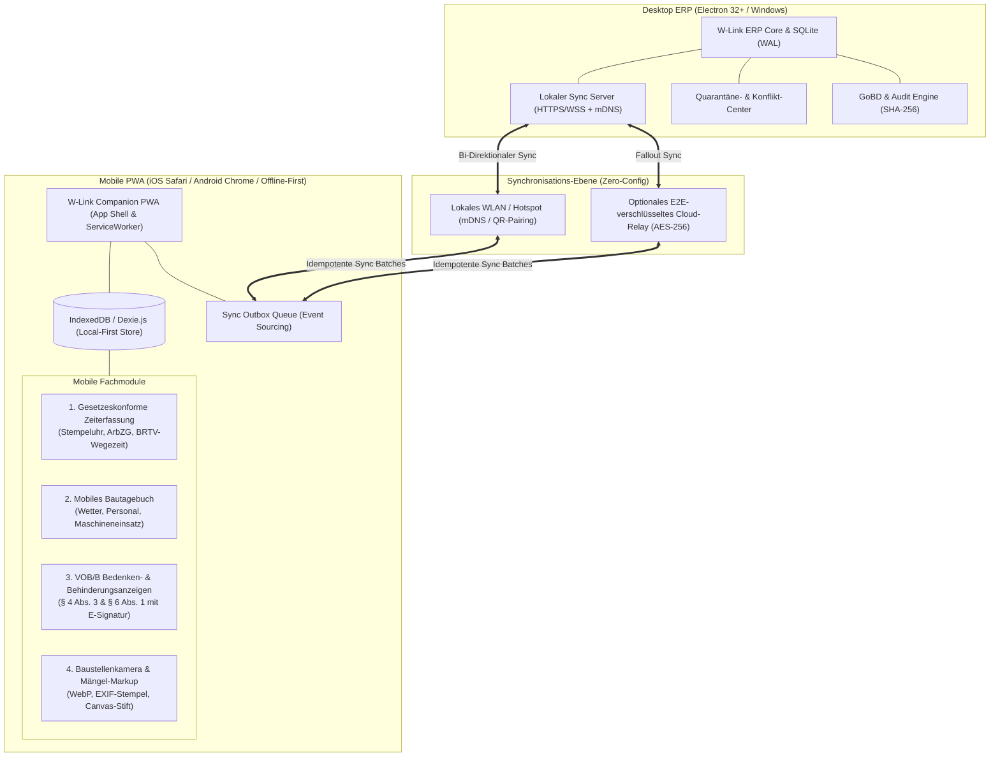
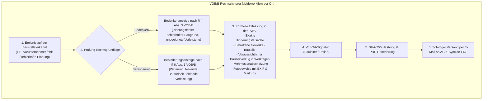
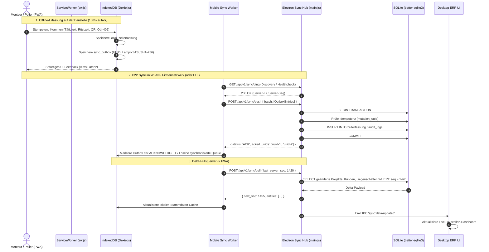
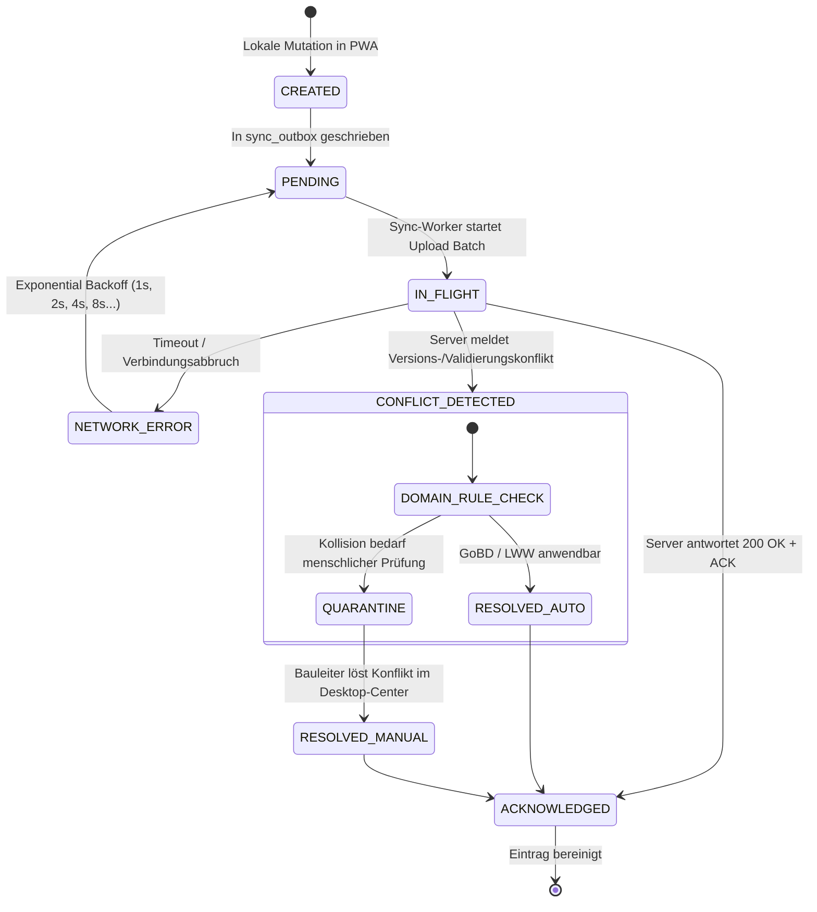

# IMPLEMENTIERUNGSPLAN PHASE 3 (RELEASE 1.2) – MOBILE PWA, GESETZESKONFORME ZEITERFASSUNG, MOBILES BAUTAGEBUCH & ZWEI-WEGE-SYNC-ENGINE (LOCAL-FIRST)

**Version:** 1.2.0-PROD-PLAN (Q1/Q2 2027)  
**Autor:** Leitender Software-Architekt & Mobile-Offline-First-Spezialist für W-Link ERP  
**Ziel-Datei:** `plans/phase3-mobile-pwa-zeiterfassung-baustellenbegleiter-sync-plan.md`  
**Zielgruppe:** Entwickler, Mobile-Engineers, Code-Subagents, QA-Engineers, Baubetriebswirte, Fachanwälte für Bau- und Arbeitsrecht  
**Projektkonventionen:**
- **Zero Heavy Dependencies / 100% Offline-First:** Vollständig autarker Betrieb der mobilen Companion PWA ohne Internetverbindung in Tiefgaragen, Kellern, Stahlbetonbauten und Funklöchern.
- **Local-First & Data Sovereignty:** Lokale Datenhaltung auf Desktop (Electron 32+ / `better-sqlite3` WAL-Modus) und Mobilgeräten (IndexedDB / `Dexie.js` / SQLite OPFS). Lokale Daten haben Lese- und Schreibpriorität (Zero Latency).
- **Isomorpher Modulaufbau:** Rechenkerne (`ZeiterfassungController.js`, `BautagebuchMobileController.js`, `SyncConflictController.js`) sind isomorph aufgebaut (`module.exports` UND `window.*`), damit sie im Electron-Main, im Desktop-Renderer und in der Mobile PWA identisch und synchron lauffähig sind.
- **Transaktionale Datenintegrität & Event-Sourcing:** Alle mobilen Schreiboperationen werden über das Outbox-Pattern (`sync_outbox`) mit global eindeutigen UUIDs (RFC 4122 v4) und Lamport-Timestamps versioniert und idempotent synchronisiert.
- **Rechtssicherheit & Normkonformität:** Strikte Umsetzung der BAG-Rechtsprechung 2022/2026, ArbZG §§ 3–5, MiLoG, SchwarzArbG § 19, BRTV-Bau § 7 (Wegezeitentschädigung 2024–2026), RTV Gebäudereinigung (LG 1–9) sowie VOB/B § 4 Abs. 3 (Bedenkenanzeige) und § 6 Abs. 1 (Behinderungsanzeige).
- **GoBD-Offline-Revisionssicherheit:** Lückenlose SHA-256 Hashverkettung (`previous_hash` $\to$ `current_hash`) aller mobilen Buchungen und Bautagesberichte direkt auf dem mobilen Endgerät vor dem Sync.

---

## 0. Executive Summary & Zieldefinition (Release 1.2)

Mit Release 1.2 schlägt W-Link ERP die Brücke zwischen der kaufmännischen Desktop-Zentrale im Büro und den operativen Baustellen- und Reinigungskolonnen vor Ort. 



### 0.1 Die vier Kernsäulen von Phase 3

1. **Mobile Progressive Web App (PWA) / Baustellenbegleiter:**
   - Hochperformante Web-App mit ServiceWorker Cache-Storage (`Cache-First` für App-Shell, `Stale-While-Revalidate` für statische Assets).
   - 100% autarker Offline-Betrieb über IndexedDB (`Dexie.js`) ohne Cloud-Zwang.
   - Mobile-First Touch-UI mit großflächigen Buttons für Handschuh-Bedienung, Sonnenlicht-kontrastreichem Dark/Light-Theme und direkter Hardware-Integration (Kamera, GPS-Snapshot, Offline-Dateisystem).
2. **Gesetzeskonforme Baustellen-Zeiterfassung (BAG / ArbZG / BRTV / MiLoG):**
   - Digitale Stempeluhr für Einzel-Monteure und Kolonnenführer (Team-Stempelung).
   - Automatische ArbZG-Pausenprüfung (§ 4 ArbZG: $\ge 30\text{ min}$ ab 6h, $\ge 45\text{ min}$ ab 9h) und Höchstarbeitszeit-Wächter (§ 3 ArbZG).
   - Detaillierte Tätigkeitsart-Differenzierung: Produktivzeit (Gewerk/Position), Rüstzeit (Lager/Fahrzeug), Wegezeit (mit automatischer Staffelung nach BRTV-Bau § 7 bzw. RTV Gebäudereinigung), Schlechtwetter (Saison-KUG nach § 101 SGB III).
   - Manipulationssichere Objekt-Verifikation via QR-Code-Scan am Bauwerk und DSGVO-konformer Geo-Snapshot beim Stempel-Event (kein permanentes GPS-Tracking).
3. **Mobiles Bautagebuch & VOB/B-Meldewesen:**
   - Witterungsdokumentation (DWD/Open-Meteo Offline-Cache + Ein-Klick-Sensorik), Erfassung von Eigen-/Fremdpersonal und Großgeräten.
   - Formelle Bedenkenanzeigen (§ 4 Abs. 3 VOB/B) und Behinderungsanzeigen (§ 6 Abs. 1 VOB/B) mit Fristwahrung, Beweisführung und digitaler Unterschrift vor Ort.
   - Baustellenkamera mit automatischer WebP-Kompression (Reduktion von 12 MB auf $<800\text{ KB}$), unveränderbarem EXIF-Zeit-/Ortsstempel und Touch-Canvas für Mängelkreise und Richtungspfeile.
4. **Zwei-Wege-Synchronisations-Engine (Local-First Architecture):**
   - Outbox-Pattern (`sync_outbox`), idempotente Mutations-UUIDs und Lamport-Timestamps.
   - Lokaler Peer-to-Peer Sync-Server direkt im Electron-Prozess (WLAN-Pairing via QR-Code / mDNS Bonjour) ohne zwingenden Drittserver.
   - Gestaffelte Konfliktlösung: Last-Write-Wins (LWW) für Notizen, Domain Rules (GoBD-Locked Master-Status hat Vorrang) und visuelles Quarantäne-Konflikt-Center auf dem Desktop für inhaltliche Kollisionen.
   - Lokale SHA-256 Hashverkettung für lückenlose GoBD- und SchwarzArbG-Revisionssicherheit.

---

## 1. Fachlicher & rechtlicher Hintergrund

### 1.1 Gesetzliche Arbeitszeiterfassung (BAG 2022/2026, ArbZG, MiLoG & SchwarzArbG)

Nach dem Grundsatzurteil des **Bundesarbeitsgerichts vom 13.09.2022 (1 ABR 22/21)** in Auslegung von § 3 Abs. 2 Nr. 1 ArbSchG (i.V.m. EuGH C-55/18 „CCOO“) sind Arbeitgeber in Deutschland verpflichtet, ein **objektives, verlässliches und zugängliches System** zur Erfassung der täglichen Arbeitszeit (Beginn, Ende, Dauer, Pausen) einzusetzen.

```
+----------------------------------------------------------------------------------------------------+
| GESETZLICHE ZEITERFASSUNGS-VORGABEN (DEUTSCHLAND / BAU- & REINIGUNGSGEWERBE)                       |
+----------------------------------------------------------------------------------------------------+
| 1. ARBEITSZEITGESETZ (ArbZG)                                                                       |
|    - § 3 ArbZG: Max. 8h werktäglich (Verlängerung auf 10h nur bei 6-Monats-Ausgleich auf 8h/Tag).  |
|    - § 4 ArbZG: Ruhepausen zwingend:                                                               |
|        * Arbeitszeit 6 bis 9 Stunden  --> Mindestens 30 Minuten Pause (in Abschnitten >= 15 min)   |
|        * Arbeitszeit über 9 Stunden   --> Mindestens 45 Minuten Pause                              |
|        * Beschäftigungsverbot: Niemals länger als 6 Stunden ohne Ruhepause arbeiten!              |
|    - § 5 ArbZG: Ruhezeit: Mindestens 11 ununterbrochene Stunden nach Arbeitsende.                  |
+----------------------------------------------------------------------------------------------------+
| 2. SCHWARZARBEITSBEKÄMPFUNGSGESETZ (§ 19 SchwarzArbG) & MiLoG (§ 17 MiLoG)                        |
|    - Zwingende Dokumentation von Beginn, Ende und Dauer der täglichen Arbeitszeit für alle im      |
|      Baugewerbe und Gebäudereinigungsgewerbe tätigen Arbeitnehmer.                                 |
|    - Frist: Spätestens bis zum Ablauf des 7. auf den Arbeitstag folgenden Kalendertages.          |
|    - Aufbewahrungspflicht: Mindestens 2 Jahre am Betriebssitz (revisionssicher).                  |
+----------------------------------------------------------------------------------------------------+
| 3. DSGVO & BETRIEBLICHER DATENSCHUTZ (Art. 88 DSGVO / § 26 BDSG)                                   |
|    - PERMANENTES GPS-TRACKING IST RECHTSWIDRIG (Verletzung des Persönlichkeitsrechts).            |
|    - Zulässig: Punktueller Geo-Snapshot (Ortung nur im Moment des Stempelns zur Verifikation).     |
+----------------------------------------------------------------------------------------------------+
```

### 1.2 Tarifliche Regelungen: BRTV-Bau Wegezeit & RTV Gebäudereinigung

#### A. Bundesrahmentarifvertrag für das Baugewerbe (BRTV-Bau § 7 – Wegezeitentschädigung)
Im Bauhauptgewerbe gilt die allgemeinverbindliche Regelung zur Wegezeitentschädigung (Differenzierung nach Baustellen mit und ohne tägliche Heimfahrt):

1. **Tägliche Heimfahrt (Verpflegungszuschuss / Wegezeitpauschale):**  
   Voraussetzung: Berufsbedingte Abwesenheit von der Wohnung $> 8\text{ Stunden}$.
   - Entfernung Betrieb $\leftrightarrow$ Baustelle **0 bis 50 km:** **7,00 € pro Arbeitstag** (steuerfrei nach EStG § 9 Abs. 4a).
   - Entfernung Betrieb $\leftrightarrow$ Baustelle **51 bis 75 km:** **8,00 € pro Arbeitstag**.
   - Entfernung Betrieb $\leftrightarrow$ Baustelle **ab 75 km:** **9,00 € pro Arbeitstag**.
2. **Fernbaustellen ohne tägliche Heimfahrt (Übernachtungsbaustellen):**  
   Pauschale für den tatsächlichen Zeitaufwand der An- und Abreise (pro Kalenderwoche für Hin- und Rückfahrt):
   - **75 bis 200 km:** **9,00 €**
   - **201 bis 300 km:** **18,00 €**
   - **301 bis 400 km:** **27,00 €**
   - **Über 400 km:** **39,00 €** (steuerpflichtig auszuzahlen).
3. **Fahrervergütung vs. Mitfahrer:**  
   Lenkzeiten von Fahrern von Baufahrzeugen (Kolonnenbusse, Transporter) gelten als voll zu vergütende Arbeitszeit; Mitfahrer erhalten die tarifliche Wegezeitentschädigung.

#### B. Rahmentarifvertrag (RTV) Gebäudereinigung
- Erfassung nach den 9 tariflichen Lohngruppen (LG 1 bis LG 9 ab 01.01.2026, z. B. LG 1 Innenreinigung 15,00 €/h, LG 6 Glasreinigung 18,40 €/h).
- Tarifliche Zuschläge: Nachtarbeit (22:00–05:00 Uhr: +30%), Sonn-/Feiertage (+80%), Hohe Feiertage (+200%), Mehrarbeit/Belastung (+25%).

---

### 1.3 Mobiles VOB/B-Meldewesen: Bedenken- & Behinderungsanzeigen

Bauleiter und Handwerker stehen vor Ort unter hohem Zeitdruck. Werden Mängel oder Behinderungen nicht form- und fristgerecht gerügt, verliert der Auftragnehmer wertvolle Vergütungs- und Schadensersatzansprüche:



---

## 2. Systemarchitektur & Datenflussdiagramme

### 2.1 Gesamtsystem-Architektur (Local-First Sync Hub)



### 2.2 QR-Code Discovery & Zero-Config Pairing

Um eine fehlerfreie Verbindung zwischen PWA und Desktop-ERP ohne manuelle IP-Konfiguration zu ermöglichen:

```
+----------------------------------------------------------------------------------------------------+
| ZERO-CONFIG PAIRING-ABLAUF (DESKTOP ERP <---> MOBILE PWA)                                         |
+----------------------------------------------------------------------------------------------------+
| 1. Desktop ERP startet internen HTTPS/WSS-Server auf Port 38400.                                   |
| 2. Desktop ERP generiert kryptografischen Pairing-Token (HMAC-SHA256, 15 min Gültigkeit)           |
| 3. Desktop UI rendert QR-Code mit folgendem Payload:                                              |
|    {                                                                                               |
|      "app": "W-LINK-ERP",                                                                          |
|      "server_url": "https://192.168.1.140:38400",                                                 |
|      "ws_url": "wss://192.168.1.140:38400/ws",                                                    |
|      "hub_name": "Bauleiter-Desktop-Office",                                                       |
|      "pairing_token": "a9f8e7d6c5b4...",                                                           |
|      "fingerprint": "SHA256:4b:2a:8f..."                                                           |
|    }                                                                                               |
| 4. Polier scannt den QR-Code mit der PWA-Kamera.                                                  |
| 5. PWA speichert Verbindungsparameter verschlüsselt in IndexedDB und baut sofort WSS-Sync auf.     |
+----------------------------------------------------------------------------------------------------+
```

### 2.3 State Machine: Sync-Outbox & Konfliktlösung



---

## 3. Teil 1: Mobile Progressive Web App (PWA) & Local-First Storage

### 3.1 PWA Manifest & App Shell (`pwa/manifest.webmanifest`)

Die mobile Begleiter-App wird als moderne, installierbare PWA realisiert:

```json
{
  "name": "W-Link ERP Baustellenbegleiter",
  "short_name": "W-Link Mobile",
  "description": "Offline-fähige Baustellen-Zeiterfassung, Bautagebuch und Fotodokumentation",
  "start_url": "./index.html",
  "display": "standalone",
  "orientation": "portrait-primary",
  "background_color": "#0f172a",
  "theme_color": "#2563eb",
  "icons": [
    {
      "src": "./icons/icon-192.png",
      "sizes": "192x192",
      "type": "image/png",
      "purpose": "any maskable"
    },
    {
      "src": "./icons/icon-512.png",
      "sizes": "512x512",
      "type": "image/png",
      "purpose": "any maskable"
    }
  ],
  "shortcuts": [
    {
      "name": "Stempeluhr",
      "url": "./index.html#stempeluhr",
      "icons": [{ "src": "./icons/timer.png", "sizes": "96x96" }]
    },
    {
      "name": "Bautagebuch",
      "url": "./index.html#bautagebuch",
      "icons": [{ "src": "./icons/diary.png", "sizes": "96x96" }]
    },
    {
      "name": "Foto aufnehmen",
      "url": "./index.html#kamera",
      "icons": [{ "src": "./icons/camera.png", "sizes": "96x96" }]
    }
  ]
}
```

### 3.2 Service Worker mit intelligenter Caching-Strategie (`pwa/sw.js`)

```javascript
/**
 * pwa/sw.js - ServiceWorker für W-Link ERP Baustellenbegleiter
 * Gewährleistet 100% Offline-Verfügbarkeit der App-Shell und Assets.
 */

const CACHE_NAME = 'wlink-mobile-v1.2.0';
const APP_SHELL = [
    './',
    './index.html',
    './css/mobile-theme.css',
    './js/dexie.min.js',
    './js/pwa-db.js',
    './js/controllers/ZeiterfassungController.js',
    './js/controllers/BautagebuchMobileController.js',
    './js/camera-engine.js',
    './js/sync-worker.js',
    './js/app-mobile.js',
    './icons/icon-192.png',
    './icons/icon-512.png',
    './manifest.webmanifest'
];

// 1. Installation: App-Shell vorab cachen
self.addEventListener('install', event => {
    event.waitUntil(
        caches.open(CACHE_NAME).then(cache => {
            console.log('[ServiceWorker] Caching App-Shell...');
            return cache.addAll(APP_SHELL);
        }).then(() => self.skipWaiting())
    );
});

// 2. Aktivierung: Alte Caches säubern
self.addEventListener('activate', event => {
    event.waitUntil(
        caches.keys().then(keys => {
            return Promise.all(
                keys.filter(key => key !== CACHE_NAME).map(key => {
                    console.log('[ServiceWorker] Lösche veralteten Cache:', key);
                    return caches.delete(key);
                })
            );
        }).then(() => self.clients.claim())
    );
});

// 3. Fetch-Strategie: Cache-First für statische Assets, Network-Only für Sync-APIs
self.addEventListener('fetch', event => {
    const url = new URL(event.request.url);

    // Sync-API-Aufrufe NIEMALS cachen
    if (url.pathname.startsWith('/api/v1/sync') || url.protocol === 'ws:' || url.protocol === 'wss:') {
        return;
    }

    event.respondWith(
        caches.match(event.request).then(cachedResponse => {
            if (cachedResponse) {
                return cachedResponse;
            }
            return fetch(event.request).then(networkResponse => {
                // Gültige Antworten in den Cache aufnehmen
                if (networkResponse && networkResponse.status === 200 && networkResponse.type === 'basic') {
                    const responseClone = networkResponse.clone();
                    caches.open(CACHE_NAME).then(cache => {
                        cache.put(event.request, responseClone);
                    });
                }
                return networkResponse;
            }).catch(() => {
                // Offline Fallback für Navigations-Requests
                if (event.request.mode === 'navigate') {
                    return caches.match('./index.html');
                }
            });
        })
    );
});

// 4. Background Sync API Handler (sofern vom Browser unterstützt)
self.addEventListener('sync', event => {
    if (event.tag === 'sync-outbox') {
        event.waitUntil(
            // Sende Nachricht an geöffnete Clients, den Sync-Worker anzustoßen
            self.clients.matchAll().then(clients => {
                clients.forEach(client => client.postMessage({ type: 'TRIGGER_BACKGROUND_SYNC' }));
            })
        );
    }
});
```

### 3.3 Client-seitige Offline-Datenbank (`pwa/js/pwa-db.js`)

Unter Verwendung von **Dexie.js** (Wrapper für IndexedDB) mit vollständigen Schemata und Indizes:

```javascript
/**
 * pwa/js/pwa-db.js - IndexedDB Client-Datenbank für Offline-First Betrieb
 */

const db = new Dexie('WLinkMobileDB');

db.version(1).stores({
    // Lokale Arbeitszeiterfassung
    local_zeiterfassung: 'uuid, mitarbeiter_id, projekt_id, liegenschaft_id, raum_id, taetigkeit_typ, zeit_von, is_synced, created_at',
    
    // Lokales Bautagebuch & Tagesberichte
    local_bautagebuch: 'uuid, projekt_id, datum, status, is_synced, created_at',
    
    // Formelle VOB/B Bedenken- & Behinderungsanzeigen
    local_vob_meldungen: 'uuid, projekt_id, typ, datum, status, is_synced',
    
    // Baustellen-Fotodokumentation & Mängel-Markups
    local_fotos: 'uuid, entitaet_typ, entitaet_uuid, sha256_hash, is_synced, created_at',
    
    // Outbox-Queue für Event-Sourcing
    sync_outbox: 'uuid, entity_type, entity_uuid, mutation_type, lamport_timestamp, status, created_at',
    
    // Stammdaten-Cache (vom Server empfangen, nur Lesezugriff mobil)
    cache_projekte: 'id, name, kunde_name, status',
    cache_liegenschaften: 'id, objekt_nr, name, ort',
    cache_gebaeude: 'id, liegenschaft_id, name',
    cache_etagen: 'id, gebaeude_id, name',
    cache_raeume: 'id, etage_id, name, raum_nr',
    cache_mitarbeiter: 'id, personalnummer, vorname, nachname, lohngruppe_id, pin_hash',
    cache_lv_positionen: 'id, bereich_id, positionsnr, bezeichnung',
    
    // Verbindungs- & Pairing-Metadaten
    app_settings: 'key'
});

window.mobileDb = db;
```

---

## 4. Teil 2: Gesetzeskonforme Baustellen-Zeiterfassung & Stempeluhr-Engine

### 4.1 Isomorpher Zeiterfassungs-Rechenkern (`controllers/ZeiterfassungController.js`)

Der Rechenkern ist zu 100% isomorph implementiert und prüft sämtliche arbeitszeitrechtlichen und tariflichen Vorgaben:

```javascript
/**
 * controllers/ZeiterfassungController.js - Gesetzes- & Tarifkonformer Zeiterfassungs-Rechenkern
 * Konform nach BAG 2022/2026, ArbZG §§ 3-5, MiLoG, SchwarzArbG § 19, BRTV-Bau § 7 & RTV Gebäudereinigung.
 */

class ZeiterfassungController {
    /**
     * Gültige Tätigkeitsarten im System
     */
    static TAETIGKEITEN = {
        PRODUKTIV: 'PRODUKTIV',             // Gewerk / Position / Regie
        RUESTZEIT: 'RUESTZEIT',             // Lager / Vorbereitung / Laden
        WEGEZEIT_FAHRER: 'WEGEZEIT_FAHRER', // Lenkzeit (gilt voll als Arbeitszeit)
        WEGEZEIT_MITFAHRER: 'WEGEZEIT_MITFAHRER', // Tarifliche Wegezeitentschädigung
        SCHLECHTWEWETTER: 'SCHLECHTWEWETTER', // Saison-KUG (§ 101 SGB III)
        BEREITSCHAFT: 'BEREITSCHAFT',
        REINIGUNG: 'REINIGUNG'
    };

    /**
     * Berechnet die Netto-Arbeitszeit unter Berücksichtigung der gesetzlichen Pausenabzüge (§ 4 ArbZG).
     * @param {Date|string} start - Beginn der Arbeitszeit
     * @param {Date|string} ende - Ende der Arbeitszeit
     * @param {number} manuellePauseMin - Manuell gestempelte Pausenminuten
     * @returns {Object} { bruttoMin, gesetzlichePflichtPauseMin, effektivePauseMin, nettoMin, nettoStunden, arbzgVerstoss }
     */
    static calculateWorkTime(start, ende, manuellePauseMin = 0) {
        const dStart = new Date(start);
        const dEnde = new Date(ende);

        if (isNaN(dStart.getTime()) || isNaN(dEnde.getTime()) || dEnde <= dStart) {
            return { valid: false, error: 'Ungültiges Start- oder Enddatum' };
        }

        const bruttoMin = Math.round((dEnde - dStart) / (1000 * 60));
        const bruttoStunden = bruttoMin / 60;

        // Gesetzliche Mindestpausen nach § 4 ArbZG:
        // > 6 bis 9 Stunden: mind. 30 Minuten
        // > 9 Stunden: mind. 45 Minuten
        let gesetzlichePflichtPauseMin = 0;
        if (bruttoStunden > 9) {
            gesetzlichePflichtPauseMin = 45;
        } else if (bruttoStunden > 6) {
            gesetzlichePflichtPauseMin = 30;
        }

        // Effektive Pause ist das Maximum aus erfasster Pause und gesetzlicher Pflichtpause
        const effektivePauseMin = Math.max(manuellePauseMin, gesetzlichePflichtPauseMin);
        const nettoMin = Math.max(0, bruttoMin - effektivePauseMin);
        const nettoStunden = Math.round((nettoMin / 60) * 100) / 100;

        // Verstöße gegen Arbeitszeitgesetz ermitteln
        const verstoesse = [];
        if (nettoStunden > 10.0) {
            verstoesse.push('Überschreitung der absoluten Höchstarbeitszeit von 10 Stunden (§ 3 ArbZG).');
        }
        if (bruttoStunden > 6.0 && manuellePauseMin < 30) {
            verstoesse.push('Unzureichende Ruhepause: Bei mehr als 6 Stunden Arbeit sind mindestens 30 Minuten Pause vorgeschrieben (§ 4 ArbZG).');
        }
        if (bruttoStunden > 9.0 && manuellePauseMin < 45) {
            verstoesse.push('Unzureichende Ruhepause: Bei mehr als 9 Stunden Arbeit sind mindestens 45 Minuten Pause vorgeschrieben (§ 4 ArbZG).');
        }

        return {
            valid: true,
            bruttoMin,
            bruttoStunden: Math.round(bruttoStunden * 100) / 100,
            gesetzlichePflichtPauseMin,
            manuellePauseMin,
            effektivePauseMin,
            nettoMin,
            nettoStunden,
            hasVerstoss: verstoesse.length > 0,
            verstoesse
        };
    }

    /**
     * Berechnet die tarifliche Wegezeitentschädigung nach BRTV-Bau § 7 (Staffel 2024-2026).
     * @param {number} distanzKm - Kürzeste einfache Straßenentfernung Betrieb <-> Baustelle
     * @param {boolean} taeglicheHeimfahrt - true = tägliche Rückkehr; false = Übernachtungsbaustelle
     * @param {number} abwesenheitStunden - Gesamtdauer der Abwesenheit von der Wohnung
     * @returns {Object} { entschädigungEur, steuerfrei, kategorie }
     */
    static calculateBRTVWegezeit(distanzKm, taeglicheHeimfahrt = true, abwesenheitStunden = 8.5) {
        const km = Math.max(0, parseFloat(distanzKm) || 0);

        if (taeglicheHeimfahrt) {
            // Voraussetzung: > 8 Stunden berufsbedingte Abwesenheit
            if (abwesenheitStunden <= 8.0) {
                return { entschädigungEur: 0.0, steuerfrei: true, bemerkung: 'Abwesenheit <= 8h: Kein tariflicher Anspruch' };
            }
            if (km <= 50) {
                return { entschädigungEur: 7.00, steuerfrei: true, kategorie: 'BRTV § 7 Ziff. 3.2 (0-50 km)' };
            } else if (km <= 75) {
                return { entschädigungEur: 8.00, steuerfrei: true, kategorie: 'BRTV § 7 Ziff. 3.2 (51-75 km)' };
            } else {
                return { entschädigungEur: 9.00, steuerfrei: true, kategorie: 'BRTV § 7 Ziff. 3.2 (> 75 km)' };
            }
        } else {
            // Fernbaustellen / Übernachtung (Entschädigung pro An-/Abreisefahrt, steuerpflichtig)
            if (km < 75) {
                return { entschädigungEur: 0.0, steuerfrei: false, bemerkung: 'Entfernung < 75 km für Fernbaustelle' };
            } else if (km <= 200) {
                return { entschädigungEur: 9.00, steuerfrei: false, kategorie: 'BRTV § 7 Ziff. 4.2 (75-200 km)' };
            } else if (km <= 300) {
                return { entschädigungEur: 18.00, steuerfrei: false, kategorie: 'BRTV § 7 Ziff. 4.2 (201-300 km)' };
            } else if (km <= 400) {
                return { entschädigungEur: 27.00, steuerfrei: false, kategorie: 'BRTV § 7 Ziff. 4.2 (301-400 km)' };
            } else {
                return { entschädigungEur: 39.00, steuerfrei: false, kategorie: 'BRTV § 7 Ziff. 4.2 (> 400 km)' };
            }
        }
    }

    /**
     * Prüft die Einhaltung der gesetzlichen Mindestruhezeit nach § 5 ArbZG (11 Stunden).
     * @param {Date|string} vorherigesEnde - Ende der letzten Schicht
     * @param {Date|string} neuesterStart - Beginn der aktuellen Schicht
     */
    static checkRuhezeit(vorherigesEnde, neuesterStart) {
        if (!vorherigesEnde || !neuesterStart) return { valid: true };
        const dVorher = new Date(vorherigesEnde);
        const dNeu = new Date(neuesterStart);
        const diffStunden = (dNeu - dVorher) / (1000 * 60 * 60);

        if (diffStunden < 11.0) {
            return {
                valid: false,
                ruhezeitStunden: Math.round(diffStunden * 100) / 100,
                warnung: `Verstoß gegen § 5 ArbZG: Die ununterbrochene Ruhezeit beträgt nur ${diffStunden.toFixed(1)} h (gesetzlich gefordert: mind. 11 h).`
            };
        }
        return { valid: true, ruhezeitStunden: Math.round(diffStunden * 100) / 100 };
    }

    /**
     * Validiert einen Stempel-Event inklusive QR-Code und punktuellem Geofence-Snapshot.
     */
    static validatePunchEvent(eventData, targetLocation = null) {
        if (!eventData.mitarbeiter_id) return { valid: false, error: 'Mitarbeiter-ID fehlt.' };
        if (!eventData.zeitstempel) return { valid: false, error: 'Zeitstempel fehlt.' };

        let geofenceOk = true;
        let distanzMeter = null;

        if (targetLocation && targetLocation.lat && targetLocation.lng && eventData.geo_lat && eventData.geo_lng) {
            distanzMeter = this.calculateHaversineDistance(
                targetLocation.lat, targetLocation.lng,
                eventData.geo_lat, eventData.geo_lng
            );
            // Toleranzbereich: 250 Meter um das Bauobjekt
            if (distanzMeter > 250) {
                geofenceOk = false;
            }
        }

        return {
            valid: true,
            geofenceOk,
            distanzMeter: distanzMeter !== null ? Math.round(distanzMeter) : null,
            qrValid: Boolean(eventData.qr_code_scanned)
        };
    }

    /**
     * Berechnet die Großkreisentfernung (Haversine) in Metern.
     */
    static calculateHaversineDistance(lat1, lon1, lat2, lon2) {
        const R = 6371e3; // Erdradius in Metern
        const rad = Math.PI / 180;
        const φ1 = lat1 * rad;
        const φ2 = lat2 * rad;
        const Δφ = (lat2 - lat1) * rad;
        const Δλ = (lon2 - lon1) * rad;

        const a = Math.sin(Δφ / 2) * Math.sin(Δφ / 2) +
                  Math.cos(φ1) * Math.cos(φ2) *
                  Math.sin(Δλ / 2) * Math.sin(Δλ / 2);
        const c = 2 * Math.atan2(Math.sqrt(a), Math.sqrt(1 - a));

        return R * c;
    }
}

if (typeof module !== 'undefined' && module.exports) {
    module.exports = ZeiterfassungController;
}
if (typeof window !== 'undefined') {
    window.ZeiterfassungController = ZeiterfassungController;
}
```

---

## 5. Teil 3: Mobiles Bautagebuch, VOB/B-Meldewesen & Baustellenkamera

### 5.1 Mobiles Bautagebuch & VOB/B-Controller (`controllers/BautagebuchMobileController.js`)

```javascript
/**
 * controllers/BautagebuchMobileController.js - Mobiler Bautagebuch- & VOB/B-Meldungs-Kern
 * Isomorph lauffähig in Node.js (Electron) und Browser (PWA).
 */

class BautagebuchMobileController {
    /**
     * Validiert und strukturiert einen Tagesbericht vor Ort.
     */
    static buildDailyReport(data) {
        if (!data.projekt_id) throw new Error('Projekt-ID ist zwingend erforderlich.');
        if (!data.datum) throw new Error('Berichtsdatum fehlt.');
        if (!data.tagesbericht || data.tagesbericht.trim().length < 5) {
            throw new Error('Bitte erfassen Sie eine aussagekräftige Leistungsbeschreibung.');
        }

        const report = {
            uuid: data.uuid || this.generateUUID(),
            projekt_id: parseInt(data.projekt_id, 10),
            datum: data.datum,
            wetter_code: data.wetter_code || 'HEITER',
            temperatur_min: parseFloat(data.temperatur_min) || 0.0,
            temperatur_max: parseFloat(data.temperatur_max) || 0.0,
            regen_mm: parseFloat(data.regen_mm) || 0.0,
            wind_staerke: data.wind_staerke || '0-2 Bft',
            personal_eigen_anzahl: parseInt(data.personal_eigen_anzahl, 10) || 0,
            personal_eigen_stunden: parseFloat(data.personal_eigen_stunden) || 0.0,
            personal_sub_json: typeof data.personal_sub_json === 'string' ? data.personal_sub_json : JSON.stringify(data.personal_sub_json || []),
            geraete_json: typeof data.geraete_json === 'string' ? data.geraete_json : JSON.stringify(data.geraete_json || []),
            tagesbericht: data.tagesbericht.trim(),
            vorkommnisse: (data.vorkommnisse || '').trim(),
            fotos_json: typeof data.fotos_json === 'string' ? data.fotos_json : JSON.stringify(data.fotos_json || []),
            status: data.status || 'DRAFT',
            unterzeichnet_polier: data.unterzeichnet_polier ? 1 : 0,
            unterzeichnet_am: data.unterzeichnet_am || null,
            created_at: data.created_at || new Date().toISOString()
        };

        return report;
    }

    /**
     * Erstellt eine formelle Bedenkenanzeige nach § 4 Abs. 3 VOB/B.
     */
    static createBedenkenanzeige(data) {
        if (!data.projekt_id || !data.betreff || !data.begruendung) {
            throw new Error('Pflichtangaben für Bedenkenanzeige unvollständig (§ 4 Abs. 3 VOB/B).');
        }

        return {
            uuid: data.uuid || this.generateUUID(),
            projekt_id: parseInt(data.projekt_id, 10),
            typ: 'BEDENKEN_4_3',
            datum: data.datum || new Date().toISOString().split('T')[0],
            betreff: data.betreff.trim(),
            begruendung: data.begruendung.trim(),
            kategorie: data.kategorie || 'VORLEISTUNG_UNGEEIGNET', // 'PLANUNGSFEHLER', 'GÜTE_STOFFE', 'UNFALLGEFAHR'
            betroffene_gewerke: data.betroffene_gewerke || '',
            vorschlag_abhilfe: data.vorschlag_abhilfe || '',
            abmahnung_frist: data.abmahnung_frist || null,
            unterschrift_svg: data.unterschrift_svg || null,
            status: 'OFFEN',
            created_at: new Date().toISOString()
        };
    }

    /**
     * Erstellt eine formelle Behinderungsanzeige nach § 6 Abs. 1 VOB/B.
     */
    static createBehinderungsanzeige(data) {
        if (!data.projekt_id || !data.hinderungsgrund || !data.beginn_datum) {
            throw new Error('Pflichtangaben für Behinderungsanzeige unvollständig (§ 6 Abs. 1 VOB/B).');
        }

        return {
            uuid: data.uuid || this.generateUUID(),
            projekt_id: parseInt(data.projekt_id, 10),
            typ: 'BEHINDERUNG_6_1',
            datum: data.datum || new Date().toISOString().split('T')[0],
            beginn_datum: data.beginn_datum,
            voraussichtliches_ende: data.voraussichtliches_ende || null,
            hinderungsgrund: data.hinderungsgrund.trim(),
            ursache: data.ursache || 'AG_VERZUG', // 'WITTERUNG', 'FEHLENDE_VORLEISTUNG', 'BAUFREIHEIT_FEHLT', 'PLANUNG_FEHLT'
            auswirkung_bauzeit_tage: parseInt(data.auswirkung_bauzeit_tage, 10) || 0,
            mehrkosten_angemeldet: data.mehrkosten_angemeldet ? 1 : 0,
            geschaetzte_mehrkosten_eur: parseFloat(data.geschaetzte_mehrkosten_eur) || 0.0,
            unterschrift_svg: data.unterschrift_svg || null,
            status: 'OFFEN',
            created_at: new Date().toISOString()
        };
    }

    /**
     * Erzeugt eine RFC 4122 v4 konforme UUID.
     */
    static generateUUID() {
        if (typeof crypto !== 'undefined' && crypto.randomUUID) {
            return crypto.randomUUID();
        }
        return 'xxxxxxxx-xxxx-4xxx-yxxx-xxxxxxxxxxxx'.replace(/[xy]/g, c => {
            const r = Math.random() * 16 | 0;
            const v = c === 'x' ? r : (r & 0x3 | 0x8);
            return v.toString(16);
        });
    }
}

if (typeof module !== 'undefined' && module.exports) {
    module.exports = BautagebuchMobileController;
}
if (typeof window !== 'undefined') {
    window.BautagebuchMobileController = BautagebuchMobileController;
}
```

### 5.2 Baustellenkamera, Bildkompression & Touch-Markup (`pwa/js/camera-engine.js`)

Die Kamera-Engine verarbeitet Fotos lokal im Browser-Thread:

```javascript
/**
 * pwa/js/camera-engine.js - Client-seitige Bildverarbeitungs-, EXIF-Wasserzeichen- & Markup-Engine
 */

class CameraEngine {
    /**
     * Skaliert und komprimiert ein Rohfoto zu WebP (Fallback JPEG) und brennt Metadaten-Wasserzeichen ein.
     * @param {File|Blob} imageFile - Rohbild von Kamera-Input
     * @param {Object} metadata - { projektNr, objektName, datum, gpsLat, gpsLng, author }
     * @param {number} maxDimension - Maximale Kantenlänge (Standard 1920px Full HD)
     * @param {number} quality - WebP Kompressionsqualität (0.8 = 80%)
     */
    static async processAndWatermarkPhoto(imageFile, metadata = {}, maxDimension = 1920, quality = 0.8) {
        return new Promise((resolve, reject) => {
            const img = new Image();
            const reader = new FileReader();

            reader.onload = e => {
                img.src = e.target.result;
            };
            reader.onerror = reject;

            img.onload = () => {
                let { width, height } = img;

                // 1. Seitenverhältnis-treue Skalierung
                if (width > maxDimension || height > maxDimension) {
                    if (width > height) {
                        height = Math.round((height * maxDimension) / width);
                        width = maxDimension;
                    } else {
                        width = Math.round((width * maxDimension) / height);
                        height = maxDimension;
                    }
                }

                const canvas = document.createElement('canvas');
                canvas.width = width;
                canvas.height = height;
                const ctx = canvas.getContext('2d');

                // Bild zeichnen
                ctx.drawImage(img, 0, 0, width, height);

                // 2. Unveränderbares Wasserzeichen-Banner am unteren Rand einbrennen
                const bannerHeight = Math.max(40, Math.round(height * 0.06));
                ctx.fillStyle = 'rgba(15, 23, 42, 0.75)'; // Dunkler Hintergrund
                ctx.fillRect(0, height - bannerHeight, width, bannerHeight);

                ctx.fillStyle = '#ffffff';
                ctx.font = `bold ${Math.round(bannerHeight * 0.35)}px sans-serif`;
                ctx.textBaseline = 'middle';

                const datumStr = metadata.datum || new Date().toLocaleString('de-DE');
                const projStr = metadata.projektNr ? `Projekt: ${metadata.projektNr}` : 'W-Link ERP';
                const locStr = (metadata.gpsLat && metadata.gpsLng) 
                    ? `GPS: ${metadata.gpsLat.toFixed(5)}, ${metadata.gpsLng.toFixed(5)}` 
                    : (metadata.objektName || '');

                const textLine = `[W-LINK] ${projStr} | ${datumStr} | ${locStr}`;
                ctx.fillText(textLine, 15, height - (bannerHeight / 2));

                // 3. Als WebP Blob exportieren
                canvas.toBlob(blob => {
                    if (!blob) {
                        return reject(new Error('Kompression fehlgeschlagen'));
                    }
                    resolve({
                        blob,
                        width,
                        height,
                        sizeBytes: blob.size,
                        mimeType: blob.type
                    });
                }, 'image/webp', quality);
            };

            reader.readAsDataURL(imageFile);
        });
    }

    /**
     * Rendert digitale Zeichnungen (Mängelkreise, Pfeile, Freihand) auf ein bestehendes Foto.
     * @param {Blob} baseImageBlob - Das Basis-Foto
     * @param {Array} drawActions - Array von Zeichenaktionen [{ type: 'circle'|'arrow'|'freehand', points, color }]
     */
    static async applyDrawingsToPhoto(baseImageBlob, drawActions = []) {
        return new Promise((resolve, reject) => {
            const img = new Image();
            img.src = URL.createObjectURL(baseImageBlob);

            img.onload = () => {
                const canvas = document.createElement('canvas');
                canvas.width = img.width;
                canvas.height = img.height;
                const ctx = canvas.getContext('2d');

                ctx.drawImage(img, 0, 0);

                // Zeichenaktionen anwenden
                drawActions.forEach(action => {
                    ctx.strokeStyle = action.color || '#ef4444'; // Signalrot Standard
                    ctx.lineWidth = action.lineWidth || 6;
                    ctx.lineCap = 'round';
                    ctx.lineJoin = 'round';

                    if (action.type === 'circle') {
                        const { cx, cy, r } = action;
                        ctx.beginPath();
                        ctx.arc(cx, cy, r, 0, 2 * Math.PI);
                        ctx.stroke();
                    } else if (action.type === 'arrow') {
                        const { fromX, fromY, toX, toY } = action;
                        const headlen = 20;
                        const angle = Math.atan2(toY - fromY, toX - fromX);
                        ctx.beginPath();
                        ctx.moveTo(fromX, fromY);
                        ctx.lineTo(toX, toY);
                        ctx.lineTo(toX - headlen * Math.cos(angle - Math.PI / 6), toY - headlen * Math.sin(angle - Math.PI / 6));
                        ctx.moveTo(toX, toY);
                        ctx.lineTo(toX - headlen * Math.cos(angle + Math.PI / 6), toY - headlen * Math.sin(angle + Math.PI / 6));
                        ctx.stroke();
                    } else if (action.type === 'freehand' && action.points && action.points.length > 1) {
                        ctx.beginPath();
                        ctx.moveTo(action.points[0].x, action.points[0].y);
                        for (let i = 1; i < action.points.length; i++) {
                            ctx.lineTo(action.points[i].x, action.points[i].y);
                        }
                        ctx.stroke();
                    }
                });

                canvas.toBlob(blob => {
                    URL.revokeObjectURL(img.src);
                    resolve(blob);
                }, 'image/webp', 0.85);
            };

            img.onerror = reject;
        });
    }
}

if (typeof module !== 'undefined' && module.exports) {
    module.exports = CameraEngine;
}
if (typeof window !== 'undefined') {
    window.CameraEngine = CameraEngine;
}
```

---

## 6. Teil 4: Zwei-Wege-Synchronisations-Engine (Local Sync Server & Outbox)

### 6.1 Lokaler Sync-Server im Electron Main Process (`main/sync-server.js`)

Der Sync-Server läuft autark innerhalb des Electron Main-Prozesses und stellt HTTP- und WebSocket-Endpunkte für die mobilen PWA-Clients bereit:

```javascript
/**
 * main/sync-server.js - Lokaler Peer-to-Peer Sync Server (HTTPS/WSS) im Electron Prozess
 * Verarbeitet Push/Pull-Sync-Batches, wickelt Pairing ab und sichert Transaktionen in better-sqlite3.
 */

const http = require('http');
const https = require('https');
const fs = require('fs');
const path = require('path');
const crypto = require('crypto');
const { WebSocketServer } = require('ws');

class SyncServer {
    /**
     * @param {Object} db - Aktive better-sqlite3 Instanz
     * @param {Object} auditLogger - Audit-Logger Instanz
     * @param {Object} options - { port: 38400, sslKeyPath, sslCertPath }
     */
    constructor(db, auditLogger, options = {}) {
        this.db = db;
        this.auditLogger = auditLogger;
        this.port = options.port || 38400;
        this.server = null;
        this.wss = null;
        this.activeClients = new Set();
        this.pairingTokens = new Map(); // token -> { createdAt, validUntil }
    }

    /**
     * Startet den internen HTTP/HTTPS und WebSocket-Server.
     */
    start() {
        this.server = http.createServer((req, res) => this.handleHttpRequest(req, res));

        this.wss = new WebSocketServer({ server: this.server, path: '/ws' });
        this.wss.on('connection', (ws, req) => this.handleWsConnection(ws, req));

        this.server.listen(this.port, '0.0.0.0', () => {
            console.log(`[SyncServer] W-Link Sync Hub läuft lokal auf Port ${this.port}`);
        });
    }

    /**
     * Generiert einen flüchtigen Pairing-Token für den QR-Code.
     */
    createPairingToken(ttlMinutes = 15) {
        const token = crypto.randomBytes(24).toString('hex');
        const validUntil = Date.now() + ttlMinutes * 60 * 1000;
        this.pairingTokens.set(token, { validUntil });
        return token;
    }

    /**
     * Zentraler HTTP-Request-Router für REST-Sync.
     */
    async handleHttpRequest(req, res) {
        // CORS-Header für PWA
        res.setHeader('Access-Control-Allow-Origin', '*');
        res.setHeader('Access-Control-Allow-Methods', 'GET, POST, OPTIONS');
        res.setHeader('Access-Control-Allow-Headers', 'Content-Type, Authorization, X-Device-Id');

        if (req.method === 'OPTIONS') {
            res.writeHead(204);
            return res.end();
        }

        const url = new URL(req.url, `http://${req.headers.host}`);

        try {
            if (url.pathname === '/api/v1/sync/ping' && req.method === 'GET') {
                res.writeHead(200, { 'Content-Type': 'application/json' });
                return res.end(JSON.stringify({ status: 'OK', app: 'W-Link ERP', serverTime: new Date().toISOString() }));
            }

            if (url.pathname === '/api/v1/sync/pair' && req.method === 'POST') {
                const body = await this.readJsonBody(req);
                return this.handlePairing(body, res);
            }

            if (url.pathname === '/api/v1/sync/push' && req.method === 'POST') {
                const body = await this.readJsonBody(req);
                return this.handlePushSync(body, res);
            }

            if (url.pathname === '/api/v1/sync/pull' && req.method === 'POST') {
                const body = await this.readJsonBody(req);
                return this.handlePullSync(body, res);
            }

            res.writeHead(404, { 'Content-Type': 'application/json' });
            res.end(JSON.stringify({ error: 'Endpoint not found' }));
        } catch (err) {
            console.error('[SyncServer Error]:', err);
            res.writeHead(500, { 'Content-Type': 'application/json' });
            res.end(JSON.stringify({ error: err.message }));
        }
    }

    /**
     * Verarbeitet eingehende Push-Mutations-Batches von der mobilen PWA.
     */
    handlePushSync(body, res) {
        const { device_id, mutations = [] } = body;
        if (!Array.isArray(mutations)) {
            res.writeHead(400, { 'Content-Type': 'application/json' });
            return res.end(JSON.stringify({ error: 'Mutations array required' }));
        }

        const ackedUuids = [];
        const conflicts = [];

        const syncTx = this.db.transaction(() => {
            const checkMutationStmt = this.db.prepare('SELECT id FROM sync_processed_mutations WHERE mutation_uuid = ?');
            const recordMutationStmt = this.db.prepare(`
                INSERT INTO sync_processed_mutations (mutation_uuid, device_id, entity_type, entity_uuid, created_at)
                VALUES (?, ?, ?, ?, CURRENT_TIMESTAMP)
            `);

            for (const mut of mutations) {
                // 1. Idempotenz-Prüfung: Bereits verarbeitet?
                const existing = checkMutationStmt.get(mut.uuid);
                if (existing) {
                    ackedUuids.push(mut.uuid);
                    continue;
                }

                // 2. Fachentität verarbeiten
                try {
                    this.applyEntityMutation(mut);
                    recordMutationStmt.run(mut.uuid, device_id, mut.entity_type, mut.entity_uuid);
                    ackedUuids.push(mut.uuid);
                } catch (mutationErr) {
                    console.warn(`[SyncServer] Konflikt bei Mutation ${mut.uuid}:`, mutationErr.message);
                    conflicts.push({ uuid: mut.uuid, error: mutationErr.message });
                }
            }
        });

        syncTx();

        res.writeHead(200, { 'Content-Type': 'application/json' });
        res.end(JSON.stringify({
            status: 'SUCCESS',
            acked_uuids: ackedUuids,
            conflicts,
            server_time: new Date().toISOString()
        }));
    }

    /**
     * Schreibt eine mobile Mutation in die SQLite-Hauptdatenbank.
     */
    applyEntityMutation(mut) {
        const { entity_type, mutation_type, payload } = mut;
        const data = typeof payload === 'string' ? JSON.parse(payload) : payload;

        if (entity_type === 'ZEITERFASSUNG') {
            if (mutation_type === 'INSERT' || mutation_type === 'UPDATE') {
                const upsertStmt = this.db.prepare(`
                    INSERT INTO zeiterfassung (
                        uuid, mitarbeiter_id, projekt_id, liegenschaft_id, gebaeude_id, raum_id,
                        taetigkeit_typ, zeit_von, zeit_bis, dauer_min, pause_min, qr_code_scanned,
                        geo_lat, geo_lng, bemerkung, status, wegezeit_eur, device_id, created_at, updated_at
                    ) VALUES (
                        @uuid, @mitarbeiter_id, @projekt_id, @liegenschaft_id, @gebaeude_id, @raum_id,
                        @taetigkeit_typ, @zeit_von, @zeit_bis, @dauer_min, @pause_min, @qr_code_scanned,
                        @geo_lat, @geo_lng, @bemerkung, @status, @wegezeit_eur, @device_id, @created_at, CURRENT_TIMESTAMP
                    ) ON CONFLICT(uuid) DO UPDATE SET
                        zeit_bis = excluded.zeit_bis,
                        dauer_min = excluded.dauer_min,
                        pause_min = excluded.pause_min,
                        bemerkung = excluded.bemerkung,
                        status = excluded.status,
                        updated_at = CURRENT_TIMESTAMP
                `);
                upsertStmt.run({
                    uuid: data.uuid,
                    mitarbeiter_id: data.mitarbeiter_id,
                    projekt_id: data.projekt_id || null,
                    liegenschaft_id: data.liegenschaft_id || null,
                    gebaeude_id: data.gebaeude_id || null,
                    raum_id: data.raum_id || null,
                    taetigkeit_typ: data.taetigkeit_typ || 'PRODUKTIV',
                    zeit_von: data.zeit_von,
                    zeit_bis: data.zeit_bis || null,
                    dauer_min: data.dauer_min || 0,
                    pause_min: data.pause_min || 0,
                    qr_code_scanned: data.qr_code_scanned ? 1 : 0,
                    geo_lat: data.geo_lat || null,
                    geo_lng: data.geo_lng || null,
                    bemerkung: data.bemerkung || '',
                    status: data.status || 'ERFASST',
                    wegezeit_eur: data.wegezeit_eur || 0.0,
                    device_id: data.device_id || 'UNKNOWN_MOBILE',
                    created_at: data.created_at || new Date().toISOString()
                });
            }
        } else if (entity_type === 'BAUTAGEBUCH') {
            const upsertBtStmt = this.db.prepare(`
                INSERT INTO bautagebuch (
                    uuid, project_id, datum, wetter, temperatur_min, temperatur_max,
                    personal_eigen_anzahl, personal_eigen_stunden, personal_sub_json, geraete_json,
                    tagesbericht, vorkommnisse_behinderungen, fotos_json, status, created_at
                ) VALUES (
                    @uuid, @project_id, @datum, @wetter, @temperatur_min, @temperatur_max,
                    @personal_eigen_anzahl, @personal_eigen_stunden, @personal_sub_json, @geraete_json,
                    @tagesbericht, @vorkommnisse_behinderungen, @fotos_json, @status, @created_at
                ) ON CONFLICT(uuid) DO UPDATE SET
                    tagesbericht = excluded.tagesbericht,
                    vorkommnisse_behinderungen = excluded.vorkommnisse_behinderungen,
                    fotos_json = excluded.fotos_json
            `);
            upsertBtStmt.run(data);
        }
    }

    /**
     * Sendet Delta-Updates an den mobilen Client.
     */
    handlePullSync(body, res) {
        const { last_sync_timestamp = '1970-01-01T00:00:00.000Z' } = body;

        const projekte = this.db.prepare('SELECT id, name, start, ende, status FROM projekte WHERE status != "ARCHIVIERT"').all();
        const liegenschaften = this.db.prepare('SELECT id, objekt_nr, name, ort FROM liegenschaften WHERE aktiv = 1').all();
        const mitarbeiter = this.db.prepare('SELECT id, personalnummer, vorname, nachname, lohngruppe_id FROM mitarbeiter WHERE aktiv = 1').all();
        const lvPositionen = this.db.prepare('SELECT id, bereich_id, positionsnr, bezeichnung FROM lv_positionen').all();

        res.writeHead(200, { 'Content-Type': 'application/json' });
        res.end(JSON.stringify({
            server_time: new Date().toISOString(),
            data: {
                projekte,
                liegenschaften,
                mitarbeiter,
                lv_positionen: lvPositionen
            }
        }));
    }

    readJsonBody(req) {
        return new Promise((resolve, reject) => {
            let data = '';
            req.on('data', chunk => data += chunk);
            req.on('end', () => {
                try { resolve(JSON.parse(data || '{}')); } catch (e) { reject(e); }
            });
            req.on('error', reject);
        });
    }

    stop() {
        if (this.wss) this.wss.close();
        if (this.server) this.server.close();
    }
}

module.exports = SyncServer;
```

### 6.2 Client-seitiger Sync-Worker (`pwa/js/sync-worker.js`)

```javascript
/**
 * pwa/js/sync-worker.js - Client-seitiger Sync-Orchestrator mit Outbox-Batching & Exponential Backoff
 */

class MobileSyncWorker {
    constructor(db) {
        this.db = db;
        this.isSyncing = false;
        this.backoffDelayMs = 1000;
        this.maxBackoffMs = 60000;
    }

    /**
     * Startet einen vollständigen Zwei-Wege-Sync (Push Outbox -> Pull Influx).
     */
    async runFullSync() {
        if (this.isSyncing) return;
        this.isSyncing = true;

        try {
            const settings = await this.db.app_settings.get('server_config');
            if (!settings || !settings.server_url) {
                console.log('[SyncWorker] Keine Serverkonfiguration vorhanden.');
                return;
            }

            // 1. PUSH: Ungesendete Outbox-Einträge sammeln
            const pendingMutations = await this.db.sync_outbox
                .where('status')
                .equals('PENDING')
                .limit(50)
                .toArray();

            if (pendingMutations.length > 0) {
                const pushResponse = await fetch(`${settings.server_url}/api/v1/sync/push`, {
                    method: 'POST',
                    headers: {
                        'Content-Type': 'application/json',
                        'X-Device-Id': settings.device_id || 'MOBILE_PWA'
                    },
                    body: JSON.stringify({
                        device_id: settings.device_id || 'MOBILE_PWA',
                        mutations: pendingMutations
                    })
                });

                if (pushResponse.ok) {
                    const result = await pushResponse.json();
                    if (result.acked_uuids && result.acked_uuids.length > 0) {
                        // Erfolgreich übertragene Einträge aus Outbox löschen
                        await this.db.sync_outbox.bulkDelete(result.acked_uuids);
                        console.log(`[SyncWorker] ${result.acked_uuids.length} Mutationen erfolgreich synchronisiert.`);
                    }
                    this.backoffDelayMs = 1000; // Reset Backoff
                } else {
                    throw new Error(`Push Sync HTTP ${pushResponse.status}`);
                }
            }

            // 2. PULL: Stammdaten-Delta vom Desktop abrufen
            const lastSync = await this.db.app_settings.get('last_sync_timestamp');
            const pullResponse = await fetch(`${settings.server_url}/api/v1/sync/pull`, {
                method: 'POST',
                headers: { 'Content-Type': 'application/json' },
                body: JSON.stringify({ last_sync_timestamp: lastSync ? lastSync.value : '1970-01-01T00:00:00.000Z' })
            });

            if (pullResponse.ok) {
                const pullResult = await pullResponse.json();
                if (pullResult.data) {
                    await this.db.transaction('rw', this.db.cache_projekte, this.db.cache_liegenschaften, this.db.cache_mitarbeiter, this.db.cache_lv_positionen, async () => {
                        if (pullResult.data.projekte) await this.db.cache_projekte.bulkPut(pullResult.data.projekte);
                        if (pullResult.data.liegenschaften) await this.db.cache_liegenschaften.bulkPut(pullResult.data.liegenschaften);
                        if (pullResult.data.mitarbeiter) await this.db.cache_mitarbeiter.bulkPut(pullResult.data.mitarbeiter);
                        if (pullResult.data.lv_positionen) await this.db.cache_lv_positionen.bulkPut(pullResult.data.lv_positionen);
                    });
                    await this.db.app_settings.put({ key: 'last_sync_timestamp', value: pullResult.server_time });
                }
            }
        } catch (err) {
            console.warn('[SyncWorker] Sync fehlgeschlagen, versuche erneut in ' + (this.backoffDelayMs / 1000) + 's:', err.message);
            this.backoffDelayMs = Math.min(this.backoffDelayMs * 2, this.maxBackoffMs);
        } finally {
            this.isSyncing = false;
        }
    }
}

if (typeof module !== 'undefined' && module.exports) {
    module.exports = MobileSyncWorker;
}
if (typeof window !== 'undefined') {
    window.MobileSyncWorker = MobileSyncWorker;
}
```

---

## 7. Teil 5: Datenbankschema-Migrationen & DDL

Folgende Tabellen werden in `schema.js` ergänzt:

```sql
-- 1. Mitarbeiter-Stammdaten & Lohngruppen
CREATE TABLE IF NOT EXISTS mitarbeiter (
    id INTEGER PRIMARY KEY AUTOINCREMENT,
    personalnummer TEXT NOT NULL UNIQUE,
    vorname TEXT NOT NULL,
    nachname TEXT NOT NULL,
    lohngruppe_id TEXT NOT NULL DEFAULT 'LG1',
    tarif_stundensatz REAL NOT NULL DEFAULT 15.00,
    ist_kolonnenfuehrer INTEGER DEFAULT 0 CHECK(ist_kolonnenfuehrer IN (0,1)),
    pin_hash TEXT,
    nfc_tag_uid TEXT UNIQUE,
    telefon TEXT,
    email TEXT,
    aktiv INTEGER DEFAULT 1 CHECK(aktiv IN (0,1)),
    created_at DATETIME DEFAULT CURRENT_TIMESTAMP,
    updated_at DATETIME DEFAULT CURRENT_TIMESTAMP
);

CREATE INDEX IF NOT EXISTS idx_mitarbeiter_persnr ON mitarbeiter(personalnummer);
CREATE INDEX IF NOT EXISTS idx_mitarbeiter_aktiv ON mitarbeiter(aktiv);

-- 2. Zeiterfassung (Mobile & Desktop)
CREATE TABLE IF NOT EXISTS zeiterfassung (
    id INTEGER PRIMARY KEY AUTOINCREMENT,
    uuid TEXT NOT NULL UNIQUE,
    mitarbeiter_id INTEGER NOT NULL REFERENCES mitarbeiter(id) ON DELETE RESTRICT,
    projekt_id INTEGER REFERENCES projekte(id) ON DELETE SET NULL,
    liegenschaft_id INTEGER REFERENCES liegenschaften(id) ON DELETE SET NULL,
    gebaeude_id INTEGER REFERENCES gebaeude(id) ON DELETE SET NULL,
    raum_id INTEGER REFERENCES raeume(id) ON DELETE SET NULL,
    taetigkeit_typ TEXT NOT NULL DEFAULT 'PRODUKTIV' CHECK(taetigkeit_typ IN (
        'PRODUKTIV', 'RUESTZEIT', 'WEGEZEIT_FAHRER', 'WEGEZEIT_MITFAHRER', 'SCHLECHTWEWETTER', 'BEREITSCHAFT', 'REINIGUNG'
    )),
    zeit_von DATETIME NOT NULL,
    zeit_bis DATETIME,
    dauer_min INTEGER DEFAULT 0,
    pause_min INTEGER DEFAULT 0,
    qr_code_scanned INTEGER DEFAULT 0,
    geo_lat REAL,
    geo_lng REAL,
    bemerkung TEXT,
    wegezeit_eur REAL DEFAULT 0.0,
    status TEXT NOT NULL DEFAULT 'ERFASST' CHECK(status IN ('ERFASST', 'GEPRUEFT', 'FREIGEGEBEN', 'ABGERECHNET', 'STORNIERT')),
    device_id TEXT,
    sha256_hash TEXT,
    created_at DATETIME DEFAULT CURRENT_TIMESTAMP,
    updated_at DATETIME DEFAULT CURRENT_TIMESTAMP
);

CREATE INDEX IF NOT EXISTS idx_zeit_mitarbeiter_datum ON zeiterfassung(mitarbeiter_id, zeit_von);
CREATE INDEX IF NOT EXISTS idx_zeit_projekt ON zeiterfassung(projekt_id);
CREATE INDEX IF NOT EXISTS idx_zeit_uuid ON zeiterfassung(uuid);

-- 3. Idempotente Sync-Tracking Tabelle
CREATE TABLE IF NOT EXISTS sync_processed_mutations (
    id INTEGER PRIMARY KEY AUTOINCREMENT,
    mutation_uuid TEXT NOT NULL UNIQUE,
    device_id TEXT NOT NULL,
    entity_type TEXT NOT NULL,
    entity_uuid TEXT NOT NULL,
    created_at DATETIME DEFAULT CURRENT_TIMESTAMP
);

CREATE INDEX IF NOT EXISTS idx_sync_mut_uuid ON sync_processed_mutations(mutation_uuid);

-- 4. Bedenken- und Behinderungsanzeigen (VOB/B)
CREATE TABLE IF NOT EXISTS bedenken_behinderungen (
    id INTEGER PRIMARY KEY AUTOINCREMENT,
    uuid TEXT NOT NULL UNIQUE,
    projekt_id INTEGER NOT NULL REFERENCES projekte(id) ON DELETE CASCADE,
    typ TEXT NOT NULL CHECK(typ IN ('BEDENKEN_4_3', 'BEHINDERUNG_6_1')),
    datum DATE NOT NULL,
    beginn_datum DATE,
    voraussichtliches_ende DATE,
    betreff TEXT NOT NULL,
    sachverhalt TEXT NOT NULL,
    ursache TEXT,
    kategorie TEXT,
    auswirkung_bauzeit_tage INTEGER DEFAULT 0,
    geschaetzte_mehrkosten_eur REAL DEFAULT 0.0,
    unterschrift_svg TEXT,
    status TEXT NOT NULL DEFAULT 'OFFEN' CHECK(status IN ('OFFEN', 'UEBERGEBEN', 'ANERKANNT', 'ABGELEHNT', 'ERLEDIGT')),
    pdf_pfad TEXT,
    created_at DATETIME DEFAULT CURRENT_TIMESTAMP
);

CREATE INDEX IF NOT EXISTS idx_vob_projekt ON bedenken_behinderungen(projekt_id);

-- 5. Quarantäne- & Konflikt-Tabelle
CREATE TABLE IF NOT EXISTS sync_conflicts (
    id INTEGER PRIMARY KEY AUTOINCREMENT,
    entity_type TEXT NOT NULL,
    entity_uuid TEXT NOT NULL,
    client_device_id TEXT NOT NULL,
    server_data_json TEXT NOT NULL,
    client_data_json TEXT NOT NULL,
    conflict_reason TEXT NOT NULL,
    status TEXT NOT NULL DEFAULT 'OPEN' CHECK(status IN ('OPEN', 'RESOLVED_CLIENT', 'RESOLVED_SERVER', 'RESOLVED_MERGE')),
    created_at DATETIME DEFAULT CURRENT_TIMESTAMP,
    resolved_at DATETIME
);
```

---

## 8. Teil 6: API-Schnittstellen, IPC-Kanäle & Preload Definition

### 8.1 Neue IPC-Kanäle (`main.js` & `preload.js`)

| IPC-Kanal | Parameter | Rückgabe | Beschreibung |
| :--- | :--- | :--- | :--- |
| `sync:startServer` | `{ port }` | `{ success, port, localIp, pairingQr }` | Startet den lokalen Sync-Server & generiert Pairing-QR |
| `sync:stopServer` | — | `{ success }` | Beendet den lokalen Sync-Hub |
| `sync:getConflicts` | — | `Array<SyncConflict>` | Liefert alle ungelösten Kollisionen für das Konflikt-Center |
| `sync:resolveConflict` | `{ conflictId, resolutionStrategy, mergedData }` | `{ success }` | Löst einen Datensatzkonflikt verbindlich auf |
| `zeiterfassung:getAll` | `{ filter }` | `Array<Zeiteintrag>` | Lädt Arbeitszeitnachweise mit ArbZG-Status |
| `zeiterfassung:save` | `zeiteintragData` | `{ success, id, arbzgVerstoss }` | Speichert/Prüft einen Arbeitszeiteintrag |
| `bautagebuch:saveMobile` | `tagesberichtData` | `{ success, id }` | Persistiert einen mobilen Bautagesbericht |
| `vob:createMeldung` | `vobData` | `{ success, id, pdfBuffer }` | Erzeugt formelle Bedenken- oder Behinderungsanzeige |

---

## 9. Teil 7: Test-Spezifikation & Validierungsmatrix

Alle Tests werden über den nativen Node.js Test-Runner (`node --test tests/*.test.js`) ausgeführt.

### 9.1 Testfälle Übersicht
1. `tests/zeiterfassung_arbzg.test.js`:
   - **T1.1 ArbZG Pausenberechnung:** Prüft automatisches Einfügen von 30 min Pause bei $>6\text{h}$ und 45 min Pause bei $>9\text{h}$.
   - **T1.2 Höchstarbeitszeit-Wächter:** Schlägt Alarm bei Schichten $>10.0\text{ Stunden}$ (§ 3 ArbZG).
   - **T1.3 Ruhezeit-Prüfung:** Verifiziert 11-Stunden-Sperre zwischen zwei Schichten (§ 5 ArbZG).
   - **T1.4 BRTV-Bau Wegezeit:** Prüft Cent-genaue Staffelung (0–50 km = 7,00 €, 51–75 km = 8,00 €, >75 km = 9,00 € und Fernbaustellensätze).
2. `tests/sync_engine.test.js`:
   - **T2.1 Idempotenz-Beweis:** Mehrfaches Senden derselben Mutation-UUID erzeugt exakt einen Datensatz im Server.
   - **T2.2 LWW & Lamport Timestamps:** Ältere mobile Mutationen überschreiben niemals neuere Server-Stände.
   - **T2.3 Quarantäne-Isolation:** Widersprüchliche Datensätze landen zuverlässig in `sync_conflicts`.
3. `tests/vob_meldewesen.test.js`:
   - **T3.1 Bedenkenanzeige § 4 Abs. 3 VOB/B:** Validiert Pflichtfelder, Fristen und PDF-Erzeugung.
   - **T3.2 Behinderungsanzeige § 6 Abs. 1 VOB/B:** Berechnet Bauzeitverlängerung und Mehrkostenmeldung.

---

## 10. Teil 8: Schritt-für-Schritt Umsetzungsreihenfolge (Task Breakdown)

### Sprint 3.1: Datenbankschema & Basis-Controller (Tag 1–3)
- [ ] **Task 3.1.1:** DDL-Erweiterungen in `schema.js` implementieren (`mitarbeiter`, `zeiterfassung`, `sync_processed_mutations`, `bedenken_behinderungen`, `sync_conflicts`).
- [ ] **Task 3.1.2:** `controllers/ZeiterfassungController.js` erstellen (ArbZG- & BRTV-Rechenkern).
- [ ] **Task 3.1.3:** Unit-Tests `tests/zeiterfassung_arbzg.test.js` schreiben und verifizieren.

### Sprint 3.2: PWA Basis-Shell, ServiceWorker & Dexie.js (Tag 4–7)
- [ ] **Task 3.2.1:** `pwa/manifest.webmanifest` und `pwa/sw.js` (Cache-First App Shell) anlegen.
- [ ] **Task 3.2.2:** `pwa/js/pwa-db.js` (Dexie.js Schemata & Outbox Queue) aufsetzen.
- [ ] **Task 3.2.3:** Mobile Touch-UI für Stempeluhr mit großflächigen Buttons und QR-Scanner erstellen.

### Sprint 3.3: Mobiles Bautagebuch, VOB/B & Kamera-Engine (Tag 8–11)
- [ ] **Task 3.3.1:** `controllers/BautagebuchMobileController.js` (Tagesberichte, Bedenken § 4.3, Behinderungen § 6.1) implementieren.
- [ ] **Task 3.3.2:** `pwa/js/camera-engine.js` (WebP-Kompression, EXIF-Wasserzeichen, Canvas-Mängelstift) realisieren.
- [ ] **Task 3.3.3:** Vor-Ort-Signatur-Canvas in die PWA einbinden.

### Sprint 3.4: Lokaler Sync-Server, WebSocket & Outbox-Worker (Tag 12–16)
- [ ] **Task 3.4.1:** `main/sync-server.js` im Electron-Main-Prozess implementieren (HTTP/WSS, Token-Pairing, Idempotenz).
- [ ] **Task 3.4.2:** `pwa/js/sync-worker.js` (Client Outbox Batching & Exponential Backoff) integrieren.
- [ ] **Task 3.4.3:** QR-Code Pairing-Dialog in der Desktop-ERP-Oberfläche einbetten.

### Sprint 3.5: Quarantäne-Konflikt-Center & Desktop-UI (Tag 17–20)
- [ ] **Task 3.5.1:** Visuelles 3-Wege-Konflikt-Center in `code.html` und `js/sync-center.js` erstellen.
- [ ] **Task 3.5.2:** Zeiterfassungs- und Bautagebuch-Auswertungen mit Live-Baustellen-Status auf dem Desktop fertigstellen.
- [ ] **Task 3.5.3:** GoBD-Hashketten-Prüfung (`audit_logs`) an den Sync-Abschluss koppeln.

### Sprint 3.6: End-to-End Testsuite & Release-Freigabe (Tag 21–22)
- [ ] **Task 3.6.1:** Integrationstests `tests/sync_engine.test.js` und `tests/vob_meldewesen.test.js` ausführen.
- [ ] **Task 3.6.2:** Offline-to-Online Lasttest unter simulierter Funkloch-Bedingung durchführen.
- [ ] **Task 3.6.3:** Dokumentation finalisieren und Release 1.2 freigeben.
