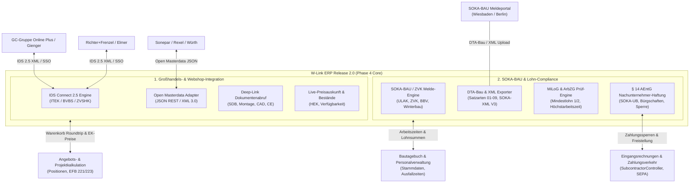
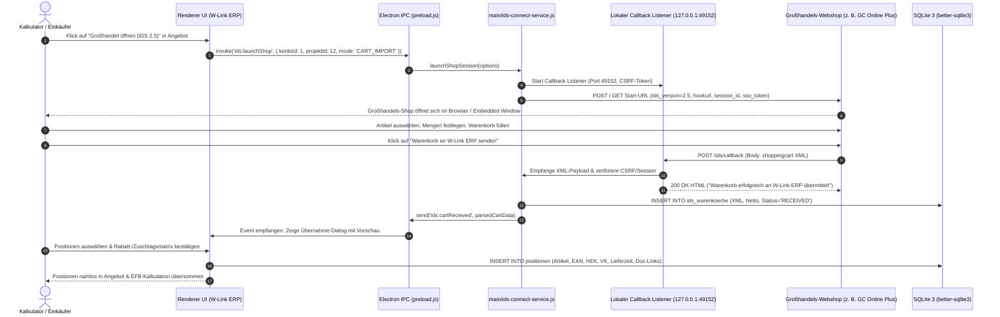
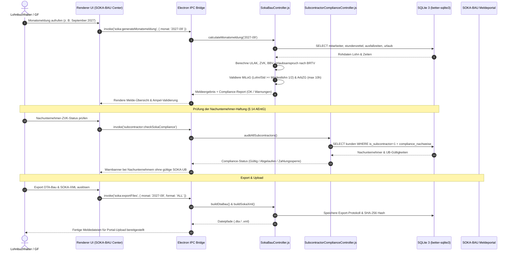

# IMPLEMENTIERUNGSPLAN PHASE 4 (RELEASE 2.0 – Q3/Q4 2027) – IDS CONNECT 2.5 / OPEN MASTERDATA GROSSHANDELS-INTEGRATION & SOKA-BAU / ZVK COMPLIANCE-ENGINE

**Version:** 2.0.0-PROD-PLAN (30.08.2026)  
**Status:** Genehmigt für Release 2.0 Roadmap  
**Autor:** Leitender Software-Architekt & Enterprise-Integrations-Experte für W-Link ERP  
**Ziel-Datei:** `plans/phase4-ids-connect-grosshandel-sokabau-compliance-plan.md`  
**Zielgruppe:** Fullstack-Entwickler, Code-Subagents, QA-Engineers, Baubetriebswirte, Lohnbuchhalter  
**Projektkonventionen:**
- **Zero Heavy Dependencies / Offline-First:** 100% autarke Desktop-Applikation auf Electron 32+ & Node.js 20+. Sämtliche IDS-Handshakes, DTA-Bau- und SOKA-BAU-XML-Exporte laufen lokal ohne externe Cloud-Zusatzdienste.
- **Isomorpher Modulaufbau:** Rechenkerne und Controller (`IDSConnectController.js`, `SokaBauController.js`, `SubcontractorComplianceController.js`) sind isomorph aufgebaut (`module.exports` UND `window.*`), sodass sie im Node.js-Backend (IPC, CLI, Tests) als auch im Renderer/UI synchron lauffähig sind.
- **Transaktionale Datenintegrität:** Alle Schreiboperationen in SQLite laufen transaktional (`better-sqlite3`) im WAL-Modus (`PRAGMA journal_mode = WAL;`) mit GoBD-konformer Prüfsummen- und Audit-Protokollierung (`audit_logs`).
- **Prüffähigkeit & Normtreue:** IDS Connect 2.5 XML-Schemas (ITEK/BVBS/ZVSHK), Open Masterdata (JSON-REST), BRTV-Bau, VTV, MiLoG und § 14 AEntG werden strikt nach gesetzlichen und tariflichen Vorgaben abgebildet.

---

## 0. Executive Summary & Zieldefinition (Release 2.0)

W-Link ERP verbindet mit **Release 2.0 (Phase 4)** die operative Kalkulation mit den führenden Großhandelsplattformen im DACH-Raum und etabliert eine rechtskonforme Lohn- und Compliance-Brücke zu den Sozialkassen des Baugewerbes (SOKA-BAU / ULAK / ZVK-Bau).



### 0.1 Die Kernziele von Phase 4

1. **IDS Connect 2.5 & SHK Connect Webshop-Integration:**
   - **Deep-Link Absprung & Single Sign-On (SSO):** Direkter Absprung aus der Projekt- und Angebotskalkulation in Großhandels-Webshops (z. B. GC-Gruppe / Online Plus, Richter+Frenzel, Würth, Gienger, Elmer, Sonepar, Rexel, Raab Karcher/STARK).
   - **Warenkorb-Export (ERP $\to$ Shop):** Übergabe von Artikellisten oder Stücklisten zur Verfügbarkeits- und Bestellprüfung an den Webshop.
   - **Warenkorb-Import (Shop $\to$ ERP):** Re-Import des im Webshop konfigurierten Warenkorbs mit Artikelnummer, EAN/GTIN, Kurztext, Langtext, Bruttopreis, Handwerker-Nettopreis (HEK), Mengeneinheit, Lieferzeit, Bild-URLs und Datenblatt-Links.
   - **Live-Preisauskunft & Verfügbarkeit:** Direkte synchrone Abfrage von kundenindividuellen Einkaufspreisen, Staffelpreisen und Filial-/Zentrallagerbeständen ohne manuellen Shop-Wechsel.
   - **Deep-Link Dokumentenabruf:** Automatisches Verknüpfen und Herunterladen von Sicherheitsdatenblättern (SDB/SDS), Montageanleitungen, technischen Zeichnungen und Leistungserklärungen (DoP).
   - **Open Masterdata / SHK Connect XML/JSON:** Zukunftssicherer Standard für Stammdatenpflege und Webservices.

2. **SOKA-BAU / ZVK Meldedaten-Export & Compliance-Engine:**
   - **Gesetzliche & Tarifliche Normierung:** Bundesrahmentarifvertrag Bau (BRTV-Bau), Tarifvertrag über das Sozialkassenverfahren im Baugewerbe (VTV), Mindestlohngesetz (MiLoG) und Arbeitnehmer-Entsendegesetz (§ 1a, § 14 AEntG).
   - **Monatliche elektronische Arbeitnehmer- und Beitragsmeldung:**
     * Berechnung von Beschäftigungstagen, tariflichen Soll-/Ist-Arbeitsstunden, Überstunden und Ausfallzeiten (Krankheit mit/ohne Entgeltfortzahlung, unbezahlter Urlaub, Saison-KUG, Mutterschutz, Schlechtwetter).
     * Meldepflichtige Bruttolohnsumme und automatische Ermittlung der Sozialkassenbeiträge: ULAK (Urlaubs- und Lohnausgleichskasse), ZVK-Bau (Zusatzversorgungskasse), Berufsbildungsverfahren (BBV) und Winterbauumlage nach Tarifgebieten (West, Ost, Berlin).
     * Urlaubsanspruchsberechnung nach BRTV: Automatische Ermittlung der erworbenen Urlaubstage, des Urlaubsvergütungsanspruchs (14,25 % West / 11,40 % Ost) sowie Verfallskontrolle.
   - **Standardisierte Meldedateien:**
     * Generierung des offiziellen **DTA-Bau Formats** (Datenträgeraustausch Bauwirtschaft mit Satzarten 01, 02, 03 und 09).
     * Generierung des strukturierten **SOKA-BAU XML-Meldedatensatzes (Version 3.0)** für den komfortablen Portal-Upload.
   - **Plausibilitätsprüfungen:** Validierung vor Export gegen Mindestlohn 1 & 2, Prüfung auf Einhaltung des Arbeitszeitgesetzes (§ 3 ArbZG - 8h/10h-Regel) und Plausibilität von Ausfallschlüsseln.
   - **Generalunternehmer-Enthaftungs-Matrix (§ 14 AEntG):**
     * Fristen- und Gültigkeitsüberwachung von SOKA-BAU Unbedenklichkeitsbescheinigungen (UB) je Nachunternehmer.
     * Automatische Warnung und optionale Zahlungssperre bei fehlender oder abgelaufener Bescheinigung in der Eingangsrechnungsprüfung.

---

## 1. Fachlicher, Technischer & Rechtlicher Rahmen

### 1.1 IDS Connect 2.5 & Open Masterdata Standard (ITEK / BVBS)

IDS Connect (Information Data Service) ist der führende Branchenstandard im SHK- und Elektro-Großhandel im DACH-Raum, herausgegeben von der **ITEK GmbH** in Kooperation mit dem **BVBS** und dem **ZVSHK**.

#### A. Kommunikationsablauf & URL-Handshake (IDS 2.5)

Der Absprung aus W-Link ERP in den Großhandelsshop erfolgt über einen parametrisierten HTTP-POST- oder GET-Request an die Start-URL des Großhändlers. Die Rückübertragung erfolgt über eine temporäre lokale Callback-URL (`hookurl`), die von W-Link ERP bereitgestellt wird.

```
+----------------------------------------------------------------------------------------------------+
| IDS CONNECT 2.5 - PARAMETER-STRUKTUR BEIM SHOP-ABSPRUNG                                            |
+----------------------------------------------------------------------------------------------------+
| Parameter             Typ       Beschreibung                                                       |
| --------------------+---------+------------------------------------------------------------------- |
| ids_version         | string  | Fester Versionsbezeichner, z. B. "2.5"                            |
| ids_action          | string  | "call" (Standard-Einstieg)                                         |
|                     |         | "cart_export" (ERP -> Shop Übergabe)                               |
|                     |         | "cart_import" / "cart_get" (Shop -> ERP Rückgabe)                 |
|                     |         | "catalog_item" (Direktaufruf Einzelartikel über EAN/Artikelnummer) |
|                     |         | "price_availability" (Webservice für Live-Bestand/Preise)         |
| hookurl             | url     | Callback-URL des ERP (z. B. "http://127.0.0.1:49152/ids/callback") |
| session_id          | string  | UUID zur Zuordnung zum geöffneten ERP-Projekt / Angebot            |
| login_type          | string  | "AUTO" | "TOKEN" | "MANUAL"                                        |
| user / password     | string  | Großhandels-Zugangsdaten (verschlüsselt übertragen)                |
| customer_number     | string  | Kundennummer des Handwerkers beim Großhändler                      |
| order_reference     | string  | Bauvorhaben / Kommissionsnummer (z. B. "BV-2027-089")              |
+----------------------------------------------------------------------------------------------------+
```

#### B. IDS Connect 2.5 Shopping Cart XML Struktur

Wenn der Handwerker im Webshop auf *„Warenkorb an ERP übertragen“* klickt, sendet der Webshop einen HTTP-POST-Request mit XML-Payload an die `hookurl`:

```xml
<?xml version="1.0" encoding="UTF-8"?>
<shopping_cart version="2.5" xmlns="http://www.itek.de/idsconnect/2.5">
  <header>
    <supplier_id>GC_ONLINE_PLUS</supplier_id>
    <customer_number>K-884920</customer_number>
    <cart_id>CART-2027-99481</cart_id>
    <cart_date>2027-09-15T10:45:00</cart_date>
    <currency>EUR</currency>
    <total_net_amount>4528.50</total_net_amount>
    <order_reference>BV Schulzentrum Neubau</order_reference>
  </header>
  <items>
    <item id="1">
      <supplier_item_number>98045120</supplier_item_number>
      <manufacturer_item_number>10530000</manufacturer_item_number>
      <ean>4011097720150</ean>
      <short_description>Hansgrohe Waschtischmischer Talis E 110 mit Ablaufgarnitur chrom</short_description>
      <long_description>ComfortZone 110, Ausladung 112 mm, Normalstrahl, Durchflussmenge bei 3 bar: 5 l/min, Keramikkartusche, Temperaturbegrenzung einstellbar, für Durchlauferhitzer geeignet, Zugstangen-Ablaufgarnitur G 1 1/4.</long_description>
      <quantity>12.000</quantity>
      <quantity_unit>Stk</quantity_unit>
      <price_basis>1</price_basis>
      <gross_price>189.00</gross_price>
      <net_price>112.50</net_price>
      <discount_group>SANI-HG-01</discount_group>
      <tax_rate>19.00</tax_rate>
      <delivery_time_days>1</delivery_time_days>
      <availability_status>IN_STOCK</availability_status>
      <image_url>https://media.gc-gruppe.de/img/hg_talis_e110.jpg</image_url>
      <documents>
        <document type="SDB" title="Sicherheitsdatenblatt">https://media.gc-gruppe.de/doc/hg_talis_sdb.pdf</document>
        <document type="MANUAL" title="Montageanleitung">https://media.gc-gruppe.de/doc/hg_talis_montage.pdf</document>
        <document type="CAD" title="Maßzeichnung">https://media.gc-gruppe.de/doc/hg_talis_cad.dxf</document>
      </documents>
    </item>
  </items>
</shopping_cart>
```

#### C. Open Masterdata & SHK Connect XML/JSON

Als moderner Nachfolgestandard zu monolithischen Datanorm-Katalogen ermöglicht **Open Masterdata** den synchronen REST-JSON-Zugriff auf über 4 Millionen Stammdatenartikel aller führenden Hersteller mit Echtzeit-Preisen, Produktdatenblättern (ETIM-Klassifizierung) und Verfügbarkeiten.

---

### 1.2 Gesetzliche & Tarifliche Grundlagen der Bauwirtschaft (SOKA-BAU)

Die Baubranche unterliegt in Deutschland strengen tarifvertraglichen und gesetzlichen Sonderregelungen:

#### A. Bundesrahmentarifvertrag für das Baugewerbe (BRTV-Bau)
- **Arbeitszeitregelungen:** Unterscheidung zwischen Sommerarbeitszeit (April–Oktober, z. B. 40h/Woche) und Winterarbeitszeit (November–März, z. B. 38h/Woche) mit tariflichen Arbeitszeitkonten.
- **Urlaubsverfahren (ULAK):** 
  - Bauarbeitnehmer erwerben ihren Urlaubsanspruch bezogen auf Beschäftigungstage bei allen Baubetrieben.
  - Formel: Für jeweils 12 Beschäftigungstage entsteht 1 Urlaubstag Anspruch (bei vollem Jahresanspruch von 30 Arbeitstagen).
  - Urlaubsvergütung: $14,25\text{ \%}$ (Tarifgebiet West) bzw. $11,40\text{ \%}$ (Tarifgebiet Ost) des beitragspflichtigen Bruttolohns.
  - Bei Urlaubsantritt zahlt der Arbeitgeber das Urlaubsentgelt aus und erhält von der ULAK die Erstattung auf Antrag.

#### B. Tarifvertrag über das Sozialkassenverfahren im Baugewerbe (VTV)
Jeder Baubetrieb ist gesetzlich verpflichtet, monatlich bis zum **15. des Folgemonats** die Arbeitnehmer- und Beitragsmeldung digital an SOKA-BAU (Wiesbaden/Berlin) zu übermitteln.

```
+----------------------------------------------------------------------------------------------------+
| SOKA-BAU BEITRAGSSÄTZE (STAND 2026/2027) IN % DES MELDELOHNS (GEWERBLICHE ARBEITNEHMER)            |
+----------------------------------------------------------------------------------------------------+
| Sparte / Kasse                           Tarifgebiet West       Tarifgebiet Ost      Berlin (West) |
| ---------------------------------------+----------------------+--------------------+-------------- |
| Urlaubs- und Lohnausgleichskasse (ULAK) | 15,20 %              | 14,00 %            | 15,05 %      |
| Zusatzversorgungskasse (ZVK-Bau)       |  3,20 %              |  0,70 %            |  3,20 %      |
| Berufsbildungsverfahren (BBV)          |  1,65 %              |  1,65 %            |  1,65 %      |
| Winterbau-Umlage                       |  1,20 % (0,80% AG)   |  1,20 % (0,80% AG) |  1,20 %      |
| ---------------------------------------+----------------------+--------------------+-------------- |
| Gesamt-SOKA-Beitrag Arbeitgeber        | 20,85 %              | 17,15 %            | 20,70 %      |
+----------------------------------------------------------------------------------------------------+
```

#### C. Generalunternehmer-Haftung nach § 14 Arbeitnehmer-Entsendegesetz (AEntG)
- Ein Generalunternehmer haftet wie ein selbstschuldnerischer Bürge für die Pflichten seiner Nachunternehmer zur Zahlung des Mindestlohns sowie der Beiträge zu den gemeinsamen Einrichtungen der Tarifvertragsparteien (SOKA-BAU / ZVK).
- **Enthaftungsvoraussetzung:** Der Generalunternehmer muss vor Arbeitsaufnahme und vor Rechnungsbegleichung eine gültige **SOKA-BAU Unbedenklichkeitsbescheinigung (UB)** oder qualifizierte Bürgschaft nachweisen.

---

### 1.3 Datensatzformate: DTA-Bau vs. SOKA-BAU XML

#### A. DTA-Bau Satzarten (Klassisches Festbreitenformat)
- **Satzart 01 (Betriebssatz / Header):** Betriebsnummer, Betriebsname, Meldezeitraum (JJJJMM), Meldebegründung, Erstellungsdatum.
- **Satzart 02 (Arbeitnehmer-Monatsmeldung):** Arbeitnehmer-Nr., VSNR (12 Zeichen), Name, Vorname, Geburtsdatum, Beschäftigungstage, tarifliche Arbeitsstunden, Bruttolohn, ULAK-Beitrag, ZVK-Beitrag, gewährtes Urlaubsentgelt, genommene Urlaubstage.
- **Satzart 03 (Ausfallzeiten & Fehlzeiten):** Arbeitnehmer-Nr., Ausfallschlüssel (01: LFZ, 02: Krank o. LFZ, 03: Unbezahlt, 04: S-KUG), von Datum, bis Datum, Ausfallstunden.
- **Satzart 09 (Summensatz / Trailer):** Anzahl gemeldeter Arbeitnehmer, Summe Bruttolohn, Summe Beiträge, Summe Erstattungsansprüche, Prüfsumme.

#### B. SOKA-BAU XML Meldeschema V3.0 (Offizieller Web-/Portal-Standard)

```xml
<?xml version="1.0" encoding="UTF-8"?>
<SokaBauMeldung xmlns="http://www.soka-bau.de/schema/meldedaten/v3" version="3.0">
  <Header>
    <Betriebsnummer>98765432</Betriebsnummer>
    <BetriebsName>W-Link Bauunternehmung GmbH</BetriebsName>
    <MeldeMonat>2027-09</MeldeMonat>
    <ErstellungsZeitstempel>2027-10-05T14:30:00</ErstellungsZeitstempel>
    <Software>W-Link ERP v2.0</Software>
  </Header>
  <ArbeitnehmerMeldungen>
    <Arbeitnehmer id="104">
      <ArbeitnehmerNummer>AN-0104</ArbeitnehmerNummer>
      <SozialversicherungsNummer>65120458K014</SozialversicherungsNummer>
      <Name>Mustermann</Name>
      <Vorname>Maximilian</Vorname>
      <Geburtsdatum>1988-04-12</Geburtsdatum>
      <Tarifgebiet>WEST</Tarifgebiet>
      <BeschaeftigungsArt>GEWERBLICH</BeschaeftigungsArt>
      <Beschaeftigungstage>30</Beschaeftigungstage>
      <GeleisteteStunden>168.00</GeleisteteStunden>
      <Bruttolohn>4452.00</Bruttolohn>
      <Beitraege>
        <UlakBeitrag>676.70</UlakBeitrag>
        <ZvkBeitrag>142.46</ZvkBeitrag>
        <BbvBeitrag>73.46</BbvBeitrag>
        <GesamtBeitrag>892.62</GesamtBeitrag>
      </Beitraege>
      <Urlaubsanspruch>
        <ErworbeneTage>2.50</ErworbeneTage>
        <ErworbeneVerguetung>634.41</ErworbeneVerguetung>
        <GenommeneTage>0.00</GenommeneTage>
        <AusbezahlteVerguetung>0.00</AusbezahlteVerguetung>
      </Urlaubsanspruch>
      <Ausfallzeiten>
        <Ausfallzeit schluessel="01" bezeichnung="Entgeltfortzahlung Krankheit">
          <Von>2027-09-06</Von>
          <Bis>2027-09-08</Bis>
          <Stunden>24.00</Stunden>
        </Ausfallzeit>
      </Ausfallzeiten>
    </Arbeitnehmer>
  </ArbeitnehmerMeldungen>
  <SummenBlock>
    <AnzahlArbeitnehmer>1</AnzahlArbeitnehmer>
    <GesamtBruttolohn>4452.00</GesamtBruttolohn>
    <GesamtBeitragssumme>892.62</GesamtBeitragssumme>
    <GesamtErstattungsanspruch>0.00</GesamtErstattungsanspruch>
    <Zahlbetrag>892.62</Zahlbetrag>
  </SummenBlock>
</SokaBauMeldung>
```

---

## 2. Systemarchitektur & Sequenzdiagramme

### 2.1 IDS Connect 2.5 Roundtrip-Architektur (Warenkorb-Austausch)



### 2.2 SOKA-BAU Monatsmelde- und Prüfzyklus



---

## 3. Teil 1: IDS Connect 2.5 & Open Masterdata Großhandels-Integration

### 3.1 Isomorpher Controller `controllers/IDSConnectController.js`

```javascript
/**
 * controllers/IDSConnectController.js - Isomorpher Rechenkern & Parser für IDS Connect 2.5 & Open Masterdata
 * Unterstützt GC-Gruppe, Richter+Frenzel, Gienger, Elmer, Sonepar, Rexel, Würth u.v.m.
 */

class IDSConnectController {
    /**
     * Erstellt die vollständige Start-URL inklusive aller IDS 2.5 Parameter für den Webshop-Absprung.
     * @param {Object} konto - Großhandelskonto-Konfiguration aus ids_connect_konten
     * @param {Object} options - { action, hookUrl, sessionId, orderReference, itemNumber }
     * @returns {string} Vollständige HTTPS-URL mit Parametern
     */
    static buildLaunchUrl(konto, options = {}) {
        if (!konto || !konto.shop_url) {
            throw new Error('Ungültiges Großhandelskonto: Keine Shop-URL konfiguriert.');
        }

        const baseUrl = konto.shop_url.trim();
        const url = new URL(baseUrl);
        const params = url.searchParams;

        // IDS 2.5 Standard-Parameter
        params.set('ids_version', '2.5');
        params.set('ids_action', options.action || 'call');
        params.set('hookurl', options.hookUrl || 'http://127.0.0.1:49152/ids/callback');
        params.set('session_id', options.sessionId || `IDS-${Date.now()}`);

        if (konto.kundennummer) {
            params.set('customer_number', konto.kundennummer);
        }
        if (options.orderReference) {
            params.set('order_reference', options.orderReference);
        }
        if (options.itemNumber && (options.action === 'catalog_item' || options.action === 'deep_link')) {
            params.set('item_number', options.itemNumber);
        }
        if (konto.api_key) {
            params.set('auth_token', konto.api_key);
        }

        return url.toString();
    }

    /**
     * Parst eine IDS Connect 2.5 XML-Warenkorbdatei und extrahiert standardisierte Positionen.
     * @param {string} xmlString - Der rohe XML-String des Shopping-Carts
     * @returns {Object} { header, items, totalNet, totalGross }
     */
    static parseShoppingCartXml(xmlString) {
        if (!xmlString || typeof xmlString !== 'string') {
            throw new Error('Ungültiger oder leerer Shopping-Cart XML-Inhalt.');
        }

        const header = {
            supplierId: this._extractTag(xmlString, 'supplier_id'),
            customerNumber: this._extractTag(xmlString, 'customer_number'),
            cartId: this._extractTag(xmlString, 'cart_id') || `CART-${Date.now()}`,
            cartDate: this._extractTag(xmlString, 'cart_date') || new Date().toISOString(),
            currency: this._extractTag(xmlString, 'currency') || 'EUR',
            totalNetAmount: parseFloat(this._extractTag(xmlString, 'total_net_amount')) || 0,
            orderReference: this._extractTag(xmlString, 'order_reference') || ''
        };

        const items = [];
        const itemRegex = /<item\b[^>]*>([\s\S]*?)<\/item>/gi;
        let itemMatch;

        while ((itemMatch = itemRegex.exec(xmlString)) !== null) {
            const itemXml = itemMatch[1];
            
            const quantity = parseFloat(this._extractTag(itemXml, 'quantity')) || 1.0;
            const priceBasis = parseFloat(this._extractTag(itemXml, 'price_basis')) || 1.0;
            const grossPriceRaw = parseFloat(this._extractTag(itemXml, 'gross_price')) || 0.0;
            const netPriceRaw = parseFloat(this._extractTag(itemXml, 'net_price')) || 0.0;
            
            // Berechnung der Einzelpreise je Mengeneinheit unter Berücksichtigung der Preisbasis (1, 10, 100, 1000)
            const grossPrice = Math.round((grossPriceRaw / priceBasis) * 10000) / 10000;
            const netPrice = Math.round((netPriceRaw / priceBasis) * 10000) / 10000;
            const posNetTotal = Math.round((quantity * netPrice) * 100) / 100;

            // Extraktion von verknüpften Dokumenten (Sicherheitsdatenblätter, Montageanleitungen)
            const documents = [];
            const docRegex = /<document\s+type="([^"]*)"\s*title="([^"]*)">([\s\S]*?)<\/document>/gi;
            let docMatch;
            while ((docMatch = docRegex.exec(itemXml)) !== null) {
                documents.push({
                    type: docMatch[1],
                    title: docMatch[2],
                    url: docMatch[3].trim()
                });
            }

            items.push({
                supplierItemNumber: this._extractTag(itemXml, 'supplier_item_number'),
                manufacturerItemNumber: this._extractTag(itemXml, 'manufacturer_item_number'),
                ean: this._extractTag(itemXml, 'ean'),
                shortDescription: this._extractTag(itemXml, 'short_description') || 'Unbekannter Artikel',
                longDescription: this._extractTag(itemXml, 'long_description') || '',
                quantity,
                quantityUnit: this._extractTag(itemXml, 'quantity_unit') || 'Stk',
                priceBasis,
                grossPrice,
                netPrice,
                posNetTotal,
                discountGroup: this._extractTag(itemXml, 'discount_group'),
                taxRate: parseFloat(this._extractTag(itemXml, 'tax_rate')) || 19.0,
                deliveryTimeDays: parseInt(this._extractTag(itemXml, 'delivery_time_days'), 10) || 1,
                availabilityStatus: this._extractTag(itemXml, 'availability_status') || 'AVAILABLE',
                imageUrl: this._extractTag(itemXml, 'image_url') || null,
                documents
            });
        }

        const calculatedNetTotal = items.reduce((sum, it) => sum + it.posNetTotal, 0);

        return {
            header,
            items,
            totalNetAmount: header.totalNetAmount > 0 ? header.totalNetAmount : Math.round(calculatedNetTotal * 100) / 100,
            itemCount: items.length
        };
    }

    /**
     * Erzeugt eine IDS 2.5 konforme Shopping-Cart Export-XML für die Übergabe an den Webshop.
     * @param {Array} positionen - Liste der ERP-Positionen
     * @param {Object} options - { customerNumber, orderReference, supplierId }
     * @returns {string} XML-String
     */
    static generateCartExportXml(positionen = [], options = {}) {
        const dateStr = new Date().toISOString();
        let itemsXml = '';

        positionen.forEach((pos, idx) => {
            const menge = parseFloat(pos.menge) || 1.0;
            const ek = parseFloat(pos.ek || pos.net_price || pos.preis) || 0.0;
            const gross = parseFloat(pos.vk || pos.gross_price || pos.preis) || ek;

            itemsXml += `
    <item id="${idx + 1}">
      <supplier_item_number>${this._escapeXml(pos.artikel_nr || pos.supplierItemNumber || '')}</supplier_item_number>
      <ean>${this._escapeXml(pos.ean || '')}</ean>
      <short_description>${this._escapeXml(pos.name || pos.shortDescription || '')}</short_description>
      <quantity>${menge.toFixed(3)}</quantity>
      <quantity_unit>${this._escapeXml(pos.einheit || 'Stk')}</quantity_unit>
      <price_basis>1</price_basis>
      <gross_price>${gross.toFixed(2)}</gross_price>
      <net_price>${ek.toFixed(2)}</net_price>
      <tax_rate>${(pos.mwst || 19).toFixed(2)}</tax_rate>
    </item>`;
        });

        return `<?xml version="1.0" encoding="UTF-8"?>
<shopping_cart version="2.5" xmlns="http://www.itek.de/idsconnect/2.5">
  <header>
    <supplier_id>${this._escapeXml(options.supplierId || 'WLINK_ERP')}</supplier_id>
    <customer_number>${this._escapeXml(options.customerNumber || '')}</customer_number>
    <cart_id>EXP-${Date.now()}</cart_id>
    <cart_date>${dateStr}</cart_date>
    <currency>EUR</currency>
    <order_reference>${this._escapeXml(options.orderReference || '')}</order_reference>
  </header>
  <items>${itemsXml}
  </items>
</shopping_cart>`;
    }

    /**
     * Parst eine Open Masterdata JSON-Antwort (modernes REST-Format).
     */
    static parseOpenMasterdataResponse(jsonResponse) {
        if (!jsonResponse || !Array.isArray(jsonResponse.articles)) {
            throw new Error('Ungültiges Open Masterdata JSON-Format.');
        }

        return jsonResponse.articles.map(art => ({
            supplierItemNumber: art.articleId || art.itemNumber,
            manufacturerItemNumber: art.manufacturerArticleId || '',
            ean: art.gtin || art.ean || '',
            shortDescription: art.description1 || art.name || '',
            longDescription: art.description2 || art.longDescription || '',
            quantity: 1.0,
            quantityUnit: art.unit || 'Stk',
            grossPrice: parseFloat(art.priceGross) || 0.0,
            netPrice: parseFloat(art.priceNet) || 0.0,
            availabilityStatus: art.stockStatus || 'UNKNOWN',
            deliveryTimeDays: parseInt(art.deliveryDays, 10) || 1,
            imageUrl: art.images && art.images.length > 0 ? art.images[0].url : null,
            documents: (art.attachments || []).map(att => ({
                type: att.type || 'DOC',
                title: att.title || 'Dokument',
                url: att.url
            }))
        }));
    }

    static _extractTag(xml, tagName) {
        const regex = new RegExp(`<${tagName}[^>]*>([\\s\\S]*?)<\\/${tagName}>`, 'i');
        const match = regex.exec(xml);
        return match ? match[1].trim() : null;
    }

    static _escapeXml(str) {
        return String(str || '')
            .replace(/&/g, '&amp;')
            .replace(/</g, '&lt;')
            .replace(/>/g, '&gt;')
            .replace(/"/g, '&quot;')
            .replace(/'/g, '&apos;');
    }
}

if (typeof module !== 'undefined' && module.exports) {
    module.exports = IDSConnectController;
} else {
    window.IDSConnectController = IDSConnectController;
}
```

### 3.2 Electron Backend Service `main/ids-connect-service.js`

Der `IDSConnectService` läuft im Electron Main-Process, startet einen temporären lokalen Loopback-HTTP-Server für den Callback und öffnet den Großhandels-Shop im System-Browser oder Electron-Modal:

```javascript
/**
 * main/ids-connect-service.js - Lokaler Loopback-Callback-Server & Webservice-Client für IDS 2.5
 */

const http = require('http');
const { shell } = require('electron');
const crypto = require('crypto');
const IDSConnectController = require('../controllers/IDSConnectController');

class IDSConnectService {
    constructor(db, auditLogger) {
        this.db = db;
        this.auditLogger = auditLogger;
        this.server = null;
        this.activeSessions = new Map(); // sessionId -> { resolve, reject, csrfToken, projektId }
        this.port = 49152;
    }

    /**
     * Startet den lokalen HTTP-Server für IDS Connect Rückrufe (HookURL).
     */
    startLocalServer() {
        if (this.server) return Promise.resolve(this.port);

        return new Promise((resolve, reject) => {
            this.server = http.createServer((req, res) => {
                this._handleHttpRequest(req, res);
            });

            this.server.listen(this.port, '127.0.0.1', () => {
                console.log(`[IDSConnectService] Lokaler Callback-Server läuft auf http://127.0.0.1:${this.port}`);
                resolve(this.port);
            });

            this.server.on('error', (err) => {
                console.error('[IDSConnectService] Serverfehler:', err);
                reject(err);
            });
        });
    }

    /**
     * Behandelt eingehende POST-Requests von Großhandels-Webshops.
     */
    _handleHttpRequest(req, res) {
        if (req.method === 'POST' && req.url.startsWith('/ids/callback')) {
            let body = '';
            req.on('data', chunk => { body += chunk; });
            req.on('end', () => {
                try {
                    // Extrahiere Warenkorb-XML aus x-www-form-urlencoded oder raw XML
                    let xmlPayload = body;
                    if (body.includes('shoppingcart=')) {
                        const params = new URLSearchParams(body);
                        xmlPayload = params.get('shoppingcart') || body;
                    }

                    const parsedCart = IDSConnectController.parseShoppingCartXml(xmlPayload);

                    // Speichere Roh-Warenkorb in der Datenbank
                    const insertStmt = this.db.prepare(`
                        INSERT INTO ids_warenkoerbe (
                            lieferant, cart_id, cart_xml, netto_gesamt, status, items_count
                        ) VALUES (?, ?, ?, ?, 'RECEIVED', ?)
                    `);
                    
                    const supplier = parsedCart.header.supplierId || 'GROSSHANDEL';
                    const result = insertStmt.run(
                        supplier,
                        parsedCart.header.cartId,
                        xmlPayload,
                        parsedCart.totalNetAmount,
                        parsedCart.items.length
                    );

                    parsedCart.databaseCartId = result.lastInsertRowid;

                    // Erfolgs-HTML für den Webshop-Browser senden
                    res.writeHead(200, { 'Content-Type': 'text/html; charset=utf-8' });
                    res.end(`
                        <!DOCTYPE html>
                        <html>
                        <head><title>W-Link ERP - Übernahme erfolgreich</title></head>
                        <body style="font-family: sans-serif; text-align: center; padding: 40px; background: #f0fdf4;">
                            <h2 style="color: #166534;">✓ Warenkorb erfolgreich an W-Link ERP übermittelt</h2>
                            <p>${parsedCart.items.length} Artikel mit einem Gesamtwert von ${parsedCart.totalNetAmount.toFixed(2)} € wurden übertragen.</p>
                            <p style="color: #6b7280; font-size: 14px;">Sie können diesen Tab nun schließen und in W-Link ERP fortfahren.</p>
                        </body>
                        </html>
                    `);

                    // Benachrichtige UI / Renderer über empfangenen Warenkorb
                    if (this.onCartReceivedCallback) {
                        this.onCartReceivedCallback(parsedCart);
                    }
                } catch (err) {
                    console.error('[IDSConnectService] Fehler beim Verarbeiten des Warenkorbs:', err);
                    res.writeHead(500, { 'Content-Type': 'text/plain; charset=utf-8' });
                    res.end(`Fehler beim Verarbeiten des Warenkorbs: ${err.message}`);
                }
            });
        } else {
            res.writeHead(404, { 'Content-Type': 'text/plain' });
            res.end('Not Found');
        }
    }

    /**
     * Startet den Absprung in den Großhandels-Webshop.
     */
    async launchShop(kontoId, options = {}) {
        await this.startLocalServer();

        const konto = this.db.prepare('SELECT * FROM ids_connect_konten WHERE id = ?').get(kontoId);
        if (!konto) throw new Error(`Großhandelskonto mit ID ${kontoId} nicht gefunden.`);

        const sessionId = `IDS-${crypto.randomUUID()}`;
        const hookUrl = `http://127.0.0.1:${this.port}/ids/callback?session_id=${sessionId}`;

        const launchUrl = IDSConnectController.buildLaunchUrl(konto, {
            action: options.action || 'call',
            hookUrl,
            sessionId,
            orderReference: options.orderReference || 'W-Link ERP Kalkulation',
            itemNumber: options.itemNumber
        });

        // Öffne Shop im Standard-Browser
        await shell.openExternal(launchUrl);

        return {
            success: true,
            sessionId,
            launchUrl,
            message: `Großhandel ${konto.name} wurde im Browser geöffnet.`
        };
    }
}

module.exports = IDSConnectService;
```

---

## 4. Teil 2: SOKA-BAU / ZVK Meldedaten-Engine & Compliance

### 4.1 Isomorpher Controller `controllers/SokaBauController.js`

```javascript
/**
 * controllers/SokaBauController.js - SOKA-BAU Meldedaten-Engine & BRTV/MiLoG Compliance-Prüfung
 * Berechnet ULAK, ZVK, BBV, Winterbauumlage und Urlaubsansprüche nach Bundesrahmentarifvertrag Bau (BRTV).
 */

class SokaBauController {
    /**
     * Tarifliche Beitragssätze (Stand 2026/2027) je Tarifgebiet.
     */
    static getBeitragssaetze(tarifgebiet = 'WEST') {
        const saetze = {
            WEST: {
                ulak: 15.20, // Urlaubskasse
                zvk: 3.20,   // Zusatzversorgungskasse (Altersvorsorge)
                bbv: 1.65,   // Berufsbildungsverfahren
                winterbauAg: 0.80, // Winterbau-Umlage AG-Anteil
                winterbauAn: 0.40, // Winterbau-Umlage AN-Anteil
                urlaubsverguetungSatz: 14.25 // % vom Bruttolohn für Urlaubsanspruch
            },
            OST: {
                ulak: 14.00,
                zvk: 0.70,
                bbv: 1.65,
                winterbauAg: 0.80,
                winterbauAn: 0.40,
                urlaubsverguetungSatz: 11.40
            },
            BERLIN_WEST: {
                ulak: 15.05,
                zvk: 3.20,
                bbv: 1.65,
                winterbauAg: 0.80,
                winterbauAn: 0.40,
                urlaubsverguetungSatz: 14.25
            },
            BERLIN_OST: {
                ulak: 14.00,
                zvk: 0.70,
                bbv: 1.65,
                winterbauAg: 0.80,
                winterbauAn: 0.40,
                urlaubsverguetungSatz: 11.40
            }
        };

        return saetze[tarifgebiet] || saetze.WEST;
    }

    /**
     * Gesetzliche & tarifliche Mindestlöhne im Baugewerbe (Stand 2026/2027).
     */
    static getMindestlohnGrenzen() {
        return {
            milogGesetzlich: 12.82, // Gesetzlicher Mindestlohn
            mindestlohn1: 14.35,    // Bauhauptgewerbe Mindestlohn 1 (Werker / Hilfsarbeiter)
            mindestlohn2: 16.50     // Bauhauptgewerbe Mindestlohn 2 (Facharbeiter West)
        };
    }

    /**
     * Berechnet die vollständige Monatsmeldung für einen Mitarbeiter nach BRTV.
     * @param {Object} mitarbeiter - Stammdaten des Arbeitnehmers
     * @param {Object} monatsDaten - { bruttoLohn, geleisteteStunden, beschaeftigungstage, ausfallzeiten, genommenerUrlaubTage, ausbezahltesUrlaubsentgelt }
     */
    static calculateArbeitnehmerMonat(mitarbeiter, monatsDaten = {}) {
        const tarifgebiet = mitarbeiter.tarifgebiet || 'WEST';
        const saetze = this.getBeitragssaetze(tarifgebiet);
        const bruttoLohn = Math.round((parseFloat(monatsDaten.bruttoLohn) || 0) * 100) / 100;
        const geleisteteStunden = parseFloat(monatsDaten.geleisteteStunden) || 0.0;
        const beschaeftigungstage = parseInt(monatsDaten.beschaeftigungstage, 10) || 30;

        // 1. Berechnung der SOKA-BAU Beiträge
        const ulakBeitrag = Math.round(bruttoLohn * (saetze.ulak / 100) * 100) / 100;
        const zvkBeitrag = Math.round(bruttoLohn * (saetze.zvk / 100) * 100) / 100;
        const bbvBeitrag = Math.round(bruttoLohn * (saetze.bbv / 100) * 100) / 100;
        const winterbauAg = Math.round(bruttoLohn * (saetze.winterbauAg / 100) * 100) / 100;
        const gesamtBeitrag = Math.round((ulakBeitrag + zvkBeitrag + bbvBeitrag + winterbauAg) * 100) / 100;

        // 2. Urlaubsanspruchsberechnung nach BRTV: Für je 12 Beschäftigungstage = 1 Urlaubstag
        const erworbeneUrlaubstage = Math.round((beschaeftigungstage / 12) * 100) / 100;
        const erworbeneUrlaubsverguetung = Math.round(bruttoLohn * (saetze.urlaubsverguetungSatz / 100) * 100) / 100;

        const genommeneTage = parseFloat(monatsDaten.genommenerUrlaubTage) || 0.0;
        const ausbezahltesUrlaubsentgelt = parseFloat(monatsDaten.ausbezahltesUrlaubsentgelt) || 0.0;

        // Erstattungsanspruch gegenüber ULAK für ausgezahltes Urlaubsentgelt
        const ulakErstattungsanspruch = ausbezahltesUrlaubsentgelt;

        // 3. Compliance- & Plausibilitätsprüfungen
        const complianceWarnings = [];
        const mindestlohnLimits = this.getMindestlohnGrenzen();

        if (geleisteteStunden > 0) {
            const rechnerischerStundensatz = Math.round((bruttoLohn / geleisteteStunden) * 100) / 100;
            if (rechnerischerStundensatz < mindestlohnLimits.mindestlohn1) {
                complianceWarnings.push({
                    code: 'MINDESTLOHN_UNTERSCHRITTEN',
                    level: 'ERROR',
                    message: `Rechnerischer Stundenlohn (${rechnerischerStundensatz.toFixed(2)} €/h) unterschreitet tariflichen Mindestlohn 1 (${mindestlohnLimits.mindestlohn1.toFixed(2)} €/h)!`
                });
            }
        }

        // ArbZG Höchstarbeitszeit-Prüfung (z. B. > 220 Stunden/Monat)
        if (geleisteteStunden > 220) {
            complianceWarnings.push({
                code: 'HOECHSTARBEITSZEIT_UEBERSCHRITTEN',
                level: 'WARN',
                message: `Geleistete Monatsstunden (${geleisteteStunden} h) deuten auf eine Überschreitung der zulässigen Höchstarbeitszeit nach § 3 ArbZG hin.`
            });
        }

        return {
            mitarbeiterId: mitarbeiter.id,
            anNummer: mitarbeiter.an_nummer || `AN-${mitarbeiter.id}`,
            vsnr: mitarbeiter.vsnr || '',
            name: mitarbeiter.name,
            vorname: mitarbeiter.vorname,
            tarifgebiet,
            beschaeftigungstage,
            geleisteteStunden,
            bruttoLohn,
            beitraege: {
                ulakBeitrag,
                zvkBeitrag,
                bbvBeitrag,
                winterbauAg,
                gesamtBeitrag
            },
            urlaub: {
                erworbeneUrlaubstage,
                erworbeneUrlaubsverguetung,
                genommeneTage,
                ausbezahltesUrlaubsentgelt,
                ulakErstattungsanspruch
            },
            ausfallzeiten: monatsDaten.ausfallzeiten || [],
            complianceStatus: complianceWarnings.some(w => w.level === 'ERROR') ? 'INVALID' : (complianceWarnings.length > 0 ? 'WARNING' : 'VALID'),
            complianceWarnings
        };
    }

    /**
     * Erzeugt den normierten DTA-Bau Datensatz (Datenträgeraustausch Festbreitenformat).
     */
    static generateDtaBauString(betrieb, monatsMeldungen = [], meldeMonat = '202709') {
        const lines = [];
        const dateNow = new Date().toISOString().replace(/[-:T.]/g, '').slice(0, 8); // JJJJMMDD

        // 1. Satzart 01 - Betriebssatz (Header)
        const bnr = (betrieb.betriebsnummer || '00000000').padEnd(8, ' ').slice(0, 8);
        const bName = (betrieb.name || 'W-Link Bau GmbH').padEnd(30, ' ').slice(0, 30);
        lines.push(`01${bnr}${meldeMonat}${bName}${dateNow}${' '.repeat(40)}`);

        let summeBrutto = 0;
        let summeBeitrag = 0;
        let summeErstattung = 0;

        // 2. Satzart 02 - Arbeitnehmer-Sätze
        monatsMeldungen.forEach(m => {
            summeBrutto += m.bruttoLohn;
            summeBeitrag += m.beitraege.gesamtBeitrag;
            summeErstattung += m.urlaub.ulakErstattungsanspruch;

            const anNr = (m.anNummer || '').padEnd(10, ' ').slice(0, 10);
            const vsnr = (m.vsnr || '').padEnd(12, ' ').slice(0, 12);
            const name = (`${m.name}, ${m.vorname}`).padEnd(30, ' ').slice(0, 30);
            const tage = String(m.beschaeftigungstage).padStart(2, '0');
            const std = String(Math.round(m.geleisteteStunden * 100)).padStart(6, '0');
            const brutto = String(Math.round(m.bruttoLohn * 100)).padStart(8, '0');
            const beitrag = String(Math.round(m.beitraege.gesamtBeitrag * 100)).padStart(8, '0');
            const erstattung = String(Math.round(m.urlaub.ulakErstattungsanspruch * 100)).padStart(8, '0');

            lines.push(`02${bnr}${meldeMonat}${anNr}${vsnr}${name}${tage}${std}${brutto}${beitrag}${erstattung}`);

            // Satzart 03 - Ausfallzeiten
            (m.ausfallzeiten || []).forEach(af => {
                const schluessel = String(af.schluessel || '01').padStart(2, '0');
                const von = (af.von || '').replace(/-/g, '').slice(0, 8);
                const bis = (af.bis || '').replace(/-/g, '').slice(0, 8);
                const afStd = String(Math.round((af.stunden || 0) * 100)).padStart(5, '0');
                lines.push(`03${bnr}${meldeMonat}${anNr}${schluessel}${von}${bis}${afStd}`);
            });
        });

        // 3. Satzart 09 - Summensatz (Trailer)
        const anzahlAn = String(monatsMeldungen.length).padStart(5, '0');
        const sumBruttoStr = String(Math.round(summeBrutto * 100)).padStart(10, '0');
        const sumBeitragStr = String(Math.round(summeBeitrag * 100)).padStart(10, '0');
        const sumErstattungStr = String(Math.round(summeErstattung * 100)).padStart(10, '0');
        const zahlbetrag = String(Math.round((summeBeitrag - summeErstattung) * 100)).padStart(10, '0');

        lines.push(`09${bnr}${meldeMonat}${anzahlAn}${sumBruttoStr}${sumBeitragStr}${sumErstattungStr}${zahlbetrag}`);

        return lines.join('\r\n');
    }

    /**
     * Erzeugt das offizielle SOKA-BAU XML-Meldedokument (Version 3.0).
     */
    static generateSokaBauXml(betrieb, monatsMeldungen = [], meldeMonat = '2027-09') {
        const timestamp = new Date().toISOString();
        let itemsXml = '';

        let totalBrutto = 0;
        let totalBeitrag = 0;
        let totalErstattung = 0;

        monatsMeldungen.forEach(m => {
            totalBrutto += m.bruttoLohn;
            totalBeitrag += m.beitraege.gesamtBeitrag;
            totalErstattung += m.urlaub.ulakErstattungsanspruch;

            let afXml = '';
            (m.ausfallzeiten || []).forEach(af => {
                afXml += `
        <Ausfallzeit schluessel="${this._escapeXml(af.schluessel)}" bezeichnung="${this._escapeXml(af.bezeichnung || '')}">
          <Von>${this._escapeXml(af.von)}</Von>
          <Bis>${this._escapeXml(af.bis)}</Bis>
          <Stunden>${(parseFloat(af.stunden) || 0).toFixed(2)}</Stunden>
        </Ausfallzeit>`;
            });

            itemsXml += `
    <Arbeitnehmer id="${m.mitarbeiterId}">
      <ArbeitnehmerNummer>${this._escapeXml(m.anNummer)}</ArbeitnehmerNummer>
      <SozialversicherungsNummer>${this._escapeXml(m.vsnr)}</SozialversicherungsNummer>
      <Name>${this._escapeXml(m.name)}</Name>
      <Vorname>${this._escapeXml(m.vorname)}</Vorname>
      <Tarifgebiet>${this._escapeXml(m.tarifgebiet)}</Tarifgebiet>
      <Beschaeftigungstage>${m.beschaeftigungstage}</Beschaeftigungstage>
      <GeleisteteStunden>${m.geleisteteStunden.toFixed(2)}</GeleisteteStunden>
      <Bruttolohn>${m.bruttoLohn.toFixed(2)}</Bruttolohn>
      <Beitraege>
        <UlakBeitrag>${m.beitraege.ulakBeitrag.toFixed(2)}</UlakBeitrag>
        <ZvkBeitrag>${m.beitraege.zvkBeitrag.toFixed(2)}</ZvkBeitrag>
        <BbvBeitrag>${m.beitraege.bbvBeitrag.toFixed(2)}</BbvBeitrag>
        <GesamtBeitrag>${m.beitraege.gesamtBeitrag.toFixed(2)}</GesamtBeitrag>
      </Beitraege>
      <Urlaubsanspruch>
        <ErworbeneTage>${m.urlaub.erworbeneUrlaubstage.toFixed(2)}</ErworbeneTage>
        <ErworbeneVerguetung>${m.urlaub.erworbeneUrlaubsverguetung.toFixed(2)}</ErworbeneVerguetung>
        <GenommeneTage>${m.urlaub.genommeneTage.toFixed(2)}</GenommeneTage>
        <AusbezahlteVerguetung>${m.urlaub.ausbezahltesUrlaubsentgelt.toFixed(2)}</AusbezahlteVerguetung>
      </Urlaubsanspruch>
      <Ausfallzeiten>${afXml}
      </Ausfallzeiten>
    </Arbeitnehmer>`;
        });

        const zahlbetrag = Math.round((totalBeitrag - totalErstattung) * 100) / 100;

        return `<?xml version="1.0" encoding="UTF-8"?>
<SokaBauMeldung xmlns="http://www.soka-bau.de/schema/meldedaten/v3" version="3.0">
  <Header>
    <Betriebsnummer>${this._escapeXml(betrieb.betriebsnummer || '00000000')}</Betriebsnummer>
    <BetriebsName>${this._escapeXml(betrieb.name || 'W-Link Bau GmbH')}</BetriebsName>
    <MeldeMonat>${this._escapeXml(meldeMonat)}</MeldeMonat>
    <ErstellungsZeitstempel>${timestamp}</ErstellungsZeitstempel>
    <Software>W-Link ERP v2.0</Software>
  </Header>
  <ArbeitnehmerMeldungen>${itemsXml}
  </ArbeitnehmerMeldungen>
  <SummenBlock>
    <AnzahlArbeitnehmer>${monatsMeldungen.length}</AnzahlArbeitnehmer>
    <GesamtBruttolohn>${totalBrutto.toFixed(2)}</GesamtBruttolohn>
    <GesamtBeitragssumme>${totalBeitrag.toFixed(2)}</GesamtBeitragssumme>
    <GesamtErstattungsanspruch>${totalErstattung.toFixed(2)}</GesamtErstattungsanspruch>
    <Zahlbetrag>${zahlbetrag.toFixed(2)}</Zahlbetrag>
  </SummenBlock>
</SokaBauMeldung>`;
    }

    static _escapeXml(str) {
        return String(str || '')
            .replace(/&/g, '&amp;')
            .replace(/</g, '&lt;')
            .replace(/>/g, '&gt;')
            .replace(/"/g, '&quot;')
            .replace(/'/g, '&apos;');
    }
}

if (typeof module !== 'undefined' && module.exports) {
    module.exports = SokaBauController;
} else {
    window.SokaBauController = SokaBauController;
}
```

### 4.2 Generalunternehmer-Enthaftungs-Engine (`controllers/SubcontractorComplianceController.js`)

Erweitert die bestehende Subunternehmer-Prüfung (`controllers/SubcontractorController.js`) um die zwingende SOKA-BAU Unbedenklichkeitsbescheinigung (UB) nach **§ 14 AEntG**:

```javascript
/**
 * controllers/SubcontractorComplianceController.js - GU-Enthaftung nach § 14 AEntG & § 48b EStG
 */

class SubcontractorComplianceController {
    /**
     * Prüft die vollständige Compliance eines Nachunternehmers vor Auszahlung / Freigabe.
     * @param {Object} sub - Subunternehmer-Datensatz aus kunden
     * @param {Array} nachweise - Zugehörige Nachweise aus subcontractor_compliance_nachweise
     * @param {Date|string} pruefDatum - Stichtag der Prüfung
     */
    static verifySubcontractorCompliance(sub, nachweise = [], pruefDatum = new Date()) {
        if (!sub || !sub.is_subcontractor) {
            return { isCompliant: true, status: 'NOT_APPLICABLE', canPay: true, warnings: [] };
        }

        const today = new Date(pruefDatum);
        const warnings = [];
        let canPay = true;

        // 1. Prüfung § 48b EStG Freistellungsbescheinigung (Finanzamt)
        const sec48bUntil = sub.sec48b_valid_until || sub.freistellung_gueltig_bis;
        if (!sec48bUntil || new Date(sec48bUntil) < today) {
            warnings.push({
                type: 'SEC48B_EXPIRED',
                level: 'CRITICAL',
                message: 'Keine gültige § 48b Freistellungsbescheinigung! 15% Bauabzugsteuer zwingend einbehalten.'
            });
        }

        // 2. Prüfung SOKA-BAU Unbedenklichkeitsbescheinigung (UB) nach § 14 AEntG
        const sokaNachweis = nachweise.find(n => n.nachweis_typ === 'SOKA_BAU_UB' && n.status === 'ACTIVE');
        if (!sokaNachweis || !sokaNachweis.gueltig_bis) {
            canPay = false;
            warnings.push({
                type: 'SOKA_UB_MISSING',
                level: 'LOCK_PAYMENT',
                message: 'SOKA-BAU Unbedenklichkeitsbescheinigung fehlt! Generalunternehmer-Haftung nach § 14 AEntG greift. Auszahlung gesperrt.'
            });
        } else if (new Date(sokaNachweis.gueltig_bis) < today) {
            canPay = false;
            warnings.push({
                type: 'SOKA_UB_EXPIRED',
                level: 'LOCK_PAYMENT',
                message: `SOKA-BAU Unbedenklichkeitsbescheinigung ist seit ${sokaNachweis.gueltig_bis} abgelaufen! Auszahlung blockiert.`
            });
        } else {
            const daysLeft = Math.ceil((new Date(sokaNachweis.gueltig_bis) - today) / (1000 * 60 * 60 * 24));
            if (daysLeft <= 30) {
                warnings.push({
                    type: 'SOKA_UB_EXPIRING_SOON',
                    level: 'WARNING',
                    message: `SOKA-BAU Unbedenklichkeitsbescheinigung läuft in ${daysLeft} Tagen (am ${sokaNachweis.gueltig_bis}) ab.`
                });
            }
        }

        return {
            subcontractorId: sub.id,
            name: sub.name,
            isCompliant: warnings.every(w => w.level !== 'CRITICAL' && w.level !== 'LOCK_PAYMENT'),
            canPay,
            warnings
        };
    }
}

if (typeof module !== 'undefined' && module.exports) {
    module.exports = SubcontractorComplianceController;
} else {
    window.SubcontractorComplianceController = SubcontractorComplianceController;
}
```

---

## 5. Teil 3: Datenbankschema-Migrationen & DDL (`schema.js`)

In `schema.js` werden folgende neue Tabellen und Erweiterungen für Phase 4 integriert:

```sql
-- ============================================================================
-- 1. GROSSHANDELS- & WEBSHOP-INTEGRATION (IDS CONNECT 2.5 & OPEN MASTERDATA)
-- ============================================================================

CREATE TABLE IF NOT EXISTS ids_connect_konten (
    id INTEGER PRIMARY KEY AUTOINCREMENT,
    name TEXT NOT NULL,                         -- z. B. "GC Gruppe / Online Plus", "Richter+Frenzel"
    grosshaendler_code TEXT NOT NULL,           -- 'GC_GRUPPE', 'RICHTER_FRENZEL', 'SONEPAR', 'WURTH'
    shop_url TEXT NOT NULL,                     -- IDS Start-URL
    rest_api_url TEXT,                          -- Open Masterdata REST Endpunkt
    kundennummer TEXT NOT NULL,                 -- Kundennummer beim Großhandel
    benutzername TEXT,                          -- Für automatische Anmeldung
    passwort_enc TEXT,                          -- Verschlüsseltes Kennwort
    api_key TEXT,                               -- API-Token für Webservices
    standard_aufschlag_prozent REAL DEFAULT 25.0, -- Default Kalkulationsaufschlag auf HEK
    is_default INTEGER DEFAULT 0,
    created_at DATETIME DEFAULT CURRENT_TIMESTAMP
);

CREATE TABLE IF NOT EXISTS ids_warenkoerbe (
    id INTEGER PRIMARY KEY AUTOINCREMENT,
    konto_id INTEGER REFERENCES ids_connect_konten(id) ON DELETE SET NULL,
    lieferant TEXT NOT NULL,
    cart_id TEXT NOT NULL,
    projekt_id INTEGER REFERENCES projekte(id) ON DELETE SET NULL,
    angebot_id INTEGER REFERENCES dokumente(id) ON DELETE SET NULL,
    netto_gesamt REAL NOT NULL DEFAULT 0.0,
    items_count INTEGER NOT NULL DEFAULT 0,
    status TEXT NOT NULL CHECK(status IN ('RECEIVED', 'IMPORTED', 'REJECTED')),
    cart_xml TEXT NOT NULL,
    created_at DATETIME DEFAULT CURRENT_TIMESTAMP
);

CREATE TABLE IF NOT EXISTS ids_artikel_dokumente (
    id INTEGER PRIMARY KEY AUTOINCREMENT,
    artikel_id INTEGER REFERENCES artikel(id) ON DELETE CASCADE,
    dokument_typ TEXT NOT NULL CHECK(dokument_typ IN ('SDB', 'MANUAL', 'CAD', 'CE_DOP', 'PRODUKTBLATT')),
    titel TEXT NOT NULL,
    url TEXT NOT NULL,
    lokaler_dateipfad TEXT,
    sha256_hash TEXT,
    created_at DATETIME DEFAULT CURRENT_TIMESTAMP
);

-- ============================================================================
-- 2. SOKA-BAU / ZVK MELDEDATEN & COMPLIANCE ENGINE
-- ============================================================================

CREATE TABLE IF NOT EXISTS soka_bau_meldungen (
    id INTEGER PRIMARY KEY AUTOINCREMENT,
    melde_monat TEXT NOT NULL,                  -- Format 'YYYY-MM', z. B. '2027-09'
    betriebsnummer TEXT NOT NULL,
    tarifgebiet TEXT NOT NULL DEFAULT 'WEST' CHECK(tarifgebiet IN ('WEST', 'OST', 'BERLIN_WEST', 'BERLIN_OST')),
    status TEXT NOT NULL DEFAULT 'ENTWURF' CHECK(status IN ('ENTWURF', 'VALIDIERT', 'EXPORTIERT', 'QUITTIERT')),
    anzahl_arbeitnehmer INTEGER NOT NULL DEFAULT 0,
    bruttolohn_gesamt REAL NOT NULL DEFAULT 0.0,
    beitrag_gesamt REAL NOT NULL DEFAULT 0.0,
    erstattung_gesamt REAL NOT NULL DEFAULT 0.0,
    zahlbetrag REAL NOT NULL DEFAULT 0.0,
    dta_dateipfad TEXT,
    xml_dateipfad TEXT,
    sha256_hash TEXT,
    quittungs_protokoll TEXT,
    erstellt_am DATETIME DEFAULT CURRENT_TIMESTAMP,
    exportiert_am DATETIME
);

CREATE TABLE IF NOT EXISTS soka_bau_arbeitnehmer_monat (
    id INTEGER PRIMARY KEY AUTOINCREMENT,
    meldung_id INTEGER NOT NULL REFERENCES soka_bau_meldungen(id) ON DELETE CASCADE,
    mitarbeiter_id INTEGER NOT NULL,
    an_nummer TEXT NOT NULL,
    vsnr TEXT NOT NULL,
    name TEXT NOT NULL,
    vorname TEXT NOT NULL,
    beschaeftigungstage INTEGER NOT NULL DEFAULT 30,
    geleistete_stunden REAL NOT NULL DEFAULT 0.0,
    bruttolohn REAL NOT NULL DEFAULT 0.0,
    ulak_beitrag REAL NOT NULL DEFAULT 0.0,
    zvk_beitrag REAL NOT NULL DEFAULT 0.0,
    bbv_beitrag REAL NOT NULL DEFAULT 0.0,
    gesamt_beitrag REAL NOT NULL DEFAULT 0.0,
    urlaub_erworben_tage REAL NOT NULL DEFAULT 0.0,
    urlaub_erworben_eur REAL NOT NULL DEFAULT 0.0,
    urlaub_genommen_tage REAL NOT NULL DEFAULT 0.0,
    urlaub_ausbezahlt_eur REAL NOT NULL DEFAULT 0.0,
    compliance_status TEXT NOT NULL DEFAULT 'VALID' CHECK(compliance_status IN ('VALID', 'WARNING', 'INVALID')),
    compliance_fehler TEXT
);

CREATE TABLE IF NOT EXISTS soka_bau_ausfallzeiten (
    id INTEGER PRIMARY KEY AUTOINCREMENT,
    arbeitnehmer_monat_id INTEGER NOT NULL REFERENCES soka_bau_arbeitnehmer_monat(id) ON DELETE CASCADE,
    schluessel TEXT NOT NULL,                   -- '01': LFZ, '02': Krank o. LFZ, '03': Unbezahlt, '04': S-KUG
    bezeichnung TEXT NOT NULL,
    von_datum DATE NOT NULL,
    bis_datum DATE NOT NULL,
    stunden REAL NOT NULL DEFAULT 0.0
);

-- ============================================================================
-- 3. GENERALUNTERNEHMER-ENTHAFTUNG NACH § 14 AEntG (NACHUNTERNEHMER-NACHWEISE)
-- ============================================================================

CREATE TABLE IF NOT EXISTS subcontractor_compliance_nachweise (
    id INTEGER PRIMARY KEY AUTOINCREMENT,
    kunde_id INTEGER NOT NULL REFERENCES kunden(id) ON DELETE CASCADE,
    nachweis_typ TEXT NOT NULL CHECK(nachweis_typ IN ('SOKA_BAU_UB', 'SEC48B_FINANZAMT', 'BG_BAU_UB', 'BUERGSCHAFT')),
    zertifikatsnummer TEXT,
    aussteller TEXT NOT NULL,                   -- z. B. "SOKA-BAU Wiesbaden", "Finanzamt München"
    gueltig_von DATE NOT NULL,
    gueltig_bis DATE NOT NULL,
    status TEXT NOT NULL DEFAULT 'ACTIVE' CHECK(status IN ('ACTIVE', 'EXPIRED', 'REVOKED')),
    dokument_dateipfad TEXT,
    bemerkung TEXT,
    created_at DATETIME DEFAULT CURRENT_TIMESTAMP
);

CREATE INDEX IF NOT EXISTS idx_soka_monat ON soka_bau_meldungen(melde_monat);
CREATE INDEX IF NOT EXISTS idx_sub_compliance_kunde ON subcontractor_compliance_nachweise(kunde_id);
```

---

## 6. Teil 4: IPC-Schnittstellen & Preload API Definition

### 6.1 IPC-Kanäle (`main.js` & `preload.js`)

| IPC-Kanal | Parameter | Rückgabe | Beschreibung |
| :--- | :--- | :--- | :--- |
| `ids:getKonten` | Keine | `Array<IDSKonto>` | Liefert alle konfigurierten Großhandelskonten |
| `ids:saveKonto` | `kontoData` | `{ success, id }` | Speichert/aktualisiert ein Großhandelskonto |
| `ids:launchShop` | `{ kontoId, projektId, action }` | `{ success, launchUrl }` | Startet den IDS 2.5 Absprung in den Webshop |
| `ids:queryPriceAvailability` | `{ kontoId, itemNumbers }` | `{ success, items }` | Live-Abfrage von Preisen und Beständen via Webservice |
| `ids:importCartToDocument` | `{ cartId, dokumentId, aufschlag }` | `{ success, insertedCount }` | Übernimmt Warenkorb-Positionen in Angebot/Rechnung |
| `soka:getMonatsmeldung` | `meldeMonat` | `{ meldung, arbeitnehmer }` | Lädt oder berechnet die SOKA-Monatsmeldung |
| `soka:validateMeldung` | `meldungId` | `{ valid, errors, warnings }` | Führt Plausibilitätsprüfungen (MiLoG, ArbZG) aus |
| `soka:exportFiles` | `{ meldungId, format }` | `{ dtaPath, xmlPath }` | Generiert normkonforme DTA-Bau- und SOKA-XML-Dateien |
| `subcontractor:auditCompliance` | `kundeId` | `{ isCompliant, canPay, warnings }` | Prüft SOKA-UB und § 48b Status vor Rechnungsfreigabe |
| `subcontractor:saveNachweis` | `nachweisData` | `{ success, id }` | Hinterlegt eine neue SOKA-UB / Bescheinigung |

---

## 7. Teil 5: UI & Frontend-Integration

### 7.1 IDS Connect Großhandels-Auswahl in der Kalkulation

Im Angebots- und Projekt-Editor (`code.html` & `js/projekte.js`) wird ein neuer Schnellzugriffs-Button **„Großhandel / IDS Shop“** integriert:

```
+----------------------------------------------------------------------------------------------------+
| MODAL: GROSSHANDELS-WEBSHOP AUSWÄHLEN (IDS CONNECT 2.5)                                            |
+----------------------------------------------------------------------------------------------------+
| Verfügbare Großhandelspartner:                                                                     |
|                                                                                                    |
|  [●] GC Gruppe (Online Plus)         Kundennr: 884920     Status: Verbunden [Shop aufrufen]       |
|  [ ] Richter + Frenzel               Kundennr: 441029     Status: Verbunden [Shop aufrufen]       |
|  [ ] Sonepar Deutschland            Kundennr: 109283     Status: Verbunden [Shop aufrufen]       |
|  [ ] Würth Online-Shop               Kundennr: 992104     Status: Verbunden [Shop aufrufen]       |
|                                                                                                    |
| Übernahme-Einstellungen:                                                                           |
|   Standard-Kalkulationsaufschlag: [ 25.0 % ] auf Handwerker-EK (HEK)                               |
|   [✓] Automatisch Sicherheitsdatenblätter und Montageanleitungen verknüpfen                       |
|   [✓] Bei bestehenden Artikeln Einkaufspreis (EK) im Artikelstamm aktualisieren                    |
|                                                                                                    |
| [ Abbrechen ]                                                   [ Ausgewählten Shop starten → ]     |
+----------------------------------------------------------------------------------------------------+
```

### 7.2 SOKA-BAU Monatsmelde-Center mit Ampel-Validierung

```
+----------------------------------------------------------------------------------------------------+
| W-LINK ERP - SOKA-BAU & LOHN-COMPLIANCE CENTER                                                     |
+----------------------------------------------------------------------------------------------------+
| Meldezeitraum: [ September 2027 ▼ ]   Tarifgebiet: [ WEST (BRTV) ]   Betriebsnr: 98765432          |
|                                                                                                    |
| Übersicht: 14 gewerbliche Arbeitnehmer | Bruttolohnsumme: 58.420,00 € | SOKA-Beitrag: 12.180,57 €  |
|                                                                                                    |
| ARBEITNEHMER-MELDEDATEN:                                                                           |
| Status  AN-Nr.   Name, Vorname        Tage  Std.   Bruttolohn   ULAK (15,2%)  ZVK (3,2%)  Urlaub-Anspr. |
| -------------------------------------------------------------------------------------------------- |
| 🟢 OK   AN-0101  Mustermann, Max       30   168.0  4.452,00 €     676,70 €    142,46 €     2,50 Tage |
| 🟢 OK   AN-0102  Schmidt, Stefan       30   160.0  4.160,00 €     632,32 €    133,12 €     2,50 Tage |
| 🔴 FEHL AN-0103  Kowalski, Jan         15    40.0    520,00 €      79,04 €     16,64 €     1,25 Tage |
|        └─ ⚠️ ALARM: Rechnerischer Stundenlohn (13,00 €/h) unterschreitet MiLoG Mindestlohn 1!       |
|                                                                                                    |
| [ 🔄 Neu berechnen ]   [ 📋 Plausibilität prüfen ]   [ 💾 DTA-Bau exportieren ]   [ 📄 SOKA-XML ]   |
+----------------------------------------------------------------------------------------------------+
```

---

## 8. Teil 6: Umfassende Test-Spezifikation

Alle Tests werden nativ über Node.js ausgeführt (`node --test tests/*.test.js`).

### 8.1 Testfälle für IDS Connect 2.5 (`tests/ids_connect.test.js`)
- **T1.1 Start-URL Generierung:** Prüft korrekte Zusammensetzung aller IDS 2.5 Parameter (`ids_version`, `ids_action`, `hookurl`, `session_id`, `customer_number`).
- **T1.2 XML-Warenkorb Parsing:** Parst einen vollständigen GC-Gruppe Shopping-Cart mit 10 Artikeln, Preisbasis-Umrechnung, Mehrwertsteuer, Bild- und Dokumenten-URLs.
- **T1.3 Cart-Export XML Generierung:** Validiert die Erzeugung einer normkonformen Export-XML aus W-Link ERP Positionen.
- **T1.4 Open Masterdata Adapter:** Verifiziert die Konvertierung von Open Masterdata JSON-Payloads in interne Artikelstrukturen.

### 8.2 Testfälle für SOKA-BAU & Compliance (`tests/soka_bau.test.js`)
- **T2.1 Beitragsberechnung West vs. Ost:** Prüft exakte Cent-Berechnung von ULAK, ZVK, BBV und Winterbauumlage nach BRTV 2026/2027.
- **T2.2 Urlaubsanspruch nach BRTV:** Verifiziert die Erwerbsformel (12 Beschäftigungstage = 1 Urlaubstag, 14,25 % Urlaubsvergütung).
- **T2.3 MiLoG-Plausibilitätsprüfung:** Schlägt gezielt Alarm bei Stundenlöhnen unterhalb Mindestlohn 1 (14,35 €/h).
- **T2.4 DTA-Bau Satzartengenerator:** Prüft exakte Zeichenbreiten und Summenabgleiche für Satzarten 01, 02, 03 und 09.
- **T2.5 SOKA-BAU XML V3.0 Schema-Test:** Validiert die XML-Struktur gegen die offizielle Spezifikation.
- **T2.6 § 14 AEntG Nachunternehmer-Sperre:** Verifiziert, dass Eingangsrechnungen von Nachunternehmern ohne gültige SOKA-UB blockiert werden.

---

## 9. Teil 7: Rollout-, Migrations- & Aufgaben-Ablaufplan (Task Breakdown)

### Sprint 4.1: Datenbankschema & Basis-Controller (Woche 1–2)
- [ ] **Task 4.1.1:** DDL-Erweiterungen in `schema.js` einfügen (`ids_connect_konten`, `ids_warenkoerbe`, `soka_bau_meldungen`, `subcontractor_compliance_nachweise`).
- [ ] **Task 4.1.2:** Isomorphen Controller `controllers/IDSConnectController.js` erstellen.
- [ ] **Task 4.1.3:** Isomorphen Controller `controllers/SokaBauController.js` implementieren.
- [ ] **Task 4.1.4:** Unit-Tests `tests/ids_connect.test.js` und `tests/soka_bau.test.js` schreiben und ausführen.

### Sprint 4.2: Electron Backend & Loopback Callback-Server (Woche 3–4)
- [ ] **Task 4.2.1:** `main/ids-connect-service.js` implementieren (HTTP Loopback Server, Port 49152, Session-Manager).
- [ ] **Task 4.2.2:** IPC-Handler in `main.js` und `preload.js` für IDS Connect und SOKA-BAU registrieren.
- [ ] **Task 4.2.3:** Live-Preisauskunft & Dokumenten-Downloader (SDB, Montage) integrieren.

### Sprint 4.3: Compliance-Engine & Nachunternehmer-Haftung § 14 AEntG (Woche 5–6)
- [ ] **Task 4.3.1:** `controllers/SubcontractorComplianceController.js` implementieren und mit `InvoiceController` verknüpfen.
- [ ] **Task 4.3.2:** DTA-Bau Satzartengenerator und SOKA-BAU XML V3.0 Exporter finalisieren.
- [ ] **Task 4.3.3:** Mindestlohn- (MiLoG) und Höchstarbeitszeit-Validierung (§ 3 ArbZG) aktivieren.

### Sprint 4.4: UI-Integration, Modale & End-to-End Abnahme (Woche 7–8)
- [ ] **Task 4.4.1:** IDS Connect Shop-Auswahl und Warenkorb-Import Modal in `code.html` & `js/projekte.js` integrieren.
- [ ] **Task 4.4.2:** SOKA-BAU Melde-Center mit Ampel-Warnungen und Export-Buttons in `js/soka-bau.js` bereitstellen.
- [ ] **Task 4.4.3:** Nachunternehmer-Compliance-Übersicht in `js/kunden.js` einbetten.
- [ ] **Task 4.4.4:** Gesamtsystem-Audit und Freigabe für Release 2.0.0.

---

## 10. Fazit & Freigabe-Kriterien

Mit der Fertigstellung von Phase 4 erreicht W-Link ERP die volle Enterprise-Reife:
1. **Verlustfreie Schnittstellen-Automatisierung:** Keine manuelle Doppelerfassung von Artikeln und Preisen dank IDS Connect 2.5 und Open Masterdata.
2. **Rechtssicherheit & Haftungsschutz:** 100%ige Konformität mit BRTV-Bau, SOKA-BAU, MiLoG und Enthaftung der Geschäftsführung nach § 14 AEntG.
3. **Zukunftssichere Software-Architektur:** Isomorph, offline-first und transaktional abgesichert.
