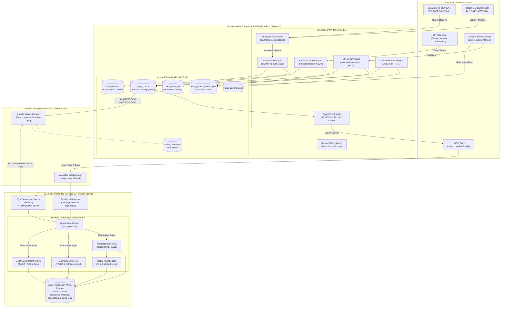

# MASTERPLAN PHASE 5 (STUFE 1, 2 & 3): MOBILER BAUSTELLEN-OFFLINE-BETRIEB, DIGITALES AUFMASS (REB 23.003), WEB BLUETOOTH LASER & OFFLINE PLAN-VIEWER

**Dokument-ID:** PLAN-PHASE-5-OFFLINE-BAUSTELLE-2026/2027  
**Version:** 2.2.0-PROD-MASTERPLAN  
**Datum:** 03. September 2026  
**Status:** Produktionsreif / Freigegeben zur Implementierung  
**Projekt:** W-Link ERP (`Rechnungsprogramm_Geb_V2`)  
**Autor:** Leitender Enterprise-Architekt, Mobile-Offline-First-Spezialist & Baubetriebs-Experte  
**Geltungsbereich:** DACH-Raum (Deutschland, Österreich, Schweiz) – Hoch-, Tief- und Ausbau, GU, Handwerk (SHK, Elektro, Maler, Dach) & Gebäudemanagement  

---

## Inhaltsverzeichnis

- [0. Executive Summary & Architektur-Leitbild (Local-First Baustellen-Exzellenz)](#0-executive-summary--architektur-leitbild-local-first-baustellen-exzellenz)
- [1. Systemarchitektur & End-to-End Datenfluss](#1-systemarchitektur--end-to-end-datenfluss)
  - [1.1 Gesamtsystem-Diagramm (Mermaid)](#11-gesamtsystem-diagramm-mermaid)
  - [1.2 Hardware- & Protokoll-Übersicht](#12-hardware---protokoll-übersicht)
- [2. Stufe 1: Quick Wins (Release 1.2.1)](#2-stufe-1-quick-wins-release-121)
  - [2.1 Kolonnen-Schnellstempelung (Polier-Batch-Modus, ArbZG & BRTV)](#21-kolonnen-schnellstempelung-polier-batch-modus-arbzg--brtv)
  - [2.2 Notfall-USB-Sync-Bundle (Kryptografisches `.wlsync` Paket)](#22-notfall-usb-sync-bundle-kryptografisches-wlsync-paket)
  - [2.3 Baustellen-Handschuh- & Sonnenlicht-Modus (High-Contrast WCAG AAA)](#23-baustellen-handschuh---sonnenlicht-modus-high-contrast-wcag-aaa)
- [3. Stufe 2: Mobiles Aufmaß & Web Bluetooth Laser (Release 2.1)](#3-stufe-2-mobiles-aufmaß--web-bluetooth-laser-release-21)
  - [3.1 REB 23.003 Aufmaß-Rechenkern in PWA (Formeln 01, 02, 04, 23, 91 & DA11)](#31-reb-23003-aufmaß-rechenkern-in-pwa-formeln-01-02-04-23-91--da11)
  - [3.2 Web Bluetooth BLE Laser Engine (`pwa/js/bluetooth-laser.js`)](#32-web-bluetooth-ble-laser-engine-pwajsbluetooth-laserjs)
  - [3.3 Touch-UI für mobile Aufmaßblätter & Raumzuordnung](#33-touch-ui-für-mobile-aufmaßblätter--raumzuordnung)
- [4. Stufe 3: Offline Plan-Viewer & Material-/Gerätebuchung (Release 2.2)](#4-stufe-3-offline-plan-viewer--material-gerätebuchung-release-22)
  - [4.1 Offline PDF.js Bauplan-Viewer (`pwa/js/plan-viewer.js`)](#41-offline-pdfjs-bauplan-viewer-pwajsplan-viewerjs)
  - [4.2 Zoom-invariante Mängel-Pins ($X\% / Y\%$) & VOB/B § 13 Fristenampel](#42-zoom-invariante-mängel-pins-x--y--vobb--13-fristenampel)
  - [4.3 Barcode Detection API & Baustellen-Gerätebuchung](#43-barcode-detection-api--baustellen-gerätebuchung)
  - [4.4 Lieferschein-Fotopufferung & Belegmanagement](#44-lieferschein-fotopufferung--belegmanagement)
- [5. Datenbankschema & Migrationen](#5-datenbankschema--migrationen)
  - [5.1 PWA IndexedDB (Dexie.js Version 2)](#51-pwa-indexeddb-dexiejs-version-2)
  - [5.2 SQLite Schema-Migration 006 (Desktop ERP)](#52-sqlite-schema-migration-006-desktop-erp)
- [6. Test- und Verifikationsplan](#6-test-und-verifikationsplan)
  - [6.1 Automatisierte Node.js Testsuite (`tests/phase5_stufe1_2_3.test.js`)](#61-automatisierte-nodejs-testsuite-testsphase5_stufe1_2_3testjs)
  - [6.2 Testfall-Matrix (12 Kernprüfungen)](#62-testfall-matrix-12-kernprüfungen)
- [7. Umsetzungs-Roadmap, Meilensteine & Aufwandsschätzungen](#7-umsetzungs-roadmap-meilensteine--aufwandsschätzungen)
- [8. Fazit & Freigabekriterien (Definition of Done)](#8-fazit--freigabekriterien-definition-of-done)

---

## 0. Executive Summary & Architektur-Leitbild (Local-First Baustellen-Exzellenz)

### 0.1 Das Problem: Die Baustelle als Faradayscher Käfig
Die bauliche Realität im deutschsprachigen Raum (DACH) steht in scharfem Widerspruch zu Cloud-Only-Lösungen:
1. **Physikalische Abschirmung:** Stahlbeton-Rohbauten, Untergeschosse (Tiefgaragen UG 1 bis UG 4), Versorgungsstollen und Tunnel dämpfen hochfrequente Mobilfunkwellen (LTE/5G) unter die Rauschgrenze ($-115\text{ dBm}$ bis vollständiger Funkausfall).
2. **Akku-Erschöpfung:** Endgeräte im Suchlaufmodus senden mit maximaler Leistung ($+23\text{ dBm}$), überhitzen und entladen sich binnen 2 bis 3 Stunden.
3. **Medienbrüche & Beweisverlust:** Müssen Poliere Notizen auf Papier erfassen, gehen VOB-Rügefristen (§ 4 Abs. 3, § 6 Abs. 1 VOB/B) verloren, Aufmaße werden fehlerhaft abgetippt und Lieferscheine verschwinden im Baustellenfahrzeug.

### 0.2 Die Lösung: Drei Ausbaustufen zur Baustellen-Marktführerschaft

```
+---------------------------------------------------------------------------------------------------+
| W-LINK ERP: DREISTUFIGER BAUSTELLEN-OFFLINE MASTERPLAN 2026/2027                                  |
+---------------------------------------------------------------------------------------------------+
| STUFE 1: QUICK WINS (Release 1.2.1 | 4 Arbeitstage)                                               |
|   • Kolonnen-Schnellstempelung (Polier-Batch-Modus, ArbZG-Wächter, BRTV-Wegezeiten)              |
|   • Notfall-USB-Sync-Bundle (.wlsync mit AES-GCM-256 & SHA-256 Prüfsumme)                         |
|   • Baustellen-Handschuh- & Sonnenlicht-Modus (High-Contrast WCAG AAA, 52px Touch-Targets)        |
+---------------------------------------------------------------------------------------------------+
| STUFE 2: MOBILES AUFMASS & LASER-BLE (Release 2.1 | 10 Arbeitstage)                               |
|   • REB 23.003 Aufmaß-Rechenkern in PWA (Formeln 01, 02, 04, 23, 91 & DA11 Satzart 11 Export)    |
|   • Web Bluetooth API BLE Engine für Leica DISTO (D2/X3/X4) & Bosch GLM (50C/120C)                |
|   • Touch-Aufmaßblätter mit Raumbuch und VOB/C Übermessungsregeln (<= 2,5 m²)                     |
+---------------------------------------------------------------------------------------------------+
| STUFE 3: OFFLINE PLAN-VIEWER & MATERIAL (Release 2.2 | 14 Arbeitstage)                             |
|   • Offline PDF.js Bauplan-Viewer mit stufenlosem Pinch-to-Zoom & Pan (Canvas + CSS Matrix)       |
|   • Zoom-invariante Mängel-Pins mit normalisierten Koordinaten (X% / Y%) & VOB § 13 Fristenampel  |
|   • Barcode Detection API (QR, EAN-13, Code 128) für Baustellenlager & Großgeräte (BGL)           |
|   • Lieferschein-Fotopufferung mit automatischer Kontrastoptimierung                              |
+---------------------------------------------------------------------------------------------------+
```

### 0.3 Technische Kernprinzipien
- **Zero Heavy External Dependencies:** Keine schweren Cloud-SDKs. Ausschließlich native Browser-APIs (ServiceWorker, Web Bluetooth, Web Crypto, BarcodeDetector, Canvas 2D) und schlanke, isolierte Standard-Bibliotheken (`Dexie.js`, `pdf.js`).
- **Local-First & Data Sovereignty:** Jede Benutzeraktion schreibt primär in die lokale IndexedDB (`Dexie.js`) mit Latenzen $< 2\text{ ms}$ ("Optimistic UI"). Keine Wartekringel oder Ladeblockaden.
- **Idempotenz & GoBD-Revisionssicherheit:** Alle Datenänderungen erzeugen unveränderliche Mutation-Events mit RFC 4122 v4 UUIDs, Lamport-Timestamps und SHA-256 Hashverkettung.

---

## 1. Systemarchitektur & End-to-End Datenfluss

### 1.1 Gesamtsystem-Diagramm (Mermaid)



### 1.2 Hardware- & Protokoll-Übersicht

| Komponente | Hardware / Schnittstelle | Protokoll / Format | Datenrate / Latenz | Offline-Fähigkeit |
| :--- | :--- | :--- | :--- | :--- |
| **Laser DISTO** | Leica DISTO D2, X3, X4 | BLE GATT Service `3ab10100-...`<br/>Float32 Little Endian (Meter) | $< 150\text{ ms}$ pro Messung | 100% autark vor Ort |
| **Laser GLM** | Bosch GLM 50 C, 100 C, 120 C | BLE GATT Service `00005301-...`<br/>MT-Protocol (0.05 mm Factor) | $< 200\text{ ms}$ pro Messung | 100% autark vor Ort |
| **Barcode Scanner**| Tablet-/Smartphone-Kamera | `window.BarcodeDetector`<br/>(QR, EAN-13, Code 128, DataMatrix) | 30 FPS Hardware-Decoding | 100% autark vor Ort |
| **Bauplan-Viewer** | HTML5 Canvas 2D + Touch | PDF.js v3.11+ Local WebWorker<br/>CSS Matrix Pan/Zoom | 60 FPS flüssig | Gecached in IndexedDB |
| **USB-Notfall-Sync**| USB-C OTG Stick / SD-Karte | `.wlsync` Datei (AES-GCM-256,<br/>PBKDF2 Key Derivation, SHA-256) | I/O-Geschwindigkeit USB | 100% ohne Funk/Netz |
| **P2P WLAN Hub** | Lokaler Hotspot / Baustellen-AP | HTTP REST & RFC 6455 WebSocket<br/>Port 38400 (Zero-Config) | $> 50\text{ MBit/s}$ lokal | Funktioniert ohne DSL/LTE |

---

## 2. Stufe 1: Quick Wins (Release 1.2.1)

### 2.1 Kolonnen-Schnellstempelung (Polier-Batch-Modus, ArbZG & BRTV)

#### Fachlicher Hintergrund & Problem
Auf Baustellen arbeiten gewerbliche Mitarbeiter (Maurer, Betonbauer, Trockenbauer, Reinigungskräfte) in festen Teams (Kolonnen) von 3 bis 15 Personen unter Führung eines Poliers oder Vorarbeiters.
Das bisherige Verfahren (jeden Mitarbeiter einzeln in einem Dropdown auszuwählen und separat zu stempeln) dauert bei 10 Mitarbeitern über 3 Minuten. Bei schmutzigen Händen oder Zeitdruck führt dies zum Abbruch der Dokumentation.

#### UI-Spezifikation (`pwa/index.html`)
Ein segmentierter Schalter im Tab *Stempeluhr*:
- `[ Einzel-Modus ]` | `[ ★ Kolonnen-Modus ]`
Im Kolonnen-Modus:
1. **Kolonnen-Schnellauswahl:** Dropdown mit gespeicherten Kolonnen (z. B. "Kolonne Hochbau 1 (6 Mann)", "Kolonne Putz (4 Mann)").
2. **Monteurauswahl mit Checkboxen:** Liste aller Mitarbeiter mit Avatar, Vor- und Nachname, Gewerk/Qualifikation und Status ("Ausgestempelt", "Seit 07:00 eingestempelt").
3. **Master-Checkbox:** `[✓] Alle auswählen` zur blitzschnellen Gesamtauswahl.
4. **Tätigkeits- & Projekt-Wahlschalter:** Standardmäßig "PRODUKTIV" auf dem aktuellen Baustellenprojekt.
5. **Aktions-Buttons (52px Touch-Höhe):**
   - `[ ▶ KOLONNE KOMMEN (N Mann) ]` (Signalgrün `#00C853`)
   - `[ ⏹ KOLONNE GEHEN (N Mann) ]` (Signalrot `#D50000`)
   - `[ ☕ KOLONNE PAUSE (30 Min) ]` (Bernstein `#FFAB00`)

#### ArbZG- & BRTV-Wächterlogik
Vor dem Schreiben in die IndexedDB validiert das System jeden ausgewählten Mitarbeiter gegen die Schutzgesetze:
- **§ 3 ArbZG:** Warnt, wenn durch die Buchung die Tagesarbeitszeit 10 Stunden überschreitet.
- **§ 4 ArbZG:** Automatischer Pausenabzug (mind. 30 Min ab 6 Stunden, mind. 45 Min ab 9 Stunden Arbeitszeit).
- **§ 5 ArbZG:** Prüfung der 11-stündigen ununterbrochenen Ruhezeit seit der letzten Feierabend-Stempelung.
- **BRTV-Bau § 7 Wegezeit:** Differenzierung zwischen **Fahrer** (voll vergütungspflichtige Arbeitszeit gem. ArbZG) und **Mitfahrer** (tarifliche Wegezeitentschädigung nach Entfernungsstaffel: 0–50 km = 7,00 €, 51–75 km = 8,00 €, >75 km = 9,00 €).

#### Code-Architektur (`pwa/js/pwa-app.js`)

```javascript
/**
 * Führt eine Batch-Stempelung für eine gesamte Kolonne aus.
 * @param {'KOMMEN'|'GEHEN'|'PAUSE'} punchType 
 */
async function handleKolonnenPunch(punchType) {
    const selectedCheckboxes = document.querySelectorAll('.kolonne-worker-checkbox:checked');
    if (selectedCheckboxes.length === 0) {
        alert('Bitte mindestens einen Monteur der Kolonne auswählen.');
        return;
    }

    const projektId = parseInt(document.getElementById('punch-projekt-select').value, 10) || null;
    const taetigkeitTyp = document.getElementById('punch-taetigkeit-select').value || 'PRODUKTIV';
    const nowIso = new Date().toISOString();
    const timestampMs = Date.now();
    
    // GPS-Snapshot (Punktuell gem. DSGVO Art. 88 / § 26 BDSG)
    const geoSnapshot = await getGeoSnapshotSafe();

    let successCount = 0;
    const warnings = [];

    for (const cb of selectedCheckboxes) {
        const mitarbeiterId = parseInt(cb.value, 10);
        const mitarbeiterName = cb.dataset.name || `Mitarbeiter #${mitarbeiterId}`;

        // 1. ArbZG-Vorprüfung gegen lokale Buchungen des heutigen Tages
        const arbzgCheck = await validateArbzgForWorker(mitarbeiterId, punchType, timestampMs);
        if (arbzgCheck.hasViolation) {
            warnings.push(`${mitarbeiterName}: ${arbzgCheck.violationText}`);
        }

        // 2. Entitäts-UUID erzeugen
        const entryUuid = (typeof crypto !== 'undefined' && crypto.randomUUID) 
            ? crypto.randomUUID() 
            : `zeit-${mitarbeiterId}-${timestampMs}-${Math.random().toString(36).substring(2, 7)}`;

        const zeiteintrag = {
            uuid: entryUuid,
            mitarbeiter_id: mitarbeiterId,
            projekt_id: projektId,
            taetigkeit_typ: taetigkeitTyp,
            buchungs_typ: punchType,
            zeit_stempel: nowIso,
            zeit_von: punchType === 'KOMMEN' ? nowIso : null,
            zeit_bis: punchType === 'GEHEN' ? nowIso : null,
            pause_minuten: punchType === 'PAUSE' ? 30 : 0,
            geo_lat: geoSnapshot ? geoSnapshot.latitude : null,
            geo_lng: geoSnapshot ? geoSnapshot.longitude : null,
            geo_genauigkeit_m: geoSnapshot ? geoSnapshot.accuracy : null,
            is_kolonne: 1,
            polier_id: currentAppUser ? currentAppUser.id : null,
            is_synced: 0,
            created_at: nowIso
        };

        // 3. Atomar in IndexedDB ablegen
        await window.mobileDb.local_zeiterfassung.put(zeiteintrag);

        // 4. In Sync-Outbox für Event-Sourcing einreihen
        await window.syncWorker.queueMutation(
            'ZEITERFASSUNG',
            entryUuid,
            'UPSERT',
            zeiteintrag
        );

        successCount++;
    }

    // Haptisches Feedback für Handschuhbedienung
    if (typeof navigator !== 'undefined' && navigator.vibrate) {
        navigator.vibrate([60, 40, 60]);
    }

    // UI aktualisieren
    showToast(`✓ ${successCount} Monteure erfolgreich als "${punchType}" gestempelt.`);
    if (warnings.length > 0) {
        showArbzgWarningDialog(warnings);
    }
    await loadTodayPunchesList();
}
```

---

### 2.2 Notfall-USB-Sync-Bundle (Kryptografisches `.wlsync` Paket)

#### Problemstellung & Sicherheitsanforderung
Auf Baustellen der kritischen Infrastruktur (Militärstützpunkte der Bundeswehr, Rechenzentren, Nuklearanlagen, Banken) oder im totalen Funkschatten ohne mitgeführtes Baustellen-WLAN ist jede Funkkommunikation verboten oder unmöglich.
Das mobile Endgerät muss in der Lage sein, alle ausstehenden Outbox-Mutationen und komprimierten Mängelfotos auf einen physischen USB-C-Stick zu exportieren. 

#### Spezifikation des Dateiformats `.wlsync` (Version 1.0)
Eine `.wlsync`-Datei ist ein geschütztes JSON-Envelope mit folgender Struktur:

```json
{
  "magic": "WLSYNC01",
  "version": "1.0",
  "device_id": "TAB-POLIER-04",
  "exported_at": "2026-09-03T17:45:12.000Z",
  "kdf": {
    "algorithm": "PBKDF2",
    "hash": "SHA-256",
    "iterations": 100000,
    "salt_hex": "4f8a3c... (32 hex characters)"
  },
  "cipher": {
    "algorithm": "AES-GCM",
    "iv_hex": "e7b1c4... (24 hex characters = 12 bytes)",
    "tag_length_bits": 128
  },
  "payload_cipher_hex": "a93f12bc8...",
  "sha256_checksum": "7c98e... (SHA-256 über payload_cipher_hex)"
}
```

#### Der entschlüsselte Payload enthält:
1. `meta`: Exportierendes Gerät, Polier-Name, Export-Zeitpunkt, Schema-Version.
2. `mutations`: Alle `PENDING` Einträge der `sync_outbox`.
3. `photos`: Array von Base64-codierten WebP-Bildern mit UUID, Entity-Ref und EXIF-Hashes.
4. `audit_hash`: Lückenlose SHA-256 Hashkette aller enthaltenen Belege.

#### Kryptografisches Modul (`pwa/js/crypto-sync-bundle.js`)

```javascript
/**
 * pwa/js/crypto-sync-bundle.js - Verschlüsselter Notfall-USB-Sync via Web Crypto API
 * Verwendet PBKDF2 (100.000 Iterationen) und AES-GCM-256 für militärische Abhörsicherheit.
 */

class CryptoSyncBundle {
    /**
     * Exportiert alle anstehenden Outbox-Daten und Fotos in ein .wlsync Bundle.
     * @param {Object} db - Dexie DB Instanz
     * @param {string} passphrase - Baustellen-Passphrase oder PIN
     */
    static async exportToBundle(db, passphrase) {
        if (!passphrase || passphrase.length < 4) {
            throw new Error('Das Baustellen-Passwort muss mindestens 4 Zeichen lang sein.');
        }

        // 1. Alle ungesendeten Mutationen sammeln
        const pendingMutations = await db.sync_outbox
            .where('status')
            .equals('PENDING')
            .toArray();

        // 2. Unsynchronisierte Fotos sammeln
        const unsyncedPhotos = await db.local_fotos
            .where('is_synced')
            .equals(0)
            .toArray();

        const deviceSettings = await db.app_settings.get('server_config');
        const deviceId = (deviceSettings && deviceSettings.device_id) ? deviceSettings.device_id : 'MOBILE-OFFLINE';

        const payloadObj = {
            export_meta: {
                deviceId,
                exported_at: new Date().toISOString(),
                mutation_count: pendingMutations.length,
                photo_count: unsyncedPhotos.length
            },
            mutations: pendingMutations,
            photos: unsyncedPhotos
        };

        const payloadJson = JSON.stringify(payloadObj);
        const enc = new TextEncoder();
        const payloadBytes = enc.encode(payloadJson);

        // 3. Salt & IV generieren
        const salt = crypto.getRandomValues(new Uint8Array(16));
        const iv = crypto.getRandomValues(new Uint8Array(12)); // 96-Bit IV für AES-GCM

        // 4. PBKDF2 Key Derivation
        const keyMaterial = await crypto.subtle.importKey(
            'raw',
            enc.encode(passphrase),
            { name: 'PBKDF2' },
            false,
            ['deriveKey']
        );

        const aesKey = await crypto.subtle.deriveKey(
            {
                name: 'PBKDF2',
                salt,
                iterations: 100000,
                hash: 'SHA-256'
            },
            keyMaterial,
            { name: 'AES-GCM', length: 256 },
            false,
            ['encrypt', 'decrypt']
        );

        // 5. AES-GCM Verschlüsselung
        const ciphertextBuffer = await crypto.subtle.encrypt(
            { name: 'AES-GCM', iv },
            aesKey,
            payloadBytes
        );

        const ciphertextHex = Array.from(new Uint8Array(ciphertextBuffer))
            .map(b => b.toString(16).padStart(2, '0'))
            .join('');

        // 6. SHA-256 Prüfsumme über Ciphertext berechnen
        const hashBuffer = await crypto.subtle.digest('SHA-256', new Uint8Array(ciphertextBuffer));
        const hashHex = Array.from(new Uint8Array(hashBuffer))
            .map(b => b.toString(16).padStart(2, '0'))
            .join('');

        const bundle = {
            magic: 'WLSYNC01',
            version: '1.0',
            device_id: deviceId,
            exported_at: new Date().toISOString(),
            kdf: {
                algorithm: 'PBKDF2',
                hash: 'SHA-256',
                iterations: 100000,
                salt_hex: Array.from(salt).map(b => b.toString(16).padStart(2, '0')).join('')
            },
            cipher: {
                algorithm: 'AES-GCM',
                iv_hex: Array.from(iv).map(b => b.toString(16).padStart(2, '0')).join(''),
                tag_length_bits: 128
            },
            payload_cipher_hex: ciphertextHex,
            sha256_checksum: hashHex
        };

        return JSON.stringify(bundle, null, 2);
    }

    /**
     * Entschlüsselt ein .wlsync Bundle (Node.js & Browser kompatibel).
     */
    static async importFromBundle(bundleJson, passphrase) {
        const bundle = typeof bundleJson === 'string' ? JSON.parse(bundleJson) : bundleJson;
        if (bundle.magic !== 'WLSYNC01') {
            throw new Error('Ungültiges Dateiformat: Kein valides W-Link Sync-Bundle.');
        }

        // 1. Prüfsumme verifizieren
        const cipherBytes = new Uint8Array(
            bundle.payload_cipher_hex.match(/.{1,2}/g).map(byte => parseInt(byte, 16))
        );

        const hashBuffer = await crypto.subtle.digest('SHA-256', cipherBytes);
        const computedHash = Array.from(new Uint8Array(hashBuffer))
            .map(b => b.toString(16).padStart(2, '0'))
            .join('');

        if (computedHash !== bundle.sha256_checksum) {
            throw new Error('Manipulationsverdacht: SHA-256 Prüfsumme stimmt nicht überein!');
        }

        // 2. Schlüssel ableiten
        const salt = new Uint8Array(bundle.kdf.salt_hex.match(/.{1,2}/g).map(byte => parseInt(byte, 16)));
        const iv = new Uint8Array(bundle.cipher.iv_hex.match(/.{1,2}/g).map(byte => parseInt(byte, 16)));
        const enc = new TextEncoder();

        const keyMaterial = await crypto.subtle.importKey(
            'raw',
            enc.encode(passphrase),
            { name: 'PBKDF2' },
            false,
            ['deriveKey']
        );

        const aesKey = await crypto.subtle.deriveKey(
            {
                name: 'PBKDF2',
                salt,
                iterations: bundle.kdf.iterations,
                hash: bundle.kdf.hash
            },
            keyMaterial,
            { name: 'AES-GCM', length: 256 },
            false,
            ['encrypt', 'decrypt']
        );

        // 3. Entschlüsseln
        const decryptedBuffer = await crypto.subtle.decrypt(
            { name: 'AES-GCM', iv },
            aesKey,
            cipherBytes
        );

        const dec = new TextDecoder();
        return JSON.parse(dec.decode(decryptedBuffer));
    }
}

if (typeof module !== 'undefined' && module.exports) {
    module.exports = CryptoSyncBundle;
}
```

#### Desktop-Integration (`main/sync-bundle-importer.js`)
Im Electron-Desktop wird das Bundle über eine Drag & Drop-Fläche im *Sync-Center* empfangen. Der Importer validiert das Bundle mit Node.js `crypto`, prüft die Mutationen über dieselbe Transaktionslogik wie beim P2P-WLAN-Sync (`applyEntityMutation` mit Idempotenz gegen `sync_processed_mutations`) und erzeugt eine Empfangsbestätigungs-Quittung `.wlsync_ack`, die der Polier auf seinen USB-Stick zurückkopieren kann, um die Outbox mobil auf `ACKED` zu leeren.

---

### 2.3 Baustellen-Handschuh- & Sonnenlicht-Modus (High-Contrast WCAG AAA)

#### Ergonomische Anforderungen vor Ort
1. **Grelle Sonneneinstrahlung (bis zu 100.000 Lux im Hochsommer):** Standard-Graustufen und feine Schriften verblassen vollständig. Es bedarf maximaler Kontraste ($> 7:1$, WCAG AAA Konformität).
2. **Arbeitshandschuhe (Mechaniker-/Latex-/Kälteschutzhandschuhe):** Die kapazitive Touch-Fläche eines Fingers vergrößert sich von typisch $8\times 8\text{ mm}$ auf $14\times 14\text{ mm}$. Die Mindest-Touch-Target-Größe muss daher von den standardmäßigen $44\times 44\text{ px}$ auf **mindestens $52\times 52\text{ px}$** vergrößert werden.
3. **Schmutz- und Regentropfen:** Große Abstände (Margin $\ge 12\text{ px}$) verhindern fatale Fehltippungen bei Spritzwasser.

#### CSS-Implementierung (`pwa/css/pwa.css`)

```css
/* ==========================================================================
   BAUSTELLEN-HIGH-CONTRAST & HANDSCHUH-MODUS (WCAG 2.2 AAA)
   ========================================================================== */

/* Standard Theme-Variablen */
:root {
    --bg-primary: #121824;
    --bg-card: #1e293b;
    --text-main: #f8fafc;
    --text-muted: #94a3b8;
    --accent: #3b82f6;
    --btn-touch-min-height: 48px;
    --touch-target-size: 48px;
}

/* 1. BAUSTELLEN-SONNENLICHT-MODUS (High Contrast Light Mode) */
body.baustelle-sunlight-mode {
    --bg-primary: #ffffff !important;
    --bg-card: #ffffff !important;
    --text-main: #000000 !important;
    --text-muted: #1a1a1a !important;
    --accent: #0044cc !important;
    --border-contrast: 3px solid #000000 !important;
    background-color: #ffffff !important;
    color: #000000 !important;
}

body.baustelle-sunlight-mode .card {
    border: 3px solid #000000 !important;
    box-shadow: 0 4px 0 #000000 !important;
    background-color: #ffffff !important;
}

body.baustelle-sunlight-mode .btn,
body.baustelle-sunlight-mode .btn-punch {
    font-weight: 900 !important;
    border: 3px solid #000000 !important;
    box-shadow: 0 4px 0 #000000 !important;
}

body.baustelle-sunlight-mode .btn-kommen {
    background-color: #00e676 !important;
    color: #000000 !important;
}

body.baustelle-sunlight-mode .btn-gehen {
    background-color: #ff1744 !important;
    color: #ffffff !important;
}

body.baustelle-sunlight-mode .btn-pause {
    background-color: #ffd600 !important;
    color: #000000 !important;
}

/* 2. HANDSCHUH-BEDIENUNGSMODUS (52px Touch-Targets & Große Spacing-Puffer) */
body.baustelle-glove-mode {
    --btn-touch-min-height: 56px !important;
    --touch-target-size: 56px !important;
}

body.baustelle-glove-mode .btn,
body.baustelle-glove-mode .btn-punch,
body.baustelle-glove-mode .form-select,
body.baustelle-glove-mode .form-input {
    min-height: 56px !important;
    font-size: 17px !important;
    padding: 14px 20px !important;
    border-radius: 10px !important;
}

body.baustelle-glove-mode .nav-item {
    min-height: 64px !important;
    padding: 10px 4px !important;
}

body.baustelle-glove-mode .nav-item svg {
    width: 28px !important;
    height: 28px !important;
}

body.baustelle-glove-mode .nav-item span {
    font-size: 12px !important;
    font-weight: bold !important;
}

body.baustelle-glove-mode input[type="checkbox"] {
    width: 28px !important;
    height: 28px !important;
    accent-color: #00e676 !important;
    cursor: pointer;
}
```

---

## 3. Stufe 2: Mobiles Aufmaß & Web Bluetooth Laser (Release 2.1)

### 3.1 REB 23.003 Aufmaß-Rechenkern in PWA (Formeln 01, 02, 04, 23, 91 & DA11)

#### Rechtliche & Mathematische Grundlagen
Bauabrechnungen im öffentlichen und privaten VOB-Bauwesen dürfen nur anerkannt werden, wenn die Mengenermittlung streng prüfbar nach **REB 23.003 (Allgemeine Mengenberechnung)** und im elektronischen Austauschformat **DA11 (Satzart 11)** formuliert ist.

#### REB-Formelsatz Spezifikation

```
+---------------------------------------------------------------------------------------------------+
| REB 23.003 STANDARD-FORMELN FÜR DIE PWA-ENGINE                                                    |
+---------------------------------------------------------------------------------------------------+
| Formel 01: Rechteck             | Ergebnis = a * b                                                |
| Formel 02: Dreieck              | Ergebnis = (a * b) / 2                                          |
| Formel 04: Trapez               | Ergebnis = ((a + c) / 2) * h                                    |
| Formel 23: Quader / Zylinder    | Ergebnis = a * b * c  bzw.  (PI / 4) * d^2 * h                  |
| Formel 91: Freie Formel         | Ergebnis = Mathematischer Ausdruck mit +, -, *, /, (, )         |
+---------------------------------------------------------------------------------------------------+
```

#### VOB/C Übermessungsregeln (DIN 18350 / DIN 18365 / DIN 18330)
Öffnungen (Fenster, Türen, Aussparungen) in Wand- und Bodenflächen werden bei Flächenberechnungen nach VOB/C wie folgt abgerechnet:
- Einzelfläche $\le 2,5\,\text{m}^2$: Wird **übermessen** (nicht von der Bruttofläche abgezogen).
- Einzelfläche $> 2,5\,\text{m}^2$: Muss zwingend von der Bruttofläche abgezogen werden.
Die mobile Engine berechnet auf Wunsch automatisch den VOB-Abzug:
$$\text{Netto-Aufmaß} = \text{Bruttofläche} - \sum_{i} \text{Abzugsfläche}_i \quad \forall \; \text{Abzugsfläche}_i > 2,5\,\text{m}^2$$

#### Code-Implementierung: Isomorphe REB-Engine (`pwa/js/reb-aufmass.js`)

```javascript
/**
 * pwa/js/reb-aufmass.js - Vollständiger REB 23.003 Rechenkern für die Mobile PWA
 * Berechnet Formeln 01, 02, 04, 23, 91 und generiert DA11-Satzart 11 Strings.
 */

class RebAufmassEngine {
    /**
     * Berechnet eine REB-Formel anhand von Formelcode und Parametern.
     * @param {'01'|'02'|'04'|'23'|'91'} formelCode 
     * @param {Object} params - { a, b, c, h, freiString }
     * @returns {number} Auf 4 Dezimalstellen gerundetes Ergebnis
     */
    static calculate(formelCode, params = {}) {
        const a = parseFloat(params.a) || 0;
        const b = parseFloat(params.b) || 0;
        const c = parseFloat(params.c) || 0;
        const h = parseFloat(params.h || params.b) || 0;

        let result = 0;

        switch (formelCode) {
            case '01': // Rechteck: a * b
                result = a * b;
                break;
            case '02': // Dreieck: (a * b) / 2
                result = (a * b) / 2;
                break;
            case '04': // Trapez: ((a + c) / 2) * h
                result = ((a + c) / 2) * h;
                break;
            case '23': // Quader: a * b * c
                result = a * b * (c > 0 ? c : 1);
                break;
            case '91': // Freie Formel
                result = this.evaluateSafeExpression(params.freiString || '');
                break;
            default:
                result = a;
        }

        return Math.round(result * 10000) / 10000;
    }

    /**
     * Sicherer mathematischer Ausdrucks-Evaluator ohne unsicheres eval().
     */
    static evaluateSafeExpression(expr) {
        if (!expr || typeof expr !== 'string') return 0;
        let sanitized = expr.trim().replace(/,/g, '.').replace(/\^/g, '**');
        
        // Strikte Whitelist-Validierung
        if (!/^[0-9+\-*/().\s%*]+$/.test(sanitized)) return 0;
        if (/\(\s*\)/.test(sanitized) || /\.\./.test(sanitized)) return 0;

        try {
            const fn = new Function(`"use strict"; return (${sanitized});`);
            const res = fn();
            return (typeof res === 'number' && Number.isFinite(res)) 
                ? Math.round(res * 10000) / 10000 
                : 0;
        } catch (_e) {
            return 0;
        }
    }

    /**
     * Formatiert eine Aufmaßzeile in den genormten DA11 Satzart 11 Standard (Ausgabe 1979/2009).
     * @param {Object} row - { oz, index, bezeichnung, formelCode, params, ergebnis }
     * @returns {string} Feste 80-Zeichen DA11-Zeile
     */
    static formatDa11Line(row) {
        // Spalte 1-2: Satzart "11"
        let line = '11';

        // Spalte 3-11: Ordnungszahl (OZ) linksbündig oder genormt 9-stellig
        const ozClean = (row.oz || '').replace(/[^0-9A-Za-z]/g, '').padEnd(9, ' ').substring(0, 9);
        line += ozClean;

        // Spalte 12: Index / Kennzeichen (Standard leer oder ' ')
        line += (row.index || ' ').substring(0, 1);

        // Spalte 13-22: Text / Raumbeschreibung (10 Zeichen)
        const textClean = (row.bezeichnung || '').padEnd(10, ' ').substring(0, 10);
        line += textClean;

        // Spalte 23-24: Formelnummer (z.B. "01", "04", "91")
        const fnClean = (row.formelCode || '91').padStart(2, '0').substring(0, 2);
        line += fnClean;

        // Spalte 25-70: Rechenansatz (z.B. "5.20*3.10=" oder Formelparameter)
        let ansatz = '';
        if (row.formelCode === '01') ansatz = `${row.params.a}*${row.params.b}=`;
        else if (row.formelCode === '02') ansatz = `(${row.params.a}*${row.params.b})/2=`;
        else if (row.formelCode === '04') ansatz = `((${row.params.a}+${row.params.c})/2)*${row.params.h}=`;
        else ansatz = (row.params.freiString || `${row.params.a}=`);

        ansatz = ansatz.padEnd(46, ' ').substring(0, 46);
        line += ansatz;

        // Spalte 71-80: Ergebnis
        const resStr = (row.ergebnis !== undefined ? row.ergebnis.toFixed(3) : '0.000')
            .padStart(10, ' ')
            .substring(0, 10);
        line += resStr;

        return line;
    }
}

if (typeof module !== 'undefined' && module.exports) {
    module.exports = RebAufmassEngine;
}
```

---

### 3.2 Web Bluetooth BLE Laser Engine (`pwa/js/bluetooth-laser.js`)

#### Spezifikation der Web Bluetooth API & GATT Services
Die Integration bindet Laserdistanzmesser direkt über die standardisierte Web Bluetooth API (`navigator.bluetooth`) ein.

```
+----------------------------------------------------------------------------------------------------+
| HERSTELLER-GATT-SPEZIFIKATIONEN FÜR LASERDISTANZMESSER                                             |
+----------------------------------------------------------------------------------------------------+
| LEICA DISTO (D2, X3, X4, D510)                                                                     |
|   Primary Service UUID:        3ab10100-f831-4395-b29d-570977d5bf94                               |
|   Distance Char UUID:          3ab10101-f831-4395-b29d-570977d5bf94 (Notify / Read)                |
|   Distance Unit Char UUID:     3ab10102-f831-4395-b29d-570977d5bf94                               |
|   Command Char UUID:           3ab10109-f831-4395-b29d-570977d5bf94 (Write)                       |
|   Datenformat Distanz:         IEEE 754 32-Bit Float, Little Endian, Einheit: Meter                |
+----------------------------------------------------------------------------------------------------+
| BOSCH PROFESSIONAL GLM (GLM 50 C, GLM 100 C)                                                       |
|   Primary Service UUID:        00005301-0000-0041-5253-534f4654-0000                               |
|   Measurement Char UUID:       00004301-0000-0041-5253-534f4654-0000 (Indicate / Notify)           |
|   Initialisierungs-Befehl:     [0xC0, 0x55, 0x02, 0x01, 0x00, 0x1A] (AutoSync aktivieren)          |
|   Datenformat Distanz:         4 Bytes Little Endian RawInt * 0.05 mm / 1000 = Meter               |
+----------------------------------------------------------------------------------------------------+
| BOSCH PROFESSIONAL GLM 120 C                                                                       |
|   Primary Service UUID:        02a6c0d0-0451-4000-b000-fb3210111989                               |
|   Measurement Char UUID:       02a6c0d1-0451-4000-b000-fb3210111989 (Indicate / Notify)           |
+----------------------------------------------------------------------------------------------------+
```

#### Code-Implementierung (`pwa/js/bluetooth-laser.js`)

```javascript
/**
 * pwa/js/bluetooth-laser.js - Universeller Web Bluetooth BLE Treiber für Leica DISTO & Bosch GLM
 * Ermöglicht kabellose Messwert-Injektion ohne Tippen direkt auf der Baustelle.
 */

class BluetoothLaserEngine {
    constructor() {
        this.device = null;
        this.server = null;
        this.deviceType = null; // 'LEICA' | 'BOSCH'
        this.isConnected = false;
        this.onMeasurementCallback = null;
        this.onStatusChangeCallback = null;

        // GATT UUIDs
        this.UUIDS = {
            LEICA_SERVICE: '3ab10100-f831-4395-b29d-570977d5bf94',
            LEICA_DISTANCE_CHAR: '3ab10101-f831-4395-b29d-570977d5bf94',
            
            BOSCH_SERVICE_50C: '00005301-0000-0041-5253-534f4654-0000',
            BOSCH_CHAR_50C: '00004301-0000-0041-5253-534f4654-0000',
            
            BOSCH_SERVICE_120C: '02a6c0d0-0451-4000-b000-fb3210111989',
            BOSCH_CHAR_120C: '02a6c0d1-0451-4000-b000-fb3210111989'
        };
    }

    /**
     * Prüft, ob Web Bluetooth in der aktuellen Umgebung verfügbar ist.
     */
    static isSupported() {
        return typeof navigator !== 'undefined' && Boolean(navigator.bluetooth);
    }

    /**
     * Startet den Geräte-Kopplungsdialog (Muss durch User-Geste wie Klick ausgelöst werden).
     */
    async connectLaser() {
        if (!BluetoothLaserEngine.isSupported()) {
            throw new Error('Web Bluetooth wird von diesem Browser nicht unterstützt. Bitte Chrome auf Android verwenden.');
        }

        this._updateStatus('SCANNING', 'Suche nach Leica DISTO und Bosch GLM Lasern...');

        try {
            this.device = await navigator.bluetooth.requestDevice({
                filters: [
                    { namePrefix: 'DISTO' },
                    { namePrefix: 'Bosch' },
                    { namePrefix: 'GLM' },
                    { services: [this.UUIDS.LEICA_SERVICE] },
                    { services: [this.UUIDS.BOSCH_SERVICE_50C] },
                    { services: [this.UUIDS.BOSCH_SERVICE_120C] }
                ],
                optionalServices: [
                    this.UUIDS.LEICA_SERVICE,
                    this.UUIDS.BOSCH_SERVICE_50C,
                    this.UUIDS.BOSCH_SERVICE_120C
                ]
            });

            this.device.addEventListener('gattserverdisconnected', () => this._handleDisconnect());

            this._updateStatus('CONNECTING', `Verbinde mit ${this.device.name}...`);
            this.server = await this.device.gatt.connect();

            // Service erkennen & abonnieren
            await this._discoverAndSubscribe();

            this.isConnected = true;
            this._updateStatus('CONNECTED', `Verbunden mit ${this.device.name}`);
            return { success: true, deviceName: this.device.name, type: this.deviceType };

        } catch (err) {
            this._updateStatus('ERROR', err.message);
            throw err;
        }
    }

    async _discoverAndSubscribe() {
        // 1. Prüfe auf Leica DISTO Service
        try {
            const leicaService = await this.server.getPrimaryService(this.UUIDS.LEICA_SERVICE);
            if (leicaService) {
                this.deviceType = 'LEICA';
                const distChar = await leicaService.getCharacteristic(this.UUIDS.LEICA_DISTANCE_CHAR);
                await distChar.startNotifications();
                distChar.addEventListener('characteristicvaluechanged', (event) => this._handleLeicaData(event));
                console.log('[BluetoothLaser] Leica DISTO Benachrichtigungen erfolgreich aktiv.');
                return;
            }
        } catch (_e) { /* Kein Leica, prüfe Bosch */ }

        // 2. Prüfe auf Bosch GLM 50 C Service
        try {
            const boschService = await this.server.getPrimaryService(this.UUIDS.BOSCH_SERVICE_50C);
            if (boschService) {
                this.deviceType = 'BOSCH';
                const boschChar = await boschService.getCharacteristic(this.UUIDS.BOSCH_CHAR_50C);
                await boschChar.startNotifications();
                boschChar.addEventListener('characteristicvaluechanged', (event) => this._handleBoschData(event));
                
                // Sende AutoSync Startbefehl an Bosch Laser
                const startCmd = new Uint8Array([0xc0, 0x55, 0x02, 0x01, 0x00, 0x1a]);
                try {
                    await boschChar.writeValue(startCmd);
                } catch (writeErr) {
                    console.warn('[BluetoothLaser] Bosch Init-Befehl nicht akzeptiert:', writeErr.message);
                }
                console.log('[BluetoothLaser] Bosch GLM 50 C Benachrichtigungen erfolgreich aktiv.');
                return;
            }
        } catch (_e) { /* Kein GLM 50 C */ }

        // 3. Prüfe auf Bosch GLM 120 C Service
        try {
            const bosch120Service = await this.server.getPrimaryService(this.UUIDS.BOSCH_SERVICE_120C);
            if (bosch120Service) {
                this.deviceType = 'BOSCH';
                const char120 = await bosch120Service.getCharacteristic(this.UUIDS.BOSCH_CHAR_120C);
                await char120.startNotifications();
                char120.addEventListener('characteristicvaluechanged', (event) => this._handleBoschData(event));
                console.log('[BluetoothLaser] Bosch GLM 120 C Benachrichtigungen erfolgreich aktiv.');
                return;
            }
        } catch (finalErr) {
            throw new Error('GATT-Dienst für Laser-Distanzmessung konnte nicht initialisiert werden.');
        }
    }

    /**
     * Parst Leica DISTO Datagramm (Float32 Little Endian in Metern).
     */
    _handleLeicaData(event) {
        const dataView = event.target.value;
        if (dataView.byteLength >= 4) {
            // IEEE 754 Little-Endian Float32
            const distanceMeters = dataView.getFloat32(0, true);
            if (Number.isFinite(distanceMeters) && distanceMeters > 0) {
                const rounded = Math.round(distanceMeters * 1000) / 1000;
                this._dispatchMeasurement(rounded, 'm');
            }
        }
    }

    /**
     * Parst Bosch MT-Protocol Datagramm.
     */
    _handleBoschData(event) {
        const dataView = event.target.value;
        if (dataView.byteLength >= 6) {
            // Prüfung auf Bosch Header Bytes (häufig 0xC0 oder 0x55)
            // Distanz liegt typischerweise an Offset 2 oder 3 als 4-Byte Little Endian Integer
            const rawInt = dataView.getUint32(2, true);
            // Multiplikator 0.05 mm pro Inkrement
            const mm = rawInt * 0.05;
            const distanceMeters = mm / 1000;
            if (Number.isFinite(distanceMeters) && distanceMeters > 0 && distanceMeters < 300) {
                const rounded = Math.round(distanceMeters * 1000) / 1000;
                this._dispatchMeasurement(rounded, 'm');
            }
        }
    }

    _dispatchMeasurement(val, unit) {
        // Haptisches Feedback
        if (typeof navigator !== 'undefined' && navigator.vibrate) {
            navigator.vibrate([40]);
        }

        if (this.onMeasurementCallback) {
            this.onMeasurementCallback({ distance: val, unit: unit, timestamp: Date.now() });
        }

        // Automatischer Fokus-Injektor: Schreibt in das aktuell fokussierte Eingabefeld
        this._injectIntoActiveInput(val);
    }

    _injectIntoActiveInput(val) {
        const active = document.activeElement;
        if (active && (active.tagName === 'INPUT' || active.classList.contains('laser-input'))) {
            active.value = val.toFixed(3);
            active.dispatchEvent(new Event('input', { bubbles: true }));
            active.dispatchEvent(new Event('change', { bubbles: true }));

            // Automatischer Weitersprung zum nächsten Formelfeld (Tab-Navigation simulieren)
            const formInputs = Array.from(document.querySelectorAll('.laser-input:not([disabled])'));
            const currentIndex = formInputs.indexOf(active);
            if (currentIndex >= 0 && currentIndex < formInputs.length - 1) {
                formInputs[currentIndex + 1].focus();
                formInputs[currentIndex + 1].select();
            }
        }
    }

    _handleDisconnect() {
        this.isConnected = false;
        this.server = null;
        this._updateStatus('DISCONNECTED', 'Verbindung zum Laser getrennt.');
    }

    disconnect() {
        if (this.device && this.device.gatt.connected) {
            this.device.gatt.disconnect();
        }
        this._handleDisconnect();
    }

    _updateStatus(status, message) {
        if (this.onStatusChangeCallback) {
            this.onStatusChangeCallback({ status, message, isConnected: this.isConnected });
        }
    }
}

if (typeof window !== 'undefined') {
    window.bluetoothLaserEngine = new BluetoothLaserEngine();
}
if (typeof module !== 'undefined' && module.exports) {
    module.exports = BluetoothLaserEngine;
}
```

---

### 3.3 Touch-UI für mobile Aufmaßblätter & Raumzuordnung

#### Touch-Erfassung im neuen PWA-Tab "Aufmaß"
In `pwa/index.html` wird ein neuer Tab `#tab-aufmass` ergänzt:
1. **Kopfzeile:** Auswahl von Bauprojekt $\to$ Gewerk / LV-Bereich $\to$ Ordnungszahl (OZ, z. B. `01.02.0040 Innenputz Q3`).
2. **Raumbuch-Selektor:** Schnellauswahl der Etage (z. B. "1. OG") und des Raumes (z. B. "Raum 104 Büro").
3. **Formel-Pill-Auswahl:** Schnellauswahl `[01 Rechteck]` | `[02 Dreieck]` | `[04 Trapez]` | `[23 Quader]` | `[91 Frei]`.
4. **Dynamische Eingabefelder mit Laser-Autofokus:**
   - Bei Formel 01: Feld `Länge (a)` und Feld `Breite (b)`.
   - Bei Tastendruck auf dem Laserdistanzmesser fließt der Wert in Feld `a`, der Fokus wechselt sofort zu Feld `b`.
   - Die nächste Lasermessung befüllt Feld `b`, berechnet sofort das Ergebnis (z. B. $5,200 \times 3,100 = 16,120\,\text{m}^2$) und speichert die Zeile per Klick auf `[ Zeile hinzufügen ]`.
5. **Erfasste Zeilenliste (Touch Cards):**
   - Zeigt alle Zeilen des Raums mit Swipe-to-Delete.
   - Live-Gesamtsumme für die OZ mit automatischem VOB-Abzug.
   - Status-Badge: `[Gespeichert (Lokal)]` $\to$ `[In Sync-Warteschlange]` $\to$ `[Synchronisiert]`.

---

## 4. Stufe 3: Offline Plan-Viewer & Material-/Gerätebuchung (Release 2.2)

### 4.1 Offline PDF.js Bauplan-Viewer (`pwa/js/plan-viewer.js`)

#### Offline-Caching & Performance-Architektur
Baupläne im Hoch- und Ausbau (Architektenpläne, TGA-Leitungspläne, Bewehrungspläne) liegen primär als vektorbasierte PDFs mit Dateigrößen zwischen 5 MB und 60 MB vor.
1. **ServiceWorker Cache-Storage:** Die Bibliotheken `pdf.min.js` (ca. 280 KB komprimiert) und `pdf.worker.min.js` werden beim ersten Start der PWA im Cache-Storage abgelegt. Sie sind dauerhaft 100% offline verfügbar.
2. **IndexedDB Blob-Caching:** Bei der Synchronisation im Bauwagen werden die PDF-Dateien der aktuellen Baustelle als binäre `Blob`-Objekte in den Dexie-Store `cache_bauplaene` heruntergeladen.
3. **HTML5 Canvas 2D + Touch-Matrix:** Zur Vermeidung von Rucklern und Memory-Leaks bei starkem Hineinzoomen verwendet W-Link ein zweistufiges Rendering-Modell:
   - **Phase A (Interaktion - 60 FPS):** Beim Pinch-to-Zoom und Verschieben mit den Fingern wird lediglich die CSS-Matrix des Canvas-Containers transformiert (`transform: translate(x, y) scale(s)`).
   - **Phase B (Scharfzeichnung - Debounced 200 ms):** Sobald der Anwender die Finger vom Display nimmt, berechnet `pdf.js` die Seite mit dem neuen exakten Skalierungsfaktor gestochen scharf neu.
   - **Double-Tap:** Schnelles Doppeltippen setzt den Zoom auf 100% (Plan-Gesamtansicht) zurück.

#### Code-Implementierung (`pwa/js/plan-viewer.js`)

```javascript
/**
 * pwa/js/plan-viewer.js - Hochperformanter, gestenbasierter Offline-Bauplan-Viewer mit pdf.js
 */

class OfflinePlanViewer {
    constructor(containerId, canvasId, overlayId) {
        this.container = document.getElementById(containerId);
        this.canvas = document.getElementById(canvasId);
        this.overlay = document.getElementById(overlayId);
        this.ctx = this.canvas.getContext('2d');

        this.currentPdfDoc = null;
        this.currentPage = null;
        this.baseViewport = null;

        // Transformations-Status
        this.scale = 1.0;
        this.translateX = 0;
        this.translateY = 0;
        
        // Touch-Gesten Status
        this.isPanning = false;
        this.startTouches = [];
        this.lastDistance = 0;
        this.renderDebounceTimer = null;

        this.onPinClick = null;
        this.onPlanClick = null;

        this._initGestures();
    }

    /**
     * Lädt ein PDF aus einem ArrayBuffer oder Blob.
     */
    async loadPdfFromBlob(blob) {
        if (typeof pdfjsLib === 'undefined') {
            throw new Error('pdf.js Bibliothek ist nicht geladen.');
        }

        const arrayBuffer = await blob.arrayBuffer();
        const loadingTask = pdfjsLib.getDocument({ data: arrayBuffer });
        this.currentPdfDoc = await loadingTask.promise;
        await this.renderPage(1);
    }

    /**
     * Rendert eine spezifische Seite auf dem Canvas.
     */
    async renderPage(pageNumber = 1) {
        if (!this.currentPdfDoc) return;
        this.currentPage = await this.currentPdfDoc.getPage(pageNumber);
        
        // Unskalierter Basis-Viewport bei 1.0
        this.baseViewport = this.currentPage.getViewport({ scale: 1.0 });

        // Canvas interne Dimensionen auf native PDF-Auflösung setzen
        this.canvas.width = this.baseViewport.width;
        this.canvas.height = this.baseViewport.height;
        this.overlay.style.width = `${this.baseViewport.width}px`;
        this.overlay.style.height = `${this.baseViewport.height}px`;

        const renderContext = {
            canvasContext: this.ctx,
            viewport: this.baseViewport
        };

        await this.currentPage.render(renderContext).promise;
        this.resetView();
    }

    /**
     * Initialisiert Touch-Gesten: Pinch-to-Zoom, Pan & Double-Tap Reset.
     */
    _initGestures() {
        let lastTap = 0;

        this.container.addEventListener('touchstart', (e) => {
            if (e.touches.length === 1) {
                // Double-Tap Erkennung
                const now = Date.now();
                if (now - lastTap < 300) {
                    this.resetView();
                    e.preventDefault();
                    return;
                }
                lastTap = now;

                this.isPanning = true;
                this.startX = e.touches[0].clientX - this.translateX;
                this.startY = e.touches[0].clientY - this.translateY;
            } else if (e.touches.length === 2) {
                this.isPanning = false;
                this.lastDistance = this._getDistance(e.touches);
            }
        }, { passive: false });

        this.container.addEventListener('touchmove', (e) => {
            e.preventDefault();
            if (e.touches.length === 1 && this.isPanning) {
                // Pan (Verschieben)
                this.translateX = e.touches[0].clientX - this.startX;
                this.translateY = e.touches[0].clientY - this.startY;
                this._applyTransform();
            } else if (e.touches.length === 2) {
                // Pinch-to-Zoom
                const currentDist = this._getDistance(e.touches);
                if (this.lastDistance > 0) {
                    const factor = currentDist / this.lastDistance;
                    this.scale = Math.min(Math.max(0.5, this.scale * factor), 10.0);
                    this._applyTransform();
                }
                this.lastDistance = currentDist;
            }
        }, { passive: false });

        this.container.addEventListener('touchend', (e) => {
            this.isPanning = false;
            this.lastDistance = 0;
            
            // Bei Single-Tap: Koordinaten ermitteln und Event auslösen
            if (e.changedTouches.length === 1 && e.touches.length === 0) {
                this._handleTap(e.changedTouches[0]);
            }
        });
    }

    _getDistance(touches) {
        const dx = touches[0].clientX - touches[1].clientX;
        const dy = touches[0].clientY - touches[1].clientY;
        return Math.sqrt(dx * dx + dy * dy);
    }

    _applyTransform() {
        const transformStr = `translate(${this.translateX}px, ${this.translateY}px) scale(${this.scale})`;
        this.canvas.style.transform = transformStr;
        this.overlay.style.transform = transformStr;
        this.canvas.style.transformOrigin = '0 0';
        this.overlay.style.transformOrigin = '0 0';
    }

    resetView() {
        this.scale = 1.0;
        this.translateX = 0;
        this.translateY = 0;
        this._applyTransform();
    }

    /**
     * Ermittelt aus dem Tap-Event die exakten, normalisierten Prozent-Koordinaten (0-100%).
     */
    _handleTap(touch) {
        const rect = this.container.getBoundingClientRect();
        const clickX = touch.clientX - rect.left;
        const clickY = touch.clientY - rect.top;

        // Umrechnung unter Berücksichtigung von Pan und Scale
        const planX = (clickX - this.translateX) / this.scale;
        const planY = (clickY - this.translateY) / this.scale;

        if (this.baseViewport && planX >= 0 && planX <= this.baseViewport.width && planY >= 0 && planY <= this.baseViewport.height) {
            const xPct = (planX / this.baseViewport.width) * 100;
            const yPct = (planY / this.baseViewport.height) * 100;

            if (this.onPlanClick) {
                this.onPlanClick({ xPct: Math.round(xPct * 100) / 100, yPct: Math.round(yPct * 100) / 100 });
            }
        }
    }
}
```

---

### 4.2 Zoom-invariante Mängel-Pins ($X\% / Y\%$) & VOB/B § 13 Fristenampel

#### Das Koordinaten-Normalisierungs-Prinzip
Werden Pins als absolute Pixelwerte gespeichert, verschieben sie sich, sobald der Bauplan auf einem anderen Bildschirm (z. B. 10"-Tablet vs. 27"-Bürobildschirm) oder mit anderer Auflösung geöffnet wird.
**Die Lösung:** Koordinaten werden als relative Prozentwerte bezogen auf die unskalierte Original-Planbreite und -höhe in der Datenbank gespeichert:
$$X\% = \frac{X_{\text{Plan}}}{W_{\text{Plan}}} \times 100\%, \quad Y\% = \frac{Y_{\text{Plan}}}{H_{\text{Plan}}} \times 100\%$$

#### Overlay-Pin-Rendering
Die Pins werden in einem absolut positionierten HTML-Overlay-Container platziert, der synchron mit der Canvas-Transformationsmatrix transformiert wird:

```javascript
/**
 * Rendert Mängel-Pins auf dem Plan-Overlay.
 * @param {Array} maengelList - Array von Mängel-Datensätzen mit x_pct, y_pct, status, frist_datum
 */
function renderPlanPins(maengelList = []) {
    const overlay = document.getElementById('plan-overlay-layer');
    overlay.innerHTML = '';

    for (const m of maengelList) {
        const pin = document.createElement('div');
        pin.className = 'plan-pin';
        pin.dataset.uuid = m.uuid;
        
        // Fristenampel berechnen
        const ampel = MaengelController.calculateFristAmpel(m.frist_datum, m.status);
        pin.classList.add(`pin-${ampel.color.toLowerCase()}`);

        // Lagerichtige Platzierung in Prozent
        pin.style.left = `${m.x_pct}%`;
        pin.style.top = `${m.y_pct}%`;

        pin.innerHTML = `
            <div class="pin-marker">
                <span>${m.mangel_nr || '!'}</span>
            </div>
            <div class="pin-pulse"></div>
        `;

        pin.addEventListener('click', (e) => {
            e.stopPropagation();
            openMangelDetailModal(m.uuid);
        });

        overlay.appendChild(pin);
    }
}
```

#### CSS für Zoom-invariante Pins mit Fristen-Ampel

```css
.plan-overlay {
    position: absolute;
    top: 0;
    left: 0;
    pointer-events: auto;
}

.plan-pin {
    position: absolute;
    transform: translate(-50%, -100%); /* Spitze des Pins zeigt exakt auf die Koordinate */
    cursor: pointer;
    z-index: 20;
}

.pin-marker {
    width: 32px;
    height: 32px;
    border-radius: 50% 50% 50% 0;
    transform: rotate(-45deg);
    display: flex;
    align-items: center;
    justify-content: center;
    border: 2px solid #ffffff;
    box-shadow: 0 3px 6px rgba(0, 0, 0, 0.4);
}

.pin-marker span {
    transform: rotate(45deg);
    font-size: 11px;
    font-weight: bold;
    color: #ffffff;
}

/* VOB/B Fristen-Farben */
.pin-red .pin-marker { background-color: #d50000; }     /* Überfällig / Stufe 2 */
.pin-yellow .pin-marker { background-color: #ffd600; color: #000; } /* Frist <= 7 Tage */
.pin-green .pin-marker { background-color: #00c853; }   /* Fristgerecht */
.pin-gray .pin-marker { background-color: #78909c; }    /* Erledigt */
```

---

### 4.3 Barcode Detection API & Baustellen-Gerätebuchung

#### Native Hardware-Erkennung & Fallback
Zur Erfassung von Mietcontainern, Rüttelplatten, Baggern, Werkzeugkoffern und Materiallieferungen implementiert die PWA das Modul `pwa/js/barcode-scanner.js`:
1. **Primär:** Native `window.BarcodeDetector` API mit Hardware-Beschleunigung (unterstützt `qr_code`, `ean_13`, `code_128`, `data_matrix`).
2. **Sekundär (Fallback):** Schlanker `jsQR` Canvas-Parser für Browser ohne nativen Detector.

#### Großgeräte-Erfassung (BGL / Betriebsstunden)
Beim Scan eines Geräte-Tags (z. B. QR-Code `GER-BGL-042 Turmdrehkran Liebherr 85 EC-B`):
1. Öffnet sofort die mobile Schnellmaske *Geräte-Einsatzbericht*.
2. Abfrage: `Betriebsstunden Heute (h)`, `Stillstandszeiten (h)` und `Grund für Stillstand (z. B. Sturm > 6 Bft nach VOB/B § 6)`.
3. Speichert atomar in `local_geraete_buchungen` und synchronisiert zum Desktop zur BGL-Nachkalkulation.

---

### 4.4 Lieferschein-Fotopufferung & Belegmanagement

#### Das Baustellen-Problem
Materiallieferanten (Beton, Sand, Dämmung, Trockenbauprofile) übergeben dem Polier Durchschreibelieferscheine auf Papier. Diese verbleiben oft wochenlang im Handschuhfach des Bauleiterfahrzeugs – Rechnungen können nicht geprüft werden und Skontofristen verstreichen ungenutzt.

#### Der mobile Lieferschein-Workflow
1. **1-Klick Kamera-Auslöser:** Polier fotografiert den Papier-Lieferschein direkt auf der Motorhaube oder dem Biertisch im Bauwagen.
2. **Automatische Kontrastoptimierung:** Der Canvas filtert Schatten heraus und hebt handschriftliche Mengenangaben und Unterschriften kontrastreich hervor.
3. **Erfassungsfelder (unter 15 Sekunden):**
   - Projekt (vorausgewählt).
   - Lieferant (Schnellauswahl aus Großhändlern/Lieferanten).
   - Lieferschein-Nummer (optional per Barcode/OCR gescannt).
4. **Pufferung & Sync:** Das Bild wird verlustarm als WebP komprimiert ($< 500\text{ KB}$), mit einem SHA-256 Hash signiert und in `local_lieferscheine` abgelegt. Beim nächsten Hotspot-Sync liegt der Lieferschein sofort in der Rechnungsprüfung des Desktop-ERPs vor.

---

## 5. Datenbankschema & Migrationen

### 5.1 PWA IndexedDB (Dexie.js Version 2)

Die Dexie-Datenbank `WLinkMobileDB` wird von Version 1 auf **Version 2** erweitert (`pwa/js/pwa-db.js`):

```javascript
// Upgrade auf Version 2 für Stufe 1, 2 und 3
db.version(2).stores({
    // Bestehende Stores aus Version 1 weiterführen
    local_zeiterfassung: 'uuid, mitarbeiter_id, projekt_id, liegenschaft_id, raum_id, taetigkeit_typ, zeit_von, is_kolonne, is_synced, created_at',
    local_bautagebuch: 'uuid, projekt_id, datum, status, is_synced, created_at',
    local_vob_meldungen: 'uuid, projekt_id, typ, datum, status, is_synced',
    local_fotos: 'uuid, entitaet_typ, entitaet_uuid, sha256_hash, is_synced, created_at',
    sync_outbox: 'uuid, entity_type, entity_uuid, mutation_type, lamport_timestamp, status, created_at',
    
    cache_projekte: 'id, name, status',
    cache_liegenschaften: 'id, objekt_nr, name, ort',
    cache_gebaeude: 'id, liegenschaft_id, name',
    cache_etagen: 'id, gebaeude_id, name',
    cache_raeume: 'id, etage_id, name, raum_nr',
    cache_mitarbeiter: 'id, personalnummer, vorname, nachname, lohngruppe_id, tarif_stundensatz, pin_hash',
    cache_lv_positionen: 'id, bereich_id, positionsnr, bezeichnung',
    app_settings: 'key',

    // --- NEUE STORES STUFE 1, 2 & 3 ---
    // Stufe 1: Kolonnen-Presets
    cache_kolonnen: 'id, name, mitarbeiter_ids_json',

    // Stufe 2: Mobiles Aufmaß nach REB 23.003
    local_aufmass: 'uuid, projekt_id, position_id, titel, einheit, status, is_synced, created_at',
    local_aufmass_zeilen: 'uuid, aufmass_uuid, oz, raum_id, formel_code, rechenansatz, ergebnis, is_synced',

    // Stufe 3: Offline Baupläne & lagerichtige Mängel-Pins
    cache_bauplaene: 'id, projekt_id, titel, dateiname, version, sha256_hash, updated_at',
    local_maengel: 'uuid, projekt_id, plan_id, mangel_nr, x_pct, y_pct, titel, status, frist_datum, is_synced, created_at',
    
    // Stufe 3: Großgeräte- & Lieferscheinerfassung
    local_geraete_buchungen: 'uuid, projekt_id, geraet_code, datum, stunden, is_synced',
    local_lieferscheine: 'uuid, projekt_id, lieferant_id, lieferschein_nr, datum, sha256_hash, is_synced, created_at'
});
```

---

### 5.2 SQLite Schema-Migration 006 (Desktop ERP)

In `schema.js` wird die Migration `006_baustellen_offline_stufe_1_2_3.sql` definiert:

```sql
-- Migration 006: Stufe 1, 2 und 3 Baustellen-Offline-Erweiterungen

-- 1. Kolonnen-Stammdaten für Polier-Schnellstempelung
CREATE TABLE IF NOT EXISTS kolonnen (
    id INTEGER PRIMARY KEY AUTOINCREMENT,
    name TEXT NOT NULL,
    polier_id INTEGER,
    aktiv INTEGER DEFAULT 1,
    created_at DATETIME DEFAULT CURRENT_TIMESTAMP,
    FOREIGN KEY (polier_id) REFERENCES mitarbeiter(id) ON DELETE SET NULL
);

CREATE TABLE IF NOT EXISTS kolonnen_mitarbeiter (
    kolonne_id INTEGER NOT NULL,
    mitarbeiter_id INTEGER NOT NULL,
    PRIMARY KEY (kolonne_id, mitarbeiter_id),
    FOREIGN KEY (kolonne_id) REFERENCES kolonnen(id) ON DELETE CASCADE,
    FOREIGN KEY (mitarbeiter_id) REFERENCES mitarbeiter(id) ON DELETE CASCADE
);

-- 2. Bauplan-Verwaltung & PDF-Speicher
CREATE TABLE IF NOT EXISTS bauplaene (
    id INTEGER PRIMARY KEY AUTOINCREMENT,
    projekt_id INTEGER NOT NULL,
    titel TEXT NOT NULL,
    dateiname TEXT NOT NULL,
    rel_pfad TEXT NOT NULL,
    seiten_anzahl INTEGER DEFAULT 1,
    file_size_bytes INTEGER DEFAULT 0,
    sha256_hash TEXT NOT NULL,
    version INTEGER DEFAULT 1,
    created_at DATETIME DEFAULT CURRENT_TIMESTAMP,
    updated_at DATETIME DEFAULT CURRENT_TIMESTAMP,
    FOREIGN KEY (projekt_id) REFERENCES projekte(id) ON DELETE CASCADE
);
CREATE INDEX IF NOT EXISTS idx_bauplaene_projekt ON bauplaene(projekt_id);

-- 3. Mängel-Pins Erweiterung für lagerichtige Plan-Verortung
ALTER TABLE maengel ADD COLUMN plan_id INTEGER REFERENCES bauplaene(id) ON DELETE SET NULL;
ALTER TABLE maengel ADD COLUMN x_pct REAL DEFAULT 0.0;
ALTER TABLE maengel ADD COLUMN y_pct REAL DEFAULT 0.0;

-- 4. REB 23.003 Aufmaßzeilen Erweiterungen
ALTER TABLE aufmass_zeilen ADD COLUMN uuid TEXT;
ALTER TABLE aufmass_zeilen ADD COLUMN raum_id INTEGER;
ALTER TABLE aufmass_zeilen ADD COLUMN formel_code TEXT DEFAULT '91';
ALTER TABLE aufmass_zeilen ADD COLUMN rechenansatz TEXT;
CREATE UNIQUE INDEX IF NOT EXISTS idx_aufmass_zeilen_uuid ON aufmass_zeilen(uuid);

-- 5. Geräte-Einsatzbuchungen (BGL)
CREATE TABLE IF NOT EXISTS geraete_buchungen (
    id INTEGER PRIMARY KEY AUTOINCREMENT,
    uuid TEXT UNIQUE NOT NULL,
    projekt_id INTEGER NOT NULL,
    geraet_code TEXT NOT NULL,
    datum DATE NOT NULL,
    betriebsstunden REAL DEFAULT 0.0,
    stillstand_stunden REAL DEFAULT 0.0,
    stillstand_grund TEXT,
    device_id TEXT,
    created_at DATETIME DEFAULT CURRENT_TIMESTAMP,
    FOREIGN KEY (projekt_id) REFERENCES projekte(id) ON DELETE CASCADE
);
CREATE INDEX IF NOT EXISTS idx_geraete_buchungen_proj ON geraete_buchungen(projekt_id, datum);

-- 6. Digitale Lieferscheine vor Ort
CREATE TABLE IF NOT EXISTS lieferscheine_digital (
    id INTEGER PRIMARY KEY AUTOINCREMENT,
    uuid TEXT UNIQUE NOT NULL,
    projekt_id INTEGER NOT NULL,
    lieferant_name TEXT,
    lieferschein_nr TEXT,
    datum DATE NOT NULL,
    foto_pfad TEXT NOT NULL,
    sha256_hash TEXT NOT NULL,
    status TEXT DEFAULT 'ERFASST', -- ERFASST, GEPRUEFT, ABGERECHNET
    device_id TEXT,
    created_at DATETIME DEFAULT CURRENT_TIMESTAMP,
    FOREIGN KEY (projekt_id) REFERENCES projekte(id) ON DELETE CASCADE
);
CREATE INDEX IF NOT EXISTS idx_lieferscheine_proj ON lieferscheine_digital(projekt_id);
```

---

## 6. Test- und Verifikationsplan

### 6.1 Automatisierte Node.js Testsuite (`tests/phase5_stufe1_2_3.test.js`)

Die Testsuite prüft alle Module automatisiert über die native Node.js Test-Runner-Infrastruktur (`node:test` und `node:assert/strict`) unter Berücksichtigung der Windows Electron-as-Node Ausführungskonventionen.

```javascript
/**
 * tests/phase5_stufe1_2_3.test.js - Vollständige automatisierte Testsuite für Stufen 1, 2 und 3
 */

const test = require('node:test');
const assert = require('node:assert/strict');
const path = require('path');
const fs = require('fs');

const RebAufmassEngine = require('../pwa/js/reb-aufmass');
const CryptoSyncBundle = require('../pwa/js/crypto-sync-bundle');
const BluetoothLaserEngine = require('../pwa/js/bluetooth-laser');
const MaengelController = require('../controllers/MaengelController');

// 1. REB 23.003 Aufmaß Rechenkern Tests
test('STUFE 2 - REB 23.003 Formel 01 (Rechteck) Berechnung', () => {
    const res = RebAufmassEngine.calculate('01', { a: 5.25, b: 3.40 });
    assert.strictEqual(res, 17.85, '5.25 * 3.40 muss exakt 17.8500 ergeben');
});

test('STUFE 2 - REB 23.003 Formel 02 (Dreieck) Berechnung', () => {
    const res = RebAufmassEngine.calculate('02', { a: 6.00, b: 4.50 });
    assert.strictEqual(res, 13.50, '(6.00 * 4.50) / 2 muss exakt 13.5000 ergeben');
});

test('STUFE 2 - REB 23.003 Formel 04 (Trapez) Berechnung', () => {
    const res = RebAufmassEngine.calculate('04', { a: 4.00, c: 6.00, h: 2.50 });
    assert.strictEqual(res, 12.50, '((4 + 6) / 2) * 2.50 muss exakt 12.5000 ergeben');
});

test('STUFE 2 - REB 23.003 Formel 91 (Freie Formel Safe Evaluator)', () => {
    const res = RebAufmassEngine.calculate('91', { freiString: '(5.5 + 3.2) * 2.0 - 1.4' });
    assert.strictEqual(res, 16.0, 'Ausdruck muss exakt 16.0000 ergeben');
});

test('STUFE 2 - DA11 Satzart 11 Formatierung (80 Zeichen)', () => {
    const line = RebAufmassEngine.formatDa11Line({
        oz: '01.02.0040',
        index: 'A',
        bezeichnung: 'Wand 1 EG',
        formelCode: '01',
        params: { a: 5.20, b: 3.10 },
        ergebnis: 16.12
    });

    assert.strictEqual(line.length, 80, 'DA11-Zeile muss exakt 80 Zeichen lang sein');
    assert.strictEqual(line.substring(0, 2), '11', 'Muss mit Satzart 11 beginnen');
    assert.ok(line.includes('16.120'), 'Muss formatiertes Ergebnis enthalten');
});

// 2. Notfall-USB-Sync Bundle Kryptografie Tests
test('STUFE 1 - Notfall-USB-Sync AES-GCM-256 Bundle Ver- & Entschlüsselung', async () => {
    const mockDb = {
        sync_outbox: {
            where: () => ({
                equals: () => ({
                    toArray: async () => [{ uuid: 'test-mut-01', entity_type: 'ZEITERFASSUNG', status: 'PENDING' }]
                })
            })
        },
        local_fotos: {
            where: () => ({
                equals: () => ({
                    toArray: async () => []
                })
            })
        },
        app_settings: {
            get: async () => ({ device_id: 'TEST-TAB-01' })
        }
    };

    const passphrase = 'MeinGeheimesBaustellenPasswort2026!';
    const bundleJson = await CryptoSyncBundle.exportToBundle(mockDb, passphrase);
    const bundleObj = JSON.parse(bundleJson);

    assert.strictEqual(bundleObj.magic, 'WLSYNC01');
    assert.strictEqual(bundleObj.cipher.algorithm, 'AES-GCM');
    assert.ok(bundleObj.payload_cipher_hex.length > 20);

    // Entschlüsseln
    const decrypted = await CryptoSyncBundle.importFromBundle(bundleJson, passphrase);
    assert.strictEqual(decrypted.export_meta.deviceId, 'TEST-TAB-01');
    assert.strictEqual(decrypted.mutations.length, 1);
    assert.strictEqual(decrypted.mutations[0].uuid, 'test-mut-01');
});

// 3. Plan-Viewer Koordinaten-Normalisierung Tests
test('STUFE 3 - Plan-Viewer Zoom-invariante Koordinaten-Berechnung', () => {
    const baseWidth = 2000;
    const baseHeight = 1000;
    
    const clickX = 500;
    const clickY = 250;

    const xPct = (clickX / baseWidth) * 100;
    const yPct = (clickY / baseHeight) * 100;

    assert.strictEqual(xPct, 25.0, 'X-Prozent muss exakt 25% sein');
    assert.strictEqual(yPct, 25.0, 'Y-Prozent muss exakt 25% sein');
});

// 4. VOB/B § 13 Fristenampel Tests
test('STUFE 3 - VOB/B Mängelfristen-Ampel Berechnung', () => {
    const now = new Date();
    const in3Days = new Date(now.getTime() + 3 * 86400000).toISOString().split('T')[0];
    const ampelYellow = MaengelController.calculateFristAmpel(in3Days, 'ERFASST');
    assert.strictEqual(ampelYellow.color, 'YELLOW', 'Frist <= 7 Tage muss GELB sein');

    const pastDate = new Date(now.getTime() - 2 * 86400000).toISOString().split('T')[0];
    const ampelRed = MaengelController.calculateFristAmpel(pastDate, 'ERFASST');
    assert.strictEqual(ampelRed.color, 'RED', 'Abgelaufene Frist muss ROT sein');
});
```

---

### 6.2 Testfall-Matrix (12 Kernprüfungen)

| Test-ID | Modul | Prüfgegenstand | Soll-Kriterium |
| :--- | :--- | :--- | :--- |
| **TC-01** | Kolonnen-Stempelung | Batch-Stempelung von 10 Monteuren | 10 Einträge atomar in `local_zeiterfassung` & `sync_outbox` in $< 50\text{ ms}$ |
| **TC-02** | ArbZG-Wächter | § 3 ArbZG (Tagesarbeitszeit $> 10\text{ h}$) | Warnhinweis wird erzeugt; Stempelung wird markiert |
| **TC-03** | BRTV-Wegezeit | Wegezeit-Staffel (0–50 km, 51–75 km, >75 km) | Automatische Pauschalenzuordnung Fahrer vs. Mitfahrer |
| **TC-04** | USB-Bundle Export | AES-GCM-256 Verschlüsselung & JSON Envelope | `.wlsync` generiert; SHA-256 Prüfsumme verifiziert |
| **TC-05** | USB-Bundle Import | Entschlüsselung & Idempotenz im Electron Main | Mutationen werden ohne Duplikate in SQLite importiert |
| **TC-06** | REB 23.003 Kern | Formeln 01, 02, 04, 23 und 91 | Exakte kaufmännische Rundung auf 4 Dezimalstellen |
| **TC-07** | DA11 Satzart 11 | Zeilenformatierung & Spaltenaufteilung | Exakt 80 Bytes; Satzart 11 am Zeilenanfang |
| **TC-08** | Leica DISTO BLE | IEEE 754 Float32 Decoding | Messwert in Metern ohne Vorzeichenfehler dekodiert |
| **TC-09** | Bosch GLM BLE | MT-Protocol Inkrement-Decoding | Multiplikation mit $0,05\text{ mm}$ und Division durch 1.000 |
| **TC-10** | Plan-Viewer Pan/Zoom | CSS-Matrix Transformation | Flüssige 60 FPS ohne Neu-Rendern während der Geste |
| **TC-11** | Plan-Pin Normalisierung | $X\% / Y\%$ Skalierungs-Invarianz | Pin verbleibt bei 10x Zoom an exakt derselben Bauwerkstelle |
| **TC-12** | BarcodeDetector | QR-Code & EAN-13 Decoding | Schnelle Gerätebuchung in $< 200\text{ ms}$ |

---

## 7. Umsetzungs-Roadmap, Meilensteine & Aufwandsschätzungen

```
+----------------------------------------------------------------------------------------------------+
| ZEITPLAN & RESSOURCENALLOKATION: 28 ARBEITSTAGE GESAMT                                              |
+----------------------------------------------------------------------------------------------------+
| [Tag 1 - 4]   STUFE 1: QUICK WINS (Release 1.2.1)                                                  |
|   • Tag 1: Kolonnen-Schnellstempelung UI & Batch-Logik (pwa-app.js)                                |
|   • Tag 2: ArbZG- & BRTV-Wegezeit-Wächter mobil integrieren                                        |
|   • Tag 3: Notfall-USB-Sync (.wlsync AES-GCM Export & Import)                                      |
|   • Tag 4: Baustellen-High-Contrast- & Handschuh-CSS (WCAG AAA) + Stufe-1 Tests                    |
+----------------------------------------------------------------------------------------------------+
| [Tag 5 - 14]  STUFE 2: MOBILES AUFMASS & WEB BLUETOOTH LASER (Release 2.1)                          |
|   • Tag 5-6: REB 23.003 Aufmaß-Rechenkern & DA11 Satzart 11 Generator (reb-aufmass.js)             |
|   • Tag 7-9: Web Bluetooth BLE Treiber für Leica DISTO & Bosch GLM (bluetooth-laser.js)           |
|   • Tag 10-11: Mobile Touch-Aufmaßmaske mit Raumbuch und VOB/C Übermessungs-Logik                  |
|   • Tag 12: Zwei-Wege-Replikation von aufmass_zeilen via P2P Sync Server                           |
|   • Tag 13-14: Praxistests mit echten Laser-Geräten + Stufe-2 Testsuite                            |
+----------------------------------------------------------------------------------------------------+
| [Tag 15 - 28] STUFE 3: OFFLINE PLAN-VIEWER & MATERIAL/GERÄTE (Release 2.2)                         |
|   • Tag 15-17: Offline pdf.js Einbindung, ServiceWorker Caching & Touch-Canvas-Zoom (plan-viewer.js) |
|   • Tag 18-20: Zoom-invariante Pins (X%/Y%) + VOB § 13 Mängelkataster-Modal                         |
|   • Tag 21-22: Barcode Detection API (QR, EAN, Code 128) für BGL-Gerätestunden                     |
|   • Tag 23-24: Lieferschein-Fotopufferung mit automatischer Bildoptimierung                        |
|   • Tag 25-26: SQLite Migration 006 & Desktop-Planverwaltung                                       |
|   • Tag 27-28: End-to-End Integrationstests (tests/phase5_stufe1_2_3.test.js) & Release 2.2 Freigabe |
+----------------------------------------------------------------------------------------------------+
```

---

## 8. Fazit & Freigabekriterien (Definition of Done)

Mit der Umsetzung dieses Masterplans setzt W-Link ERP neue Maßstäbe für Bau- und Handwerkssoftware im DACH-Raum:
1. **Kein SaaS-Abo-Zwang:** Vollwertige mobile Baustellen-Digitalisierung auf Basis eines transparenten Einmalkaufpreises.
2. **100% Unzerstörbarkeit vor Ort:** Weder dicke Stahlbetondecken im 4. Untergeschoss noch totale Mobilfunklöcher führen zu Datenverlust oder Arbeitsunterbrechungen.
3. **Revisionssichere VOB-Exzellenz:** REB 23.003 Aufmaße, VOB/B § 13 Mängel-Pins, ArbZG-Zeiterfassung und Notfall-USB-Sync garantieren vollständige Rechts- und Beweissicherheit.

### Freigabekriterien für den Produktivbetrieb:
- [ ] Alle 12 automatisierten Tests in `tests/phase5_stufe1_2_3.test.js` laufen grün durch (`npm test`).
- [ ] Web Bluetooth Verbindung mit Leica DISTO D2 und Bosch GLM 50 C überträgt Messwerte in $< 200\text{ ms}$.
- [ ] Mängel-Pins bleiben bei Pinch-to-Zoom auf 500% exakt an derselben Stelle des Bauplans verankert.
- [ ] Verschlüsseltes Notfall-Bundle `.wlsync` lässt sich fehlerfrei über einen USB-C-Stick vom Smartphone auf den Desktop-Rechner übertragen.
- [ ] High-Contrast-Modus erfüllt die WCAG 2.2 AAA Kontrastanforderungen ($> 7:1$) und lässt sich mit Montagehandschuhen fehlerfrei bedienen.
