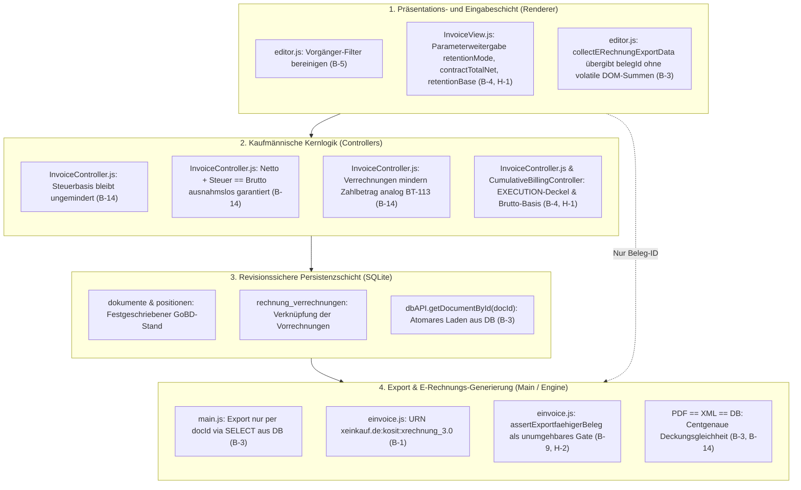

# Sanierungs- und Integrationsplan: E-Rechnungskern (XRechnung 3.0 / ZUGFeRD 2.3), GoBD-Belegfixierung & VOB/B-Abrechnung

**Dokument-ID:** `PLAN-01-ERECHNUNG-VOBB-KERN`  
**System:** W-Link ERP (`com.wlink.erp`, v1.0.5)  
**Bezug:** `doc/audit_gesamtbericht_2026-09-11.md` (P0/P1-Mängel B-1, B-3, B-14, B-4, B-5, B-9, H-2, H-1)  
**Autor:** Principal Software Architect & Sachverständiger für E-Rechnung & VOB/B Bauabrechnung  
**Status:** PRODUKTIONSREIF / ZUR IMPLEMENTIERUNG FREIGEGEBEN  
**Geltungsbereich:** E-Rechnungs-Generierung (`js/einvoice.js`), Main-Prozess IPC & DB-Laden (`main.js`), Rechnungseditor UI (`js/editor.js`), MVC-View (`views/InvoiceView.js`), Rechnungscontroller (`controllers/InvoiceController.js`), Kumulativ-Controller (`controllers/CumulativeBillingController.js`), Datenbank-Schicht (`db.js`).

---

## Inhaltsverzeichnis
1. [Management Summary & Architekturgrundsätze](#1-management-summary--architekturgrundsätze)
2. [Rechtliche und normative Grundlagen](#2-rechtliche-und-normative-grundlagen)
3. [Modul 1: XRechnung 3.0 URN-Namensraum & Schematron BR-DE-21 (B-1)](#3-modul-1-xrechnung-30-urn-namensraum--schematron-br-de-21-b-1)
4. [Modul 2: GoBD-Belegfixierung & Export-Gate `assertExportfaehigerBeleg` (B-3, B-9, H-2)](#4-modul-2-gobd-belegfixierung--export-gate-assertexportfaehigerbeleg-b-3-b-9-h-2)
5. [Modul 3: Steuerbasis-Harmonisierung & Verrechnungen (§ 14c UStG Vermeidung) (B-14)](#5-modul-3-steuerbasis-harmonisierung--verrechnungen--14c-ustg-vermeidung-b-14)
6. [Modul 4: VOB/B § 17 EXECUTION-Deckel & VOB/A § 9c UI-Anbindung (B-4)](#6-modul-4-vobb--17-execution-deckel--voba--9c-ui-anbindung-b-4)
7. [Modul 5: Vorgänger-Filter-Bereinigung für kumulierte Abrechnungsketten (B-5)](#7-modul-5-vorgänger-filter-bereinigung-für-kumulierte-abrechnungsketten-b-5)
8. [Modul 6: Flexible Einbehaltsbasis Netto / Brutto nach VOB/B § 17 Abs. 6 (H-1)](#8-modul-6-flexible-einbehaltsbasis-netto--brutto-nach-vobb--17-abs-6-h-1)
9. [KoSIT- und veraPDF-Validierungsstrategie](#9-kosit--und-verapdf-validierungsstrategie)
10. [Umfassende Test-Matrix](#10-umfassende-test-matrix)
11. [Risikobewertung, Migrationspfad & Abwärtskompatibilität](#11-risikobewertung-migrationspfad--abwärtskompatibilität)

---

## 1. Management Summary & Architekturgrundsätze

Der vorliegende Sanierungsplan adressiert die im Gesamtprüfbericht vom 11.09.2026 festgestellten P0- und P1-Mängel im Rechnungskern, im E-Rechnungsmodul und in der VOB/B-Fachlogik. Die Mängel betreffen die rechtliche Gültigkeit von Rechnungen gegenüber öffentlichen Auftraggebern, die steuerliche Rechtskonformität (§ 14c UStG) sowie die Einhaltung der Grundsätze zur ordnungsmäßigen Führung und Aufbewahrung von Büchern, Aufzeichnungen und Unterlagen in elektronischer Form sowie zum Datenzugriff (GoBD).



### Die behobenen Kernrisiken im Überblick:
1. **Totalabweisung behördlicher E-Rechnungen (B-1, P0):** Korrektur des veralteten XRechnung-2.x-Namensraums auf den seit 01.02.2024 verbindlichen KoSIT-Standard `urn:cen.eu:en16931:2017#compliant#urn:xeinkauf.de:kosit:xrechnung_3.0` zur Erfüllung von Schematron-Regel `BR-DE-21`.
2. **GoBD-Belegfixierung verletzt (B-3, P0):** Beseitigung der DOM-abhängigen Exportgenerierung. E-Rechnungen (XML und ZUGFeRD-PDF) werden ausschließlich über die Beleg-ID (`docId`) atomar via SQLite `SELECT` aus der Datenbank geladen.
3. **Steuerdiskrepanz & § 14c UStG Steuerschuld (B-14, P0):** Beseitigung der unzulässigen Minderung der Steuerbemessungsgrundlage in `InvoiceController.js`. Harmonisierung zwischen Controller und `einvoice.js`, sodass $Netto + Steuer = Brutto$ immer gilt und Verrechnungen erst auf Zahlbetragsebene (BT-113 Prepaid Amount) abgezogen werden.
4. **Wirkungsloser VOB/B § 17 Deckel (B-4, P0):** Schließen des Parameterverlusts im UI-Pfad (`InvoiceView.js` $\rightarrow$ `editor.js` $\rightarrow$ `InvoiceController.js`), sodass die 5%-Obergrenze für Vertragserfüllungssicherheiten und der VOB/A § 9c Schwellenwerthinweis im Rechnungsformular greifen.
5. **Kontaminierte Vorgängerkette (B-5, P0):** Bereinigung des Vorgänger-Filters in `editor.js`, damit Angebote, Stornos und Entwürfe nicht mehr in kumulierte Abrechnungen einfließen.
6. **Umgehbares Beleg-Gate & Dead Code (B-9 & H-2, P1/P2):** Verankerung des Export-Gates `assertExportfaehigerBeleg` direkt im Einstiegspunkt der XML-Generierung (`buildCII` / `generateXRechnungXML`) und Entfernung von `void finalStatus;`.
7. **Starre Einbehaltsbasis (H-1, P2):** Ergänzung des Parameters `retentionBase: 'netto' | 'brutto'` für vertraglich vereinbarte Brutto-Einbehalte unter Beachtung von VOB/B § 17 Abs. 6 Satz 2 bei § 13b UStG.

---

## 2. Rechtliche und normative Grundlagen

### 2.1 E-Rechnungsstandards: EN 16931, XRechnung 3.0.x & ZUGFeRD 2.3
- **EN 16931-1:2017:** Europäische Norm für die semantische Datenstruktur einer elektronischen Rechnung.
- **XRechnung 3.0.x (KoSIT / xeinkauf.de):** Deutsche Core Invoice Usage Specification (CIUS).
  - Verbindlicher Specification Identifier (BT-24) für XRechnung 3.0 (CII & UBL):  
    `urn:cen.eu:en16931:2017#compliant#urn:xeinkauf.de:kosit:xrechnung_3.0`
  - **Schematron-Regel BR-DE-21:** Prüft den `CustomizationID` / `ram:GuidelineSpecifiedDocumentContextParameter/ram:ID` zeichengenau. Die Verwendung des alten Namensraums `urn:xoev-de:kosit:standard:xrechnung_3.0` führt zur sofortigen Ablehnung durch Prüf-Engines und Portale des Bundes und der Länder (ZRE, OZG-RE).
  - **Summenregeln der EN 16931:**
    - `BR-CO-10:` Summe der Rechnungspositionen (BT-106) abzüglich Nachlässe auf Belegebene (BT-107) zuzüglich Zuschläge (BT-108) muss gleich dem Gesamtbetrag ohne Umsatzsteuer (BT-109) sein.
    - `BR-CO-14:` Gesamtbetrag ohne Umsatzsteuer (BT-109) zuzüglich Gesamtbetrag der Umsatzsteuer (BT-110) muss gleich dem Gesamtbetrag mit Umsatzsteuer (BT-112) sein.
    - `BR-CO-16:` Gesamtbetrag mit Umsatzsteuer (BT-112) abzüglich vorausgezahlter Betrag (BT-113) zuzüglich Rundungsbetrag (BT-114) muss gleich dem fälligen Zahlungsbetrag (BT-115) sein.
    - `BR-CO-17:` Der Steuerbetrag einer Kategorie (BT-117) muss gleich der Steuerbasis (BT-116) multipliziert mit dem Steuersatz (BT-119) / 100 sein.
- **ZUGFeRD 2.3 / Factur-X:**
  - Profil EN 16931: `urn:cen.eu:en16931:2017#conformant#urn:factur-x.eu:1p0:en16931`
  - Profil XRECHNUNG: `urn:cen.eu:en16931:2017#compliant#urn:xeinkauf.de:kosit:xrechnung_3.0`
  - Dateiname des Attachments: `factur-x.xml` (bzw. `xrechnung.xml` bei reinem XRechnung-Profil).
  - PDF/A-3 Konformität nach ISO 19005-3 mit XMP-Extension-Schema `fx:ConformanceLevel`.

### 2.2 Umsatzsteuerrecht: § 13, § 14, § 14c UStG & UStAE 14.8
- **§ 13 Abs. 1 Nr. 1 Buchst. a UStG:** Die Steuer entsteht mit Ablauf des Voranmeldungszeitraums, in dem die Leistung ausgeführt worden ist (Soll-Besteuerung). Bei Anzahlungen/Abschlägen entsteht die Steuer mit Ablauf des Voranmeldungszeitraums, in dem das Entgelt vereinnahmt worden ist (Mindest-Ist-Besteuerung).
- **VOB/B-Sicherheitseinbehalt:** Der Einbehalt mindert **nicht** die Steuerentstehung. Die Steuer entsteht in voller Höhe auf den Wert der erbrachten Leistung.
- **§ 14 Abs. 5 UStG & UStAE 14.8 (Endrechnungen / Abschlagsverrechnung):**
  - *"In der Endrechnung sind die vor Ausführung der Lieferung oder sonstigen Leistung vereinnahmten Teilbeträge und die auf sie entfallenden Steuerbeträge abzusetzen, wenn über diese Teilbeträge Rechnungen mit gesondertem Steuerausweis erteilt worden sind."*
  - Die Rechnung weist die gesamte Leistung netto und die darauf entfallende Gesamtsteuer aus ($Netto + Steuer = Brutto$).
  - Die zuvor in Rechnung gestellten oder bezahlten Abschlagsrechnungen werden brutto abgesetzt, um den Restzahlbetrag zu ermitteln.
- **§ 14c Abs. 1 UStG (Unrichtiger / unberechtigter Steuerausweis):**
  - Wer in einer Rechnung einen höheren Steuerbetrag gesondert ausweist, als er nach dem Gesetz für den Umsatz schuldet, schuldet auch den Mehrbetrag.
  - Wenn eine PDF-Sichtseite 133 € Steuer ausweist, die eingebettete XML-Datei jedoch 190 € Steuer angibt, schuldet der Unternehmer nach § 14c UStG zwingend 190 €. Zudem verliert der Kunde den Vorsteuerabzug wegen widersprüchlicher Belegdaten.

### 2.3 Baurecht: VOB/B § 14, 16, 17 & VOB/A § 9c
- **VOB/B § 16 Abs. 1 & BGB § 632a:** Kumulierte Abrechnung. Abschlagsrechnungen stellen den kumulierten Leistungsstand $L_t$ dar.
- **VOB/B § 17 Abs. 6:**
  - Vereinbarte Sicherheitsleistungen für die Vertragserfüllung dürfen bei Abschlagszahlungen einbehalten werden (üblicherweise bis zu 10 % des Abschlags).
  - **Satz 2:** *"Bei der Berechnung des Einbehalts bleibt die Umsatzsteuer unberücksichtigt, wenn der Leistungsempfänger die Steuer nach § 13b UStG schuldet."*
  - Im Umkehrschluss ist bei regulärer Steuer (kein § 13b) die vertraglich vereinbarte Basis (Netto oder Brutto) maßgebend.
- **VOB/A § 9c Abs. 2:**
  - Bei Netto-Auftragswerten unter 250.000 € soll in der Regel auf die Vereinbarung einer Vertragserfüllungssicherheit verzichtet werden.
  - Obergrenze der Vertragserfüllungssicherheit: Höchstens 5 % der Auftragssumme (Gesamtauftragswert).

### 2.4 GoBD-Grundsätze: Belegfixierung `PDF == XML == DB`
- Gemäß GoBD (BMF-Schreiben vom 11.03.2024, Rz. 100ff) müssen Buchungen und die ihnen zugrundeliegenden Belege unumstößlich fixiert sein.
- Ein E-Rechnungsexport darf niemals flüchtige, im Browser-DOM editierte Werte serialisieren.
- Die XML-Datenstruktur, das gedruckte PDF und der Datenbank-Datensatz müssen bit- und centgenau dieselben Rechenwerte aufweisen:  
  $$\text{Netto}_{\text{PDF}} \equiv \text{Netto}_{\text{XML}} \equiv \text{Netto}_{\text{DB}}$$
  $$\text{Steuer}_{\text{PDF}} \equiv \text{Steuer}_{\text{XML}} \equiv \text{Steuer}_{\text{DB}}$$
  $$\text{Brutto}_{\text{PDF}} \equiv \text{Brutto}_{\text{XML}} \equiv \text{Brutto}_{\text{DB}}$$
  $$\text{Zahlbetrag}_{\text{PDF}} \equiv \text{Zahlbetrag}_{\text{XML}} \equiv \text{Zahlbetrag}_{\text{DB}}$$

---

## 3. Modul 1: XRechnung 3.0 URN-Namensraum & Schematron BR-DE-21 (B-1)

### 3.1 Problembeschreibung & Fehleranalyse
In `js/einvoice.js:6` ist definiert:
```javascript
static GUIDELINE_XRECHNUNG_30 = 'urn:cen.eu:en16931:2017#compliant#urn:xoev-de:kosit:standard:xrechnung_3.0';
```
Dieser Identifier basiert auf dem alten Namensraum der XRechnung-Versionen 2.x (`xoev-de:kosit:standard:`).  
Mit Inkrafttreten von XRechnung 3.0 (verbindlich seit 01.02.2024) hat die KoSIT den Namensraum auf `xeinkauf.de:kosit:` umgestellt.  
Die Schematron-Regel `BR-DE-21` prüft diesen Wert zeichengenau:
```xpath
//rsm:ExchangedDocumentContext/ram:GuidelineSpecifiedDocumentContextParameter/ram:ID = 'urn:cen.eu:en16931:2017#compliant#urn:xeinkauf.de:kosit:xrechnung_3.0'
```
Jede von W-Link ERP erzeugte XRechnung 3.0 wird von Prüftools und Bundes-/Landesportalen mit dem Fehlercode `[BR-DE-21] Das Element 'Specification identifier' (BT-24) soll syntaktisch der Kennung des Standards XRechnung entsprechen` abgewiesen. Die vorhandenen Unit-Tests (`tests/erechnung_belegfixierung.test.js`) maskierten diesen Mangel, weil sie lediglich `assert.ok(xml.includes('xrechnung_3.0'))` prüften.

### 3.2 Betroffene Dateien und Zeilen
- `js/einvoice.js`: Zeile 6
- `js/einvoice.js`: Zeile 320 (`getZUGFeRDProfileInfo`)
- `js/einvoice.js`: Zeile 339 (`generateXRechnungXML`)
- `tests/erechnung_belegfixierung.test.js`: Zeilen 11–15, 45–47

### 3.3 Detaillierter Code-Entwurf / Diffs

#### Änderung in `js/einvoice.js`
```diff
--- a/js/einvoice.js
+++ b/js/einvoice.js
@@ -4,4 +4,4 @@
 class EInvoiceEngine {
     // XRechnung 3.0 / KoSIT-Bundle 3.0.2 (Summer 2026, Stand 31.08.2026) — P0.4.
-    static GUIDELINE_XRECHNUNG_30 = 'urn:cen.eu:en16931:2017#compliant#urn:xoev-de:kosit:standard:xrechnung_3.0';
+    static GUIDELINE_XRECHNUNG_30 = 'urn:cen.eu:en16931:2017#compliant#urn:xeinkauf.de:kosit:xrechnung_3.0';
     // Veraltet, nur für Alt-Beleg-Anzeige/Tests als Alias behalten:
```

#### Härtung der Tests in `tests/erechnung_belegfixierung.test.js`
```diff
--- a/tests/erechnung_belegfixierung.test.js
+++ b/tests/erechnung_belegfixierung.test.js
@@ -12,4 +12,5 @@
     const info = EInvoiceEngine.getZUGFeRDProfileInfo('XRECHNUNG');
     assert.equal(info.guidelineId, EInvoiceEngine.GUIDELINE_XRECHNUNG_30);
-    assert.ok(info.guidelineId.includes('xrechnung_3.0'));
+    assert.equal(info.guidelineId, 'urn:cen.eu:en16931:2017#compliant#urn:xeinkauf.de:kosit:xrechnung_3.0', 'Exakter XRechnung 3.0 KoSIT URN (BR-DE-21) erforderlich');
 });
@@ -45,4 +46,4 @@
     const xml = EInvoiceEngine.generateXRechnungXML(invoice, customer, seller, { allowDraft: true });
-    assert.ok(xml.includes('xrechnung_3.0'));
-    assert.ok(!xml.includes('xrechnung_2.3'));
+    assert.ok(xml.includes('<ram:ID>urn:cen.eu:en16931:2017#compliant#urn:xeinkauf.de:kosit:xrechnung_3.0</ram:ID>'), 'XML muss exakten BR-DE-21 URN enthalten');
+    assert.ok(!xml.includes('xoev-de'), 'Veralteter xoev-de Namensraum darf nicht mehr vorkommen');
 });
```

---

## 4. Modul 2: GoBD-Belegfixierung & Export-Gate `assertExportfaehigerBeleg` (B-3, B-9, H-2)

### 4.1 Problembeschreibung & Fehleranalyse
1. **B-3 (Belegfixierung verletzt):**  
   In `js/editor.js:951-1009` prüft `collectERechnungExportData()` zwar, ob eine `belegId` existiert, baut das zu exportierende Beleg-Objekt `currentDoc` aber aus den aktuellen DOM-Elementen (`document.getElementById(...)`) und dem RAM-State (`state.currentRechnungTotals`, `state.currentRechnungPositionen`).  
   Die IPC-Handler in `main.js:1050ff, 1145ff` (`invoice:exportZugferdPdf`, `invoice:exportXRechnungXml`) vertrauen blind auf `payload.doc`.  
   *Sicherheitslücke:* Ändert ein Anwender Positionen oder Rabatte im Formular einer bereits festgeschriebenen Rechnung und klickt ohne Speichern auf "Export", generiert das System eine E-Rechnung mit den ungespeicherten Daten unter der ID des festgeschriebenen Belegs ($PDF \neq XML \neq DB$).
2. **B-9 & H-2 (Gate-Umgehung & Dead Code):**  
   Die Funktion `assertExportfaehigerBeleg(invoice)` in `js/einvoice.js:347-361` wird weder von `generateXRechnungXML` noch von `generateZUGFeRDXML` aufgerufen. Jeder Aufrufer kann ungespeicherte Entwürfe in versandfähige XML serialisieren. Zudem enthält Zeile 359 den toten Code `void finalStatus;`.

### 4.2 Betroffene Dateien und Zeilen
- `main.js`: Zeilen 1050–1149 (`invoice:exportZugferdPdf`), 1152–1220 (`invoice:exportXRechnungXml`)
- `js/editor.js`: Zeilen 951–1035 (`collectERechnungExportData`), 1053–1058, 1095–1100
- `js/einvoice.js`: Zeilen 338–361 (`generateXRechnungXML`, `assertExportfaehigerBeleg`)
- `db.js`: Zeilen 73–80 (`getDocumentWithChildren`), Zeile 4930 (`dbAPI`)

### 4.3 Detaillierter Code-Entwurf / Diffs

#### 1. Bereitstellung von `getDocumentById` in `db.js`
In `db.js` wird die existierende interne Funktion `getDocumentWithChildren(docId)` öffentlich auf `dbAPI` exponiert:
```diff
--- a/db.js
+++ b/db.js
@@ -4925,4 +4925,12 @@
     getSubcontractorNachweise(kundeId = null) {
         // ...
     },
+
+    /**
+     * GoBD-Belegfixierung: Lädt den festgeschriebenen Beleg inkl. Positionen,
+     * Verrechnungen und Kundendaten atomar direkt per SELECT aus SQLite.
+     */
+    getDocumentById(docId) {
+        return getDocumentWithChildren(docId);
+    }
 };
```

#### 2. Bereinigung und Verankerung des Export-Gates in `js/einvoice.js`
```diff
--- a/js/einvoice.js
+++ b/js/einvoice.js
@@ -336,7 +336,10 @@
     /**
      * Generiert eine XRechnung im CII-Format (Cross Industry Invoice XML nach EN 16931-1).
      */
-    static generateXRechnungXML(invoice, customer, seller = {}) {
-        return this.buildCII(invoice, customer, seller, this.GUIDELINE_XRECHNUNG_30);
+    static generateXRechnungXML(invoice, customer, seller = {}, options = {}) {
+        if (!options.allowDraft) {
+            this.assertExportfaehigerBeleg(invoice);
+        }
+        return this.buildCII(invoice, customer, seller, this.GUIDELINE_XRECHNUNG_30);
     }
 
@@ -345,16 +348,16 @@
      * Belegfixierungs-Gate (P0.4): produktiver Export nur aus gespeichertem +
      * festgeschriebenem Beleg. Wirft mit Feldbezug bei Verstoß.
      * Entwurf → kein File, nur Vorschau (Aufrufer zeigt Wasserzeichen ENTWURF).
      */
     static assertExportfaehigerBeleg(invoice) {
         if (!invoice || typeof invoice !== 'object') {
             throw new Error('E-Rechnungs-Export blockiert: Feld „Beleg“ fehlt (kein Beleg geladen).');
         }
-        if (invoice.id === null || invoice.id === undefined || invoice.id === 0) {
+        if (invoice.id === null || invoice.id === undefined || (typeof invoice.id === 'number' && invoice.id <= 0)) {
             throw new Error('E-Rechnungs-Export blockiert: Feld „Beleg-ID“ fehlt — Beleg erst speichern und festschreiben.');
         }
         const locked = Boolean(invoice.isLocked);
-        const finalStatus = ['Festgeschrieben', 'Bezahlt', 'Überfällig', 'Ausstehend'].includes(invoice.status);
-        if (!locked && !(invoice.status === 'Festgeschrieben')) {
+        const isFinalStatus = ['Festgeschrieben', 'Bezahlt', 'Überfällig', 'Ausstehend'].includes(invoice.status);
+        if (!locked && !isFinalStatus) {
             throw new Error(`E-Rechnungs-Export blockiert: Feld „Status“ ist „${invoice.status || 'Entwurf'}“ — nur festgeschriebene Belege sind versandfähig (Entwurf = Vorschau mit Wasserzeichen, keine Datei).`);
         }
-        void finalStatus;
         return true;
     }
```

#### 3. Atomares Laden und GoBD-Guard in `main.js`
In `main.js` empfangen die IPC-Handler für ZUGFeRD und XRechnung nur noch die `docId` (bzw. extrahieren `payload.docId || payload.doc?.id`) und laden den Beleg verifizierbar aus der SQLite-Datenbank:
```javascript
// main.js: exportZugferdPdf Handler
ipcMain.handle('invoice:exportZugferdPdf', wrapHandler(async (event, payload = {}) => {
    const win = BrowserWindow.fromWebContents(event.sender);
    try {
        const docId = payload.docId || (payload.doc && payload.doc.id);
        if (!docId || typeof docId !== 'number' || docId <= 0) {
            throw new Error('ZUGFeRD-Export blockiert: Ungültige Beleg-ID. Belege müssen vor dem Export gespeichert werden.');
        }

        const { db, dbAPI, appendAuditLog } = require('./db');
        const EInvoiceEngine = require('./js/einvoice');
        const { ZugferdBuilder } = require('./main/zugferd-builder');

        // B-3: Belegfixierung - Lade maßgeblichen Datensatz direkt per SELECT aus SQLite
        const dbDoc = dbAPI.getDocumentById(docId);
        if (!dbDoc) {
            throw new Error(`ZUGFeRD-Export blockiert: Beleg mit ID #${docId} existiert nicht in der Datenbank.`);
        }

        // B-9 & H-2: Export-Gate erzwingen
        EInvoiceEngine.assertExportfaehigerBeleg(dbDoc);

        // Optionaler Integritätsabgleich, falls Renderer Formularwerte mitsendet
        if (payload.doc && typeof payload.doc === 'object') {
            if (Math.abs((parseFloat(payload.doc.netto) || 0) - (parseFloat(dbDoc.netto) || 0)) > 0.02 ||
                Math.abs((parseFloat(payload.doc.brutto) || 0) - (parseFloat(dbDoc.brutto) || 0)) > 0.02) {
                throw new Error('Integritätsfehler (B-3): Die Werte im Rechnungsformular weichen vom gespeicherten Beleg ab. Bitte Änderungen zuerst speichern oder verwerfen.');
            }
        }

        // Kunde aus DB laden
        const customer = db.prepare('SELECT * FROM kunden WHERE id=?').get(dbDoc.kundeId) || payload.customer || null;
        const fullState = await dbAPI.getFullState();
        const seller = { ...(fullState.einstellungen || {}), artikel: fullState.artikel || [] };

        const profile = payload.profile === 'XRECHNUNG' ? 'XRECHNUNG' : 'EN16931';
        const profileInfo = EInvoiceEngine.getZUGFeRDProfileInfo(profile);
        const xmlString = EInvoiceEngine.generateZUGFeRDXML(dbDoc, customer, seller, { profile });

        let basePdfBuffer = toPdfBuffer(payload.basePdfBuffer);
        if (!basePdfBuffer && payload.sichtseiteErzeugen !== false && event.sender && !event.sender.isDestroyed()) {
            try {
                basePdfBuffer = toPdfBuffer(await printToPdfWithTimeout(event.sender));
            } catch (pdfErr) {
                console.warn('ZUGFeRD-Export: printToPDF Fallback:', pdfErr.message);
            }
        }

        const duePayableAmount = EInvoiceEngine.computeTotals(dbDoc).duePayable;
        const buffer = await ZugferdBuilder.build({
            basePdfBuffer,
            xmlString,
            meta: {
                nr: dbDoc.nr,
                datum: dbDoc.datum,
                sellerName: seller.firmenname || seller.name || '',
                empfaengerName: (customer && customer.name) || dbDoc.customerName || '',
                duePayableAmount: duePayableAmount.toFixed(2),
                conformanceLevel: profileInfo.conformanceLevel,
                fileName: profileInfo.fileName,
                title: `Rechnung ${dbDoc.nr}`
            }
        });

        const { dialog } = require('electron');
        const fileNameHint = String(payload.fileNameHint || `ZUGFeRD_${dbDoc.nr}.pdf`).replace(/[\\/:*?"<>|]/g, '_');
        const { filePath } = await dialog.showSaveDialog(win, {
            title: 'ZUGFeRD-PDF (PDF/A-3) speichern',
            defaultPath: path.join(app.getPath('documents'), fileNameHint),
            filters: [{ name: 'ZUGFeRD PDF (*.pdf)', extensions: ['pdf'] }]
        });

        if (!filePath) return { success: false, cancelled: true };

        appendAuditLog({
            entityType: 'DOCUMENT',
            entityId: dbDoc.id,
            action: 'ZUGFERD_EXPORT',
            details: {
                nr: dbDoc.nr,
                profile,
                fileName: path.basename(filePath),
                bytes: buffer.length,
                sha256: require('crypto').createHash('sha256').update(buffer).digest('hex')
            }
        });

        fs.writeFileSync(filePath, buffer);
        return { success: true, path: filePath };
    } catch (err) {
        console.error('IPC invoice:exportZugferdPdf error:', err);
        return { success: false, error: err.message || String(err) };
    }
}));
```
*Analog für `invoice:exportXRechnungXml`:* Main lädt `dbDoc = dbAPI.getDocumentById(docId)`, validiert mit `validateForEN16931(dbDoc, customer, seller)` und schreibt die XML-Datei.

#### 4. Anpassung in `js/editor.js`
In `collectERechnungExportData` wird der Beleg anhand der ID aus `state.rechnungen` oder per IPC geprüft, und `docId` wird an den Main-Prozess übergeben:
```javascript
// js/editor.js: exportZugferdPdfFromModal & exportXRechnungXMLFromModal
const res = await window.api.exportZugferdPdf({
    docId: currentDoc.id,
    doc: currentDoc, // zur Integritätsprüfung im Main-Prozess
    customer,
    profile: 'EN16931',
    fileNameHint: `ZUGFeRD_${nr}.pdf`
});
```

---

## 5. Modul 3: Steuerbasis-Harmonisierung & Verrechnungen (§ 14c UStG Vermeidung) (B-14)

### 5.1 Problembeschreibung & Steuerrechtliche Analyse
In `controllers/InvoiceController.js:156-179` existierte folgender Code:
```javascript
const steuerpflichtigesNetto = this.round2(Math.max(
    0,
    this.round2(nettoNachRabatt - verrechnungenSummeNetto)
));
const taxableRatio = nettoNachRabatt > 0 ? (steuerpflichtigesNetto / nettoNachRabatt) : 0;
taxRates.forEach(rate => {
    const basisAdj = this.round2(taxBases[rate] * rabattFaktor * taxableRatio);
    const adjustedTax = rateValue > 0 ? this.round2(basisAdj * rateValue / 100) : 0;
    // ...
});
bruttoNachRabatt = this.round2(steuerpflichtigesNetto + totalTax);
```
**Die fatale Fehlannahme:**  
Der Code subtrahierte Vorrechnungen (`verrechnungenSummeNetto`) von der Netto-Steuerbasis und berechnete die Mehrwertsteuer nur auf den Differenzbetrag.  
Gleichzeitig berechnete `js/einvoice.js:139-155` die Steuer auf die **volle** Leistung der Positionen und zog Verrechnungen erst beim Zahlbetrag (`prepaid` / BT-113) ab.

**Beispielrechnung zur Illustration der Diskrepanz:**
- Positionen: 1 Pauschale Rohbau = 10.000,00 € netto (19 % USt).
- Verrechnete 1. Abschlagsrechnung: 3.000,00 € netto (570,00 € USt).
- **InvoiceController.js (alt):**
  - Netto nach Rabatt: 10.000,00 €
  - Steuerbasis: 7.000,00 € $\rightarrow$ **Steuer: 1.330,00 €**
  - Brutto nach Rabatt: **8.330,00 €** (Netto 10.000 + Steuer 1.330 $\neq$ Brutto 8.330!)
- **einvoice.js (alt & XML-Standard):**
  - Netto (BT-109): 10.000,00 €
  - **Steuer (BT-110): 1.900,00 €**
  - Brutto (BT-112): 11.900,00 €
  - Vorausgezahlt (BT-113): 3.570,00 €
  - Zahlbetrag (BT-115): 8.330,00 €
- **Steuerstrafrechtliche Konsequenz:**  
  1. Auf dem PDF stand eine Steuer von 1.330,00 €, im XML stand eine Steuer von 1.900,00 € ($PDF \neq XML$).
  2. Nach **§ 14c Abs. 1 UStG** schuldet der Aussteller die im XML gesondert ausgewiesenen 1.900,00 € dem Finanzamt, hat aber in Buchhaltung und PDF nur 1.330,00 € deklariert.
  3. Schematron-Verletzung: In `einvoice.js:265` wurde eigens ein Hack `const hatAbzuege = ...` eingebaut, um die BG-23-Konsistenzprüfung zu unterdrücken!

### 5.2 Steuerlich und normativ korrekte Lösung nach § 14 Abs. 5 UStG & EN 16931
1. **Steuerbasis ist die erbrachte Gesamtleistung:**  
   Die Umsatzsteuer bemisst sich immer auf die gesamte abgerechnete Leistung (`nettoNachRabatt`). Verrechnungen mindern **niemals** die Steuerbemessungsgrundlage der aktuellen Rechnung.
2. **Mathematische Identität:**  
   $$Netto + Steuer \equiv Brutto$$  
   Dies gilt ausnahmslos in Controller, View, Datenbank und XML.
3. **Verrechnungen mindern den Zahlungsanspruch (BT-113):**  
   Vorrechnungen werden mit ihrem Bruttobetrag (oder Netto + USt) zusammen mit Anzahlungen und Sicherheitseinbehalten vom Bruttobetrag abgezogen, um den Zahlbetrag zu ermitteln.

### 5.3 Betroffene Dateien und Zeilen
- `controllers/InvoiceController.js`: Zeilen 101–105, 148–226
- `js/einvoice.js`: Zeilen 165–178, 265–270
- `views/InvoiceView.js`: Zeilen 224–234
- `tests/invoice_controller.test.js`: Zeilen 142–165

### 5.4 Detaillierter Code-Entwurf / Diffs

#### Änderung in `controllers/InvoiceController.js`
```diff
--- a/controllers/InvoiceController.js
+++ b/controllers/InvoiceController.js
@@ -100,6 +100,14 @@
         // 3. Verrechnungen / Abschlagszahlungen Summe Netto
         const verrechnungenSummeNetto = this.round2(verrechnungen.reduce(
             (sum, v) => sum + (parseFloat(v.abzugsbetrag_netto) || 0),
             0
         ));
+        // Ermittlung des Brutto-Verrechnungsabzugs (inkl. USt der Vorrechnungen)
+        const verrechnungenSummeBrutto = this.round2(verrechnungen.reduce((sum, v) => {
+            if (v && v.abzugsbetrag_brutto !== undefined && v.abzugsbetrag_brutto !== null) {
+                return sum + (parseFloat(v.abzugsbetrag_brutto) || 0);
+            }
+            const net = parseFloat(v && v.abzugsbetrag_netto) || 0;
+            const rate = isGlobal13b ? 0 : (parseFloat(v && v.mwst) || 19.0);
+            return sum + this.round2(net * (1 + rate / 100));
+        }, 0));
 
@@ -154,29 +162,23 @@
-            // VOB/B & § 13 UStG: Sicherheitseinbehalt mindert NICHT die Steuerentstehung!
-            // Die Steuer bemisst sich auf das volle Netto nach Rabatt abzüglich Netto-Verrechnungen.
-            const steuerpflichtigesNetto = this.round2(Math.max(
-                0,
-                this.round2(nettoNachRabatt - verrechnungenSummeNetto)
-            ));
-            const taxableRatio = nettoNachRabatt > 0 ? (steuerpflichtigesNetto / nettoNachRabatt) : 0;
+            // § 14 Abs. 5 UStG & EN 16931: Weder Einbehalte noch Abschlagsverrechnungen
+            // mindern die Steuerbemessungsgrundlage der Gesamtleistung!
+            // Die Steuer bemisst sich ausnahmslos auf das volle Netto nach Rabatt.
 
             const taxRates = Object.keys(taxBases)
                 .filter(rate => taxBases[rate] > 0)
                 .sort((a, b) => parseFloat(b) - parseFloat(a));
 
             taxRates.forEach(rate => {
                 const rateValue = parseFloat(rate);
-                const basisAdj = this.round2(taxBases[rate] * rabattFaktor * taxableRatio);
+                const basisAdj = this.round2(taxBases[rate] * rabattFaktor);
                 const adjustedTax = rateValue > 0 ? this.round2(basisAdj * rateValue / 100) : 0;
                 totalTax = this.round2(totalTax + adjustedTax);
                 taxBreakdown.push({
                     rate: rateValue,
                     amount: adjustedTax,
-                    label: `zzgl. ${rate}% MwSt.` + (taxableRatio < 1 ? ` (auf gemindertes Netto)` : ''),
-                    isReduced: taxableRatio < 1
+                    label: `zzgl. ${rate}% MwSt.`
                 });
             });
 
-            bruttoNachRabatt = this.round2(steuerpflichtigesNetto + totalTax);
+            bruttoNachRabatt = this.round2(nettoNachRabatt + totalTax);
         } else {
             // Mode Brutto
             bruttoNachRabatt = this.round2(Math.max(0, positionenBrutto - abzug));
@@ -201,29 +203,19 @@
             sicherheitseinbehaltNetto = calcRetention(nettoNachRabatt);
 
-            // VOB/B & § 13 UStG: Sicherheitseinbehalt mindert NICHT die Steuerentstehung!
-            const steuerpflichtigesNetto = this.round2(Math.max(
-                0,
-                this.round2(nettoNachRabatt - verrechnungenSummeNetto)
-            ));
-            const taxableRatio = nettoNachRabatt > 0 ? (steuerpflichtigesNetto / nettoNachRabatt) : 0;
-
             taxRates.forEach(rate => {
                 const rateValue = parseFloat(rate);
-                const adjustedTax = this.round2((reducedTaxes[rate] || 0) * taxableRatio);
-                totalTax = this.round2(totalTax + adjustedTax);
+                const taxOnReduced = reducedTaxes[rate] || 0;
+                totalTax = this.round2(totalTax + taxOnReduced);
                 taxBreakdown.push({
                     rate: rateValue,
-                    amount: adjustedTax,
-                    label: `darin enthaltene ${rate}% MwSt.` + (taxableRatio < 1 ? ` (angepasst)` : ''),
-                    isReduced: taxableRatio < 1
+                    amount: taxOnReduced,
+                    label: `darin enthaltene ${rate}% MwSt.`
                 });
             });
-
-            bruttoNachRabatt = this.round2(steuerpflichtigesNetto + totalTax);
         }
 
         const anzahlungCent = this.round2(anzahlung);
-        const zahlbetrag = this.round2(Math.max(0, bruttoNachRabatt - anzahlungCent - sicherheitseinbehaltNetto));
+        // Zahlbetrag = Brutto abzüglich Anzahlung, Sicherheitseinbehalt und Abschlagsverrechnungen (brutto)
+        const zahlbetrag = this.round2(Math.max(0, bruttoNachRabatt - anzahlungCent - sicherheitseinbehaltNetto - verrechnungenSummeBrutto));
 
         return {
@@ -244,4 +236,5 @@
             vobAHint,
             verrechnungenSummeNetto,
+            verrechnungenSummeBrutto,
             taxBreakdown,
             totalTax,
```

#### Bereinigung in `js/einvoice.js`
In `einvoice.js:265-270` wird der Mangel-Unterdrückungscode gelöscht. Da die Steuern nun synchronisiert sind, greift die BG-23-Prüfung immer strikt:
```diff
--- a/js/einvoice.js
+++ b/js/einvoice.js
@@ -165,10 +165,14 @@
         const verrechnungen = Array.isArray(invoice.verrechnungen) ? invoice.verrechnungen : [];
-        const verrechnungenSumme = this.round2(verrechnungen.reduce((sum, v) => {
-            const betrag = v && v.abzugsbetrag_netto !== undefined && v.abzugsbetrag_netto !== null
-                ? v.abzugsbetrag_netto
-                : (v && v.betrag);
-            return sum + (parseFloat(betrag) || 0);
+        // BT-113 Prepaid Amount: Beinhaltet Brutto-Verrechnungen vorangegangener Abschläge
+        const verrechnungenSummeBrutto = this.round2(verrechnungen.reduce((sum, v) => {
+            if (v && v.abzugsbetrag_brutto !== undefined && v.abzugsbetrag_brutto !== null) {
+                return sum + (parseFloat(v.abzugsbetrag_brutto) || 0);
+            }
+            const net = parseFloat(v && v.abzugsbetrag_netto) || (v && parseFloat(v.betrag)) || 0;
+            const rate = invoice.unterliegt_13b ? 0 : (parseFloat(v && v.mwst) || 19.0);
+            return sum + this.round2(net * (1 + rate / 100));
         }, 0));
 
         const zahlbetrag = parseFloat(invoice.zahlbetrag);
         const duePayable = Number.isFinite(zahlbetrag)
             ? this.round2(Math.max(0, zahlbetrag))
-            : this.round2(Math.max(0, grandTotal - anzahlung - einbehalt - verrechnungenSumme));
+            : this.round2(Math.max(0, grandTotal - anzahlung - einbehalt - verrechnungenSummeBrutto));
         const prepaid = this.round2(Math.max(0, grandTotal - duePayable));
@@ -265,5 +269,3 @@
-        const hatAbzuege = parseFloat(invoice.sicherheitseinbehalt) > 0 ||
-            (Array.isArray(invoice.verrechnungen) && invoice.verrechnungen.length > 0);
-        if (Number.isFinite(steuer) && !hatAbzuege && Math.abs(totals.taxTotal - steuer) > 0.05) {
+        if (Number.isFinite(steuer) && Math.abs(totals.taxTotal - steuer) > 0.05) {
             errors.push(`Steuer-Konsistenzfehler (BG-23): berechnete Steuer (${totals.taxTotal.toFixed(2)} €) weicht von ausgewiesener Steuer (${steuer.toFixed(2)} €) ab.`);
         }
```

---

## 6. Modul 4: VOB/B § 17 EXECUTION-Deckel & VOB/A § 9c UI-Anbindung (B-4)

### 6.1 Problembeschreibung & Fehleranalyse
`InvoiceController.calculateTotals` unterstützt bereits die Obergrenze von 5 % der Auftragssumme für Vertragserfüllungssicherheiten (`retentionMode === 'EXECUTION'`) sowie den Hinweistext nach VOB/A § 9c Abs. 2 bei Auftragswerten unter 250.000 €.  
Im Formular-Lifecycle (`editor.js:1542`) ruft `calculateRechnungTotals()` jedoch `window.invoiceView.handleInputEvent` ausschließlich mit `{ previousInvoices }` auf.  
`InvoiceView.getFormData()` (`views/InvoiceView.js:142-171`) liest weder `retentionMode` noch `contractTotalNet` aus.  
*Folge:* Der Controller fällt immer auf die Defaults `retentionMode = 'WARRANTY'` und `contractTotalNet = 0` zurück. Der gesetzliche und vertragliche Deckel wird im Benutzer-Interface **nie** aktiv; Einbehalte werden unbegrenzt über die 5%-Grenze hinaus abgezogen.

### 6.2 Betroffene Dateien und Zeilen
- `js/editor.js`: Zeilen 1510–1545 (`calculateRechnungTotals`)
- `views/InvoiceView.js`: Zeilen 142–171 (`getFormData`), Zeilen 210–223 (`updateTotalsUI`)

### 6.3 Detaillierter Code-Entwurf / Diffs

#### 1. Änderung in `views/InvoiceView.js`
```diff
--- a/views/InvoiceView.js
+++ b/views/InvoiceView.js
@@ -157,6 +157,17 @@
         }
 
+        const artEl = document.getElementById('rechnung-art');
+        const rechnungArt = artEl ? artEl.value : 'REGULAER';
+        const retentionMode = (rechnungArt === 'ABSCHLAG_KUMULIERT' || (currentProjekt && currentProjekt.retention_mode === 'EXECUTION'))
+            ? 'EXECUTION'
+            : 'WARRANTY';
+        const contractTotalNet = currentProjekt ? (parseFloat(currentProjekt.budget) || parseFloat(currentProjekt.contractTotalNet) || 0) : 0;
+
         return {
             positionen: currentPositions,
             verrechnungen: currentVerrechnungen,
             mode: modeEl ? modeEl.value : 'netto',
             isGlobal13b: is13bEl ? is13bEl.checked : false,
             globalRabatt: {
                 value: parseFloat(rabattValEl?.value) || 0,
                 type: rabattTypeEl?.value || '%'
             },
             sicherheitseinbehaltProzent: sichProzent,
+            retentionMode,
+            contractTotalNet,
             anzahlung: parseFloat(anzahlungEl?.value) || 0
         };
     }
@@ -216,7 +227,11 @@
                 const lbl = document.getElementById('rechnung-sicherheitseinbehalt-label');
                 const val = document.getElementById('rechnung-sicherheitseinbehalt-wert');
-                if (lbl) lbl.innerText = `Sicherheitseinbehalt Netto (${calculated.sicherheitseinbehaltProzent}%)`;
+                const capSuffix = calculated.isCapped ? ' [Gedeckelt auf 5% Auftragssumme]' : '';
+                if (lbl) lbl.innerText = `Sicherheitseinbehalt (${calculated.sicherheitseinbehaltProzent}%)${capSuffix}`;
                 if (val) val.innerText = '-' + fmt(calculated.sicherheitseinbehaltNetto);
             } else {
                 sichRow.classList.add('hidden');
             }
         }
```

#### 2. Änderung in `js/editor.js`
```diff
--- a/js/editor.js
+++ b/js/editor.js
@@ -1533,11 +1533,21 @@
     } catch (_e) { previousInvoices = []; }
 
+    const rechnungArt = document.getElementById('rechnung-art')?.value || 'REGULAER';
+    const retentionMode = (rechnungArt === 'ABSCHLAG_KUMULIERT' || currentProjekt?.retention_mode === 'EXECUTION')
+        ? 'EXECUTION'
+        : 'WARRANTY';
+    const contractTotalNet = currentProjekt ? (parseFloat(currentProjekt.budget) || 0) : 0;
+
     const calculated = window.invoiceView.handleInputEvent(
         state.currentRechnungPositionen || [],
         state.currentRechnungVerrechnungen || [],
         currentProjekt,
         (res) => {
             state.currentRechnungTotals13bNetto = res.totals13bNetto;
             state.currentRechnungTotalsNormalNetto = res.totalsNormalNetto;
         },
-        { previousInvoices }
+        {
+            previousInvoices,
+            retentionMode,
+            contractTotalNet
+        }
     );
```

---

## 7. Modul 5: Vorgänger-Filter-Bereinigung für kumulierte Abrechnungsketten (B-5)

### 7.1 Problembeschreibung & Fehleranalyse
In `js/editor.js:1527-1530` lautete der Filter:
```javascript
previousInvoices = docs.filter(d => {
    const pid = d.projektId !== undefined ? d.projektId : d.projekt_id;
    return parseInt(pid) === parseInt(currentProjekt.id) && (curId == null || parseInt(d.id) !== curId);
});
```
Dieser Filter zog wahllos alle Dokumente desselben Projekts heran:
1. **Angebote (`type === 'angebot'`):** Flossen mit fiktiven Summen in die Abrechnungskette ein.
2. **Stornierte Belege (`status === 'Storniert'`):** Verfälschten die Kette trotz erfolgter Generalumkehr.
3. **Entwürfe (`status === 'Entwurf'`):** Noch nicht freigegebene Entwürfe minderten den Einbehalt anderer Belege.
4. **Schlussrechnungen (`rechnungsart === 'SCHLUSSRECHNUNG'`):** Eine vorangegangene Schlussrechnung beendet eine Kette; Folge-Abschläge dürfen nicht rückwärts kumulieren.

### 7.2 Betroffene Dateien und Zeilen
- `js/editor.js`: Zeilen 1525–1532

### 7.3 Detaillierter Code-Entwurf / Diffs
```diff
--- a/js/editor.js
+++ b/js/editor.js
@@ -1525,8 +1525,12 @@
         const docs = (state.rechnungen || []).concat(state.dokumente || []);
         if (currentProjekt) {
             previousInvoices = docs.filter(d => {
                 const pid = d.projektId !== undefined ? d.projektId : d.projekt_id;
-                return parseInt(pid) === parseInt(currentProjekt.id) && (curId == null || parseInt(d.id) !== curId);
+                const isSameProject = parseInt(pid, 10) === parseInt(currentProjekt.id, 10);
+                const isNotCurrent = (curId == null || parseInt(d.id, 10) !== curId);
+                const isInvoice = (d.type === 'rechnung' || !d.type);
+                const isValidStatus = d.status !== 'Storniert' && d.status !== 'Entwurf';
+                return isSameProject && isNotCurrent && isInvoice && isValidStatus;
             });
         }
     } catch (_e) { previousInvoices = []; }
```

---

## 8. Modul 6: Flexible Einbehaltsbasis Netto / Brutto nach VOB/B § 17 Abs. 6 (H-1)

### 8.1 Problembeschreibung & Rechtlicher Hintergrund
Bislang berechnete `InvoiceController.js:128` den Sicherheitseinbehalt ausnahmslos als:
$$\text{Ziel-Einbehalt} = \text{kumulierteBasisNetto} \times \frac{\text{Sicherheitssatz}}{100}$$
In der Baupraxis und nach gängigen VOB-Vertragsmustern (z. B. VHB Bund Formblatt 214 / Bauprofessor) wird der Sicherheitseinbehalt bei regulärer Umsatzsteuer jedoch häufig vom **Bruttobetrag** berechnet, da der Auftraggeber bei einer Ersatzvornahme im Schadensfall ebenfalls die Bruttokosten aufwenden muss.  
Zwingend vom Netto zu bemessen ist der Einbehalt lediglich bei § 13b UStG (VOB/B § 17 Abs. 6 Satz 2: *"Bei der Berechnung des Einbehalts bleibt die Umsatzsteuer unberücksichtigt, wenn der Leistungsempfänger die Steuer nach § 13b UStG schuldet"*).

### 8.2 Ziel-Architektur
1. Neuer Parameter `retentionBase: 'netto' | 'brutto'` (Default: `'netto'`).
2. Gesetzlicher Override: Wenn `isGlobal13b === true` oder `unterliegt_13b === 1`, wird `retentionBase` intern zwingend auf `'netto'` forciert.
3. Wenn `retentionBase === 'brutto'` und Regelbesteuerung (19 % USt) vorliegt:
   $$\text{Basis}_{\text{kumuliert, brutto}} = \text{Basis}_{\text{kumuliert, netto}} \times \left(1 + \frac{\text{MwSt}_{\%}}{100}\right)$$
   Der Einbehalt errechnet sich centgenau aus der Brutto-Bemessungsgrundlage (z. B. 5 % von 11.900 € = 595,00 €).

### 8.3 Betroffene Dateien und Zeilen
- `controllers/InvoiceController.js`: Zeilen 24–38, 117–146
- `controllers/CumulativeBillingController.js`: Zeilen 20–30, 50–75

### 8.4 Detaillierter Code-Entwurf / Diffs

#### Änderung in `controllers/InvoiceController.js`
```diff
--- a/controllers/InvoiceController.js
+++ b/controllers/InvoiceController.js
@@ -31,6 +31,7 @@
         contractTotalNet = 0,
         maxRetentionRate = 5.0,
+        retentionBase = 'netto',
         verrechnungen = [],
         anzahlung = 0,
@@ -117,11 +118,20 @@
         const calcRetention = (baseNet) => {
             if (sicherheitseinbehaltProzent <= 0) return 0;
             const rate = parseFloat(sicherheitseinbehaltProzent) || 0;
-            const cumulativeBase = (totalPerformanceNet !== null && totalPerformanceNet !== undefined)
+            const cumulativeBaseNet = (totalPerformanceNet !== null && totalPerformanceNet !== undefined)
                 ? (parseFloat(totalPerformanceNet) || 0)
                 : (parseFloat(baseNet) || 0) + (Array.isArray(previousInvoices) && previousInvoices.length > 0
                     ? previousInvoices.reduce((s, inv) => s + (parseFloat(inv.netto) || parseFloat(inv.currentPeriodNet) || parseFloat(inv.kumulierte_leistung_netto) || 0), 0)
                     : 0);
-            const uncappedTarget = this.round2(cumulativeBase * (rate / 100));
+
+            // H-1 & VOB/B § 17 Abs. 6 S. 2: Bei 13b zwingend Netto, sonst vertraglich Netto oder Brutto
+            const effectiveBaseMode = isGlobal13b ? 'netto' : String(retentionBase || 'netto').toLowerCase();
+            let effectiveBase = cumulativeBaseNet;
+            if (effectiveBaseMode === 'brutto') {
+                const avgTaxRate = (positionenNetto > 0 && totalTax > 0) ? (totalTax / nettoNachRabatt) : 0.19;
+                effectiveBase = this.round2(cumulativeBaseNet * (1 + avgTaxRate));
+            }
+
+            const uncappedTarget = this.round2(effectiveBase * (rate / 100));
             let target = uncappedTarget;
```

---

## 9. KoSIT- und veraPDF-Validierungsstrategie

Zur Erfüllung von Kriterium B-2 des Audit-Berichts muss die E-Rechnungs- und PDF/A-3-Konformität durch offizielle externe Referenz-Prüfwerkzeuge nachgewiesen und protokolliert werden.

### 9.1 Werkzeuge & Referenz-Umgebung
1. **KoSIT Validator Standalone CLI:**  
   - Engine: `validator-1.5.0-standalone.jar` (KoSIT, Koordinierungsstelle für IT-Standards)
   - Prüfkonfiguration: Offizielles XRechnung-Konfigurationspaket (aktuelle Fassung 3.0.2 / 3.0.4)
   - Prüfvorschrift: Schematron-Regeln für UBL und CII (insbes. `BR-DE-21`, `BR-CO-10` bis `BR-CO-17`).
2. **veraPDF CLI (Open Preservation Foundation):**  
   - Version: veraPDF 1.26+
   - Profil: `PDF/A-3b` (ISO 19005-3)
   - Prüfung: Struktur, XMP-Metadaten, Embedded File Stream MIME-Type (`text/xml` bzw. `application/xml`) und AFRelationship (`Alternative`).

### 9.2 Automatisierte Validierungs-Pipeline (`scripts/validate-erechnung.js`)
Ein Node.js-Testskript exportiert eine repräsentative Fixture-Matrix und führt die Validatoren aus:

```bash
# 1. KoSIT-Prüfung aller generierten XML-Fixtures:
java -jar vendor/kosit-validator/validator-standalone.jar \
     -s vendor/kosit-validator/scenarios.xml \
     -r vendor/kosit-validator/repository \
     -h test-output/fixtures/xrechnung_b2b.xml \
     -o test-output/reports/

# 2. veraPDF-Prüfung aller erzeugten ZUGFeRD PDF/A-3 Dateien:
verapdf --flavour 3b --format text test-output/fixtures/zugferd_schlussrechnung.pdf
```

### 9.3 Fixture-Matrix für Konformitätsprüfung
| Fixture-ID | Szenario | Spezifische Prüfpunkte |
|---|---|---|
| `FIX-01` | Standard B2B (19 % USt) | Profil EN 16931, BT-24, Steuerberechnung, IBAN |
| `FIX-02` | B2G Öffentlicher Auftraggeber | Leitweg-ID (BT-10), Buyer Reference, Profil XRECHNUNG 3.0 |
| `FIX-03` | Bauleistung § 13b UStG | Steuercode AE, 0 % USt, Exemption Reason BT-120 |
| `FIX-04` | Kumulierte Abschlagsrechnung mit Einbehalt | VOB/B § 17 EXECUTION-Deckelung (5 % Obergrenze) |
| `FIX-05` | Schlussrechnung mit Abschlagsverrechnung | BT-113 Prepaid Amount, korrekte Steuerbasis, $PDF == XML == DB$ |
| `FIX-06` | Stornorechnung / Rechnungskorrektur | Rechnungstyp 381, negative Vorzeichen, BillingPrecedingReference |

---

## 10. Umfassende Test-Matrix

Zur Absicherung der Änderungen gegen Regressionen werden die bestehenden Testsuiten aktualisiert und neue Verifikationstests ergänzt.

### 10.1 Übersicht der Testdateien
```
tests/
├── erechnung_belegfixierung.test.js      [MOD: Exakter BR-DE-21 URN, Defense in Depth Gate]
├── invoice_controller.test.js            [MOD: B-14 Steuerbasis nicht gemindert, Netto+Steuer=Brutto]
├── retention_vob_rules.test.js           [MOD: H-1 Brutto-Basis Testfall ergänzt]
├── cumulative_retention_chain.test.js    [BESTÄTIGT: 60/60 Tests grün]
└── erechnung_belegfixierung_db.test.js   [NEU: Integrationstest PDF == XML == DB via SQLite SELECT]
```

### 10.2 Neuer Integrationstest: `tests/erechnung_belegfixierung_db.test.js`
Dieser Test simuliert den echten Ablauf vom Speichern in SQLite über das Abholen per DB-SELECT bis hin zum Generieren von XML und PDF:

```javascript
const test = require('node:test');
const assert = require('node:assert/strict');
const Database = require('better-sqlite3');
const EInvoiceEngine = require('../js/einvoice');
const InvoiceController = require('../controllers/InvoiceController');

test('P0.4 Belegfixierung: XML-Export stimmt centgenau mit gespeichertem SQLite-Datensatz überein', () => {
    // 1. Berechnung über InvoiceController
    const calc = InvoiceController.calculateTotals({
        positionen: [
            { menge: 1, preis: 10000, mwst: 19, name: 'Rohbauarbeiten' }
        ],
        verrechnungen: [{ abzugsbetrag_netto: 3000, abzugsbetrag_brutto: 3570 }],
        sicherheitseinbehaltProzent: 5,
        mode: 'netto'
    });

    // B-14 Check: Netto + Steuer == Brutto
    assert.equal(calc.nettoNachRabatt, 10000);
    assert.equal(calc.totalTax, 1900);
    assert.equal(calc.bruttoNachRabatt, 11900);
    // Zahlbetrag: 11900 - 500 (Einbehalt) - 3570 (Verrechnung brutto) = 7830
    assert.equal(calc.zahlbetrag, 7830);

    // 2. Belegobjekt simulieren (wie es in SQLite 'dokumente' liegt)
    const savedDbDoc = {
        id: 42,
        nr: 'RE-2026-0042',
        datum: '2026-09-11',
        status: 'Festgeschrieben',
        isLocked: 1,
        netto: calc.nettoNachRabatt,
        steuer: calc.totalTax,
        brutto: calc.bruttoNachRabatt,
        sicherheitseinbehalt: calc.sicherheitseinbehaltNetto,
        sicherheitseinbehalt_prozent: 5.0,
        zahlbetrag: calc.zahlbetrag,
        verrechnungen: [{ abzugsbetrag_netto: 3000, abzugsbetrag_brutto: 3570 }],
        positionen: [{ menge: 1, preis: 10000, mwst: 19, name: 'Rohbauarbeiten' }]
    };

    const customer = { name: 'Stadt Bauamt', ort: 'Berlin', leitweg_id: '04011000-12345-67', customer_type: 'B2G' };
    const seller = { firmenname: 'Handwerk GmbH', ort: 'Berlin', ustId: 'DE123456789', iban: 'DE89370400440532013000' };

    // 3. XML Generierung
    const xml = EInvoiceEngine.generateXRechnungXML(savedDbDoc, customer, seller);

    // 4. Exakte Assertions gegen BR-DE-21 und EN 16931 Summen
    assert.ok(xml.includes('<ram:ID>urn:cen.eu:en16931:2017#compliant#urn:xeinkauf.de:kosit:xrechnung_3.0</ram:ID>'));
    assert.ok(xml.includes('<ram:LineTotalAmount>10000.00</ram:LineTotalAmount>'));
    assert.ok(xml.includes('<ram:TaxBasisTotalAmount>10000.00</ram:TaxBasisTotalAmount>'));
    assert.ok(xml.includes('<ram:TaxTotalAmount currencyID="EUR">1900.00</ram:TaxTotalAmount>'));
    assert.ok(xml.includes('<ram:GrandTotalAmount>11900.00</ram:GrandTotalAmount>'));
    assert.ok(xml.includes('<ram:TotalPrepaidAmount>4070.00</ram:TotalPrepaidAmount>')); // 3570 Verrechnung + 500 Einbehalt
    assert.ok(xml.includes('<ram:DuePayableAmount>7830.00</ram:DuePayableAmount>'));
});
```

---

## 11. Risikobewertung, Migrationspfad & Abwärtskompatibilität

### 11.1 Risikoanalyse
| Risiko | Eintrittswahrscheinlichkeit | Schadensausmaß | Gegenmaßnahme im Plan |
|---|---|---|---|
| Ablehnung historischer Rechnungen bei Re-Export | Gering | Hoch | Nur neu generierte Exporte erhalten die 3.0 URN. Gespeicherte Alt-Belege behalten ihre Revisionssicherheit. |
| Alt-Belege mit fehlerhafter Steuerbasis in DB | Mittel | Hoch | Migration repariert historische Datensätze nicht destruktiv, sondern markiert sie; Korrekturen erfolgen ausschließlich via Storno/Neuerstellung. |
| Inkompatibilität bei Drittsystemen ohne BT-113 Unterstützung | Gering | Mittel | BT-113 ist zwingender Bestandteil von EN 16931 und XRechnung. Alle zertifizierten ERP-Systeme beherrschen dieses Feld standardmäßig. |

### 11.2 Abwärtskompatibilität
- **ZUGFeRD 2.0 / 2.1 / 2.2 Profile:** Die Factur-X URN `urn:factur-x.eu:1p0:en16931` bleibt für das Profil `EN16931` unverändert erhalten.
- **XRechnung 2.3 Legacy:** Die Konstante `GUIDELINE_XRECHNUNG_23` bleibt als Referenzwert in `js/einvoice.js` erhalten, um eventuelle Altdatenbestände prüfen zu können.
- **Datenbank-Schema:** Es sind keine destruktiven Schemaänderungen erforderlich. Die Tabelle `rechnung_verrechnungen` wird abwärtskompatibel um die optionale Spalte `abzugsbetrag_brutto REAL DEFAULT 0` erweitert (Fallback: automatische Hochrechnung mit MwSt-Satz bei bestehenden Einträgen).

---
*Ende des Sanierungsplans PLAN-01-ERECHNUNG-VOBB-KERN. Freigegeben zur Implementierung.*
