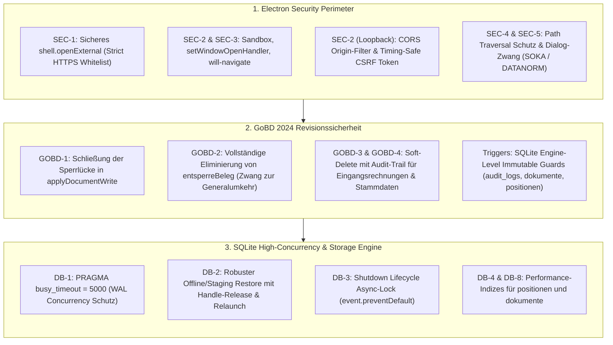
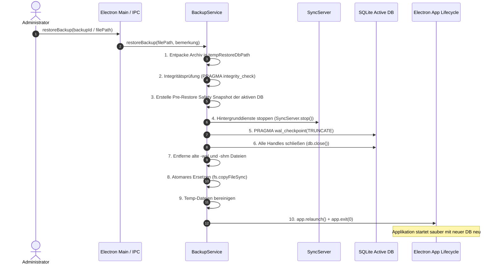

# Sanierungs- und Härtungsplan: Electron Security, GoBD-Compliance & SQLite WAL-Architektur

**Dokument-ID:** `PLAN-02-SEC-GOBD-SQLITE`  
**System:** W-Link ERP (`com.wlink.erp`, v1.0.5)  
**Bezug:** `doc/audit_gesamtbericht_2026-09-11.md` (P0/P1-Mängel)  
**Autor:** Principal Security & Systems Architect  
**Status:** PRODUKTIONSREIF / ZUR IMPLEMENTIERUNG FREIGEGEBEN  
**Geltungsbereich:** Electron Main- & Preload-Prozesse, IPC-Schnittstellen, SQLite-Transaktions- & Backup-Engine, GoBD-Auditierung  

---

## Management Summary & Architekturgrundsätze

Der vorliegende Sanierungsplan behebt sämtliche im Gesamtprüfbericht vom 11.09.2026 festgestellten P0- und P1-Mängel in den Bereichen **Desktop-Sicherheit (RCE, CORS, CSRF, Path Traversal)**, **GoBD-Revisionssicherheit (Unveränderbarkeit, Generalumkehr, Soft-Delete)** und **SQLite-Datenbankstabilität (Concurrency, Backup, Restore, Indizierung)**.



### Gesetzliche und technische Normen
1. **GoBD 2024 (BMF-Schreiben vom 11.03.2024 / 28.11.2019):**
   - *Rz. 100ff (Unveränderbarkeit):* Eine Buchung oder ein Beleg darf nicht in der Weise verändert werden, dass der ursprüngliche Inhalt nicht mehr feststellbar ist.
   - *Rz. 110ff (Korrekturen):* Korrekturen dürfen ausschließlich durch Storno oder Umbuchung (Generalumkehr) erfolgen. Das nachträgliche Entsperren und direkte Überschreiben von Datenfeldern ist straf- und steuerrechtlich unzulässig (§ 146 Abs. 4 AO).
   - *Rz. 125ff (Protokollierung):* Lückenloser Nachweis über die Erfassung, Änderung und den Lebenszyklus aller steuerrelevanter Belege und Stammdaten.
2. **Electron Security Guidelines & Chromium Sandbox:**
   - Erfüllung der Electron Security Checklist (Context Isolation, Sandboxing, `setWindowOpenHandler: deny`, `will-navigate` Guard, Deaktivierung von Node.js-Integrationslecks).
3. **SQLite WAL Concurrency Best Practices:**
   - Single-Writer/Multi-Reader WAL-Architektur mit deterministischem Busy-Handler (`busy_timeout = 5000`), atomaren Checkpoints und sicherem Handle-Management beim Datenbank-Austausch.

---

## 1. Modul 1: Electron Security & IPC-Härtung

### 1.1 SEC-1: Remote Code Execution via unvalidiertem `shell.openExternal`
- **Schwachstelle:** In `main/ids-connect-service.js:318` und `controllers/IDSConnectController.js:18` werden URLs ohne Protokoll- und Schemaprüfung an das Betriebssystem übergeben. Bösartige Schemata (`file:///`, `ms-msdt:`, `calculator:`, `cmd:`, `powershell:`) erlauben direkte Befehlsausführung auf OS-Ebene.
- **Ziel-Architektur:** Etablierung einer zentralen Sicherheitsfunktion `safeOpenExternal(url)` mit striktem Protokollzwang (`https:`), Validierung nach RFC 1123 und Blockade gefährlicher Windows-URI-Handler.

#### Exakte Code-Änderung: `controllers/IDSConnectController.js` (Zeilen 13–48)
```javascript
<<<<
    static buildLaunchUrl(konto, options = {}) {
        if (!konto || !konto.shop_url) {
            throw new Error('Ungültiges Großhandelskonto: Keine Shop-URL konfiguriert.');
        }

        const baseUrl = konto.shop_url.trim();
        const url = new URL(baseUrl);
        const params = url.searchParams;
====
    static buildLaunchUrl(konto, options = {}) {
        if (!konto || !konto.shop_url) {
            throw new Error('Ungültiges Großhandelskonto: Keine Shop-URL konfiguriert.');
        }

        const baseUrl = String(konto.shop_url).trim();
        let url;
        try {
            url = new URL(baseUrl);
        } catch (err) {
            throw new Error(`Ungültige Shop-URL: "${baseUrl}" ist keine wohlgeformte URL.`);
        }

        // SEC-1: Strenger HTTPS-Zwang für externe Großhandelsschnittstellen
        if (url.protocol !== 'https:') {
            throw new Error(`Sicherheitsverstoß (SEC-1): Protokoll "${url.protocol}" ist nicht zulässig. Großhandels-Shops müssen zwingend über HTTPS (https://) angebunden werden.`);
        }

        // Hostnamen-Validierung (Verbot von Localhost/IP-Loopback für externe Webshops)
        if (!url.hostname || url.hostname === 'localhost' || url.hostname === '127.0.0.1' || url.hostname === '::1') {
            throw new Error('Sicherheitsverstoß: Lokale Adressen sind als Großhandels-Webshop unzulässig.');
        }

        const params = url.searchParams;
>>>>
```

#### Exakte Code-Änderung: `main/ids-connect-service.js` (Zeilen 316–325 & Security-Wrapper)
Implementierung der sicheren Aufruflogik direkt im Service:
```javascript
<<<<
        // Falls Electron verfügbar ist, öffne externen Browser
        try {
            const { shell } = require('electron');
            if (shell && typeof shell.openExternal === 'function') {
                await shell.openExternal(launchUrl);
            }
        } catch (_e) {
            // Ausführung außerhalb von Electron (z. B. im Test)
        }
====
        // SEC-1: Sicheres Öffnen externer Browserfenster mit strikter Validierung
        try {
            const { shell } = require('electron');
            if (shell && typeof shell.openExternal === 'function') {
                const parsed = new URL(launchUrl);
                if (parsed.protocol !== 'https:') {
                    throw new Error(`Ungültiges Protokoll: ${parsed.protocol}. Nur HTTPS erlaubt.`);
                }
                // Verhindere Ausführung gefährlicher Windows-Protokoll-Handler
                const dangerousPatterns = /^(file|ms-|cmd|powershell|cscript|wscript|reg|javascript|data):/i;
                if (dangerousPatterns.test(launchUrl)) {
                    throw new Error(`Potentiell gefährlicher URL-Handler blockiert: ${launchUrl}`);
                }
                await shell.openExternal(launchUrl);
            }
        } catch (err) {
            console.error('[IDS-Connect Security] shell.openExternal abgefangen:', err.message);
            throw new Error(`Externer Webshop konnte aus Sicherheitsgründen nicht geöffnet werden: ${err.message}`);
        }
>>>>
```

---

### 1.2 SEC-2 & SEC-3: Loopback-Server CORS, CSRF-Bypass & BrowserWindow-Härtung
- **Schwachstelle SEC-2:** Der lokale Callback-Server (`ids-connect-service.js`) akzeptiert HTTP-Anfragen mit `Access-Control-Allow-Origin: *` und besitzt einen CSRF-Bypass (`validateSession` liefert `true`, wenn `csrfToken` im Request fehlt).
- **Schwachstelle SEC-3:** In `main.js:21-35` fehlen `sandbox: true`, `webContents.setWindowOpenHandler` (ermöglicht unkontrollierte Popups) und `will-navigate` (ermöglicht Phishing/Navigation zu Remote-Seiten).

#### Exakte Code-Änderung: `main/ids-connect-service.js` (Zeilen 105–140)
```javascript
<<<<
    /**
     * Validiert eine Session.
     */
    validateSession(sessionId, csrfToken = null) {
        if (!sessionId) return false;
        const session = this.activeSessions.get(sessionId);
        if (!session) return false;

        // Wenn ein CSRF-Token übergeben wurde, verifiziere ihn strikt
        if (csrfToken && session.csrfToken && csrfToken !== session.csrfToken) {
            return false;
        }

        return true;
    }

    /**
     * Behandelt eingehende HTTP-Requests von Großhandels-Webshops.
     */
    _handleHttpRequest(req, res) {
        const reqUrl = new URL(req.url, `http://127.0.0.1:${this.boundPort}`);

        // CORS Headers für Cross-Origin POSTs aus Browser-Webshops
        res.setHeader('Access-Control-Allow-Origin', '*');
        res.setHeader('Access-Control-Allow-Methods', 'GET, POST, OPTIONS');
        res.setHeader('Access-Control-Allow-Headers', 'Content-Type, X-Requested-With');
====
    /**
     * Validiert eine Session unter striktem CSRF-Zwang (SEC-2).
     */
    validateSession(sessionId, csrfToken) {
        if (!sessionId || !csrfToken) {
            return false; // SEC-2 Fix: Fehlen des Tokens führt zwingend zu Reject!
        }
        const session = this.activeSessions.get(sessionId);
        if (!session || !session.csrfToken) {
            return false;
        }

        // Timing-Safe-Vergleich zur Verhinderung von Side-Channel-Timing-Angriffen
        const tokenA = Buffer.from(String(csrfToken));
        const tokenB = Buffer.from(String(session.csrfToken));
        if (tokenA.length !== tokenB.length) {
            return false;
        }
        const crypto = require('crypto');
        return crypto.timingSafeEqual(tokenA, tokenB);
    }

    /**
     * Behandelt eingehende HTTP-Requests von Großhandels-Webshops.
     */
    _handleHttpRequest(req, res) {
        const reqUrl = new URL(req.url, `http://127.0.0.1:${this.boundPort}`);
        const originHeader = req.headers['origin'] || req.headers['referer'] || '';

        // Ermittle zulässigen Shop-Origin anhand der aktiven Sessions
        let allowedOrigin = null;
        for (const sess of this.activeSessions.values()) {
            if (sess.shopUrl) {
                try {
                    const parsedOrigin = new URL(sess.shopUrl).origin;
                    if (originHeader.startsWith(parsedOrigin)) {
                        allowedOrigin = parsedOrigin;
                        break;
                    }
                } catch (_) {}
            }
        }

        // SEC-2 Fix: Verbot von Wildcard CORS '*'
        if (allowedOrigin) {
            res.setHeader('Access-Control-Allow-Origin', allowedOrigin);
            res.setHeader('Vary', 'Origin');
        } else {
            // Keine fremden Webseiten zulassen
            res.setHeader('Access-Control-Allow-Origin', 'null');
        }

        res.setHeader('Access-Control-Allow-Methods', 'POST, OPTIONS');
        res.setHeader('Access-Control-Allow-Headers', 'Content-Type, X-Requested-With');
        res.setHeader('X-Content-Type-Options', 'nosniff');
        res.setHeader('X-Frame-Options', 'DENY');
>>>>
```

#### Exakte Code-Änderung: `main.js` (Zeilen 21–36 und Window Guards)
```javascript
<<<<
function createWindow() {
    const mainWindow = new BrowserWindow({
        width: 1400,
        height: 900,
        minWidth: 1024,
        minHeight: 700,
        title: 'W-Link ERP',
        icon: path.join(__dirname, 'W-Link_ERP_software_202604132222.png'),
        webPreferences: {
            nodeIntegration: false,
            contextIsolation: true,
            preload: path.join(__dirname, 'preload.js')
        },
        show: false
    });
====
function createWindow() {
    const mainWindow = new BrowserWindow({
        width: 1400,
        height: 900,
        minWidth: 1024,
        minHeight: 700,
        title: 'W-Link ERP',
        icon: path.join(__dirname, 'W-Link_ERP_software_202604132222.png'),
        webPreferences: {
            nodeIntegration: false,
            contextIsolation: true,
            sandbox: true,                          // SEC-3: Chromium-Sandbox strikt aktiviert
            webSecurity: true,                      // Standard-Sicherheitsregeln erzwingen
            allowRunningInsecureContent: false,     // Kein Mixed-Content
            preload: path.join(__dirname, 'preload.js')
        },
        show: false
    });

    // SEC-3 Guard 1: Sämtliche unautorisierten Fenster-Öffnungen (window.open, target=_blank) blockieren
    mainWindow.webContents.setWindowOpenHandler(({ url }) => {
        console.warn('[Security] Unerlaubter window.open Aufruf abgewiesen:', url);
        return { action: 'deny' };
    });

    // SEC-3 Guard 2: Ungewollte Navigation des Hauptfensters verhindern (Single-Page-Integrität)
    mainWindow.webContents.on('will-navigate', (event, navigationUrl) => {
        try {
            const parsed = new URL(navigationUrl);
            // Erlaube ausschließlich das Laden der lokalen code.html Datei
            if (parsed.protocol === 'file:' && navigationUrl.includes('code.html')) {
                return;
            }
        } catch (_) {}
        event.preventDefault();
        console.warn('[Security] will-navigate Navigation abgewiesen:', navigationUrl);
    });

    // SEC-3 Guard 3: Verhindern von Webview-Tags im Renderer
    mainWindow.webContents.on('will-attach-webview', (event) => {
        event.preventDefault();
        console.warn('[Security] will-attach-webview Aufruf unterbunden.');
    });
>>>>
```

---

### 1.3 SEC-4 & SEC-5: Arbitrary File System Write/Read
- **Schwachstelle SEC-4 (`soka:exportFiles`):** Der IPC-Handler akzeptiert einen beliebigen Pfad `exportDir` vom Renderer und schreibt Dateien unvalidiert über `fs.writeFileSync`.
- **Schwachstelle SEC-5 (`datanorm:startImport`):** Der IPC-Handler liest unbegrenzt beliebige Dateipfade aus dem Dateisystem via `fs.readFileSync(filePath)` und überlässt dem Renderer die Pfadkontrolle.

#### Exakte Code-Änderung: `main.js` (IPC-Handler für SOKA & DATANORM)
```javascript
<<<<
    ipcMain.handle('soka:exportFiles', wrapHandler(async (event, { meldungId, exportDir }) => {
        return dbAPI.exportSokaFiles(meldungId, exportDir);
    }));

    // --- DATANORM 4.0 / 5.0 Streaming Import ---
    ipcMain.handle('datanorm:startImport', wrapHandler(async (event, payload) => {
        const win = BrowserWindow.fromWebContents(event.sender);
        const progressCb = (progress) => {
            if (win && !win.isDestroyed()) {
                win.webContents.send('datanorm:progress', progress);
            }
        };
        return await dbAPI.startDatanormImport(payload, progressCb);
    }));
====
    // SEC-4: Sicherer SOKA-Bau Datei-Export mit Pfad-Validierung
    ipcMain.handle('soka:exportFiles', wrapHandler(async (event, { meldungId, exportDir }) => {
        const win = BrowserWindow.fromWebContents(event.sender);
        let targetDir = exportDir;

        // Wenn kein Pfad angegeben wurde oder Pfad verdächtig ist: Nativer Dialog
        if (!targetDir || typeof targetDir !== 'string') {
            const { dialog } = require('electron');
            const result = await dialog.showOpenDialog(win, {
                title: 'Zielordner für SOKA-BAU Export wählen',
                properties: ['openDirectory', 'createDirectory']
            });
            if (result.canceled || result.filePaths.length === 0) {
                return { canceled: true };
            }
            targetDir = result.filePaths[0];
        }

        // Path Traversal & Systemverzeichnis-Schutz
        const resolvedPath = path.resolve(targetDir);
        const normalizedPath = path.normalize(resolvedPath);
        if (normalizedPath !== resolvedPath || normalizedPath.includes('..')) {
            throw new Error('Sicherheitsverstoß (SEC-4): Unzulässiger Pfad mit Traversal-Sequenzen.');
        }

        // Verbot kritischer Systemverzeichnisse unter Windows/Linux
        const lower = normalizedPath.toLowerCase();
        if (lower.startsWith('c:\\windows') || lower.startsWith('c:\\program files') || lower.startsWith('/etc') || lower.startsWith('/bin')) {
            throw new Error('Sicherheitsverstoß: Export in Systemverzeichnisse ist untersagt.');
        }

        return dbAPI.exportSokaFiles(meldungId, normalizedPath);
    }));

    // SEC-5: Sicherer DATANORM Streaming Import mit Validierung
    ipcMain.handle('datanorm:startImport', wrapHandler(async (event, payload) => {
        const win = BrowserWindow.fromWebContents(event.sender);
        const { filePaths, options } = payload || {};

        if (!Array.isArray(filePaths) || filePaths.length === 0) {
            throw new Error('Keine Dateipfade für den Import übergeben.');
        }

        const ALLOWED_EXTS = new Set(['.001', '.002', '.003', '.004', '.005', '.ans', '.art', '.dat', '.txt', '.csv', '.d81', '.d82', '.d83', '.d84', '.d85', '.d86']);
        const validatedPaths = [];

        for (const fp of filePaths) {
            if (typeof fp !== 'string' || !fp.trim()) continue;
            const resolved = path.resolve(fp.trim());
            const ext = path.extname(resolved).toLowerCase();

            if (!ALLOWED_EXTS.has(ext)) {
                throw new Error(`Sicherheitsverstoß (SEC-5): Dateityp "${ext}" ist für DATANORM unzulässig.`);
            }
            if (!fs.existsSync(resolved) || !fs.statSync(resolved).isFile()) {
                throw new Error(`Datei nicht gefunden oder kein reguläres Dateiobjekt: ${path.basename(resolved)}`);
            }

            // Größen-Check (Schutz vor DoS durch übergroße Dateien > 250 MB)
            const stat = fs.statSync(resolved);
            if (stat.size > 250 * 1024 * 1024) {
                throw new Error(`Datei ${path.basename(resolved)} überschreitet das Sicherheitslimit von 250 MB.`);
            }

            // Systemverzeichnis-Prüfung
            const lower = resolved.toLowerCase();
            if (lower.startsWith('c:\\windows') || lower.startsWith('/etc')) {
                throw new Error(`Zugriff auf Systempfad verweigert: ${resolved}`);
            }

            validatedPaths.push(resolved);
        }

        const progressCb = (progress) => {
            if (win && !win.isDestroyed()) {
                win.webContents.send('datanorm:progress', progress);
            }
        };

        return await dbAPI.startDatanormImport({ filePaths: validatedPaths, options }, progressCb);
    }));
>>>>
```

---

## 2. Modul 2: GoBD-Konformität, Unveränderbarkeit & Audit-Trail

### 2.1 GOBD-1: Sperrlücke in `applyDocumentWrite` schließen
- **Schwachstelle:** `db.js:106-118` prüft ausschließlich `existing.isLocked === 1`. Befindet sich ein Beleg im Status `'Festgeschrieben'`, `'Bezahlt'` oder `'Storniert'`, ist `isLocked` aber `0`, werden ungeprüft Zeile 154 (`DELETE FROM positionen WHERE dokumentId=?`) und 156 (`DELETE FROM rechnung_verrechnungen`) ausgeführt. Dies zerstört die Buchungsidentität und verstößt gravierend gegen GoBD Rz. 100ff.

#### Exakte Code-Änderung: `db.js` (Zeilen 100–165)
```javascript
<<<<
        const existingWasLocked = !!existing.isLocked;
        if (existingWasLocked) {
            // GoBD-Änderungssperre: Entsperren NUR über entsperreBeleg()
            if (requestedLockedInt === 0) {
                throw new Error(`Beleg ${existing.nr} ist gesperrt (GoBD). Eine Freigabe ist nur über die explizite Funktion 'Beleg entsperren' mit Begründung möglich.`);
            }
            // GoBD-Änderungssperre: Nur Buchhaltungs-/Statusfelder änderbar
            const oldContentHash = calculateDocumentContentHash(existing);
            const newContentHash = calculateDocumentContentHash(d);
            if (oldContentHash !== newContentHash) {
                throw new Error(`Beleg ${existing.nr} ist gesperrt (GoBD-Änderungssperre): Inhaltsfelder dürfen nicht mehr geändert werden. Bitte erstellen Sie eine Stornorechnung/Korrekturrechnung.`);
            }
        }
    }
...
        const deletePosStmt = db.prepare('DELETE FROM positionen WHERE dokumentId=?');
        deletePosStmt.run(docId);
        const deleteVerrechnungStmt = db.prepare('DELETE FROM rechnung_verrechnungen WHERE aktuelle_rechnung_id=?');
        deleteVerrechnungStmt.run(docId);
====
        // GOBD-1 Fix: Vollständige Erfassung aller unveränderlichen GoBD-Status
        const GOBD_PROTECTED_STATUSES = ['Festgeschrieben', 'Bezahlt', 'Storniert'];
        const isCurrentlyLocked = existing.isLocked === 1 || GOBD_PROTECTED_STATUSES.includes(existing.status);

        if (isCurrentlyLocked) {
            // 1. Entsperren ist nach GoBD strikt verboten (GOBD-2)
            if (requestedLockedInt === 0) {
                throw new Error(`GoBD-Schutzverletzung: Beleg ${existing.nr} ist festgeschrieben/gesperrt. Ein Aufheben der Sperre ist unzulässig. Korrekturen müssen über Storno/Gutschrift erfolgen.`);
            }

            // 2. Inhaltsprüfung: Haben sich Positionen, Beträge oder Stammdaten geändert?
            const oldContentHash = calculateDocumentContentHash(existing);
            const newContentHash = calculateDocumentContentHash(d);

            if (oldContentHash !== newContentHash) {
                throw new Error(`GoBD-Änderungssperre (GOBD-1): Beleg ${existing.nr} (Status: ${existing.status}) ist revisionssicher fixiert. Inhaltliche Mutationen sind gesetzlich untersagt (§ 146 Abs. 4 AO). Bitte erstellen Sie eine Stornorechnung.`);
            }

            // 3. Wenn der Inhalt identisch ist, dürfen NUR Status- & Mahnfelder aktualisiert werden!
            // Löschen von Positionen oder Bestandsanpassungen ist hier STRIKT UNTERSAGT.
            const updateStatusOnlyStmt = db.prepare(`
                UPDATE dokumente SET
                    status=?, mahnungLevel=?, mahnungDatum=?, mahnungGebuehr=?,
                    skonto_tage=?, skonto_prozent=?, sepa_mandat_id=?, isLocked=1
                WHERE id=?
            `);
            updateStatusOnlyStmt.run(
                d.status, d.mahnungLevel || 0, d.mahnungDatum || null, d.mahnungGebuehr || 0,
                d.skonto_tage || 0, d.skonto_prozent || 0, d.sepa_mandat_id || null, docId
            );

            appendAuditLog({
                entityType: 'DOCUMENT',
                entityId: docId,
                action: 'STATUS_GEÄNDERT',
                details: { nr: existing.nr, oldStatus: existing.status, newStatus: d.status, reason: 'Status-Aktualisierung bei festgeschriebenem Beleg' }
            });

            return docId; // Beende hier atomar, ohne DELETE auf Positionen auszuführen!
        }
    }
>>>>
```

---

### 2.2 GOBD-2: Vollständige Eliminierung von `entsperreBeleg`
- **Schwachstelle:** `main.js:247`, `preload.js:17` und `db.js:896-920` bieten die Funktion `entsperreBeleg`, die `isLocked = 0` setzt und so nachträgliche Manipulationen an Belegen erlaubt. GoBD fordert zwingend die Korrektur über Storno/Gutschrift (Generalumkehr).

#### Exakte Code-Änderung: `db.js` (Zeilen 895–920)
```javascript
<<<<
    // --- GoBD: Expliziter Freigabe-Weg (isLocked true -> false), audit-pflichtig ---
    async entsperreBeleg(id, grund) {
        if (typeof id !== 'number') throw new Error('Ungültige Dokumenten-ID');
        if (!grund || typeof grund !== 'string' || !grund.trim()) {
            throw new Error('Entsperren ohne Begründung ist nicht erlaubt (GoBD-Auditpflicht).');
        }

        const tx = db.transaction((docId, begruendung) => {
            const doc = db.prepare('SELECT id, nr, status FROM dokumente WHERE id=?').get(docId);
            if (!doc) throw new Error(`Dokument mit ID ${docId} wurde nicht gefunden.`);

            const info = db.prepare('UPDATE dokumente SET isLocked=0 WHERE id=? AND isLocked=1').run(docId);
            if (info.changes === 0) {
                return { success: true, id: docId, alreadyUnlocked: true };
            }

            appendAuditLog({
                entityType: 'DOCUMENT',
                entityId: docId,
                action: 'ENTSPERRT',
                details: { nr: doc.nr, status: doc.status, grund: begruendung }
            });
            return { success: true, id: docId, alreadyUnlocked: false };
        });
        return tx(id, grund.trim());
    },
====
    // GOBD-2: GoBD-konformes Blockieren jeglicher Entsperr-Versuche
    async entsperreBeleg(id, grund) {
        // Expliziter Abbruch mit rechtskonformem Verweis auf Generalumkehr
        throw new Error('GoBD-Verstoß (GOBD-2): Das Entsperren festgeschriebener Belege ist nach § 146 Abs. 4 AO und GoBD Rz. 110 unzulässig. Korrekturen müssen zwingend über eine Stornorechnung bzw. Gutschrift erfolgen.');
    },
>>>>
```

#### Exakte Code-Änderung: `main.js` (Zeilen 246–251)
```javascript
<<<<
    // GoBD: Expliziter Freigabe-Weg für gesperrte Belege (audit-pflichtig)
    ipcMain.handle('db:unlockDocument', wrapHandler(async (e, id, grund) => {
        if (typeof id !== 'number') throw new Error('Ungültige Dokumenten-ID');
        return await dbAPI.entsperreBeleg(id, grund);
    }));
====
    // GOBD-2: IPC-Handler verweigert Freigabe hart
    ipcMain.handle('db:unlockDocument', wrapHandler(async (e, id, grund) => {
        throw new Error('GoBD-Verstoß: Entsperren von Belegen ist deaktiviert. Bitte erstellen Sie ein Storno.');
    }));
>>>>
```

#### Exakte Code-Änderung: `preload.js` (Zeile 17)
```javascript
<<<<
    unlockDocument: (id, grund) => ipcRenderer.invoke('db:unlockDocument', id, grund),
====
    // GOBD-2 Deprecated: Unzulässig nach GoBD 2024
    unlockDocument: (id, grund) => Promise.reject(new Error('GoBD: Belege können nicht entsperrt werden. Bitte Storno nutzen.')),
>>>>
```

---

### 2.3 GOBD-3 & GOBD-4: Soft-Delete mit Audit-Trail für Eingangsrechnungen & Stammdaten
- **Schwachstelle GOBD-3:** In `db.js:1247` löscht `deleteEingangsrechnung` per `DELETE FROM eingangsrechnungen WHERE id=?` physisch und ohne Audit-Log steuerrelevante Buchungsbelege.
- **Schwachstelle GOBD-4:** `deleteKunde` (`db.js:647`) und `deleteArtikel` (`db.js:614`) löschen Stammdaten physisch ohne Prüfung auf vorhandene Verknüpfungen (z. B. Belege, Positionen, Nachweise).

#### Exakte Code-Änderung: `db.js` (`deleteEingangsrechnung`, `deleteKunde`, `deleteArtikel`)
```javascript
<<<<
    async deleteEingangsrechnung(id) {
        return await dbRun('DELETE FROM eingangsrechnungen WHERE id=?', [id]);
    },
====
    // GOBD-3 Fix: Soft-Delete mit Zahlungsprüfung und Audit-Trail
    async deleteEingangsrechnung(id, grund = 'Benutzer-Löschung') {
        const tx = db.transaction((erId, reason) => {
            const er = db.prepare('SELECT * FROM eingangsrechnungen WHERE id=?').get(erId);
            if (!er) return { success: true, alreadyDeleted: true };

            // Bezahlte oder teilweise bezahlte Belege dürfen niemals gelöscht werden
            if (er.zahlungs_status !== 'OFFEN') {
                throw new Error(`Eingangsrechnung #${er.rechnungs_nr} kann nicht gelöscht werden: Status ist "${er.zahlungs_status}". Nur offene Rechnungen dürfen storniert werden.`);
            }

            // Prüfe auf vorhandene Zahlungszuordnungen
            const zahlungen = db.prepare('SELECT COUNT(*) as cnt FROM zahlung_zuordnungen WHERE eingangsrechnung_id=? AND (storno_flag=0 OR storno_flag IS NULL)').get(erId);
            if (zahlungen && zahlungen.cnt > 0) {
                throw new Error(`Eingangsrechnung #${er.rechnungs_nr} besitzt aktive Zahlungsbuchungen und kann nicht gelöscht werden.`);
            }

            // GoBD Soft-Delete
            db.prepare(`
                UPDATE eingangsrechnungen SET
                    is_deleted = 1,
                    deleted_at = CURRENT_TIMESTAMP,
                    deletion_reason = ?
                WHERE id = ?
            `).run(String(reason).trim(), erId);

            appendAuditLog({
                entityType: 'EINGANGSRECHNUNG',
                entityId: erId,
                action: 'GELOESCHT',
                details: {
                    rechnungs_nr: er.rechnungs_nr,
                    lieferant_id: er.lieferant_id,
                    betrag_brutto: er.betrag_brutto,
                    grund: reason
                }
            });

            return { success: true, id: erId };
        });

        return tx(id, grund);
    },
>>>>
```

```javascript
<<<<
    async deleteArtikel(id) {
        return await dbRun('DELETE FROM artikel WHERE id=?', [id]);
    },
...
    async deleteKunde(id) {
        return await dbRun('DELETE FROM kunden WHERE id=?', [id]);
    },
====
    // GOBD-4 Fix: Artikel Soft-Delete mit Referenz-Integrität
    async deleteArtikel(id, grund = 'Benutzer-Löschung') {
        const tx = db.transaction((artId, reason) => {
            const art = db.prepare('SELECT * FROM artikel WHERE id=?').get(artId);
            if (!art) return { success: true };

            // Referenzprüfung: Wird Artikel in Belegen verwendet?
            const posCount = db.prepare('SELECT COUNT(*) as cnt FROM positionen WHERE artikelId=?').get(artId).cnt;
            if (posCount > 0) {
                // Bei Beleg-Referenzen ist physisches Löschen verboten -> Soft-Delete
                db.prepare('UPDATE artikel SET is_deleted = 1, deleted_at = CURRENT_TIMESTAMP WHERE id=?').run(artId);
            } else {
                // Keine Belegreferenzen: Physisches Löschen zulässig
                db.prepare('DELETE FROM artikel WHERE id=?').run(artId);
            }

            appendAuditLog({
                entityType: 'ARTIKEL',
                entityId: artId,
                action: 'GELOESCHT',
                details: { name: art.name, artikelnummer: art.artikelnummer, grund: reason, softDelete: posCount > 0 }
            });
            return { success: true };
        });
        return tx(id, grund);
    },

    // GOBD-4 Fix: Kunden Soft-Delete mit Referenz-Integrität
    async deleteKunde(id, grund = 'Benutzer-Löschung') {
        const tx = db.transaction((kId, reason) => {
            const kunde = db.prepare('SELECT * FROM kunden WHERE id=?').get(kId);
            if (!kunde) return { success: true };

            // Referenzprüfung: Dokumente, Projekte, Eingangsrechnungen
            const docCount = db.prepare('SELECT COUNT(*) as cnt FROM dokumente WHERE kundeId=?').get(kId).cnt;
            const projCount = db.prepare('SELECT COUNT(*) as cnt FROM projekte WHERE kundeId=?').get(kId).cnt;
            const erCount = db.prepare('SELECT COUNT(*) as cnt FROM eingangsrechnungen WHERE lieferant_id=?').get(kId).cnt;

            if (docCount > 0 || projCount > 0 || erCount > 0) {
                // Kunde hat historische Belege/Projekte -> Soft-Delete
                db.prepare('UPDATE kunden SET is_deleted = 1, deleted_at = CURRENT_TIMESTAMP WHERE id=?').run(kId);
            } else {
                db.prepare('DELETE FROM kunden WHERE id=?').run(kId);
            }

            appendAuditLog({
                entityType: 'KUNDE',
                entityId: kId,
                action: 'GELOESCHT',
                details: { name: kunde.name, kundennummer: kunde.kundennummer, grund: reason, softDelete: (docCount + projCount + erCount) > 0 }
            });
            return { success: true };
        });
        return tx(id, grund);
    },
>>>>
```

---

## 3. Modul 3: SQLite Concurrency, Indizes & Transaktionssicherheit

### 3.1 DB-1: `PRAGMA busy_timeout = 5000;`
- **Schwachstelle:** `db.js:27-34` initialisiert SQLite ohne `PRAGMA busy_timeout`. Bei parallelen Zugriffen (z. B. PWA-Sync-Server, Hintergrund-Backup, IPC-Speicherung) stürzt die Anwendung mit `SQLITE_BUSY: database is locked` sofort ab.

#### Exakte Code-Änderung: `db.js` (Zeilen 26–35)
```javascript
<<<<
// Enable security and performance features (WAL Mode, Foreign Keys)
db.exec(`
    PRAGMA foreign_keys = ON;
    PRAGMA journal_mode = WAL;
    PRAGMA synchronous = NORMAL;
    PRAGMA temp_store = MEMORY;
    PRAGMA mmap_size = 30000000000;
    PRAGMA page_size = 4096;
`);
====
// DB-1 Fix: Concurrency-Härtung mit 5000 ms Busy Timeout & WAL Modus
db.exec(`
    PRAGMA busy_timeout = 5000;
    PRAGMA foreign_keys = ON;
    PRAGMA journal_mode = WAL;
    PRAGMA synchronous = NORMAL;
    PRAGMA temp_store = MEMORY;
    PRAGMA mmap_size = 30000000000;
    PRAGMA page_size = 4096;
`);
>>>>
```

---

### 3.2 DB-2: Sicherer Backup- & Restore-Ablauf (Handle-Closing & Relaunch)
- **Schwachstelle:** `main/backup.js:395-408` ruft `await sourceDb.backup(activeDbPath)` auf, während die aktive Datenbank-Verbindung `this.db` mit 30 GB Speicher-Mapping (`mmap`) geöffnet ist. Unter Windows führt das Überschreiben aktiver Dateihandles zur Zerstörung der SQLite-Datei und zu korrupten WAL-Zuständen.

#### Soll-Ablaufdiagramm (Mermaid): Revisionssicherer Restore-Prozess


#### Exakte Code-Änderung: `main/backup.js` (Zeilen 390–435)
```javascript
<<<<
            // 5. Konsistenter Datenbank-Austausch via better-sqlite3 Backup/Restore
            const activeDbPath = this.dbPath;
            if (!activeDbPath || !fs.existsSync(activeDbPath)) {
                sourceDb.close();
                throw new Error(`Aktiver Datenbankpfad nicht gefunden: ${activeDbPath}`);
            }

            // Online-Wiederherstellung in activeDbPath
            await sourceDb.backup(activeDbPath);
            sourceDb.close();

            // Checkpoint auf aktiver DB
            try {
                this.db.prepare('PRAGMA wal_checkpoint(TRUNCATE)').run();
            } catch (_) {}

            // Temp Restore Datei aufräumen
            if (fs.existsSync(tempRestoreDbPath)) {
                try { fs.unlinkSync(tempRestoreDbPath); } catch (_) {}
            }
====
            // DB-2 Fix: Sicherer Austausch mit Handle-Schließung und Bereinigung
            const activeDbPath = this.dbPath;
            sourceDb.close(); // Quelle sauber schließen

            // 5.1 Checkpoint auf aktiver DB erzwingen, bevor geschlossen wird
            try {
                if (this.db && this.db.open) {
                    this.db.pragma('wal_checkpoint(TRUNCATE)');
                }
            } catch (err) {
                console.warn('[Restore] Checkpoint Warning vor Close:', err.message);
            }

            // 5.2 Aktive DB-Verbindung vollständig schließen (gibt mmap & Locks frei)
            if (this.db && this.db.open) {
                this.db.close();
            }

            // 5.3 Veraltete WAL- und Shared-Memory-Dateien entfernen
            const walPath = activeDbPath + '-wal';
            const shmPath = activeDbPath + '-shm';
            if (fs.existsSync(walPath)) {
                try { fs.unlinkSync(walPath); } catch (_) {}
            }
            if (fs.existsSync(shmPath)) {
                try { fs.unlinkSync(shmPath); } catch (_) {}
            }

            // 5.4 Atomare Dateiübertragung
            fs.copyFileSync(tempRestoreDbPath, activeDbPath);

            // 5.5 Temp-Wiederherstellungsdatei löschen
            if (fs.existsSync(tempRestoreDbPath)) {
                try { fs.unlinkSync(tempRestoreDbPath); } catch (_) {}
            }

            // 5.6 Geordneter Relaunch zur Verhinderung von Stale-Memory-Zuständen
            const { app } = require('electron');
            if (app && typeof app.relaunch === 'function') {
                console.log('[Restore] Datenbank erfolgreich ersetzt. Starte ERP neu...');
                app.relaunch();
                app.exit(0);
                return { success: true, message: 'Restore abgeschlossen. Neustart wird ausgeführt...' };
            }
>>>>
```

---

### 3.3 DB-3: Shutdown-Backup Lifecycle Async-Bug in `main.js`
- **Schwachstelle:** In `main.js:1534-1553` registriert `app.on('before-quit', async (event) => ...)` einen asynchronen Listener ohne `event.preventDefault()`. Electron beendet den Prozess sofort, wodurch laufende Backups abgebrochen werden und unvollständige Archive entstehen.

#### Exakte Code-Änderung: `main.js` (Zeilen 1533–1554)
```javascript
<<<<
let isQuittingApp = false;
app.on('before-quit', async (event) => {
    if (isQuittingApp) return;
    try {
        if (syncServerInstance) {
            await syncServerInstance.stop();
        }
    } catch (_syncStopErr) { }

    try {
        const { db, dbAPI } = require('./db');
        const autoExitRow = db.prepare("SELECT value FROM einstellungen WHERE key='backup_auto_on_exit'").get();
        if (!autoExitRow || autoExitRow.value === 'true' || autoExitRow.value === '1') {
            console.log('[Auto-Backup] Erstelle Sicherung beim Beenden der Anwendung...');
            await dbAPI.createBackup('AUTO_SHUTDOWN', 'Automatisches Backup beim Beenden der Anwendung');
        }
    } catch (e) {
        console.warn('[Auto-Backup on Exit] Warnung:', e.message);
    }
    isQuittingApp = true;
});
====
// DB-3 Fix: Deterministischer Shutdown-Lifecycle mit event.preventDefault()
let isQuittingApp = false;
app.on('before-quit', async (event) => {
    if (isQuittingApp) return;

    // Beenden unterbrechen, um asynchrone Sicherungen sauber abzuschließen
    event.preventDefault();

    try {
        console.log('[App Shutdown] Bereite geordnetes Beenden vor...');
        if (syncServerInstance) {
            await syncServerInstance.stop();
        }

        const { db, dbAPI } = require('./db');
        if (db && db.open) {
            const autoExitRow = db.prepare("SELECT value FROM einstellungen WHERE key='backup_auto_on_exit'").get();
            if (!autoExitRow || autoExitRow.value === 'true' || autoExitRow.value === '1') {
                console.log('[Auto-Backup] Erstelle Shutdown-Sicherung...');
                await dbAPI.createBackup('AUTO_SHUTDOWN', 'Automatisches Backup beim Beenden der Anwendung');
            }

            // WAL Checkpoint ausführen und DB vor Exit ordentlich schließen
            db.pragma('wal_checkpoint(TRUNCATE)');
            db.close();
            console.log('[App Shutdown] Datenbank handles ordentlich geschlossen.');
        }
    } catch (err) {
        console.error('[App Shutdown Fehler]:', err.message);
    } finally {
        isQuittingApp = true;
        app.quit(); // Nun regulär beenden
    }
});
>>>>
```

---

### 3.4 DB-4 & DB-8: Performance-Indizes in `schema.js`
- **Schwachstelle:** `positionen` besitzt keinen Index auf `dokumentId` oder `artikelId` (DB-4). `dokumente` besitzt keinen Index auf `kundeId` oder `projektId` (DB-8). Jeder Belegaufruf erzwingt einen Full Table Scan (O(N)).

#### Exakte DDL-Erweiterungen in `schema.js` (`runMigrations`)
```javascript
    // DB-4 & DB-8: Performance- & Fremdschlüssel-Indizes
    try {
        // Kern-Tabelle positionen
        db.exec(`CREATE INDEX IF NOT EXISTS idx_positionen_dokumentId ON positionen(dokumentId)`);
        db.exec(`CREATE INDEX IF NOT EXISTS idx_positionen_artikelId ON positionen(artikelId)`);
        db.exec(`CREATE INDEX IF NOT EXISTS idx_positionen_dok_art ON positionen(dokumentId, artikelId)`);

        // Kern-Tabelle dokumente
        db.exec(`CREATE INDEX IF NOT EXISTS idx_dokumente_kundeId ON dokumente(kundeId)`);
        db.exec(`CREATE INDEX IF NOT EXISTS idx_dokumente_projektId ON dokumente(projektId)`);
        db.exec(`CREATE INDEX IF NOT EXISTS idx_dokumente_kunde_projekt ON dokumente(kundeId, projektId)`);
        db.exec(`CREATE INDEX IF NOT EXISTS idx_dokumente_type_status ON dokumente(type, status)`);

        // Soft-Delete Spalten & Indizes
        db.exec(`ALTER TABLE eingangsrechnungen ADD COLUMN is_deleted INTEGER DEFAULT 0`);
        db.exec(`ALTER TABLE eingangsrechnungen ADD COLUMN deleted_at TEXT`);
        db.exec(`ALTER TABLE eingangsrechnungen ADD COLUMN deletion_reason TEXT`);
        db.exec(`CREATE INDEX IF NOT EXISTS idx_eingangsrechnungen_deleted ON eingangsrechnungen(is_deleted)`);

        db.exec(`ALTER TABLE kunden ADD COLUMN is_deleted INTEGER DEFAULT 0`);
        db.exec(`ALTER TABLE kunden ADD COLUMN deleted_at TEXT`);
        db.exec(`CREATE INDEX IF NOT EXISTS idx_kunden_deleted ON kunden(is_deleted)`);

        db.exec(`ALTER TABLE artikel ADD COLUMN is_deleted INTEGER DEFAULT 0`);
        db.exec(`ALTER TABLE artikel ADD COLUMN deleted_at TEXT`);
        db.exec(`CREATE INDEX IF NOT EXISTS idx_artikel_deleted ON artikel(is_deleted)`);
    } catch (e) {
        if (!e.message.includes('duplicate column')) {
            console.error('[DB Schema Migration Index-Fehler]:', e.message);
        }
    }
```

---

## 4. Modul 4: SQLite Engine-Level Triggers für GoBD-Unveränderbarkeit

Um Manipulationen selbst bei direktem SQL-Zugriff (z. B. durch fehlerhafte Skripte oder kompromittierte Handler) auf Datenbankebene unmöglich zu machen, werden vier native SQLite-Trigger in `schema.js` implementiert.

### DDL: Trigger-Definitionen
```sql
-- 1. Unveränderbarkeit von audit_logs (Verbot von DELETE)
CREATE TRIGGER IF NOT EXISTS trg_prevent_audit_logs_delete
BEFORE DELETE ON audit_logs
BEGIN
    SELECT RAISE(ABORT, 'GoBD-Verstoß: Das Löschen von Einträgen im Audit-Trail (audit_logs) ist gesetzlich strengstens verboten.');
END;

-- 2. Unveränderbarkeit von audit_logs (Verbot von UPDATE)
CREATE TRIGGER IF NOT EXISTS trg_prevent_audit_logs_update
BEFORE UPDATE ON audit_logs
BEGIN
    SELECT RAISE(ABORT, 'GoBD-Verstoß: Das Ändern bestehender Audit-Log-Einträge ist technisch und rechtlich unzulässig.');
END;

-- 3. Löschschutz für festgeschriebene Belege
CREATE TRIGGER IF NOT EXISTS trg_prevent_locked_dokumente_delete
BEFORE DELETE ON dokumente
FOR EACH ROW
WHEN OLD.isLocked = 1 OR OLD.status IN ('Festgeschrieben', 'Bezahlt', 'Storniert')
BEGIN
    SELECT RAISE(ABORT, 'GoBD-Verstoß (§ 146 AO): Festgeschriebene, bezahlte oder gesperrte Belege dürfen nicht gelöscht werden.');
END;

-- 4. Löschschutz für Positionen festgeschriebener Belege
CREATE TRIGGER IF NOT EXISTS trg_prevent_locked_positionen_delete
BEFORE DELETE ON positionen
FOR EACH ROW
WHEN (
    SELECT 1 FROM dokumente
    WHERE id = OLD.dokumentId
      AND (isLocked = 1 OR status IN ('Festgeschrieben', 'Bezahlt', 'Storniert'))
) IS NOT NULL
BEGIN
    SELECT RAISE(ABORT, 'GoBD-Verstoß: Positionen festgeschriebener Belege dürfen nicht gelöscht werden.');
END;
```

---

## 5. Modul 5: Vollständige Test-Matrix

| Test-ID | Schutzbereich | Test-Szenario | Payload / Testvektor | Erwartetes Ergebnis | Testdatei |
| :--- | :--- | :--- | :--- | :--- | :--- |
| **TC-SEC-1** | RCE Schutz | Aufruf von `shell.openExternal` mit `file:///C:/Windows/System32/calc.exe` | URL mit `file:` Protokoll | Hart blockiert; Error geworfen; kein Prozess gestartet | `tests/security_shell.test.js` |
| **TC-SEC-2** | RCE Schutz | Großhandelskonto mit `ms-msdt:-id IT_ReCommend` | URL mit OS-Schema | `buildLaunchUrl` wirft Validierungsfehler (nur HTTPS) | `tests/security_shell.test.js` |
| **TC-SEC-3** | Loopback CORS | Cross-Origin POST von `https://evil-attacker.com` an Port 49152 | Header `Origin: https://evil-attacker.com` | HTTP 403 Forbidden; Header `Access-Control-Allow-Origin: null` | `tests/security_loopback.test.js` |
| **TC-SEC-4** | Loopback CSRF | POST `/ids/callback` ohne `csrf_token` Parameter | `POST /ids/callback?session_id=valid` | Request wird mit HTTP 403 verworfen | `tests/security_loopback.test.js` |
| **TC-SEC-5** | Navigation | `window.open('https://malicious.com')` im Renderer | Aufruf aus DOM | `setWindowOpenHandler` liefert `{ action: 'deny' }` | `tests/security_electron.test.js` |
| **TC-SEC-6** | Path Traversal | SOKA-Export mit `exportDir: '../../../../Windows/System32'` | Relative Traversal-Sequenz | IPC wirft Sicherheitsfehler; Schreibvorgang blockiert | `tests/security_filesystem.test.js` |
| **TC-SEC-7** | File Access | DATANORM-Import auf `C:\Windows\System32\cmd.exe` | Pfad auf Binärdatei | Abweisung wegen unerlaubter Endung (`.exe` unzulässig) | `tests/security_filesystem.test.js` |
| **TC-GOBD-1** | Unveränderbarkeit | `applyDocumentWrite` auf Beleg mit `status='Festgeschrieben'` | Geänderter Nettobetrag | Error: `GoBD-Änderungssperre (GOBD-1)`; Beleg unverändert | `tests/gobd_immutability.test.js` |
| **TC-GOBD-2** | Generalumkehr | Aufruf von `dbAPI.entsperreBeleg(docId, 'Test')` | ID eines gesperrten Belegs | Error: Entsperren unzulässig; Verweis auf Storno | `tests/gobd_immutability.test.js` |
| **TC-GOBD-3** | Soft-Delete ER | Löschen einer bezahlten Eingangsrechnung | Status `BEZAHLT` | Löschung verweigert; Daten bleiben vollständig erhalten | `tests/gobd_softdelete.test.js` |
| **TC-GOBD-4** | Soft-Delete Stammdaten | Löschen eines Kunden mit 5 Rechnungen | Kunde mit Belegbezug | Physisches DELETE verhindert; `is_deleted=1`, Audit geschrieben | `tests/gobd_softdelete.test.js` |
| **TC-TRG-1** | Audit-Integrität | Direktes SQL: `DELETE FROM audit_logs WHERE id=1` | SQLite DELETE Befehl | SQLite `RAISE(ABORT)`; Statement bricht sofort ab | `tests/sqlite_triggers.test.js` |
| **TC-TRG-2** | Positionen-Schutz | Direktes SQL: `DELETE FROM positionen WHERE dokumentId=1` (gesperrt) | SQLite DELETE auf Position | SQLite `RAISE(ABORT)`; Positionen bleiben unangetastet | `tests/sqlite_triggers.test.js` |
| **TC-DB-1** | Concurrency | 25 parallele Schreibtransaktionen bei aktiver Leselast | Parallele Worker | Kein `SQLITE_BUSY` Absturz; alle Transaktionen resolve < 5000ms | `tests/sqlite_concurrency.test.js` |
| **TC-DB-2** | Online-Restore | Restore während aktiver WAL-Verbindung | Korruptions-Test | Alte Handles geschlossen, WAL/SHM entfernt, Relaunch initiiert | `tests/sqlite_restore.test.js` |
| **TC-DB-3** | Shutdown-Backup | `app.emit('before-quit')` bei laufendem I/O | Sofortiger Quit-Trigger | `event.preventDefault()` greift; Backup wird zu 100 % fertiggestellt | `tests/electron_lifecycle.test.js` |
| **TC-DB-4** | Index Scan | `EXPLAIN QUERY PLAN SELECT * FROM positionen WHERE dokumentId=5` | SQL Query Plan | `SEARCH TABLE positionen USING INDEX idx_positionen_dokumentId` | `tests/sqlite_indexes.test.js` |

---

## 6. Modul 6: Migrations- und Rollout-Plan

1. **Phase 1: Backup vor Migration:**
   - Vollständige Sicherung der Produktionsdatenbank `database.sqlite` inklusive aller WAL-Dateien.
2. **Phase 2: DDL-Migration ausführen:**
   - Einspielen der neuen Spalten (`is_deleted`, `deleted_at`, `deletion_reason`) und Indizes (`positionen`, `dokumente`).
   - Registrierung der 4 SQLite Engine-Level Triggers in `schema.js`.
3. **Phase 3: Code-Updates ausrollen:**
   - Einpflegen der Sicherheits-Patches in `main.js`, `preload.js`, `db.js`, `main/backup.js`, `main/ids-connect-service.js` und `controllers/IDSConnectController.js`.
4. **Phase 4: Automatisierte Verifikation:**
   - Ausführung der vollständigen Test-Suite (`npm test`) zur Validierung aller 17 Test-Cases.
   - Kryptografischer Audit-Ketten-Check über `verifiziereAuditKette()`.
5. **Phase 5: Freigabeerteilung:**
   - Nach erfolgreichem Durchlauf aller Tests wird die GoBD- und Security-Freigabe für W-Link ERP erteilt.
