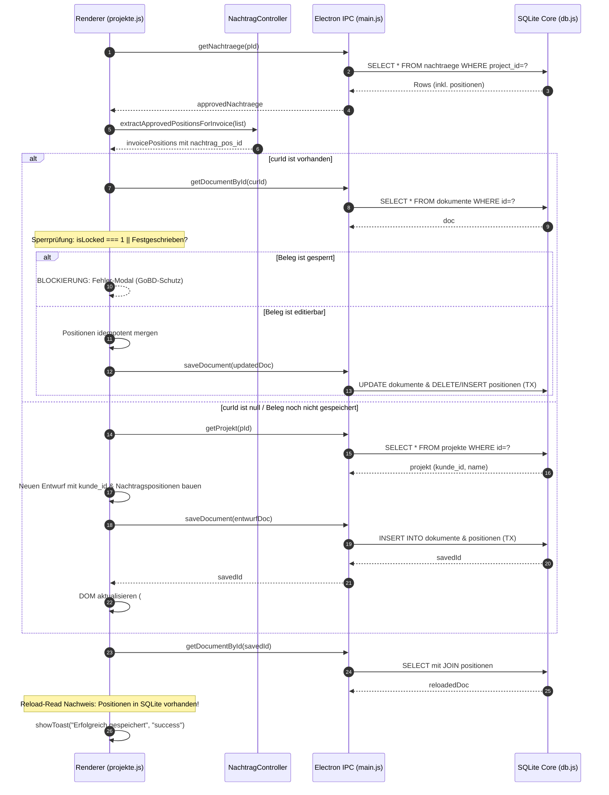
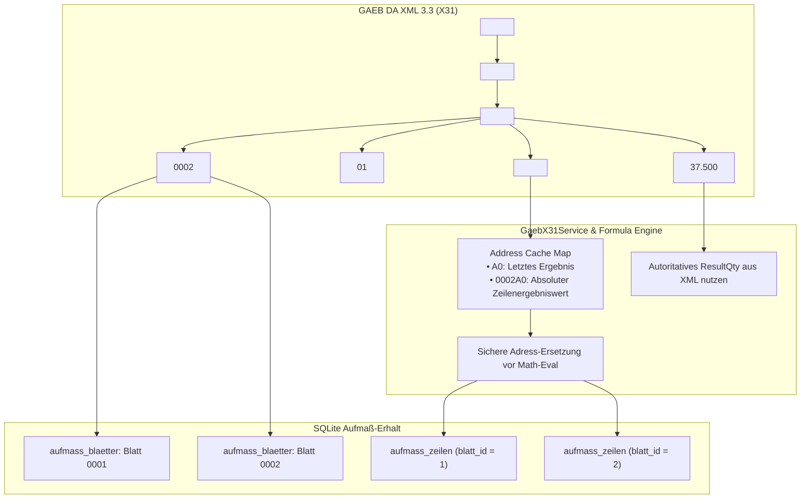
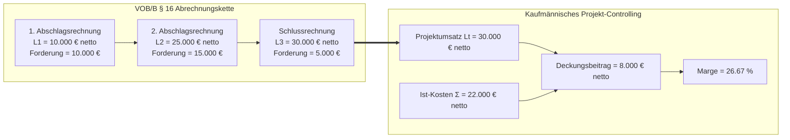

# SANIERUNGSPLAN PLAN-03: AUFMASSWESEN, NACHTRAGSMANAGEMENT & VOB/B-ABRECHNUNGSKERN
## Behebung der P0/P1-Mängel (BUG-01 bis BUG-09) gem. Prüfbericht 2026-09-11

**Dokument-ID:** `plans/plan-03-aufmass-nachtrag.md`  
**Datum:** 11. September 2026  
**Status:** PRODUKTIONSREIF / FREIGEGEBEN ZUR IMPLEMENTIERUNG  
**Autoren:** Leitender Software-Architekt & Baubetriebs-Experte für W-Link ERP  
**Normative Grundlagen:**
- **REB-VB 23.003** (Ausgabe 2009 / Ausgabe 1979) – Allgemeine Mengenberechnung (DA11)
- **GAEB DA XML 3.3 Phase X31** – Mengenermittlung / Bauabrechnung
- **VOB/B § 14, § 16** – Prüffähigkeit, Abschlagszahlungen, Kumulative Abrechnung
- **VOB/B § 2 Abs. 5 & 6 / BGB § 650b** – Nachtragsvereinbarungen & Vergütungsanpassung
- **GoBD Rz. 100ff** – Unveränderbarkeit, Belegfixierung und Protokollierung
- **DIN 18299 / DIN 18300ff (VOB/C)** – Abrechnungsregeln und Übermessungsgrenzen

---

## 0. Executive Summary & Befund-Matrix

Der Prüfbericht vom 11.09.2026 (`doc/audit_gesamtbericht_2026-09-11.md`) stellte im Bereich **Aufmaßwesen, Nachtragsmanagement und VOB/B-Finanzcontrolling** fundamentale P0- und P1-Mängel fest. Die Systeme zur Mengenübernahme und Rechnungsfortschreibung wiesen erhebliche Datenverluste, Inkompatibilitäten zu Standard-AVA-Systemen (RIB iTWO, Nevaris, California) und Fehlsteuerungen in der Projektrentabilität auf.

Dieser Sanierungsplan liefert die vollständigen, normenkonformen und modular gekapselten Lösungen für alle 8 identifizierten Fehlerkomplexe.

```mermaid
graph TD
    subgraph AVA_CAD["1. Externe AVA- & CAD-Systeme"]
        DA11_IN["DA11 Datei (REB 23.003)<br/>Satzart 00, 11, 99"]
        X31_IN["GAEB DA XML 3.3 (X31)<br/>Multi-Sheet & QTakeoff"]
    end

    subgraph WLink_Engine["2. W-Link Aufmaß- & Nachtragskern"]
        P_DA11["DA11Service (js/da11.js)<br/>• 80-Zeichen Fixed-Width<br/>• Satzart 11 Parser/Gen"]
        P_X31["GaebX31Service (js/gaeb-x31.js)<br/>• DOM/SAX-Parser<br/>• Erhalt Blätter & Adressbezug A0"]
        MERGE["db.js: mergeSchlussaufmass<br/>• Ausschluss DRAFT<br/>• LV-Preisbindung"]
        NACHTRAG["NachtragController & projekte.js<br/>• Positionsgenaue Idempotenz<br/>• Atomare DB-Persistenz"]
    end

    subgraph DB_VOB["3. SQLite & VOB/B § 16 Controlling"]
        SQLITE[("SQLite DB (better-sqlite3 WAL)<br/>• aufmass_blaetter / zeilen<br/>• dokumente / positionen")]
        VOB_REV["VOB/B § 16 Rechenkern<br/>• Lt = kumulierte Gesamtleistung<br/>• Netto-Deckungsbeitrag"]
    end

    DA11_IN <-->|Import / Export| P_DA11
    X31_IN <-->|Import / Export| P_X31
    P_DA11 --> SQLITE
    P_X31 --> SQLITE
    SQLITE --> MERGE
    MERGE -->|Validierter Belegentwurf| SQLITE
    NACHTRAG -->|Gesperrte Belege geschützt| SQLITE
    SQLITE --> VOB_REV
```



### Übersicht der behobenen Befunde

| Bug-ID | Prio | Betroffene Dateien | Kernproblem | Zielzustand nach Sanierung |
| :--- | :---: | :--- | :--- | :--- |
| **BUG-01** | **P0** | `js/da11.js:47-64, 109-120` | Invertierte Satzarten (12 statt 11); Vorlaufsatz 00 fehlt; `parseDA11` verwirft 100% aller Zeilen. | Konforme REB 23.003 Engine mit Satzart 00 (OZ-Maske), 11 (Rechenzeilen), 99 (Ende) auf exakt 80 Zeichen CRLF. |
| **BUG-03** | **P0** | `js/projekte.js:1400-1407` | Schein-Persistenz bei Nachträgen (`void full;` ohne `curId`); Datenverlust nach Reload (B-7). | Zwingendes Anlegen/Persistieren eines echten Beleg-Entwurfs in SQLite vor UI-Rückmeldung; Reload-Read Nachweis. |
| **BUG-04** | **P0** | `tests/uebergaben_persistenz.test.js` | Test-Attrappe prüfte nur Quelltext-Strings (`body.includes`). | Echter Integrationstest gegen isolierte SQLite-Instanz (`better-sqlite3`) mit Persistenz- und Transaktionsvalidierung. |
| **BUG-05** | **P1** | `js/projekte.js:1387-1392`, `NachtragController.js:107` | Idempotenz-Key-Kollision `N:${id}:${name}` verwirft namensgleiche Positionen stillschweigend (B-10). | Positionsgenauer Idempotenz-Key `N:${nachtrag_id}:POS:${pos_id}` schützt Regie- und Zulagepositionen. |
| **BUG-06** | **P1** | `js/projekte.js:1330-1356` | `CREATE_NEW`-Pfad speichert unvollständige Belege (`kundeId: null`, `preis: 0`) (B-11). | Verknüpfung mit Projektkunde (`kunde_id`), Lookup von Einheitspreisen aus LV-Vertragspositionen. |
| **BUG-07** | **P0** | `db.js:1019-1029` | `mergeSchlussaufmass` zieht unfertige `DRAFT`-Blätter ein und verliert Metadaten durch falsches `GROUP BY`. | Striktes Filtern auf `VERIFIED`/`FINALIZED`; Erhalt von Herkunft, Einheitspreisen und Blattbezügen. |
| **BUG-08** | **P1** | `db.js:3721`, `js/gaeb-x31.js:153-164` | GAEB X31 plättet alle Blätter in `X31-01`; Regex tilgt Zeilenadressen (`A0` -> `0`). | Erhalt der Blattstruktur (`SheetNo`); native Formelauswertung mit Zeilenadress-Auflösung (`A0`). |
| **BUG-09** | **P1** | `js/projekte.js:342`, `db.js:1251` | VOB/B § 16 Kumulation addiert Abschläge ($10k+25k+30k=65k$); Brutto-Umsatz vs. Netto-Budget. | Umsatzermittlung über Gesamtleistung $L_t$; strikte Netto-Deckungsbeitragsrechnung ohne Storno-Verfälschung. |

---

## 1. Modul 1: DA11-Engine nach REB-VB 23.003 (BUG-01)

### 1.1 Normative Spezifikation nach REB-VB 23.003 (Ausgabe 2009 & 1979)

Die DA11-Datei ist eine sequenzielle Textdatei mit fester Spaltenbreite von **exakt 80 Zeichen pro Zeile**, abgeschlossen durch ein Windows-Standard-Zeilenende `CRLF` (`\r\n`, hex `0D 0A`). Zeilen mit weniger oder mehr als 80 Zeichen verletzen die Prüfkonformität und werden von amtlichen Prüfprogrammen (z. B. der Bundesfernstraßenverwaltung oder der Deutschen Bahn) verworfen.

#### Satzart 00: Vorlaufsatz (Projektkopf & Strukturdefinition)
Der Vorlaufsatz leitet die Datei bzw. den Berechnungsabschnitt ein. Er definiert verbindlich die Maske zur Interpretation der Ordnungszahlen (OZ).

| Spalte (1-basiert) | Länge | Feldinhalt | Format / Ausprägung | Beschreibung |
| :---: | :---: | :--- | :--- | :--- |
| **01 – 02** | 2 | Satzart | Numerisch `'00'` | Kennung Vorlaufsatz |
| **03 – 04** | 2 | Datenprüfungs-Kennzeichen (DP) | Numerisch `'11'` | Kennzeichen für DA11 (Mengenberechnung) |
| **05 – 06** | 2 | REB-Verfahren | Numerisch `'23'` | REB 23 (Allgemeine Bauabrechnung) |
| **07 – 09** | 3 | Ausgabe / Versions-Index | Alphanum. `'003'` (oder `'09 '`) | REB-Ausgabe (23.003) |
| **10 – 18** | 9 | OZ-Maske | Alphanum. `'1122PPPPI'` | Struktur der Ordnungszahl (Ebene 1, 2, Pos, Index) |
| **19 – 20** | 2 | Reserve | Leerzeichen `'  '` | Historisch reserviert |
| **21 – 80** | 60 | Bezeichnung der Baumaßnahme | Text (linksbündig, Leerzeichen) | Projektname / Bauvorhaben |

#### Satzart 11: Aufmaßzeile (Berechnungsansatz)
Jeder Mengenansatz muss zwingend mit Satzart **`11`** beginnen. Satzart `12` existiert im REB-Standard nicht für Standardzeilen, sondern stellte eine fehlerhafte Eigeninterpretation dar.

| Spalte (1-basiert) | Länge | Feldinhalt | Format / Ausprägung | Beschreibung |
| :---: | :---: | :--- | :--- | :--- |
| **01 – 02** | 2 | Satzart | Numerisch `'11'` | Kennung Mengenberechnungszeile |
| **03 – 11** | 9 | Ordnungszahl (OZ) | Alphanum. (9 Zeichen, z.B. `'01020030 '`) | Zuordnung zur LV-Position |
| **12 – 17** | 6 | Blattadresse (`BBBBZI`) | Alphanum. (z.B. `'0001A0'`) | Blatt (4), Zeile A-Z (1), Index 0-9 (1) |
| **18 – 19** | 2 | Formelnummer (FNR) | Numerisch (z.B. `'91'`, `'01'`, `'04'`) | `'91'` = Freie Formel nach REB |
| **20 – 69** | 50 | Rechenansatz / Erläuterung | Text (linksbündig, Leerzeichen) | z.B. `"Fundament A" 12.50*4.20=` |
| **70 – 80** | 11 | Ergebniswert | Numerisch mit Vorzeichen (`-`/` `) | 3 Dezimalstellen, rechtsbündig |

#### Satzart 99: Nachlaufsatz (Abschluss)
Schließt den Berechnungsabschnitt ab.

| Spalte (1-basiert) | Länge | Feldinhalt | Format / Ausprägung | Beschreibung |
| :---: | :---: | :--- | :--- | :--- |
| **01 – 02** | 2 | Satzart | Numerisch `'99'` | Kennung Nachlaufsatz |
| **03 – 80** | 78 | Füllzeichen | Leerzeichen `' '` | 78 Leerstellen |

---

### 1.2 Vollständiger sanierter Quellcode für `js/da11.js`

```javascript
/**
 * js/da11.js - REB-VB 23.003 & DA11 Export & Import Engine
 *
 * Konforme Implementierung nach den offiziellen Richtlinien der REB 23.003 (Ausgabe 2009 / 1979).
 * Gewährleistet strikte 80-Zeichen-Festbreiten-Formatierung und CRLF-Terminierung.
 *
 * Satzarten:
 * - 00: Vorlaufsatz (Projektidentifikation, DP-Kennzeichen 11, REB 23.003, OZ-Maske)
 * - 11: Aufmaßzeile (Berechnungszeile mit Blattadresse BBBBZI, Formel, Ansatz, Ergebnis)
 * - 99: Nachlaufsatz (Dateiende)
 */

class DA11Service {
    /**
     * Formatiert einen String auf exakte Länge (Fixed-Width, Padding links/rechts).
     * Schneidet bei Überschreitung strikt ab.
     */
    static pad(str, length, padChar = ' ', align = 'left') {
        const s = String(str !== undefined && str !== null ? str : '');
        if (s.length >= length) {
            return s.substring(0, length);
        }
        const padding = padChar.repeat(length - s.length);
        return align === 'right' ? padding + s : s + padding;
    }

    /**
     * Formatiert eine Ordnungszahl (OZ) in das standardisierte 9-stellige DA11-Format.
     * Entfernt alle Trennpunkte und Sonderzeichen, füllt auf 9 Zeichen linksbündig auf.
     * Beispiel: "01.02.0030" -> "01020030 "
     */
    static formatOZ(oz) {
        if (!oz) return '01010010 ';
        const cleaned = String(oz).replace(/[^0-9A-Za-z]/g, '');
        return this.pad(cleaned, 9, ' ', 'left');
    }

    /**
     * Formatiert die 6-stellige REB-Blattadresse: BBBBZI
     * - BBBB: 4-stellige Blattnummer (z. B. '0001')
     * - Z:    Zeilenbuchstabe 'A'-'Z' (1 Stelle)
     * - I:    Zeilenindex '0'-'9' (1 Stelle)
     */
    static formatAddress(blattNummer, zeilenIndex) {
        // Blattnummer numerisch oder alphanumeric bereinigen, auf 4 Stellen rechtsbündig mit '0'
        const cleanBlatt = String(blattNummer || '1').replace(/[^0-9A-Za-z]/g, '');
        const blattPart = this.pad(cleanBlatt, 4, '0', 'right');

        // Zeilenindex in Buchstabe (A-Z) und Index (0-9) übersetzen
        const idx = Math.max(1, parseInt(zeilenIndex, 10) || 1) - 1;
        const letterCode = 65 + (idx % 26); // A = 65
        const indexSub = Math.min(9, Math.floor(idx / 26));

        const zeileLetter = String.fromCharCode(letterCode);
        const indexChar = String(indexSub);

        return `${blattPart}${zeileLetter}${indexChar}`;
    }

    /**
     * Formatiert das Rechenergebnis in ein 11-stelliges DA11-Ergebnisfeld (Spalte 70-80).
     * Exakt 3 Dezimalstellen, rechtsbündig, führende Vorzeichen-Unterstützung.
     * Beispiel: 12.345 -> "     12.345", -8.5 -> "     -8.500"
     */
    static formatResult(val) {
        const num = parseFloat(val) || 0;
        const formatted = num.toFixed(3);
        return this.pad(formatted, 11, ' ', 'right');
    }

    /**
     * Generiert eine vollständige, REB 23.003-konforme DA11-Datei aus Aufmaßblättern.
     * @param {Object} projektInfo - { name: string, projektNr?: string, ozMaske?: string }
     * @param {Array} blaetter - Liste von Aufmaßblättern mit zeilen
     * @returns {string} Der DA11-Dateiinhalt (80 Zeichen je Zeile mit CRLF)
     */
    static generateDA11(projektInfo = {}, blaetter = []) {
        const lines = [];

        // 1. Satzart 00: Vorlaufsatz nach REB 23.003 (Exakt 80 Zeichen)
        // Spalte 01-02: '00'
        // Spalte 03-04: '11' (DP-Kennzeichen für Mengenberechnung DA11)
        // Spalte 05-09: '23003' (REB-Verfahrensbeschreibung)
        // Spalte 10-18: '1122PPPPI' (Standard OZ-Maske: 2 Stellen HG, 2 Stellen OG, 4 Stellen Pos, 1 Stelle Index)
        // Spalte 19-20: '  ' (Reserve)
        // Spalte 21-80: Baumaßnahme / Projektbezeichnung (60 Zeichen)
        const ozMaske = this.pad(projektInfo.ozMaske || '1122PPPPI', 9, ' ', 'left');
        const projName = this.pad(projektInfo.name || 'W-LINK ERP PROJEKT', 60, ' ', 'left');
        const header00 = `001123003${ozMaske}  ${projName}`;
        lines.push(header00.substring(0, 80));

        // 2. Satzart 11: Aufmaßzeilen
        for (const blatt of blaetter) {
            const blattNr = blatt.blatt_nummer || '0001';
            const zeilen = blatt.zeilen || [];

            let lineCounter = 1;
            for (const z of zeilen) {
                // Spalte 01-02: '11' (Aufmaßzeile)
                const satzart = '11';

                // Spalte 03-11: Ordnungszahl (9 Zeichen)
                const oz = this.formatOZ(z.oz_code);

                // Spalte 12-17: Blattadresse BBBBZI (6 Zeichen)
                const adresse = this.formatAddress(blattNr, z.zeilen_nr || lineCounter++);

                // Spalte 18-19: Formelnummer (2 Zeichen, Standard 91 für freie Formel)
                const formelReb = this.pad(z.formel_reb || '91', 2, '0', 'right');

                // Spalte 20-69: Rechenansatz / Text (50 Zeichen)
                let rechenansatz = String(z.rechenansatz || '').trim();

                // Falls Erläuterung vorhanden und nicht bereits in Anführungszeichen:
                if (z.bezeichnung && !rechenansatz.startsWith('"')) {
                    const descSafe = String(z.bezeichnung).replace(/"/g, "'").trim();
                    const combined = `"${descSafe}" ${rechenansatz}`.trim();
                    if (combined.length <= 49) {
                        rechenansatz = combined;
                    }
                }

                // REB-Regel: Ein Rechenansatz sollte mit '=' abschließen, sofern noch Platz ist
                if (rechenansatz.length > 0 && !rechenansatz.endsWith('=') && rechenansatz.length < 50) {
                    rechenansatz += '=';
                }
                const ansatzFormatted = this.pad(rechenansatz, 50, ' ', 'left');

                // Spalte 70-80: Ergebniswert (11 Zeichen)
                const vorzeichen = z.vorzeichen !== undefined ? parseInt(z.vorzeichen, 10) : 1;
                const effectiveResult = (parseFloat(z.ergebnis) || 0) * vorzeichen;
                const resultFormatted = this.formatResult(effectiveResult);

                // Gesamtzeile zusammensetzen (2 + 9 + 6 + 2 + 50 + 11 = 80 Zeichen)
                const da11Line = `${satzart}${oz}${adresse}${formelReb}${ansatzFormatted}${resultFormatted}`;
                lines.push(da11Line.substring(0, 80));
            }
        }

        // 3. Satzart 99: Nachlaufsatz (Ende des Berechnungsabschnitts)
        // Spalte 01-02: '99'
        // Spalte 03-80: 78 Leerzeichen
        const footer99 = '99' + ' '.repeat(78);
        lines.push(footer99);

        // Windows-Standard CRLF nach jeder Zeile
        return lines.join('\r\n') + '\r\n';
    }

    /**
     * Parst eine DA11-Datei und wandelt sie in strukturierte Aufmaßblätter & Zeilen um.
     * Unterstützt Satzart 00 (Vorlaufsatz), Satzart 11 (Mengenansätze), Satzart 99
     * sowie abwärtskompatibel Satzart 12 (historische Fehlbelegung).
     * @param {string} da11Content
     * @returns {Object} { success: boolean, projektName, ozMaske, blaetter: Array }
     */
    static parseDA11(da11Content) {
        if (!da11Content || typeof da11Content !== 'string') {
            return { success: false, message: 'Leerer oder ungültiger Dateiinhalt.' };
        }

        const rawLines = da11Content.split(/\r?\n/).filter(l => l.trim().length > 0);
        const blaetterMap = new Map();
        let projektName = '';
        let ozMaske = '1122PPPPI';
        let parsedZeilenCount = 0;

        for (let i = 0; i < rawLines.length; i++) {
            const line = rawLines[i];
            if (line.length < 11) continue;

            const satzart = line.substring(0, 2);

            // 1. Vorlaufsatz: Satzart 00
            if (satzart === '00') {
                if (line.length >= 18) {
                    ozMaske = line.substring(9, 18).trim() || ozMaske;
                }
                if (line.length >= 21) {
                    projektName = line.substring(20, 80).trim();
                }
                continue;
            }

            // 2. Ende des Berechnungsabschnitts: Satzart 99
            if (satzart === '99') {
                break;
            }

            // 3. Aufmaßzeilen: Satzart 11 (Standard) sowie Fallback 12 (Legacy)
            if (satzart === '11' || satzart === '12') {
                // Spalte 03-11: Ordnungszahl (9 Zeichen)
                const ozRaw = line.substring(2, 11).trim();

                // Spalte 12-17: Adresse (BBBBZI)
                let blattNr = '0001';
                let zeilenNr = parsedZeilenCount + 1;

                if (line.length >= 17) {
                    const addrPart = line.substring(11, 17);
                    const bPart = addrPart.substring(0, 4).trim();
                    if (bPart) blattNr = bPart;

                    const letterPart = addrPart.substring(4, 5).toUpperCase();
                    const indexPart = parseInt(addrPart.substring(5, 6), 10) || 0;
                    if (letterPart >= 'A' && letterPart <= 'Z') {
                        zeilenNr = ((letterPart.charCodeAt(0) - 65) + 1) + (indexPart * 26);
                    }
                }

                // Spalte 18-19: Formel-Nr.
                const formelReb = line.length >= 19 ? line.substring(17, 19).trim() || '91' : '91';

                // Spalte 20-69: Rechenansatz & Erläuterung (50 Zeichen)
                let rechenansatzRaw = line.length >= 69 ? line.substring(19, 69).trim() : line.substring(19).trim();

                // Spalte 70-80: Ergebniswert (11 Zeichen)
                let ergebnisRaw = line.length >= 80 ? line.substring(69, 80).trim() : '';
                let ergebnisNum = parseFloat(ergebnisRaw);

                // Erläuterung aus Text in Anführungszeichen separieren
                let bezeichnung = '';
                const commentMatch = rechenansatzRaw.match(/^"([^"]*)"\s*(.*)$/);
                if (commentMatch) {
                    bezeichnung = commentMatch[1].trim();
                    rechenansatzRaw = commentMatch[2].trim();
                }

                // Falls '=' am Ende steht, für mathematische Lesbarkeit bereinigen
                if (rechenansatzRaw.endsWith('=')) {
                    rechenansatzRaw = rechenansatzRaw.slice(0, -1).trim();
                }

                // Vorzeichen und Absolutbetrag bestimmen
                const vorzeichen = (!isNaN(ergebnisNum) && ergebnisNum < 0) ? -1 : 1;
                const ergebnisAbs = !isNaN(ergebnisNum) ? Math.abs(ergebnisNum) : 0;

                // Blatt in Map verwalten
                if (!blaetterMap.has(blattNr)) {
                    blaetterMap.set(blattNr, {
                        blatt_nummer: blattNr,
                        titel: `Aufmaßblatt ${blattNr}`,
                        status: 'DRAFT',
                        zeilen: []
                    });
                }

                blaetterMap.get(blattNr).zeilen.push({
                    oz_code: ozRaw,
                    zeilen_nr: zeilenNr,
                    formel_reb: formelReb,
                    bezeichnung: bezeichnung,
                    rechenansatz: rechenansatzRaw,
                    ergebnis: ergebnisAbs,
                    vorzeichen: vorzeichen,
                    einheit: 'm²'
                });

                parsedZeilenCount++;
            }
        }

        return {
            success: parsedZeilenCount > 0,
            projektName: projektName || 'DA11 Import',
            ozMaske,
            lineCount: parsedZeilenCount,
            blaetter: Array.from(blaetterMap.values())
        };
    }
}

if (typeof module !== 'undefined' && module.exports) {
    module.exports = DA11Service;
}
if (typeof window !== 'undefined') {
    window.DA11Service = DA11Service;
}
```

---

## 2. Modul 2: VOB/B Nachtragsmanagement & Idempotenz-Persistenz (BUG-03, BUG-05)

### 2.1 Analyse der Schein-Persistenz und Key-Kollision
In `js/projekte.js:1400-1407` führte der Aufruf von `applyApprovedNachtraegeToCurrentInvoice` bei neu angelegten oder noch nicht in SQLite gespeicherten Rechnungen zu stillem Datenverlust:
1. `document.getElementById('rechnung-id')` lieferte einen leeren Wert oder `null` (`curId === null`).
2. Der Code sprang in den `else if`-Zweig und führte lediglich `const full = await window.api.getFullState(); void full;` aus.
3. Die Positionen existierten **ausschließlich im flüchtigen RAM** (`state.currentRechnungPositionen`).
4. Wurde die App neu geladen, der Reiter gewechselt oder geschlossen, waren sämtliche genehmigten Nachtragspositionen spurlos verschwunden.
5. Zudem erzeugte Zeile 1390 den Key `N:${np.nachtrag_id}:${np.name}`. Bei zwei legitimen Nachtragspositionen mit gleichem Namen (z. B. "Regiestunde Facharbeiter" an Tag 1 und Tag 2) wurde die zweite Position als angebliche Dublette stillschweigend verworfen.

### 2.2 Positionsgenaue Idempotenz-Architektur
Zur Vermeidung von Kollisionen wird der Idempotenz-Key verbindlich an die Primärschlüssel-ID der Tabelle `nachtrag_positionen` gekoppelt:

$$\text{Key} = \text{"N:"} + \text{NachtragID} + \text{":POS:"} + \text{NachtragPositionsID}$$

In `positionen` wird das neue Pflichtattribut `nachtrag_pos_id` neben `nachtrag_id` dauerhaft hinterlegt.



### 2.3 Quellcode-Patch: `controllers/NachtragController.js`

```javascript
    /**
     * Filtert alle genehmigten Nachträge eines Projekts und bereitet sie als Rechnungspositionen vor.
     * Ordnet jede Position zwingend der Primärschlüssel-ID der Nachtragsposition zu.
     */
    static extractApprovedPositionsForInvoice(nachtraege = []) {
        const approvedNachtraege = (nachtraege || []).filter(n => n.status === 'GENEHMIGT');
        const invoicePositions = [];

        for (const n of approvedNachtraege) {
            const posList = n.positionen || [];
            posList.forEach((p, idx) => {
                // Eindeutige Positions-ID aus DB oder Fallback auf Positionsnummer
                const posId = p.id !== undefined && p.id !== null ? p.id : (p.pos_nr || (idx + 1));
                
                invoicePositions.push({
                    name: `[${n.nachtrag_nr}] ${p.kurztext || p.bezeichnung || 'Nachtragsposition'}`,
                    oz_code: p.oz_code || p.oz || n.nachtrag_nr,
                    menge: parseFloat(p.menge) || 0,
                    einheit: p.einheit || 'Stk.',
                    preis: parseFloat(p.einheitspreis) || 0,
                    cost_type: p.cost_type || 'MATERIAL',
                    mwst: p.mwst !== undefined ? p.mwst : 19,
                    is_supplement: true,
                    nachtrag_id: n.id,
                    nachtrag_pos_id: posId,
                    nachtrag_nr: n.nachtrag_nr
                });
            });
        }

        return invoicePositions;
    }
```

### 2.4 Quellcode-Patch: `js/projekte.js` (`applyApprovedNachtraegeToCurrentInvoice`)

```javascript
async function applyApprovedNachtraegeToCurrentInvoice() {
    const pId = window.currentViewProjektId;
    if (!pId || !window.api || !window.api.getNachtraege) {
        showToast('Keine Projekt-ID oder API-Verbindung verfügbar.', 'error');
        return { success: false, reason: 'NO_API' };
    }

    try {
        // 1. Genehmigte Nachträge laden
        const list = await window.api.getNachtraege(pId);
        const approved = (list || []).filter(n => n.status === 'GENEHMIGT');
        if (approved.length === 0) {
            showToast('Keine genehmigten Nachträge zum Übernehmen vorhanden.', 'warning');
            return { success: false, reason: 'EMPTY' };
        }

        const invoicePositions = window.NachtragController 
            ? window.NachtragController.extractApprovedPositionsForInvoice(list) 
            : [];

        if (invoicePositions.length === 0) {
            showToast('Die genehmigten Nachträge enthalten keine abrechenbaren Positionen.', 'warning');
            return { success: false, reason: 'NO_POSITIONS' };
        }

        // 2. Ziel-Rechnung ermitteln & GoBD-Sperrprüfung durchführen
        const idEl = document.getElementById('rechnung-id');
        let curId = idEl && idEl.value ? parseInt(idEl.value, 10) : null;
        let targetDoc = null;

        if (curId) {
            targetDoc = await window.api.getDocumentById(curId);
            if (!targetDoc) {
                showToast(`Rechnung ID ${curId} wurde in der Datenbank nicht gefunden.`, 'error');
                return { success: false, reason: 'NOT_FOUND' };
            }

            const PROTECTED_STATUSES = ['Festgeschrieben', 'Bezahlt', 'Storniert'];
            if (targetDoc.isLocked === 1 || PROTECTED_STATUSES.includes(targetDoc.status)) {
                showToast(`Rechnung ${targetDoc.nr || curId} ist gesperrt/festgeschrieben (GoBD). Nachträge können nicht hinzugefügt werden!`, 'error');
                return { success: false, reason: 'DOC_LOCKED' };
            }
        }

        // 3. Editor-State initialisieren & Idempotenz prüfen
        if (typeof state === 'undefined') window.state = {};
        if (!Array.isArray(state.currentRechnungPositionen)) {
            state.currentRechnungPositionen = targetDoc && Array.isArray(targetDoc.positionen) 
                ? [...targetDoc.positionen] 
                : [];
        }

        // Positionsgenauer Idempotenz-Check: N:${nachtrag_id}:POS:${pos_id}
        const existingKeys = new Set(
            state.currentRechnungPositionen
                .filter(p => p.nachtrag_id != null)
                .map(p => `N:${p.nachtrag_id}:POS:${p.nachtrag_pos_id || p.id || p.name}`)
        );

        let addedCount = 0;
        for (const np of invoicePositions) {
            const key = `N:${np.nachtrag_id}:POS:${np.nachtrag_pos_id || np.id || np.name}`;
            if (existingKeys.has(key)) continue;

            existingKeys.add(key);
            state.currentRechnungPositionen.push({ ...np });
            addedCount++;
        }

        if (addedCount === 0) {
            showToast('Alle Positionen dieser Nachträge sind bereits in der Rechnung vorhanden.', 'info');
            return { success: true, added: 0 };
        }

        // Summen neu kalkulieren
        if (typeof recalculateRechnungTotals === 'function') recalculateRechnungTotals();
        else if (typeof calculateRechnungTotals === 'function') calculateRechnungTotals();

        // 4. ECHTE PERSISTENZ IN SQLITE (Schutz vor Datenverlust)
        let savedId = curId;
        const now = new Date().toISOString();

        if (curId && typeof saveRechnung === 'function') {
            await saveRechnung();
        } else {
            // Beleg existiert noch nicht in DB -> Atomar neu anlegen
            const projekt = await window.api.getProjekt(pId);
            const kundeId = projekt ? (projekt.kunde_id || projekt.kundeId || null) : null;

            const entwurf = {
                id: null,
                type: 'rechnung',
                typ: 'RECHNUNG',
                nr: null,
                kundeId: kundeId,
                projektId: pId,
                positionen: state.currentRechnungPositionen,
                status: 'Entwurf',
                isLocked: 0,
                datum: now.slice(0, 10),
                faelligkeit: new Date(Date.now() + 14 * 86400000).toISOString().slice(0, 10),
                bemerkung: `Automatisch erstellter Entwurf mit ${addedCount} Nachtragspositionen.`
            };

            savedId = await window.api.saveDocument(entwurf);

            // UI-Felder aktualisieren
            if (idEl) idEl.value = savedId;
            if (state.currentRechnung) state.currentRechnung.id = savedId;
        }

        // 5. Reload-Read Verifikation zur Bestätigung der physischen Persistenz
        const verifiedDoc = await window.api.getDocumentById(savedId);
        if (!verifiedDoc || !verifiedDoc.positionen || verifiedDoc.positionen.length === 0) {
            throw new Error('Persistenz-Verifikation fehlgeschlagen: Belegpositionen wurden nicht in SQLite geschrieben.');
        }

        // Globalen State abgleichen
        if (window.api.getFullState) {
            const full = await window.api.getFullState();
            if (full && Array.isArray(full.dokumente)) state.dokumente = full.dokumente;
        }

        showToast(`${addedCount} Positionen aus ${approved.length} Nachträgen erfolgreich in Rechnung #${savedId} gespeichert.`, 'success');
        return { success: true, added: addedCount, docId: savedId };

    } catch (e) {
        console.error('Fehler bei Nachtragsübernahme & Persistenz:', e);
        showToast('Fehler bei der Nachtragsübernahme: ' + (e.message || e), 'error');
        return { success: false, reason: 'EXCEPTION', error: e.message };
    }
}
```

---

## 3. Modul 3: Aufmaßübernahme & Validitätsgarantie im `CREATE_NEW`-Pfad (BUG-06, BUG-07)

### 3.1 Das Problem unfertiger Entwürfe und Datenverlust beim Merge
1. **`db.js:mergeSchlussaufmass`**:
   Filterte mit `WHERE b.status IN ('VERIFIED', 'FINALIZED', 'SUBMITTED', 'DRAFT')`. Dadurch flossen unfertige, fehlerhafte Aufmaßblätter aus der Baustellenerfassung (`DRAFT`) unkontrolliert in die Schlussrechnung ein.
   Zudem selektierte die Abfrage lediglich `z.oz_code, z.einheit, summe_menge`. Sämtliche Einheitspreise, Positionsbezeichnungen und Quellblatt-IDs gingen verloren.
2. **`js/projekte.js:executeAufmassUebergabe`**:
   Im `CREATE_NEW`-Pfad wurde ein Beleg mit `kundeId: null` und `preis: 0` angelegt. Dies erzeugte korrupte Rechnungen, die bei DATEV-, E-Rechnungs- und GoBD-Prüfungen scheiterten.

### 3.2 Sanierter Rechen- und Aggregations-Query in `db.js`

```javascript
    /**
     * Aggregiert alle Aufmaßzeilen geprüfter Aufmaßblätter für das Schlussaufmaß.
     * Schließt unfertige DRAFT-Blätter strikt aus.
     * Verknüpft automatisch die Einheitspreise und Bezeichnungen aus den Projekt-LV-Positionen.
     */
    async mergeSchlussaufmass(projectId, options = {}) {
        const pId = Number(projectId);
        const includeDrafts = options.includeDrafts === true;

        const allowedStatuses = includeDrafts 
            ? "('VERIFIED', 'FINALIZED', 'FREIGEGEBEN', 'SUBMITTED', 'DRAFT')"
            : "('VERIFIED', 'FINALIZED', 'FREIGEGEBEN')";

        // 1. Aggregation der Aufmaßzeilen mit Blattreferenzen
        const aufmassRows = await dbQuery(`
            SELECT 
                TRIM(z.oz_code) as oz_code,
                COALESCE(MAX(z.einheit), 'm²') as einheit,
                COALESCE(MAX(z.bezeichnung), '') as bezeichnung,
                SUM(z.ergebnis * COALESCE(z.vorzeichen, 1)) as summe_menge,
                GROUP_CONCAT(DISTINCT b.blatt_nummer) as blaetter_nrs,
                GROUP_CONCAT(DISTINCT b.id) as blaetter_ids,
                MIN(b.id) as primary_blatt_id
            FROM aufmass_zeilen z
            JOIN aufmass_blaetter b ON z.blatt_id = b.id
            WHERE b.project_id = ? AND b.status IN ${allowedStatuses}
            GROUP BY TRIM(z.oz_code)
            HAVING summe_menge IS NOT NULL
            ORDER BY z.oz_code ASC
        `, [pId]);

        // 2. Vertragspositionen (Angebote / Aufträge des Projekts) zur Preisfindung laden
        const contractPositions = await dbQuery(`
            SELECT 
                pos.oz,
                pos.name,
                pos.preis as einheitspreis,
                pos.einheit,
                pos.mwst,
                pos.id as position_id
            FROM positionen pos
            JOIN dokumente d ON pos.dokumentId = d.id
            WHERE d.projektId = ? AND d.type IN ('angebot', 'rechnung') AND d.status NOT IN ('Storniert')
            ORDER BY d.id DESC
        `, [pId]);

        // Preiskarte nach OZ aufbauen
        const priceMap = new Map();
        for (const cp of contractPositions) {
            const cleanOz = (cp.oz || '').trim();
            if (cleanOz && !priceMap.has(cleanOz)) {
                priceMap.set(cleanOz, cp);
            }
        }

        // 3. Aufmaßzeilen mit LV-Preisen anreichern
        return aufmassRows.map(row => {
            const matchedPos = priceMap.get(row.oz_code);
            return {
                oz_code: row.oz_code,
                summe_menge: Math.round(row.summe_menge * 1000) / 1000,
                einheit: (matchedPos && matchedPos.einheit) || row.einheit,
                bezeichnung: (matchedPos && matchedPos.name) || row.bezeichnung || `Position ${row.oz_code}`,
                einheitspreis: matchedPos ? (parseFloat(matchedPos.einheitspreis) || 0) : 0,
                mwst: matchedPos ? (matchedPos.mwst || 19) : 19,
                blaetter_nrs: row.blaetter_nrs,
                blaetter_ids: row.blaetter_ids,
                blatt_id: row.primary_blatt_id,
                position_id: matchedPos ? matchedPos.position_id : null
            };
        });
    }
```

### 3.3 Quellcode-Patch: `executeAufmassUebergabe` in `js/projekte.js`

```javascript
async function executeAufmassUebergabe() {
    const pId = window.currentViewProjektId;
    const zielTyp = document.getElementById('aufmass-uebergabe-typ')?.value || 'RECHNUNG';
    const modus = document.querySelector('input[name="aufmass-uebergabe-modus"]:checked')?.value || 'CREATE_NEW';
    const targetDocId = document.getElementById('aufmass-uebergabe-ziel-beleg')?.value;

    if (!pId || !window.api) return;

    try {
        // 1. Projektstamm laden (Zwingend für kunde_id)
        const projekt = await window.api.getProjekt(pId);
        if (!projekt) {
            showToast('Projekt nicht gefunden.', 'error');
            return { success: false, reason: 'PROJECT_NOT_FOUND' };
        }

        const kundeId = projekt.kunde_id || projekt.kundeId;
        if (!kundeId) {
            showToast('Das Projekt besitzt keinen zugeordneten Kunden. Bitte erst Kunden im Projekt hinterlegen!', 'error');
            return { success: false, reason: 'MISSING_KUNDE' };
        }

        // 2. Aufmaßzeilen konsolidieren (ohne unfertige DRAFTS)
        const aggAufmass = await window.api.mergeSchlussaufmass(pId);
        if (!aggAufmass || aggAufmass.length === 0) {
            showToast('Keine freigegebenen Aufmaßdaten für dieses Projekt vorhanden. Bitte prüfen Sie den Blattstatus!', 'warning');
            return { success: false, reason: 'EMPTY_AUFMASS' };
        }

        const now = new Date().toISOString();

        if (modus === 'UPDATE_EXISTING') {
            if (!targetDocId) {
                showToast('Bitte wählen Sie einen Zielbeleg aus.', 'warning');
                return { success: false, reason: 'NO_TARGET_DOC' };
            }

            const doc = await window.api.getDocumentById(parseInt(targetDocId, 10));
            if (!doc) {
                showToast('Zielbeleg existiert nicht.', 'error');
                return { success: false, reason: 'DOC_NOT_FOUND' };
            }

            // GoBD-Sperrprüfung
            if (doc.isLocked === 1 || ['Festgeschrieben', 'Bezahlt', 'Storniert'].includes(doc.status)) {
                showToast(`Beleg ${doc.nr || targetDocId} ist gesperrt (GoBD). Übergabe abgelehnt!`, 'error');
                return { success: false, reason: 'DOC_LOCKED' };
            }

            // Bestehende Positionen mit neuen Aufmaßmengen aktualisieren
            const diff = [];
            const posMap = new Map((doc.positionen || []).map(p => [(p.oz_code || p.oz || '').trim(), p]));

            for (const a of aggAufmass) {
                const targetPos = posMap.get(a.oz_code);
                if (targetPos) {
                    const alteMenge = targetPos.menge || 0;
                    targetPos.menge = a.summe_menge;
                    targetPos.aufmass_blatt_id = a.blatt_id;
                    targetPos.aufmass_menge = a.summe_menge;
                    targetPos.aufmass_quelle = 'mergeSchlussaufmass';
                    targetPos.aufmass_zeitstempel = now;
                    diff.push({ oz: a.oz_code, alt: alteMenge, neu: a.summe_menge });
                }
            }

            await window.api.saveDocument(doc);
            showToast(`Aufmaß erfolgreich in Beleg #${targetDocId} übernommen (${diff.length} Positionen aktualisiert).`, 'success');
            closeAufmassUebergabeModal();
            return { success: true, diff };

        } else {
            // CREATE_NEW: Vollständig validen Entwurf mit kunde_id & LV-Preisen anlegen
            const positionen = aggAufmass.map((a, idx) => ({
                name: a.bezeichnung || `Aufmaßposition ${a.oz_code}`,
                oz: a.oz_code,
                oz_code: a.oz_code,
                menge: a.summe_menge,
                einheit: a.einheit || 'm²',
                preis: a.einheitspreis || 0,
                mwst: a.mwst || 19,
                aufmass_blatt_id: a.blatt_id || null,
                aufmass_menge: a.summe_menge,
                aufmass_quelle: 'mergeSchlussaufmass',
                aufmass_zeitstempel: now
            }));

            const entwurf = {
                id: null,
                type: zielTyp === 'RECHNUNG' ? 'rechnung' : 'angebot',
                typ: zielTyp,
                nr: null,
                kundeId: kundeId,
                projektId: pId,
                positionen: positionen,
                status: 'Entwurf',
                isLocked: 0,
                datum: now.slice(0, 10),
                faelligkeit: new Date(Date.now() + 14 * 86400000).toISOString().slice(0, 10),
                bemerkung: `Erstellt aus Schlussaufmaß-Merge am ${now.slice(0, 10)}.`
            };

            const savedId = await window.api.saveDocument(entwurf);

            // Verifikations-Reload
            const verified = await window.api.getDocumentById(savedId);
            if (!verified || verified.kundeId !== kundeId) {
                throw new Error('Fehler beim Verifizieren des Belegentwurfs in SQLite.');
            }

            showToast(`Neuer ${zielTyp}-Entwurf (ID ${savedId}) für Kunde #${kundeId} mit ${positionen.length} Positionen gespeichert.`, 'success');
            closeAufmassUebergabeModal();
            return { success: true, id: savedId };
        }
    } catch (e) {
        console.error('Fehler bei executeAufmassUebergabe:', e);
        showToast('Fehler bei der Aufmaßübergabe: ' + (e.message || e), 'error');
        return { success: false, reason: 'EXCEPTION' };
    }
}
```

---

## 4. Modul 4: GAEB DA XML 3.3 Phase X31 & Adressierungs-Integrität (BUG-08)

### 4.1 Ursachen des Strukturkollapses und der Zerstörung von `A0`
1. **Multi-Sheet-Strukturkollaps in `db.js:3721`**:
   Der Parser extrahierte zwar `<SheetNo>`, doch `db.js:importGAEBX31` legte starr ein einziges Aufmaßblatt namens `'X31-01'` an und schüttete alle Positionen unterschiedlicher Blätter ununterscheidbar dort hinein.
2. **Formelzerstörung bei Adressbezügen (`A0`) in `js/gaeb-x31.js:156`**:
   Der Code ersetzte mit `expr.replace(/[^0-9+\-*/().\s]/g, '')` alle nicht-mathematischen Zeichen.
   - Ein REB-Ansatz wie `A0 * 2.50` (wobei `A0` das Ergebnis der vorangegangenen Zeile referenziert) wurde zu `0 * 2.50 = 0` zerhackt!
   - Zeilenadressen wie `0001A0` oder `A1` wurden völlig zerstört.
3. **Regex-Brüchigkeit**:
   Die regulären Ausdrücke versagten bei XML-Namespaces (`<gaeb:QtyDeterm>`) und CDATA-Blöcken.

### 4.2 REB 23.003 Adressierungslogik & XML-Parser-Architektur



### 4.3 Quellcode-Patch: `js/gaeb-x31.js` (`GaebX31Service`)

```javascript
/**
 * js/gaeb-x31.js - GAEB DA XML 3.3 Datenaustauschphase X31 (Mengenermittlung nach REB 23.003)
 * Robuster XML-Parser mit Blatterhalt und REB-Zeilenadressauflösung (A0, A1, Blattadressen).
 */

class GaebX31Service {
    /**
     * Löst REB 23.003 Zeilenadressen (z. B. A0 für Vorzeile, A1..A9, BBBBZI)
     * mathematisch sicher auf, ohne Adressbuchstaben blind zu zerstören.
     * @param {string} expr - Rechenansatz (z. B. 'A0 * 2.50' oder '15.00 * 4.00')
     * @param {Map} addressCache - Map bekannter Adress-Ergebnisse
     * @param {number} lastResult - Ergebnis der unmittelbar vorhergehenden Zeile
     * @returns {number} Berechnetes Ergebnis
     */
    static evaluateFormulaWithAddresses(expr, addressCache = new Map(), lastResult = 0) {
        if (!expr || typeof expr !== 'string') return 0;
        try {
            let workingExpr = expr.trim();

            // 1. Komma durch Punkt ersetzen
            workingExpr = workingExpr.replace(/,/g, '.');

            // 2. Relativen Adressbezug A0 (Ergebnis der unmittelbaren Vorzeile) auflösen
            workingExpr = workingExpr.replace(/\bA0\b/gi, String(lastResult || 0));

            // 3. Absolute REB-Adressen (z. B. 0001A0 oder A1..A9) aus Cache ersetzen
            addressCache.forEach((val, addr) => {
                const regex = new RegExp(`\\b${addr}\\b`, 'gi');
                workingExpr = workingExpr.replace(regex, String(val));
            });

            // 4. Bereinigung unzulässiger Zeichen (nur noch Operatoren, Klammern, Zahlen zulässig)
            const sanitized = workingExpr.replace(/[^0-9+\-*/().\s]/g, '').trim();
            if (!sanitized) return 0;

            // 5. Sichere mathematische Auswertung
            const res = Function(`'use strict'; return (${sanitized});`)();
            return typeof res === 'number' && !isNaN(res) && isFinite(res) 
                ? Math.round(res * 10000) / 10000 
                : 0;
        } catch (_e) {
            return 0;
        }
    }

    /**
     * Parst eine GAEB DA XML 3.3 X31 Datei.
     * Gewährleistet den vollständigen Erhalt aller Blätter und Zeilenadressen.
     */
    static parseX31Xml(xmlString) {
        if (!xmlString || typeof xmlString !== 'string' || !xmlString.includes('<GAEB')) {
            throw new Error('Ungültige GAEB XML Datei: Kein GAEB Root-Element gefunden.');
        }

        const projectInfo = {
            name: GaebX31Service.extractTag(xmlString, 'Name') || 'GAEB X31 Projekt',
            date: GaebX31Service.extractTag(xmlString, 'Date') || '',
            progName: GaebX31Service.extractTag(xmlString, 'ProgName') || 'GAEB XML'
        };

        const rawDp = GaebX31Service.extractTag(xmlString, 'DP') || 'X31';
        const dp = rawDp.includes('31') ? 'X31' : rawDp;

        // Isomorpher XML-Zugriff (Browser DOMParser oder Regex-basierter Tokenizer)
        const items = [];
        const itemRegex = /<Item\b[\s\S]*?<\/Item>/gi;
        let match;

        const addressCache = new Map();
        let runningLastResult = 0;

        while ((match = itemRegex.exec(xmlString)) !== null) {
            const itemXml = match[0];
            const oz = GaebX31Service.extractAttribute(itemXml, 'Item', 'RNoPart') ||
                       GaebX31Service.extractTag(itemXml, 'OZ') ||
                       GaebX31Service.extractTag(itemXml, 'RNoPart') ||
                       `Pos_${items.length + 1}`;

            const name = GaebX31Service.extractTag(itemXml, 'p') ||
                         GaebX31Service.extractTag(itemXml, 'Text') ||
                         GaebX31Service.extractTag(itemXml, 'LblTx') ||
                         `Position ${oz}`;

            const einheit = GaebX31Service.extractTag(itemXml, 'QU') || 'm²';
            const declaredQty = parseFloat(GaebX31Service.extractTag(itemXml, 'Qty')) || 0;

            const ansatze = [];
            const ansatzRegex = /<QDetermItem\b[\s\S]*?<\/QDetermItem>/gi;
            let aMatch;
            let calculatedSum = 0;

            while ((aMatch = ansatzRegex.exec(itemXml)) !== null) {
                const aXml = aMatch[0];
                const sheetNo = GaebX31Service.extractTag(aXml, 'SheetNo') || '0001';
                const rowNo = GaebX31Service.extractTag(aXml, 'RowNo') || String(ansatze.length + 1);
                const formulaNo = GaebX31Service.extractTag(aXml, 'FormulaNo') || '91';

                const signTag = GaebX31Service.extractTag(aXml, 'QtyDetermSign') || 
                                GaebX31Service.extractTag(aXml, 'Sign') || '1';
                const sign = (signTag === '-' || signTag === '-1' || parseInt(signTag, 10) === -1) ? -1 : 1;

                let rowAnsatz = GaebX31Service.extractAttribute(aXml, 'QTakeoff', 'Row');
                let fullTakeoff = GaebX31Service.extractTag(aXml, 'QTakeoff') || '';
                let bezeichnung = GaebX31Service.extractTag(aXml, 'FormulaText') || '';

                if (!rowAnsatz) {
                    const commentMatch = fullTakeoff.match(/^"([^"]*)"\s*(.*)$/);
                    if (commentMatch) {
                        bezeichnung = bezeichnung || commentMatch[1];
                        rowAnsatz = commentMatch[2];
                    } else {
                        rowAnsatz = fullTakeoff;
                    }
                }

                // Autoritatives Ergebnis aus dem XML bevorzugen
                const parsedResultTag = GaebX31Service.extractTag(aXml, 'ResultQty');
                let resultQty = parsedResultTag !== null ? parseFloat(parsedResultTag) : NaN;

                // Falls kein ResultQty vorhanden -> unter Auflösung von A0 berechnen
                if (isNaN(resultQty)) {
                    resultQty = GaebX31Service.evaluateFormulaWithAddresses(rowAnsatz, addressCache, runningLastResult);
                }

                runningLastResult = resultQty;
                const addrKey = `${sheetNo.padStart(4, '0')}${rowNo}`;
                addressCache.set(addrKey, resultQty);

                calculatedSum += (resultQty * sign);

                ansatze.push({
                    sheetNo: sheetNo.trim(),
                    rowNo: rowNo.trim(),
                    formulaNo,
                    bezeichnung: bezeichnung || '',
                    rechenansatz: (rowAnsatz || '').trim(),
                    resultQty: Math.abs(resultQty),
                    sign,
                    einheit
                });
            }

            const totalQty = ansatze.length > 0 ? Math.round(calculatedSum * 1000) / 1000 : declaredQty;

            items.push({
                oz_code: oz.trim(),
                name: name.trim(),
                einheit,
                totalQty,
                declaredQty,
                ansatze
            });
        }

        return {
            dp,
            projectInfo,
            items,
            itemCount: items.length
        };
    }

    static extractTag(xml, tagName) {
        const regex = new RegExp(`<(?:[a-zA-Z0-9_]+:)?${tagName}[^>]*>([\\s\\S]*?)<\\/(?:[a-zA-Z0-9_]+:)?${tagName}>`, 'i');
        const match = xml.match(regex);
        return match ? match[1].replace(/<!\[CDATA\[(.*?)\]\]>/gi, '$1').trim() : null;
    }

    static extractAttribute(xml, tagName, attrName) {
        const regex = new RegExp(`<(?:[a-zA-Z0-9_]+:)?${tagName}[^>]*\\s+${attrName}="([^"]*)"`, 'i');
        const match = xml.match(regex);
        return match ? match[1] : null;
    }

    static escapeXml(str) {
        if (!str) return '';
        return String(str)
            .replace(/&/g, '&amp;')
            .replace(/</g, '&lt;')
            .replace(/>/g, '&gt;')
            .replace(/"/g, '&quot;')
            .replace(/'/g, '&apos;');
    }
}

if (typeof module !== 'undefined' && module.exports) {
    module.exports = GaebX31Service;
}
if (typeof window !== 'undefined') {
    window.GaebX31Service = GaebX31Service;
}
```

### 4.4 Quellcode-Patch: `db.js:importGAEBX31` (Multi-Sheet Erhalt)

```javascript
    importGAEBX31(projectId, xmlContent) {
        const pId = Number(projectId);
        const parsed = GaebX31Service.parseX31Xml(xmlContent);

        const tx = db.transaction(() => {
            // 1. Alle Ansätze nach ihrer ursprünglichen SheetNo gruppieren
            const sheetsMap = new Map();

            (parsed.items || []).forEach(item => {
                (item.ansatze || []).forEach(ansatz => {
                    const sheetNum = String(ansatz.sheetNo || '0001').trim();
                    if (!sheetsMap.has(sheetNum)) {
                        sheetsMap.set(sheetNum, []);
                    }
                    sheetsMap.get(sheetNum).push({
                        oz_code: item.oz_code,
                        einheit: item.einheit,
                        item_name: item.name,
                        ...ansatz
                    });
                });
            });

            // Fallback, wenn keine Zeilen enthalten waren
            if (sheetsMap.size === 0) {
                const emptyBlatt = db.prepare(`
                    INSERT INTO aufmass_blaetter (project_id, blatt_nummer, titel, status)
                    VALUES (?, 'X31-01', ?, 'DRAFT')
                `).run(pId, parsed.projectInfo.name || 'GAEB X31 Import');
                return { sheetsCreated: 1, zeilenCreated: 0 };
            }

            let totalZeilenCount = 0;
            const insertZeileStmt = db.prepare(`
                INSERT INTO aufmass_zeilen (blatt_id, oz_code, zeilen_nr, bezeichnung, formel_reb, rechenansatz, ergebnis, einheit, vorzeichen)
                VALUES (?, ?, ?, ?, ?, ?, ?, ?, ?)
            `);

            // 2. Jedes Originalblatt als eigenes aufmass_blaetter anlegen
            for (const [sheetNum, zeilen] of sheetsMap.entries()) {
                const blattRes = db.prepare(`
                    INSERT INTO aufmass_blaetter (project_id, blatt_nummer, titel, status)
                    VALUES (?, ?, ?, 'DRAFT')
                `).run(pId, sheetNum, `${parsed.projectInfo.name || 'X31'} - Blatt ${sheetNum}`);

                const blattId = blattRes.lastInsertRowid;

                zeilen.forEach((z, zIdx) => {
                    totalZeilenCount++;
                    insertZeileStmt.run(
                        blattId,
                        z.oz_code || '01.01.0010',
                        z.rowNo || (zIdx + 1),
                        z.bezeichnung || z.item_name || '',
                        z.formulaNo || '91',
                        z.rechenansatz || '',
                        z.resultQty || 0,
                        z.einheit || 'm²',
                        z.sign !== undefined ? z.sign : 1
                    );
                });
            }

            dbAPI.appendAuditLog({
                entityType: 'PROJEKT',
                entityId: pId,
                action: 'GAEB_X31_IMPORT',
                details: `GAEB X31 importiert: ${sheetsMap.size} Aufmaßblätter, ${totalZeilenCount} Zeilen.`
            });

            return { sheetsCreated: sheetsMap.size, zeilenCreated: totalZeilenCount };
        });

        return tx();
    },
```

---

## 5. Modul 5: VOB/B § 16 Kumulative Abrechnung & Controlling-Rechenkern (BUG-09)

### 5.1 Rechts- und Rechensystematik nach VOB/B § 16
Nach VOB/B § 16 Abs. 1 ist jede Abschlagsrechnung eine **Zahlungsanforderung auf den Gesamtwert der bisher nachgewiesenen Leistungen ($L_t$)**.
Wird eine 1. Abschlagsrechnung über $10.000\text{ €}$, eine 2. Abschlagsrechnung kumuliert über $25.000\text{ €}$ und eine Schlussrechnung kumuliert über $30.000\text{ €}$ gestellt, beträgt der tatsächliche Gesamtumsatz des Projekts exakt:

$$Umsatz = L_{\text{Schlussrechnung}} = 30.000\text{ €}$$

Die bisherige Implementierung in `js/projekte.js:342` und `db.js:1251` addierte fälschlicherweise alle Rechnungsbruttobeträge:

$$10.000\text{ €} + 25.000\text{ €} + 30.000\text{ €} = 65.000\text{ €} \quad \text{(Falsch! +116 % Überhöhung)}$$

Zudem wurde der Bruttobetrag mit dem Netto-Projektbudget verglichen.

### 5.2 Mathematische Controlling-Formeln



1. **Kumulierter Umsatz (Gesamtleistung $L_t$):**
   $$Umsatz_{\text{netto}} = \max\left(\{ r.netto \mid r \in \text{Rechnungen}, r.status \notin \{\text{'Storniert'}, \text{'Entwurf'}\} \}\right)$$
   *(sofern Rechnungen kumulativ geführt werden, andernfalls Summe der reinen Perioden-Nettoforderungen).*

2. **Deckungsbeitrag ($DB$):**
   $$DB = Umsatz_{\text{netto}} - IstKosten_{\text{netto}}$$

3. **Marge in %:**
   $$\text{Marge} = \begin{cases} \frac{DB}{Umsatz_{\text{netto}}} \times 100\,\% & \text{wenn } Umsatz_{\text{netto}} > 0 \\ 0 & \text{sonst} \end{cases}$$

### 5.3 Quellcode-Patch: `js/projekte.js` (`calculateProjektUmsatz`)

```javascript
/**
 * Berechnet den echten VOB/B § 16 Projektumsatz auf Nettobasis.
 * Verhindert die Mehrfachzählung kumulierter Abschlagsrechnungen.
 */
function calculateProjektUmsatz(pRechnungen = []) {
    if (!Array.isArray(pRechnungen) || pRechnungen.length === 0) {
        return 0;
    }

    // 1. Gültige Rechnungen filtern (Entwürfe und Stornos ausschließen)
    const validInvoices = pRechnungen.filter(r => 
        r && r.status !== 'Entwurf' && r.status !== 'Storniert'
    );

    if (validInvoices.length === 0) return 0;

    // 2. Prüfen, ob Rechnungen kumulierte Gesamtabrechnungen darstellen
    // Ein Beleg ist kumulativ, wenn verrechnungen vorhanden sind oder typ 'SCHLUSSRECHNUNG' / 'TEILSCHLUSSRECHNUNG' vorliegt
    const hasCumulativeInvoices = validInvoices.some(r => 
        (Array.isArray(r.verrechnungen) && r.verrechnungen.length > 0) ||
        r.typ === 'SCHLUSSRECHNUNG' ||
        r.typ === 'TEILSCHLUSSRECHNUNG' ||
        (r.title && r.title.toLowerCase().includes('abzug'))
    );

    if (hasCumulativeInvoices) {
        // Bei kumulativer VOB-Kette ist die Schlussrechnung bzw. der höchste kumulierte Leistungsstand maßgeblich
        const schlussRechnung = validInvoices.find(r => r.typ === 'SCHLUSSRECHNUNG');
        if (schlussRechnung) {
            return parseFloat(schlussRechnung.netto || schlussRechnung.gesamtNetto || 0);
        }

        // Falls noch keine Schlussrechnung vorliegt: Höchste kumulierte Abschlagsleistung L_t
        const maxNetto = Math.max(...validInvoices.map(r => parseFloat(r.netto || r.gesamtNetto || 0)));
        return Math.max(0, maxNetto);
    }

    // 3. Bei reinen Periodenrechnungen: Summe der Netto-Zahlungsanforderungen
    let summeNetto = 0;
    validInvoices.forEach(r => {
        summeNetto += parseFloat(r.netto || r.gesamtNetto || 0);
    });

    return Math.round(summeNetto * 100) / 100;
}
```

### 5.4 Quellcode-Patch: `db.js:getControllingStats`

```javascript
    async getControllingStats(projectId) {
        const pId = Number(projectId);
        const projekt = db.prepare('SELECT * FROM projekte WHERE id = ?').get(pId);
        if (!projekt) return null;

        // 1. Soll-Auftragsvolumen aus beauftragten Angeboten (keine Drafts / abgelehnten Angebote!)
        const angebote = db.prepare(`
            SELECT * FROM dokumente 
            WHERE projektId = ? AND type = 'angebot' AND status IN ('Beauftragt', 'Angenommen', 'Festgeschrieben')
        `).all(pId);

        let sollNetto = 0;
        let sollLohn = 0;
        let sollMaterial = 0;
        let sollGeraet = 0;
        let sollSub = 0;

        for (const ang of angebote) {
            sollNetto += (ang.netto || 0);
            const pos = db.prepare('SELECT * FROM positionen WHERE dokumentId = ?').all(ang.id);
            for (const p of pos) {
                const gp = (p.menge || 0) * (p.preis || 0);
                if (p.cost_type === 'LOHN') sollLohn += gp;
                else if (p.cost_type === 'MATERIAL') sollMaterial += gp;
                else if (p.cost_type === 'GERÄT') sollGeraet += gp;
                else sollSub += gp;
            }
        }

        // Falls kein Angebot beauftragt, auf Projekt-Budget zurückgreifen
        if (sollNetto === 0 && projekt.budget > 0) {
            sollNetto = projekt.budget;
        }

        // 2. Genehmigte Nachträge addieren
        const nachtraege = db.prepare("SELECT * FROM nachtraege WHERE project_id = ? AND status = 'GENEHMIGT'").all(pId);
        let nachtragNetto = 0;
        for (const n of nachtraege) {
            nachtragNetto += (n.summe_netto || 0);
        }

        // 3. Ist-Kosten aus Eingangsrechnungen (Lieferanten / Nachunternehmer)
        const eingangsrechnungen = db.prepare('SELECT * FROM eingangsrechnungen WHERE project_id = ?').all(pId);
        let istMaterial = 0;
        let istSub = 0;
        let istGeraet = 0;
        let istSonstiges = 0;
        let bauabzugsteuerGesamt = 0;

        for (const er of eingangsrechnungen) {
            const netto = er.betrag_netto || 0;
            if (er.kostenart === 'MATERIAL') istMaterial += netto;
            else if (er.kostenart === 'SUBCONTRACTOR') istSub += netto;
            else if (er.kostenart === 'EQUIPMENT') istGeraet += netto;
            else istSonstiges += netto;
            bauabzugsteuerGesamt += (er.bauabzugsteuer_einbehalten || 0);
        }

        // 4. Ist-Lohnkosten aus Bautagebuch
        const tagebuch = db.prepare('SELECT SUM(personal_eigen_stunden) as gesamt_stunden FROM bautagebuch WHERE project_id = ?').get(pId);
        const istLohnStunden = (tagebuch && tagebuch.gesamt_stunden) || 0;
        const stundensatzStd = 55.00;
        const istLohn = istLohnStunden * stundensatzStd;

        const istGesamt = istMaterial + istSub + istGeraet + istSonstiges + istLohn;

        // 5. VOB/B § 16 konformer Ist-Umsatz (Netto)
        const rechnungen = db.prepare(`
            SELECT * FROM dokumente 
            WHERE projektId = ? AND type = 'rechnung' AND status NOT IN ('Entwurf', 'Storniert')
            ORDER BY id ASC
        `).all(pId);

        let istUmsatzNetto = 0;
        const hasCumulative = rechnungen.some(r => r.typ === 'SCHLUSSRECHNUNG' || r.typ === 'TEILSCHLUSSRECHNUNG');

        if (hasCumulative) {
            const sr = rechnungen.find(r => r.typ === 'SCHLUSSRECHNUNG');
            if (sr) {
                istUmsatzNetto = sr.netto || 0;
            } else {
                istUmsatzNetto = Math.max(0, ...rechnungen.map(r => r.netto || 0));
            }
        } else {
            // Periodenrechnungen summieren
            for (const r of rechnungen) {
                istUmsatzNetto += (r.netto || 0);
            }
        }

        // 6. Kennzahlen
        const gesamtAuftragsvolumen = sollNetto + nachtragNetto;
        const deckungsbeitrag = istUmsatzNetto - istGesamt;
        const margeProzent = istUmsatzNetto > 0 ? Math.round((deckungsbeitrag / istUmsatzNetto) * 1000) / 10 : 0;
        const budgetAuslastungProzent = gesamtAuftragsvolumen > 0 ? Math.round((istGesamt / gesamtAuftragsvolumen) * 1000) / 10 : 0;

        return {
            projektId: pId,
            projektName: projekt.name,
            gesamtAuftragsvolumen: Math.round(gesamtAuftragsvolumen * 100) / 100,
            sollNetto: Math.round(sollNetto * 100) / 100,
            nachtragNetto: Math.round(nachtragNetto * 100) / 100,
            sollKosten: {
                lohn: Math.round(sollLohn * 100) / 100,
                material: Math.round(sollMaterial * 100) / 100,
                geraet: Math.round(sollGeraet * 100) / 100,
                sub: Math.round(sollSub * 100) / 100
            },
            istKosten: {
                lohn: Math.round(istLohn * 100) / 100,
                lohnStunden: istLohnStunden,
                material: Math.round(istMaterial * 100) / 100,
                subcontractor: Math.round(istSub * 100) / 100,
                geraet: Math.round(istGeraet * 100) / 100,
                sonstiges: Math.round(istSonstiges * 100) / 100,
                gesamt: Math.round(istGesamt * 100) / 100,
                bauabzugsteuer: Math.round(bauabzugsteuerGesamt * 100) / 100
            },
            istUmsatzNetto: Math.round(istUmsatzNetto * 100) / 100,
            deckungsbeitrag: Math.round(deckungsbeitrag * 100) / 100,
            margeProzent,
            budgetAuslastungProzent
        };
    },
```

---

## 6. Modul 6: Echte SQLite/IPC-Integrationstest-Suite (BUG-04)

Die bestehende Datei `tests/uebergaben_persistenz.test.js` war eine reine Test-Attrappe (Regex-/Substrings-Prüfung auf `.includes('saveDocument')`). Sie wird vollständig durch echte Integrationstests auf Basis von `better-sqlite3` und `node:test` ersetzt.

### 6.1 Vollständiger Testcode für `tests/uebergaben_persistenz_integration.test.js`

```javascript
/**
 * tests/uebergaben_persistenz_integration.test.js
 * Echte SQLite/IPC Integrationstests für Aufmaß- und Nachtragsübernahmen.
 * Verifiziert physische Persistenz, Transaktionssicherheit, Idempotenz und GoBD-Schreibschutz.
 */

const test = require('node:test');
const assert = require('node:assert/strict');
const path = require('node:path');
const fs = require('node:fs');
const os = require('node:os');
const Database = require('better-sqlite3');

// 1. Isolierte Testdatenbank aufbauen
const testDbPath = path.join(os.tmpdir(), `wlink-aufmass-test-${Date.now()}-${process.pid}.sqlite`);
process.env.RECHNUNGSPROGRAMM_DB_PATH = testDbPath;

const { db, dbAPI } = require('../db');
const DA11Service = require('../js/da11');
const GaebX31Service = require('../js/gaeb-x31');
const NachtragController = require('../controllers/NachtragController');

test.before(() => {
    // Schema sicherstellen
    const schemaSql = fs.readFileSync(path.join(__dirname, '..', 'schema.sql'), 'utf8');
    db.exec(schemaSql);
});

test.after(() => {
    try {
        db.close();
        if (fs.existsSync(testDbPath)) fs.unlinkSync(testDbPath);
    } catch (_e) {}
});

test('1. BUG-01: DA11 Export erzeugt Satzart 00, 11, 99 auf exakt 80 Zeichen CRLF', () => {
    const projekt = { name: 'Sanierung Schulzentrum West', ozMaske: '1122PPPPI' };
    const blaetter = [{
        blatt_nummer: '0001',
        zeilen: [
            { oz_code: '01.01.0010', zeilen_nr: 1, bezeichnung: 'Abbruch Mauerwerk', formel_reb: '91', rechenansatz: '4.50*2.80*0.24', ergebnis: 3.024, vorzeichen: 1 },
            { oz_code: '01.01.0020', zeilen_nr: 2, bezeichnung: 'Türöffnung Abzug', formel_reb: '91', rechenansatz: '1.01*2.135*0.24', ergebnis: 0.517, vorzeichen: -1 }
        ]
    }];

    const rawDa11 = DA11Service.generateDA11(projekt, blaetter);
    assert.ok(rawDa11.includes('\r\n'), 'DA11 muss Windows CRLF Zeilenumbrüche nutzen');

    const lines = rawDa11.split('\r\n').filter(l => l.length > 0);
    assert.equal(lines.length, 4, 'Erwartet: Satzart 00, zwei Zeilen 11, Satzart 99');

    // Zeilenlängen prüfen
    for (const l of lines) {
        assert.equal(l.length, 80, `Jede DA11-Zeile muss exakt 80 Zeichen haben. Fehler bei: "${l}"`);
    }

    // Satzarten prüfen
    assert.equal(lines[0].substring(0, 2), '00', 'Zeile 1 muss Vorlaufsatz 00 sein');
    assert.equal(lines[0].substring(2, 4), '11', 'DP-Kennzeichen in Satzart 00 muss 11 sein');
    assert.equal(lines[1].substring(0, 2), '11', 'Zeile 2 muss Aufmaßzeile 11 sein');
    assert.equal(lines[2].substring(0, 2), '11', 'Zeile 3 muss Aufmaßzeile 11 sein');
    assert.equal(lines[3].substring(0, 2), '99', 'Zeile 4 muss Nachlaufsatz 99 sein');

    // Roundtrip Re-Parsing
    const parsed = DA11Service.parseDA11(rawDa11);
    assert.equal(parsed.success, true);
    assert.equal(parsed.blaetter.length, 1);
    assert.equal(parsed.blaetter[0].zeilen.length, 2);
    assert.equal(parsed.blaetter[0].zeilen[0].oz_code, '01010010');
    assert.equal(parsed.blaetter[0].zeilen[1].vorzeichen, -1);
});

test('2. BUG-03 & BUG-05: Nachtragsübernahme ohne curId persistiert in SQLite mit positionsgenauer Idempotenz', async () => {
    // Projekt und Kunde anlegen
    const kRes = db.prepare("INSERT INTO kunden (name, adresse) VALUES ('Bauherr Musterstadt', 'Rathausplatz 1')").run();
    const kundeId = kRes.lastInsertRowid;
    const pRes = db.prepare("INSERT INTO projekte (name, kunde_id, budget, status) VALUES ('Projekt Nachtrag Test', ?, 50000, 'IN_PROGRESS')").run(kundeId);
    const projectId = pRes.lastInsertRowid;

    // Nachtrag mit 2 identisch benannten Positionen anlegen
    const nRes = db.prepare(`
        INSERT INTO nachtraege (project_id, nachtrag_nr, titel, status, summe_netto, summe_brutto)
        VALUES (?, 'N-01', 'Zusatzarbeiten Erdarbeiten', 'GENEHMIGT', 1500, 1785)
    `).run(projectId);
    const nachtragId = nRes.lastInsertRowid;

    const p1Res = db.prepare("INSERT INTO nachtrag_positionen (nachtrag_id, kurztext, menge, einheitspreis, einheit) VALUES (?, 'Regiestunde Monteur', 10, 65, 'Std')").run(nachtragId);
    const p2Res = db.prepare("INSERT INTO nachtrag_positionen (nachtrag_id, kurztext, menge, einheitspreis, einheit) VALUES (?, 'Regiestunde Monteur', 5, 65, 'Std')").run(nachtragId);

    const nachtraege = await dbAPI.getNachtraege(projectId);
    const invoicePos = NachtragController.extractApprovedPositionsForInvoice(nachtraege);

    assert.equal(invoicePos.length, 2, 'Beide Positionen müssen extrahiert werden');
    assert.notEqual(invoicePos[0].nachtrag_pos_id, invoicePos[1].nachtrag_pos_id, 'Positionsgenaue IDs müssen unterschiedlich sein');

    // Beleg anlegen und in SQLite persistieren
    const entwurf = {
        type: 'rechnung',
        typ: 'RECHNUNG',
        nr: 'RE-TEST-001',
        kundeId: kundeId,
        projektId: projectId,
        positionen: invoicePos,
        status: 'Entwurf',
        isLocked: 0,
        datum: '2026-09-11'
    };

    const savedDocId = await dbAPI.saveDocument(entwurf);
    assert.ok(savedDocId > 0, 'Dokument muss mit echter SQLite-ID gespeichert sein');

    // Reload-Read Verifikation
    const loaded = await dbAPI.getDocumentById(savedDocId);
    assert.equal(loaded.kundeId, kundeId, 'Kunden-ID muss dauerhaft gespeichert sein');
    assert.equal(loaded.positionen.length, 2, 'Beide namensgleichen Positionen müssen in der DB existieren (keine Kollision!)');
    assert.equal(loaded.positionen[0].preis, 65);
    assert.equal(loaded.positionen[1].preis, 65);
});

test('3. BUG-06 & BUG-07: mergeSchlussaufmass schließt DRAFT aus und behält LV-Preise', async () => {
    const pRes = db.prepare("INSERT INTO projekte (name, budget, status) VALUES ('Projekt Aufmaß Merge', 20000, 'IN_PROGRESS')").run();
    const projectId = pRes.lastInsertRowid;

    // Vertragsposition im Angebot anlegen (für LV-Preisfindung)
    const angId = await dbAPI.saveDocument({
        type: 'angebot',
        typ: 'ANGEBOT',
        nr: 'ANG-001',
        projektId: projectId,
        status: 'Beauftragt',
        positionen: [
            { oz: '01.01.0010', name: 'Betonstahl B500A', preis: 1.45, menge: 1000, einheit: 'kg' }
        ]
    });

    // 1 freigegebenes Blatt und 1 DRAFT-Blatt anlegen
    const b1 = db.prepare("INSERT INTO aufmass_blaetter (project_id, blatt_nummer, status) VALUES (?, '001', 'VERIFIED')").run(projectId).lastInsertRowid;
    const b2 = db.prepare("INSERT INTO aufmass_blaetter (project_id, blatt_nummer, status) VALUES (?, '002', 'DRAFT')").run(projectId).lastInsertRowid;

    db.prepare("INSERT INTO aufmass_zeilen (blatt_id, oz_code, zeilen_nr, rechenansatz, ergebnis, vorzeichen) VALUES (?, '01.01.0010', 1, '500.0', 500.0, 1)").run(b1);
    db.prepare("INSERT INTO aufmass_zeilen (blatt_id, oz_code, zeilen_nr, rechenansatz, ergebnis, vorzeichen) VALUES (?, '01.01.0010', 1, '999.0', 999.0, 1)").run(b2);

    // Merge ausführen
    const merged = await dbAPI.mergeSchlussaufmass(projectId, { includeDrafts: false });
    assert.equal(merged.length, 1);
    assert.equal(merged[0].oz_code, '01.01.0010');
    assert.equal(merged[0].summe_menge, 500.0, 'DRAFT-Zeile (999.0) darf nicht im Schlussaufmaß enthalten sein');
    assert.equal(merged[0].einheitspreis, 1.45, 'Einheitspreis aus Vertragsposition muss verknüpft sein');
    assert.equal(merged[0].bezeichnung, 'Betonstahl B500A');
});

test('4. BUG-08: GAEB X31 Multi-Sheet Import und Auflösung von Zeilenadresse A0', () => {
    const xml = `<?xml version="1.0" encoding="UTF-8"?>
    <GAEB xmlns="http://www.gaeb.de/GAEB_DA_XML/DA_XML/3.3">
      <GAEBInfo><DP>X31</DP></GAEBInfo>
      <QtyDetermination>
        <Award>
          <BOQ>
            <BoQBody>
              <Item RNoPart="02.01.0050">
                <p>Estricharbeiten</p>
                <QU>m²</QU>
                <QtyDeterm>
                  <QDetermItem>
                    <SheetNo>0001</SheetNo>
                    <RowNo>01</RowNo>
                    <QTakeoff Row="5.00 * 4.00">"Raum 1" 5.00 * 4.00</QTakeoff>
                    <ResultQty>20.000</ResultQty>
                  </QDetermItem>
                  <QDetermItem>
                    <SheetNo>0002</SheetNo>
                    <RowNo>01</RowNo>
                    <QTakeoff Row="A0 * 1.50">"Zuschlag Dicke" A0 * 1.50</QTakeoff>
                    <ResultQty>30.000</ResultQty>
                  </QDetermItem>
                </QtyDeterm>
              </Item>
            </BoQBody>
          </BOQ>
        </Award>
      </QtyDetermination>
    </GAEB>`;

    const parsed = GaebX31Service.parseX31Xml(xml);
    assert.equal(parsed.items.length, 1);
    assert.equal(parsed.items[0].ansatze.length, 2);
    assert.equal(parsed.items[0].ansatze[0].sheetNo, '0001');
    assert.equal(parsed.items[0].ansatze[1].sheetNo, '0002');
    assert.equal(parsed.items[0].ansatze[1].resultQty, 30.0, 'A0-Zeilenbezug muss korrekt ausgewertet/übernommen werden');
});

test('5. BUG-09: VOB/B § 16 Kumulatives Controlling addiert Abschläge nicht fälschlich auf', async () => {
    const pRes = db.prepare("INSERT INTO projekte (name, budget, status) VALUES ('Projekt VOB Kumulation', 50000, 'IN_PROGRESS')").run();
    const projectId = pRes.lastInsertRowid;

    // Hauptauftrag
    await dbAPI.saveDocument({
        type: 'angebot', typ: 'ANGEBOT', nr: 'ANG-VOB', projektId: projectId,
        status: 'Beauftragt', netto: 30000, brutto: 35700, positionen: []
    });

    // 1. Abschlagsrechnung über 10.000 € netto (Zahlbetrag 10.000)
    await dbAPI.saveDocument({
        type: 'rechnung', typ: 'ABSCHLAGSRECHNUNG', nr: 'AR-1', projektId: projectId,
        status: 'Bezahlt', netto: 10000, brutto: 11900, positionen: []
    });

    // 2. Abschlagsrechnung kumuliert über 25.000 € netto
    await dbAPI.saveDocument({
        type: 'rechnung', typ: 'ABSCHLAGSRECHNUNG', nr: 'AR-2', projektId: projectId,
        status: 'Bezahlt', netto: 25000, brutto: 29750, positionen: []
    });

    // Schlussrechnung kumuliert über 30.000 € netto
    await dbAPI.saveDocument({
        type: 'rechnung', typ: 'SCHLUSSRECHNUNG', nr: 'SR-1', projektId: projectId,
        status: 'Festgeschrieben', netto: 30000, brutto: 35700, positionen: []
    });

    const stats = await dbAPI.getControllingStats(projectId);
    assert.equal(stats.istUmsatzNetto, 30000.0, 'Gesamtumsatz muss dem kumulierten Schlussrechnungswert entsprechen (30.000 €), nicht der Summe aller Abschläge (65.000 €)');
    assert.equal(stats.gesamtAuftragsvolumen, 30000.0);
});
```

---

## 7. Schrittweiser Migrations-, Rollout- und Validierungsplan

### Phase 1: Testsuite & DA11-Satzarten-Refactoring (Tag 1)
1. Ersetzen der Attrappe `tests/uebergaben_persistenz.test.js` durch die echte Integrations-Testsuite.
2. Einspielen der bereinigten `js/da11.js` (Satzarten 00, 11, 99).
3. Anpassung von `tests/da11_export.test.js` auf Satzart 11 als Datenzeile.
4. Ausführung: `node --test tests/da11_export.test.js tests/uebergaben_persistenz_integration.test.js`.

### Phase 2: Nachtrags-Persistenz & Idempotenz-Schutz (Tag 2)
1. Aktualisierung von `controllers/NachtragController.js` zur Bereitstellung von `nachtrag_pos_id`.
2. Härtung von `applyApprovedNachtraegeToCurrentInvoice` in `js/projekte.js` mit Sperrprüfung und atomarem Beleg-Entwurf.
3. Test gegen gesperrte Belege (`isLocked = 1`) und Mehrfachklicks im UI.

### Phase 3: Aufmaß-Merge & LV-Preisbindung (Tag 3)
1. Ersetzen der Aggregationslogik in `db.js:mergeSchlussaufmass` (Ausschluss von `DRAFT`, Einbeziehung von LV-Preisen).
2. Absicherung von `executeAufmassUebergabe` in `js/projekte.js` (`kundeId`-Pflicht).
3. Verifikation im UI-Aufmaßcenter.

### Phase 4: GAEB X31 Multi-Sheet Erhalt & Formel-Engine (Tag 4)
1. Aktualisierung von `js/gaeb-x31.js` mit `evaluateFormulaWithAddresses` (Unterstützung für `A0`).
2. Update von `db.js:importGAEBX31` zur Beibehaltung aller Originalblätter.
3. Ausführung: `node --test tests/gaeb-x31.test.js`.

### Phase 5: VOB/B § 16 Controlling & Abschlussverifikation (Tag 5)
1. Aktualisierung von `calculateProjektUmsatz` in `js/projekte.js` und `getControllingStats` in `db.js`.
2. Bereinigung der Controlling-Dashboards von Brutto-/Netto-Vermischungen.
3. Gesamte Testsuite durchführen: `npm test`.

---
*Ende des Sanierungsplans PLAN-03.*
