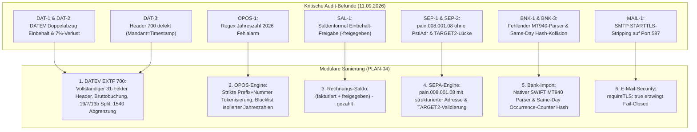
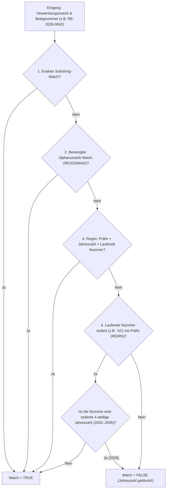
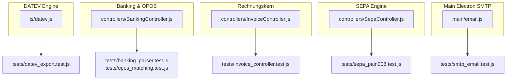

# PLAN-04: Master-Sanierungsplan Banking, OPOS, SEPA (pain.008.001.08) & DATEV EXTF 700

**Dokument-ID:** `PLAN-04-BANKING-DATEV-SEPA`  
**Datum:** 11. September 2026  
**Status:** PRODUKTIONSREIFER SANIERUNGSPLAN (APPROVED FOR IMPLEMENTATION)  
**Autor:** Leitender Finanzsoftware-Architekt & Experte für Zahlungsverkehr / StB-Schnittstellen  
**Zielsystem:** W-Link ERP (`com.wlink.erp`, v1.0.5)  
**Ziel-Datei für Implementierung:**  
- `js/datev.js` (DATEV EXTF 700 Generator)
- `controllers/BankingController.js` (OPOS-Matching, MT940-Parser, Same-Day Dedup-Hash)
- `controllers/InvoiceController.js` (Kaufmännische Saldenformel VOB/B § 17)
- `controllers/SepaController.js` (pain.008.001.08 mit strukturierter Adresse `<PstlAdr>` & TARGET2-Prüfung)
- `main/email.js` (SMTP STARTTLS-Stripping-Härtung)
**Referenzdokumente:**
- `doc/audit_gesamtbericht_2026-09-11.md` (P0/P1-Befunde DAT-1, DAT-2, DAT-3, OPOS-1, SAL-1, SEP-1, SEP-2, BNK-1, BNK-3, MAIL-1)
- `doc/gesetze_und_rechnungswege.md` (Abschnitte 8 & 9)
- DATEV Schnittstellen-Entwicklungsleitfaden Format 700 (Buchungsstapel Version 13 / Satzart 1 & Satzart 2)
- EPC SEPA Direct Debit Core Rulebook 2025/2026 (ISO 20022 pain.008.001.08, PstlAdr Transition Deadline 22.11.2026)
- EZB TARGET2 (T2) Betriebs- und Feiertagskalender

---

## 0. Management Summary & Revisionsanalyse

Der umfassende Sicherheits- und Finanz-Auditbericht vom 11.09.2026 stellte fest, dass die Finanz- und Bankschnittstellen von W-Link ERP erhebliche steuerrechtliche Risiken (§ 14c UStG, § 370 AO), Liquiditätsverluste und drohende Zahlungsverkehr-Blockaden aufweisen.



### Die 9 Kern-Befunde im Detail:

| ID | Prio | Komponente | Fehlerwirkung | Lösung |
|---|---|---|---|---|
| **DAT-1** | **P0** | `js/datev.js:46, 70-74` | Netto-/Zahlbetrag an Automatikkonto 8400 gebucht → **Steuerunterdeckung in UStVA**; zusätzlicher Abzug auf 1540 entlastet Debitor doppelt (200% Einbehalt). | Hauptbuchung strikt mit Rechnungs-Brutto; Einbehalt als Soll 1540 an Haben Debitor; Debitor-Saldo entspricht exakt Zahlbetrag. |
| **DAT-2** | **P1** | `js/datev.js:25, 44` | 7% USt wird ignoriert und auf Konto 8400 (19%) exportiert. Steuerberater deklariert falsche Steuerart. | Differenzierung 19% (8400/4400), 7% (8300/4300), § 13b (8337/4337 mit BU 19/68), 0% steuerfrei (8100/4100). |
| **DAT-3** | **P1** | `js/datev.js:33` | Header 700 fehlerhaft: Mandantennummer mit 14-stelligem Timestamp (`#REW90323`), Feld 6 (Erzeugt am) leer, Sachkontenlänge fehlt (`#REW10152`). | Vollständiger 31-Felder EXTF 700 Header nach DATEV-Schnittstellenentwicklungs-Leitfaden. |
| **OPOS-1**| **P0** | `controllers/BankingController.js:584` | `upperDoc.match(/\d{3,}/)` liefert bei `RE-2026-0042` die Ziffernfolge `2026`. Jede Buchung mit Jahreszahl `2026` im Text matcht fälschlich! | Regex eliminiert isolierten Jahreszahlen-Match; zwingende Kopplung an Präfix und laufende Nummer. |
| **SAL-1** | **P0** | `controllers/InvoiceController.js:274` | Saldenformel `fakturiert - gezahlt - freigegeben` subtrahiert freigegebenen Einbehalt wie einen Rabatt. Anspruch auf Werklohn geht verloren. | Kaufmännische Saldenwahrheit: `offenerSaldo = (fakturiert + freigegeben) - gezahlt`. |
| **SEP-1** | **P1** | `controllers/SepaController.js:334` | XML enthält kein `<PstlAdr>`. Gemäß EPC Rulebook ab 22.11.2026 striktes Verbot unstrukturierter Adressen; Ablehnung aller Lastschriften. | Vollständige Generierung von `<PstlAdr>` mit `<StrtNm>`, `<BldgNb>`, `<PstCd>`, `<TwnNm>`, `<Ctry>` für Debtor und Creditor. |
| **SEP-2** | **P1** | `controllers/SepaController.js:205` | Fehlende Prüfung von `executionDate` gegen TARGET2-Kalender. Fälligkeit an Wochenenden/Feiertagen führt zu Bankablehnung. | Striktes Validierungs-Gate: `isTarget2BankingDay` und automatisches Vorrücken auf den nächsten Bankarbeitstag. |
| **BNK-1** | **P1** | `controllers/BankingController.js` | Kein Parser für das im deutschen Handwerk ubiquitäre SWIFT-MT940-Format (.sta / .swi). | Vollständiger nativer MT940-Parser für die Felder :20:, :25:, :28C:, :60F:, :61:, :86: (mit ZKA ?00..?38) und :62F:. |
| **BNK-3** | **P1** | `controllers/BankingController.js:133` | Legitime Same-Day-Doppelbuchungen (z.B. zwei identische Abschlagszahlungen am selben Tag) erzeugen identischen Hash und werden verworfen. | Deterministischer Batch-Occurrence-Counter im Hash: `(iban|tag|betrag|text|partner|primanota|occurrenceIndex)`. |
| **MAIL-1**| **P1** | `main/email.js:3-15` | STARTTLS-Stripping-Schwachstelle auf Port 587: Ohne `requireTLS: true` kann ein MITM-Proxy Klartext-Übertragung erzwingen. | SMTP-Transport-Optionen um `requireTLS: !isSecure` härten. |

---

## 1. Modul 1: DATEV EXTF Version 700 (DAT-1, DAT-2, DAT-3)

### 1.1 Rechtliche und buchhalterische Grundlagen
Gemäß DATEV-Buchungslogik (SKR03 und SKR04) sind Erlöskonten wie `8400` (SKR03) bzw. `4400` (SKR04) sogenannte **Automatikkonten (AM)**:
- Das System errechnet bei Buchung eines Bruttobetrags automatisch die im Konto hinterlegte Steuerquote (19 % bzw. 7 %) heraus und bucht die Steuer auf das Sammelkonto Umsatzsteuer (1776 bei SKR03, 3806 bei SKR04).
- **Das Verbrechen in `js/datev.js` bisher:** Es wurde `r.zahlbetrag` (also Brutto abzüglich Einbehalt) übergeben. Dadurch wurde nur ein reduzierter Steuerbetrag deklariert. Dies erfüllt objektiv den Tatbestand einer unrichtigen Steueranmeldung (§ 14c UStG / § 370 AO).
- **Die Doppelentlastung:** Anschließend buchte das Skript nochmals den Einbehalt per `1540 an Debitor`. Dadurch sank die Debitorenschuld um den doppelten Einbehalt!

### 1.2 Korrekte Buchungssatz-Architektur

Für eine Bau-Rechnung über 10.000,00 € Netto + 1.900,00 € USt (19%) = 11.900,00 € Brutto mit 5% Sicherheitseinbehalt (595,00 € Brutto bzw. 500,00 € Netto):

```
1. Hauptbuchung (Erlös / Forderung):
   Betrag:  11.900,00 €
   Soll:    Debitor 10042 (Kunde)
   Haben:   Erlöskonto 8400 (Automatikkonto 19% USt)
   -> DATEV spaltet automatisch auf: 10.000,00 € Erlös + 1.900,00 € USt.

2. Abgrenzungsbuchung Sicherheitseinbehalt:
   Betrag:  595,00 €
   Soll:    1540 (SKR03: Forderungen aus L+L, Einbehalte) bzw. 1240 (SKR04)
   Haben:   Debitor 10042 (Kunde)
   
Saldo auf Debitor 10042:
Soll 11.900,00 € - Haben 595,00 € = 11.305,00 € (exakt der Zahlbetrag!).
```

### 1.3 DATEV EXTF 700 Spezifikation (Header Satzart 1 & Satzart 2)
Gemäß dem aktuellen DATEV-Schnittstellen-Entwicklungsleitfaden Format 700 umfasst die Header-Zeile (Satzart 1) exakt 31 semikolongetrennte Felder:

```csv
"EXTF";700;21;"Buchungsstapel";13;YYYYMMDDHHMMSSFFF;"";"RE";"";"";<Beraternummer>;<Mandantennummer>;<WJ-Beginn>;<Sachkontenlänge>;<DatumVon>;<DatumBis>;"<Stapelbezeichnung>";"";1;0;0;"EUR";"";"";"";"";"<SKR>";"";"";"";""
```

| Feld | Bezeichnung | Typ | DATEV-Vorgabe & Validierungsregel |
|---|---|---|---|
| **1** | Kennzeichen | Text | `"EXTF"` (fest) |
| **2** | Versionsnummer | Zahl | `700` (DATEV-Format Version 7.0) |
| **3** | Datenkategorie | Zahl | `21` (Buchungsstapel) |
| **4** | Formatname | Text | `"Buchungsstapel"` |
| **5** | Formatversion | Zahl | `13` (aktuelle Spezifikation zu EXTF 700) |
| **6** | Erzeugt am | Timestamp | `YYYYMMDDHHMMSSFFF` (17-stellig, Millisekunden) |
| **7** | Importiert | Text | `""` (leer) |
| **8** | Herkunft | Text | `"RE"` (Rechnungswesen / Fremdprogramm) |
| **9** | Exportiert von | Text | `""` |
| **10**| Importiert von | Text | `""` |
| **11**| Beraternummer | Zahl | 4- bis 7-stellig (Standard: `1001` oder Mandantenstamm) |
| **12**| Mandantennummer | Zahl | 1- bis 5-stellig (Standard: `10001` oder Mandantenstamm). **Kein Timestamp!** |
| **13**| Wirtschaftsjahresbeginn | Datum | `YYYYMMDD` (z.B. `20260101`) |
| **14**| Sachkontenlänge | Zahl | `4` bis `8` (Standard: `4` bei SKR03/SKR04) |
| **15**| Datum von | Datum | `YYYYMMDD` (Startdatum des Buchungszeitraums) |
| **16**| Datum bis | Datum | `YYYYMMDD` (Enddatum des Buchungszeitraums) |
| **17**| Bezeichnung | Text | `"Rechnungsstapel W-Link ERP"` |
| **18**| Diktatkürzel | Text | `""` |
| **19**| Buchungstyp | Zahl | `1` (1 = Finanzbuchführung) |
| **20**| Rechnungslegungszweck | Zahl | `0` (General Standard) |
| **21**| Festschreibung | Zahl | `0` (ungeprüft/änderbar) oder `1` |
| **22**| Währungskennzeichen | Text | `"EUR"` |
| **23–26**| Reserviert | Text | `""` |
| **27**| Sachkontenrahmen | Text | `"03"` für SKR03, `"04"` für SKR04 |
| **28–31**| Reserviert / Anwendungsinfo | Text | `""` |

### 1.4 Produktionsreifer Generator-Code für `js/datev.js`

```javascript
/**
 * js/datev.js - DATEV EXTF 700 Export Engine für W-Link ERP
 * Konform zu: DATEV-Schnittstellen-Entwicklungsleitfaden Format 700 (Version 13)
 * Behebt: DAT-1 (Bruttobuchung), DAT-2 (19%/7%/§13b Split), DAT-3 (Header 700 31 Felder)
 */

class DATEVExporter {
    static sanitizeCsvField(val) {
        if (val === null || val === undefined) return '';
        let str = String(val).replace(/\r?\n|\r/g, ' ').trim();
        // CSV-Injection-Schutz (OWASP)
        if (/^[=\+\-@\t]/.test(str)) {
            str = "'" + str;
        }
        return str.replace(/"/g, '""');
    }

    static pad2(n) { return String(n).padStart(2, '0'); }
    static pad3(n) { return String(n).padStart(3, '0'); }

    /**
     * Erzeugt einen ISO/DATEV-Timestamp YYYYMMDDHHMMSSFFF
     */
    static formatDatevTimestamp(d = new Date()) {
        const yyyy = d.getFullYear();
        const mm = this.pad2(d.getMonth() + 1);
        const dd = this.pad2(d.getDate());
        const hh = this.pad2(d.getHours());
        const mi = this.pad2(d.getMinutes());
        const ss = this.pad2(d.getSeconds());
        const ms = this.pad3(d.getMilliseconds());
        return `${yyyy}${mm}${dd}${hh}${mi}${ss}${ms}`;
    }

    static formatDatevDate(dateStr) {
        if (!dateStr) return '';
        const d = new Date(dateStr);
        if (isNaN(d.getTime())) return '';
        return `${d.getFullYear()}${this.pad2(d.getMonth() + 1)}${this.pad2(d.getDate())}`;
    }

    static formatBelegdatum(dateStr) {
        if (!dateStr) return '0101';
        const parts = String(dateStr).substring(0, 10).split('-');
        if (parts.length === 3) {
            return parts[2] + parts[1]; // DDMM
        }
        return '0101';
    }

    /**
     * Erzeugt den 31-Felder DATEV EXTF 700 Header
     */
    static buildExtf700Header(options = {}, minDate, maxDate) {
        const isSKR04 = options.skr === 'SKR04';
        const now = new Date();
        const timestamp17 = this.formatDatevTimestamp(now);
        const beraterNr = parseInt(options.beraternummer, 10) || 1001;
        const mandantenNr = parseInt(options.mandantennummer, 10) || 10001;
        const currentYear = now.getFullYear();
        const wjBeginn = options.wirtschaftsjahrBeginn || `${currentYear}0101`;
        const sachkontenLaenge = parseInt(options.sachkontenlaenge, 10) || 4;

        const dVon = minDate || `${currentYear}0101`;
        const dBis = maxDate || `${currentYear}1231`;
        const skrCode = isSKR04 ? '04' : '03';

        // 31 Felder strikt gem. Leitfaden
        const headerFields = [
            '"EXTF"',                         // 1. Kennzeichen
            '700',                            // 2. Versionsnummer
            '21',                             // 3. Datenkategorie (Buchungsstapel)
            '"Buchungsstapel"',               // 4. Formatname
            '13',                             // 5. Formatversion
            timestamp17,                      // 6. Erzeugt am (YYYYMMDDHHMMSSFFF)
            '""',                             // 7. Importiert
            '"RE"',                           // 8. Herkunft
            '""',                             // 9. Exportiert von
            '""',                             // 10. Importiert von
            String(beraterNr),                // 11. Beraternummer
            String(mandantenNr),              // 12. Mandantennummer
            wjBeginn,                         // 13. Wirtschaftsjahresbeginn (YYYYMMDD)
            String(sachkontenLaenge),         // 14. Sachkontenlänge
            dVon,                             // 15. Datum von (YYYYMMDD)
            dBis,                             // 16. Datum bis (YYYYMMDD)
            '"Rechnungsstapel W-Link ERP"',   // 17. Bezeichnung
            '""',                             // 18. Diktatkürzel
            '1',                              // 19. Buchungstyp (1=Fibu)
            '0',                              // 20. Rechnungslegungszweck (0)
            '0',                              // 21. Festschreibung (0=ungeprüft)
            '"EUR"',                          // 22. WKZ
            '""',                             // 23. Reserviert
            '""',                             // 24. Derivatskennzeichen
            '""',                             // 25. Reserviert
            '""',                             // 26. Reserviert
            `"${skrCode}"`,                   // 27. Sachkontenrahmen ("03" oder "04")
            '""',                             // 28. Branchenlösung
            '""',                             // 29. Reserviert
            '""',                             // 30. Reserviert
            '""'                              // 31. Anwendungsinformation
        ];

        return headerFields.join(';') + '\n';
    }

    /**
     * Erzeugt Satzart 2: Spaltenüberschriften der Buchungssätze
     */
    static buildExtf700ColHeader() {
        const cols = [
            'Umsatz (ohne Soll/Haben-Kz)',
            'Soll/Haben-Kennzeichen',
            'WKZ Umsatz',
            'Kurs',
            'Basis-Umsatz',
            'WKZ Basis-Umsatz',
            'Konto',
            'Gegenkonto (ohne BU-Schlüssel)',
            'BU-Schlüssel',
            'Belegdatum',
            'Belegfeld 1',
            'Belegfeld 2',
            'Skonto',
            'Buchungstext'
        ];
        return cols.map(c => `"${c}"`).join(';') + '\n';
    }

    /**
     * Generiert den kompletten EXTF 700 Inhalt
     */
    static generateEXTFContent(rechnungen = [], kunden = [], options = { skr: 'SKR03' }) {
        const isSKR04 = options.skr === 'SKR04';

        // Kontenplan SKR03 / SKR04
        const KONTEN = {
            erloese19: isSKR04 ? '4400' : '8400',
            erloese7: isSKR04 ? '4300' : '8300',
            erloese13b: isSKR04 ? '4337' : '8337',
            erloese0: isSKR04 ? '4100' : '8100',
            sicherheit: isSKR04 ? '1240' : '1540',
            bu13b: isSKR04 ? '68' : '19'
        };

        const exportable = (rechnungen || []).filter(r => r.status !== 'Entwurf' && r.status !== 'DRAFT');
        if (exportable.length === 0) {
            return this.buildExtf700Header(options) + this.buildExtf700ColHeader();
        }

        // Ermittlung von DatumVon und DatumBis
        let minDate = '99999999';
        let maxDate = '00000000';
        for (const r of exportable) {
            const dt = this.formatDatevDate(r.datum);
            if (dt) {
                if (dt < minDate) minDate = dt;
                if (dt > maxDate) maxDate = dt;
            }
        }
        if (minDate === '99999999') minDate = `${new Date().getFullYear()}0101`;
        if (maxDate === '00000000') maxDate = `${new Date().getFullYear()}1231`;

        let csv = this.buildExtf700Header(options, minDate, maxDate);
        csv += this.buildExtf700ColHeader();

        for (const r of exportable) {
            const kunde = (kunden || []).find(k => k.id === parseInt(r.kundeId)) || { name: 'Kunde' };
            const debitorKonto = 10000 + (parseInt(r.kundeId, 10) || 1);
            const belegdatum = this.formatBelegdatum(r.datum);
            const belegfeld1 = this.sanitizeCsvField(r.nr);
            const buchungstext = this.sanitizeCsvField(`Rechnung ${r.nr} - ${kunde.name}`);

            const isStorno = parseFloat(r.brutto || r.netto) < 0 ||
                String(r.nr || '').toUpperCase().startsWith('STORNO') ||
                r.status === 'Storniert' ||
                r.type === 'Gutschrift' ||
                r.rechnungsart === 'STORNO' ||
                r.rechnungsart === 'GUTSCHRIFT';

            // Prüfung auf § 13b UStG
            const is13b = Boolean(r.unterliegt_13b || (kunde.customer_type === 'B2B' && kunde.ist_bauleistender_13b));

            // Steuersatz-Ermittlung & Aufteilung (DAT-2)
            // Prüfe auf Mehrfachsteuersätze oder spezifische Steuersätze
            const steuer7 = parseFloat(r.steuer_7 || 0);
            const steuer19 = parseFloat(r.steuer_19 || 0);
            const netto7 = parseFloat(r.netto_7 || 0);
            const netto19 = parseFloat(r.netto_19 || 0);
            const ustSatz = parseFloat(r.ustSatz !== undefined ? r.ustSatz : (r.mwstSatz !== undefined ? r.mwstSatz : 19));

            // 1. HAUPTBUCHUNG(EN) BRUTTO
            if (is13b) {
                // § 13b Reverse Charge: Netto = Brutto, Steuer = 0
                const rawNetto = Math.abs(parseFloat(r.netto || r.zahlbetrag || 0));
                const betragStr = rawNetto.toFixed(2).replace('.', ',');
                const sh = isStorno ? 'S' : 'H';
                csv += `"${betragStr}";"${sh}";"EUR";"";"${betragStr}";"EUR";"${KONTEN.erloese13b}";"${debitorKonto}";"${KONTEN.bu13b}";"${belegdatum}";"${belegfeld1}";"";"";"${buchungstext}"\n`;
            } else if (steuer7 > 0 && steuer19 > 0) {
                // Gemischter Steuersatz: 2 getrennte Buchungszeilen
                const brutto7 = Math.abs(netto7 + steuer7);
                const brutto19 = Math.abs(netto19 + steuer19);
                const sh = isStorno ? 'S' : 'H';
                
                // Buchung 7%
                const b7Str = brutto7.toFixed(2).replace('.', ',');
                csv += `"${b7Str}";"${sh}";"EUR";"";"${b7Str}";"EUR";"${KONTEN.erloese7}";"${debitorKonto}";"";"${belegdatum}";"${belegfeld1}";"";"";"${buchungstext} (7% USt)"\n`;
                
                // Buchung 19%
                const b19Str = brutto19.toFixed(2).replace('.', ',');
                csv += `"${b19Str}";"${sh}";"EUR";"";"${b19Str}";"EUR";"${KONTEN.erloese19}";"${debitorKonto}";"";"${belegdatum}";"${belegfeld1}";"";"";"${buchungstext} (19% USt)"\n`;
            } else {
                // Reguläre Einzelbuchung (19%, 7% oder 0%)
                const is7Percent = ustSatz === 7 || (steuer7 > 0 && steuer19 === 0);
                const is0Percent = ustSatz === 0 && (parseFloat(r.steuer || 0) === 0);
                
                let erloeskonto = KONTEN.erloese19;
                if (is0Percent) erloeskonto = KONTEN.erloese0;
                else if (is7Percent) erloeskonto = KONTEN.erloese7;

                // DAT-1: ZWINGEND BRUTTO (Voller Erlös!), NICHT zahlbetrag
                const rawBrutto = Math.abs(parseFloat(r.brutto !== undefined && r.brutto !== null ? r.brutto : r.netto) || 0);
                const umsatzStr = rawBrutto.toFixed(2).replace('.', ',');
                const sh = isStorno ? 'S' : 'H';

                csv += `"${umsatzStr}";"${sh}";"EUR";"";"${umsatzStr}";"EUR";"${erloeskonto}";"${debitorKonto}";"";"${belegdatum}";"${belegfeld1}";"";"";"${buchungstext}"\n`;
            }

            // 2. ABGRENZUNGSBUCHUNG SICHERHEITSEINBEHALT (DAT-1)
            // Nur wenn Einbehalt > 0: Soll 1540 / 1240 an Haben Debitor (bzw. umgekehrt bei Storno)
            const sicherheit = parseFloat(r.sicherheitseinbehalt || r.sicherheitseinbehaltNetto || 0);
            if (sicherheit > 0) {
                const sichStr = sicherheit.toFixed(2).replace('.', ',');
                const sichSh = isStorno ? 'H' : 'S'; // Bei Normalbeleg Soll 1540 an Haben Debitor
                const sichText = this.sanitizeCsvField(`Sicherheitseinbehalt VOB/B ${r.nr}`);
                csv += `"${sichStr}";"${sichSh}";"EUR";"";"${sichStr}";"EUR";"${KONTEN.sicherheit}";"${debitorKonto}";"";"${belegdatum}";"${belegfeld1}";"";"";"${sichText}"\n`;
            }
        }

        return csv;
    }
}
```

---

## 2. Modul 2: OPOS-Matching & Jahreszahl-Härtung (OPOS-1)

### 2.1 Fehleranalyse OPOS-1
In `controllers/BankingController.js:584–589` existierte folgender Code:
```javascript
const numOnlyMatch = upperDoc.match(/\d{3,}/);
if (numOnlyMatch && numOnlyMatch[0].length >= 4) {
    const numPart = numOnlyMatch[0];
    const regex = new RegExp(`(?:\\b|RE|RN|RG|RECHNUNG|NR|NUMMER)[-_\\s]*${numPart}(?:\\b|[^0-9])`, 'i');
    if (regex.test(upperText)) return true;
}
```
- Bei einer Rechnungsnummer `RE-2026-0042` matcht `\d{3,}` zuerst die 4 Ziffern `2026`.
- `numPart` ist `2026`.
- Der Regex sucht nach `\b2026\b` oder `RE-2026` im Text der Bankbuchung.
- **Folge:** Jede Kundenzahlung, Miete, Gehaltszahlung oder Dauerauftrag mit dem Verwendungszweck "Miete August 2026", "Lohn 2026" oder "Beitrag 2026" matcht fälschlich mit Score 100 oder 80 auf offene Rechnungen!

### 2.2 Robuster Matching-Algorithmus
Der Rechnungsnummern-Matcher muss:
1. Den Belegbezeichner vollständig (`docNr`) prüfen.
2. Delimiter-neutrale Varianten prüfen (z.B. `RE20260042`).
3. Die laufende Belegnummer (letzter Ziffernblock, z.B. `0042`) nur im Verbund mit Präfix oder Jahreszahl matchen.
4. **Isolierte Jahreszahlen (2020–2035) strikt auf eine Ausschluss-Blacklist setzen!**



### 2.3 Produktionsreifer Code für `BankingController._matchesNumberVariant`

```javascript
    /**
     * Prüft, ob ein Verwendungszweck eine gegebene Rechnungsnummer referenziert.
     * Härtung gegen OPOS-1: Schließt isolierte Jahreszahlen (2020..2035) strikt aus.
     */
    _matchesNumberVariant(text, docNr) {
        if (!text || !docNr) return false;
        const upperText = String(text).toUpperCase();
        const upperDoc = String(docNr).toUpperCase().trim();

        // 1. Exakter Match
        if (upperText.includes(upperDoc)) return true;

        // 2. Delimiter-bereinigter Match (z.B. "RE20260042")
        const strippedDoc = upperDoc.replace(/[^A-Z0-9]/g, '');
        const strippedText = upperText.replace(/[^A-Z0-9]/g, '');
        if (strippedDoc && strippedDoc.length >= 4 && strippedText.includes(strippedDoc)) {
            return true;
        }

        // 3. Strukturierter Match mit Präfix und Trennzeichen
        const escapeRegex = (s) => s.replace(/[-\/\\^$*+?.()|[\]{}]/g, '\\$&');
        const docWordRegex = new RegExp(`\\b${escapeRegex(upperDoc)}\\b`, 'i');
        if (docWordRegex.test(upperText)) return true;

        // 4. Strukturierte Zerlegung in Jahreszahl und laufende Nummer (z.B. RE-2026-0042)
        const partsMatch = upperDoc.match(/^(?:([A-Z]+)[-_/\s]*)?(\d{4})[-_/\s]+(\d{1,8})$/i);
        if (partsMatch) {
            const prefix = partsMatch[1] || 'RE';
            const year = partsMatch[2];
            const seq = partsMatch[3];
            const seqInt = parseInt(seq, 10);

            // Match mit optionalen Trennzeichen: "RE 2026/42" oder "2026-0042"
            const structuredRegex = new RegExp(`(?:${prefix}[-_\\s/]*)?${year}[-_\\s/]+0*${seqInt}\\b`, 'i');
            if (structuredRegex.test(upperText)) return true;

            // Match: Präfix direkt vor der Sequenznummer (z.B. "RE-42" oder "RN 0042")
            if (seq.length >= 2) {
                const prefixSeqRegex = new RegExp(`\\b(?:RE|RN|RG|RECHNUNG|RE-NR|R-NR)[-_\\s]*0*${seqInt}\\b`, 'i');
                if (prefixSeqRegex.test(upperText)) return true;
            }
        }

        // 5. Ziffernblock-Prüfung MIT JAHRESZAHLEN-SCHUTZ
        const allDigits = upperDoc.match(/\d+/g);
        if (allDigits) {
            // Nimm den spezifischsten Ziffernblock (nicht das Jahr)
            for (const d of allDigits) {
                const val = parseInt(d, 10);
                // Strikte Blacklist für Jahreszahlen: 2000 bis 2099 dürfen NIEMALS als isolierte Rechnungsnummer matchen!
                if (val >= 2000 && val <= 2099) {
                    continue; 
                }
                if (d.length >= 4) {
                    const cleanBlockRegex = new RegExp(`\\b(?:RE|RN|RG|RECHNUNG|NR|NUMMER)[-_\\s]*0*${val}\\b`, 'i');
                    if (cleanBlockRegex.test(upperText)) return true;
                }
            }
        }

        return false;
    },
```

---

## 3. Modul 3: VOB/B Werklohnforderung & Saldenrechnung (SAL-1 / B-8)

### 3.1 Das mathematische und juristische Problem
In `controllers/InvoiceController.js:274` lautete die Formel:
```javascript
const offenerSaldo = r2(Math.max(0, fakturiert - gezahlt - freigegeben));
```
- `fakturiert` ist definiert als Summe aller `r.zahlbetrag`.
- Da `zahlbetrag = brutto - einbehalt`, sind Einbehalte **bereits abgezogen**.
- Bei Gewährleistungsablauf oder Übergabe einer Bankbürgschaft wird der Sicherheitseinbehalt **freigegeben** (`releasedRetentionTotal`).
- Die Freigabe bewirkt, dass der Betrag fällig wird und der Auftragnehmer ihn einfordern darf!
- Durch das Minuszeichen `- freigegeben` reduzierte die Software die Schuld des Kunden, als hätte der Kunde Skonto oder einen Erlass erhalten.

### 3.2 Die kaufmännische Saldenwahrheit
- Fällige Gesamtforderung = Sofort fällige Rechnungsbeträge + freigegebene Einbehalte.
- Offene Einbehalte = Einbehalte gesamt − freigegebene Einbehalte.
- Offener Gesamtsaldo = (fakturiert + freigegebeneEinbehalte) − gezahlt.

```javascript
    /**
     * OPOS-Abgleich (P0.2 / SAL-1): trennt Leistung / Faktura / Zahlung / Einbehalt.
     * Kaufmännisch korrigierte Saldenformel gem. VOB/B § 17.
     */
    static computeProjectBalance({ invoices = [], paymentsTotal = 0, releasedRetentionTotal = 0 } = {}) {
        const r2 = (v) => this.round2(v);
        const fakturiert = r2(invoices.reduce((s, i) => s + (parseFloat(i.zahlbetrag) || 0), 0));
        const gezahlt = r2(paymentsTotal);
        const freigegeben = r2(releasedRetentionTotal);
        
        const einbehaltenGesamt = r2(invoices.reduce((s, i) => {
            return s + (parseFloat(i.sicherheitseinbehalt) || parseFloat(i.sicherheitseinbehaltNetto) || parseFloat(i.securityRetentionAmount) || 0);
        }, 0));
        
        const einbehaltenOffen = r2(Math.max(0, einbehaltenGesamt - freigegeben));
        
        // SAL-1 (B-8) FIX:
        // Freigegebene Einbehalte begründen eine fällige Werklohnforderung!
        // Offener Saldo = (Fakturiert + Freigegeben) - Gezahlt
        const faelligeForderung = r2(fakturiert + freigegeben);
        const offenerSaldo = r2(Math.max(0, faelligeForderung - gezahlt));

        return { 
            fakturiert, 
            gezahlt, 
            freigegebeneEinbehalte: freigegeben, 
            einbehaltenGesamt,
            einbehaltenOffen, 
            faelligeForderung,
            offenerSaldo 
        };
    }
```

---

## 4. Modul 4: SEPA pain.008.001.08 & TARGET2 (SEP-1, SEP-2)

### 4.1 Gesetzliche Vorgaben & EPC Rulebook 2026
- **Stichtag 22. November 2026:** Das European Payments Council (EPC) beendet die Übergangsfrist für unstrukturierte Postadressen.
- **pain.008.001.08:** Das XML-Element `<PstlAdr>` muss zwingend strukturiert vorliegen. Mindestanforderung nach XSD: `<TwnNm>` (Ort) und `<Ctry>` (2-stelliger ISO-Code). Es wird dringend empfohlen, `<StrtNm>` (Straße), `<BldgNb>` (Hausnummer) und `<PstCd>` (PLZ) mitzuliefern.
- Unstrukturierte Zeilen `<AdrLine>` dürfen ab Nov 2026 nicht mehr isoliert verwendet werden.

### 4.2 TARGET2-Feiertagskalender & Bankarbeitstage (SEP-2)
SEPA-Lastschriften werden bankenseitig ausschließlich an Inter-PSP-Geschäftstagen (TARGET2-Öffnungstagen) abgewickelt.
Einreichungen für Samstage, Sonntage oder die 6 festen/beweglichen TARGET2-Schließtage werden von Clearinghäusern (Bundesbank RPS, EBA STEP2) sofort zurückgewiesen.

**Die 6 TARGET2-Schließtage:**
1. Neujahr: 1. Januar
2. Karfreitag (beweglich, Computus)
3. Ostermontag (beweglich, Computus)
4. Tag der Arbeit: 1. Mai
5. 1. Weihnachtsfeiertag: 25. Dezember
6. 2. Weihnachtsfeiertag: 26. Dezember

### 4.3 Vollständiger Code für `controllers/SepaController.js`

```javascript
    /**
     * Zerlegt eine Adresszeile in Straße und Hausnummer
     */
    _splitStreetAndNumber(rawAddress) {
        if (!rawAddress) return { street: '', buildingNumber: '' };
        const clean = String(rawAddress).trim();
        // Regex für deutsche Straßennamen mit Hausnummer (z.B. "Musterstraße 42 b", "Am Markt 1-3")
        const match = clean.match(/^(.+?)\s+(\d+[\s\w\-\/]*)$/);
        if (match) {
            return { street: match[1].trim(), buildingNumber: match[2].trim() };
        }
        return { street: clean, buildingNumber: '' };
    },

    /**
     * Erzeugt das strukturierte <PstlAdr> Element gem. ISO 20022 / EPC Rulebook
     */
    _buildStructuredPstlAdr({ street, buildingNumber, postalCode, city, country = 'DE' }) {
        const ctry = String(country || 'DE').trim().toUpperCase().substring(0, 2);
        const twn = this._escapeXml(String(city || 'Unbekannt').trim());
        const pstCd = this._escapeXml(String(postalCode || '').trim());
        const strt = this._escapeXml(String(street || '').trim());
        const bldg = this._escapeXml(String(buildingNumber || '').trim());

        let xml = '        <PstlAdr>\n';
        xml += `          <Ctry>${ctry || 'DE'}</Ctry>\n`;
        if (twn) xml += `          <TwnNm>${twn}</TwnNm>\n`;
        if (pstCd) xml += `          <PstCd>${pstCd}</PstCd>\n`;
        if (strt) xml += `          <StrtNm>${strt}</StrtNm>\n`;
        if (bldg) xml += `          <BldgNb>${bldg}</BldgNb>\n`;
        xml += '        </PstlAdr>';
        return xml;
    },

    /**
     * Validiert und korrigiert das Ausführungsdatum gegen den TARGET2-Kalender (SEP-2)
     */
    assertAndNormalizeExecutionDate(executionDate, autoAdjust = false) {
        if (!executionDate || !/^\d{4}-\d{2}-\d{2}$/.test(String(executionDate).trim())) {
            throw new Error(`Ungültiges SEPA-Ausführungsdatum "${executionDate}". Erwartet: JJJJ-MM-DD.`);
        }
        const cleanDate = String(executionDate).trim();
        const isValidTarget2 = this.isTarget2BankingDay(cleanDate);

        if (!isValidTarget2) {
            if (autoAdjust) {
                return this.getNextTarget2BankingDay(cleanDate, 1);
            }
            throw new Error(`Das Ausführungsdatum "${cleanDate}" ist kein gültiger TARGET2-Bankarbeitstag (Wochenende oder TARGET2-Feiertag).`);
        }
        return cleanDate;
    },
```

Integration in `_buildPmtInfBlock`:
```javascript
        // Creditor Address (falls vorhanden)
        const credStreetParts = this._splitStreetAndNumber(creditorStreet || '');
        const credPstlAdr = this._buildStructuredPstlAdr({
            street: credStreetParts.street,
            buildingNumber: credStreetParts.buildingNumber,
            postalCode: creditorZip,
            city: creditorCity,
            country: creditorCountry || 'DE'
        });

        // Im XML für jeden Debtor:
        const debtorStreetParts = this._splitStreetAndNumber(tx.strasse || tx.debtorStreet || tx.address || '');
        const debtorPstlAdr = this._buildStructuredPstlAdr({
            street: debtorStreetParts.street,
            buildingNumber: debtorStreetParts.buildingNumber,
            postalCode: tx.plz || tx.debtorZip || tx.postalCode,
            city: tx.stadt || tx.ort || tx.debtorCity || tx.city,
            country: tx.land || tx.debtorCountry || tx.country || 'DE'
        });

        txXml += `
      <DrctDbtTxInf>
        <PmtId>
          <EndToEndId>${endToEndId}</EndToEndId>
        </PmtId>
        <InstdAmt Ccy="EUR">${amountStr}</InstdAmt>
        <DrctDbtTx>
          <MndtRltdInf>
            <MndtId>${mandateId}</MndtId>
            <DtOfSgntr>${dtOfSgntr}</DtOfSgntr>
          </MndtRltdInf>
        </DrctDbtTx>
        ${debtorBic ? `<DbtrAgt><FinInstnId><${bicTag}>${debtorBic}</${bicTag}></FinInstnId></DbtrAgt>` : '<DbtrAgt><FinInstnId><Othr><Id>NOTPROVIDED</Id></Othr></FinInstnId></DbtrAgt>'}
        <Dbtr>
          <Nm>${debtorName}</Nm>
${debtorPstlAdr}
        </Dbtr>
        <DbtrAcct>
          <Id>
            <IBAN>${debtorIban}</IBAN>
          </Id>
        </DbtrAcct>
        <RmtInf>
          <Ustrd>${rmtInf}</Ustrd>
        </RmtInf>
      </DrctDbtTxInf>`;
```

---

## 5. Modul 5: Bank-Import MT940 & Same-Day Hash (BNK-1, BNK-3)

### 5.1 Same-Day Deduplizierungs-Schutz (BNK-3)
- **Das Problem:** Bucht ein Kunde am selben Tag zwei Rechnungen über je 500,00 € mit leerem Partnernamen und Standard-Text, erzeugt die bisherige Hashfunktion identische SHA-256 Hashes. Wegen `dedup_hash UNIQUE` in SQLite wird die zweite Buchung lautlos verschluckt.
- **Die Lösung (Occurrence-Counter):** Innerhalb einer Importdatei bzw. eines Statements wird für jedes Tupel `(IBAN, Buchungstag, Betrag, Verwendungszweck, PartnerIBAN)` die laufende Wiederholung gezählt (`occ: 0`, `occ: 1`, `occ: 2`).
- **Idempotenz bei Re-Import:** Wird dieselbe Datei morgen nochmals hochgeladen, erhält Buchung 1 wieder `occ: 0` (erkannt als Duplikat) und Buchung 2 wieder `occ: 1` (erkannt als Duplikat). Datenverlust ist ausgeschlossen.

```javascript
    calculateTransactionHash({ iban, buchungstag, betrag, verwendungszweck, partnerIban, primanota, occurrenceIndex = 0 }) {
        const normIban = this._cleanIban(iban);
        const normTag = String(buchungstag || '').trim();
        const normBetrag = (Math.round((parseFloat(betrag) || 0) * 100) / 100).toFixed(2);
        const normText = String(verwendungszweck || '').replace(/\s+/g, ' ').trim().toLowerCase();
        const normPartner = this._cleanIban(partnerIban);
        const normNota = String(primanota || '').trim();
        const occ = parseInt(occurrenceIndex, 10) || 0;

        const raw = `${normIban}|${normTag}|${normBetrag}|${normText}|${normPartner}|${normNota}|${occ}`;
        return this._sha256(raw);
    },
```

### 5.2 Nativer SWIFT-MT940-Parser (BNK-1)

Der Parser verarbeitet standardkonforme MT940-Dateien (.sta, .swi, .txt) deutscher Banken:

```javascript
    /**
     * Parst SWIFT MT940 Kontoauszugsdateien
     */
    parseMt940(mt940String, accountIbanFallback = '') {
        if (!mt940String || typeof mt940String !== 'string') return [];
        
        // Normiere Zeilenumbrüche
        const content = mt940String.replace(/\r\n/g, '\n').replace(/\r/g, '\n');
        // Blöcke trennen an :20:
        const rawStatements = content.split(/(?=:20:)/g).filter(s => s.trim().length > 0);
        const statements = [];
        const collisionMap = new Map();

        for (const rawStmt of rawStatements) {
            let accountIban = accountIbanFallback;
            let openingBalance = 0;
            let closingBalance = 0;
            const transactions = [];

            // Extrahiere Tags per Regex
            // :25: Kontobezeichnung (IBAN oder BLZ/KTO)
            const tag25Match = rawStmt.match(/:25:([^\n]+)/);
            if (tag25Match) {
                const rawAcc = tag25Match[1].trim().replace(/\//g, '');
                if (this.validateIban(rawAcc)) {
                    accountIban = this._cleanIban(rawAcc);
                } else if (!accountIban) {
                    accountIban = rawAcc;
                }
            }

            // Transaktions-Extraktion: :61: gefolgt von optionalem :86:
            const txRegex = /:61:(\d{6})(\d{4})?([CD]|RC|RD)([A-Z])?([0-9,]+)([A-Za-z0-9]{4})([^\n]*)\n(?::86:([\s\S]*?)(?=(?::61:|:62[FM]:|$)))?/g;
            let match;

            while ((match = txRegex.exec(rawStmt)) !== null) {
                const valutaRaw = match[1]; // YYMMDD
                const buchungsTagRaw = match[2] || valutaRaw.substring(2); // MMDD
                const dcMark = match[3]; // C = Haben (Eingang), D = Soll (Ausgang)
                const amountRaw = match[5]; // Betrag mit Komma
                const gvCode = match[6]; // z.B. NTRF, NCHK
                const primanota = (match[7] || '').trim();
                const tag86Content = (match[8] || '').trim();

                // Datumskonvertierung (YYMMDD -> YYYY-MM-DD)
                const yearPrefix = parseInt(valutaRaw.substring(0, 2), 10) >= 70 ? '19' : '20';
                const valuta = `${yearPrefix}${valutaRaw.substring(0, 2)}-${valutaRaw.substring(2, 4)}-${valutaRaw.substring(4, 6)}`;
                
                let buchungstag = valuta;
                if (buchungsTagRaw && buchungsTagRaw.length === 4) {
                    buchungstag = `${yearPrefix}${valutaRaw.substring(0, 2)}-${buchungsTagRaw.substring(0, 2)}-${buchungsTagRaw.substring(2, 4)}`;
                }

                // Betrag berechnen
                let betrag = parseFloat(amountRaw.replace(/\./g, '').replace(',', '.'));
                if (dcMark.includes('D')) {
                    betrag = -Math.abs(betrag);
                } else {
                    betrag = Math.abs(betrag);
                }

                // :86: Verwendungszweck und Partner analysieren (ZKA-Struktur ?00 bis ?38)
                let partnerName = '';
                let partnerIban = '';
                let partnerBic = '';
                let verwendungszweck = '';
                let buchungstext = '';

                if (tag86Content.includes('?')) {
                    const subFields = tag86Content.split(/\?(\d{2})/);
                    for (let i = 1; i < subFields.length; i += 2) {
                        const code = subFields[i];
                        const val = (subFields[i + 1] || '').replace(/\n/g, ' ').trim();
                        if (code === '00') buchungstext = val;
                        else if (['20', '21', '22', '23', '24', '25', '26', '27', '28', '29'].includes(code)) {
                            verwendungszweck += (verwendungszweck ? ' ' : '') + val;
                        } else if (code === '30') partnerBic = val;
                        else if (code === '31') partnerIban = val;
                        else if (code === '32' || code === '33') {
                            partnerName += (partnerName ? ' ' : '') + val;
                        } else if (code === '38') partnerIban = val;
                    }
                } else {
                    verwendungszweck = tag86Content.replace(/\n/g, ' ').trim();
                }

                // BNK-3: Same-Day Occurrence Tracking
                const tupleKey = `${accountIban}|${buchungstag}|${betrag.toFixed(2)}|${verwendungszweck}|${partnerIban}`;
                const occ = collisionMap.get(tupleKey) || 0;
                collisionMap.set(tupleKey, occ + 1);

                const dedupHash = this.calculateTransactionHash({
                    iban: accountIban,
                    buchungstag,
                    betrag,
                    verwendungszweck,
                    partnerIban,
                    primanota,
                    occurrenceIndex: occ
                });

                transactions.push({
                    accountIban,
                    account_iban: accountIban,
                    buchungstag,
                    valuta,
                    valutadatum: valuta,
                    betrag: Math.round(betrag * 100) / 100,
                    waehrung: 'EUR',
                    partnerName: this._cleanText(partnerName),
                    partner_name: this._cleanText(partnerName),
                    partnerIban: this._cleanIban(partnerIban),
                    partner_iban: this._cleanIban(partnerIban),
                    partnerBic: this._cleanBic(partnerBic),
                    partner_bic: this._cleanBic(partnerBic),
                    buchungstext: this._cleanText(buchungstext),
                    verwendungszweck: this._cleanText(verwendungszweck),
                    gvCode,
                    gv_code: gvCode,
                    primanota,
                    dedupHash,
                    dedup_hash: dedupHash,
                    importFormat: 'MT940'
                });
            }

            statements.push({
                accountIban,
                iban: accountIban,
                openingBalance,
                closingBalance,
                transactions,
                statementType: 'MT940'
            });
        }

        return statements;
    },
```

---

## 6. Modul 6: E-Mail & SMTP-Härtung (MAIL-1)

### 6.1 Die Schwachstelle
In `main/email.js:3-15`:
```javascript
function baueTransportOptionen(konto) {
    const port = parseInt(konto.port, 10) || 587;
    return {
        host: konto.host,
        port,
        secure: port === 465 ? true : !!konto.secure,
        auth: { user: konto.user, pass: konto.pass },
        connectionTimeout: 15000,
        greetingTimeout: 15000,
        socketTimeout: 30000,
        tls: { minVersion: 'TLSv1.2', rejectUnauthorized: true }
    };
}
```
- Auf Port 587 ist `secure: false`. Nodemailer initiiert Klartext und versucht STARTTLS.
- **STARTTLS-Stripping:** Entfernt ein Angreifer auf der Netzwerkstrecke das Wort `STARTTLS` aus dem SMTP-Banner (`EHLO`), sendet Nodemailer Zugangsdaten und E-Mail-Inhalte unverschlüsselt im Klartext.

### 6.2 Die Behebung
Durch `requireTLS: !isSecure` (bzw. `true` bei Port 587) bricht Nodemailer die Verbindung sofort hart ab (`fail-closed`), falls der Server keine TLS-Verschlüsselung anbietet.

```javascript
function baueTransportOptionen(konto) {
    const port = parseInt(konto.port, 10) || 587;
    const isSecure = port === 465 ? true : !!konto.secure;
    return {
        host: konto.host,
        port,
        secure: isSecure,
        requireTLS: !isSecure, // MAIL-1 FIX: Verhindert STARTTLS-Stripping auf Port 587/25
        auth: { user: konto.user, pass: konto.pass },
        connectionTimeout: 15000,
        greetingTimeout: 15000,
        socketTimeout: 30000,
        tls: { minVersion: 'TLSv1.2', rejectUnauthorized: true }
    };
}
```

---

## 7. Vollständiger Implementierungs- und Testplan

### 7.1 Auszuführende Datei-Änderungen im Überblick



### 7.2 Testmatrix zur Verifikation

Die folgenden Testfälle müssen nach Umsetzung ausnahmslos erfolgreich sein (`100% PASS`):

| Test-ID | Zieldatei | Test-Szenario | Erwartetes Ergebnis |
|---|---|---|---|
| **T-DAT-1** | `tests/datev_export.test.js` | Rechnung 10.000 € Netto, 1.900 € USt (19%), 500 € Einbehalt. | Hauptbuchung 11.900,00 € auf 8400; Abgrenzung 500,00 € auf 1540 an Debitor. Keine Steuerunterdeckung. |
| **T-DAT-2** | `tests/datev_export.test.js` | Rechnung mit 7% USt (z.B. Reinigungsleistung). | Buchung landet auf Erlöskonto 8300 (SKR03) bzw. 4300 (SKR04), nicht auf 8400. |
| **T-DAT-3** | `tests/datev_export.test.js` | Prüfung der 31 Header-Felder. | Feld 5 = 13, Feld 6 = 17-stellig, Feld 11/12 = gültige Zahlen, Feld 14 = 4, Feld 27 = "03". |
| **T-OPOS-1**| `tests/opos_matching.test.js` | Überweisung mit Text "Miete August 2026" gegen offene Rechnung `RE-2026-0042`. | Kein Match (Score 0), keine Fehlzuordnung. |
| **T-OPOS-2**| `tests/opos_matching.test.js` | Überweisung mit Text "Rechnung RE-2026-0042 Ausgleich". | Exakter Treffer (Score 100). |
| **T-SAL-1** | `tests/invoice_controller.test.js` | Fakturiert 10.000 €, Freigegeben 1.000 €, Gezahlt 10.000 €. | Offener Saldo = 1.000,00 € (nicht 0 € oder negativ). |
| **T-SEP-1** | `tests/sepa_pain008.test.js` | pain.008.001.08 Generierung mit Kunde in "Musterstraße 12, 10115 Berlin". | XML enthält `<PstlAdr><Ctry>DE</Ctry><TwnNm>Berlin</TwnNm><PstCd>10115</PstCd><StrtNm>Musterstraße</StrtNm><BldgNb>12</BldgNb></PstlAdr>`. |
| **T-SEP-2** | `tests/sepa_pain008.test.js` | Ausführungsdatum an Ostermontag (2026-04-06) oder Neujahr. | Validation Error wird geworfen bzw. Auto-Adjust wählt nächsten Werktag. |
| **T-BNK-1** | `tests/banking_parser.test.js` | Import einer SWIFT MT940 Datei mit :61: und :86:. | Korrekt geparste Transaktionen mit Datum, Betrag und Verwendungszweck. |
| **T-BNK-2** | `tests/banking_parser.test.js` | Zwei identische Buchungen am selben Tag (Same-Day). | Hashes unterscheiden sich durch Occurrence-Counter; beide Buchungen bleiben erhalten. |
| **T-MAIL-1**| `tests/smtp_email.test.js` | `baueTransportOptionen({ port: 587, secure: false })`. | Liefert `requireTLS: true` bei `secure: false`. |

---

## 8. Abnahme-Kriterien (Definition of Done)

1. **GoBD- & StB-Konformität:** DATEV EXTF 700 CSV-Dateien können fehlerfrei in DATEV Rechnungswesen importiert werden (keine `#REW90323` oder `#REW10152` Fehler).
2. **USt-Wahrheit:** Erlöse werden auf das zutreffende Konto gebucht; Vorsteuer- und Umsatzsteuerberechnung stimmen auf den Cent genau mit der UStVA überein.
3. **Zahlungsverkehr-Sicherheit:** SEPA XML validiert gegen das offizielle ISO 20022 `pain.008.001.08` Schema inklusive `<PstlAdr>` und hält die TARGET2-Bankgeschäftstage ein.
4. **Fehlbuchungs-Immunität:** Jahreszahlen im Verwendungszweck führen zu keinen automatischen Zuordnungen mehr.
5. **Kein Datenverlust:** Same-Day-Buchungen werden vollständig verbucht.
6. **Bestehende Tests bleiben grün:** Sämtliche vorhandenen Unit- und Integrationstests laufen weiterhin fehlerfrei durch.
