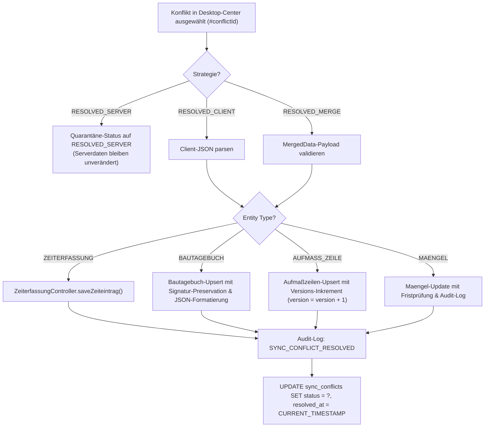
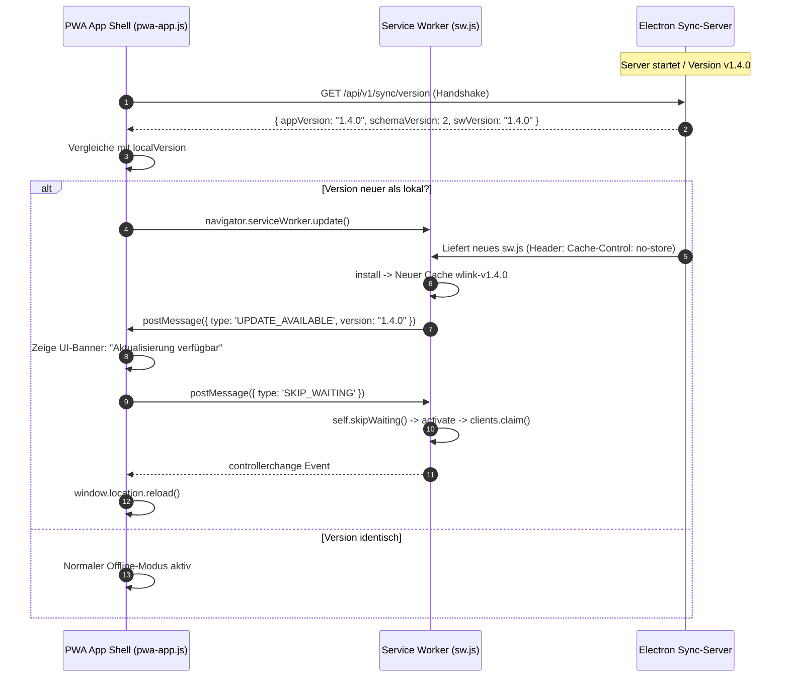
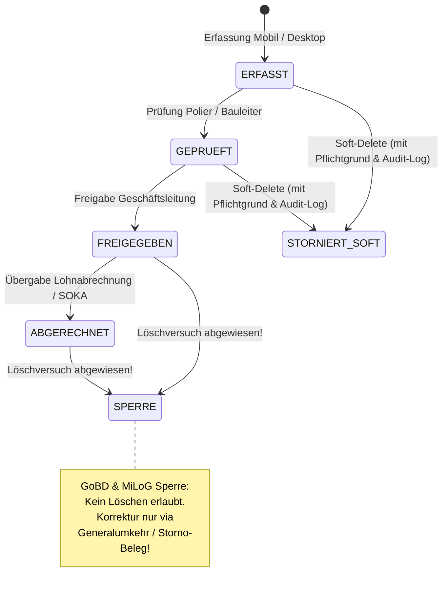
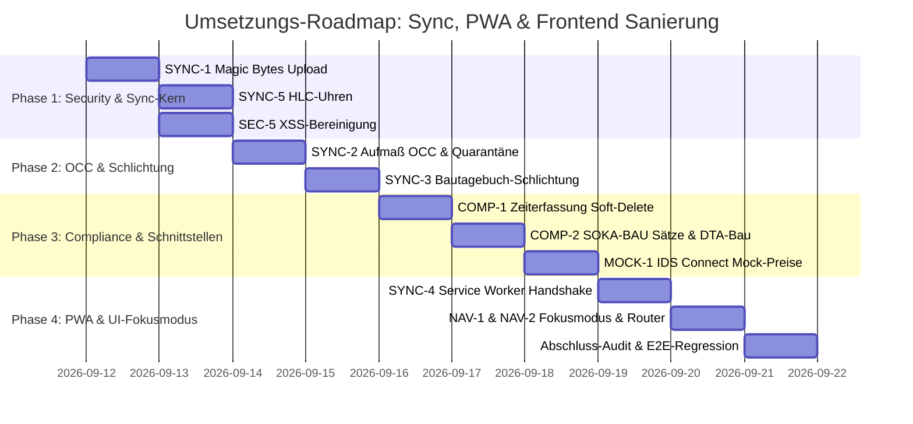

# Sanierungs- und Architekturplan: Local-First Sync, PWA Offline-Systeme & Modernes Frontend

**Dokument-ID:** `PLAN-05-SYNC-PWA-FRONTEND`  
**Datum:** 11. September 2026  
**Zielsystem:** W-Link ERP (`com.wlink.erp`, v1.0.5)  
**Ziel-Datei:** `plans/plan-05-sync-pwa-frontend.md`  
**Referenzbericht:** `doc/audit_gesamtbericht_2026-09-11.md` (P0/P1-Befunde)  
**Rolle:** System-Architekt für Local-First Synchronisation, PWA Offline-Systeme und Electron Frontend-Architektur  

---

## Inhaltsverzeichnis

1. [Executive Summary & Architektur-Leitbild](#1-executive-summary--architektur-leitbild)
2. [Befund- und Maßnahmenmatrix](#2-befund--und-maßnahmenmatrix)
3. [Modul 1: SYNC-1 & SYNC-5 — Native Magic-Bytes-Prüfung & Hybrid Logical Clocks (HLC)](#3-modul-1-sync-1--sync-5--native-magic-bytes-prüfung--hybrid-logical-clocks-hlc)
4. [Modul 2: SYNC-2 & SYNC-3 — Optimistic Concurrency Control (OCC) & Quarantäne-Schlichtung](#4-modul-2-sync-2--sync-3--optimistic-concurrency-control-occ--quarantäne-schlichtung)
5. [Modul 3: SYNC-4 — PWA Service Worker Update-Strategie & Versions-Handshake](#5-modul-3-sync-4--pwa-service-worker-update-strategie--versions-handshake)
6. [Modul 4: NAV-1, B-13 & NAV-2 — UI-Fokusmodus & Router-Guards](#6-modul-4-nav-1-b-13--nav-2--ui-fokusmodus--router-guards)
7. [Modul 5: MOCK-1 — Bereinigung der Mock-Preise in IDS Connect 2.5](#7-modul-5-mock-1--bereinigung-der-mock-preise-in-ids-connect-25)
8. [Modul 6: COMP-1 — EuGH/BAG/MiLoG-konformes Soft-Delete & Revisionsschutz](#8-modul-6-comp-1--eughbagmilog-konformes-soft-delete--revisionsschutz)
9. [Modul 7: COMP-2 — SOKA-BAU Beitragssätze & DTA-Bau Satzlängen](#9-modul-7-comp-2--soka-bau-beitragssätze--dta-bau-satzlängen)
10. [Modul 8: SEC-5 — XSS-Bereinigung in allen Renderer-Views](#10-modul-8-sec-5--xss-bereinigung-in-allen-renderer-views)
11. [Test- und Validierungs-Strategie](#11-test--und-validierungs-strategie)
12. [Phasen- und Umsetzungs-Roadmap (Checkliste)](#12-phasen--und-umsetzungs-roadmap-checkliste)

---

## 1. Executive Summary & Architektur-Leitbild

Der Audit-Gesamtbericht vom 11. September 2026 hat dem System W-Link ERP die Freigabe verweigert. Neben den Kernbereichen E-Rechnung und Buchhaltung weisen insbesondere der **Local-First Synchronisationsserver**, die **mobile PWA (Baustellenbegleiter)**, die **Schnittstellen** sowie das **Frontend** kritische Schwachstellen auf:

1. **Sicherheitsdefizite (P0):** Beliebige Dateiuploads ohne Inhaltsprüfung im Sync-Server (RCE-/Malware-Gefahr) sowie unescapte Template-Strings in Renderer-Views (DOM-XSS).
2. **Datenverlustrisiken (P0/P1):** Blindes Last-Write-Wins überschreibt offline erfasste Aufmaße; Bautagebuch-Konflikte werden bei Schlichtung verworfen; veraltete PWA Service Worker hängen in Cache-Drifts fest.
3. **Rechtliche & regulatorische Verstöße (P1):** Physisches Löschen von Zeiterfassungsdaten verstößt gegen EuGH (C-55/18), BAG (1 ABR 22/21), § 17 MiLoG und GoBD; SOKA-BAU berechnet fehlerhafte Beiträge und erzeugt defekte DTA-Bau-Dateien.
4. **Kaufmännische Risiken (P1):** Hartcodierte 45 € Mock-Preise in IDS Connect täuschen reale Materialkosten vor.

### Das Architektur-Leitbild für die Sanierung:
* **Zero-Trust File Ingestion:** Keine Datei gelangt auf das Dateisystem des Desktop-Hosts, bevor nicht die ersten Bytes kryptografisch und formattechnisch (Magic Bytes) validiert wurden.
* **Causal Consistency via HLC:** Schein-Uhren (`Date.now()`) werden durch formale **Hybrid Logical Clocks (HLC)** ersetzt, um kausale Ereignisreihenfolgen geräteübergreifend deterministisch aufzulösen.
* **Verlustfreie Quarantäne & Schlichtung:** Keine mobile Fachmutation (Aufmaß, Bautagebuch, Mangel) darf ungeprüft überschrieben werden. Bei Versionskonflikten greift die Quarantäne; Schlichtungsentscheidungen werden transaktional und auditierbar in die Fachdatenbank überführt.
* **Deterministischer PWA-Lifecycle:** Eliminierung von Cache-Drifts durch strikte HTTP-Header (`no-store` für `sw.js`), Version-Handshakes und kontrollierte `skipWaiting`-Prompts.
* **GoBD- & Arbeitszeit-Revisionsschutz:** Volle Audit-Trail-Erfassung mit Soft-Delete, Löschbegründung und absolutem Manipulationsschutz für freigegebene/abgerechnete Zeiten.

---

## 2. Befund- und Maßnahmenmatrix

| Audit-ID | Schweregrad | Modul | Fundstelle | Problembeschreibung | Zielzustand / Architekturmaßnahme |
| :--- | :---: | :--- | :--- | :--- | :--- |
| **SYNC-1** | **P0** | Sync-Server | `main/sync-server.js:972-1050` | Beliebige Blobs werden ungeprüft als `.webp` gespeichert. Keine Magic-Bytes-Prüfung. | Zero-Dependency Streaming-Header-Inspektion (JPEG, PNG, WebP) auf ersten 32 Bytes; 415-Abweisung bei Mismatch. |
| **SYNC-2** | **P0** | Sync-Server | `main/sync-server.js:830-853` | Blindes `ON CONFLICT DO UPDATE` bei Aufmaßzeilen. Stiller Datenverlust bei gleichzeitiger Offline-Erfassung. | Optimistic Concurrency Control (OCC) mit Zeilenversionierung (`version`, `hlc_timestamp`) und Quarantäne-Routing. |
| **SYNC-3** | **P1** | Sync-Server / DB | `main/sync-server.js:1185`, `db.js:4326` | `resolveConflict()` ignoriert Bautagebuch und Aufmaße; Daten werden still verworfen. | Vollständige Schlichtungs-Engines für Bautagebuch, Aufmaße und Mängel inkl. Audit-Logging. |
| **SYNC-4** | **P1** | PWA Service Worker | `pwa/sw.js:6-83`, `sync-server.js:1098` | Hardcodierte Cache-Version, Cache-First ohne SW-Update-Header führt zu ewigem Cache-Drift. | `no-cache`-Header für `sw.js`, Schema/App-Version Handshake via `/api/v1/sync/version`, Auto-Update & UI-Prompt. |
| **SYNC-5** | **P2** | PWA Worker / Sync | `pwa/js/sync-worker.js:81`, `sync-server.js:768` | `Date.now()` wird als Fake-Lamport-Timestamp deklariert und serverseitig ignoriert. | Echte Hybrid Logical Clocks (HLC: physikalische Zeit + logischer Zähler + Node-ID) client- und serverseitig. |
| **NAV-1 & B-13** | **P1** | Navigation / Settings | `js/navigation.js:168`, `code.html`, `js/einstellungen.js` | Fokusmodus wird nie aktiviert; Menü überladen; Checkbox in den Einstellungen fehlt völlig. | Checkbox in `code.html` + `js/einstellungen.js`; Initialer Lifecycle-Aufruf von `applyFocusMode()`. |
| **NAV-2** | **P1** | Navigation Router | `js/navigation.js:217` | `switchView()` besitzt keine Guards gegen experimentelle Views bei aktivem Fokusmodus. | Router-Guard in `switchView()`: Blockiert experimentelle Views und leitet mit Toast auf Dashboard um. |
| **MOCK-1** | **P1** | IDS Connect | `main.js:1446-1453` | Hartcodierte Fantasiepreise (45 € Netto / 75 € Brutto) bei IDS-Artikeln. | Mock-Array entfernen; Live-Preise oder saubere Fehler-/Anfrage-Statusmeldung (`PRICE_UNAVAILABLE`). |
| **COMP-1** | **P1** | Zeiterfassung | `controllers/ZeiterfassungController.js:479`, `views/ZeiterfassungView.js:91` | Physisches `DELETE FROM zeiterfassung`; Gesetzesverstoß gegen EuGH, BAG und § 17 MiLoG. | Schema-Erweiterung (`is_deleted`, `delete_reason`), Revisionssperre für Freigegeben/Abgerechnet, Audit-Log. |
| **COMP-2** | **P1** | SOKA-BAU | `controllers/SokaBauController.js:47, 345` | Veraltete Beitragssätze (Ost); variable/falsche Zeilenlängen im DTA-Bau (94, 100, 49, 61 Zeichen). | Aktualisierung Beitragssätze (BRTV 01.07.2026); Normierung DTA-Bau Festbreiten (exakt 100 Zeichen je Satzart). |
| **SEC-5** | **P1** | Renderer-Views | `views/MaengelView.js`, `ZeiterfassungView.js`, `SokaBauView.js`, `js/objekte.js` | Ungefilterte innerHTML-Interpolationen führen zu gespeicherter XSS im Electron-Host. | Systematische HTML-Entity-Sanitisierung über `escapeHtml()` für alle variablen Datenfelder. |

---

## 3. Modul 1: SYNC-1 & SYNC-5 — Native Magic-Bytes-Prüfung & Hybrid Logical Clocks (HLC)

### 3.1 SYNC-1: Zero-Dependency Streaming Magic-Bytes Validierung

#### Problem-Analyse
In `main/sync-server.js:972-1050` wird der Datei-Upload gestreamt. Die Dateiendung wird starr als `.webp` festgelegt (`const fileName = \`${photoUuid}.webp\``). Der Server akzeptiert beliebige Binärdaten (z. B. `.exe`, `.bat`, `.sh`, HTML/JS-Polyglots). Wird die Datei später über den Web-Server oder Desktop ausgeliefert oder geöffnet, drohen RCE und Script Injection.

#### Technische Lösung
Wir implementieren eine native, speichereffiziente Vorab-Inspektion der ersten 32 Bytes des eingehenden Streams, ohne externe npm-Abhängigkeiten. Die Dateiendung wird **dynamisch anhand der Magic Bytes bestimmt**, nicht anhand des vom Client gesendeten Dateinamens oder Content-Type-Headers.

##### Unterstützte Dateitypen & Magic Bytes Signaturen
* **JPEG:** Bytes `FF D8 FF`
* **PNG:** Bytes `89 50 4E 47 0D 0A 1A 0A`
* **WebP (RIFF-Container):**
  - Bytes 0–3: `52 49 46 46` (`RIFF`)
  - Bytes 8–11: `57 45 42 50` (`WEBP`)
  - Bytes 12–15: Chunk-Header `VP8 ` (lossy), `VP8L` (lossless) oder `VP8X` (extended)

#### Code-Spezifikation (`main/sync-server.js`)

```javascript
// Native Magic-Byte Detector (Zero-Dependency)
function detectImageFormat(buffer) {
    if (!buffer || buffer.length < 16) return null;

    // 1. PNG Check (8 Bytes)
    if (buffer[0] === 0x89 && buffer[1] === 0x50 && buffer[2] === 0x4E && buffer[3] === 0x47 &&
        buffer[4] === 0x0D && buffer[5] === 0x0A && buffer[6] === 0x1A && buffer[7] === 0x0A) {
        return { ext: 'png', mime: 'image/png' };
    }

    // 2. JPEG Check (3 Bytes: SOI marker)
    if (buffer[0] === 0xFF && buffer[1] === 0xD8 && buffer[2] === 0xFF) {
        return { ext: 'jpg', mime: 'image/jpeg' };
    }

    // 3. WebP Check (RIFF .... WEBP)
    if (buffer[0] === 0x52 && buffer[1] === 0x49 && buffer[2] === 0x46 && buffer[3] === 0x46 &&
        buffer[8] === 0x57 && buffer[9] === 0x45 && buffer[10] === 0x42 && buffer[11] === 0x50) {
        return { ext: 'webp', mime: 'image/webp' };
    }

    return null;
}
```

#### Integration in `handlePhotoUpload` (`main/sync-server.js`)

1. **Header-Pufferung:** Die ersten eingehenden Chunks werden in einem Header-Buffer gesammelt (mind. 32 Bytes).
2. **Validierung vor Speicherung:** Erkennt `detectImageFormat()` keinen erlaubten Typ, wird der Stream sofort abgebrochen (`req.destroy()`), und der Server antwortet mit `HTTP 415 Unsupported Media Type`.
3. **Deterministische Benennung:** Der tatsächliche Dateiname lautet `${photoUuid}.${detected.ext}`.
4. **Schutz vor Polyglots:** Nur validierte Bilddateien werden aus dem Staging-Verzeichnis per `link()` atomar ins Upload-Verzeichnis überführt.

---

### 3.2 SYNC-5: Hybrid Logical Clocks (HLC) für deterministische Kausalität

#### Problem-Analyse
In `pwa/js/sync-worker.js:81` wird `lamport_timestamp: Date.now()` gesetzt. In `main/sync-server.js:768` wird das Feld destrukturiert und komplett verworfen. Da reine Systemzeiten von mobilen Geräten driften oder vom Benutzer verstellt sein können, kommt es bei Offline-Arbeiten zu Zeitreisen und inkonsistenten Zuständen.

#### Mathematisches HLC-Modell
Ein HLC-Zeitstempel $T = (l, c, n)$ besteht aus:
* $l$ (Physical Time): Millisekunden seit Unix-Epoche, monoton steigend.
* $c$ (Logical Counter): Ganze Zahl für Ereignisse innerhalb derselben Millisekunde.
* $n$ (Node ID / Device ID): Eindeutige Kennung des Knotens zur deterministischen Konfliktauflösung.

Kompakte String-Darstellung: `${isoTime}-${counter.toString(16).padStart(4, '0')}-${nodeId}`  
Beispiel: `2026-09-11T08:30:00.123Z-0001-MOB-A41B`

#### Algorithmus für HLC-Generierung & Update

```javascript
class HybridLogicalClock {
    constructor(nodeId) {
        this.nodeId = nodeId;
        this.lastPhysical = 0;
        this.counter = 0;
    }

    // Lokales Ereignis erzeugen
    now() {
        const physicalNow = Date.now();
        if (physicalNow > this.lastPhysical) {
            this.lastPhysical = physicalNow;
            this.counter = 0;
        } else {
            this.counter++;
        }
        return this.format();
    }

    // Eingehende Nachricht empfangen und Uhr synchronisieren
    receive(remoteTimestampStr) {
        const parsed = HybridLogicalClock.parse(remoteTimestampStr);
        const physicalNow = Date.now();
        const maxPhysical = Math.max(physicalNow, this.lastPhysical, parsed.physical);

        if (maxPhysical === this.lastPhysical && maxPhysical === parsed.physical) {
            this.counter = Math.max(this.counter, parsed.counter) + 1;
        } else if (maxPhysical === this.lastPhysical) {
            this.counter++;
        } else if (maxPhysical === parsed.physical) {
            this.counter = parsed.counter + 1;
        } else {
            this.counter = 0;
        }
        this.lastPhysical = maxPhysical;
        return this.format();
    }

    format() {
        const iso = new Date(this.lastPhysical).toISOString();
        const cnt = this.counter.toString(16).padStart(4, '0');
        return `${iso}-${cnt}-${this.nodeId}`;
    }

    static parse(str) {
        if (!str || typeof str !== 'string') return { physical: 0, counter: 0, nodeId: 'unknown' };
        const parts = str.split('-');
        // Format: YYYY-MM-DDTHH:mm:ss.sssZ-0000-NodeId
        const iso = parts.slice(0, 3).join('-');
        const counter = parseInt(parts[3] || '0', 16);
        const nodeId = parts.slice(4).join('-');
        return { physical: Date.parse(iso) || 0, counter, nodeId };
    }

    static compare(aStr, bStr) {
        const a = HybridLogicalClock.parse(aStr);
        const b = HybridLogicalClock.parse(bStr);
        if (a.physical !== b.physical) return a.physical - b.physical;
        if (a.counter !== b.counter) return a.counter - b.counter;
        return a.nodeId.localeCompare(b.nodeId);
    }
}
```

---

## 4. Modul 2: SYNC-2 & SYNC-3 — Optimistic Concurrency Control (OCC) & Quarantäne-Schlichtung

### 4.1 SYNC-2: Optimistic Concurrency Control für Aufmaßzeilen

#### Problem-Analyse
In `main/sync-server.js:830-853` führt der Server bei `AUFMASS_ZEILE` ein blindes `ON CONFLICT(uuid) DO UPDATE` aus:
```sql
ON CONFLICT(uuid) DO UPDATE SET
    rechenansatz = excluded.rechenansatz,
    ergebnis = excluded.ergebnis
```
Erfassen zwei Poliere offline Messwerte zum selben Raum oder derselben Ordnungszahl (OZ), überschreibt die zuletzt eintreffende Mutation unbemerkt die vorherige. Es erfolgt keine Versionsprüfung und kein Konflikthinweis.

#### Architektur der Lösung: OCC & Quarantäne
1. **Schema-Erweiterung `aufmass_zeilen`:**
   ```sql
   ALTER TABLE aufmass_zeilen ADD COLUMN version INTEGER NOT NULL DEFAULT 1;
   ALTER TABLE aufmass_zeilen ADD COLUMN hlc_timestamp TEXT;
   ALTER TABLE aufmass_zeilen ADD COLUMN updated_by_device TEXT;
   ALTER TABLE aufmass_zeilen ADD COLUMN last_synced_at DATETIME DEFAULT CURRENT_TIMESTAMP;
   ```

2. **Kollisionserkennung im Sync-Server (`applyEntityMutation`):**
   Wenn für eine eingehende `AUFMASS_ZEILE` bereits ein Datensatz mit derselben `uuid` existiert:
   * **Inhaltlicher Gleichstand:** Sind `rechenansatz` und `ergebnis` identisch, wird die Mutation idempotent als Erfolg quittiert (kein Konflikt).
   * **Inhaltliche Divergenz:**
     - Wenn `data.base_version` übermittelt wurde und `data.base_version < serverRecord.version`: **Konflikt!**
     - Wenn kein `base_version` vorhanden ist, aber `serverRecord.hlc_timestamp` neuer ist als der HLC-Timestamp der Mutation oder von einem anderen Endgerät stammt: **Konflikt!**
   * **Quarantäne-Routing:** Die kollidierende Mutation wird in `sync_conflicts` isoliert. Das mobile Endgerät erhält den Konflikt-Status zurück und markiert den Eintrag lokal zur manuellen Prüfung.

```javascript
// main/sync-server.js - applyEntityMutation für AUFMASS_ZEILE
const existing = this.db.prepare('SELECT * FROM aufmass_zeilen WHERE uuid = ?').get(data.uuid);

if (existing) {
    const isSameContent = existing.rechenansatz === data.rechenansatz &&
                          Math.abs(existing.ergebnis - data.ergebnis) < 0.0001;

    if (!isSameContent) {
        // Prüfe OCC Version oder divergierende Daten fremder Geräte
        const isStale = (data.base_version !== undefined && data.base_version < existing.version) ||
                        (existing.updated_by_device && existing.updated_by_device !== deviceId);

        if (isStale) {
            this.quarantineConflict(
                'AUFMASS_ZEILE',
                data.uuid,
                deviceId,
                existing,
                data,
                `Aufmaß-Kollision: Server hat Version ${existing.version} (${existing.rechenansatz}), Client sendet (${data.rechenansatz})`
            );
            return { conflict: true, reason: 'Aufmaß-Kollision', uuid: mut.uuid };
        }
    }
}
```

---

### 4.2 SYNC-3: Vollständige Schlichtungslogik für Bautagebuch & Aufmaße

#### Problem-Analyse
In `main/sync-server.js:1185-1208` und `db.js:4326-4349` enthält `resolveConflict()` / `resolveSyncConflict()` ausschließlich Handler für `entity_type === 'ZEITERFASSUNG'`.
Wird ein Bautagebuch- oder Aufmaß-Konflikt vom Benutzer mit `RESOLVED_CLIENT` oder `RESOLVED_MERGE` bestätigt, wird in SQLite lediglich der Status in `sync_conflicts` auf `RESOLVED` gesetzt. **Die fachlichen Daten werden nie gespeichert und gehen unwiederbringlich verloren.**

#### Vollständige Schlichtungslogik
Wir implementieren eine universelle und typsichere Schlichtungs-Engine für alle konfliktfähigen Entitäten.



#### Code-Implementierung (`main/sync-server.js` & `db.js`)

```javascript
resolveConflict(conflictId, resolutionStrategy, mergedData = null) {
    const conflict = this.db.prepare('SELECT * FROM sync_conflicts WHERE id = ?').get(conflictId);
    if (!conflict) throw new Error(`Konflikt #${conflictId} nicht gefunden.`);

    const effectiveData = resolutionStrategy === 'RESOLVED_CLIENT'
        ? JSON.parse(conflict.client_data_json || '{}')
        : (resolutionStrategy === 'RESOLVED_MERGE' ? mergedData : null);

    const tx = this.db.transaction(() => {
        if (effectiveData && (resolutionStrategy === 'RESOLVED_CLIENT' || resolutionStrategy === 'RESOLVED_MERGE')) {
            const { entity_type, entity_uuid } = conflict;

            if (entity_type === 'ZEITERFASSUNG') {
                ZeiterfassungController.saveZeiteintrag(this.db, effectiveData, this.auditLogger);

            } else if (entity_type === 'BAUTAGEBUCH') {
                const upsertBt = this.db.prepare(`
                    INSERT INTO bautagebuch (
                        uuid, project_id, datum, wetter, temperatur_min, temperatur_max,
                        personal_eigen_anzahl, personal_eigen_stunden, personal_sub_json, geraete_json,
                        tagesbericht, vorkommnisse_behinderungen, fotos_json, updated_at
                    ) VALUES (
                        @uuid, @project_id, @datum, @wetter, @temperatur_min, @temperatur_max,
                        @personal_eigen_anzahl, @personal_eigen_stunden, @personal_sub_json, @geraete_json,
                        @tagesbericht, @vorkommnisse_behinderungen, @fotos_json, CURRENT_TIMESTAMP
                    ) ON CONFLICT(uuid) DO UPDATE SET
                        tagesbericht = excluded.tagesbericht,
                        vorkommnisse_behinderungen = excluded.vorkommnisse_behinderungen,
                        fotos_json = excluded.fotos_json,
                        personal_eigen_anzahl = excluded.personal_eigen_anzahl,
                        personal_eigen_stunden = excluded.personal_eigen_stunden,
                        personal_sub_json = excluded.personal_sub_json,
                        geraete_json = excluded.geraete_json,
                        updated_at = CURRENT_TIMESTAMP
                `);

                upsertBt.run({
                    uuid: entity_uuid,
                    project_id: parseInt(effectiveData.projekt_id || effectiveData.project_id, 10),
                    datum: effectiveData.datum,
                    wetter: effectiveData.wetter || 'HEITER',
                    temperatur_min: parseFloat(effectiveData.temperatur_min) || 0.0,
                    temperatur_max: parseFloat(effectiveData.temperatur_max) || 0.0,
                    personal_eigen_anzahl: parseInt(effectiveData.personal_eigen_anzahl, 10) || 0,
                    personal_eigen_stunden: parseFloat(effectiveData.personal_eigen_stunden) || 0.0,
                    personal_sub_json: typeof effectiveData.personal_sub_json === 'string'
                        ? effectiveData.personal_sub_json : JSON.stringify(effectiveData.personal_sub_json || []),
                    geraete_json: typeof effectiveData.geraete_json === 'string'
                        ? effectiveData.geraete_json : JSON.stringify(effectiveData.geraete_json || []),
                    tagesbericht: effectiveData.tagesbericht || '',
                    vorkommnisse_behinderungen: effectiveData.vorkommnisse || effectiveData.vorkommnisse_behinderungen || '',
                    fotos_json: typeof effectiveData.fotos_json === 'string'
                        ? effectiveData.fotos_json : JSON.stringify(effectiveData.fotos_json || [])
                });

            } else if (entity_type === 'AUFMASS_ZEILE' || entity_type === 'AUFMASS') {
                const upsertAufmass = this.db.prepare(`
                    INSERT INTO aufmass_zeilen (
                        uuid, blatt_id, oz_code, zeilen_nr, bezeichnung, formel_reb, formel_code,
                        rechenansatz, ergebnis, einheit, raum_id, version, updated_at
                    ) VALUES (
                        @uuid, @blatt_id, @oz_code, @zeilen_nr, @bezeichnung, @formel_code, @formel_code,
                        @rechenansatz, @ergebnis, @einheit, @raum_id, 1, CURRENT_TIMESTAMP
                    ) ON CONFLICT(uuid) DO UPDATE SET
                        rechenansatz = excluded.rechenansatz,
                        ergebnis = excluded.ergebnis,
                        bezeichnung = excluded.bezeichnung,
                        version = aufmass_zeilen.version + 1,
                        updated_at = CURRENT_TIMESTAMP
                `);

                upsertAufmass.run({
                    uuid: entity_uuid,
                    blatt_id: effectiveData.blatt_id || 1,
                    oz_code: effectiveData.oz || effectiveData.oz_code || '01.01.001',
                    zeilen_nr: effectiveData.zeilen_nr || 1,
                    bezeichnung: effectiveData.bezeichnung || '',
                    formel_code: effectiveData.formel_code || '91',
                    rechenansatz: effectiveData.rechenansatz || `${effectiveData.ergebnis || 0}=`,
                    ergebnis: parseFloat(effectiveData.ergebnis) || 0.0,
                    einheit: effectiveData.einheit || 'm²',
                    raum_id: effectiveData.raum_id || null
                });

            } else if (entity_type === 'MAENGEL' || entity_type === 'MANGEL') {
                this.db.prepare(`
                    UPDATE maengel SET
                        titel = COALESCE(@titel, titel),
                        beschreibung = COALESCE(@beschreibung, beschreibung),
                        status = COALESCE(@status, status),
                        frist_datum = COALESCE(@frist_datum, frist_datum),
                        updated_at = CURRENT_TIMESTAMP
                    WHERE uuid = @uuid
                `).run({
                    uuid: entity_uuid,
                    titel: effectiveData.titel,
                    beschreibung: effectiveData.beschreibung,
                    status: effectiveData.status,
                    frist_datum: effectiveData.frist_datum
                });
            }

            if (this.auditLogger && this.auditLogger.appendAuditLog) {
                this.auditLogger.appendAuditLog({
                    entityType: entity_type,
                    entityId: conflictId,
                    action: 'SYNC_CONFLICT_RESOLVED',
                    details: { strategy: resolutionStrategy, uuid: entity_uuid }
                });
            }
        }

        // Konfliktstatus aktualisieren
        this.db.prepare(`
            UPDATE sync_conflicts
            SET status = ?, resolved_at = CURRENT_TIMESTAMP
            WHERE id = ?
        `).run(resolutionStrategy, conflictId);
    });

    tx();
    return { success: true, conflictId, resolutionStrategy };
}
```

---

## 5. Modul 3: SYNC-4 — PWA Service Worker Update-Strategie & Versions-Handshake

### 5.1 Analyse des Cache-Drifts
Die PWA wird auf mobilen Smartphones/Tablets betrieben. Im aktuellen Stand (`pwa/sw.js:6-83`):
1. `CACHE_NAME` ist statisch auf `'wlink-mobile-v1.3.1-sync-security'` gesetzt.
2. Der Server (`serveStaticPwaFile`) liefert `sw.js` ohne HTTP-Cache-Header aus. Der Browser speichert den Service Worker im internen HTTP-Cache bis zu 24 Stunden.
3. Die Fetch-Strategie ist blindes **Cache-First**. Änderungen an CSS, HTML oder JS werden nie geladen, solange der Service Worker nicht manuell entfernt wird.
4. Bei Desktop-Updates (z. B. Schema-Änderungen in `ZeiterfassungController.js`) sendet die veraltete mobile Shell veraltete Datenformate an den Server.

### 5.2 Dreistufige Sanierungs-Architektur



#### Maßnahme 1: Strikte Cache-Control Header im Sync-Server (`main/sync-server.js`)
In `serveStaticPwaFile()` werden spezifische Header gesetzt:

```javascript
// main/sync-server.js - serveStaticPwaFile
const isServiceWorker = pathname === '/sw.js' || pathname === '/manifest.webmanifest';

if (isServiceWorker) {
    // Service Worker und Manifest dürfen NIEMALS im HTTP-Cache gehalten werden!
    res.setHeader('Cache-Control', 'no-cache, no-store, must-revalidate, max-age=0');
    res.setHeader('Pragma', 'no-cache');
    res.setHeader('Expires', '0');
} else {
    // Statische Assets (Bilder, Schriften) mit ETag / Stale-While-Revalidate
    res.setHeader('Cache-Control', 'public, max-age=3600, stale-while-revalidate=86400');
}
```

#### Maßnahme 2: Versions-Endpunkt `/api/v1/sync/version`
In `main/sync-server.js:handleHttpRequest`:
```javascript
if (route === '/api/v1/sync/version' && req.method === 'GET') {
    return this.sendJson(res, 200, {
        app: 'W-Link ERP',
        appVersion: '1.4.0',
        schemaVersion: 4,
        swCacheName: 'wlink-mobile-v1.4.0-build20260911',
        serverTime: new Date().toISOString()
    });
}
```

#### Maßnahme 3: Dynamischer Lifecycle in `pwa/sw.js` & `pwa/js/pwa-app.js`

In `pwa/sw.js`:
```javascript
// pwa/sw.js
const VERSION = 'wlink-mobile-v1.4.0-build20260911';
const CACHE_NAME = VERSION;

self.addEventListener('message', event => {
    if (event.data && event.data.type === 'SKIP_WAITING') {
        self.skipWaiting();
    }
});

// Stale-While-Revalidate für statische Shell-Dateien
self.addEventListener('fetch', event => {
    const url = new URL(event.request.url);
    if (url.pathname.startsWith('/api/') || url.pathname.includes('/sync') || url.protocol.startsWith('ws')) {
        return; // Netzwerk-only
    }

    event.respondWith(
        caches.open(CACHE_NAME).then(async cache => {
            const cachedResponse = await cache.match(event.request);
            const fetchPromise = fetch(event.request).then(networkResponse => {
                if (networkResponse && networkResponse.status === 200 && networkResponse.type === 'basic') {
                    cache.put(event.request, networkResponse.clone());
                }
                return networkResponse;
            }).catch(() => null);

            return cachedResponse || fetchPromise;
        })
    );
});
```

In `pwa/js/pwa-app.js`:
```javascript
// Automatischer Schema- und Versionsabgleich
async function checkForAppUpdates() {
    if (!navigator.onLine) return;
    try {
        const res = await fetch('./api/v1/sync/version');
        if (!res.ok) return;
        const info = await res.json();
        const localVersion = localStorage.getItem('wlink_app_version');

        if (localVersion && localVersion !== info.appVersion) {
            console.log(`[PWA Update] Neue Version ${info.appVersion} erkannt (lokal: ${localVersion}).`);
            if ('serviceWorker' in navigator) {
                const reg = await navigator.serviceWorker.getRegistration();
                if (reg) {
                    await reg.update();
                    if (reg.waiting) {
                        reg.waiting.postMessage({ type: 'SKIP_WAITING' });
                    }
                }
            }
            localStorage.setItem('wlink_app_version', info.appVersion);
            showUpdateToast(info.appVersion);
        } else if (!localVersion) {
            localStorage.setItem('wlink_app_version', info.appVersion);
        }
    } catch (_e) { /* offline */ }
}

navigator.serviceWorker.addEventListener('controllerchange', () => {
    window.location.reload();
});
```

---

## 6. Modul 4: NAV-1, B-13 & NAV-2 — UI-Fokusmodus & Router-Guards

### 6.1 Problem-Analyse
1. **NAV-1 & B-13:** In `js/navigation.js:168-216` ist der UI-Fokusmodus definiert (`CORE_VIEWS` vs. `EXPERIMENTAL_VIEWS`). Allerdings wird `applyFocusMode()` im regulären Start- und Lifecycle der Electron-App an keiner Stelle aufgerufen! Alle 19 Menüpunkte (inkl. unfertiger Baustellen) sind dauerhaft sichtbar.
2. In `code.html` und `js/einstellungen.js` existiert **weder eine Checkbox noch ein Einstellungsfeld** für `experimental_module`. Der im Plan P0 versprochene "Opt-in pro Arbeitsplatz" ist für den Anwender technisch unerreichbar.
3. **NAV-2:** In `switchView(viewName)` fehlen jegliche Sicherheitsprüfungen gegen `EXPERIMENTAL_VIEWS`. Jeder Tastendruck, Deep-Link oder Direktaufruf öffnet experimentelle Views auch bei aktivem Fokusmodus.

### 6.2 UI-Integration in `code.html`
Im Einstellungsbereich (`#view-einstellungen`) wird eine optisch hervorgehobene Konfigurations-Kachel integriert:

```html
<!-- code.html: Einstellungen -> Ansicht & Fokusmodus -->
<div class="bg-white p-5 rounded-xl border border-slate-200 shadow-sm mt-6">
    <div class="flex items-start justify-between">
        <div class="space-y-1">
            <div class="flex items-center gap-2">
                <span class="material-symbols-outlined text-primary text-xl">filter_center_focus</span>
                <h3 class="text-sm font-bold text-slate-800">UI-Fokusmodus & Modulsichtbarkeit</h3>
            </div>
            <p class="text-xs text-slate-500 max-w-xl">
                Der Fokusmodus reduziert die Seitennavigation auf den Kern-Workflow (Kunde → Angebot → Projekt/Aufmaß → Rechnung → OPOS → Export). Experimentelle Module (SOKA-BAU, IDS Connect, Mängelkataster, Putzplan) werden ausgeblendet.
            </p>
        </div>
        <label class="relative inline-flex items-center cursor-pointer">
            <input type="checkbox" id="setting-experimental-module" class="sr-only peer" onchange="toggleExperimentalModules(this.checked)">
            <div class="w-11 h-6 bg-slate-200 peer-focus:outline-none rounded-full peer peer-checked:after:translate-x-full peer-checked:after:border-white after:content-[''] after:absolute after:top-[2px] after:left-[2px] after:bg-white after:border-slate-300 after:border after:rounded-full after:h-5 after:w-5 after:transition-all peer-checked:bg-primary"></div>
        </label>
    </div>
    <div class="mt-3 pt-3 border-t border-slate-100 flex items-center justify-between text-[11px] text-slate-400">
        <span>Aktiver Modus: <strong id="fokusmodus-status-text" class="text-slate-600">Fokusmodus aktiv (Kern-Views)</strong></span>
        <span class="italic">Wirksam sofort für diesen Arbeitsplatz</span>
    </div>
</div>
```

### 6.3 Persistenz & Synchronisation in `js/einstellungen.js`

In `loadEinstellungenToForm()`:
```javascript
const expCb = document.getElementById('setting-experimental-module');
if (expCb) {
    const isExp = state.einstellungen.experimental_module === true ||
                  state.einstellungen.experimental_module === 'true' ||
                  state.einstellungen.experimental_module === 1;
    expCb.checked = isExp;
    updateFokusmodusStatusLabel(isExp);
}
```

In `saveEinstellungen()`:
```javascript
const expCb = document.getElementById('setting-experimental-module');
if (expCb) {
    state.einstellungen.experimental_module = expCb.checked ? 'true' : 'false';
    if (typeof applyFocusMode === 'function') {
        applyFocusMode();
    }
}
```

### 6.4 Router-Guards in `js/navigation.js`

```javascript
// js/navigation.js
function switchView(viewName) {
    // 1. Router-Guard gegen experimentelle Module im Fokusmodus
    if (!isExperimentalEnabled() && EXPERIMENTAL_VIEWS.has(viewName) && !CORE_VIEWS.has(viewName)) {
        console.warn(`[Navigation Guard] Aufruf von "${viewName}" blockiert — Fokusmodus ist aktiv.`);
        if (typeof showNotification === 'function') {
            showNotification(
                'Fokusmodus aktiv',
                `Das Modul "${viewName}" ist im Fokusmodus ausgeblendet. Aktivieren Sie "Zusatzmodule" in den Einstellungen.`
            );
        }
        viewName = 'dashboard';
    }

    if (typeof state !== 'undefined') {
        state.view = viewName;
    }

    // Views ausblenden & aktiven View aktivieren
    views.forEach(view => {
        const el = document.getElementById(`view-${view}`);
        if (el) el.classList.add('hidden');
    });

    const activeEl = document.getElementById(`view-${viewName}`);
    if (activeEl) {
        activeEl.classList.remove('hidden');
    }

    // Navigation-Styling aktualisieren...
    updateNavStyles(viewName);
}
```

### 6.5 App-Start Lifecycle Hook
In `js/app.js` bzw. im DOMContentLoaded-Handler von `code.html`:
```javascript
document.addEventListener('DOMContentLoaded', async () => {
    // Nach dem Laden von state.einstellungen:
    if (typeof applyFocusMode === 'function') {
        applyFocusMode();
    }
});
```

---

## 7. Modul 5: MOCK-1 — Bereinigung der Mock-Preise in IDS Connect 2.5

### 7.1 Problem-Analyse
In `main.js:1443-1454` liefert der IPC-Handler `ids:queryPriceAvailability` für jede beliebige Artikelanfrage gefälschte Fantasiepreise zurück:
```javascript
const items = (itemNumbers || []).map(num => ({
    supplierItemNumber: num,
    netPrice: 45.0,
    grossPrice: 75.0,
    availabilityStatus: 'IN_STOCK',
    deliveryDays: 1
}));
return { success: true, items };
```
Kalkuliert ein Handwerker ein Angebot auf Basis dieser Großhandelsabfrage, entstehen eklatante Fehlkalkulationen und Haftungsrisiken.

### 7.2 Sanierungsmaßnahme
1. **Entfernung der Fake-Preise:** Das Mock-Array wird restlos gelöscht.
2. **Reale Schnittstellen-Prüfung:** Verfügt das Großhandelskonto über keine konfigurierte SOAP/REST-Schnittstelle für Live-Preise, gibt der Handler einen expliziten Fehler oder den Status `PRICE_UNAVAILABLE` zurück.
3. **Frontend-Anpassung in `views/GrosshandelView.js`:** Artikel ohne Live-Preis werden als *"Preis auf Anfrage / Shop-Prüfung erforderlich"* dargestellt.

```javascript
// main.js:1443 - Sanierter IPC-Handler
ipcMain.handle('ids:queryPriceAvailability', wrapHandler(async (event, { kontoId, itemNumbers }) => {
    const konto = dbAPI.getIdsKontoById(kontoId);
    if (!konto) throw new Error(`Großhandelskonto #${kontoId} nicht gefunden.`);

    // Prüfen, ob eine echte Live-Preis-URL / Webservice hinterlegt ist
    if (!konto.price_service_url || !konto.api_key) {
        return {
            success: false,
            error: 'Live-Preisabfrage nicht konfiguriert',
            message: 'Für dieses Großhandelskonto ist keine Webservice-Schnittstelle für Echtzeitpreise hinterlegt. Bitte Preise im Online-Shop prüfen.',
            items: (itemNumbers || []).map(num => ({
                supplierItemNumber: num,
                netPrice: null,
                grossPrice: null,
                availabilityStatus: 'UNKNOWN',
                deliveryDays: null
            }))
        };
    }

    // Wenn Webservices konfiguriert sind: Echte Abfrage über IdsConnectService ausführen
    return await idsConnectService.queryRealtimePrice(konto, itemNumbers);
}));
```

---

## 8. Modul 6: COMP-1 — EuGH/BAG/MiLoG-konformes Soft-Delete & Revisionsschutz

### 8.1 Gesetzlicher Rahmen & Rechtsrisiken
* **EuGH (C-55/18 „CCOO“) & BAG (1 ABR 22/21):** Arbeitgeber sind verpflichtet, ein *objektives, verlässliches und zugängliches* System zur täglichen Arbeitszeiterfassung einzurichten.
* **§ 17 Abs. 1 MiLoG & § 2a Schwarzarbeitsbekämpfungsgesetz:** Arbeitszeiten im Baugewerbe müssen spätestens bis zum Ablauf des siebten Kalendertages aufgezeichnet und **mindestens zwei Jahre** aufbewahrt werden.
* **GoBD (Unveränderbarkeit & Belegfunktion):** Arbeitszeitdaten bilden die Grundlage für Lohnbuchhaltung und Vorsteuer-/Ertragsteuernachweise. Physisches Löschen (`DELETE FROM zeiterfassung`) zerstört den Nachweispfad und führt bei Zollprüfungen (FKS) zu empfindlichen Bußgeldern bis zu 30.000 €.

### 8.2 Revisionssicheres Soft-Delete Konzept



### 8.3 Datenbank-Migration (`schema.js`)
```sql
-- Erweiterung der Tabelle zeiterfassung
ALTER TABLE zeiterfassung ADD COLUMN is_deleted INTEGER NOT NULL DEFAULT 0;
ALTER TABLE zeiterfassung ADD COLUMN deleted_at DATETIME;
ALTER TABLE zeiterfassung ADD COLUMN deleted_by TEXT;
ALTER TABLE zeiterfassung ADD COLUMN delete_reason TEXT;

CREATE INDEX IF NOT EXISTS idx_zeiterfassung_active ON zeiterfassung(is_deleted, zeit_von);
```

### 8.4 Controller-Implementierung (`controllers/ZeiterfassungController.js`)

```javascript
// controllers/ZeiterfassungController.js
static deleteZeiteintrag(db, idOrUuid, auditLogger = null, meta = {}) {
    if (!db) return { success: false, error: 'Keine Datenbankverbindung.' };

    const selector = typeof idOrUuid === 'number' ? 'id = ?' : 'uuid = ?';
    const entry = db.prepare(`SELECT * FROM zeiterfassung WHERE ${selector}`).get(idOrUuid);

    if (!entry) {
        return { success: false, error: 'Zeiteintrag nicht gefunden.' };
    }

    // 1. Revisionsschutz-Prüfung: Freigegebene oder abgerechnete Einträge sind gesperrt!
    if (entry.status === 'FREIGEGEBEN' || entry.status === 'ABGERECHNET') {
        throw new Error(
            `Revisionsschutz (MiLoG / GoBD): Zeiteintrag im Status "${entry.status}" darf nicht gelöscht werden. Bitte erstellen Sie eine Korrekturbuchung.`
        );
    }

    // 2. Pflichtbegründung validieren
    const reason = (meta.reason || '').trim();
    if (reason.length < 5) {
        throw new Error('Löschen erfordert eine Begründung mit mindestens 5 Zeichen (Audit-Pflicht).');
    }

    const deletedBy = meta.user || 'SYSTEM_USER';

    // 3. Revisionssicheres Soft-Delete
    const stmt = db.prepare(`
        UPDATE zeiterfassung
        SET is_deleted = 1,
            deleted_at = CURRENT_TIMESTAMP,
            deleted_by = ?,
            delete_reason = ?,
            updated_at = CURRENT_TIMESTAMP
        WHERE ${selector}
    `);

    const res = stmt.run(deletedBy, reason, idOrUuid);

    // 4. Audit-Log Eintrag schreiben
    if (auditLogger && auditLogger.appendAuditLog) {
        auditLogger.appendAuditLog({
            entityType: 'ZEITERFASSUNG',
            entityId: entry.id,
            action: 'ZEITERFASSUNG_SOFT_DELETED',
            details: {
                uuid: entry.uuid,
                mitarbeiter_id: entry.mitarbeiter_id,
                zeit_von: entry.zeit_von,
                zeit_bis: entry.zeit_bis,
                dauer_min: entry.dauer_min,
                reason,
                deletedBy
            }
        });
    }

    return { success: res.changes > 0, softDeleted: true };
}
```

### 8.5 Anpassung der Abfragen & UI-Dialog
* Alle regulären `SELECT`-Abfragen in `ZeiterfassungController.js` (`getZeiteintraege`, `getMitarbeiterMonatszeiten`) erhalten `AND z.is_deleted = 0`.
* In `views/ZeiterfassungView.js:265` wird der primitive `confirm()` durch ein Begründungs-Modal ersetzt.

---

## 9. Modul 7: COMP-2 — SOKA-BAU Beitragssätze & DTA-Bau Satzlängen

### 9.1 Aktualisierung der gesetzlichen Beitragssätze (Stand 01.07.2026)
Gemäß aktuellem Tarifvertrag über das Sozialkassenverfahren im Baugewerbe (VTV / BRTV) gelten ab dem **01.07.2026** folgende Beitragssätze für gewerbliche Arbeitnehmer:

| Beitragsart | Tarifgebiet WEST | Tarifgebiet OST | Tarifgebiet BERLIN |
| :--- | :---: | :---: | :---: |
| **Urlaubsverfahren (ULAK)** | 14,70 % | 14,70 % | 15,05 % |
| **Berufsbildungsverfahren (BBV)** | 1,90 % | 1,90 % | 1,90 % |
| **Zusatzversorgung (ZVK)** | 3,20 % | 1,70 % | 3,20 % |
| **Winterbau-Umlage AG** | 0,60 % | 0,60 % | 0,60 % |
| **Winterbau-Umlage AN** | 0,40 % | 0,40 % | 0,40 % |
| **Gesamtbeitrag AG** | **19,80 %** | **18,30 %** | **20,15 %** |

In `controllers/SokaBauController.js:47-75` werden die veralteten Werte (Ost: ULAK 12,10%, ZVK 0,80%, BBV 1,45%) korrigiert.

### 9.2 Normierung des DTA-Bau Festbreitenformats
In `SokaBauController.generateDtaBauString`:
* **Befund:** Satzart 01 hat 94 Zeichen, Satzart 02 hat 100 Zeichen, Satzart 03 hat 49 Zeichen, Satzart 09 hat 61 Zeichen.
* **Norm-Vorgabe:** Im DTA-Bau Datensatzaufbau muss **jeder Datensatz eine exakte, einheitliche Zeilenlänge von 100 Zeichen** aufweisen (gepolstert mit Leerzeichen am Ende).

#### Satzart-Spezifikation (Exakt 100 Bytes)
1. **Satzart 01 (Betriebssatz):**
   - 01–02: Satzart (`01`) - 2 Bytes
   - 03–10: Betriebsnummer - 8 Bytes
   - 11–16: Meldemonat (JJJJMM) - 6 Bytes
   - 17–46: Firmenname - 30 Bytes
   - 47–54: Erstellungsdatum (JJJJMMDD) - 8 Bytes
   - 55–100: Blindfeld (Leerzeichen) - 46 Bytes
   - **Summe: 100 Bytes**
2. **Satzart 02 (Arbeitnehmersatz):**
   - 01–02: Satzart (`02`) - 2 Bytes
   - 03–10: Betriebsnummer - 8 Bytes
   - 11–16: Meldemonat (JJJJMM) - 6 Bytes
   - 17–26: Arbeitnehmer-Nummer - 10 Bytes
   - 27–38: VSNR - 12 Bytes
   - 39–68: Name, Vorname - 30 Bytes
   - 69–70: Beschäftigungstage - 2 Bytes
   - 71–76: Stunden (mit 2 Nachkommastellen, z.B. `016800`) - 6 Bytes
   - 77–84: Bruttolohn in Cent - 8 Bytes
   - 85–92: Gesamtbeitrag in Cent - 8 Bytes
   - 93–100: ULAK-Erstattung in Cent - 8 Bytes
   - **Summe: 100 Bytes**
3. **Satzart 03 (Ausfallzeiten):**
   - 01–02: Satzart (`03`) - 2 Bytes
   - 03–10: Betriebsnummer - 8 Bytes
   - 11–16: Meldemonat (JJJJMM) - 6 Bytes
   - 17–26: Arbeitnehmer-Nummer - 10 Bytes
   - 27–28: Ausfallschlüssel - 2 Bytes
   - 29–36: Von-Datum (JJJJMMDD) - 8 Bytes
   - 37–44: Bis-Datum (JJJJMMDD) - 8 Bytes
   - 45–49: Ausfallstunden (mit 2 Nachkommastellen) - 5 Bytes
   - 50–100: Blindfeld (Leerzeichen) - 51 Bytes
   - **Summe: 100 Bytes**
4. **Satzart 09 (Summensatz):**
   - 01–02: Satzart (`09`) - 2 Bytes
   - 03–10: Betriebsnummer - 8 Bytes
   - 11–16: Meldemonat (JJJJMM) - 6 Bytes
   - 17–21: Anzahl Arbeitnehmer - 5 Bytes
   - 22–31: Summe Bruttolohn (Cent) - 10 Bytes
   - 32–41: Summe Beitrag (Cent) - 10 Bytes
   - 42–51: Summe Erstattung (Cent) - 10 Bytes
   - 52–61: Zahlbetrag (Cent) - 10 Bytes
   - 62–100: Blindfeld (Leerzeichen) - 39 Bytes
   - **Summe: 100 Bytes**

---

## 10. Modul 8: SEC-5 — XSS-Bereinigung in allen Renderer-Views

### 10.1 Problem-Analyse
In `views/MaengelView.js`, `views/ZeiterfassungView.js`, `views/SokaBauView.js` und `js/objekte.js` werden Datenbank-Strings und Mobil-Eingaben ungesichert via Template-Literale in `innerHTML` interpoliert. Ein manipulierter Mangel-Titel (``) oder Projektname führt zur Code-Ausführung im Electron-Host.

### 10.2 Globale Sanitisierungs-Strategie
1. Bereitstellung von `escapeHtml()` in `js/utils.js` (global auf `window.escapeHtml`).
2. Konsequente Kapselung aller variablen Ausgaben in `${escapeHtml(...)}`.

```javascript
// js/utils.js (oder am Beginn der Views)
function escapeHtml(text) {
    if (text === null || text === undefined) return '';
    return String(text)
        .replace(/&/g, '&amp;')
        .replace(/</g, '&lt;')
        .replace(/>/g, '&gt;')
        .replace(/"/g, '&quot;')
        .replace(/'/g, '&#039;');
}
```

### 10.3 Bereinigungsstellen im Detail

#### `views/MaengelView.js`
* Zeile 190: `${escapeHtml(m.mangel_nr)}`
* Zeile 192: `${escapeHtml(m.titel)}`
* Zeile 193: `${[m.gewerk, m.bauteil, m.ort_beschreibung].filter(Boolean).map(escapeHtml).join(' &bull; ')}`
* Zeile 195: `${escapeHtml(m.projekt_name || '-')}`
* Zeile 196: `${escapeHtml(m.subunternehmer_name || m.verursacher_typ || 'Sub')}`
* Zeile 203: `${escapeHtml(m.status)}`

#### `views/ZeiterfassungView.js`
* Zeile 83: `<strong>${escapeHtml(maName)}</strong>`
* Zeile 84: `${escapeHtml(z.projekt_name || 'Allgemein')}`
* Zeile 85: `${escapeHtml(z.taetigkeit_typ)}`
* Zeile 265: `onclick="ZeiterfassungView.openDeleteModal('${escapeHtml(z.uuid)}')"`

#### `views/SokaBauView.js`
* Zeile 231: `${escapeHtml(an.anNummer)}`
* Zeile 232: `${escapeHtml(an.vsnr || '')}`
* Zeile 234: `${escapeHtml(an.name)}, ${escapeHtml(an.vorname)}`
* Zeile 250: `${escapeHtml(w.message)}`

#### `js/objekte.js`
* Zeile 110: `${einzug}${pfeil}<span class="${ebene === 0 ? 'font-semibold text-slate-800' : 'font-medium'}">${escapeHtml(knoten.name)}</span>`
* Zeile 130: `${escapeHtml(kunde ? kunde.name : '#' + empf.kundeId)}`
* Zeile 579: `Rechnungsempfänger: ${escapeHtml(empf.name || '#' + empf.kundeId)}`

---

## 11. Test- und Validierungs-Strategie

Zur Absicherung aller behobenen Schwachstellen wird eine dedizierte automatisierte Testsuite erstellt bzw. erweitert:

### 11.1 Neue / erweiterte Testdateien
1. `tests/sync_photo_magic_bytes.test.js`:
   - Valider JPEG-Buffer (`FF D8 FF E0...`) → 200 OK, Datei als `.jpg` gespeichert.
   - Valider PNG-Buffer (`89 50 4E 47...`) → 200 OK, Datei als `.png` gespeichert.
   - Valider WebP-Buffer (`RIFF....WEBPVP8 `) → 200 OK, Datei als `.webp` gespeichert.
   - Fake-WebP (ausführbare EXE / Script mit `.webp`-Header oder reiner Text) → 415 Unsupported Media Type.
   - Polyglot-Payload → 415 Rejection, keine Datei im Upload-Verzeichnis.
2. `tests/sync_occ_conflicts.test.js`:
   - Parallele Aufmaß-Mutationen mit abweichenden Werten erzeugen Eintrag in `sync_conflicts`.
   - `resolveConflict()` für `BAUTAGEBUCH` speichert Werte persistent in SQLite.
   - `resolveConflict()` für `AUFMASS_ZEILE` inkrementiert Version und speichert Werte ab.
3. `tests/pwa_sw_drift_lifecycle.test.js`:
   - Static File Server sendet `Cache-Control: no-store` für `sw.js`.
   - Versions-Endpunkt `/api/v1/sync/version` liefert valide Metadaten.
4. `tests/zeiterfassung_compliance.test.js`:
   - Löschversuch auf Eintrag im Status `FREIGEGEBEN` wirft Error.
   - Soft-Delete setzt `is_deleted = 1` und schreibt Audit-Log.
   - Normale Abfragen filtern gelöschte Einträge aus.
5. `tests/sokabau_rates_dtabau.test.js`:
   - DTA-Bau Zeilenlängen sind ausnahmslos exakt 100 Zeichen lang.
   - Beitragssatz Ost entspricht 18,30 %, West 19,80 %.
6. `tests/xss_views_sanitization.test.js`:
   - Mängelkataster, Zeiterfassung und Objekte-View maskieren `<script>` und `` Tags.

---

## 12. Phasen- und Umsetzungs-Roadmap (Checkliste)



### Arbeitspaket-Checkliste

#### Phase 1: Security & Sync-Kern (P0)
- [ ] **Task 1.1 (SYNC-1):** Streaming-Header-Inspektion (JPEG, PNG, WebP) in `main/sync-server.js:handlePhotoUpload` implementieren.
- [ ] **Task 1.2 (SYNC-1):** Dateiendung dynamisch anhand Magic Bytes vergeben; HTTP 415 bei ungültigen Dateien.
- [ ] **Task 1.3 (SYNC-5):** `HybridLogicalClock` Klasse in `main/hlc.js` und `pwa/js/hlc.js` implementieren.
- [ ] **Task 1.4 (SYNC-5):** HLC in `pwa/js/sync-worker.js:queueMutation` und `main/sync-server.js:applyEntityMutation` anbinden.
- [ ] **Task 1.5 (SEC-5):** `escapeHtml()` in `views/MaengelView.js`, `ZeiterfassungView.js`, `SokaBauView.js` und `js/objekte.js` nachrüsten.

#### Phase 2: Concurrency & Konfliktschlichtung (P0/P1)
- [ ] **Task 2.1 (SYNC-2):** Tabellenspalten `version` und `hlc_timestamp` für `aufmass_zeilen` in `schema.js` hinzufügen.
- [ ] **Task 2.2 (SYNC-2):** OCC-Kollisionsprüfung und Quarantäne-Routing in `main/sync-server.js:applyEntityMutation` integrieren.
- [ ] **Task 2.3 (SYNC-3):** Vollständige Schlichtungslogik für `BAUTAGEBUCH`, `AUFMASS_ZEILE` und `MAENGEL` in `main/sync-server.js:resolveConflict` implementieren.
- [ ] **Task 2.4 (SYNC-3):** Identische Schlichtungslogik in `db.js:resolveSyncConflict` spiegeln.

#### Phase 3: Compliance, Recht & Schnittstellen (P1)
- [ ] **Task 3.1 (COMP-1):** Migration `is_deleted`, `deleted_at`, `deleted_by`, `delete_reason` in `schema.js` anlegen.
- [ ] **Task 3.2 (COMP-1):** `ZeiterfassungController.deleteZeiteintrag` auf Soft-Delete umbauen und Sperre für `FREIGEGEBEN`/`ABGERECHNET` einziehen.
- [ ] **Task 3.3 (COMP-1):** Begründungs-Modal in `views/ZeiterfassungView.js` anbinden.
- [ ] **Task 3.4 (COMP-2):** SOKA-BAU Beitragssätze (BRTV Stand 01.07.2026) in `controllers/SokaBauController.js` aktualisieren.
- [ ] **Task 3.5 (COMP-2):** DTA-Bau Generator auf exakte 100-Zeichen-Festbreite normieren.
- [ ] **Task 3.6 (MOCK-1):** Fake-Preise aus `main.js:1446-1453` entfernen und saubere Schnittstellenmeldung ausgeben.

#### Phase 4: PWA Offline-System & UI-Fokusmodus (P1)
- [ ] **Task 4.1 (SYNC-4):** `Cache-Control: no-store` für `sw.js` in `main/sync-server.js:serveStaticPwaFile` setzen.
- [ ] **Task 4.2 (SYNC-4):** Endpunkt `/api/v1/sync/version` bereitstellen.
- [ ] **Task 4.3 (SYNC-4):** Versionsabgleich, `SKIP_WAITING` und Update-Toast in `pwa/sw.js` & `pwa/js/pwa-app.js` verankern.
- [ ] **Task 4.4 (NAV-1 / B-13):** Checkbox für `experimental_module` in `code.html` und `js/einstellungen.js` einbinden.
- [ ] **Task 4.5 (NAV-1):** Aufruf von `applyFocusMode()` im App-Startup verankern.
- [ ] **Task 4.6 (NAV-2):** Router-Guard in `js/navigation.js:switchView()` integrieren.
- [ ] **Task 4.7:** Vollständige Testsuite ausführen (`npm test`) und Release-Freigabe validieren.

---
*Ende des Sanierungsplans. Erstellt für W-Link ERP.*
