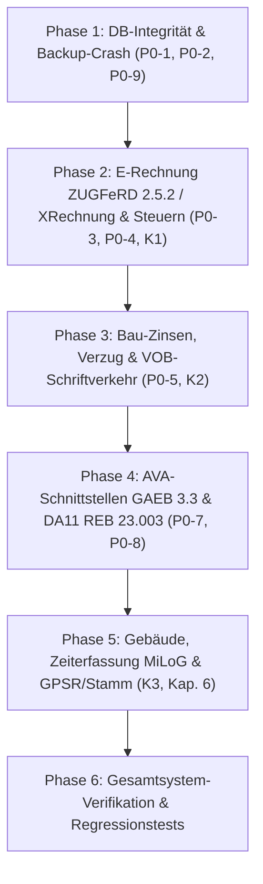

# Sanierungs- und Implementierungsplan: Code-Prüfung 2026-09-24
**Projekt:** W-Link ERP (Rechnungsprogramm für Handwerker & Gebäudedienstleister)  
**Bezugsdokumente:**  
- `doc/code-pruefung_subagents_2026-09-24.md` (Ursprüngliche Prüfung)  
- `doc/bewertung_code-pruefung_2026-09-24.md` (inkl. Bearbeitungsprotokoll Kap. 6 Muse Spark)  
**Stand:** 24. September 2026
**Bearbeitet:** 24.09.2026 — Muse Spark (OpenCode). Nachprüfung durch 3 Subagents. Korrekturen: Zinstabelle (2,27%/1,27%), BR-DE-5/6/7, EFB-W&G, GAEB-XSD-Pflicht, §640-Wortlaut, 6-Jahre-Frist, GPSR-EU-Person, Phase-5-Tests, Nachträge 3%-Cap/§650m/SEPA-36/Bindefrist, Aufwand 20–26h.  
**Ziel:** Schrittweise, verifizierte Beseitigung aller 17 MUSS-P0/P1-Befunde sowie Einarbeitung der nachgeprüften Normen-Updates (ZUGFeRD 2.5.2, Basiszins 1,52%, BEG IV 8 Jahre Aufbewahrung, REB-VB 23.003 Stellenplan, VOB/BGB-Fälligkeiten).

---

## 1. Übersicht der Phasen & Abhängigkeiten

Die Umsetzung erfolgt in 6 logischen, aufeinander aufbauenden Phasen. Jede Phase schließt mit automatisierten Tests ab:

---

## 2. Detaillierte Phasenplanung

### Phase 1: Datenbank-Fundament & Backup-Reparatur
**Fokus:** Datenverlust verhindern, Schema-Gleichheit herstellen, Rechnungsnummern-Eindeutigkeit garantieren.

1. **P0-1 & K1-1: Backup-Engine Spalten & CHECK-Werte korrigieren**
   - **Dateien:** `main/backup.js:128-135`, `schema.js:687,1480`
   - **Maßnahme:**
     - INSERT in `backup_history` auf echte DDL-Spalten umstellen: `dateiname`, `dateipfad`, `dateigroesse_bytes`, `dateigroesse_komprimiert_bytes`, `sha256_hash`, `trigger_type`, `retention_category`, `integrity_status`, `bemerkung`.
     - Status `'SUCCESS'` durch `'OK'` ersetzen.
     - CHECK-Constraint in `schema.js` erweitern um `('MANUAL', 'AUTO_SHUTDOWN', 'CRON', 'PRE_MIGRATION', 'PRE_RESTORE', 'AUTO_INTERVAL', 'RESTORE_ROLLBACK')`.
   - **Test:** `tests/backup.test.js` gegen echtes `createSchema` ausführen (nicht gegen lokales Test-DDL).

2. **P0-2: Eindeutigkeit Rechnungsnummern per Composite UNIQUE-Index**
   - **Dateien:** `schema.js:33-57`, `db.js:149`
   - **Maßnahme:**
     - Migration in `schema.js`: `CREATE UNIQUE INDEX IF NOT EXISTS idx_dokumente_type_nr ON dokumente(type, nr)`.
     - Dies erlaubt getrennte Nummernkreise für Rechnungen (`RE-2026-001`), Angebote (`ANG-2026-001`) und Lieferscheine (`LS-2026-001`), verhindert aber Dubletten innerhalb desselben Typs absolut.

3. **P0-9: State-Filter für Soft-Delete in `getFullState()`**
   - **Datei:** `db.js:497-498`
   - **Maßnahme:**
     - `kunden: await dbQuery('SELECT * FROM kunden WHERE COALESCE(is_deleted, 0) = 0')`
     - `artikel: await dbQuery('SELECT * FROM artikel WHERE COALESCE(is_deleted, 0) = 0')`
     - Sicherstellen, dass archivierte Kunden/Artikel beim Neustart nicht wieder in die Auswahllisten geladen werden.

---

### Phase 2: E-Rechnung (ZUGFeRD 2.5.2 / XRechnung 3.0.2), Steuern & GoBD
**Fokus:** Konformität mit EN 16931, KoSIT Schematron BR-DE und BMF-Vorgaben ab 2025/2026.

1. **P0-3: § 13b UStG Vorranglogik im Rechnungs-Controller**
   - **Datei:** `controllers/InvoiceController.js:58`
   - **Maßnahme:**
     - Umstellung von starrer UND-Logik auf Vorranglogik:  
       `const pos13b = (pos.is13b !== undefined && pos.is13b !== null) ? Boolean(pos.is13b) : isGlobal13b;`
     - Verhindert Divergenz zwischen Rechnungs-PDF (19%) und XML (0% Reverse Charge).
   - **Test:** Ergänzung in `tests/invoice_controller.test.js` für Mischrechnungen und globale 13b-Belege.

2. **P0-4: E-Rechnung Storno-TypeCode 381 & Leistungszeitraum**
   - **Datei:** `js/einvoice.js:520-545`
   - **Maßnahme:**
     - TypeCode dynamisch: Bei `typ === 'STORNO'` oder `isStorno` → `<ram:TypeCode>381</ram:TypeCode>` (Credit Note), sonst `380`.
     - Bei Storno: Hinzufügen von `<ram:InvoiceReferencedDocument>` (BT-25) mit Ursprungs-Rechnungsnummer und Datum (BT-26).
     - `<ram:ApplicableHeaderTradeDelivery>` mit `<ram:ActualDeliverySupplyChainEvent>` befüllen aus `leistungszeitraum_von` / `leistungszeitraum_bis` (BT-72 / BT-73).

3. **K1-14: B2G Verkäuferkontakt (KoSIT BR-DE-5/6/7 — KORREKTUR: im Plan stand fälschlich BR-DE-21)**
   - **Datei:** `js/einvoice.js:534-536`
   - **Maßnahme:**
     - In `<ram:SellerTradeParty>` den Pflichtknoten `<ram:DefinedTradeContact>` mit Ansprechpartner (BT-41), Telefon (BT-42) und E-Mail (BT-43) einbinden. Verhindert sofortigen Schematron-Abbruch bei Bundes-/Landesportalen.

4. **K1-12: Skonto-Konditionen in E-Rechnung (BT-20 / BG-20)**
   - **Datei:** `js/einvoice.js:485-497`
   - **Maßnahme:**
     - Wenn `skonto_tage` und `skonto_prozent` vorhanden: Übertragung in `<ram:SpecifiedTradePaymentTerms>` inklusive Skonto-Frist, Prozentsatz und formatiertem Text (BT-20). Kein starres "ohne Abzug".

5. **K1-4: Leitweg-ID Prüfziffernberechnung (ISO 7064 MOD 97-10)**
   - **Datei:** `js/einvoice.js:391-396` und `controllers/InvoiceController.js`
   - **Maßnahme:**
     - Vollständige Prüfziffern-Validierung für B2G-Rechnungen implementieren. Fehlerhafte Eingaben bereits im Editor mit klarer Meldung blockieren.

6. **K1-8: GoBD Hash-Vereinheitlichung**
   - **Datei:** `js/gobd.js:10-33`
   - **Maßnahme:**
     - Angleichung an `calculateDocumentContentHash` aus `main/audit.js`. Status-Änderungen (`status = 'BEZAHLT'`) dürfen den Inhalts-Hash des steuerlichen Belegs nicht brechen.

7. **K1-11 & K1-7: DATEV 13b-Heuristik & § 35a Handwerkerlohn (KORREKTUR: §§ 48–48d EStG, Bemessung inkl. USt)**
   - **Dateien:** `js/datev.js:196`, `js/einstellungen.js:722`
   - **Maßnahme:**
     - `datev.js`: Ausschließlich Belege mit `unterliegt_13b = 1` auf Konto 8337 buchen (keine Heuristik über Kundenstammdaten).
     - `einstellungen.js`: Handwerkerlohn (§ 35a EStG) aus echten Positionen der Kategorie `LOHN` / `FAHRT` summieren, Division `/ 1.19` entfernen.

8. **ZUGFeRD-Maßstab auf 2.5.2 (Stand 04.08.2026) aktualisieren**
   - **Dateien:** `doc/zugferd-validation.md`, Metadaten in `main/zugferd-builder.js`
   - **Maßnahme:**
     - XMP-Metadaten und Konformitätsdokumentation auf ZUGFeRD 2.5.2 / Factur-X 1.09.2 heben (EN 16931 Konformität).

---

### Phase 3: Bau-Zinsen, Verzugslogik & VOB-Schriftverkehr
**Fokus:** Rechtssicheres BGB-/VOB-Forderungsmanagement und fehlerfreie Musterschreiben.

1. **P0-5: Bundesbank-Basiszins 1,52% seit 01.07.2026**
   - **Dateien:** `controllers/BankingController.js:980,1041`, `tests/b2b_default_interest.test.js`
   - **Maßnahme:**
      - Historische Zinssatztabelle in `BankingController` hinterlegen (KORREKTUR 24.09.2026 — Bundesbank; im Plan standen fälschlich 2,77%/2,12%):
        - Bis 31.12.2024: 3,37%
        - 01.01.2025 – 30.06.2025: 2,27%
        - 01.07.2025 – 30.06.2026: durchgehend 1,27%
        - **Seit 01.07.2026: 1,52%** (aktuell gültig)
     - Default-Basiszins auf 1,52% setzen (B2B-Verzugszins: 10,52%, B2C: 6,52%).
     - Testsuite auf 1,52% aktualisieren.

2. **K2-5: Fälligkeit vs. Verzug & VOB/B-Fälligkeits-Helper**
   - **Datei:** `controllers/BankingController.js:1047-1061`
   - **Maßnahme:**
      - Entkopplung: Überschreitung des Fälligkeitsdatums setzt Status auf `FÄLLIG` (Zahlungserinnerung).
      - **KORREKTUR: 21/30 Tage sind Fälligkeit (§16 Abs.1 Nr.3 / Abs.3 Nr.1, 60 T nur bei Vereinbarung), nicht Verzug. Bei Verbrauchern 30-Tage-Verzug nur mit Hinweis (§286 Abs.3 BGB).**
      - Status `VERZUG` (40 € B2B-Pauschale nach § 288 Abs. 5 BGB und Zinsen) erst nach:
       - Nachweislicher Mahnung nach Fälligkeit (§ 286 Abs. 1 BGB), oder
       - 30 Tagen nach Zugang der Rechnung (§ 286 Abs. 3 BGB), oder
       - Bei VOB/B-Verträgen: Ablauf der 21 Kalendertage (Abschlag) bzw. 30 Kalendertage nach Prüffrist (Schlussrechnung gem. § 16 Abs. 5 Nr. 3 VOB/B).

3. **K2-17: EFB-Preisblatt 0%-AGK Bug**
   - **Datei:** `controllers/EFBController.js:657`
   - **Maßnahme:**
      - `agkPct = mergedProfile.agk_endsumme_prozent ?? 12.00;`
      - Nullish Coalescing Operator verhindert, dass legitime 0% AGK durch 12% überschrieben werden.
      - **KORREKTUR: gleiche `||`-Falle in `EFBController.js:661-663` (Wagnis/Gewinn 5.00/2.00/1.80) mit umstellen — 0% leistungsbezogenes Wagnis ist legitim.**

4. **K2-7 & K2-8: VOB-Musterbriefe (Abnahmefiktion & Verbraucherbelehrung)**
   - **Datei:** `controllers/VobCorrespondenceController.js:607-700`
   - **Maßnahme:**
     - Paragraphen korrigieren:
       - § 12 Abs. 5 Nr. 1 VOB/B: 12 Werktage nach schriftlicher Fertigstellungsmeldung.
       - § 12 Abs. 5 Nr. 2 VOB/B: 6 Werktage nach Beginn der Benutzung.
      - Gesetzliche Verbraucherbelehrung nach § 640 Abs. 2 Satz 2 BGB fest in die Vorlage für private Bauherren integrieren (ohne diese tritt die Abnahmefiktion beim Verbraucher nicht ein).
      - **KORREKTUR Wortlaut: „mindestens eines Mangels" (auch unwesentlich genügt), nicht „wesentlichen Mängeln". Textform-Nachweis (Zugang) vorsehen.**

---

### Phase 4: AVA-Schnittstellen (GAEB 3.3 & DA11 REB 23.003)
**Fokus:** Reibungsloser Datenaustausch mit Architekten, AVA-Systemen und Bauämtern.

1. **P0-7: GAEB X84 auf GAEB DA XML 3.3 heben**
   - **Datei:** `js/gaeb.js:96-111`
   - **Maßnahme:**
     - Veralteten Namespace `200407` und Fantasie-Tags ablösen.
      - Valides GAEB DA XML 3.3 Schema generieren:  
        `<GAEB xmlns="http://www.gaeb.de/GAEB_DA_XML/DA_XML_3.3">`, Standardknoten `<GAEBInfo>`, `<Award>`, `<BoQ>`, `<Itemlist>`.
      - **KORREKTUR: XSD-konforme BoQBody-Struktur (RNoPart, Qty/QU, TextOutl, UP …) + Validierung gegen offizielle GAEB-XSD + GAEB-Checker Pflicht (Pakete Stand 2023-01). Knoten allein unzureichend.**
      - Validierung gegen GAEB-Spezifikation sicherstellen.

2. **P0-8: DA11-Stellenplan nach REB-VB 23.003 & Vorzeichen-Fix**
   - **Datei:** `js/da11.js:20-26, 142-144`
   - **Maßnahme:**
     - Striktes Einhalten des REB-VB 23.003 Stellenplans für Satzart 11 (80 Zeichen Festbreite).
     - Transliteration von Umlauten (`ä` → `ae`) **vor** dem Zeichen-Padding durchführen, damit kein Spaltenversatz entsteht.
     - Vorzeichenlogik korrigieren: `Math.abs(parseFloat(z.ergebnis) || 0) * (vorzeichen < 0 ? -1 : 1)`. Verhindert, dass negative Abzüge ins Positive gekehrt werden.

---

### Phase 5: Gebäude-Module, Zeiterfassung & Stammdaten
**Fokus:** MiLoG-Sicherheit für den Zoll, praxisgerechte Einheiten und Aufbewahrungsfristen nach BEG IV.

1. **MiLoG § 17 7-Tage-Aufzeichnungsprüfung**
   - **Datei:** `controllers/ZeiterfassungController.js`
   - **Maßnahme:**
     - Beim Anlegen/Stempeln prüfen: Liegt `zeit_von` > 7 Kalendertage vor `created_at`?
     - Wenn ja: Intern als `VERSPAETET` flaggen und Warnung im UI anzeigen (Verstoß gegen § 17 Abs. 1 MiLoG / SchwarzArbG, Prüffeld der FKS).

2. **Aufbewahrungsfristen nach BEG IV (Stand 2025/2026)**
   - **Dateien:** `main/backup.js`, `js/einstellungen.js`
   - **Maßnahme:**
      - Anpassung der Fristenhinweise:
        - Rechnungsbelege: **8 Jahre** (§ 14b Abs. 1 UStG, § 147 Abs. 3 AO n.F. seit 01.01.2025).
        - Bücher, Inventare, Jahresabschlüsse: **10 Jahre** (§ 147 Abs. 3 Satz 2 AO).
        - Privatkunden bei grundstücksbezogenen Leistungen: **2 Jahre** (§ 14b Abs. 1 Satz 5 UStG).
        - **KORREKTUR: 6-Jahre-Kategorie (Handels-/Geschäftsbriefe, Angebote ohne Auftrag) + Fristbeginn (Schluss des Kalenderjahres) + Hemmung bei offener Festsetzungsfrist ergänzen — sonst falsche Löschautomatik.**

3. **Artikelstamm: Einheit & GPSR-Basisfelder**
   - **Dateien:** `schema.js:7-18`, `js/artikel.js:54, 189`
   - **Maßnahme:**
     - Spalte `einheit TEXT DEFAULT 'Stk.'` in Tabelle `artikel` einfügen.
     - Dropdown im Artikel-Modal für Standardeinheiten (`Stk.`, `Std.`, `m`, `m²`, `m³`, `psch.`, `kg`, `l`).
      - Optionale Minimalfelder nach GPSR Art. 12 für den Fall von Materialverkäufen an Verbraucher bereitstellen: `hersteller_name`, `hersteller_kontakt`, `charge_seriennummer`.
      - **KORREKTUR: EU-verantwortliche Person (Art.16/19 bei Drittstaat-Hersteller, Hauptabmahnrisiko) + Warnhinweise/Sicherheitsinfo + CE/DOC wo anwendbar ergänzen.**

---

### Phase 6: Gesamtsystem-Verifikation & Regressionstests
**Fokus:** Vollständige Testabdeckung aller behobenen Schwachstellen.

1. **Erweiterung der Testsuite:**
   - `tests/backup.test.js`: Backup & Restore gegen echte `createSchema`-Tabelle testen.
   - `tests/da11_export.test.js`: Spezifischer Test für Umlaute, negative Abzüge und 80-Zeichen-Festbreite.
   - `tests/invoice_controller.test.js`: Mischrechnungen mit 13b-Positionen und Storno-TypeCode 381.
   - `tests/b2b_default_interest.test.js`: Verifikation mit Basiszinssatz 1,52% und VOB/BGB-Fristen.
    - `tests/gaeb_validation.test.js`: Validierung des GAEB DA XML 3.3 Exports.
    - **KORREKTUR: Phase-5-Tests nachtragen (MiLoG-Flag, Einheit/GPSR, Fristen) — sonst Phase 5 unabgesichert.**
2. **Regressionstest-Lauf:**
   - Ausführung der Gesamtsuite mit `npm.cmd test`.
   - Sicherstellen, dass alle Tests grün sind und keine Regressionen auftreten.

---

## 3. Zeit- und Ressourcenplan

| Phase | Aufgaben | Aufwandsschätzung | Priorität |
|---|---|---|---|
| **Phase 1** | DB-Integrität, Backup-DDL & State-Filter | ca. 2–3 h | Höchste (P0) |
| **Phase 2** | E-Rechnung ZUGFeRD 2.5.2, Steuern & GoBD | ca. 4–5 h | Höchste (P0/P1) |
| **Phase 3** | Basiszins 1,52%, Verzug & VOB-Briefe | ca. 3–4 h | Hoch (P0/P1) |
| **Phase 4** | GAEB 3.3 & DA11 REB 23.003 | ca. 3–4 h | Hoch (P0) |
| **Phase 5** | MiLoG 7-Tage, Einheiten & BEG IV | ca. 2–3 h | Mittel (P1/Phase 2) |
| **Phase 6** | E2E- und Regressionsprüfung | ca. 2 h | Qualitätssicherung |

**KORREKTUR Aufwand: gesamt 20–26 h statt 16–21 h (MiLoG-Ausnahmen+Migration, GPSR-EU-Person, Phase-5-Tests, ~58 Testdateien).**

### Phase 5b: Nachträge aus Nachprüfung (Pflicht vor Freigabe)

1. **3%-Mängelsicherheit (VHB):** `InvoiceController.js:32,122-160` kennt nur 5%-Default — Trennung Vertragserfüllung 5% vs. Mängel 3% + Sperrkonto/18-Werktage-Hinweis §17 Abs.6 VOB/B.
2. **§650m 90%-Deckel:** Verbraucherbauvertrag Abschläge ≤90% inkl. Nachträge — Validierung in Editor/InvoiceController.
3. **SEPA-36-Monate-Verfall (EPC):** Warnung vor Lauferstellung nach 36 Monaten ohne Einzug (13 Monate Rückgabe §676b BGB).
4. **VOB/A §10 Bindefrist:** Feld + Ablaufwarnung (≤30 Kalendertage, Ende Kalendertag) + Bugfix `editor.js:736` „30 Arbeitstage" → Kalendertage.

---

## 4. Bereitstellung & Freigabe

Nach Bestätigung dieses Plans kann die Umsetzung unmittelbar mit **Phase 1 (Datenbank-Fundament & Backup-Reparatur)** beginnen.
